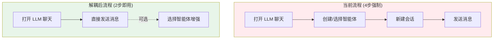

# Agent 与会话解耦实现方案

> **文档状态 (Status)**: `Draft`
> **版本 (Version)**: 1.0
> **日期 (Date)**: 2026-05-09
> **负责模块**: `llm-chat`

---

## 1. 背景与问题

### 1.1 核心痛点

目前 `llm-chat` 的底层逻辑将“智能体 (Agent)”与“会话 (Session)”进行了强绑定，导致了以下问题：

1. **冷启动障碍**：新用户进入工具后，必须先经历“创建智能体”的繁琐流程，否则无法开启任何对话。
2. **发送逻辑僵化**：发送消息的代码中强制检查 `currentAgentId`，若为空则拒绝发送，不支持“纯模型对话”场景。
3. **状态无法重置**：用户一旦在侧边栏或切换器中选定了某个智能体，就无法再回到“无智能体”的基本助手模式，因为 UI 缺少“取消选择”的操作。
4. **UI 逻辑分裂**：头部 UI 存在硬编码判断，导致在某些状态下（如临时会话）即便选中了智能体也不显示，而消息列表却在渲染智能体的预设内容，造成用户困惑。
5. **配置隔离缺失**：基本助手模式需要一种比普通 Agent 更轻量、更直接的配置方式，用于控制基础开关和美化字段。

### 1.2 预期目标

1. **支持基本助手模式**：会话创建和消息发送不再强制依赖智能体。
2. **虚拟智能体回退**：当未选择智能体时，系统在内存中实时构建一个“虚拟智能体”，提供基础能力（如工具调用支持），确保功能不失效。
3. **显式取消入口**：在智能体选择器中增加“取消选择（基本助手）”选项，允许用户随时重置状态。
4. **轻量级配置化**：为基本助手模式提供独立的配置弹窗，仅包含功能开关和美化字段。

---

## 2. 技术方案

### 2.1 存储层：支持取消选择 (`agentStore.ts`)

修改 `selectAgent` 方法，允许传入 `null` 来显式清除当前的智能体绑定。

```typescript
// src/tools/llm-chat/stores/agentStore.ts

async selectAgent(agentId: string | null): Promise<void> {
  const { currentAgentId } = useLlmChatUiState();

  if (agentId === null) {
    currentAgentId.value = null;
    logger.info("已进入基本助手模式（取消智能体选择）");
    return;
  }

  // 原有加载逻辑...
  currentAgentId.value = agentId;
}
```

### 2.2 逻辑层：发送逻辑解耦 (`useChatHandler.ts`)

提取 `getEffectiveAgentConfig` 函数。当没有选中的智能体时，不再抛出错误，而是根据以下优先级构建配置：

1. **会话级临时模型**（如果会话本身记录了当前想用的模型）。
2. **全局默认模型**（设置中心配置的模型）。
3. **兜底模型**（第一个可用的服务商模型）。

```typescript
// 虚拟 Agent 配置构建逻辑（伪代码）
const agentConfig = agentStore.currentAgentId
  ? agentStore.getAgentConfig(...)
  : buildVirtualAgentConfig(session, settings);
```

### 2.3 UI 层：增加重置入口 (`QuickAgentSwitch.vue`)

在智能体快速切换列表中，增加一个固定的“基本助手”选项。

- **位置**：列表最上方或最下方。
- **交互**：点击后调用 `selectAgent(null)`。
- **视觉**：当 `currentAgentId` 为空时，此项呈现激活状态。

### 2.4 核心配置：虚拟智能体结构设计 (`buildVirtualAgentConfig`)

当进入基本助手模式时，系统需在内存中构造一个符合 `ChatAgent` 接口的虚拟对象。其核心目标是满足上下文管道对锚点的依赖。

**预设消息骨架 (Preset Messages Skeleton)**:
为了实现极致简洁，虚拟 Agent 默认仅保留历史记录锚点。这确保了即便不注入人设，工具调用（Tool Calling）等核心 Pipeline 逻辑仍能通过锚点定位正常工作。

```typescript
[
  {
    id: "virtual-anchor-history",
    role: "system",
    content: "",
    type: "chat_history", // ANCHOR_IDS.CHAT_HISTORY
  },
];
```

_注：若用户在设置中关闭了所有增强功能，该列表甚至可以为空，此时上下文管道将仅包含原始历史记录。_

**默认能力配置**:

- `toolCallConfig`: 默认关闭 `enabled: false`，以保持初始状态干净。
- `autoInjectIfMacroMissing`: 默认 `true`（一旦开启则自动注入）。
- `parameters`: 继承自全局设置或会话覆盖。

### 2.5 存储与持久化：基本助手配置管理

为了确保基本助手的修改能够持久化，且不侵入现有的 `ChatSettings`（全局 UI 偏好）或 `Agent`（独立文件系统），将采用 `ConfigManager` 建立独立的配置管理。

- **存储位置**: `appDataDir/llm-chat/assistant.json`
- **配置结构 (`BasicAssistantConfig`)**:
  ```typescript
  export interface BasicAssistantConfig {
    /** 显示名称（默认：助手） */
    displayName: string;
    /** 头像（Emoji 或图片路径） */
    icon: string;
    /** 是否开启工具调用（默认：false） */
    toolCallEnabled: boolean;
  }
  ```
- **技术实现**:
  - 在 `stores/` 或 `composables/` 中实例化 `createConfigManager`。
  - 初始化时调用 `load()`，修改时调用 `saveDebounced()`。

### 2.6 UI 层：基本助手配置弹窗 (`BasicAssistantSettingsDialog.vue`)

为基本助手模式设计专属的轻量级配置界面。

- **配置项**: 对应上述 `BasicAssistantConfig` 字段。
- **交互**: 点击弹窗“保存”后，同步更新内存状态并触发 `ConfigManager` 持久化。
- **入口**: 在基本助手模式下的 `ChatArea.vue` 头部显示设置图标。

### 2.7 UI 层：头部状态一致性 (`ChatArea.vue`)

修正 `currentAgent` 计算属性，移除不合理的过滤逻辑。

- **逻辑**：只要 `agentStore.currentAgentId` 有值，头部就必须显示该智能体的信息。
- **基本助手模式表现**：如果没有选中智能体，显示 `BasicAssistantConfig` 中的头像和名称，并提供配置入口。

### 2.8 UI 层：消息渲染适配 (`MessageHeader.vue`)

优化消息头部的解析逻辑，确保在无 Agent 绑定时依然能正确显示。

- **逻辑**：优先使用元数据快照；若快照缺失且无 `agentId`，则回退到 `basicAssistantConfig`。

---

## 3. 执行计划

| 步骤 | 任务内容                                            | 涉及文件                            |
| :--- | :-------------------------------------------------- | :---------------------------------- |
| 1    | 修改 Store 状态，支持 `currentAgentId` 为 `null`    | `agentStore.ts`                     |
| 2    | 实现基本助手配置持久化 (ConfigManager)              | `composables/useAssistantConfig.ts` |
| 3    | 实现发送逻辑中的虚拟配置回退，移除强制 Agent 检查   | `useChatHandler.ts`                 |
| 4    | 实现基本助手配置弹窗 `BasicAssistantSettingsDialog` | `BasicAssistantSettingsDialog.vue`  |
| 5    | 在 `QuickAgentSwitch.vue` 中添加“取消选择”按钮      | `QuickAgentSwitch.vue`              |
| 6    | 修正 `ChatArea.vue` 头部显示逻辑，增加设置入口      | `ChatArea.vue`                      |
| 7    | 在智能体侧边栏右键菜单增加“取消选择”快捷操作        | `AgentsSidebar.vue`                 |

---

## 4. 风险评估

- **工具调用兼容性**：需要确保在"基本助手模式"下，基础工具（如文件读取）依然能通过虚拟配置正常工作。
- **预设消息缺失**：基本助手模式没有 `presetMessages`。需确保在零预设场景下，上下文管道（Pipeline）依然能正确挂载历史记录，且工具调用所需的保底宏（如 `{{tools}}`）能通过虚拟配置正常注入。

---

## 5. 用户流程体验影响评估

### 5.1 当前流程 vs 解耦后流程对比



| 维度               | 当前状态                            | 解耦后状态                  | 改善幅度 |
| :----------------- | :---------------------------------- | :-------------------------- | :------- |
| 最短操作步骤       | 4步（开工具→建Agent→建会话→发消息） | 2步（开工具→发消息）        | -50%     |
| 冷启动认知负荷     | 高（需理解"智能体"概念）            | 低（像普通聊天框一样）      | 显著降低 |
| 首次交互时间 (TTI) | ~20秒（从预设中选取并创建或自己写） | ~5秒（打开即用）            | -92%     |
| 状态灵活性         | 单向绑定（绑定后无法解除）          | 双向切换（可绑定 / 可重置） | 新增能力 |

### 5.2 用户旅程场景分析

#### 场景 A：纯新用户（从未用过 LLM 工具）

| 阶段     | 当前体验                                                                     | 解耦后体验                                       |
| :------- | :--------------------------------------------------------------------------- | :----------------------------------------------- |
| 初见     | 看到空白界面，提示"请先创建智能体"。用户困惑："智能体是什么？我只想问个问题" | 看到输入框和欢迎提示，直接可以打字发送           |
| 首次发送 | 被阻断。必须点侧边栏→添加智能体→选预设→配模型→确认→再发送                    | 直接按 Ctrl+Enter 发送，系统自动使用全局默认模型 |
| 学习曲线 | 陡峭：必须先理解 Agent 概念才能完成第一次对话                                | 平缓：先体验对话，再逐步发现 Agent 增强          |

**结论**：解耦方案将 LLM 聊天的**准入门槛从"配置驱动"降至"开箱即用"**，对新用户留存率有正向预期。

#### 场景 B：轻度用户（偶尔问 AI 问题）

- **当前**：每次想快速问个问题，都得先选 Agent 才能开口。
- **解耦后**：基本助手模式就是他们的默认选择。打开→打字→走人，零认知开销。

#### 场景 C：重度用户（多 Agent 场景管理）

- **当前**：一旦绑定了某个 Agent，无法切回"干净"模式做快速验证。
- **解耦后**：可随时在 QuickAgentSwitch 中选择"基本助手"重置到零配置状态，完成验证后再切回。

### 5.3 对现有用户文档的具体影响

#### 5.3.1 `docs/user-guide/getting-started.md` — 需要重写第3节

**当前内容（第41-46行）**：

```markdown
## 3. 开始对话

1. 回到主页，点击 LLM 聊天 卡片
2. 左侧会看到智能体列表——点底部的添加智能体，选个预设或从空白创建...
3. 选中智能体后，点右侧列表顶部的 + 新建一个对话
4. 在底部输入框打字，按 Ctrl + Enter 发送
```

**解耦后建议改为**：

```markdown
## 3. 开始对话

1. 回到主页，点击 LLM 聊天 卡片
2. 在底部输入框打字，按 Ctrl + Enter 发送——就这么简单！

> 💡 首次发送时，系统会自动使用你在步骤 2 中配好的 AI 服务。
> 想要更个性化？试试左侧的「智能体」功能，预设角色和参数后一键切换。
```

**影响评估**：

- 核心步骤从 4 步缩减为 2 步
- "智能体"从**前置必须步骤**降级为**可选增强提示**
- 新用户的心智模型变为：`聊天 = 打字就能用`，`Agent = 高级玩家的增强`

#### 5.3.2 `docs/user-guide/tools/llm-chat/index.md` — 更新"开始第一次对话"

**当前内容（第18-24行）**：

```markdown
## 开始第一次对话

1. 打开 LLM 对话工具
2. 确认已配置 AI 服务
3. 选择或创建 Agent：首次使用会自动创建默认的「助手」Agent
4. 在输入框打字，按 Ctrl + Enter 发送
```

**解耦后建议改为**：

```markdown
## 开始第一次对话

1. **打开 LLM 对话工具**：从主页点击 LLM 聊天卡片
2. **确认已配置 AI 服务**：如未配置，先去设置中添加
3. **在输入框打字**：按 Ctrl + Enter 发送，系统以"基本助手"模式开始对话

> 💡 基本助手模式零配置即可使用。需要角色扮演或参数调优？切换到左栏的「智能体」面板选择或创建 Agent。
```

#### 5.3.3 需要新增的文档

| 文档                                                | 内容                                            |
| :-------------------------------------------------- | :---------------------------------------------- |
| `docs/user-guide/tools/llm-chat/basic-assistant.md` | 基本助手模式说明、配置弹窗介绍、与 Agent 的区别 |
| 更新 `agents.md`                                    | 增加"取消选择"操作的说明                        |

### 5.4 潜在 UX 风险与缓解措施

| 风险         | 描述                                                      | 缓解措施                                                                             |
| :----------- | :-------------------------------------------------------- | :----------------------------------------------------------------------------------- |
| 概念混淆     | 用户不清楚"基本助手"和"Agent"的边界                       | 在 QuickAgentSwitch 的"基本助手"项下方添加灰色副标题：`无角色预设，使用全局默认模型` |
| 模型选择盲区 | 基本助手模式下用户可能不知道当前用的是哪个模型            | 在 ChatArea 头部显示当前生效的模型名称，点击可跳转到模型参数设置                     |
| 功能发现不足 | 新用户可能永远停留在基本助手，不知道 Agent 系统的强大能力 | 首次对话完成后，在消息区底部显示一次性引导卡片：`试试智能体功能，为 AI 赋予专业角色` |
| 会话归属模糊 | 基本助手创建的会话后续切换到 Agent 时，上下文可能不一致   | 切换 Agent 时弹出确认：`切换后新消息将使用新角色的预设，是否继续？`                  |

### 5.5 总体评估结论

| 指标           | 评分                | 说明                                       |
| :------------- | :------------------ | :----------------------------------------- |
| 新用户上手体验 | ⭐⭐⭐⭐⭐          | 从"必须先学概念"到"开箱即用"，质变提升     |
| 现有用户影响   | ⭐⭐⭐⭐            | 不破坏现有 Agent 工作流，增加灵活性        |
| 文档维护成本   | ⭐⭐⭐              | 需更新 2 份文档 + 新增 1 份，工作量适中    |
| 实现复杂度     | ⭐⭐⭐              | 技术方案清晰，主要是解绑 + 回退逻辑        |
| 综合推荐度     | ✅ **强烈推荐实施** | 低风险高收益，核心痛点直接命中用户流失原因 |

**一句话总结**：此方案将 LLM 聊天工具从"配置驱动型"转变为"体验驱动型"——先让用户"用起来"，再让他们"用好了"。这是一个**对新用户留存率有决定性影响**的优化。
