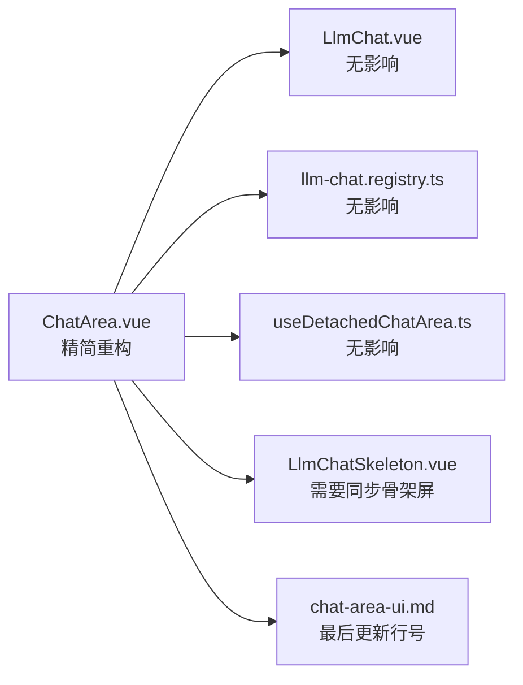
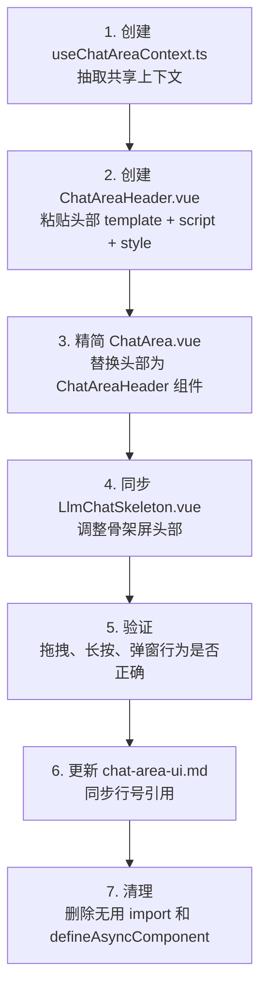

# ChatArea 重构计划

> **状态**: Draft | **创建**: 2026-06-05 | **修订**: 2026-06-05 | **涉及文件**: `ChatArea.vue`, `ChatAreaHeader.vue` (新建), `useChatAreaContext.ts` (新建)

---

## 1. 现状分析

[`ChatArea.vue`](../../components/ChatArea.vue) 当前约 **1400 行** (`script: 740` + `template: 270` + `style: 390`)，承载了 6 个维度的逻辑，是一个典型的"巨石组件"：

1. **智能体与模型解析** — 从 Store 中解析当前 Agent、Model、User Profile 及其头像
2. **样式与渲染配置计算** — Markdown 样式合并、头部毛玻璃背景色、内容宽度限制
3. **窗口拖拽与分离控制** — Tauri 拖拽分离、菜单分离、右下角缩放手柄
4. **滚动与导航状态管理** — 消息数量监听、是否在底部判断、上下键导航
5. **键盘快捷键监听** — Ctrl+F 搜索、上下方向键导航
6. **业务弹窗与交互** — 智能体编辑/快速切换、模型选择、用户档案编辑、聊天设置

---

## 2. 重构目标

- **`ChatArea.vue` 控制在 800 行以内**，方便 AI 施工
- **只拆最重要的部分**，避免过度碎片化
- **Composable 共享上下文**，减少 props 胶水代码
- **不影响现有行为**，纯代码重组

---

## 3. 影响范围调查

重构将影响以下文件和组件：

### 3.1 直接引用 `ChatArea.vue` 的文件

| 文件                                                             | 引用方式                                           | 影响       | 备注                                      |
| ---------------------------------------------------------------- | -------------------------------------------------- | ---------- | ----------------------------------------- |
| [`LlmChat.vue`](../../LlmChat.vue:19)                            | `import ChatArea from "./components/ChatArea.vue"` | **无影响** | import 路径不变，props 接口不变           |
| [`llm-chat.registry.ts`](../../llm-chat.registry.ts:219)         | `() => import("./components/ChatArea.vue")`        | **无影响** | 动态导入路径不变，分离组件按需加载        |
| [`useDetachedChatAreaAdapter`](../../llm-chat.registry.ts:66-85) | props 适配器注入                                   | ✅ 更健壮  | Context 兼容 props 驱动，分离窗口不受影响 |

### 3.2 通过 props 与 `ChatArea.vue` 通信的文件

#### [`LlmChat.vue`](../../LlmChat.vue:447-463)

传递以下 props 和 emits：

- `props`: `messages`, `isSending`, `disabled`, `currentAgentId`, `currentModelId`
- `emits`: `send`, `abort`, `complete-input`, `select-continuation-model`, `clear-continuation-model`

**影响**: `ChatArea` 的 props 接口保持不变，`LlmChat.vue` **完全不需要修改**。

#### [`llm-chat.registry.ts`](../../llm-chat.registry.ts:66-85) `useDetachedChatAreaAdapter`

```typescript
props: computed(() => ({
  isDetached: true,
  messages: chatArea.messages.value,
  isSending: chatArea.isSending.value,
  disabled: chatArea.disabled.value,
  currentAgentId: chatArea.currentAgentId.value,
  currentModelId: chatArea.currentModelId.value,
})),
```

**影响**: `ChatArea` 的 props 接口保持不变，`llm-chat.registry.ts` **完全不需要修改**。

### 3.3 需要同步修改的文件

| 文件                                                             | 原因                                                           | 改动量                      |
| ---------------------------------------------------------------- | -------------------------------------------------------------- | --------------------------- |
| [`LlmChatSkeleton.vue`](../../components/LlmChatSkeleton.vue:35) | 骨架屏模拟了 ChatArea 头部布局，重构后需同步调整 skeleton 头部 | **低** — 保持模拟结构即可   |
| [`chat-area-ui.md`](../../docs/architecture/chat-area-ui.md)     | 架构文档引用了 ChatArea.vue 的具体行号                         | **低** — 只在最终验证后更新 |

### 3.4 无需修改的文件

- [`useDetachedChatArea.ts`](../../composables/ui/useDetachedChatArea.ts) — 只提供 computed 数据，不涉及 ChatArea 组件结构
- [`useLlmChatStateConsumer.ts`](../../composables/ui/useLlmChatStateConsumer.ts) — 只负责状态同步，不关心 UI
- 所有 Store 文件 — 逻辑不变

### 3.5 影响总结



**核心结论**: 重构 `ChatArea.vue` 的影响面极小，只需同步 2 个文件（`LlmChatSkeleton.vue` + `chat-area-ui.md`），且改动量都很小。

---

## 4. 文件结构

```
components/
  ChatArea.vue              (~700行，精简后)  ← 减少约 700 行
  ChatAreaHeader.vue        (~500行，新建)    ← 拆出头部 template + script + style
composables/
  useChatAreaContext.ts      (~220行，新建)    ← 共享上下文（Session-Aware Context）
```

### 4.1 新增文件说明

#### `ChatAreaHeader.vue`

从 `ChatArea.vue` 中完全拆出的头部区域，包含：

- **Template**: 整个 `.chat-header` div（智能体、模型、用户档案信息、操作按钮、`ComponentHeader` 分离手柄）
- **Script**:
  - 长按快捷切换智能体 (`onLongPress`、`handleAgentInfoClick`)、各计算属性
  - 响应式文本显示控制 (`showModelName` 等)
  - 头部样式计算 (`chatHeaderStyle`)
  - **`useWindowResize` + `createResizeHandler`**（分离模式的缩放手柄）
  - `useThemeAppearance` 导入
- **Style**: 头部相关所有 CSS（`.chat-header`、`.agent-model-info`、`.header-actions`、各 `.agent-info` / `.model-info` 等）

> ⚠️ **拖拽分离逻辑保留在 `ChatArea.vue`**：见 §8.1 详细说明。

**Props**（从父组件获取的外部状态）：

```typescript
interface Props {
  containerWidth: number; // 来自父组件的 useElementSize
  isDetached: boolean; // 来自 ChatArea 的 props
}
```

**Emits**（向父组件发出的事件）：

```typescript
interface Emits {
  (e: "resize-start", handler: ReturnType<typeof createResizeHandler>): void;
}
```

#### `useChatAreaContext.ts`

**核心设计**: **非单例模式（Instance Context）**。利用 Vue 的 `provide` / `inject` 机制在 `ChatArea.vue`（提供者）与 `ChatAreaHeader.vue`（消费者）之间共享上下文。这避免了全局单例在多窗口/多会话并行时的状态冲突。

**关于 sessionId**：当前阶段不作为外部参数传入。Context 内部通过 `llmChatStore.currentSessionId` 直接读取。未来多会话架构确定后，再将其改为参数注入。

```typescript
// composables/useChatAreaContext.ts 核心接口设计

import type {
  Agent,
  UserProfile,
  AgentEditData,
  ChatMessageNode,
  Model,
} from "../types";

export interface ChatAreaContext {
  // ===== 实体解析 =====
  currentAgent: ComputedRef<Agent | null>;
  currentModel: ComputedRef<Model | null>;
  effectiveUserProfile: ComputedRef<UserProfile | null>;
  agentAvatarSrc: ComputedRef<string>;
  userProfileAvatarSrc: ComputedRef<string>;

  // ===== 弹窗状态 =====
  // 在 Context 中统一管理，Header 可触发，ChatArea 可挂载弹窗
  showEditAgentDialog: Ref<boolean>;
  initialEditTab: Ref<string | undefined>;
  initialEditSection: Ref<string | undefined>;
  showEditProfileDialog: Ref<boolean>;
  showQuickActionManager: Ref<boolean>;
  showChatSettings: Ref<boolean>;
  showSearchPanel: Ref<boolean>;

  // ===== 动作处理器 =====
  handleEditAgent: (tab?: string, section?: string) => void;
  handleSelectModel: () => void;
  handleSaveAgent: (
    data: AgentEditData,
    options?: { silent?: boolean; agentId?: string }
  ) => void;
  handleQuickSwitchAgent: (agentId: string) => void;
  handleSaveUserProfile: (
    updates: Partial<Omit<UserProfile, "id" | "createdAt">>
  ) => void;
  handleEditUserProfile: () => void;
}

const CHAT_AREA_CONTEXT_KEY = Symbol("ChatAreaContext");

/**
 * 在父组件 ChatArea.vue 中初始化并提供上下文。
 *
 * 参数通过 props 的 computed 传入，以兼容分离窗口（props 由 adapter 注入）
 * 和主窗口（props 由 LlmChat.vue 传入）两种模式。
 */
export function provideChatAreaContext(options: {
  currentAgentId: ComputedRef<string | undefined>;
  currentModelId: ComputedRef<string | undefined>;
}): ChatAreaContext {
  const { currentAgentId, currentModelId } = options;

  // 基于传入的 currentAgentId/currentModelId 驱动
  const currentAgent = computed(() => {
    const agentId = currentAgentId.value;
    if (!agentId) return null;
    return agentStore.getAgentById(agentId);
  });

  // sessionId 当前从 Store 直接读取
  // 未来多会话架构确定后可通过参数注入
  const sessionId = computed(() => llmChatStore.currentSessionId);

  // ... 其余 computed 均通过传入的 props-computed 推导

  const context: ChatAreaContext = {
    currentAgent,
    // ...
  };
  provide(CHAT_AREA_CONTEXT_KEY, context);
  return context;
}

/** 在子组件 ChatAreaHeader.vue 中注入上下文 */
export function useChatAreaContext(): ChatAreaContext {
  const context = inject<ChatAreaContext>(CHAT_AREA_CONTEXT_KEY);
  if (!context) {
    throw new Error(
      "useChatAreaContext must be used within a ChatArea component"
    );
  }
  return context;
}
```

管理的内容：

- **实体解析**: `currentAgent`、`currentModel`、`effectiveUserProfile`、头像 src（全部基于传入的 `currentAgentId`/`currentModelId` 动态计算）
- **弹窗状态**: `showEditAgentDialog`、`showEditProfileDialog`、`showQuickActionManager`、`showChatSettings`、`showSearchPanel`（在 Context 实例中独立维护，支持多窗口独立弹窗）
- **动作处理器**: `handleEditAgent`、`handleSelectModel`、`handleSaveAgent`、`handleQuickSwitchAgent`、`handleSaveUserProfile`

---

## 5. 迁移内容清单

### 从 `ChatArea.vue` 转移到 `ChatAreaHeader.vue` 的内容

**Script 部分**（约 180 行）：

- ✅ `agentInfoRef`、`isLongPressConsumed`、`isAgentSwitchVisible`、`agentSwitchPosition`
- ✅ `onLongPress` 调用 + `handleAgentInfoMouseDown` + `handleAgentInfoClick`
- ✅ `showViewModeText`、`showModelName`、`showProfileName`、`showAgentName` 计算属性
- ✅ `chatHeaderStyle` 计算属性
- ✅ `useWindowResize` + `createResizeHandler`（分离模式的缩放手柄）
- ✅ `useThemeAppearance` 导入
- ❌ `handleQuickSwitchAgent` (移至 context)
- ❌ `handleDragStart`、`handleDetach`（保留在父级，见 §8.1）
- ❌ `useDetachable`（保留在父级）

**Template 部分**（约 175 行，第 758-894 行 + 963-972 行）：

- ✅ 整个 `.chat-header` 及其内部所有子元素
- ✅ `ComponentHeader`（分离手柄）
- ✅ `QuickAgentSwitch` 组件（与头部逻辑强绑定）
- ✅ 右下角 `.window-resize-indicator`（分离模式缩放手柄，随头部拆出）
- ❌ `FlowTreeGraph`（保持在父级，是 viewMode 切换的一部分，不属头部）

**Style 部分**（约 250 行）：

- ✅ 从 `.chat-header` 开始的头部相关样式
- ✅ `.agent-model-info`、`.header-actions`、`.agent-info`、`.model-info`、`.user-profile-info`
- ✅ `.agent-name`、`.model-name`、`.profile-name`、`.model-icon`、`.header-action-button`
- ✅ `.detachable-handle`、`.model-invalid`
- ✅ `.window-resize-indicator`、`.indicator-border`、`.indicator-handle` 分离模式缩放手柄样式
- ✅ `.detached-mode` 下 `-webkit-app-region` 相关样式（拖拽区域控制）

### 转移到 `useChatAreaContext.ts` 的逻辑

- ✅ `currentAgent`、`currentModel`、`effectiveUserProfile`、`agentAvatarSrc`、`userProfileAvatarSrc`
- ✅ `handleEditAgent`、`handleSelectModel`、`handleSaveAgent`、`handleQuickSwitchAgent`
- ✅ `handleSaveUserProfile`、`handleEditUserProfile`
- ✅ 弹窗状态 ref（`showEditAgentDialog`、`showEditProfileDialog` 等）

---

## 6. 行数估算

| 文件                           | Script | Template | Style | 总计        |
| ------------------------------ | ------ | -------- | ----- | ----------- |
| `ChatArea.vue` (精简后)        | ~350   | ~100     | ~200  | **~650** 🎯 |
| `ChatAreaHeader.vue` (新建)    | ~180   | ~175     | ~250  | **~605**    |
| `useChatAreaContext.ts` (新建) | ~220   | —        | —     | **~220**    |

> 注: `ChatArea.vue` 的 Script 仍包含：消息事件处理、滚动/键盘导航、渲染配置稳定化、拖拽分离逻辑、`onMounted` 初始化等。Style 包含容器布局、壁纸层、消息列表区域等非头部样式。精简后约 650 行，满足"800 行以内"的目标。

---

## 7. 实施步骤



---

## 8. 注意事项与陷阱

### 8.1 拖拽分离逻辑**保留在 `ChatArea.vue`**（修订决策）

> ⚠️ 早期方案计划将拖拽逻辑"彻底剥离"到 `ChatAreaHeader`，通过 `closest('.chat-area-container')` 获取容器尺寸。经审查发现此方案有 DOM 层级依赖风险。

**现行方案**：`handleDragStart`、`handleDetach` 及 `useDetachable` **保留在 `ChatArea.vue`**。

**原因**：

1. `handleDragStart` / `handleDetach` 需要 `containerRef`（ChatArea 的根 DOM）来计算容器尺寸和偏移量
2. 它还需要 `headerRef`（`ComponentHeader` 实例）调用 `getDetachableConfig(e)` 和获取 `$el` 矩形
3. 如果移到 `ChatAreaHeader`，`ComponentHeader` 的 `$el` 和 `ChatAreaHeader` 的根 `$el` 可能不一致，导致偏移量计算错误
4. 用 `closest` 获取容器虽然理论可行，但要假设 DOM 结构稳定，且无法在编译期保证

**实现方式**：

- `ChatAreaHeader` 通过 `ref` 暴露 (`defineExpose`) 其内部 `ComponentHeader` 的引用
- `ChatArea.vue` 通过 `chatAreaHeaderRef.value.headerRef` 访问 `ComponentHeader`
- 拖拽相关事件仍由 `ChatArea.vue` 的 `ComponentHeader` 上的 `@mousedown` 和 `@detach` 触发，但 `ComponentHeader` 在 `ChatAreaHeader` 的 template 中渲染
- **`ChatAreaHeader` emit 拖拽事件到父组件**，由父组件 `ChatArea.vue` 处理实际的分离逻辑

```vue
<!-- ChatAreaHeader.vue -->
<ComponentHeader
  ref="headerRef"
  ...
  @mousedown="emit('drag-start', $event)"
  @detach="emit('detach')"
/>

<!-- ChatArea.vue -->
<ChatAreaHeader
  ref="chatAreaHeaderRef"
  ...
  @drag-start="handleDragStart"
  @detach="handleDetach"
/>
```

`ChatArea.vue` 中的 `handleDragStart` / `handleDetach` 通过 `chatAreaHeaderRef.value.headerRef` 获取 `ComponentHeader` 实例：

```typescript
const chatAreaHeaderRef = ref<InstanceType<typeof ChatAreaHeader>>();

const handleDragStart = (e: MouseEvent) => {
  if (props.isDetached) return;
  const headerComp = chatAreaHeaderRef.value?.headerRef;
  if (!headerComp) return;
  const config = headerComp.getDetachableConfig(e);
  // ... 同现有逻辑
};
```

### 8.2 `bus.onActionRequest` 注册明确留在 `ChatArea.vue`

`onMounted` 中的 `bus.onActionRequest('llm-chat-ui', ...)` 处理以下 UI 操作：

- `select-continuation-model` → emit 事件
- `open-agent-settings` → 调用 `context.handleEditAgent()`
- `open-quick-action-manager` → 设置 `context.showQuickActionManager.value = true`

**归属决策**：保留在 `ChatArea.vue` 的 `onMounted` 中，通过 `context` 对象访问弹窗状态和动作处理器。这样：

1. 避免在 `ChatAreaHeader` 中注册 bus handler（子组件不应承担全局事件协调职责）
2. Context 的弹窗状态是 Ref，`ChatArea.vue` 可以直接读写
3. `emit('select-continuation-model')` 必须从 `ChatArea.vue` 发出（它是 props/emit 的持有者）

### 8.3 保留在 `ChatArea.vue` 的内容

- `useDetachable`、`handleDragStart`、`handleDetach` 及 `invoke` 调用
- `detachedComponents` 和 `isInputVisible` 计算属性（与 `MessageInput` 的渲染逻辑耦合）
- `useElementSize(containerRef)` → `containerWidth` 通过 props 传给 `ChatAreaHeader`
- 消息列表相关逻辑（`MessageList`、`MessageNavigator`、`MessageInput`、`ToolCallingApprovalBar`）
- `FlowTreeGraph` 力导向图视图渲染
- 业务弹窗 `<template>` 挂载点（`EditAgentDialog` 等），状态和动作由 Context 提供
- 渲染配置稳定化（`stableLlmThinkRules` 等 shallowRef + watch）
- 滚动/键盘导航逻辑
- `onMounted` 初始化（`initAgentAssetCache`、`loadSettings`、`bus.onActionRequest`）

### 8.4 `sessionId` 策略说明

当前代码中 `sessionId` 仅在 `handleQuickSwitchAgent` 中使用（`agentStore.selectAgent(agentId, { sessionId: llmChatStore.currentSessionId })`）。

**当前阶段**：`useChatAreaContext` 内部直接从 `llmChatStore.currentSessionId` 读取，不作为外部参数。接口中不暴露 `sessionId`。

**未来演进**：当多会话架构 RFC 确定后（如需要同一窗口展示多个 ChatArea 各自对应不同 session），再将 `sessionId` 改为 `provideChatAreaContext` 的参数注入。届时只需修改 Context 内部实现，对消费者无影响。

### 8.5 其他注意事项

- `agentInfoRef` 是 `ChatAreaHeader` 组件内 `ref`，不需要在父组件中暴露
- **多实例隔离**: 通过 `provideChatAreaContext({ currentAgentId, currentModelId })` 传入当前组件实例对应的 props-computed，确保了在多窗口、多会话并行渲染时，每个 `ChatArea` 及其子组件 `ChatAreaHeader` 拥有完全隔离的上下文状态
- `ChatAreaHeader` 通过 `defineExpose({ headerRef })` 暴露内部的 `ComponentHeader` 引用给父组件使用
