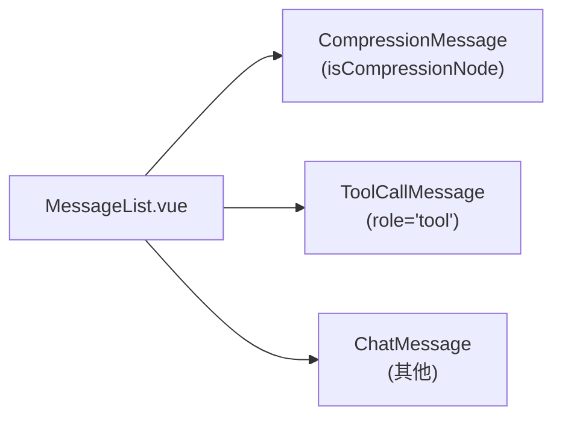
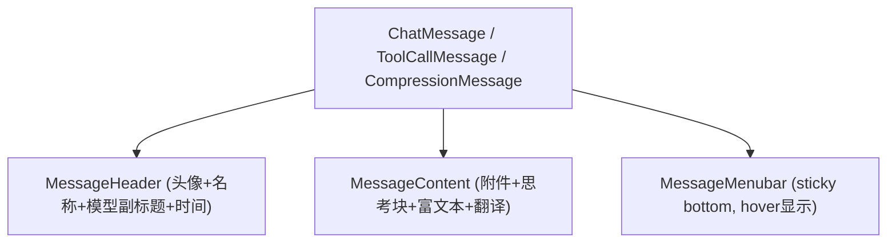

# 聊天气泡模式 (Bubble Mode) 调查与设计方案

> 状态：**Draft** · 作者：咕咕 / Architect
> 关键词：bubble · layout · alignment · system-message · tool-message

---

## 0. 任务背景

姐姐希望为聊天界面增加 **气泡模式 (Bubble Mode)** 作为现有"卡片模式 (Card Mode)"的可切换替代方案，核心诉求：

1. **System 消息**：居中显示（窄一些，作为分隔/旁白）
2. **User / Assistant 消息**：可配置左右对齐方向（IM 风格气泡）
3. **气泡宽度**：可配置最大宽度（避免单条消息撑满全屏导致阅读不便）
4. **Tool 消息**：贴在"上方相邻气泡的底部"，作为附属块（不是独立气泡）

---

## 1. 现状调查

### 1.1 消息列表渲染入口

[`MessageList.vue`](src/tools/llm-chat/components/message/MessageList.vue:543) 内部对三种消息类型做了类型分发：



容器结构 [`MessageList.vue:710-714`](src/tools/llm-chat/components/message/MessageList.vue:710)：

```css
.messages-container {
  display: flex;
  flex-direction: column;
  gap: 8px;
}
```

**关键观察**：当前每条消息占满父容器宽度，组件本身没有"对齐方向"的概念。

### 1.2 三类消息组件的样式特征

| 组件     | 文件                                                                                         | 布局特征                                    | 背景 / 边框                                 |
| -------- | -------------------------------------------------------------------------------------------- | ------------------------------------------- | ------------------------------------------- |
| 普通消息 | [`ChatMessage.vue`](src/tools/llm-chat/components/message/ChatMessage.vue:298)               | `display: flow-root` · padding 16px         | `card-bg` + `border-radius: 8px` + 实线边框 |
| 工具消息 | [`ToolCallMessage.vue`](src/tools/llm-chat/components/message/ToolCallMessage.vue:1143)      | `display: flex` · 左侧 20px 装饰条 + 内容区 | 同上，左侧 status-color 装饰条              |
| 压缩节点 | [`CompressionMessage.vue`](src/tools/llm-chat/components/message/CompressionMessage.vue:374) | flex + 左装饰条                             | 同上，但边框是 `dashed`                     |

**共性**：

- 都使用分块渲染 `backdrop-filter`（[`BLOCK_SIZE = 2000px`](src/tools/llm-chat/components/message/ChatMessage.vue:86) 规避浏览器对大尺寸毛玻璃的限制）
- 内部都有 `message-background-container` + `::after` 边框层（独立于内容，避免被裁剪）
- [`MessageHeader.vue`](src/tools/llm-chat/components/message/MessageHeader.vue:209) 是水平布局：头像 (40×40 圆角方形) 在左，模型副标题/时间在右

### 1.3 消息内部结构



**菜单栏定位**：[`menubar-wrapper`](src/tools/llm-chat/components/message/ChatMessage.vue:363) 使用 `position: sticky; bottom: 8px` + 负 `margin-top` 覆盖在内容底部，hover 时显示。

### 1.4 现有 UI 偏好设置

[`uiPreferences`](src/tools/llm-chat/types/settings.ts:53) 已有：

| 字段                                        | 作用                 |
| ------------------------------------------- | -------------------- |
| `enableContentWidthLimit`                   | 是否限制内容最大宽度 |
| `contentMaxWidth`                           | 内容最大宽度 (px)    |
| `fontSize` / `lineHeight` / `letterSpacing` | 字体相关             |

**关键空白**：完全没有"布局模式 / 气泡风格 / 对齐方向"的字段，需要新增。

### 1.5 设置注册方式

设置项在 [`settingsConfig.ts`](src/tools/llm-chat/components/settings/settingsConfig.ts:52) 中以声明式数组定义，由 `SettingItemRenderer` 自动渲染。新增设置只需追加配置项。

---

## 2. 设计目标与原则

### 2.1 目标

1. **非侵入**：默认行为保持现有"卡片模式"不变，所有改动可关闭。
2. **角色级配置**：分别配置 system / user / assistant 的对齐方式、气泡尺寸与配色。
3. **IM 风格选项**：支持头像外置（独立于气泡）与气泡"尖角尾巴"（指向头像）。
4. **工具消息贴底**：当 tool 消息紧跟在 assistant **或 user**（嫁接场景）之后时，与其视觉上"合并"（无 gap、共享对齐方向、共享圆角处理）。
5. **响应式**：窄屏下气泡自动展宽，避免过窄难读。
6. **复用现有结构**：不重写 `ChatMessage` / `ToolCallMessage` 内部，只通过外层包装控制对齐与宽度。

### 2.2 设计原则

- **CSS 驱动 > 组件重构**：通过给消息容器添加 data-role / data-layout 属性 + CSS 控制对齐和宽度。
- **配置最小化**：起步只暴露 4-5 个核心配置，避免选择疲劳。
- **可预览**：在设置面板提供"实时预览"或缩略图（后期增强，本期可选）。

---

## 3. 数据模型设计

### 3.1 新增字段（`uiPreferences.bubbleLayout`）

在 [`ChatSettings.uiPreferences`](src/tools/llm-chat/types/settings.ts:53) 新增 `bubbleLayout` 子对象：

```typescript
/**
 * 气泡颜色源
 * - inherit : 沿用全局 card-bg (默认，不破坏主题)
 * - primary : 使用主题主色 (混入 card-bg 以保持通透)
 * - success : 使用成功色
 * - warning : 使用警告色
 * - info    : 使用信息色
 * - custom  : 使用 customColor 字段的自定义颜色
 */
type BubbleColorSource =
  | "inherit"
  | "primary"
  | "success"
  | "warning"
  | "info"
  | "custom";

/** 单角色气泡配色 */
interface BubbleColorConfig {
  /** 颜色源 */
  source: BubbleColorSource;
  /** 当 source = "custom" 时的自定义颜色 (HEX / RGB / RGBA) */
  customColor?: string;
  /** 颜色强度 (0-100)，控制与背景的混合比例。默认 15，对应 light-9 风格的淡色 */
  intensity: number;
}

/** 气泡布局配置 */
bubbleLayout: {
  /**
   * 布局模式
   * - card  : 卡片模式（当前默认行为，全宽，左对齐）
   * - bubble: 气泡模式（IM 风格，按角色对齐，限制宽度）
   */
  mode: "card" | "bubble";

  /** 用户消息对齐方向 (仅 bubble 模式) */
  userAlign: "left" | "right";

  /** 助手消息对齐方向 (仅 bubble 模式) */
  assistantAlign: "left" | "right";

  /** System 消息对齐方向 */
  systemAlign: "center" | "left";

  /** 气泡最大宽度百分比 (相对消息列表容器，40-100)，默认 75 */
  maxWidthPercent: number;

  /** 气泡最大绝对宽度 (px)，作为百分比的上限，默认 720 */
  maxWidthPx: number;

  /** System 消息最大宽度百分比 (居中时使用)，默认 60 */
  systemMaxWidthPercent: number;

  /**
   * 工具消息粘附行为
   * - attach : 紧贴上一个气泡底部（无 gap，圆角融合）。
   *            上方气泡可以是 assistant / user (嫁接场景) / tool (链)
   * - inline : 作为独立气泡（沿用 assistant 对齐方向）
   * - free   : 完全独立（卡片模式行为，靠左全宽）
   */
  toolAttachment: "attach" | "inline" | "free";

  // ===== IM 风格增强（仅 bubble 模式生效）=====

  /**
   * 头像放置位置
   * - inside  : 头像在气泡内部 (顶部，当前 MessageHeader 行为)
   * - outside : 头像在气泡外部，独立于气泡左右两侧 (IM 经典)
   * - none    : 不显示头像
   */
  avatarPlacement: "inside" | "outside" | "none";

  /** 外置头像尺寸 (px)，默认 36 */
  avatarSize: number;

  /** 外置头像与气泡的水平间距 (px)，默认 8 */
  avatarGap: number;

  /**
   * 气泡尖角 (tail) - 指向头像的小三角
   * - none    : 无尖角 (默认，所有圆角统一)
   * - corner  : 仅靠近头像那一侧的顶部圆角变为直角 (微妙的尖角感)
   * - arrow   : 显示真正的三角形尖角 (经典 IM 风格)
   */
  bubbleTail: "none" | "corner" | "arrow";

  /** 气泡圆角 (px)，默认 12 (比卡片模式的 8 更圆) */
  borderRadius: number;

  // ===== 配色（仅 bubble 模式生效）=====

  /** 用户气泡配色 */
  userColor: BubbleColorConfig;
  /** 助手气泡配色 */
  assistantColor: BubbleColorConfig;
  /** 系统气泡配色 */
  systemColor: BubbleColorConfig;
  /** 工具气泡配色 (粘附模式下也用于独立链尾) */
  toolColor: BubbleColorConfig;
}
```

### 3.2 默认值

```typescript
bubbleLayout: {
  mode: "card",                       // 默认保持当前行为
  userAlign: "right",
  assistantAlign: "left",
  systemAlign: "center",
  maxWidthPercent: 75,
  maxWidthPx: 720,
  systemMaxWidthPercent: 60,
  toolAttachment: "attach",

  // IM 增强（默认值保守，开启 bubble 模式后用户可选）
  avatarPlacement: "inside",          // 默认沿用现有头像位置
  avatarSize: 36,
  avatarGap: 8,
  bubbleTail: "none",                 // 默认无尖角
  borderRadius: 12,

  // 配色：默认 inherit，零侵入
  userColor:      { source: "inherit", intensity: 15 },
  assistantColor: { source: "inherit", intensity: 15 },
  systemColor:    { source: "inherit", intensity: 15 },
  toolColor:      { source: "inherit", intensity: 15 },
}
```

### 3.3 配色解析为 CSS 变量

为了兼容主题系统并保持通透感（避免使用实色 `--el-color-primary-light-9`），通过 `color-mix` 在运行时合成：

```typescript
function resolveBubbleColor(config: BubbleColorConfig): string {
  if (config.source === "inherit") {
    return "var(--card-bg)"; // 沿用全局背景
  }

  // 解析基色
  const baseColor =
    config.source === "custom"
      ? config.customColor || "var(--primary-color)"
      : `var(--el-color-${config.source})`;

  // 用 color-mix 与 card-bg 混合，强度由 intensity 控制
  // intensity=15 接近 light-9 效果；100 表示纯色
  // 同时乘以 --card-opacity 保证关闭 UI 特效时仍正常
  return `color-mix(in srgb,
    ${baseColor} calc(${config.intensity}% * var(--card-opacity)),
    var(--card-bg)
  )`;
}
```

最终在 `MessageList` 的 `:style` 上输出：

```typescript
const bubbleLayoutVars = computed(() => ({
  "--bubble-bg-user": resolveBubbleColor(layout.userColor),
  "--bubble-bg-assistant": resolveBubbleColor(layout.assistantColor),
  "--bubble-bg-system": resolveBubbleColor(layout.systemColor),
  "--bubble-bg-tool": resolveBubbleColor(layout.toolColor),
  "--bubble-radius": `${layout.borderRadius}px`,
  "--bubble-max-width-percent": `${layout.maxWidthPercent}%`,
  "--bubble-max-width-px": `${layout.maxWidthPx}px`,
  "--system-max-width-percent": `${layout.systemMaxWidthPercent}%`,
  "--avatar-outside-size": `${layout.avatarSize}px`,
  "--avatar-outside-gap": `${layout.avatarGap}px`,
}));
```

CSS 端覆写消息背景：

```css
.messages-container.mode-bubble
  .message-slot[data-role="user"]
  .message-background-slice {
  background-color: var(--bubble-bg-user);
}
.messages-container.mode-bubble
  .message-slot[data-role="assistant"]
  .message-background-slice {
  background-color: var(--bubble-bg-assistant);
}
.messages-container.mode-bubble
  .message-slot[data-role="system"]
  .message-background-slice {
  background-color: var(--bubble-bg-system);
}
.messages-container.mode-bubble
  .message-slot[data-role="tool"]
  .message-background-slice {
  background-color: var(--bubble-bg-tool);
}

/* 气泡模式下的统一圆角 */
.messages-container.mode-bubble .chat-message,
.messages-container.mode-bubble .tool-call-message,
.messages-container.mode-bubble .compression-message {
  border-radius: var(--bubble-radius);
}
.messages-container.mode-bubble .message-background-container,
.messages-container.mode-bubble .chat-message::after,
.messages-container.mode-bubble .tool-call-message::after {
  border-radius: var(--bubble-radius);
}
```

---

## 4. 渲染层方案

### 4.1 核心思路：外层包装 + CSS 属性选择器

**不修改** 三个消息组件的内部结构，而是在 [`MessageList.vue`](src/tools/llm-chat/components/message/MessageList.vue:549) 的 `messages-container` 上根据 `bubbleLayout.mode` 切换布局类名，并给每个消息容器添加 `data-role` 与 `data-align` 属性。

```html
<div
  class="messages-container"
  :class="`mode-${bubbleLayout.mode}`"
  :style="bubbleLayoutVars"
>
  <template v-for="msg in messages" :key="msg.id">
    <div
      class="message-slot"
      :data-role="resolveRole(msg)"
      :data-align="resolveAlign(msg)"
      :data-attach-prev="shouldAttachToPrev(msg, prev)"
    >
      <!-- 原有 ChatMessage / ToolCallMessage / CompressionMessage 不变 -->
      <ChatMessage v-if="..." />
      <ToolCallMessage v-else-if="..." />
      <CompressionMessage v-else-if="..." />
    </div>
  </template>
</div>
```

### 4.2 角色解析

```typescript
function resolveRole(
  msg: ChatMessageNode
): "system" | "user" | "assistant" | "tool" {
  // 注意：compression 节点视作其 role 字段（可能是 system/user/assistant）
  if (msg.role === "tool") return "tool";
  if (msg.role === "user") return "user";
  if (msg.role === "assistant") return "assistant";
  return "system";
}
```

### 4.3 对齐解析

```typescript
function resolveAlign(role): "left" | "right" | "center" {
  if (mode.value === "card") return "left"; // 卡片模式始终左对齐 (全宽)
  switch (role) {
    case "user":
      return bubbleLayout.userAlign;
    case "assistant":
      return bubbleLayout.assistantAlign;
    case "tool":
      // 工具消息：attach 模式继承 assistant 对齐；inline 模式同 assistant；free 模式 left
      if (bubbleLayout.toolAttachment === "free") return "left";
      return bubbleLayout.assistantAlign;
    case "system":
      return bubbleLayout.systemAlign;
  }
}
```

### 4.4 工具消息粘附判定

```typescript
function shouldAttachToPrev(msg, prev): boolean {
  if (bubbleLayout.mode !== "bubble") return false;
  if (bubbleLayout.toolAttachment !== "attach") return false;
  if (msg.role !== "tool") return false;
  if (!prev) return false;
  // 紧跟在 assistant / user (嫁接场景) / tool (链) 之后都允许粘附
  // 嫁接：用户可以通过对话树图把 tool 节点嫁接到 user 消息下方
  return (
    prev.role === "assistant" || prev.role === "user" || prev.role === "tool"
  );
}

/**
 * 计算工具消息的对齐方向 (粘附时跟随 prev，独立时跟随 assistant)
 * 当 tool 嫁接到 user 下方时，应跟随 user 的对齐方向 (通常右对齐)
 */
function resolveToolAlign(msg, prev): "left" | "right" {
  if (bubbleLayout.toolAttachment === "free") return "left";
  if (bubbleLayout.toolAttachment === "attach" && prev) {
    if (prev.role === "user") return bubbleLayout.userAlign;
    if (prev.role === "assistant") return bubbleLayout.assistantAlign;
    if (prev.role === "tool") {
      // tool 链：递归向上查找链头 (assistant 或 user)，跟随链头对齐
      return resolveToolChainOrigin(prev);
    }
  }
  // inline 模式：默认跟随 assistant
  return bubbleLayout.assistantAlign;
}
```

**链头识别**：连续工具消息粘附时，整条链的对齐方向由链头（第一个非 tool 节点）决定。可在 `MessageList` 中预计算每条 tool 消息的"链头角色"作为 `data-chain-origin` 属性，避免渲染时递归。

### 4.5 CSS 实现要点

```css
/* 气泡模式容器：让 message-slot 成为对齐单元 */
.messages-container.mode-bubble {
  display: flex;
  flex-direction: column;
  gap: 12px;
}

.messages-container.mode-bubble .message-slot {
  display: flex;
  width: 100%;
}

/* 对齐方向 */
.message-slot[data-align="left"] {
  justify-content: flex-start;
}
.message-slot[data-align="right"] {
  justify-content: flex-end;
}
.message-slot[data-align="center"] {
  justify-content: center;
}

/* 子元素（实际消息组件）限制宽度 */
.messages-container.mode-bubble .message-slot > * {
  max-width: min(
    var(--bubble-max-width-percent, 75%),
    var(--bubble-max-width-px, 720px)
  );
  width: fit-content; /* 内容驱动宽度，小消息不强行撑开 */
}

/* System 消息使用独立的宽度变量 */
.message-slot[data-role="system"] > * {
  max-width: var(--system-max-width-percent, 60%);
}

/* 工具消息粘附：贴底，无间隙，融合圆角 */
.message-slot[data-attach-prev="true"] {
  margin-top: -12px; /* 抵消 gap */
}

.message-slot[data-attach-prev="true"] > * {
  border-top-left-radius: 0;
  border-top-right-radius: 0;
  /* 视觉上与上一个气泡共享底边 */
}

/* 让上一个被工具消息粘附的气泡，下圆角也消失 */
.message-slot:has(+ .message-slot[data-attach-prev="true"]) > * {
  border-bottom-left-radius: 0;
  border-bottom-right-radius: 0;
}
```

> **`:has()` 兼容性**：现代浏览器普遍支持（Chrome 105+, Tauri 内嵌 WebView2/WKWebView 都已支持）。若需兼容旧环境，可在 Vue 模板中直接根据"下一条是否粘附"为当前条添加 `data-followed-by-tool="true"` 属性作为兜底。

### 4.6 CSS 变量注入

[`MessageList.vue`](src/tools/llm-chat/components/message/MessageList.vue:549) 通过 `:style` 绑定 CSS 变量：

```typescript
const bubbleLayoutVars = computed(() => ({
  "--bubble-max-width-percent": `${settings.value.uiPreferences.bubbleLayout.maxWidthPercent}%`,
  "--bubble-max-width-px": `${settings.value.uiPreferences.bubbleLayout.maxWidthPx}px`,
  "--system-max-width-percent": `${settings.value.uiPreferences.bubbleLayout.systemMaxWidthPercent}%`,
}));
```

---

## 5. 头像与头部布局

### 5.0 头像外置 (avatarPlacement: "outside") — IM 经典

IM 经典布局：头像独立于气泡，与气泡水平并排。

```
┌────┐  ┌──────────────────────┐
│头像│  │  Assistant 气泡       │
└────┘  │  ...内容...           │
        └──────────────────────┘

         ┌──────────────────┐  ┌────┐
         │  User 气泡        │  │用户│
         │  ...内容...       │  └────┘
         └──────────────────┘
```

#### 模板结构

`message-slot` 在外置模式下从"单纯的对齐容器"升级为"包含头像 + 气泡的水平 flex 容器"：

```vue
<div
  class="message-slot"
  :data-role="role"
  :data-align="align"
  :data-avatar-placement="avatarPlacement"
  :data-attach-prev="attachPrev"
>
  <!-- 外置头像：仅 outside 模式 + 非粘附 + 非居中 时渲染 -->
  <div
    v-if="avatarPlacement === 'outside' && !attachPrev && align !== 'center'"
    class="external-avatar"
  >
    <Avatar :src="resolvedAvatar" :size="avatarSize" shape="circle" />
  </div>

  <!-- 实际消息组件，内部头部根据 hideAvatar 决定是否显示自己的头像 -->
  <ChatMessage :hide-avatar="avatarPlacement !== 'inside'" ... />
</div>
```

#### CSS

```css
.message-slot[data-avatar-placement="outside"] {
  align-items: flex-end; /* 头像与气泡底部对齐 (IM 风格) */
  gap: var(--avatar-outside-gap, 8px);
}

/* 右对齐反转，让头像跟在气泡右侧 */
.message-slot[data-align="right"][data-avatar-placement="outside"] {
  flex-direction: row-reverse;
}

/* 粘附消息不显示头像，并对齐前面气泡的气泡部分 */
.message-slot[data-attach-prev="true"][data-avatar-placement="outside"] {
  padding-inline-start: calc(
    var(--avatar-outside-size) + var(--avatar-outside-gap)
  );
}
.message-slot[data-attach-prev="true"][data-avatar-placement="outside"][data-align="right"] {
  padding-inline-start: 0;
  padding-inline-end: calc(
    var(--avatar-outside-size) + var(--avatar-outside-gap)
  );
}

.external-avatar {
  flex-shrink: 0;
  width: var(--avatar-outside-size, 36px);
  height: var(--avatar-outside-size, 36px);
}

/* 窄屏自动回退到内置头像 (避免头像挤压气泡) */
@container messageList (max-width: 480px) {
  .message-slot[data-avatar-placement="outside"] {
    flex-direction: column;
    gap: 4px;
  }
  .external-avatar {
    align-self: flex-start;
  }
  .message-slot[data-align="right"][data-avatar-placement="outside"]
    .external-avatar {
    align-self: flex-end;
  }
}
```

> 也可以用 JS 监听 `MessageList` 容器宽度，宽度小于阈值时在 `MessageList` 上加 `data-narrow="true"` 类作为兜底。

#### MessageHeader 适配

外置模式下，`ChatMessage` 内部的 `MessageHeader` 隐藏头像，只保留名称/副标题/时间。新增 prop `hideAvatar: boolean`：

```vue
<!-- MessageHeader.vue -->
<Avatar v-if="!hideAvatar" ... />
```

### 5.1 气泡尖角 (bubbleTail)

#### corner 模式（推荐默认）

仅把"靠近头像那一侧的顶部圆角"改为小圆角或直角，产生微妙"指向感"：

```css
/* 左对齐：左上角变小圆角 */
.message-slot[data-align="left"][data-bubble-tail="corner"] > .chat-message {
  border-top-left-radius: 4px;
}
/* 右对齐：右上角变小圆角 */
.message-slot[data-align="right"][data-bubble-tail="corner"] > .chat-message {
  border-top-right-radius: 4px;
}
```

#### arrow 模式（经典 IM）

用 CSS 伪元素绘制三角形尖角，指向头像方向。**尖角颜色通过 CSS 变量自动跟随气泡配色**：

```css
.message-slot[data-bubble-tail="arrow"] > .chat-message {
  position: relative;
}

/* 左对齐：尖角在气泡左上侧，指向左侧头像 */
.message-slot[data-align="left"][data-bubble-tail="arrow"][data-role="assistant"]
  > .chat-message::before {
  content: "";
  position: absolute;
  top: 12px;
  left: -7px;
  width: 0;
  height: 0;
  border-top: 7px solid transparent;
  border-bottom: 7px solid transparent;
  border-right: 8px solid var(--bubble-bg-assistant);
}

/* 右对齐 (user): 镜像 */
.message-slot[data-align="right"][data-bubble-tail="arrow"][data-role="user"]
  > .chat-message::before {
  content: "";
  position: absolute;
  top: 12px;
  right: -7px;
  left: auto;
  width: 0;
  height: 0;
  border-top: 7px solid transparent;
  border-bottom: 7px solid transparent;
  border-left: 8px solid var(--bubble-bg-user);
}

/* 粘附消息不显示尖角 */
.message-slot[data-attach-prev="true"] > * ::before {
  display: none;
}
```

> **实现要点**：
>
> 1. 尖角颜色必须使用 `--bubble-bg-{role}` 变量，确保与气泡背景**精确同色**
> 2. 如果用户开启了 UI 透明度，气泡是 `color-mix` 半透明结果，尖角会自动同步（CSS 变量会重新计算）
> 3. arrow 模式建议只在 `avatarPlacement: "outside"` 时启用（内置头像时尖角无指向意义）

### 5.2 头部布局适配（头像内置时）

为 `MessageHeader` 增加可选 prop `align?: "left" | "right" | "auto"`：

- `auto`（默认）：保持当前布局（左头像）
- `right`：通过 CSS `flex-direction: row-reverse` 实现镜像

```vue
<MessageHeader :message="message" :align="headerAlign" />
```

`headerAlign` 由父组件根据 `data-align` 计算：

```typescript
const headerAlign = computed(() => {
  if (mode.value !== "bubble") return "auto";
  return resolveAlign(role.value) === "right" ? "right" : "auto";
});
```

CSS：

```css
.message-header[data-align="right"] {
  flex-direction: row-reverse;
}
.message-header[data-align="right"] .header-right {
  margin-left: 0;
  margin-right: auto;
}
```

### 5.3 菜单栏适配

[`menubar-wrapper`](src/tools/llm-chat/components/message/ChatMessage.vue:363) 当前 `justify-content: flex-end`（始终靠右）。气泡左对齐时菜单应靠左：

```css
.message-slot[data-align="right"] .menubar-wrapper {
  justify-content: flex-end;
}
.message-slot[data-align="left"] .menubar-wrapper {
  justify-content: flex-start;
}
```

---

## 6. 工具消息粘附的细节

### 6.1 视觉示意

```
┌─────────────────────────────────┐
│ Assistant 消息内容              │  ← 上方圆角，无下圆角
│                                 │
└─────────────────────────────────┘
┌─────────────────────────────────┐  ← gap 被负 margin 吃掉
│ 🔧 工具调用 1 [执行中...]       │  ← 无上下圆角
└─────────────────────────────────┘
┌─────────────────────────────────┐
│ 🔧 工具调用 2 [完成]            │  ← 无上圆角，有下圆角 (链尾)
└─────────────────────────────────┘
       ↑ 整条"消息链"视觉为一体
```

### 6.2 链尾识别

工具消息可能连续出现（一次 LLM 输出触发多个工具调用 → 多个 tool 消息节点）。链尾的定义：**下一条不再是 tool**。

通过 CSS：

```css
/* 工具消息链尾：下一条不是粘附 tool */
.message-slot[data-role="tool"]:not(
    :has(+ .message-slot[data-attach-prev="true"])
  )
  > * {
  /* 恢复底部圆角 */
  border-bottom-left-radius: 8px;
  border-bottom-right-radius: 8px;
}
```

或在 Vue 模板里预计算 `data-chain-tail="true"` 兜底。

### 6.3 边框冲突处理

由于 [`ChatMessage.vue::after`](src/tools/llm-chat/components/message/ChatMessage.vue:319) 和 [`ToolCallMessage.vue::after`](src/tools/llm-chat/components/message/ToolCallMessage.vue:1155) 是用伪元素画边框，需要在粘附状态下隐藏粘附面的边框：

```css
.message-slot[data-attach-prev="true"] > .chat-message::after,
.message-slot[data-attach-prev="true"] > .tool-call-message::after {
  border-top: 0;
}
.message-slot:has(+ .message-slot[data-attach-prev="true"])
  > .chat-message::after,
.message-slot:has(+ .message-slot[data-attach-prev="true"])
  > .tool-call-message::after {
  border-bottom: 0;
}
```

---

## 7. 设置面板集成

在 [`settingsConfig.ts`](src/tools/llm-chat/components/settings/settingsConfig.ts:72) 的 "界面偏好" 区段之后插入新分区 **"气泡布局"**，采用分组折叠 (`groupCollapsible`) 组织：

```typescript
{
  title: "气泡布局",
  icon: MessageSquareMore, // 或 LayoutTemplate
  items: [
    // ===== 基础 =====
    {
      id: "bubbleMode",
      label: "布局模式",
      component: "ElRadioGroup",
      modelPath: "uiPreferences.bubbleLayout.mode",
      options: [
        { label: "卡片模式 (默认)", value: "card" },
        { label: "气泡模式 (IM 风格)", value: "bubble" },
      ],
      hint: "卡片模式所有消息占满宽度；气泡模式按角色对齐并限制宽度",
    },
    {
      id: "userAlign",
      label: "用户消息对齐",
      component: "ElRadioGroup",
      modelPath: "uiPreferences.bubbleLayout.userAlign",
      options: [
        { label: "靠左", value: "left" },
        { label: "靠右", value: "right" },
      ],
      visible: (s) => s.uiPreferences.bubbleLayout.mode === "bubble",
    },
    {
      id: "assistantAlign",
      label: "助手消息对齐",
      component: "ElRadioGroup",
      modelPath: "uiPreferences.bubbleLayout.assistantAlign",
      options: [
        { label: "靠左", value: "left" },
        { label: "靠右", value: "right" },
      ],
      visible: (s) => s.uiPreferences.bubbleLayout.mode === "bubble",
    },
    {
      id: "systemAlign",
      label: "系统消息位置",
      component: "ElRadioGroup",
      modelPath: "uiPreferences.bubbleLayout.systemAlign",
      options: [
        { label: "居中 (旁白)", value: "center" },
        { label: "靠左", value: "left" },
      ],
      visible: (s) => s.uiPreferences.bubbleLayout.mode === "bubble",
    },
    {
      id: "maxWidthPercent",
      label: "气泡最大宽度 ({{ ... }}%)",
      component: "ElSlider",
      props: { min: 40, max: 100, step: 5 },
      modelPath: "uiPreferences.bubbleLayout.maxWidthPercent",
      visible: (s) => s.uiPreferences.bubbleLayout.mode === "bubble",
    },
    {
      id: "maxWidthPx",
      label: "气泡最大绝对宽度 ({{ ... }}px)",
      component: "ElSlider",
      props: { min: 300, max: 1400, step: 20 },
      modelPath: "uiPreferences.bubbleLayout.maxWidthPx",
      visible: (s) => s.uiPreferences.bubbleLayout.mode === "bubble",
    },
    {
      id: "systemMaxWidthPercent",
      label: "系统消息最大宽度 ({{ ... }}%)",
      component: "ElSlider",
      props: { min: 30, max: 90, step: 5 },
      modelPath: "uiPreferences.bubbleLayout.systemMaxWidthPercent",
      visible: (s) =>
        s.uiPreferences.bubbleLayout.mode === "bubble" &&
        s.uiPreferences.bubbleLayout.systemAlign === "center",
    },
    {
      id: "toolAttachment",
      label: "工具消息显示方式",
      component: "ElRadioGroup",
      modelPath: "uiPreferences.bubbleLayout.toolAttachment",
      options: [
        { label: "粘附在上方气泡 (推荐)", value: "attach" },
        { label: "独立气泡 (同助手对齐)", value: "inline" },
        { label: "独立全宽 (卡片样式)", value: "free" },
      ],
      hint: "粘附模式下，工具调用会与上方消息（助手 / 用户嫁接 / 工具链）视觉融合",
      visible: (s) => s.uiPreferences.bubbleLayout.mode === "bubble",
    },

    // ===== IM 风格增强（折叠分组） =====
    {
      id: "avatarPlacement",
      label: "头像位置",
      component: "ElRadioGroup",
      modelPath: "uiPreferences.bubbleLayout.avatarPlacement",
      options: [
        { label: "气泡内 (默认)", value: "inside" },
        { label: "气泡外 (IM 经典)", value: "outside" },
        { label: "不显示", value: "none" },
      ],
      hint: "外置头像在窄屏会自动堆叠在气泡上方",
      visible: (s) => s.uiPreferences.bubbleLayout.mode === "bubble",
      groupCollapsible: { name: "imStyleConfig", title: "IM 风格增强" },
    },
    {
      id: "avatarSize",
      label: "外置头像尺寸 ({{ ... }}px)",
      component: "ElSlider",
      props: { min: 24, max: 56, step: 2 },
      modelPath: "uiPreferences.bubbleLayout.avatarSize",
      visible: (s) =>
        s.uiPreferences.bubbleLayout.mode === "bubble" &&
        s.uiPreferences.bubbleLayout.avatarPlacement === "outside",
      groupCollapsible: { name: "imStyleConfig", title: "IM 风格增强" },
    },
    {
      id: "avatarGap",
      label: "头像与气泡间距 ({{ ... }}px)",
      component: "ElSlider",
      props: { min: 0, max: 20, step: 2 },
      modelPath: "uiPreferences.bubbleLayout.avatarGap",
      visible: (s) =>
        s.uiPreferences.bubbleLayout.mode === "bubble" &&
        s.uiPreferences.bubbleLayout.avatarPlacement === "outside",
      groupCollapsible: { name: "imStyleConfig", title: "IM 风格增强" },
    },
    {
      id: "bubbleTail",
      label: "气泡尖角",
      component: "ElRadioGroup",
      modelPath: "uiPreferences.bubbleLayout.bubbleTail",
      options: [
        { label: "无 (统一圆角)", value: "none" },
        { label: "微妙 (单角直角)", value: "corner" },
        { label: "经典 (三角尖角)", value: "arrow" },
      ],
      hint: "三角尖角颜色会自动跟随气泡配色",
      visible: (s) => s.uiPreferences.bubbleLayout.mode === "bubble",
      groupCollapsible: { name: "imStyleConfig", title: "IM 风格增强" },
    },
    {
      id: "borderRadius",
      label: "气泡圆角 ({{ ... }}px)",
      component: "ElSlider",
      props: { min: 0, max: 24, step: 1 },
      modelPath: "uiPreferences.bubbleLayout.borderRadius",
      visible: (s) => s.uiPreferences.bubbleLayout.mode === "bubble",
      groupCollapsible: { name: "imStyleConfig", title: "IM 风格增强" },
    },

    // ===== 配色（折叠分组，每角色一组） =====
    // 这里展示 user 一组，其余 assistant / system / tool 按相同模式展开
    {
      id: "userColorSource",
      label: "用户气泡颜色源",
      component: "ElSelect",
      modelPath: "uiPreferences.bubbleLayout.userColor.source",
      options: [
        { label: "继承背景 (默认)", value: "inherit" },
        { label: "主色 Primary", value: "primary" },
        { label: "成功色 Success", value: "success" },
        { label: "警告色 Warning", value: "warning" },
        { label: "信息色 Info", value: "info" },
        { label: "自定义", value: "custom" },
      ],
      visible: (s) => s.uiPreferences.bubbleLayout.mode === "bubble",
      groupCollapsible: { name: "bubbleColorConfig", title: "气泡配色" },
    },
    {
      id: "userColorCustom",
      label: "用户气泡自定义颜色",
      component: "ElColorPicker",
      props: { "show-alpha": true },
      modelPath: "uiPreferences.bubbleLayout.userColor.customColor",
      visible: (s) =>
        s.uiPreferences.bubbleLayout.mode === "bubble" &&
        s.uiPreferences.bubbleLayout.userColor.source === "custom",
      groupCollapsible: { name: "bubbleColorConfig", title: "气泡配色" },
    },
    {
      id: "userColorIntensity",
      label: "用户气泡颜色强度 ({{ ... }}%)",
      component: "ElSlider",
      props: { min: 0, max: 100, step: 5 },
      modelPath: "uiPreferences.bubbleLayout.userColor.intensity",
      hint: "0 = 完全透明 / 沿用背景，100 = 纯色",
      visible: (s) =>
        s.uiPreferences.bubbleLayout.mode === "bubble" &&
        s.uiPreferences.bubbleLayout.userColor.source !== "inherit",
      groupCollapsible: { name: "bubbleColorConfig", title: "气泡配色" },
    },
    // ↑ 重复模式：把 user 替换为 assistant / system / tool 各生成 3 项
    // (source / customColor / intensity)
    // 实际实现时可以提取成一个 helper 函数减少重复
  ],
}
```

> **实现建议**：4 个角色 × 3 项配色 = 12 个重复配置项，可以写一个 `buildColorConfigItems(role)` 工厂函数批量生成，避免硬编码。

---

## 8. 影响面与兼容性

### 8.1 影响范围

| 范围                                                                                                        | 改动                                                           |
| ----------------------------------------------------------------------------------------------------------- | -------------------------------------------------------------- |
| [`types/settings.ts`](src/tools/llm-chat/types/settings.ts)                                                 | 新增 `bubbleLayout` 子对象 + 默认值                            |
| [`components/settings/settingsConfig.ts`](src/tools/llm-chat/components/settings/settingsConfig.ts)         | 新增 "气泡布局" 分区                                           |
| [`components/message/MessageList.vue`](src/tools/llm-chat/components/message/MessageList.vue)               | 模板加 `message-slot` 包装；computed 加角色/对齐解析；新增 CSS |
| [`components/message/MessageHeader.vue`](src/tools/llm-chat/components/message/MessageHeader.vue)           | 新增 `align` prop；CSS 增加 `[data-align="right"]`             |
| [`components/message/ChatMessage.vue`](src/tools/llm-chat/components/message/ChatMessage.vue)               | 传递 `headerAlign` 给 `MessageHeader`；菜单栏 CSS 适配         |
| [`components/message/ToolCallMessage.vue`](src/tools/llm-chat/components/message/ToolCallMessage.vue)       | 头部 (tool-header) 在右对齐时也镜像；菜单栏适配                |
| [`components/message/CompressionMessage.vue`](src/tools/llm-chat/components/message/CompressionMessage.vue) | 暂不动 (跟随其 role 对齐即可)                                  |

### 8.2 不破坏的特性

- **CSS 原生虚拟渲染**：`content-visibility: auto` 应用在 `.chat-message` 上，包装层 `.message-slot` 不影响。
- **滚动位置保持**：[`captureSwitchingMessagePosition`](src/tools/llm-chat/components/message/MessageList.vue:476) 仍通过 `[data-message-id]` 定位（在内部组件上），不受外层包装影响。
- **分块 backdrop-filter**：分块高度计算基于消息自身高度，外层包装不参与。
- **悬浮窗 / 分离模式**：所有改动都在 `MessageList` 内部，对悬浮窗透明。

### 8.3 风险点

| 风险                                                            | 评估 | 缓解                                                                                             |
| --------------------------------------------------------------- | ---- | ------------------------------------------------------------------------------------------------ |
| 多次嵌套 flex 影响测量                                          | 低   | `.message-slot` 是 flex 容器，子项 `width: fit-content`，浏览器原生支持良好                      |
| `:has()` 兼容性                                                 | 低   | 主流环境支持；提供 `data-followed-by-tool` 兜底                                                  |
| 头部 `header-right { margin-left: auto }` 在 row-reverse 下错位 | 中   | 必须改成 `margin-right: auto` 或用 `justify-content: space-between`                              |
| 编辑模式 (`edit-mode`) 在窄气泡里太挤                           | 中   | 编辑态强制气泡撑到 100% 宽度（CSS 加 `.message-slot:has(.is-editing) > * { max-width: 100%; }`） |
| 翻译双语并排 (`is-wide-layout` 需要 ≥ 800px)                    | 低   | 气泡宽度 < 800px 时自动回退到上下排版（已有逻辑）                                                |
| 工具消息装饰条 (tool-bar) 在右对齐时位置怪                      | 中   | 右对齐时 CSS 把装饰条移到右侧或隐藏                                                              |

---

## 9. 实施清单

一次性实施，按以下文件改动清单完成：

**数据层**

- [`types/settings.ts`](src/tools/llm-chat/types/settings.ts)：新增 `BubbleColorSource` / `BubbleColorConfig` 类型与 `uiPreferences.bubbleLayout` 子对象；`DEFAULT_SETTINGS` 默认 `mode: "card"` 确保零回归

**渲染层**

- [`MessageList.vue`](src/tools/llm-chat/components/message/MessageList.vue)：
  - 模板：在 `messages-container` 上加 `mode-${mode}` 类与 `bubbleLayoutVars` 内联样式；每条消息外包 `<div class="message-slot" :data-role :data-align :data-attach-prev :data-avatar-placement :data-bubble-tail>`
  - 逻辑：`resolveRole` / `resolveAlign` / `shouldAttachToPrev` / `resolveToolAlign` + 链头识别（预计算 `data-chain-origin`）
  - 样式：`mode-bubble` 下的对齐、宽度限制、工具粘附、圆角融合、伪元素边框处理；外置头像 flex 容器；尖角伪元素（corner / arrow）；4 角色配色 CSS 变量驱动
  - 外置头像渲染：`avatarPlacement === "outside"` 时在 `message-slot` 内插入 `<Avatar>` 并给 `ChatMessage` 传 `hideAvatar`
- [`MessageHeader.vue`](src/tools/llm-chat/components/message/MessageHeader.vue)：新增 `align` prop 与 `hideAvatar` prop；CSS 加 `[data-align="right"]` 镜像支持
- [`ChatMessage.vue`](src/tools/llm-chat/components/message/ChatMessage.vue)：透传 `headerAlign` / `hideAvatar` 给 `MessageHeader`；菜单栏 CSS 跟随对齐
- [`ToolCallMessage.vue`](src/tools/llm-chat/components/message/ToolCallMessage.vue)：右对齐时装饰条镜像/隐藏；菜单栏适配
- [`CompressionMessage.vue`](src/tools/llm-chat/components/message/CompressionMessage.vue)：跟随 role 对齐，无需重写

**设置面板**

- [`settingsConfig.ts`](src/tools/llm-chat/components/settings/settingsConfig.ts)：新增"气泡布局"分区；IM 增强项放入 `groupCollapsible: "imStyleConfig"` 折叠组；4 角色配色项用 `buildColorConfigItems(role)` 工厂函数批量生成放入 `groupCollapsible: "bubbleColorConfig"` 折叠组

**验证要点**

- 默认 `mode: "card"` 时视觉与改动前完全一致（零回归）
- 切换 `mode: "bubble"` 后：左右对齐 / 宽度限制 / 工具粘附（含 user 嫁接和 tool 链）/ 外置头像 / 尖角 / 配色全部生效
- 编辑态自动展宽到 100%、双语翻译在窄气泡自动回退、压缩节点跟随 role 对齐

---

## 10. 待确认问题

## 10. 已采纳的扩展决策（v2 — 姐姐反馈）

| 决策项                                          | 处理方式                                                                                                                                            |
| ----------------------------------------------- | --------------------------------------------------------------------------------------------------------------------------------------------------- |
| ✅ 气泡按角色配色（user/assistant/system/tool） | 新增 `userColor` / `assistantColor` / `systemColor` / `toolColor`，支持主题色 / 自定义色 / 强度调节；默认 `inherit` 不破坏现有视觉                  |
| ✅ 头像外置（IM 风格）                          | 新增 `avatarPlacement: "inside" \| "outside" \| "none"` + `avatarSize` + `avatarGap`，外置时窄屏自动回退                                            |
| ✅ 气泡尖角                                     | 新增 `bubbleTail: "none" \| "corner" \| "arrow"`，arrow 模式用 CSS 伪元素绘制，颜色通过 `--bubble-bg-{role}` 变量自动跟随气泡配色                   |
| ✅ 工具粘附支持 user（嫁接场景）                | 放宽 `shouldAttachToPrev` 判定允许 `prev.role === "user"`；新增 `resolveToolAlign` 让粘附 tool 跟随 prev 的对齐方向（嫁接到 user 下方时自动右对齐） |
| ❌ System 分隔线样式                            | 不做。System 居中已经足够表达旁白感                                                                                                                 |

---

## 11. 仍待确认的细节

1. **配色强度 0% 的语义**：当前实现 `intensity=0` → 与 `card-bg` 完全混合 = 等同 inherit。
   - 是否在 UI 上把强度滑块 min 设为 5，避免用户调到 0 后困惑？
   - 建议：是

2. **arrow 尖角是否限定 `avatarPlacement: "outside"` 才显示？**
   - 头像内置时尖角无指向意义
   - 建议：UI 上配置可保存，但运行时 CSS 仅在 `[data-avatar-placement="outside"]` 容器下生效，避免视觉错位

3. **窄屏阈值**：外置头像在多宽以下回退到堆叠？
   - 建议：480px

4. **配色强度 100% (纯色) 时的对比度兜底**？
   - 用户可能选 primary + intensity=100 + 浅色主题，导致文字看不清
   - 建议：本期不做自动反色；在 UI hint 中提示"强度 > 70 时建议同时调整文字颜色"
   - 后期可加 `textColor` 配置或自动反色逻辑

---

## 12. 附录：完整角色 × 对齐矩阵 (v2)

| Role        | mode=card              | mode=bubble（默认 userAlign=right, assistantAlign=left）                                                                                            |
| ----------- | ---------------------- | --------------------------------------------------------------------------------------------------------------------------------------------------- |
| system      | 全宽，居左（保持现状） | 居中，宽度受 `systemMaxWidthPercent` 限制，使用 `systemColor` 配色                                                                                  |
| user        | 全宽，居左             | 靠右（或可配靠左），头像位置由 `avatarPlacement` 控制，使用 `userColor` 配色，可选 arrow 尖角                                                       |
| assistant   | 全宽，居左             | 靠左（或可配靠右），同上，使用 `assistantColor` 配色                                                                                                |
| tool        | 全宽，居左             | `attach`: 粘附上方气泡（assistant / user / tool），跟随其对齐与配色；`inline`: 独立同 assistant 对齐；`free`: 全宽居左；独立时使用 `toolColor` 配色 |
| compression | 全宽，居左             | 跟随其 `role` 字段对齐（system 居中 / user 右 / assistant 左），配色跟随对应角色                                                                    |

---

## 13. 附录：嫁接场景示意 (user 下挂 tool)

```
        ┌─────────────────────┐  ┌────┐
        │ User: 帮我查天气    │  │用户│
        └─────────────────────┘  └────┘
        ┌─────────────────────┐
        │ 🔧 weather_search    │  ← 嫁接到 user 下方
        │   {city: "北京"}     │     粘附 + 右对齐 + 跟随 userColor
        │   ✓ 已完成 230ms     │
        └─────────────────────┘

┌────┐  ┌─────────────────────┐
│助手│  │ Assistant: 今天... │
└────┘  └─────────────────────┘
```

> 用户通过对话树图的"嫁接"功能把 tool 节点挂到 user 消息下方时，v2 方案能正确识别并让 tool 跟随 user 右对齐 + 跟随 user 配色。

---

> **下一步**：等姐姐批准方案后切换到 Code 模式按 Phase 1 → Phase 5 推进实施。如需 PoC，可先实现 Phase 1-3 做静态模式骨架预览（不含配色 / 尖角 / 外置头像，先验证布局正确性）。
