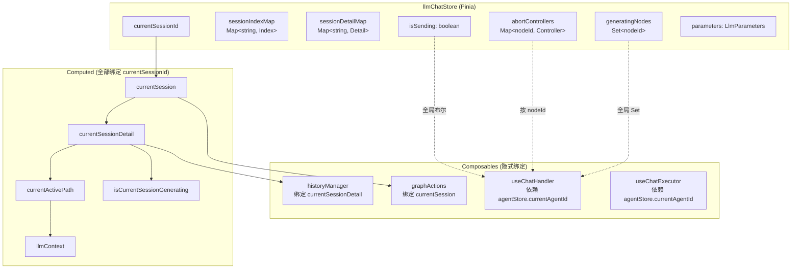
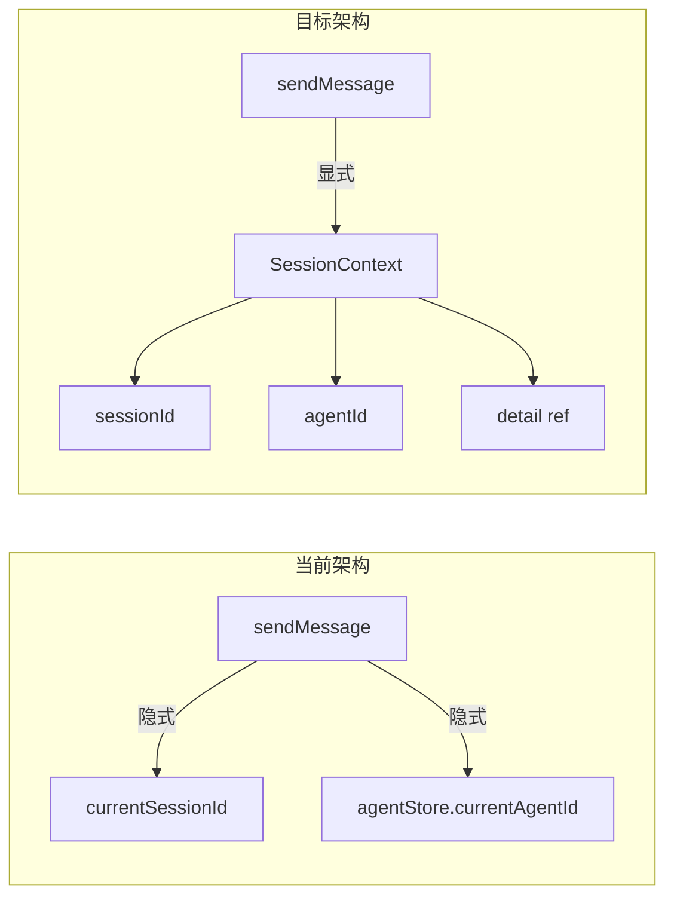
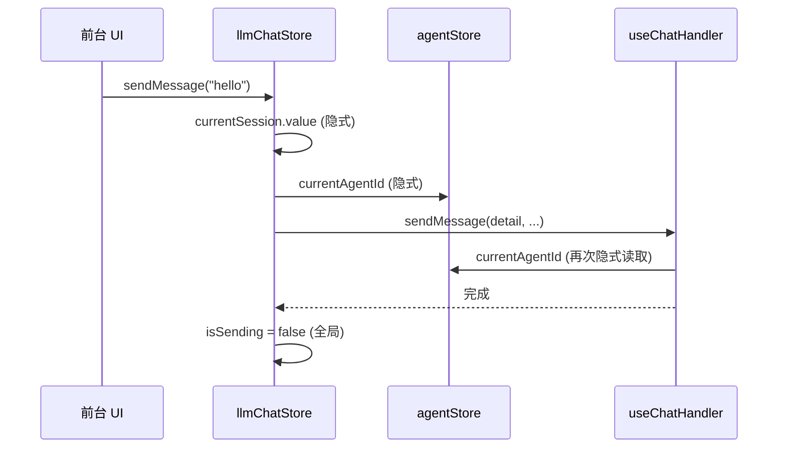
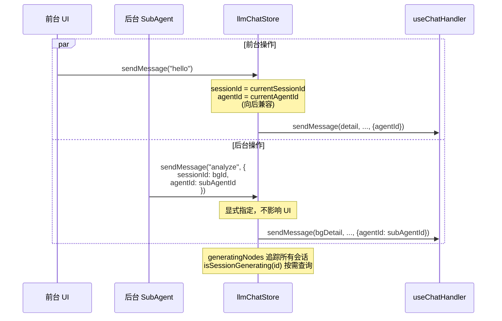

# 多会话架构设计方案

> **状态**: RFC (Request for Comments)
> **作者**: 咕咕
> **日期**: 2026-04-12
> **影响范围**: llmChatStore, useChatHandler, useChatExecutor, useGraphActions, useSessionNodeHistory, agentStore

---

## 1. 问题陈述

当前 [`llmChatStore`](src/tools/llm-chat/stores/llmChatStore.ts:37) 围绕**单一焦点会话** (`currentSessionId`) 设计。所有 computed 属性、历史管理、图操作、发送逻辑都隐式绑定到这个唯一的"当前会话"。这导致以下场景无法实现：

| 场景           | 描述                                | 当前状态                                   |
| -------------- | ----------------------------------- | ------------------------------------------ |
| 多窗口对话     | 用户同时打开多个会话窗口并行对话    | ❌ 切换会话会中断所有 computed             |
| 后台 SubAgent  | 自动化任务在后台运行，不干扰前台 UI | ❌ 发送逻辑绑定 `currentAgentId`           |
| 并行生成       | 同时向多个会话发送消息              | ⚠️ `isSending` 是全局布尔值                |
| 会话级独立操作 | 对非当前会话执行编辑/删除等操作     | ❌ `useGraphActions` 绑定 `currentSession` |

---

## 2. 当前架构分析

### 2.1 架构拓扑



### 2.2 瓶颈清单

#### 🔴 P0 - 阻塞多会话的核心瓶颈

| #   | 瓶颈                                                       | 位置                                                                                             | 问题                                            |
| --- | ---------------------------------------------------------- | ------------------------------------------------------------------------------------------------ | ----------------------------------------------- |
| 1   | **`isSending` 全局布尔值**                                 | [`llmChatStore.ts:46`](src/tools/llm-chat/stores/llmChatStore.ts:46)                             | 无法区分哪个会话在发送，多会话并行时状态冲突    |
| 2   | **`historyManager` 绑定 `currentSessionDetail`**           | [`llmChatStore.ts:222`](src/tools/llm-chat/stores/llmChatStore.ts:222)                           | 只能管理当前会话的撤销/重做，切换会话后历史丢失 |
| 3   | **`useChatHandler` 隐式依赖 `agentStore.currentAgentId`**  | [`useChatHandler.ts:85-88`](src/tools/llm-chat/composables/chat/useChatHandler.ts:85)            | 后台 SubAgent 无法指定自己的 Agent              |
| 4   | **`useChatExecutor` 隐式依赖 `agentStore.currentAgentId`** | [`useChatExecutor.ts:72-83`](src/tools/llm-chat/composables/chat/useChatExecutor.ts:72)          | 同上                                            |
| 5   | **`useGraphActions` 绑定 `currentSession` Ref**            | [`useGraphActions.ts:28-33`](src/tools/llm-chat/composables/visualization/useGraphActions.ts:28) | 无法对非当前会话执行图操作                      |

#### 🟡 P1 - 影响体验但不阻塞

| #   | 瓶颈                                  | 位置                                                                    | 问题                                                           |
| --- | ------------------------------------- | ----------------------------------------------------------------------- | -------------------------------------------------------------- |
| 6   | **`parameters` 全局共享**             | [`llmChatStore.ts:42-45`](src/tools/llm-chat/stores/llmChatStore.ts:42) | 所有会话共享同一套参数（虽然 session 有 `parameterOverrides`） |
| 7   | **`contextAnalyzer*` 状态全局**       | [`llmChatStore.ts:49-51`](src/tools/llm-chat/stores/llmChatStore.ts:49) | 上下文分析器绑定到全局，多窗口时冲突                           |
| 8   | **僵死节点修复 watch 只检查当前会话** | [`llmChatStore.ts:60-98`](src/tools/llm-chat/stores/llmChatStore.ts:60) | 后台会话的僵死节点不会被修复                                   |

### 2.3 已有的多会话友好设计 ✅

| 设计                                    | 位置                                                                       | 说明                             |
| --------------------------------------- | -------------------------------------------------------------------------- | -------------------------------- |
| `sessionIndexMap` / `sessionDetailMap`  | [`llmChatStore.ts:39-40`](src/tools/llm-chat/stores/llmChatStore.ts:39)    | Map 结构，天然支持多会话数据存储 |
| `generatingNodes` 全局 Set              | [`llmChatStore.ts:53`](src/tools/llm-chat/stores/llmChatStore.ts:53)       | 已可追踪跨会话的生成节点         |
| `abortControllers` 全局 Map             | [`llmChatStore.ts:52`](src/tools/llm-chat/stores/llmChatStore.ts:52)       | 按 nodeId 索引，已支持跨会话     |
| `isCurrentSessionGenerating` 按会话检查 | [`llmChatStore.ts:127-132`](src/tools/llm-chat/stores/llmChatStore.ts:127) | 已有按会话过滤生成状态的逻辑     |
| `executeOrProxy` 代理模式               | [`llmChatStore.ts:231-237`](src/tools/llm-chat/stores/llmChatStore.ts:231) | 已有分离窗口代理机制             |
| `ChatSessionDetail.parameterOverrides`  | [`session.ts:69`](src/tools/llm-chat/types/session.ts:69)                  | 会话级参数覆盖已存在             |

---

## 3. 设计方案

### 3.1 核心理念：Session Context 模式

引入 **`SessionContext`** 概念 —— 一个轻量级的"会话操作上下文"，封装了对**任意指定会话**进行操作所需的全部信息。这样所有操作都不再隐式依赖 `currentSessionId`。



### 3.2 新增类型定义

```typescript
// types/session.ts 新增

/**
 * 会话操作上下文
 * 封装了对任意会话进行操作所需的全部信息
 */
export interface SessionContext {
  /** 会话 ID */
  sessionId: string;
  /** 使用的智能体 ID（显式指定，不依赖 UI 选中状态） */
  agentId: string;
  /** 会话详情的引用（可选，用于性能优化避免重复查找） */
  detail?: ChatSessionDetail;
  /** 会话索引的引用（可选） */
  index?: ChatSessionIndex;
  /** 是否为后台会话（不影响 UI 焦点） */
  isBackground?: boolean;
  /** 来源标识（用于日志追踪） */
  source?: "user" | "subagent" | "automation" | "detached-window";
}

/**
 * 会话运行时状态
 * 每个会话独立维护的运行时状态
 */
export interface SessionRuntimeState {
  /** 该会话是否正在发送 */
  isSending: boolean;
  /** 该会话关联的 AbortController 集合 */
  abortControllers: Map<string, AbortController>;
  /** 该会话正在生成的节点 ID 集合 */
  generatingNodes: Set<string>;
}
```

### 3.3 渐进式重构路线图

重构分为 **4 个阶段**，每个阶段都可以独立交付和测试，不破坏现有功能。

---

#### Phase 1: 消除 `isSending` 全局瓶颈（最小改动，最大收益）

**目标**: 让 `isSending` 从全局布尔值变为按会话计算的属性。

**改动范围**: 仅 `llmChatStore.ts`

**策略**: 保留 `isSending` 作为向后兼容的 computed，但其值从 `generatingNodes` 推导而来（当前已有的 `isCurrentSessionGenerating` 就是这个思路）。

```typescript
// 废弃全局 isSending ref，改为 computed
// const isSending = ref(false); // 删除

// 替换为：任意会话有生成中的节点就为 true
const isSending = computed(() => generatingNodes.value.size > 0);

// 新增：检查指定会话是否在生成
function isSessionGenerating(sessionId: string): boolean {
  const detail = sessionDetailMap.value.get(sessionId);
  if (!detail?.nodes) return false;
  return Object.values(detail.nodes).some((node) => generatingNodes.value.has(node.id));
}
```

**影响评估**:

- `sendMessage` / `regenerateFromNode` 中的 `isSending.value = true/false` 赋值需要移除
- `abortSending` 中的 `isSending.value = false` 需要移除
- UI 层使用 `isSending` 的地方无需改动（computed 签名不变）

---

#### Phase 2: 解耦 Agent 依赖（支持后台 SubAgent）

**目标**: 让 `useChatHandler` 和 `useChatExecutor` 接受显式的 `agentId` 参数，而不是隐式读取 `agentStore.currentAgentId`。

**改动范围**: `useChatHandler.ts`, `useChatExecutor.ts`, `llmChatStore.ts`

**策略**: 在 `sendMessage` 等方法的 options 中新增可选的 `agentId` 参数，不传则回退到 `agentStore.currentAgentId`（向后兼容）。

```typescript
// useChatHandler.ts - sendMessage 签名变更
const sendMessage = async (
  session: ChatSessionDetail,
  content: string,
  _activePath: ChatMessageNode[],
  abortControllers: Map<string, AbortController>,
  generatingNodes: Set<string>,
  options?: {
    attachments?: Asset[];
    temporaryModel?: ModelIdentifier | null;
    parentId?: string;
    disableMacroParsing?: boolean;
    agentId?: string; // ★ 新增：显式指定 Agent
  },
  currentSessionId?: string | null,
): Promise<void> => {
  // ...

  // 优先使用显式传入的 agentId，回退到 UI 选中的
  const effectiveAgentId = options?.agentId || agentStore.currentAgentId;
  if (!effectiveAgentId) {
    throw new Error("请先选择一个智能体");
  }

  const agentConfig = agentStore.getAgentConfig(effectiveAgentId, {
    parameterOverrides: session.parameterOverrides,
  });
  // ...
};
```

```typescript
// llmChatStore.ts - sendMessage 签名变更
async function sendMessage(
  content: string,
  options?: {
    attachments?: Asset[];
    temporaryModel?: ModelIdentifier | null;
    parentId?: string;
    disableMacroParsing?: boolean;
    agentId?: string; // ★ 新增
    sessionId?: string; // ★ 新增：可指定非当前会话
  },
): Promise<void> {
  // 确定目标会话
  const targetSessionId = options?.sessionId || currentSessionId.value;
  if (!targetSessionId) throw new Error("请先创建或选择一个会话");

  const index = sessionIndexMap.value.get(targetSessionId);
  const detail = sessionDetailMap.value.get(targetSessionId);
  if (!index || !detail) throw new Error("会话不存在");

  // 后续逻辑使用 targetSessionId 和 detail，而非 currentSession.value
  // ...
}
```

**影响评估**:

- 所有现有调用方无需改动（新参数都是可选的）
- SubAgent 场景可以这样调用：`store.sendMessage("hello", { sessionId: bgSessionId, agentId: subAgentId })`

---

#### Phase 3: 会话级历史管理器（支持多窗口独立撤销）

**目标**: 让每个会话拥有独立的历史管理器实例，而不是共享一个绑定到 `currentSessionDetail` 的实例。

**改动范围**: `llmChatStore.ts`, `useSessionNodeHistory.ts`, `useGraphActions.ts`

**策略**: 引入 `SessionHistoryManager` Map，按 sessionId 缓存历史管理器实例。

```typescript
// llmChatStore.ts

// 替换：const historyManager = useSessionNodeHistory(currentSessionDetail);
// 改为：
const historyManagerMap = new Map<string, ReturnType<typeof useSessionNodeHistory>>();

/**
 * 获取指定会话的历史管理器（懒创建）
 */
function getHistoryManager(sessionId: string): ReturnType<typeof useSessionNodeHistory> {
  let manager = historyManagerMap.get(sessionId);
  if (!manager) {
    // 创建一个指向特定会话 detail 的 computed ref
    const detailRef = computed(() => sessionDetailMap.value.get(sessionId) || null);
    manager = useSessionNodeHistory(detailRef as any);
    historyManagerMap.set(sessionId, manager);
  }
  return manager;
}

// 向后兼容：当前会话的历史管理器
const historyManager = computed(() => {
  if (!currentSessionId.value) return null;
  return getHistoryManager(currentSessionId.value);
});
```

**`useGraphActions` 适配**:

```typescript
// useGraphActions.ts - 接受 sessionId 参数而非 Ref
export function useGraphActions(
  getSessionDetail: (sessionId: string) => ChatSessionDetail | null,
  getHistoryManager: (sessionId: string) => HistoryManager | null,
  sessionIndexMap: Ref<Map<string, ChatSessionIndex>>,
) {
  // 所有方法新增 sessionId 参数
  async function editMessage(sessionId: string, nodeId: string, newContent: string): Promise<void> {
    const session = getSessionDetail(sessionId);
    const hm = getHistoryManager(sessionId);
    if (!session || !hm) return;
    // ...原有逻辑，但使用 session 和 hm 而非 currentSession.value
  }
}
```

---

#### Phase 4: 后台会话执行引擎（SubAgent 完整支持）

**目标**: 提供一个独立于 UI 的后台会话执行能力，支持 SubAgent 和自动化任务。

**改动范围**: 新增文件

**新增模块**:

```
src/tools/llm-chat/
├── services/
│   └── backgroundSessionService.ts   # 后台会话执行服务
├── types/
│   └── session.ts                     # SessionContext 类型（Phase 2 已添加）
```

```typescript
// services/backgroundSessionService.ts

/**
 * 后台会话执行服务
 * 提供独立于 UI 的会话操作能力
 */
export class BackgroundSessionService {
  private store: ReturnType<typeof useLlmChatStore>;

  /**
   * 创建后台会话
   */
  async createBackgroundSession(agentId: string, name?: string): Promise<string> {
    return this.store.createSession(agentId, name);
  }

  /**
   * 向指定会话发送消息（不影响 UI 焦点）
   */
  async sendToSession(
    sessionId: string,
    content: string,
    agentId: string,
    options?: { attachments?: Asset[] },
  ): Promise<void> {
    await this.store.sendMessage(content, {
      sessionId,
      agentId,
      ...options,
    });
  }

  /**
   * 等待会话生成完成
   */
  async waitForCompletion(sessionId: string, timeout?: number): Promise<ChatMessageNode | null> {
    // 轮询 generatingNodes 直到该会话无生成中的节点
  }

  /**
   * 获取会话的最新助手回复
   */
  getLatestResponse(sessionId: string): string | null {
    // 从 sessionDetailMap 获取 activePath 的最后一个 assistant 节点
  }
}
```

---

## 4. 数据流对比

### 4.1 当前：单焦点模式



### 4.2 目标：多会话模式



---

## 5. 迁移兼容性矩阵

| 现有 API                                    | Phase 1          | Phase 2         | Phase 3                | Phase 4 |
| ------------------------------------------- | ---------------- | --------------- | ---------------------- | ------- |
| `store.isSending`                           | ✅ computed 兼容 | ✅              | ✅                     | ✅      |
| `store.sendMessage(content)`                | ✅               | ✅ 新增可选参数 | ✅                     | ✅      |
| `store.currentSession`                      | ✅               | ✅              | ✅                     | ✅      |
| `store.currentActivePath`                   | ✅               | ✅              | ✅                     | ✅      |
| `store.undo()` / `store.redo()`             | ✅               | ✅              | ⚠️ 签名可能变化        | ✅      |
| `graphActions.editMessage(nodeId, content)` | ✅               | ✅              | ⚠️ 新增 sessionId 参数 | ✅      |
| UI 组件                                     | ✅ 无改动        | ✅ 无改动       | ⚠️ 需适配              | ✅      |

> ⚠️ = 需要适配但提供向后兼容包装

---

## 6. 风险评估

| 风险                               | 等级 | 缓解措施                           |
| ---------------------------------- | ---- | ---------------------------------- |
| Phase 1 改动 `isSending` 语义      | 低   | computed 签名不变，UI 无感知       |
| Phase 2 Agent 解耦遗漏隐式依赖     | 中   | 全局搜索 `currentAgentId` 确保覆盖 |
| Phase 3 历史管理器内存泄漏         | 中   | 会话删除时清理 Map 条目            |
| Phase 3 `useGraphActions` 签名变更 | 高   | 提供向后兼容的包装函数             |
| Phase 4 并发竞态条件               | 高   | 使用 AbortController + 队列机制    |
| 跨阶段：窗口同步机制需适配         | 中   | 每个 Phase 完成后验证 sync 逻辑    |

---

## 7. 推荐实施顺序

```
Phase 1      ──→      Phase 2       ──→    Phase 3       ──→     Phase 4
    │                    │                    │                    │
    ▼                    ▼                    ▼                    ▼
 isSending 修复      Agent 解耦         历史管理器独立        后台执行引擎
 (最小改动)        (SubAgent 基础)     (多窗口支持)            (完整能力)
```

**建议**: 先做 Phase 1 和 Phase 2，这两个阶段改动小、收益大、风险低，可以快速交付。Phase 3 和 Phase 4 可以根据实际需求再决定时机。

---

## 8. 附录：关键文件隐式依赖图

```
agentStore.currentAgentId (UI 状态)
├── useChatHandler.sendMessage()          ← Phase 2 解耦
├── useChatHandler.regenerateFromNode()   ← Phase 2 解耦
├── useChatHandler.continueGeneration()   ← Phase 2 解耦
├── useChatExecutor.executeRequest()      ← Phase 2 解耦
├── useGraphActions.editMessage()         ← 通过 agentStore 间接依赖
└── useGraphActions.toggleNodeEnabled()   ← 通过 agentStore 间接依赖

currentSessionId (Store 状态)
├── currentSession (computed)
├── currentSessionDetail (computed)
│   ├── currentActivePath (computed)
│   │   ├── currentActivePathWithPresets (computed)
│   │   └── llmContext (computed)
│   ├── isCurrentSessionGenerating (computed)
│   ├── historyManager (绑定)            ← Phase 3 解耦
│   └── 僵死节点修复 watch               ← Phase 1 扩展
├── graphActions (绑定)                  ← Phase 3 解耦
├── contextStats (绑定)
└── sendMessage / regenerate 等操作      ← Phase 2 解耦
```
