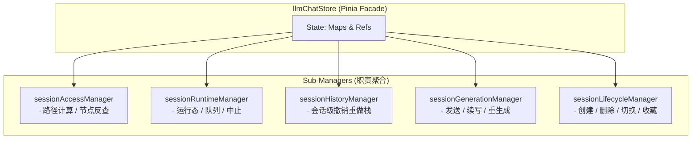

# LLM Chat 多会话架构落地状态与未来规划

> **状态**: Phase 1-4 核心重构已完美落地；多窗口 UI 与后台会话服务待施工
> **作者**: 咕咕
> **最后更新**: 2026-07-08
> **影响范围**: `llmChatStore`, `sessionAccessManager`, `sessionRuntimeManager`, `sessionHistoryManager`, `sessionGenerationManager`, `sessionLifecycleManager`

---

## 1. 核心架构：Session Context 模式

为了支持多窗口并行对话、后台 SubAgent 自动化任务，系统已彻底废弃了“单一焦点会话”的隐式绑定，转为 **Session Context** 模式：所有生成、历史、图操作均显式接受 `sessionId` 和 `agentId`。

---

## 2. 已落地成果快照 (Phase 1-4)

目前多会话的核心底层重构已全部完成，并已通过前端类型检查与单元测试验证。

| 落地特性                     | 实现机制                                                                                | 解决的痛点                                           |
| :--------------------------- | :-------------------------------------------------------------------------------------- | :--------------------------------------------------- |
| **`isSending` 只读化**       | 废弃全局可写 `ref`，改为 `computed(() => generatingNodes.size > 0)`，彻底清理手动赋值。 | 消除全局发送态锁，支持多会话并行生成。               |
| **Agent / Session 发送解耦** | `sendMessage` / `regenerate` 显式接受 `sessionId` 与 `agentId`。                        | 后台 SubAgent 发送不再干扰前台 UI 焦点。             |
| **会话级历史管理器**         | `sessionHistoryManager` 按 `sessionId` 懒创建并缓存 `HistoryManager`。                  | 多窗口独立撤销/重做，切换会话不丢失历史。            |
| **会话级输入草稿**           | `useChatInputManager` 维护 `sessionId -> draft` 映射，切换时自动恢复。                  | 文本、附件、临时模型按会话完美隔离。                 |
| **生命周期 Manager 剥离**    | `sessionLifecycleManager` 承接创建、删除、加载、切换、导入导出、收藏夹与自动命名。      | `llmChatStore` 成功瘦身，生命周期清理契约集中。      |
| **图操作解耦**               | `useGraphActions` 彻底解耦对全局历史管理器的依赖，支持对任意指定会话执行图操作。        | 允许在非当前活跃会话中编辑、删除节点并正确写入历史。 |

### 2.1 跨模块生命周期清理契约

在删除或清空会话时，`sessionLifecycleManager` 会自动联动清理其他子模块，防止内存泄漏：

1. **联动 `sessionRuntime`**：调用 `clearSessionRuntime(sessionId)` 中止生成、释放 `AbortController` 并移出队列。
2. **联动 `sessionHistory`**：调用 `cleanupSession(sessionId)` 销毁对应的历史管理器。
3. **联动 `inputManager`**：调用 `clearDraft(sessionId)` 清空输入草稿。

---

## 3. 新世界无包袱设计

在重构过程中，我们彻底清理了以下历史包袱：

1. **废弃 `IS_SENDING` 同步状态**：由于 `generatingNodes` 已经通过 `CHAT_STATE_KEYS.GENERATING_NODES` 完美同步，分离窗口直接在本地通过 `computed(() => syncedGeneratingNodes.value.length > 0)` 优雅推导发送态，不再通过 IPC/WebSocket 广播冗余的 `IS_SENDING` 状态。
2. **重构 `useGraphActions` 签名**：不再在初始化时绑定 `currentSession` 和全局 `historyManager`，而是接收 `getSessionDetail` 和 `getHistoryManager` 的 Getter 函数，内部方法首参数强制要求 `sessionId`（不传则默认回退到 `currentSessionId.value`），对外部 UI 零侵入。

---

## 4. 未来待施工规划

| 规划模块                                                    | 职责描述                                                                             | 实施策略                                                                                                                   |
| :---------------------------------------------------------- | :----------------------------------------------------------------------------------- | :------------------------------------------------------------------------------------------------------------------------- |
| **1. 后台会话执行服务** (`backgroundSessionService.ts`) | 提供一个干净的、独立于 UI 的后台会话执行服务，为 SubAgent 和自动化任务提供底层支撑。 | 实现 `createBackgroundSession`、`sendToSession`、`waitForCompletion` 等 API，通过监听 `generatingNodes` 异步等待生成完成。 |
| **2. 多窗口 UI 适配**                                       | 支持类似 QQ/浏览器等多窗口、多标签页并行对话的 UI 呈现。                             | 适配前端视图层，允许同时渲染多个会话的聊天画布与节点图。                                                                   |
