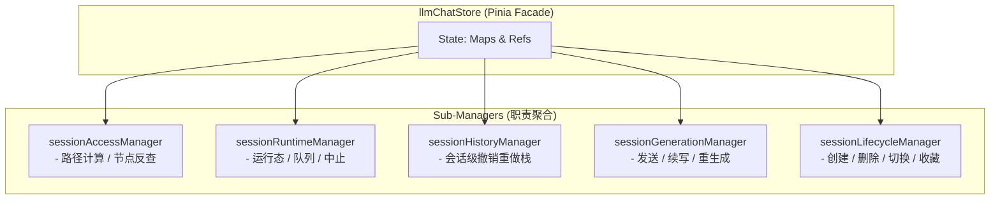

# LLM Chat 多会话架构终极规约 (Ultimate Spec)

> **状态**: Phase 1-4 已落地；后台会话执行服务与完整多窗口 UI 待施工
> **作者**: 咕咕
> **最后更新**: 2026-07-01
> **影响范围**: `llmChatStore`, `sessionAccessManager`, `sessionRuntimeManager`, `sessionHistoryManager`, `sessionGenerationManager`, `sessionLifecycleManager`

---

## 1. 核心架构：Session Context 模式

为了支持多窗口并行对话、后台 SubAgent 自动化任务，系统彻底废弃了“单一焦点会话”的隐式绑定，转为 **Session Context** 模式：所有生成、历史、图操作均显式接受 `sessionId` 和 `agentId`。



---

## 2. 已落地成果快照 (Phase 1-4)

| 落地特性                     | 实现机制                                                               | 解决的痛点                                |
| :--------------------------- | :--------------------------------------------------------------------- | :---------------------------------------- |
| **`isSending` 只读化**       | 改为 `computed(() => generatingNodes.size > 0)`，彻底清理手动赋值。    | 消除全局发送态锁，支持多会话并行生成。    |
| **Agent / Session 发送解耦** | `sendMessage` / `regenerate` 显式接受 `sessionId` 与 `agentId`。       | 后台 SubAgent 发送不再干扰前台 UI 焦点。  |
| **会话级历史管理器**         | `sessionHistoryManager` 按 `sessionId` 懒创建并缓存 `HistoryManager`。 | 多窗口独立撤销/重做，切换会话不丢失历史。 |
| **会话级输入草稿**           | `useChatInputManager` 维护 `sessionId -> draft` 映射，切换时自动恢复。 | 文本、附件、临时模型按会话完美隔离。      |
| **生命周期 Manager**         | `sessionLifecycleManager` 承接创建、删除、加载、切换、导入导出、收藏夹与自动命名。 | `llmChatStore` 继续瘦身，生命周期清理契约集中。 |

---

## 3. 新世界无包袱设计

### 3.1 彻底废弃 `IS_SENDING` 同步状态

- **设计**：由于 `generatingNodes` 已经通过 `CHAT_STATE_KEYS.GENERATING_NODES` 完美同步，分离窗口完全可以通过 `syncedGeneratingNodes.value.length > 0` 自动推导发送态。
- **行动**：彻底干掉 `CHAT_STATE_KEYS.IS_SENDING` 状态包，简化 IPC/WebSocket 广播。

### 3.2 彻底解耦 `useGraphActions`

- **设计**：不再在初始化时绑定 `currentSession` 和全局 `historyManager`。
- **签名**：
  ```typescript
  export function useGraphActions(
    getSessionDetail: (sessionId: string) => ChatSessionDetail | null,
    getHistoryManager: (sessionId: string) => HistoryManager | null,
    sessionIndexMap: Ref<Map<string, ChatSessionIndex>>,
    currentSessionId: Ref<string | null>
  );
  ```
- **兼容性**：所有图操作方法（如 `editMessage`）首参数强制要求 `sessionId`（不传则默认回退到 `currentSessionId.value`），对外部 UI 零侵入。

---

## 4. 生命周期剥离 (Phase 4)

### 4.1 目标

将目前仍堆积在 `llmChatStore.ts` 中的 700 行生命周期逻辑（创建、加载、切换、更新、删除、导入导出、收藏分类、自动命名等）彻底剥离到独立的 `sessionLifecycleManager.ts` 中，使 Store Facade 瘦身至 400 行以内。

### 4.2 `sessionLifecycleManager.ts` 接口定义

```typescript
export interface LifecycleState {
  sessionIndexMap: Ref<Map<string, ChatSessionIndex>>;
  sessionDetailMap: Ref<Map<string, ChatSessionDetail>>;
  currentSessionId: Ref<string | null>;
  favoriteFolders: Ref<FavoriteFolder[]>;
}

export interface LifecycleManagers {
  runtime: ReturnType<typeof createSessionRuntimeManager>;
  history: ReturnType<typeof createSessionHistoryManager>;
  executeOrProxy: <T>(action: string, params: unknown, localFn: () => T | Promise<T>) => Promise<T>;
  fillMissingTokenMetadata: () => Promise<void>;
  getActivePath: (sessionId?: string | null) => ChatMessageNode[];
}

export function createSessionLifecycleManager(state: LifecycleState, managers: LifecycleManagers) {
  // 1. 惰性加载外部依赖（避免循环引用）
  const getStorage = async () => (await import("../../composables/storage/useChatStorageSeparated")).useChatStorageSeparated();
  const getInputManager = async () => (await import("../../composables/input/useChatInputManager")).useChatInputManager();

  // 2. 核心方法实现
  async function createSession(agentId: string, name?: string): Promise<string>;
  async function deleteSession(sessionId: string): Promise<void>;
  async function batchDeleteSessions(sessionIds: string[]): Promise<void>;
  async function switchSession(sessionId: string): Promise<void>;
  async function updateSession(sessionId: string, updates: Partial<ChatSessionIndex & ChatSessionDetail>): Promise<void>;
  async function loadSessions(): Promise<void>;
  function persistSessions(): void;
  async function clearEmptySessions(options?: { preferredOrderIds?: string[] }): Promise<number>;
  async function clearAllSessions(): Promise<void>;

  // 3. 收藏夹与自动命名
  async function toggleFavorite(sessionId: string): Promise<void>;
  async function createFavoriteFolder(name: string, icon?: string): Promise<string>;
  async function renameFavoriteFolder(folderId: string, name: string): Promise<void>;
  async function deleteFavoriteFolder(folderId: string): Promise<void>;
  async function moveSessionToFolder(sessionId: string, folderId: string | null): Promise<void>;
  async function batchMoveSessionsToFolder(sessionIds: string[], folderId: string | null): Promise<void>;
  async function reorderFavoriteFolders(folderIds: string[]): Promise<void>;
  async function generateSessionTopic(sessionId?: string, force?: boolean): Promise<void>;

  return { ... };
}
```

### 4.3 跨模块生命周期清理契约

在删除或清空会话时，必须联动清理其他子模块，防止内存泄漏：

1.  **联动 `sessionRuntime`**：调用 `clearSessionRuntime(sessionId)` 中止生成并移出队列。
2.  **联动 `sessionHistory`**：调用 `cleanupSession(sessionId)` 销毁对应的历史管理器。
3.  **联动 `inputManager`**：调用 `clearDraft(sessionId)` 清空输入草稿。

### 4.4 施工记录 (2026-07-01)

- 已新增 `src/tools/llm-chat/stores/session/sessionLifecycleManager.ts`，承接创建、删除、批删、导入、清空空会话、索引刷新、更新、加载、切换、收藏夹、自动命名、导出 Markdown 与清空全部会话。
- `llmChatStore.ts` 已改为初始化并展开 `sessionLifecycle`，对外 API 名称保持不变，生命周期实现不再堆在 store facade 中。
- 删除 / 批删 / 清理空会话 / 清空全部会话会通过 lifecycle manager 统一联动 runtime、history 与 input draft 清理。
- `sessionRuntimeManager.clearSessionRuntime(sessionId)` 已补强：删除会话时会中止并释放该会话节点关联的 `AbortController`、`generatingNodes` 与流式消息源。
- 已验证 `bun run check:frontend` 与 `bun run test:run -- src\tools\llm-chat\stores\session\__tests__\sessionManagers.test.ts` 通过。
