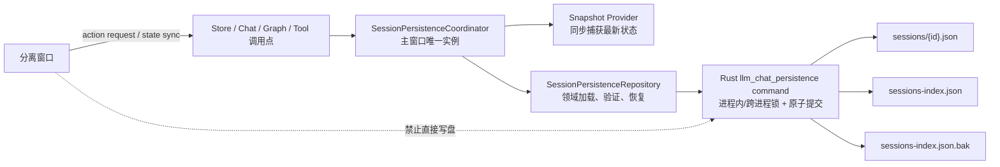
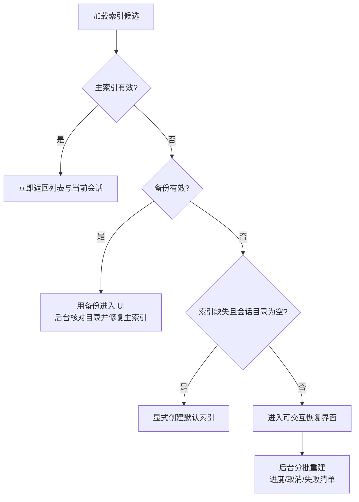

# LLM Chat 会话持久化损坏与启动阻塞调查及修复设计

> **状态**：进一步调查与方案设计完成，待实施
>
> **调查日期**：2026-07-24 至 2026-07-25
>
> **影响范围**：桌面端 `llm-chat` 会话文件、会话索引、分离窗口加载、启动恢复与索引维护
>
> **不在本轮范围**：移动端 SQLite 会话存储、直接清理用户数据、立即迁移桌面端 SQLite

## 1. 执行结论

本次故障已经确认包含两个结果：`llm-chat/sessions-index.json` 和会话
`session-1784902614460-d0dt7mwh0.json` 都曾被 NUL（`\u0000`）字节污染。索引解析失败后，通用
`ConfigManager` 返回默认空索引，随后启动路径把目录中的 2061 个会话文件全部视为新增文件并逐个解析，导致首屏骨架屏持续约 20 秒至 50 秒以上；索引重建还无法恢复收藏、收藏夹和当前会话等索引专属数据。

进一步调查后，结论从“存在并发写风险”收紧为：

1. **覆盖写被进程退出打断的证据很强。** 2026-07-24 22:30:59 至 22:31:06，同一个最终损坏的会话连续启动了 4 次保存，但直到旧进程日志在 22:31:08 停止，都没有任何一次会话写入或完整持久化完成记录；新进程在 22:33:34 左右启动。
2. **并发写不是推测，而是已发生。** 流式增量保存默认每 2 秒触发一次，而单次持久化在故障前已经增长到 6 秒左右；同一会话的新保存会在上一轮尚未完成时继续进入。22:18:18 和 22:22:27 还分别出现过同一会话的成对重叠保存。
3. **底层写入确实先截断正式文件。** 当前锁定的 `@tauri-apps/plugin-fs@2.5.1` 中，`writeTextFile()` 以 `truncate: true` 打开目标文件后直接 `write_all()`。因此任何中止或多个截断型写入交错，都可能让正式路径处于空文件、部分内容或零填充区域状态。
4. **同一进程内还存在隐藏的多 WebView 写者。** 分离窗口虽然把大部分用户操作代理到主窗口，但挂载时仍独立执行 `store.loadSessions()`；该路径会同步索引、保存索引，并在 3 秒后运行 `repairIndex()`。主窗口和分离窗口因此都可能写同一索引。
5. **当前保存参数混合了两个不同职责。** 会话内容保存会顺便覆盖 `currentSessionId`。增量保存甚至直接把 `session.id` 当成当前会话写入索引；后台会话生成可能因此把磁盘上的当前会话切换到后台会话。
6. **现有调用并没有捕获不可变快照。** 持久化入口浅拷贝会话后，在多个异步路径操作之后才 `JSON.stringify()`；`nodes` 等嵌套对象仍是可变引用，磁盘内容不严格对应调用发生时的状态。
7. **删除与待写队列没有协调。** 删除会话时不会取消此前的 fire-and-forget 保存，迟到的保存可以重新创建刚删除的文件并把索引项加回来。

因此，本问题不能只通过“加一个 debounce”或“启动时多做一次修复”解决。完整修复需要同时具备：

- 主窗口唯一数据所有者；
- 前端会话级合并队列和索引全局单写者；
- Rust 侧同目录临时文件、刷盘和平台可靠的原子替换；
- 索引最后有效备份与明确的加载结果；
- 非阻塞恢复、坏文件隔离和增量维护；
- 会话内容、索引元数据、当前会话选择三类写入解耦。

## 2. 已确认的故障链

### 2.1 数据规模

调查时对应用数据目录进行了只读检查：

| 项目                  |                                    结果 |
| --------------------- | --------------------------------------: |
| 会话 JSON 文件        |                                 2061 个 |
| 会话文件总大小        |        151,512,626 字节（约 144.5 MiB） |
| 最小会话文件          |                               2463 字节 |
| 最大会话文件          |                          4,003,268 字节 |
| `sessions-index.json` |                            660,031 字节 |
| 调查结束时无效 JSON   | 0（用户已手动删除损坏会话，索引已重建） |

### 2.2 启动阻塞时间线

日志来源：`C:\Users\mzk\AppData\Roaming\com.mty.aiohub\logs\app-2026-07-24.log`。

| 时间         | 事件                           | 结果                                         |
| ------------ | ------------------------------ | -------------------------------------------- |
| 22:34:02.690 | 主窗口开始加载核心数据         | 进入会话索引加载                             |
| 22:34:02.776 | `sessions-index.json` 解析失败 | 文件开头为 NUL；`ConfigManager` 返回默认配置 |
| 22:34:03.070 | 扫描会话目录完成               | 发现 2061 个文件，开始逐个重建元数据         |
| 22:34:53.258 | 再次打开界面                   | 上一次在约 50 秒内未完成                     |
| 22:34:53.366 | 索引再次解析失败               | 仍为 NUL 污染                                |
| 22:45:29.733 | 第三次打开界面                 | 再次进入空索引恢复                           |
| 22:45:50.342 | 单个会话解析失败               | 同一个会话文件也含 NUL                       |
| 22:45:50.343 | 索引同步完成                   | 重建 2060 条，跳过损坏会话                   |
| 22:45:50.366 | 核心数据加载完成               | 本轮恢复耗时约 20.6 秒                       |
| 22:46:19.720 | 索引恢复后再次进入             | 正常加载                                     |
| 22:46:19.952 | 核心数据加载完成               | 耗时约 0.23 秒                               |

这条链路已确认：“正式文件损坏 → 索引被当成首次使用的空配置 → 首屏全量读取 150 MiB 会话 → 骨架屏长时间阻塞”。

### 2.3 故障前最后一批未完成写入

最终损坏会话在旧进程结束前的日志如下：

| 时间         | 事件                                           |
| ------------ | ---------------------------------------------- |
| 22:30:35.810 | 启动一次会话保存                               |
| 22:30:38.784 | 会话文件写完                                   |
| 22:30:39.732 | 上一轮索引提交尚未结束时，再次启动同一会话保存 |
| 22:30:41.837 | 第一轮完整持久化结束，总耗时约 6.0 秒          |
| 22:30:44.745 | 第二轮完整持久化结束，总耗时约 5.0 秒          |
| 22:30:59.808 | 启动第 1 个后续增量保存                        |
| 22:31:01.981 | 第 1 个未完成，又启动第 2 个                   |
| 22:31:04.156 | 再启动第 3 个                                  |
| 22:31:06.464 | 再启动第 4 个                                  |
| 22:31:08.548 | 旧进程最后一批日志；上述 4 次均无完成记录      |
| 22:33:34 起  | 新进程启动                                     |

默认增量保存间隔为 2000 ms，见
[`useChatResponseHandler.ts`](../../composables/chat/useChatResponseHandler.ts) 和
[`defaultSettings.ts`](../../config/defaultSettings.ts)。当一次完整保存超过 2 秒时，时间节流不再具有背压能力，只会持续产生新的并发 Promise。

这组证据不能证明 NUL 只由某一个系统调用产生，也不能排除系统、驱动或存储层异常；但它已经证明应用退出时存在多笔未完成的同路径覆盖写，因此“退出中断 + 并发覆盖”应作为主要修复对象，而不是低概率假设。

### 2.4 底层截断语义

当前实现中的会话文件直接调用 `writeTextFile(sessionPath, content)`；索引通过
[`ConfigManager.save()`](../../../../utils/configManager.ts) 调用同一 API。

对本仓库锁定的 `@tauri-apps/plugin-fs@2.5.1` 源码核对后，`writeTextFile()` 的实际流程是：

1. 以 `write: true`、`create: true`、`truncate: true` 打开正式路径；
2. 获取请求正文；
3. 对已经截断的文件执行 `write_all()`；
4. 不执行 `sync_all()`，也没有临时文件和替换步骤。

这意味着“Promise 最终没有 reject”不等于“此前每个时刻正式路径都有效”，更不等于应用或系统突然退出后仍有旧版本可恢复。

### 2.5 多窗口隐藏写者

[`LlmChat.vue`](../../LlmChat.vue) 中主窗口和分离窗口都会独立执行：

```ts
await Promise.all([
  agentStore.loadAgents(),
  userProfileStore.loadProfiles(),
  store.loadSessions(),
  chatSettings.loadSettings(),
]);
```

而 [`sessionLifecycleManager.loadSessions()`](../../stores/session/sessionLifecycleManager.ts)：

- 调用 `loadSessionsIndex()`；
- `loadSessionsIndex()` 会执行 `syncIndex()`；
- 目录有差异时会保存索引；
- 3 秒后无条件执行 `repairIndex()`，修复后也会保存索引。

因此，“分离窗口只读、主窗口唯一持久化”的架构描述目前并不完全成立。即使本次日志没有显示分离窗口参与故障，方案也必须关闭这条写入通道，否则仅在单个 WebView 内建立队列仍不是全局单写者。

### 2.6 保存语义还存在三类独立竞态

#### 2.6.1 旧索引覆盖新索引

当前每次 `persistSession()` 都执行：

1. 写会话文件；
2. 重新读取完整索引；
3. 改一个会话项和 `currentSessionId`；
4. 覆盖完整索引。

不同会话或不同入口重叠时，后完成的旧快照会覆盖先完成的新索引，可能丢失收藏夹、当前会话、其他会话元数据或删除结果。

#### 2.6.2 内容保存错误地修改当前会话

`persistSession(index, detail, currentSessionId)` 把内容保存和 UI 选择状态绑定在一起。增量保存调用方使用：

```ts
persistSession(index, session, session.id);
```

后台会话生成、工具调用或非当前会话更新时，这会把磁盘 `currentSessionId` 改成被保存的会话。新接口必须取消这个参数；当前会话只能由显式的 `setCurrentSession()` 索引操作更新。

#### 2.6.3 删除后被迟到保存复活

当前删除顺序是“删除文件 → 读取索引 → 保存索引”，但此前排队的保存没有取消或墓碑判断。迟到的保存可以重新创建文件并重新添加索引项。批量导入、批量保存和单会话保存之间也没有统一互斥。

## 3. 当前恢复路径的数据损失

会话文件保存时显式移除了 `isFavorite` 和 `favoriteFolderId`；收藏夹定义与顺序、`currentSessionId` 也只存在于索引。因此索引损坏后从会话文件重建，只能恢复会话内容和部分列表元数据，无法恢复：

- 当前选中的会话；
- 会话收藏状态；
- 会话所属收藏夹；
- 收藏夹定义和排序。

此外，`ConfigManager.load()` 把以下状态统一成默认配置：

- 文件不存在；
- JSON 损坏；
- 读取失败；
- 未来版本或结构不兼容。

调用方无法决定是初始化、回退备份、只读降级还是等待用户处理。该错误契约不适合高价值领域索引。

## 4. 根因置信度

### 4.1 已确认

- 会话和索引均直接截断正式文件后写入。
- 同一路径存在重叠保存。
- 故障前同一损坏会话有至少 4 次未完成保存。
- 流式保存频率高于当时磁盘提交吞吐量。
- 索引解析失败会静默返回空配置。
- 空索引恢复在首屏 Promise 中逐个读取全部会话。
- 分离窗口加载路径具备写索引能力。
- 正常启动后还会再次全量扫描全部会话。

### 4.2 高置信度推断

最可能的直接触发链是：高频保存持续堆积，同一正式文件被多个截断型写入占用；应用在仍有写入未完成时退出或被结束，文件系统最终保留了不完整或零填充内容。索引损坏可能来自同一批延迟提交、此前的重叠索引写，或尚未写入日志的退出阶段操作。

### 4.3 现有证据无法唯一证明

- 是哪一个具体 `writeTextFile()` 首先制造 NUL；
- NUL 是由并发截断形成的空洞、退出时未完成写、文件系统缓存异常还是多者共同造成；
- 本次事故是否有分离窗口参与；
- 是否发生过机器级异常或存储设备问题。

修复不应依赖对这四点作唯一归因，因为建议方案对这些失效模式都提供保护。

## 5. 设计目标与非目标

### 5.1 目标

1. 任意时刻，同一个会话文件最多一个提交任务运行；等待区只保留最新状态。
2. 任意时刻，索引只有一个逻辑写者和一个磁盘提交任务。
3. 应用在临时文件写入、刷盘、替换前后任一点退出，重启后至少存在一份可验证的已提交版本。
4. 会话内容保存不再修改 `currentSessionId`。
5. 删除会话后，旧保存不能把文件或索引项复活。
6. 索引损坏不能让首屏等待全部 150 MiB 会话读取。
7. 主索引损坏但备份有效时，收藏与当前会话保持不变。
8. 主索引和备份均损坏时，500 ms 级进入可交互降级界面，重建在后台执行。
9. 正常启动不再全量解析全部会话。
10. 分离窗口挂载和关闭不直接写会话或索引。

### 5.2 非目标

- 不在本轮把桌面端全部迁移到 SQLite。
- 不把 `ConfigManager` 全局改造成事务数据库。
- 不为每个会话永久保留完整 `.bak`，避免把约 150 MiB 数据直接翻倍。
- 不承诺抵御磁盘硬件故障；本轮重点是应用级并发、退出和可恢复性。

## 6. 推荐架构

### 6.1 组件分层



建议新增两个前端领域层和一个 Rust 命令模块：

- `SessionPersistenceCoordinator`
  - 只负责写入所有权、队列、合并、修订号、取消和 flush；
  - 模块级单例，但只允许主窗口初始化为可写模式；
  - 不直接处理文件格式细节。
- `SessionPersistenceRepository`
  - 负责路径、序列化格式、严格验证、主文件/备份/临时文件选择、目录同步和隔离；
  - 返回可区分的加载结果，不吞掉错误。
- Rust `llm_chat_persistence`
  - 只接受 llm-chat 领域相对标识，不接受任意绝对路径；
  - 在 Tauri 进程内按逻辑文件加锁，并在提交阶段获取跨进程文件锁；
  - 完成同目录临时文件写入、`sync_all()`、平台原子替换和索引备份轮换。

`useChatStorageSeparated()` 暂时保留为兼容 facade，逐步把现有调用转发到新层，避免一次性修改约 40 个持久化调用点。

### 6.2 写入所有权

必须同时使用两层约束：

1. **业务层所有权**：只有主窗口持有可写 coordinator；分离窗口通过 `executeOrProxy()` 请求主窗口操作。
2. **Rust 防御层**：即使未来某个调用绕过代理，原子写命令仍通过进程内锁和跨进程文件锁串行同一逻辑路径，并拒绝比磁盘修订号更旧的提交。

只做第一层会留下未来回归风险；只做第二层只能防结构损坏，不能防两个窗口各自基于旧索引产生逻辑丢失。

仓库当前只在非 debug 且非 portable 的构建中启用 `tauri-plugin-single-instance`。因此正式安装版通常只有一个应用进程，但调试、E2E、portable 或异常启动场景仍可能让多个进程指向同一数据目录。跨进程锁不是本次日志已确认的根因，而是原子提交设计必须覆盖的边界。

## 7. 写入模型

### 7.1 API 解耦

新接口不再使用一个 `persistSession(..., currentSessionId)` 承担所有职责，建议拆成：

```ts
interface SessionPersistenceCoordinator {
  markSessionDirty(sessionId: string, reason: PersistReason): void;
  flushSession(sessionId: string, reason: PersistReason): Promise<CommitResult>;
  mutateIndex(mutation: IndexMutation): void;
  flushIndex(reason: PersistReason): Promise<CommitResult>;
  deleteSession(sessionId: string): Promise<void>;
  flushAll(options?: { timeoutMs?: number }): Promise<void>;
}
```

- `markSessionDirty()`：流式增量、图操作等高频入口；不返回磁盘完成语义。
- `flushSession()`：用户消息入树、生成完成、导入覆盖等必须观察结果的关键点。
- `mutateIndex()`：创建、重命名、收藏、收藏夹、排序、当前会话切换等索引操作。
- `deleteSession()`：先写入墓碑并取消待处理快照，再执行删除提交。
- `flushAll()`：窗口关闭前尽力清空，但数据安全不能依赖关闭钩子成功执行。

### 7.2 每会话“运行一个、等待一个最新状态”

每个会话维护：

```ts
interface SessionWriteSlot {
  runningRevision: number | null;
  pendingRevision: number | null;
  dirtyReasons: Set<PersistReason>;
  deleted: boolean;
}
```

规则：

1. 首次 dirty 且当前无任务：同步捕获可序列化状态，启动提交。
2. 提交运行中再次 dirty：不新建第二个运行任务，只更新 `pendingRevision` 和 dirty reason。
3. 当前提交结束：若有 pending，则从状态源重新捕获**当时最新状态**，只提交一次。
4. 提交失败：保留 pending 并进入可重试状态，不允许旧 revision 覆盖新 revision。
5. 删除开始：设置 `deleted = true`，清空 pending；运行任务完成后不得再更新索引，Rust 命令也校验墓碑/修订号。

这不是普通 debounce。普通 debounce 无法处理“上一次写已经开始但尚未结束”的情况，也无法提供 `flush()` 和删除取消语义。

### 7.3 快照捕获

当前浅拷贝保留了可变 `nodes` 引用。新实现应在实际提交开始前、任何 `await` 之前，同步生成稳定内容：

- 从 store 读取当前 index/detail；
- 移除 Vue reactive proxy；
- 构造领域 DTO；
- 同步 `JSON.stringify()` 或 `structuredClone()` 后立即序列化；
- 序列化结果与本次 revision 绑定。

等待区不必保存多个 4 MiB 深拷贝，只记录“该会话又脏了”；当前写结束后再从状态源捕获一次最新值即可。

### 7.4 索引不再随每个流式片段提交

流式内容变化时：

- 会话文件按配置间隔做合并保存；
- 不重新读取索引；
- 不更新 `currentSessionId`；
- `messageCount`、`displayAgentId`、名称等真正变化时才标记索引 dirty；
- 索引写只从主窗口内存中的单一状态源生成完整快照，并做全局合并提交。

一次正常流式响应建议最多产生：

- 若干次合并后的会话内容提交；
- 开始或结束阶段 1 至 2 次索引提交；
- 0 次索引磁盘读取。

## 8. 文件格式与修订号

### 8.1 不复用现有业务 `version`

现有 `version: "1.1.2"` 已承担索引业务格式迁移，不应再表示提交修订。建议增加保留字段：

```ts
interface PersistenceMeta {
  schema: 1;
  revision: number;
  committedAt: string;
}
```

会话文件和索引文件顶层增加 `_persistence`。旧文件没有该字段时按 revision `0` 迁移读取。

索引项增加可选 `contentRevision`，表示它描述的会话文件 revision。这样可以识别“会话文件已提交，但进程在索引提交前退出”的合法中间状态。

### 8.2 修订号用途

- coordinator 为每个会话维护单调递增 revision；
- 索引有独立的全局 revision；
- Rust 原子命令读取当前主文件 revision，拒绝更旧的提交；
- 加载时先选择最高 revision 的有效已提交主文件或备份；残留临时文件只作为显式恢复候选，不能默认为已提交；
- 当前会话加载后发现 `contentRevision` 不匹配，只在后台修正该索引项，不阻塞首屏。

不建议第一阶段加入自包含 checksum。JSON 结构校验、修订号、临时文件和原子替换已经覆盖本次故障；checksum 若以后加入，需要设计不破坏现有读取方的 envelope 或 sidecar，适合独立评估。

## 9. Rust 原子提交设计

### 9.1 为什么不能只在前端 `writeTextFile(tmp) + rename(tmp, target)`

- `plugin-fs` 的 `FileHandle` 没有公开等价于 Rust `File::sync_all()` 的提交语义；
- Rust `std::fs::rename()` 在目标已存在时的行为具有平台差异，不能把插件文档中的简化描述当成 Windows 可靠替换协议；
- 前端无法在一次受控命令中完成“加锁、验证、刷盘、替换、备份、目录同步”；
- 多 WebView 调用需要 Tauri 进程内互斥；debug 与 portable 模式还需要跨进程锁作为最后防线。

因此建议新增小范围 Rust command，而不是继续组合多个前端 FS IPC。

### 9.2 命令边界

建议命令只接收领域标识：

```rust
#[serde(rename_all = "camelCase")]
struct LlmChatAtomicWriteRequest {
    kind: LlmChatFileKind, // Session | Index | CorruptionManifest
    session_id: Option<String>,
    content: String,
    revision: u64,
    expected_min_revision: Option<u64>,
    keep_last_valid_backup: bool,
}
```

Rust 内部解析应用配置目录并拼接固定路径，校验 `session_id`，禁止 `..`、分隔符和任意绝对路径，避免增加新的广域文件写命令。

### 9.3 提交步骤

1. 获取逻辑路径对应的进程内异步锁。
2. 获取该逻辑路径的跨进程独占文件锁，并设置有限等待时间；进程异常结束后由操作系统释放锁。
3. 在 Rust 内解析 JSON，校验顶层对象、`_persistence.revision` 和会话 `id`。
4. 在目标同目录创建唯一临时文件。
5. `write_all(content.as_bytes())`。
6. `flush()` 后 `sync_all()` 临时文件。
7. 在跨进程锁内比较当前主文件 revision；若磁盘更新，拒绝旧提交。
8. 对索引：只有当前主文件通过验证时，才允许把它轮换为 `.bak`；绝不能用损坏主文件覆盖有效备份。
9. 原子替换正式文件：
   - Windows：目标存在时使用 `ReplaceFileW`，索引可同时指定备份路径；首次创建使用同卷移动/替换原语；
   - macOS/Linux：同目录 rename 替换，并在支持时同步父目录；索引备份使用“先原子提交备份，再替换主文件”的顺序。
10. 返回 revision、字节数和各阶段耗时。
11. 失败时尽力删除本次临时文件；进程中止遗留的临时文件交给下次加载检查，不能盲目删除。

项目已经依赖 `tempfile`；Windows 实现需要给现有 `windows` crate 增加 `Win32_Storage_FileSystem` feature。跨进程锁可使用锁文件配合平台锁 API，或评估引入小型跨平台文件锁依赖；不能用“锁文件是否存在”代替 OS 锁，因为崩溃会留下陈旧文件。

### 9.4 会话和索引的跨文件提交顺序

JSON 多文件无法获得真正的单事务原子性，因此采用可恢复顺序：

1. 原子提交会话文件；
2. 更新内存索引项的 `contentRevision`；
3. 合并并原子提交索引。

若在步骤 1 后退出，磁盘会话比索引新，但内容不会丢；后续通过 revision 或文件指纹做后台修正。反向顺序会让索引指向尚未提交的内容，因此不采用。

### 9.5 备份策略

- `sessions-index.json`：永久保留一份 `sessions-index.json.bak`，因为其中包含无法从会话恢复的数据。
- 单会话文件：不永久保留完整 `.bak`，依赖“旧正式文件直到原子替换前始终有效”；避免把 150 MiB 数据翻倍。
- 损坏样本：恢复前把无法解析的主索引重命名为带时间戳的 `.corrupt`，不覆盖备份，也不静默删除。

## 10. 加载与恢复状态机

### 10.1 明确的加载结果

Repository 不再返回“一个看起来正常的默认对象”，而是返回判别联合：

```ts
type IndexLoadResult =
  | { status: "ready"; source: "primary"; index: SessionsIndex }
  | { status: "recovered"; source: "backup" | "temp"; index: SessionsIndex }
  | { status: "missing"; sessionsDirectoryEmpty: boolean }
  | { status: "corrupt"; primaryError: string; backupError?: string }
  | { status: "unsupported"; detectedVersion?: string }
  | { status: "io-error"; error: unknown };
```

只有“索引不存在且 sessions 目录为空”才可以自动初始化默认索引。索引不存在但目录非空必须进入恢复，不能先写空索引。

### 10.2 启动流程



首屏初始化 Promise 只等待：

- 主索引或备份读取；
- 当前会话详情（若有效）；
- 恢复状态初始化。

它不等待全部会话扫描和解析。

### 10.3 后台重建

主索引和备份均不可用时：

- 先显示空列表或最近可恢复列表，并展示“正在恢复会话索引”状态；
- `readDir()` 只获取候选文件名；
- 以固定并发度（建议 4，可配置 2 至 8）读取和解析会话；
- 每处理一批更新进度，不在每个文件后重绘整个列表；
- 重建中发现的会话可以分批加入 UI；
- 完成后一次性提交新索引；
- 在新索引验证并提交前，不覆盖损坏主索引和备份。

### 10.4 坏会话隔离

无法解析或关键字段不合法的会话：

1. 移入 `llm-chat/sessions-corrupt/`，文件名带原 sessionId 和时间戳；
2. 写入原子维护的 `corruption-manifest.json`；
3. 正常 sessions 扫描不再重复读取该文件；
4. UI 展示失败数量，并提供“打开目录”“导出诊断信息”“删除隔离文件”等入口；
5. 不自动删除原始字节。

如果移动失败，至少把路径记录到 manifest 并在本轮与后续扫描中跳过。

### 10.5 正常启动的增量核对

删除无条件 `repairIndex()`。正常启动不解析全部会话，只在首屏后执行轻量核对：

- 比较目录文件名集合与索引 ID；
- 新文件或缺失文件进入后台增量处理；
- 当前打开会话在读取时顺便核对 revision 和元数据；
- 手动“修复索引”才执行全量语义检查。

如需高效发现“同名文件内容变化”，建议增加一个 Rust 批量扫描命令，一次返回 sessionId、文件大小和修改时间，避免 2000 次独立 `stat` IPC。索引可保存这些指纹作为优化提示，但不能把 mtime 当作唯一正确性依据。

## 11. 分离窗口调整

分离窗口启动不应再次从磁盘建立完整 store。建议：

1. 优先通过现有 window sync 请求主窗口初始状态；
2. 分离窗口只按需请求当前会话详情或接收主窗口广播；
3. 若主窗口暂不可用，最多执行**只读**索引加载，不运行 `syncIndex()`、`saveIndex()` 或 `repairIndex()`；
4. 所有会话、收藏和当前会话变更继续通过 `executeOrProxy()`；
5. 自动化测试断言分离窗口挂载期间没有任何 llm-chat 写命令。

这一步既消除隐藏写者，也避免每开一个分离窗口都重新扫描 2000 个文件。

## 12. 删除、导入与批量操作

### 12.1 删除

建议顺序：

1. coordinator 写入内存墓碑并取消 pending；
2. 等待该会话当前运行写结束，或让完成回调看到墓碑后丢弃索引更新；
3. 把会话文件原子移动到短期 trash 目录；
4. 提交移除后的索引；
5. 异步清理 trash。

若步骤 3 后退出，启动时发现索引仍引用缺失文件，后台移除即可；若步骤 4 后退出，trash 不会被 sessions 扫描重新导入。该顺序比直接删除更容易恢复。

### 12.2 导入和批量保存

- 导入覆盖必须走同一个 per-session slot，不能直接 `Promise.all(saveSession)` 绕过协调器；
- 批量操作可以并发写不同会话，但设置全局并发上限，建议 4；
- 批量索引只提交一次；
- 导入失败保留每个会话的结果，不用一个失败丢弃全部成功项；
- 清空全部会话必须先关闭新写入入口并 drain/cancel 所有 slot。

## 13. 可观测性

每次提交记录结构化字段：

- `operationId`；
- `windowLabel` 和 `writerRole`；
- `fileKind`、`sessionId`；
- `revision`、`supersededRevision`；
- `reason`；
- `queueWaitMs`、`serializeMs`、`writeMs`、`syncMs`、`replaceMs`；
- `bytes`；
- `result`：`committed` / `coalesced` / `stale-rejected` / `cancelled` / `failed`；
- `indexSource`：`primary` / `backup` / `temp` / `rebuilt`。

避免记录完整会话内容。日志应能直接回答：是否有两个窗口写盘、退出时有多少任务未完成、哪个 revision 最后提交、备份为何被采用。

## 14. 实施阶段

### Phase 0：阻止新损坏，必须一起发布

1. 新增主窗口 `SessionPersistenceCoordinator`。
2. 拆分会话内容、索引和当前会话 API。
3. 所有约 40 个现有调用点通过 facade 进入统一队列。
4. 流式保存采用“运行一个、等待一个最新状态”。
5. 删除操作加入墓碑和 pending 取消。
6. 新增 Rust 领域原子写命令、进程内路径锁和跨进程文件锁。
7. 会话与索引全部切到原子提交；索引启用最后有效备份。
8. 分离窗口禁止写盘。

Phase 0 中“协调器”和“原子写”缺一不可：只做协调器仍可能在退出时截断正式文件；只做原子写仍会发生旧索引覆盖新索引和当前会话漂移。

### Phase 1：损坏恢复不阻塞首屏

1. 新增判别式加载结果和严格结构验证。
2. 主索引损坏时回退 `.bak`。
3. 保留 `.corrupt` 故障样本。
4. 主索引和备份均损坏时进入后台恢复状态。
5. 新增进度、取消、失败数量和坏会话隔离。
6. 恢复完成前禁止写空索引覆盖故障文件。

### Phase 2：移除正常启动全量扫描

1. 删除 3 秒后的无条件 `repairIndex()`。
2. 正常启动只加载索引和当前会话。
3. 目录差异在首屏后增量处理。
4. 评估增加 Rust 批量文件指纹扫描。
5. 手动修复提供进度、取消和结果报告。

### Phase 3：长期存储演进

在 Phase 0 至 Phase 2 稳定后，再评估 SQLite：

- 会话元数据、收藏夹和当前会话可先进入 SQLite；
- 大会话正文可继续独立文件，或按节点拆表；
- 迁移必须支持回滚和旧文件只读保留；
- 不用长期迁移推迟当前原子写和恢复修复。

## 15. 建议文件边界

预计主要涉及：

- `src/tools/llm-chat/services/sessionPersistenceCoordinator.ts`（新增）
- `src/tools/llm-chat/services/sessionPersistenceRepository.ts`（新增）
- `src/tools/llm-chat/types/persistence.ts`（新增）
- `src/tools/llm-chat/composables/storage/useChatStorageSeparated.ts`
- `src/tools/llm-chat/composables/session/useSessionManager.ts`
- `src/tools/llm-chat/stores/session/sessionLifecycleManager.ts`
- `src/tools/llm-chat/composables/chat/useChatResponseHandler.ts`
- `src/tools/llm-chat/LlmChat.vue`
- `src-tauri/src/commands/llm_chat_persistence.rs`（新增）
- `src-tauri/src/commands.rs`
- `src-tauri/Cargo.toml`
- 对应前端、Rust 和真实窗口测试
- 实施完成后同步 `src/tools/llm-chat/docs/architecture/data-persistence.md`

不建议第一步修改全局 `ConfigManager.load()` 的错误回退契约。llm-chat 索引应先迁出 `ConfigManager`，再单独评估通用配置是否复用底层原子写原语。

## 16. 测试与故障注入

### 16.1 前端单元测试

至少覆盖：

1. 同一会话快速触发 100 次 dirty，最大运行提交数为 1，等待区只提交最后 revision。
2. 运行提交失败后，新 revision 不被旧 revision 覆盖。
3. 不同会话可按全局并发上限并行，索引仍为单写者。
4. 流式内容保存不修改 `currentSessionId`。
5. 后台会话保存不改变当前会话。
6. 删除时取消 pending，迟到完成不会复活文件或索引项。
7. 批量导入不绕过同一会话 slot。
8. detached 模式调用写接口会代理或拒绝，不落盘。
9. 主索引损坏时优先返回有效备份，不返回默认空索引。
10. 主索引和备份均损坏时立即返回 recovery 状态，不等待重建完成。
11. 隔离清单让同一个坏文件在下次启动不再重复解析。

### 16.2 Rust 单元与集成测试

对原子命令的每个阶段注入失败：

1. 临时文件创建前失败；
2. 写一部分后失败；
3. `sync_all()` 前后失败；
4. 备份轮换前后失败；
5. 正式替换前后失败；
6. 目标文件被占用；
7. 旧 revision 提交；
8. 非法 sessionId 和目录穿越；
9. 主索引损坏但备份有效时，不得用损坏主文件覆盖备份；
10. 两个 Tauri WebView 同时提交同一路径，最终文件始终是有效 JSON。
11. 两个独立应用进程同时提交同一路径，旧 revision 被拒绝，进程退出后锁可自动释放。

### 16.3 进程中止测试

需要真实子进程或 Tauri E2E，不能只用 Vitest 模拟：

- 在临时文件写入中结束进程；
- 在刷盘后、替换前结束进程；
- 在会话已替换、索引未替换时结束进程；
- 在索引替换后、响应尚未回到前端时结束进程；
- 流式生成期间连续结束并重启 20 次；
- 每次重启断言主文件或备份至少一份有效，且不会进入阻塞式全量恢复。

### 16.4 性能基线

使用接近真实规模的数据集：

- 约 2000 个会话；
- 总量约 150 MiB；
- 索引约 650 KiB；
- 最大会话约 4 MiB。

建议门禁：

| 场景                 | 目标                                          |
| -------------------- | --------------------------------------------- |
| 正常索引首屏         | 不读取全部会话；耗时不随 150 MiB 内容线性增长 |
| 主索引损坏、备份有效 | 使用备份进入 UI，不做阻塞式全量重建           |
| 主索引和备份均损坏   | 500 ms 级进入可交互恢复界面                   |
| 流式生成             | 每会话最大 1 个运行写；pending 深度最大 1     |
| 流式索引写放大       | 不随 token/2 秒增量保存重写索引               |
| 分离窗口启动         | 不扫描全部会话，不调用 llm-chat 写命令        |
| 正常进入后           | 不自动读取 150 MiB 做全量 repair              |

### 16.5 建议验证命令

实施时先根据实际新增测试文件调整命令，至少执行：

```powershell
bun run test:run -- <会话持久化相关测试文件>
bun run build:tsc
bun run build:vite
cargo test --manifest-path src-tauri/Cargo.toml llm_chat_persistence
```

真实窗口、进程中止、Windows 文件占用和跨 WebView 竞争按
[工具测试指南](../../../../../docs/guide/tool-testing-guide.md) 与
[Tauri E2E 说明](../../../../../tests/tauri-e2e/README.md)执行。

## 17. 风险与明确决策

| 决策                              | 理由                                                       |
| --------------------------------- | ---------------------------------------------------------- |
| llm-chat 索引迁出 `ConfigManager` | 需要错误分类、备份、修订和恢复状态，已超出普通扁平配置边界 |
| 使用 Rust 原子写命令              | 前端插件组合无法完整提供刷盘、可靠替换和进程内/跨进程锁    |
| 主窗口唯一写者 + Rust 防御锁      | 同时解决逻辑丢失和结构损坏                                 |
| 会话先提交、索引后提交            | 中间状态可通过 revision 修复，不让索引指向未提交内容       |
| 只为索引保留永久备份              | 索引含不可重建数据；全部会话备份会显著增加空间             |
| 不在首屏自动全量修复              | 可用性优先，恢复应有进度并可取消                           |
| 不立即迁 SQLite                   | 原子写和恢复是独立 P0，长期迁移不能成为延期理由            |

## 18. 外部原语参考

方案使用的文件系统边界应以实现时锁定版本和平台实测为准：

- [Tauri v2 File System 插件](https://v2.tauri.app/plugin/file-system/)
- [Rust `std::fs::rename`](https://doc.rust-lang.org/std/fs/fn.rename.html)
- [Windows `ReplaceFileW`](https://learn.microsoft.com/en-us/windows/win32/api/winbase/nf-winbase-replacefilew)
- [Windows `FlushFileBuffers`](https://learn.microsoft.com/en-us/windows/win32/api/fileapi/nf-fileapi-flushfilebuffers)

## 19. 推荐施工顺序

1. 先补 coordinator、API 解耦、删除墓碑和 detached 只读边界。
2. 同一阶段接入 Rust 原子提交和索引备份，形成第一个可发布修复。
3. 再完成判别式加载、备份恢复和后台重建 UI。
4. 删除无条件 `repairIndex()`，建立 2000 会话性能门禁。
5. 最后评估文件指纹扫描和 SQLite 演进。

在 Phase 0 与 Phase 1 都完成前，不应把问题判定为彻底解决：Phase 0 阻止新损坏，Phase 1 负责历史坏文件和异常状态下仍可进入工具。
