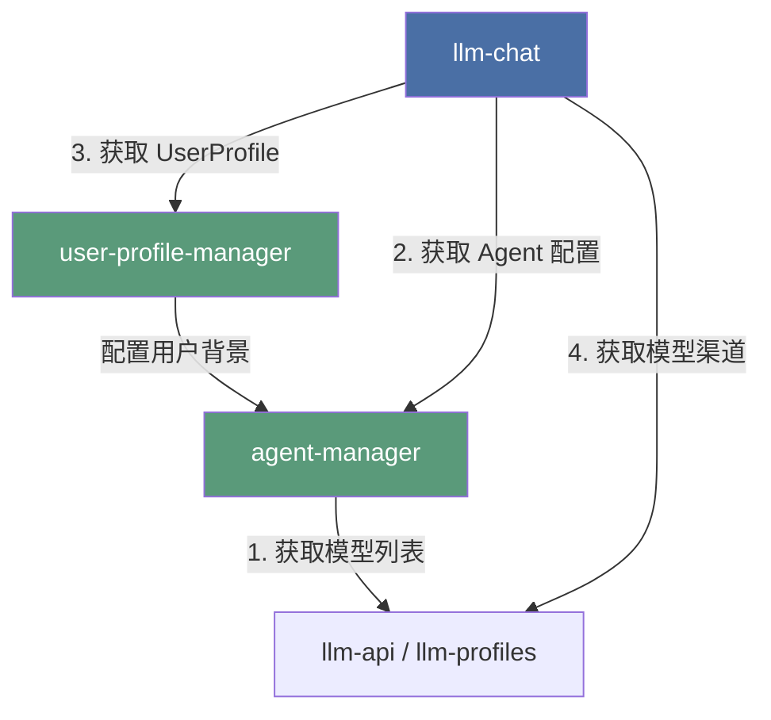

# LLM Chat: User 与 Agent 配置管理解耦计划 (施工级图纸版)

> 最后更新：2026-07-07
> 状态：RFC (Request for Comments)
> 关联模块：`src/tools/agent-manager/` (待创建), `src/tools/user-profile-manager/` (待创建)

## 1. 核心设计哲学：工具自治与平级解耦

根据移动端 `mobile-agent-manager-plan.md` 的前沿探索，AIO Hub 的终极形态是**工具高度自治与微服务化**。
我们不应将 Agent 和 UserProfile 强行“全局化抬升”到全局 `src/stores`，也不应让它们继续物理寄生在 `llm-chat` 内部。

相反，我们应该在桌面端**完全对齐移动端的架构苗头**，将它们彻底剥离为**平级的独立工具**：

```
src/tools/
├── 📂 llm-chat/                 # [工具 A: 树状分支聊天运行时] (纯粹的消费方)
│   └── 聚焦于：会话树、消息流式收发、虚拟渲染、上下文管道构建
│
├── 📂 agent-manager/            # [工具 B: 智能体管理器] (纯粹的提供方)
│   └── 聚焦于：Agent 增删改查、导入导出、私有资产管理、世界书管理
│
└── 📂 user-profile-manager/     # [工具 C: 用户档案管理器] (纯粹的提供方)
    └── 聚焦于：用户档案的增删改查、自定义样式配置
```

### 依赖方向（单向依赖，无循环引用）



---

## 2. 核心解耦机制与状态同步 (施工级细节)

为了实现无循环引用的单向依赖，同时保证极致的 Lossless UX（零体验折损），我们必须在代码层面解决以下三个核心耦合点：

### 2.1. 状态同步：`currentAgentId` 的优雅解耦

#### 现状与痛点

目前 `agentStore.ts` 深度依赖 `llm-chat` 内部的 `useLlmChatUiState` 来读写 `currentAgentId`。如果直接迁移，会导致 `agent-manager` 反向依赖 `llm-chat`，造成循环引用。

#### 施工方案 (状态保留在 Chat 侧，解耦联动)

为了保持 `agent-manager` 作为通用智能体管理器的纯净性，它**不应该感知任何聊天运行时的 UI 状态**。因此，`currentAgentId` 必须**彻底留在 `llm-chat` 内部**，而 `agentStore` 保持无状态。

1. **状态保留**：`currentAgentId` 依然作为纯粹的聊天 UI 状态，保留在 `llm-chat` 的 `useLlmChatUiState.ts` 中。
2. **单向按需加载**：`agentStore` 不再在初始化时读取 `currentAgentId`。它仅提供一个通用的按需加载接口：
   ```typescript
   // src/tools/agent-manager/stores/agentStore.ts
   // 仅提供纯粹的数据管理，不包含 currentAgentId 状态
   actions: {
     async loadAgentDetails(agentId: string) {
       // 按需加载特定智能体的完整配置与资产
     }
   }
   ```
   在 `llm-chat` 初始化或切换智能体时，由 `llm-chat` 主动调用此接口：
   ```typescript
   // src/tools/llm-chat/LlmChat.vue 或相关初始化逻辑
   watch(
     currentAgentId,
     async (newId) => {
       if (newId) {
         await agentStore.loadAgentDetails(newId);
       }
     },
     { immediate: true }
   );
   ```
3. **删除联动解耦**：当 `agentStore` 删除了某个智能体时，它只负责纯粹的数据删除，不再直接修改 `currentAgentId`。由 `llm-chat` 侧通过监听（`watch`）来安全地处理状态回退：
   ```typescript
   // src/tools/llm-chat/composables/ui/useLlmChatUiState.ts
   // 监听智能体列表变化，如果当前选中的智能体被删除了，安全回退
   watch(
     () => agentStore.agents,
     (newAgents) => {
       if (
         currentAgentId.value &&
         !newAgents.some((a) => a.id === currentAgentId.value)
       ) {
         currentAgentId.value = newAgents[0]?.id || null;
       }
     }
   );
   ```
4. **磁盘存储解耦**：`currentAgentId` 不再保存在 `agent-manager` 的 `agents-index.json` 中，而是作为 Chat 的 UI 偏好，直接持久化在 `llm-chat` 自身的 `ui-state.json` 中。

### 2.2. 问候语同步：反向依赖的优雅解耦

#### 现状与痛点

当智能体的 `greetings` 发生变化时，`agentStore.updateAgent` 会动态导入 `llmChatStore`、`greetingService` 和 `useSessionManager`，遍历所有会话并重建未固化的开局消息。这导致配置管理层深度耦合了聊天运行时。

#### 施工方案

1. **职责剥离**：将问候语重建逻辑从 `agentStore.updateAgent` 中彻底移除。`agentStore` 只负责纯粹的配置持久化。
2. **就地触发（活动会话）**：在 `llm-chat` 侧，当用户在聊天界面通过 `EditAgentDialog` 保存智能体时，在保存回调中显式触发当前活动会话的问候语重建：

   ```typescript
   // src/tools/llm-chat/components/ChatArea.vue
   const handleSaveAgent = async (updatedAgent: ChatAgent) => {
     await agentStore.updateAgent(updatedAgent.id, updatedAgent);

     // 仅在当前编辑的智能体是当前会话的智能体时，触发问候语同步
     if (updatedAgent.id === currentAgentId.value) {
       const { rebuildLiveGreetings } =
         await import("../services/greetingService");
       const { useLlmChatStore } = await import("../stores/llmChatStore");
       // 执行当前活动会话的问候语重建与会话持久化...
     }
   };
   ```

3. **懒加载兜底（非活动会话）**：由于 `ChatArea.vue` 无法（也不应该）在后台遍历所有历史会话，对于非活动会话，采用**“被动兜底/懒加载”**策略：当用户切换到其他历史会话（加载消息流）时，动态检查当前未固化的开局消息与智能体最新的 `greetings` 是否一致，若不一致则就地动态重建。
4. **收益**：`agent-manager` 彻底摆脱了对聊天运行时和会话管理器的依赖，实现了纯净的单向依赖。

### 2.3. 磁盘存储路径的无缝兼容与彻底自治

#### 现状与痛点

用户的智能体配置文件和头像资产已经保存在 `{appConfigDir}/llm-chat/agents/` 目录下。如果直接修改存储路径，会导致老用户数据“丢失”。但如果永远不改，就无法实现彻底的工具自治。

#### 施工方案

1. **彻底自治**：在迁移后的 `useAgentStorage.ts` 中，将 `MODULE_NAME` 修改为 `"agent-manager"`，实现物理路径的彻底自治。
2. **冷启动自动迁移**：通过 6.1 节设计的“冷启动自动检测与物理迁移”管道，在应用首次启动时，自动将旧路径数据安全迁移到新路径下。
3. **前端复制路径更新**：同步更新 `agentStore.ts` 中 `duplicateAgent` 方法的硬编码路径，将 `llm-chat/agents` 相对路径更新为 `agent-manager/agents`。
4. **Rust 后端同步修改**：修改 Rust 后端 `src-tauri/src/commands/agent_asset_manager.rs` 中的 `get_agent_assets_dir` 和 `delete_agent_asset`，将硬编码的 `"llm-chat"` 路径统一修改为 `"agent-manager"`，确保前后端读写路径完全一致。

---

## 3. 物理文件迁移清单 (精确到文件)

我们将执行以下精确的物理文件迁移和重命名：

### 3.1. 智能体管理器 (`src/tools/agent-manager/`)

| 原始内容路径 (寄生在 `llm-chat`)                                     | 目标迁移路径 (独立在 `agent-manager`)                            | 说明                                             |
| :------------------------------------------------------------------- | :--------------------------------------------------------------- | :----------------------------------------------- |
| `src/tools/llm-chat/stores/agentStore.ts`                            | `src/tools/agent-manager/stores/agentStore.ts`                   | 核心 Store，保持纯净，不含 `currentAgentId`      |
| `src/tools/llm-chat/composables/storage/useAgentStorageSeparated.ts` | `src/tools/agent-manager/composables/storage/useAgentStorage.ts` | 存储层，保持 `llm-chat/agents` 磁盘路径          |
| `src/tools/llm-chat/services/agentManagementService.ts`              | `src/tools/agent-manager/services/agentManagementService.ts`     | 提供给 LLM 的 9 个 Callable 方法                 |
| `src/tools/llm-chat/services/agentImportService.ts`                  | `src/tools/agent-manager/services/agentImportService.ts`         | 导入服务                                         |
| `src/tools/llm-chat/services/agentExportService.ts`                  | `src/tools/agent-manager/services/agentExportService.ts`         | 导出服务                                         |
| `src/tools/llm-chat/services/agentMigrationService.ts`               | `src/tools/agent-manager/services/agentMigrationService.ts`      | 历史版本迁移服务                                 |
| `src/tools/llm-chat/services/vcpChatAgentImportService.ts`           | `src/tools/agent-manager/services/vcpChatAgentImportService.ts`  | VCP 导入服务                                     |
| `src/tools/llm-chat/services/agentAssetService.ts`                   | `src/tools/agent-manager/services/agentAssetService.ts`          | 资产管理服务                                     |
| `src/tools/llm-chat/utils/agentAssetUtils.ts`                        | `src/tools/agent-manager/utils/agentAssetUtils.ts`               | 资产工具函数                                     |
| `src/tools/llm-chat/types/agent.ts`                                  | `src/tools/agent-manager/types/agent.ts`                         | 智能体类型定义                                   |
| `src/tools/llm-chat/types/agentImportExport.ts`                      | `src/tools/agent-manager/types/agentImportExport.ts`             | 导入导出类型定义                                 |
| `src/tools/llm-chat/config/defaultAgentTemplate.ts`                  | `src/tools/agent-manager/config/defaultAgentTemplate.ts`         | 默认模板配置                                     |
| `src/tools/llm-chat/components/agent/`                               | `src/tools/agent-manager/components/`                            | 整个 UI 组件目录（包含编辑器、资产、参数面板等） |

### 3.2. 用户档案管理器 (`src/tools/user-profile-manager/`)

| 原始内容路径 (寄生在 `llm-chat`)                                  | 目标迁移路径 (独立在 `user-profile-manager`)                                  | 说明                                                 |
| :---------------------------------------------------------------- | :---------------------------------------------------------------------------- | :--------------------------------------------------- |
| `src/tools/llm-chat/stores/userProfileStore.ts`                   | `src/tools/user-profile-manager/stores/userProfileStore.ts`                   | 用户档案 Store                                       |
| `src/tools/llm-chat/composables/storage/useUserProfileStorage.ts` | `src/tools/user-profile-manager/composables/storage/useUserProfileStorage.ts` | 用户档案存储层                                       |
| `src/tools/llm-chat/types/profile.ts`                             | `src/tools/user-profile-manager/types/profile.ts`                             | 用户档案类型定义                                     |
| `src/tools/llm-chat/components/user-profile/`                     | `src/tools/user-profile-manager/components/`                                  | 整个 UI 组件目录（包含 `EditUserProfileDialog.vue`） |

---

## 4. 跨模块协作与工具注册

### 4.1. 优雅的“就地编辑”挂载 (Lossless UX)

在 `llm-chat` 内部，我们保留就地编辑的入口，但其实现组件直接从 `agent-manager` 导入：

```vue
<!-- src/tools/llm-chat/components/ChatArea.vue -->
<script setup lang="ts">
import EditAgentDialog from "@/tools/agent-manager/components/management/EditAgentDialog.vue";
import EditUserProfileDialog from "@/tools/user-profile-manager/components/EditUserProfileDialog.vue";
</script>
```

### 4.2. 独立工具注册与 LLM Callable 迁移

1. **`agent-manager` 注册**：
   - 创建 `src/tools/agent-manager/agent-manager.registry.ts`。
   - 将原 `llm-chat.registry.ts` 中的 `agentManagement` 实例（包含 9 个 `agentCallable` 方法的元数据和实现）**完整迁移**到 `agent-manager.registry.ts` 中。
   - 注册 `agent-manager` 自身的 UI 工具配置，使其在主页和侧边栏拥有独立的“智能体大厅”入口。
   - **硬性规范**：注册的 `icon` 组件**必须使用 `markRaw()` 包裹**，防止 Vue 响应式代理带来的性能开销和潜在警告。
2. **`user-profile-manager` 注册**：
   - 创建 `src/tools/user-profile-manager/user-profile-manager.registry.ts`。
   - 注册独立的“用户档案”管理入口。
   - **硬性规范**：注册的 `icon` 组件**必须使用 `markRaw()` 包裹**。

---

## 5. 实施步骤规划

### Phase 1: 物理迁移与基础编译打通

1. 创建 `src/tools/agent-manager/` 和 `src/tools/user-profile-manager/` 目录结构。
2. **Git 历史保留**：必须使用 `git mv` 命令来执行物理移动，且**第一步只做移动并提交，第二步再修改代码**。这样 Git 能够完美追踪文件重命名，保留历史 blame 信息。
3. 按照迁移清单，物理移动所有 Store、Service、Types、Utils 和 UI 组件。
4. 修复所有迁移文件的内部 `import` 相对路径，并扫描修复 `src/tools/llm-chat/` 内部所有对已迁移 Store/Service 的导入路径，确保项目能够通过 `check:frontend` 编译。
5. **Rust 后端同步修改**：修改 Rust 后端 `src-tauri/src/commands/agent_asset_manager.rs` 中的 `get_agent_assets_dir` 和 `delete_agent_asset`，将硬编码的 `"llm-chat"` 路径统一修改为 `"agent-manager"`。

### Phase 2: 核心解耦与状态重构

1. 重构 `agentStore.ts`，彻底移除对 `useLlmChatUiState` 的依赖，使其成为纯净的数据管理 Store。
2. 在 `useLlmChatUiState.ts` 中保留 `currentAgentId`，并新增对 `agentStore.agents` 的监听，实现删除时的安全回退。
3. 移除 `agentStore.updateAgent` 中的问候语同步逻辑，改在 `ChatArea.vue` 的保存回调中就地触发（活动会话），并在会话切换加载时进行懒加载兜底（非活动会话）。
4. 更新 `agentStore.ts` 中 `duplicateAgent` 方法的硬编码路径，将 `llm-chat/agents` 相对路径更新为 `agent-manager/agents`。

### Phase 3: 工具注册与就地挂载

1. 编写并启用 `agent-manager.registry.ts` 和 `user-profile-manager.registry.ts`。
2. 在 `ChatArea.vue`、`ParametersSidebar.vue` 等组件中，将原有的相对路径导入改为从 `@/tools/agent-manager/...` 和 `@/tools/user-profile-manager/...` 导入。
3. 运行 `check` 脚本，确保双端编译与 Clippy 检查全绿通过。

---

## 6. 数据迁移与历史兼容方案 (Data Migration & Compatibility)

为了确保老用户在升级到解耦版本时，其历史智能体配置、自定义头像、用户档案等数据**绝对不丢失、不损坏、不裂开**，我们必须设计一套严密的数据迁移与路径兼容机制。

### 6.1. 迁移策略：渐进式物理迁移 (Progressive Migration)

虽然“保持原路径不变”是最省事的方案，但为了实现彻底的工具自治，数据最终应当归属于各自的工具目录下。我们采用**“冷启动自动检测与物理迁移”**的渐进式策略：

```
[旧路径] {appConfigDir}/llm-chat/agents/
   │
   ├── (冷启动检测：新路径无数据 && 旧路径有数据)
   │
   ▼
[备份] {appConfigDir}/backups/migration_backup_{timestamp}/  (安全第一，先行备份)
   │
   ├── (物理复制与校验)
   │
   ▼
[新路径] {appConfigDir}/agent-manager/agents/
```

#### 路径映射规范

| 数据类型             | 旧物理路径 (寄生在 `llm-chat`)              | 新物理路径 (独立自治)                              |
| :------------------- | :------------------------------------------ | :------------------------------------------------- |
| **智能体索引与配置** | `{appConfigDir}/llm-chat/agents/`           | `{appConfigDir}/agent-manager/agents/`             |
| **智能体头像与资产** | `{appConfigDir}/llm-chat/agents/assets/`    | `{appConfigDir}/agent-manager/assets/`             |
| **用户档案配置**     | `{appConfigDir}/llm-chat/user-profile.json` | `{appConfigDir}/user-profile-manager/profile.json` |

---

### 6.2. 核心迁移算法与冷启动流程

在 `agent-manager` 的 `useAgentStorage.ts` 初始化（`load()`）时，自动触发以下迁移管道：

```typescript
// src/tools/agent-manager/composables/storage/useAgentStorage.ts
import {
  exists,
  mkdir,
  copyFile,
  remove,
  readDir,
} from "@tauri-apps/plugin-fs";
import { join, appConfigDir } from "@tauri-apps/api/path";

export async function triggerDataMigration() {
  const configDir = await appConfigDir();
  const oldPath = await join(configDir, "llm-chat", "agents");
  const newPath = await join(configDir, "agent-manager", "agents");

  // 1. 幂等性检查：如果新路径已经存在数据，说明已经迁移过，直接跳过
  if (await exists(newPath)) {
    const newFiles = await readDir(newPath);
    if (newFiles.length > 0) return; // 已有数据，无需迁移
  }

  // 2. 检测旧路径是否存在数据
  if (!(await exists(oldPath))) return; // 无旧数据，纯净新安装
  const oldFiles = await readDir(oldPath);
  if (oldFiles.length === 0) return;

  const logger = createModuleLogger("agent-migration");
  logger.info("检测到历史智能体数据，启动自动迁移管道...");

  const timestamp = Date.now();
  const backupPath = await join(
    configDir,
    "backups",
    `migration_backup_${timestamp}`
  );

  // 引入临时标记文件，确保迁移的原子性
  const progressFlagPath = await join(newPath, ".migration_in_progress");

  try {
    // 3. 安全备份：将旧数据完整复制到备份目录
    await mkdir(backupPath, { recursive: true });
    await deepCopyDirectory(oldPath, backupPath);
    logger.info("历史数据备份成功", { backupPath });

    // 4. 物理迁移：创建新目录并复制数据
    await mkdir(newPath, { recursive: true });
    // 写入临时标记文件，表示迁移正在进行中
    await writeTextFile(progressFlagPath, "in_progress");
    await deepCopyDirectory(oldPath, newPath);
    logger.info("数据物理迁移完成，开始完整性校验...");

    // 5. 完整性校验：对比新旧目录文件数量与大小
    const isVerified = await verifyMigration(oldPath, newPath);
    if (!isVerified) {
      throw new Error("迁移校验失败：文件数量或大小不一致");
    }

    // 校验通过，安全删除临时标记文件
    await remove(progressFlagPath);

    // 6. 清理旧路径（可选/延迟清理）：为了绝对安全，第一阶段仅重命名旧路径为 .bak，稳定运行一个版本后再物理删除
    const oldPathBak = `${oldPath}.migrated.bak`;
    await rename(oldPath, oldPathBak);
    logger.info("旧数据已安全归档", { oldPathBak });
  } catch (error) {
    logger.error("数据迁移失败，启动自动回滚！", error);
    // 异常回滚：如果新路径创建了一半，清理掉，防止残留脏数据
    if (await exists(newPath)) {
      await remove(newPath, { recursive: true });
    }
    // 提示用户，但不阻断程序启动（降级为使用空数据启动）
    customMessage.error(
      "历史数据迁移失败，已安全回滚。请在群里反馈、提交 Issue 或检查日志。"
    );
  }
}
```

---

### 6.3. 历史资产路径的动态适配 (Asset Path Resolver)

#### 痛点：硬编码协议路径裂开

在旧数据中，智能体的头像路径可能被保存为硬编码的自定义协议路径，例如：
`appdata://llm-chat/agents/assets/avatar_123.png`。
如果我们将数据迁移到 `agent-manager`，而前端渲染时直接读取该路径，会导致**头像裂开（加载失败）**。

#### 解决方案：动态路径解析器 (Path Resolver)

在 `agentStore` 加载智能体列表时，对所有资产路径进行**动态拦截与重写**：

```typescript
// src/tools/agent-manager/utils/agentAssetUtils.ts

/**
 * 动态解析并兼容历史资产路径
 * @param rawPath 数据库中保存的原始路径
 * @returns 适配当前版本的可用路径
 */
export function resolveAssetPath(rawPath: string | undefined): string {
  if (!rawPath) return "";

  // 兼容旧协议路径：appdata://llm-chat/agents/assets/...
  if (rawPath.startsWith("appdata://llm-chat/agents/")) {
    return rawPath.replace(
      "appdata://llm-chat/agents/",
      "appdata://agent-manager/"
    );
  }

  // 兼容旧相对路径：llm-chat/agents/assets/...
  if (rawPath.startsWith("llm-chat/agents/")) {
    return rawPath.replace("llm-chat/agents/", "agent-manager/");
  }

  return rawPath;
}
```

在所有 UI 组件（如 `Avatar.vue`）渲染智能体头像时，**必须**通过 `resolveAssetPath` 进行包裹，确保双向兼容。

---

### 6.4. 用户档案 (UserProfile) 的平滑过渡

用户档案数据量较小（通常只有一个 `user-profile.json` 文件），迁移逻辑更加轻量：

1. **读取兜底**：`userProfileStore` 初始化时，优先读取新路径 `{appConfigDir}/user-profile-manager/profile.json`。
2. **历史回退**：如果新路径不存在，尝试读取旧路径 `{appConfigDir}/llm-chat/user-profile.json`。
3. **就地升级**：如果成功读取到旧路径数据，将其写入新路径，并安全删除/重命名旧文件，实现无感知的单向升级。
