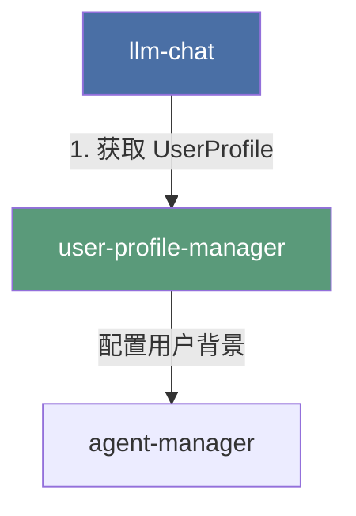

# LLM Chat: User Profile 配置管理解耦及用户档案中心建设方案 (施工级图纸版)

> 最后更新：2026-07-08
> 状态：RFC (Request for Comments)
> 关联模块：`src/tools/user-profile-manager/` (待创建)

## 1. 核心设计哲学：工具高度自治与门户化

根据移动端 `mobile-agent-manager-plan.md` 的前沿探索，AIO Hub 的终极形态是**工具高度自治与微服务化**。
我们不应将 UserProfile 强行“全局化抬升”到全局 `src/stores`，也不应让它继续物理寄生在 `llm-chat` 内部。

相反，我们应该在桌面端**完全对齐移动端的架构苗头**，将它彻底剥离为**平级的独立工具**，并为它建设**完整的、有生命力的独立工具门户（Portal）**：

```
src/tools/
├── 📂 llm-chat/                 # [工具 A: 树状分支聊天运行时] (纯粹的消费方)
│   └── 聚焦于：会话树、消息流式收发、虚拟渲染、上下文管道构建
│
└── 📂 user-profile-manager/     # [工具 C: 用户档案管理器] (独立工具门户)
    └── 聚焦于：用户档案的增删改查、自定义样式配置、全局默认档案配置
```

### 依赖方向（单向依赖，无循环引用）



---

## 2. 门户（Portal）与自治界面设计

为了避免将解耦后的模块做成死板的“组件库”，我们必须为它建设完整的独立工具门户，并打通它与 `llm-chat` 之间的双向联动管道。

### 2.1. `user-profile-manager` (用户档案中心) 门户设计

`user-profile-manager` 承载用户的多身份管理。

- **主页面路径**：`src/tools/user-profile-manager/UserProfileManager.vue`（由原 `src/views/Settings/user-profile/UserProfileSettings.vue` 迁移并重构而来）
- **界面布局与功能**：
  1.  **左侧：档案列表**：展示所有用户档案，支持启用/禁用开关、设为全局默认。
  2.  **右侧：档案编辑器**：展示当前选中档案的详细配置（名字、头像、自定义 Prompt 内容等），支持头像上传和历史记录。
  3.  **创建与删除**：支持新建用户档案，或删除非系统默认的档案。

### 2.2. 入口拆除与就地弹窗保留 (Settings & TitleBar)

为了在实现工具自治的同时，保证极致的 Lossless UX（零体验折损），我们对入口进行如下优化：

1.  **拆除全局设置（Settings）中的旧入口**：
    - 修改文件：`src/config/settings.ts`，彻底移除 `id: "user-profiles"` 的设置项。
    - 物理删除：在迁移完成后，安全删除旧的 `src/views/Settings/user-profile/` 目录。
2.  **保留并重构标题栏（TitleBar）的就地管理弹窗**：
    - **物理迁移**：将 `UserProfileManagerDialog.vue` 物理迁移到 `src/tools/user-profile-manager/components/UserProfileManagerDialog.vue`。
    - **就地管理体验**：在标题栏（TitleBar）点击“管理档案”时，**依然直接弹出这个 Dialog 弹窗**，让用户可以就地管理和切换档案，无需跳转页面，保持最顺滑的就地操作体验。
    - **组件复用**：`UserProfileManagerDialog.vue` 内部直接复用 `UserProfileManager.vue`（或其核心表单与列表组件），确保“独立工具页面”与“就地弹窗”使用的是同一套高内聚的业务逻辑。
3.  **就地编辑体验**：在 `llm-chat` 内部，我们保留就地编辑的入口，但其实现组件直接从 `user-profile-manager` 导入：
    ```vue
    <!-- src/tools/llm-chat/components/ChatArea.vue -->
    <script setup lang="ts">
    import EditUserProfileDialog from "@/tools/user-profile-manager/components/EditUserProfileDialog.vue";
    </script>
    ```

---

## 3. 核心解耦机制与状态同步 (施工级细节)

为了实现无循环引用的单向依赖，同时保证极致的 Lossless UX（零体验折损），我们必须在代码层面解决以下核心耦合点：

### 3.1. 磁盘存储路径的无缝兼容与彻底自治

#### 现状与痛点

用户的用户档案配置文件和头像资产已经保存在 `{appConfigDir}/llm-chat/user-profile.json` 目录下。如果直接修改存储路径，会导致老用户数据“丢失”。但如果永远不改，就无法实现彻底的工具自治。

#### 施工方案

1.  **彻底自治**：在迁移后的 `useUserProfileStorage.ts` 中，将 `MODULE_NAME` 修改为 `"user-profile-manager"`，实现物理路径的彻底自治。
2.  **冷启动自动迁移**：通过 5.1 节设计的“冷启动自动检测与物理迁移”管道，在应用首次启动时，自动将旧路径数据安全迁移到新路径下。

---

## 4. Git 移动指令集 (Git Move Commands)

为了完美继承 Git 历史记录，**严禁直接复制文件**。必须在 Windows PowerShell 终端中按顺序执行以下 `git mv` 命令：

```powershell
# 1. 创建目标目录结构
New-Item -ItemType Directory -Force -Path "src/tools/user-profile-manager/stores"
New-Item -ItemType Directory -Force -Path "src/tools/user-profile-manager/composables/storage"
New-Item -ItemType Directory -Force -Path "src/tools/user-profile-manager/types"
New-Item -ItemType Directory -Force -Path "src/tools/user-profile-manager/components"

# 2. 使用 git mv 移动文件，保留 Git 历史
git mv "src/tools/llm-chat/stores/userProfileStore.ts" "src/tools/user-profile-manager/stores/userProfileStore.ts"
git mv "src/tools/llm-chat/composables/storage/useUserProfileStorage.ts" "src/tools/user-profile-manager/composables/storage/useUserProfileStorage.ts"
git mv "src/tools/llm-chat/types/profile.ts" "src/tools/user-profile-manager/types/profile.ts"

# 3. 移动整个组件目录
git mv "src/tools/llm-chat/components/user-profile" "src/tools/user-profile-manager/components/user-profile"
```

---

## 5. 数据迁移与历史兼容方案 (Data Migration & Compatibility)

To ensure that old users do not lose, damage, or break their historical user profiles, custom avatars, etc. when upgrading to the decoupled version, we must design a rigorous data migration and path compatibility mechanism.

### 5.1. 迁移策略：渐进式物理迁移 (Progressive Migration)

虽然“保持原路径不变”是最省事的方案，但为了实现彻底的工具自治，数据最终应当归属于各自的工具目录下。我们采用**“冷启动自动检测与物理迁移”**的渐进式策略：

```
[旧路径] {appConfigDir}/llm-chat/user-profile.json
   │
   ├── (冷启动检测：新路径无数据 && 旧路径有数据)
   │
   ▼
[备份] {appConfigDir}/backups/migration_backup_{timestamp}/  (安全第一，先行备份)
   │
   ├── (物理复制与校验)
   │
   ▼
[新路径] {appConfigDir}/user-profile-manager/profile.json
```

#### 路径映射规范

| 数据类型         | 旧物理路径 (寄生在 `llm-chat`)              | 新物理路径 (独立自治)                              |
| :--------------- | :------------------------------------------ | :------------------------------------------------- |
| **用户档案配置** | `{appConfigDir}/llm-chat/user-profile.json` | `{appConfigDir}/user-profile-manager/profile.json` |

---

### 5.2. 核心迁移算法与冷启动流程

用户档案数据量较小（通常只有一个 `user-profile.json` 文件），迁移逻辑更加轻量：

1.  **读取兜底**：`userProfileStore` 初始化时，优先读取新路径 `{appConfigDir}/user-profile-manager/profile.json`。
2.  **历史回退**：如果新路径不存在，尝试读取旧路径 `{appConfigDir}/llm-chat/user-profile.json`。
3.  **就地升级**：如果成功读取到旧路径数据，将其写入新路径，并安全删除/重命名旧文件，实现无感知的单向升级。

---

### 5.3. 历史资产路径 of 动态适配 (Asset Path Resolver)

#### 解决方案：动态协议头解析与保存截断更新

由于保存在 `profile.json` 中的是相对路径（如 `avatar-123.png`），我们不需要对配置文件中的头像路径进行任何物理修改。我们只需要在解耦迁移时，同步更新协议头的解析与截断逻辑：

1. **动态解析器更新 (`useResolvedAvatar.ts`)**：
   将动态拼接的协议头从旧路径变更为新路径：
   - 用户档案头像：从 `appdata://llm-chat/user-profiles/${entity.id}/${icon}` 变更为 `appdata://user-profile-manager/profiles/${entity.id}/${icon}`。

2. **保存截断逻辑更新 (`useUserProfileStorage.ts`)**：
   在保存配置文件时，截断前缀的逻辑也同步更新为新的前缀：
   - 用户档案：`appdata://user-profile-manager/profiles/${profile.id}/`
