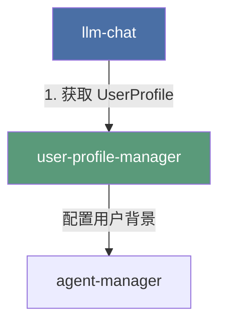

# LLM Chat: User Profile 配置管理解耦及用户档案中心建设方案 (施工级图纸版)

> 最后更新：2026-07-23
> 状态：已随 `v0.6.6-r.1` 发布；2026-07-23 代码审计发现迁移语义与测试证据缺口，待收口
> 关联模块：`src/tools/user-profile-manager/`（已创建）

## 1. 核心设计哲学：工具高度自治与门户化

根据移动端 `mobile-agent-manager-plan.md` 的前沿探索，AIO Hub 的终极形态是**工具高度自治与微服务化**。
我们不应将 UserProfile 强行“全局化抬升”到全局 `src/stores`，也不应让它继续物理寄生在 `llm-chat` 内部。

相反，我们应该在桌面端**完全对齐移动端的架构苗头**，将它彻底剥离为**平级的独立工具**，并为它建设**完整的、有生命力的独立工具门户（Portal）**：

```
src/tools/
├── 📂 llm-chat/                 # [工具 A: 树状分支聊天运行时] (纯粹的消费方)
│   └── 聚焦于：会话树、消息流式收发、虚拟渲染、上下文管道构建
│
└── 📂 user-profile-manager/     # [工具 C: 用户档案管理器] (独立工具门户)
    └── 聚焦于：用户档案的增删改查、自定义样式配置、全局默认档案配置
```

### 依赖方向（单向依赖，无循环引用）


```mermaid
graph TD
    UPM[user-profile-manager] -->|配置用户背景| AM[agent-manager]
    LC[llm-chat] -->|1. 获取 UserProfile| UPM

    style LC fill:#4a6fa5,color:#fff
    style UPM fill:#5a9a7a,color:#fff
```

---

## 2. 门户（Portal）与自治界面设计

为了避免将解耦后的模块做成死板的“组件库”，我们必须为它建设完整的独立工具门户，并打通它与 `llm-chat` 之间的双向联动管道。

### 2.1. `user-profile-manager` (用户档案中心) 门户设计

`user-profile-manager` 承载用户的多身份管理。

- **主页面路径**：`src/tools/user-profile-manager/UserProfileManager.vue`（由原 `src/views/Settings/user-profile/UserProfileSettings.vue` 迁移并重构而来）
- **界面布局与功能**：
  1.  **左侧：档案列表**：展示所有用户档案，支持启用/禁用开关、设为全局默认。
  2.  **右侧：档案编辑器**：展示当前选中档案的详细配置（名字、头像、自定义 Prompt 内容等），支持头像上传和历史记录。
  3.  **创建与删除**：支持新建用户档案，或删除非系统默认的档案。

### 2.2. 入口拆除与就地弹窗保留 (Settings & TitleBar)

为了在实现工具自治的同时，保证极致的 Lossless UX（零体验折损），我们对入口进行如下优化：

1.  **拆除全局设置（Settings）中的旧入口**：
    - 修改文件：`src/config/settings.ts`，彻底移除 `id: "user-profiles"` 的设置项。
    - 物理删除：在迁移完成后，安全删除旧的 `src/views/Settings/user-profile/` 目录。
2.  **保留并重构标题栏（TitleBar）的就地管理弹窗**：
    - **物理迁移**：将 `UserProfileManagerDialog.vue` 物理迁移到 `src/tools/user-profile-manager/components/UserProfileManagerDialog.vue`。
    - **就地管理体验**：在标题栏（TitleBar）点击“管理档案”时，**依然直接弹出这个 Dialog 弹窗**，让用户可以就地管理和切换档案，无需跳转页面，保持最顺滑的就地操作体验。
    - **组件复用**：`UserProfileManagerDialog.vue` 内部直接复用 `UserProfileManager.vue`（或其核心表单与列表组件），确保“独立工具页面”与“就地弹窗”使用的是同一套高内聚的业务逻辑。
3.  **就地编辑体验**：在 `llm-chat` 内部，我们保留就地编辑的入口，但其实现组件直接从 `user-profile-manager` 导入：
    ```vue
    <!-- src/tools/llm-chat/components/ChatArea.vue -->
    <script setup lang="ts">
    import EditUserProfileDialog from "@/tools/user-profile-manager/components/EditUserProfileDialog.vue";
    </script>
    ```

---

## 3. 核心解耦机制与状态同步 (施工级细节)

为了实现无循环引用的单向依赖，同时保证极致的 Lossless UX（零体验折损），我们必须在代码层面解决以下核心耦合点：

### 3.1. 磁盘存储路径的无缝兼容与彻底自治

#### 现状与痛点

历史版本实际使用的是 `llm-chat/user-profiles-index.json` 加 `llm-chat/user-profiles/{profileId}/profile.json` 的多档案结构；并非单一的 `user-profile.json` 文件。如果直接修改存储路径，会导致老用户数据“丢失”。

#### 施工方案

1.  **彻底自治**：当前 `useUserProfileStorage.ts` 使用 `MODULE_NAME = "user-profile-manager"`，主存储为 `user-profiles-index.json` 加独立 profile 目录。
2.  **冷启动自动迁移**：`loadProfilesIndex()` 先执行 `migrateFromOldModule()`，在新索引不存在且旧索引存在时复制旧索引、每个 `profile.json` 和目录内资产到新模块。

---

## 4. 历史 Git 移动指令集（已执行，仅供追溯）

> 以下命令对应早期物理迁移阶段，目标目录已经存在，禁止在当前工作区重复执行。

为了完美继承 Git 历史记录，**严禁直接复制文件**。必须在 Windows PowerShell 终端中按顺序执行以下 `git mv` 命令：

```powershell
# 1. 创建目标目录结构
New-Item -ItemType Directory -Force -Path "src/tools/user-profile-manager/stores"
New-Item -ItemType Directory -Force -Path "src/tools/user-profile-manager/composables/storage"
New-Item -ItemType Directory -Force -Path "src/tools/user-profile-manager/types"
New-Item -ItemType Directory -Force -Path "src/tools/user-profile-manager/components"

# 2. 使用 git mv 移动文件，保留 Git 历史
git mv "src/tools/llm-chat/stores/userProfileStore.ts" "src/tools/user-profile-manager/stores/userProfileStore.ts"
git mv "src/tools/llm-chat/composables/storage/useUserProfileStorage.ts" "src/tools/user-profile-manager/composables/storage/useUserProfileStorage.ts"
git mv "src/tools/llm-chat/types/profile.ts" "src/tools/user-profile-manager/types/profile.ts"

# 3. 移动整个组件目录
git mv "src/tools/llm-chat/components/user-profile" "src/tools/user-profile-manager/components/user-profile"
```

---

## 5. 实际存储与迁移语义

### 5.1. 当前路径映射

| 数据类型       | 已发布版本旧路径                                     | 当前新路径                                                       |
| :------------- | :--------------------------------------------------- | :--------------------------------------------------------------- |
| 档案索引       | `{appConfigDir}/llm-chat/user-profiles-index.json`   | `{appConfigDir}/user-profile-manager/user-profiles-index.json`   |
| 档案配置与资产 | `{appConfigDir}/llm-chat/user-profiles/{profileId}/` | `{appConfigDir}/user-profile-manager/user-profiles/{profileId}/` |
| 单档案配置文件 | `.../user-profiles/{profileId}/profile.json`         | `.../user-profiles/{profileId}/profile.json`                     |

### 5.2. 已实现的版本化收敛迁移

索引和档案实体读写前会调用 `ensureUserProfileDataMigrated()`，由共享的 `runVersionedDataMigration()` 协调迁移：

1. 通过跨 WebView 文件锁串行化同一模块的迁移，并以版本完成标记避免重复执行。
2. 迁移前恢复目标索引可能遗留的原子写备份；旧索引与新索引按档案 ID 合并，保留有效的新数据，只补入缺失的历史档案。
3. 旧档案目录以“补缺不覆盖”的方式合并到新目录；目标 `profile.json` 无效时先保存 `.migration-invalid.bak`，再用有效旧配置修复。
4. 写入完成标记前验证旧目录内容已在目标目录中得到覆盖；失败时不写完成标记，旧数据保持不变，下次启动可重试。
5. 实际迁移到历史数据后发送成功通知；失败时显示一次错误提示并保留日志。

### 5.3. 头像兼容

- 当前解析器把旧 `appdata://llm-chat/user-profiles/` 协议重定向到 `appdata://user-profile-manager/user-profiles/`。
- 保存时会截断当前新模块前缀为相对文件名；迁移会递归补齐档案目录内缺失的头像等资产。
- 旧索引、旧档案目录和有效目标文件不会在迁移中被删除或覆盖。

### 5.4. 验证覆盖

- 共享迁移测试覆盖版本标记、跨调用串行化、失败重试、嵌套文件补齐、原子写备份恢复、无效配置拒绝与修复备份。
- 用户档案测试覆盖索引合并、目标冲突保留、单次在途加载、无效全局档案 ID 清理，以及迁移失败时保留当前内存状态。
