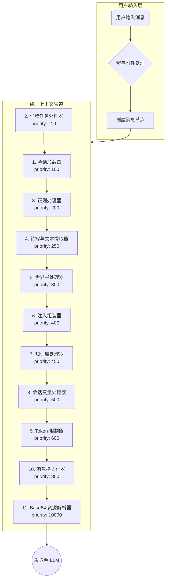

# LLM Chat 上下文管道架构 (Context Pipeline Architecture)

## 1. 设计概述

LLM Chat 的上下文构建采用 **统一管道架构 (Unified Pipeline Architecture)**，将复杂的上下文组装流程整合为一个单一、可配置的处理器流水线。

这种设计的核心理念是 **"单一数据流"** 模型：

1.  **统一管道**：所有处理步骤（加载、转换、截断、注入、后处理、附件转换）都在同一个管道中按优先级顺序执行。
2.  **保留元数据**：在管道执行过程中，消息保持"中间格式"，包含原始附件引用，直到最后一步才转换为最终发送格式。
3.  **灵活配置**：所有处理器都可配置、可排序、可启用/禁用，通过 `priority` 字段控制执行顺序。

## 2. 架构总览

### 2.1. 数据流向

以下 Mermaid 图展示了从用户输入到最终发送给 LLM 的完整流程（当前已实现架构）：



### 2.2. 核心概念

| 概念                        | 说明                                                                                                |
| :-------------------------- | :-------------------------------------------------------------------------------------------------- |
| **PipelineContext**         | 在管道中流动的统一数据载体，包含消息列表、元数据和共享黑板                                          |
| **ContextProcessor**        | 负责单一功能的模块化处理单元，可配置、可排序、可启用/禁用。支持通过 `configFields` 自动生成配置界面 |
| **Infrastructure Services** | 如 `MacroProcessor`，作为基础能力被处理器按需调用，而非管道步骤                                     |
| **中间格式消息**            | 在管道中流动的消息，保持附件引用格式，直到最后一步由 `asset-resolver` 转换为最终格式                |

## 3. 统一管道设计

统一管道负责将原始数据组装成最终发送给 LLM 的上下文。其内部执行严格遵循处理器的优先级顺序：

### 3.1. 执行顺序

1.  **加载会话历史** (priority: 100)：从会话树中提取活动分支，转换为中间格式消息（保留附件引用），支持 HTML 到 Markdown 的转换。这是管道的起点。
2.  **异步任务处理** (priority: 110)：检测工具调用节点中的异步任务，从 `asyncTaskStore` 获取最新状态，并动态替换或增强节点内容。必须在消息加载后执行。
3.  **正则处理** (priority: 200)：**就地修改**消息内容，应用基于角色和深度的正则替换规则。
4.  **转写与文本提取** (priority: 250)：对音视频/图片附件进行转写，或直接读取文本附件内容并插入消息，以便后续 Token 计算。
5.  **世界书处理** (priority: 300)：执行 SillyTavern 风格的世界书关键词匹配与注入。
6.  **注入与组装** (priority: 400)：处理 Agent 预设消息（骨架、深度注入、锚点注入），执行宏处理，并与历史消息精密组装。
7.  **知识库处理** (priority: 450)：执行 RAG 检索并替换 `【kb】` 占位符。
8.  **会话变量处理** (priority: 500)：解析消息中的 `<svar>` 标签，维护变量状态快照，并执行 `$[...]` 变量替换。
9.  **Token 限制** (priority: 600)：**此步骤发生在注入与变量替换之后**。限制器计算所有消息的 Token 占用，优先保留预设消息，截断多余的历史消息（支持部分截断保留开头）。
10. **消息格式化** (priority: 800)：应用模型特定的格式化规则（合并 System、合并连续角色、转换 System、确保角色交替等）。
11. **Base64 资源解析** (priority: 10000)：**最后一步**，将剩余的二进制附件引用转换为 LLM 最终发送格式。

### 3.2. 内置处理器

以下是系统内置的核心处理器，按默认优先级排序：

| ID                            | 名称              | 职责                                                                | 优先级 |
| :---------------------------- | :---------------- | :------------------------------------------------------------------ | :----- |
| `primary:session-loader`      | 会话加载器        | 加载会话历史为中间格式消息（保留附件引用），支持 HTML→Markdown 转换 | 100    |
| `async-task-processor`        | 异步任务处理器    | 检测工具调用节点中的异步任务，并注入最新状态到上下文中              | 110    |
| `primary:regex-processor`     | 正则处理器        | 对历史消息应用正则规则（支持角色过滤和深度限制）                    | 200    |
| `transcription-processor`     | 转写与文本提取器  | 对音频/视频/图片转写，及读取文本附件内容，插入消息以便 Token 计算   | 250    |
| `primary:worldbook-processor` | 世界书处理器      | 执行 SillyTavern 风格的世界书关键词匹配与注入                       | 300    |
| `primary:injection-assembler` | 注入组装器        | 处理预设、注入、宏，并与历史消息组装。支持模型/渠道匹配规则         | 400    |
| `primary:knowledge-processor` | 知识库处理器      | 执行 RAG 检索并替换 `【kb】` 占位符                                 | 450    |
| `primary:variable-processor`  | 会话变量处理器    | 处理 `<svar>` 标签并维护变量状态快照，执行 `$[...]` 替换            | 500    |
| `primary:token-limiter`       | Token 限制器      | 根据预算截断历史消息（优先保留预设消息，支持保留截断消息开头）      | 600    |
| `message-formatter`           | 消息格式化器      | 负责合并 System、合并连续角色、转换 System、确保角色交替等          | 800    |
| `asset-resolver`              | Base64 资源解析器 | 将剩余的二进制附件引用转换为最终发送格式（结构化对象或 Base64）     | 10000  |

> **设计要点**：
>
> 1. **宏处理** (`macro`)：不是独立的管道处理器，而是被 `injection-assembler` 等按需调用的基础能力。
> 2. **Token 限制器位置**：优先级为 600，在 `injection-assembler` (400) 和 `variable-processor` (500) 之后执行。这确保了限制器能准确计算所有已注入消息（预设、深度注入、变量替换后内容）的 Token 占用，从而精准控制总长度。
> 3. **变量处理器**：在 Token 限制之前执行，确保被替换进去的变量内容也能被正确计入 Token 预算。
> 4. **资产解析延迟**：`asset-resolver` 拥有最高优先级（10000），确保 Base64 大数据不会干扰前面的文本处理和 Token 计算逻辑。

## 4. 核心处理器详解

### 4.1. 会话加载器 (Session Loader)

**职责**：

- 从会话树状结构中提取当前活动分支的线性历史记录
- 处理上下文压缩（过滤被压缩节点）
- 支持 HTML 到 Markdown 的转换以节省 Token
- 处理待发送消息预览（Pending Input）

**关键特性**：

- **压缩感知**：自动识别并隐藏被压缩的节点
- **HTML 优化**：对较旧的消息进行 HTML→Markdown 转换，保留最近 N 条消息的原始格式
- **Markdown 后处理**：清理 turndown 输出中的冗余结构（空行、注释、空链接等）
- **Tool 角色转换**：根据配置将 tool 角色转换为 user 角色

### 4.2. 世界书处理器 (Worldbook Processor)

**职责**：

- 实现 SillyTavern 风格的世界书系统
- 支持关键词匹配、递归、Sticky、Cooldown 等高级特性
- 处理包含组（Inclusion Groups）和权重竞争

**关键特性**：

- **扫描缓冲区**：模拟 ST 的扫描机制，支持深度扫描和全局字段匹配
- **激活逻辑**：支持 Constant、Delay、Cooldown、Sticky、Selective 等多种激活条件
- **递归注入**：支持多轮递归扫描和延迟递归层级
- **位置注入**：支持 BeforeChar、AfterChar、Depth、Outlet 等多种注入位置
- **角色过滤**：支持基于 Agent 名称和标签的过滤器

### 4.3. 注入组装器 (Injection Assembler)

**职责**：

- 处理 Agent 预设消息的分类和组装
- 执行宏处理
- 实现深度注入和锚点注入
- 支持模型匹配规则

**关键特性**：

- **消息分类**：将预设消息分为骨架、深度注入、锚点注入三类
- **高级深度配置**：支持单点（"5"）、多点（"3, 10, 15"）、循环（"10~5"）和混合语法
- **模板锚点**：支持可渲染内容的锚点（如 user_profile）
- **模型匹配**：支持基于正则表达式的模型/渠道匹配规则，动态启用/禁用预设消息
- **宏处理**：在注入前处理所有宏占位符

### 4.4. 知识库处理器 (Knowledge Processor)

**职责**：

- 扫描预设/注入消息中的 `【kb::…】` / `【knowledge::…】` 占位符并执行 RAG 检索。
- 根据 `knowledgeBaseConfig.autoInjectIfMacroMissing` 在缺失占位符时按 binding 粒度自动注入。
- 将检索结果按模板渲染回原占位符位置。

**占位符语法**：`【kb::kbName::limit::minScore::mode::modeParams::engineId】`，除 `mode` 外所有段均可省略；`kb` 与 `knowledge` 等价。

**扫描范围**：[`scanPlaceholders()`](../../core/context-processors/knowledge-processor.ts:85) 明确**跳过 `sourceType === "session_history"` 的消息**，对话历史不参与被动召回。

**激活模式**：

- `always`：每次都激活。
- `gate`：在最近 `gateScanDepth` 条消息中扫描 `modeParams` 中的关键词，命中任一即激活。
- `turn`：按 user 消息总数对 `modeParams[0]` 取模，控制召回频率。
- `static`：跳过检索流程，直接通过 `kb_get_entries` 后端命令加载指定条目；`static::all` 可加载指定库（或所有库）的全部已启用条目。

**自动注入 (Auto Inject)**：

- 由 Agent 的 `knowledgeBaseConfig.autoInjectIfMacroMissing` 开关控制。
- **细粒度判定**：已被手动占位符引用的 binding 跳过自动注入；用户写一个无名 `【kb】` 视为"全量接管"，所有 binding 都不再自动注入。
- 注入位置由 `autoInjectPosition` 决定：
  - `context_head`（默认）：追加到 System 消息末尾；无 System 时在最前插入一条独立的 user 消息（用 `【RAG信息】… 【RAG信息结束】` 围栏标记）。
  - `before_last_user`：插入到最后一条用户消息之前；若前一条是 System 则改为追加到该 System。

**检索引擎选择**（优先级 **宏参数 > Agent 默认 > 全局默认**）：

- `vector`：向量检索（需要 Embedding 模型）。
- `keyword`：纯关键词检索。
- `hybrid`：向量 + 关键词混合。

**向量空间融合查询**（[`extractContextParts()`](../../core/context-processors/knowledge-processor.ts:480) + [`buildContextQueryVector()`](../../core/context-processors/knowledge-processor.ts:550)）：

- 从过滤后的 `session_history` 消息中按"轮"提取最近 `contextWindow` 轮历史。
- **分别拼接 user 文本和 AI 文本**（assistant + tool 归入 AI 侧），**不在文本层面混合角色标记**。
- user 文本经 [`preprocessQuery()`](../../../knowledge-base/utils/queryPreProcessor.ts:216) 处理（Markdown / HTML / KB 占位符清洗 → `Intl.Segmenter` 分词 → 停用词过滤 → Tag 池 n-gram 匹配），AI 文本直接使用原文。
- user / AI 分别通过 `vectorCacheManager` 取得向量，再在**向量空间按 `0.7 / 0.3` 加权平均**得到查询向量。
- 关键词检索使用清洗后的 user 文本；额外提取出的 Tag 直接作为 `requiredTags` 过滤条件。

**缓存机制**（已迁移至后端 Rust LRU，详见 [`knowledge-cache-backend-migration.md`](../Plan/knowledge-cache-backend-migration.md)）：

- **检索结果缓存**：[`kb_retrieval_cache_get`](src-tauri/src/knowledge/commands/retrieval_cache.rs:1) / `_set` / `_clear`。缓存键 = `SHA-256(query + kbIds + tags + limit + minScore + engineId + modelId)`，**完全一致才命中**，无相似度匹配。
- **全局共享**：缓存活在后端 `KnowledgeState` 内，**不再按 session 隔离**——相同查询跨会话也能命中。容量上限由 `chatSettings.knowledgeBase.retrievalCacheMaxItems` 控制。
- **Embedding 向量缓存**：由知识库模块的 `vectorCacheManager` 独立管理，与检索结果缓存解耦。
- **缓存开关**：Agent 级 `knowledgeSettings.enableCache`，缺失时回退到旧版 `aggregation.enableCache`（迁移兼容）。
- **降级策略**：任何后端 invoke 异常都被 `try/catch` 吞掉并降级为不缓存，不阻塞主流程。

**结果约束**：

- 召回后按 `maxRecallChars` 累加截断（超出阈值的条目被丢弃，**不做摘要**）。
- 按 `resultTemplate`（支持 `{count}` / `{kbName}` / `{key}` / `{content}` / `{score}` / `{tags}` 变量）渲染最终注入文本。
- 空结果回退到 `emptyText`，未激活的占位符会被静默替换为空字符串。

### 4.5. Token 限制器 (Token Limiter)

**职责**：

- 根据预算截断历史消息
- 优先保留预设消息
- 支持部分截断保留开头

**位置**: Token 限制器 ([`token-limiter.ts`](../../core/context-processors/token-limiter.ts)) 位于注入组装器之后（`priority: 600`）、消息格式化之前运行。这意味着它能感知到所有将被发送的消息（包括刚刚注入的预设、档案、知识库片段、会话变量替换结果）。

**智能截断算法**（[`token-limiter.ts:64-176`](../../core/context-processors/token-limiter.ts:64)）:

1.  **「必须保留」判定标准**: 按 `message.sourceType` 区分 —— **所有 `sourceType !== 'session_history'` 的消息均视为「预设/必须保留」**，包括 System Prompt、注入的预设、用户档案、世界书条目、知识库结果、压缩节点摘要等；只有 `sourceType === 'session_history'` 的消息才参与截断。代码中**不存在「锚点深度」概念** —— 锚点机制属于注入组装阶段（`injection-assembler`），与截断器解耦。
2.  **预算分配**: 先累加所有预设消息的 Token 得到 `presetTokens`，然后 `availableForHistory = maxContextTokens - presetTokens`，剩余空间全部分配给历史消息。
3.  **预算超出的极端处理**: 当 `availableForHistory <= 0`（即预设消息本身就超过总预算）时，**预设消息仍然全部保留**（不会反向截断预设），历史消息被**完全清空**，并记录一条 `warn` 级别日志。这一策略保证了预设/系统提示的完整性优先级最高。
4.  **历史滑动方向**: **从最新到最旧倒序遍历**（`for (let i = historyMessages.length - 1; i >= 0; i--)`），保留尽量靠近当前轮次的消息，丢弃最早的消息。**不做 user/assistant 成对保留** —— 每条消息独立计算预算，可能出现孤立的 assistant 回复（缺少对应的 user 提问），由模型/上层自行兼容。
5.  **工具调用消息链（tool 角色）**: 代码层面**不存在 tool 整链保护策略**，`tool` 角色的消息与普通 user/assistant 消息一样按 `sourceType` 区分截断。工具调用上下文若来源于历史节点（`session_history`），同样可能被中段截断；若是当轮工具调用产生（仍在 pathToUserNode 内），通常因位置靠后而自然保留。

**关键特性**：

- **预设优先**：先计算预设消息的 Token 占用，剩余预算分配给历史
- **从后往前截断**：保留最新的历史消息
- **部分截断**: 当一条历史消息整体放不下、但仍有部分预算时，若配置了 `retainedCharacters > 0` 且消息内容为纯文本，会截取其开头 N 个字符并追加 `\n...(已截断)` 后尝试放入，作为对长消息的「摘要式」保留，避免信息完全丢失。
- **统计输出**: 截断完成后会向 `context.sharedData` 写入 `tokenLimiterStats`（含 `originalHistoryCount` / `finalHistoryCount` / `truncatedCount` / `presetTokens` / `historyTokens` / `savedTokens` / `savedChars` 等字段），供「上下文分析器」预览面板使用。

### 4.6. 会话变量处理器 (Variable Processor)

**职责**：

- 解析消息中的 `<svar>` 标签并维护变量状态。
- 实现变量快照机制，支持在分支切换和压缩后恢复状态。
- 执行内置替换符 `$[...]` 的动态渲染。

**关键特性**：

- **标签解析**：支持 `<svar name="path" op="+" value="1" />` 语法。
- **快照回溯**：从后往前寻找最近的消息元数据快照 (`sessionVariableSnapshot`) 作为计算起点。
- **持久化**：在检测到变更或节点被压缩时，将当前状态快照存入消息元数据。
- **内置函数**：支持 `$[svars::table]` 等内置格式化函数，将所有可见变量渲染为表格或列表。

### 4.7. 消息格式化器 (Message Formatter)

**职责**：

- 应用模型特定的格式化规则。
- 支持 Agent 和模型的配置合并。

**子处理器**：

1.  **合并 System 消息到头部** (`post:merge-system-to-head`, priority: 810)：将所有 system 消息合并为一条。
2.  **合并连续相同角色** (`post:merge-consecutive-roles`, priority: 820)：合并连续出现的相同角色消息。
3.  **转换 System 为 User** (`post:convert-system-to-user`, priority: 830)：将 system 角色转换为 user。
4.  **确保角色交替** (`post:ensure-alternating-roles`, priority: 840)：强制实现 user 和 assistant 的严格交替。

**配置合并策略**：默认状态 → 模型规则覆盖 → Agent 规则覆盖。

### 4.8. Base64 资源解析器 (Asset Resolver)

**职责**：

- 将中间格式消息中的附件引用转换为最终发送格式
- 处理图片、文档、音频、视频等多种类型

**关键特性**：

- **PDF 智能转换**：如果模型不支持原生 PDF 但支持视觉，自动将 PDF 转换为图片序列
- **格式适配**：根据模型能力选择合适的发送格式（base64 或结构化对象）
- **错误处理**：单个附件失败不影响其他附件的处理

## 5. 中间格式消息与资产解析

### 5.1. 中间格式消息

在管道执行过程中，消息保持"中间格式"，其特点是：

```typescript
interface ProcessableMessage {
  role: "system" | "user" | "assistant" | "tool";
  // 内容可以是纯文本，或包含附件引用的特殊结构
  content: string | LlmMessageContent[];
  // 附件引用信息（在 asset-resolver 之前保留）
  _attachments?: Asset[];
  // 来源类型标识
  sourceType?:
    | "session_history"
    | "agent_preset"
    | "depth_injection"
    | "anchor_injection"
    | "merged";
  // 来源 ID（用于追溯）
  sourceId?: string;
  // 其他元数据...
}
```

实际类型定义见 `src/tools/llm-chat/types/context.ts`。

### 5.2. Base64 资源解析器 (`asset-resolver`)

`asset-resolver` 处理器的职责（仅处理二进制附件）：

1.  **识别附件引用**：扫描所有消息的 `_attachments` 字段，找出剩余的二进制附件（文本类型的附件已在 `transcription-processor` 中被消费）。
2.  **转换为最终格式**：根据模型能力和设置，将附件引用转换为：
    - 对于图片：转换为 `{ type: "image", imageBase64: "..." }` 格式（项目内部统一格式）。
    - 对于文档/音视频：转换为 `{ type: "document" | "audio" | "video", source: { type: "base64", media_type: "...", data: "..." } }` 结构化对象。
3.  **更新消息内容**：将转换后的结构化内容追加到消息的 `content` 字段。
4.  **记录转换日志**：在 `PipelineContext.logs` 中记录转换详情。

### 5.3. 配置合并策略 (Agent 与模型的协同)

为了兼顾灵活性与一致性，处理器配置采用两级合并策略，遵循 **"Agent 优先，模型兜底"** 的原则。

**合并逻辑**:

在执行管道之前，会进行以下合并：

1.  **加载模型配置**: 获取当前模型定义的默认处理器配置列表（包含启用状态和参数）。
2.  **加载 Agent 配置**: 获取当前 Agent 定义的处理器配置列表（包含启用状态和参数）。
3.  **执行合并**:
    - 如果某个处理器仅在模型配置中存在，则直接使用模型配置。
    - 如果某个处理器仅在 Agent 配置中存在，则直接使用 Agent 配置。
    - 如果某个处理器在两者中都存在（ID 相同），则**Agent 配置完全覆盖模型配置**。这是为了确保 Agent 的特定需求（如特定的 Prompt 风格）总是优先于模型的默认行为。

通过这种方式，模型可以携带一套"最佳实践"的默认处理器配置，而 Agent 依然拥有最终的决定权。

## 6. 接口定义

### 6.1. PipelineContext

```typescript
export interface PipelineContext {
  // --- 核心可变数据 ---
  /**
   * 当前正在构建的消息列表。
   * 处理器可以直接修改此数组（增删改）。
   */
  messages: ProcessableMessage[];

  // --- 只读元数据 ---
  readonly session: ChatSession;
  readonly userProfile?: UserProfile;
  readonly agentConfig: ChatAgent; // 完整的智能体配置
  readonly settings: ChatSettings; // 全局聊天设置
  readonly capabilities?: ModelCapabilities;
  readonly timestamp: number;

  // --- 共享黑板 (Shared Blackboard) ---
  /**
   * 用于处理器之间传递临时数据。
   * 例如：图像分析器提取的描述可以存放在这里，供后续的 Prompt 处理器读取。
   */
  sharedData: Map<string, any>;

  // --- 日志记录 ---
  /**
   * 处理器可以记录处理日志，用于调试和可视化展示。
   */
  logs: Array<{
    processorId: string;
    level: "info" | "warn" | "error";
    message: string;
    details?: any;
  }>;
}
```

### 6.2. ContextProcessor

```typescript
export interface ContextProcessor {
  /** 唯一标识符 (例如: 'primary:session-loader') */
  id: string;

  /** 显示名称 (例如: '会话加载器') */
  name: string;

  /** 描述信息 */
  description: string;

  /**
   * 执行优先级 (数字越小越靠前)
   * 用于处理器的排序，核心处理器应有固定的优先级。
   */
  priority: number;

  /** 图标 (Lucide 图标名或 URL) */
  icon?: string;

  /** 是否为系统核心处理器 (不可删除，但可能允许禁用) */
  isCore?: boolean;

  /** 默认启用状态 */
  defaultEnabled?: boolean;

  /**
   * 核心执行逻辑
   * @param context 管道上下文
   */
  execute(context: PipelineContext): Promise<void>;

  /**
   * 配置组件 (可选)
   * 如果处理器有自定义配置，可以返回一个 Vue 组件名称
   */
  configComponent?: string;

  /**
   * 配置字段定义 (可选)
   * 用于自动生成简单的配置 UI，无需编写自定义组件
   */
  configFields?: ProcessorConfigField[];
}

export interface ProcessorConfigField {
  key: string;
  label: string;
  type?: "text" | "number" | "boolean" | "select";
  placeholder?: string;
  default?: any;
  options?: { label: string; value: any }[];
}
```

