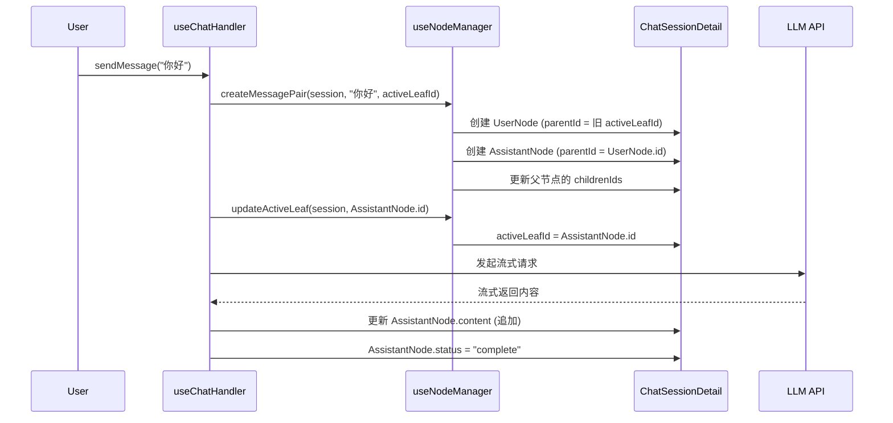
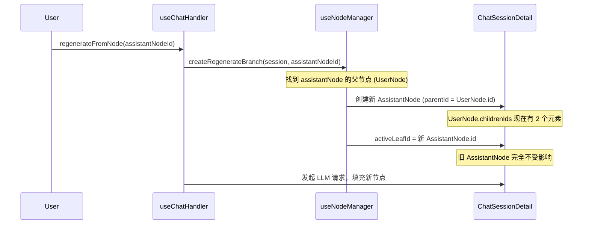
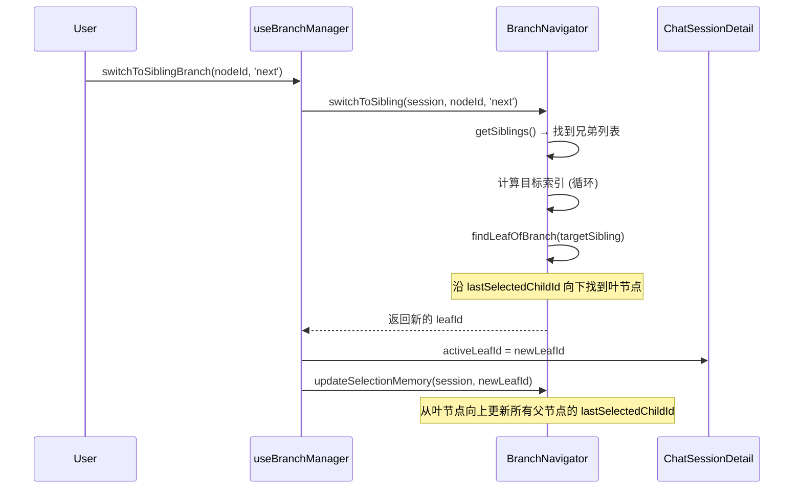

# 树状会话结构与无损分支操作

本文档详细说明 `llm-chat` 的树状对话历史系统如何通过**非破坏性 (Non-destructive)** 设计，在不丢失任何历史数据的前提下处理消息的编辑、重新生成、续写等变化操作。

## 1. 核心数据结构

### 1.1. 消息节点 (`ChatMessageNode`)

每条消息都是一个独立的节点对象，通过指针建立树形关系：

```typescript
interface ChatMessageNode {
  id: string;                    // 唯一标识
  parentId: string | null;       // 父节点 ID（根节点为 null）
  childrenIds: string[];         // 子节点 ID 列表（有序）
  lastSelectedChildId?: string;  // 分支记忆：上次选中的子节点
  content: string;               // 消息文本内容
  role: MessageRole;             // 角色：system | user | assistant | tool
  status: MessageStatus;         // 生命周期：complete | generating | error
  isEnabled?: boolean;           // 是否参与上下文构建（软删除标记）
  timestamp?: string;            // 创建时间
  metadata?: { ... };            // 丰富的元数据（模型快照、性能指标等）
}
```

**关键设计点**：

- 节点之间通过 `parentId` / `childrenIds` 双向链接，形成一棵多叉树。
- `childrenIds` 是有序数组，顺序即为分支的创建顺序。
- `lastSelectedChildId` 是分支记忆的核心，记录用户上次在此节点选择了哪个子分支。

### 1.2. 会话容器 (`ChatSessionDetail`)

```typescript
interface ChatSessionDetail {
  id: string;
  nodes: Record<string, ChatMessageNode>; // 所有节点的字典（以 ID 为键）
  rootNodeId: string; // 树的根节点 ID
  activeLeafId: string; // 当前活跃路径的叶节点 ID
  history: HistoryEntry[]; // 撤销/重做历史栈
  historyIndex: number; // 当前历史位置
}
```

**关键设计点**：

- `nodes` 是扁平字典而非嵌套结构，便于 O(1) 查找任意节点。
- `activeLeafId` 是整个 UI 渲染的"指针"——它决定了用户当前看到的是哪条对话路径。
- 改变 `activeLeafId` 就能瞬间切换到任意分支，无需移动或复制数据。

### 1.3. 树的可视化结构

```
Root (system)
 └── User: "解释量子纠缠"
      ├── Assistant: "从经典物理角度..." (分支 1/2)
      │    └── User: "继续深入"
      │         └── Assistant: "详细解释..."
      └── Assistant: "从量子力学角度..." (分支 2/2)  ← 重新生成产生
           └── User: "举个例子"
                ├── Assistant: "EPR 实验..."  (分支 1/2)
                └── Assistant: "贝尔不等式..." (分支 2/2) ← activeLeafId 指向此处
```

从 `activeLeafId` 向上回溯到 Root，经过的路径就是当前 UI 展示的线性对话。

## 2. 非破坏性操作的核心原则

### 2.1. 设计哲学

> **默认不覆盖，但保留覆盖的自由。**

传统聊天应用在"重新生成"时会直接替换旧回复，导致数据不可逆地丢失。本系统的核心理念是：

1. **默认保留旧数据**：重新生成、续写等高频操作不会覆盖已有节点，而是创建新分支。
2. **新数据作为兄弟节点**：变化通过创建新的兄弟节点（同一父节点下的另一个子节点）来表达。
3. **视图切换而非数据修改**：用户看到的"切换"只是 `activeLeafId` 指针的移动。
4. **用户有最终决定权**：对于编辑操作，用户可以选择"直接保存"（覆盖）或"保存到分支"（非破坏），系统不强制走哪条路。

### 2.2. 操作分类

| 操作                  | 破坏性？  | 实现方式                       |
| --------------------- | --------- | ------------------------------ |
| 重新生成 (Regenerate) | ❌ 非破坏 | 创建新的助手兄弟节点           |
| 续写 (Continue)       | ❌ 非破坏 | 创建新的助手兄弟节点（带前缀） |
| 编辑 → 保存到分支     | ❌ 非破坏 | 创建新的兄弟节点，原节点不变   |
| 编辑 → 直接保存       | ⚠️ 覆盖   | 直接修改节点 content（可撤销） |
| 切换分支              | ❌ 非破坏 | 仅移动 activeLeafId 指针       |
| 禁用节点              | ❌ 非破坏 | 设置 isEnabled = false         |
| 硬删除                | ⚠️ 破坏性 | 从树中移除（可撤销）           |
| 嫁接/移动             | ❌ 非破坏 | 修改父子关系指针               |

## 3. 各操作的详细机制

### 3.1. 重新生成 (Regenerate)

**场景**：用户对助手的回答不满意，希望获得新的回答。

**流程**：

```
操作前:
  User: "你好"
   └── Assistant: "你好！有什么..." (旧回答)  ← activeLeafId

操作后:
  User: "你好"
   ├── Assistant: "你好！有什么..." (旧回答，保留)
   └── Assistant: "嗨！今天想聊..." (新回答)  ← activeLeafId 移到这里
```

**代码路径** ([`useNodeManager.createRegenerateBranch()`](../../composables/session/useNodeManager.ts:194))：

1. 定位目标节点的父节点（用户消息）。
2. 在该用户消息下创建一个新的空助手节点（`status: "generating"`）。
3. 新节点自动成为用户消息的另一个子节点（兄弟关系）。
4. 更新 `activeLeafId` 指向新节点。
5. 发起 LLM 请求，流式填充新节点内容。

**关键保证**：旧的助手回答节点完全不受影响，用户随时可以通过分支切换回去查看。

### 3.2. 续写 (Continue)

**场景**：助手回答被截断或用户希望模型继续生成。

**流程**：

```
操作前:
  User: "写一篇文章"
   └── Assistant: "第一段内容..." (被截断)  ← activeLeafId

操作后:
  User: "写一篇文章"
   ├── Assistant: "第一段内容..." (原始，保留)
   └── Assistant: "第一段内容...第二段继续..." (续写)  ← activeLeafId
```

**代码路径** ([`useNodeManager.createContinuationBranch()`](../../composables/session/useNodeManager.ts:292))：

1. 创建新的助手兄弟节点，**初始内容等于原节点内容**（作为前缀）。
2. 在 metadata 中记录 `continuationPrefix`（原始前缀）和 `isContinuation: true`。
3. 发起 LLM 请求时，利用 `prefix` / `prefill` 特性让模型从前缀末尾继续生成。
4. 新生成的内容追加到前缀之后。

**关键保证**：原始的被截断节点保持不变，续写结果是一个独立的新分支。

### 3.3. 编辑消息 — 双模式设计

编辑操作提供了两种保存方式，由用户自行选择，兼顾灵活性和数据安全：

#### 模式 A：直接保存 (Save in-place)

**场景**：修正错别字、微调措辞等轻量修改，不需要保留旧版本。

**代码路径** ([`useBranchManager.editMessage()`](../../composables/session/useBranchManager.ts:84))：

1. 直接修改节点的 `content` 字段。
2. 如果提供了新附件，更新 `attachments` 字段。
3. **不创建新节点**，不改变树结构。

**覆盖保护**：虽然是覆盖操作，但受到撤销系统的保护——操作前会记录 `NODE_EDIT` 类型的历史条目，包含修改前的完整节点状态，可以随时回滚。

#### 模式 B：保存到分支 (Save to Branch)

**场景**：用户想保留原始内容，同时探索"如果这么问会怎样？"

**流程**：

```
操作前:
  Root
   └── User: "解释 Python" (原始)
        └── Assistant: "Python 是..."

操作后:
  Root
   ├── User: "解释 Python" (原始，保留)
   │    └── Assistant: "Python 是..."
   └── User: "解释 Rust" (编辑后的新分支)  ← activeLeafId
        └── Assistant: (等待生成)
```

**代码路径** ([`useNodeManager.createBranchFromEdit()`](../../composables/session/useNodeManager.ts:993))：

1. 以源节点的父节点为父，创建一个新的兄弟节点。
2. 新节点的 `role` 保持与源节点一致。
3. 新节点的 `content` 为编辑后的新内容。
4. 清理执行相关的元数据（token 统计、翻译缓存等），保留身份快照。
5. 切换 `activeLeafId` 到新节点，触发后续的 LLM 请求。

**关键保证**：源节点及其整个子树完全不受影响。

#### 设计理念

系统不强制用户必须走非破坏路径。对于简单的修正，直接保存更高效；对于探索性的修改，保存到分支更安全。两种模式并存，让用户根据实际需求自由选择。

### 3.4. 分支切换 (Switch Branch)

**场景**：用户想查看同一问题的不同回答。

**代码路径** ([`useBranchManager.switchToSiblingBranch()`](../../composables/session/useBranchManager.ts:56))：

1. 通过 `BranchNavigator.switchToSibling()` 找到目标兄弟节点。
2. 从目标节点向下，沿着 `lastSelectedChildId` 记忆路径找到最深的叶节点。
3. 将 `activeLeafId` 设为该叶节点。
4. 调用 `updateSelectionMemory()` 更新路径上所有父节点的选择记忆。

**关键保证**：纯指针操作，零数据修改。切换是瞬时的，不涉及任何节点的创建或删除。

### 3.5. 节点禁用 (Soft Delete / Toggle Enabled)

**场景**：用户想临时从上下文中排除某条消息，但不想永久删除。

**代码路径** ([`useNodeManager.softDeleteNode()`](../../composables/session/useNodeManager.ts:386) / [`useBranchManager.toggleNodeEnabled()`](../../composables/session/useBranchManager.ts:218))：

1. 设置 `node.isEnabled = false`。
2. 上下文管道在构建 LLM 请求时会跳过 `isEnabled === false` 的节点。
3. UI 中该节点会以半透明/删除线样式显示。

**关键保证**：节点数据完整保留，随时可以重新启用。

### 3.6. 嫁接与移动 (Graft & Move)

**场景**：在树状图视图中，用户拖拽一个节点（或子树）到另一个父节点下。

**子树嫁接** ([`useNodeManager.reparentSubtree()`](../../composables/session/useNodeManager.ts:798))：

- 将节点及其所有后代整体移动到新父节点下。
- 只修改指针关系（`parentId`、`childrenIds`），不复制或删除任何节点。

**单点移动** ([`useNodeManager.reparentNode()`](../../composables/session/useNodeManager.ts:908))：

- 只移动单个节点，其子节点被"收养"回原父节点。
- 移动后该节点的 `childrenIds` 被清空。

**安全检查**：

- 禁止嫁接根节点。
- 禁止嫁接到自身。
- 禁止嫁接到自己的后代（防止循环引用）。

## 4. 分支导航与记忆系统

### 4.1. `activeLeafId` — 视图指针

`activeLeafId` 是整个系统的"光标"。UI 渲染逻辑非常简单：

```
从 activeLeafId 向上回溯到 rootNodeId → 得到线性路径 → 渲染为对话列表
```

切换分支 = 移动 `activeLeafId` = 瞬间看到不同的对话历史。

### 4.2. `lastSelectedChildId` — 分支记忆

当一个节点有多个子节点（即存在分支）时，系统需要知道"上次用户看的是哪个分支"。

**记忆更新时机** ([`BranchNavigator.updateSelectionMemory()`](../../utils/BranchNavigator.ts:138))：

每当 `activeLeafId` 发生变化时，系统会从新的叶节点向上遍历到根节点，沿途更新每个父节点的 `lastSelectedChildId`。

```
假设路径为: Root → A → B → C (activeLeafId = C)

更新后:
  Root.lastSelectedChildId = A
  A.lastSelectedChildId = B
  B.lastSelectedChildId = C
```

**记忆使用时机** ([`BranchNavigator.findLeafOfBranch()`](../../utils/BranchNavigator.ts:89))：

当切换到某个兄弟节点时，系统需要找到该分支的叶节点。策略是：

1. 优先使用 `lastSelectedChildId`（如果存在且有效）。
2. 否则使用 `childrenIds[0]`（第一个子节点）。
3. 递归向下直到找到叶节点。

这确保了用户切换回某个分支时，会自动恢复到上次查看的位置，而不是总是跳到第一个子节点。

### 4.3. 兄弟节点导航

UI 中每个有兄弟的节点旁边会显示 `< 1/3 >` 这样的导航器。

```typescript
// 获取当前节点在兄弟中的位置
BranchNavigator.getSiblingIndex(session, nodeId);
// → { index: 0, total: 3 }

// 切换到下一个兄弟
BranchNavigator.switchToSibling(session, nodeId, "next");
// → 返回新的 activeLeafId
```

切换逻辑支持循环（最后一个的 next 是第一个）。

## 5. 撤销/重做系统

### 5.1. 混合存储策略

为了平衡内存占用和恢复速度，系统采用**快照 (Snapshot) + 增量 (Delta)** 混合策略：

```
[Snapshot] → [Delta] → [Delta] → ... → [Snapshot] → [Delta] → ...
     ↑                                       ↑
  锚点快照                              每 15 步或复杂操作后自动创建
```

**自动创建快照的条件**（满足任一即触发）：

- 距上次快照已累计超过 30 个受影响节点。
- 距上次快照已累计超过 15 个 Delta 条目。

### 5.2. Delta 类型

```typescript
type HistoryDelta =
  | { type: "create"; payload: { node; relationChange } } // 创建节点
  | { type: "delete"; payload: { deletedNode; relationChange } } // 删除节点
  | { type: "update"; payload: { nodeId; previousNodeState; finalNodeState } } // 更新节点
  | { type: "relation"; payload: { changes: NodeRelationChange[] } } // 关系变化
  | { type: "active_leaf_change"; payload: { oldLeafId; newLeafId } }; // 视图切换
```

每个 Delta 都是**双向可逆**的：

- `forward`：重做时应用 `new` 状态。
- `backward`：撤销时恢复 `old` 状态。

### 5.3. 操作标签 (`HistoryActionTag`)

```typescript
type HistoryActionTag =
  | "INITIAL_STATE" // 初始状态
  | "NODE_EDIT" // 编辑节点内容
  | "NODE_DATA_UPDATE" // 全量更新节点数据
  | "NODE_DELETE" // 删除单个节点
  | "NODES_DELETE" // 批量删除
  | "NODE_TOGGLE_ENABLED" // 切换启用状态
  | "NODE_MOVE" // 移动单个节点
  | "BRANCH_GRAFT" // 嫁接子树
  | "BRANCH_CREATE" // 复制分支
  | "BRANCH_CREATE_FROM_EDIT" // 从编辑创建分支
  | "ACTIVE_NODE_SWITCH"; // 切换活动节点
```

### 5.4. 历史断点

发送新消息或重新生成回复时，系统会调用 `clearHistory()` 清空撤销栈。这是因为：

- 新消息引入了外部状态（LLM 的回复），无法通过本地操作"撤销"。
- 保持时间线的线性逻辑，避免用户困惑。

### 5.5. 恢复流程

撤销/重做通过 `jumpToState(targetIndex)` 实现：

1. 从目标索引向前搜索最近的快照。
2. 加载该快照作为基础状态。
3. 从快照位置向前逐个应用 Delta，直到到达目标索引。

## 6. 上下文压缩的非破坏性设计

### 6.1. 压缩节点

当对话过长时，系统可以将旧消息压缩为摘要。压缩操作创建一个特殊的**压缩节点**：

```
操作前:
  Root → Msg1 → Msg2 → Msg3 → Msg4 → Msg5 (activeLeafId)

操作后:
  Root → [Compression: "摘要..."] → Msg4 → Msg5 (activeLeafId)
              ↓ (metadata.compressedNodeIds)
         [Msg1, Msg2, Msg3 仍然存在于 nodes 字典中]
```

**关键设计**：

- 被压缩的原始节点**不会被删除**，只是从活跃路径中"隐藏"。
- 压缩节点的 `metadata.compressedNodeIds` 记录了被压缩的节点 ID 列表。
- 用户可以展开查看原始消息。

### 6.2. 压缩节点的删除

当用户删除压缩节点时，系统执行特殊逻辑（[`hardDeleteNode`](../../composables/session/useNodeManager.ts:438)）：

1. 不级联删除子节点。
2. 将压缩节点的子节点"归还"给其父节点。
3. 只删除压缩节点本身。

这确保了压缩操作是完全可逆的。

## 7. 完整操作流程示例

### 7.1. 发送消息



### 7.2. 重新生成



### 7.3. 分支切换



## 8. 设计优势总结

| 特性         | 实现方式                     | 用户价值                     |
| ------------ | ---------------------------- | ---------------------------- |
| 零数据丢失   | 所有变化创建新节点而非覆盖   | 永远可以回到任何历史版本     |
| 瞬时分支切换 | 仅移动 activeLeafId 指针     | 毫秒级响应，无需等待         |
| 分支记忆     | lastSelectedChildId 自动维护 | 切换回来时恢复上次位置       |
| 完整可撤销   | 快照 + Delta 混合历史栈      | 任何操作都可以回滚           |
| 灵活的树操作 | 嫁接、移动、禁用             | 自由重组对话结构             |
| 非破坏性压缩 | 压缩节点隐藏而非删除原始数据 | 长对话优化且不丢失细节       |
| 元数据快照   | 每条消息记录生成时的完整配置 | 追溯任何回答使用的模型和参数 |

这套树状结构设计使得 `llm-chat` 能够在保持数据完整性的同时，提供丰富的对话探索和管理能力。用户可以自由地在不同的对话路径之间穿梭，而不必担心丢失任何有价值的内容。
