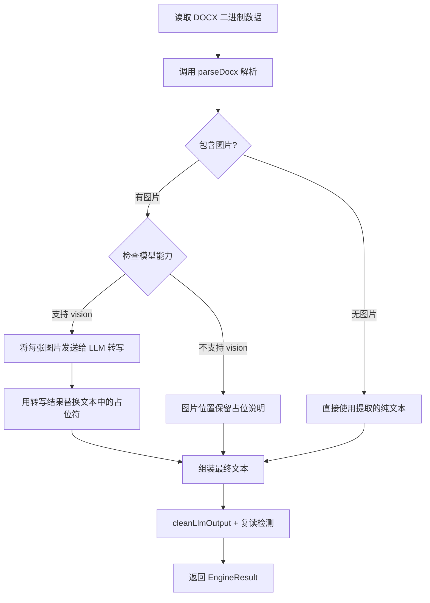
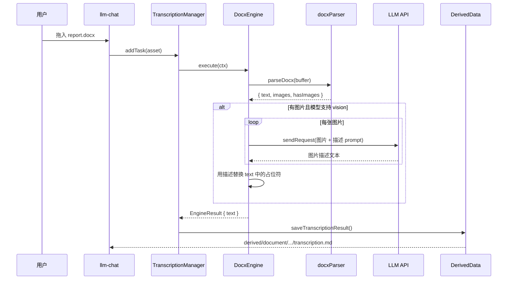

# DOCX 支持方案：转写引擎 + 文档查看器

**状态**: RFC (Request for Comments)
**日期**: 2025-05-20
**涉及模块**: `transcription`、`DocumentViewer`、`useDocumentViewer`、`llm-chat`

---

## 1. 背景与需求

### 1.1. 问题

当前项目在 DOCX 文件的处理上存在两个空白：

1. **转写引擎无 DOCX 支持**：已有 `ImageEngine`、`AudioEngine`、`VideoEngine`、`PdfEngine`，但没有 DOCX 引擎。DOCX 附件在 llm-chat 中无法被解析为文本注入上下文。
2. **DocumentViewer 无 DOCX 预览**：`useDocumentViewer.ts` 只处理 text/\*、PDF、HTML、Markdown。DOCX（MIME: `application/vnd.openxmlformats-officedocument.wordprocessingml.document`）会落入"不支持预览的二进制文件"分支。

### 1.2. 需求

- **DOCX 转写**：解压 DOCX，提取文本内容；如果包含图片，将图片发送给 LLM 视觉模型转写，并将转写结果插入到原文对应位置；纯文本 DOCX 直接提取文字。结果统一存入衍生数据系统。
- **DocumentViewer 支持 DOCX**：在文档查看器中能预览 DOCX 内容（转换为 HTML/Markdown 后渲染）。

---

## 2. 现状调查

### 2.1. 依赖情况

| 项目                  | 状态                                  |
| --------------------- | ------------------------------------- |
| mammoth / docx 解析库 | ❌ 无，需新增                         |
| JSZip / ZIP 解压库    | ❌ 无（mammoth 内置了 DOCX 解压能力） |
| pdf.js (PDF 解析)     | ✅ 已有                               |

### 2.2. 转写引擎架构

- **接口**: [`ITranscriptionEngine`](../../transcription/types.ts) — `canHandle(asset)` + `execute(ctx)`
- **引擎注册**: [`useTranscriptionManager.ts`](../../transcription/composables/useTranscriptionManager.ts:21) 中 `engines` 数组
- **基础设施**: [`base.ts`](../../transcription/engines/base.ts) 提供 `getModelParams()`、`saveTranscriptionResult()`
- **参考实现**: [`PdfTranscriptionEngine`](../../transcription/engines/pdf.engine.ts) — 支持原生 PDF 和视觉回退两条路径

### 2.3. DocumentViewer 架构

- **核心 Composable**: [`useDocumentViewer.ts`](../../../composables/useDocumentViewer.ts) — MIME 检测 → 类型判断 → 内容解码
- **组件**: [`DocumentViewer.vue`](../../../components/common/DocumentViewer.vue) — 分支渲染（Markdown/PDF/HTML/代码）
- **当前 DOCX 行为**: MIME `application/vnd.openxmlformats-officedocument.wordprocessingml.document` → `isTextContent = false` → "不支持预览的二进制文件"

### 2.4. 上下文管道中的附件处理

- [`attachment-resolver.ts`](../core/context-utils/attachment-resolver.ts) 中 `resolveAttachmentContent()`:
  1. 检查 `isTextFile()` → 纯文本直接读取
  2. 检查是否需要转写 → 获取转写结果
  3. 兜底 → 保留为媒体附件
- DOCX 不是纯文本、也没有转写引擎 → **目前会以原始二进制附件形式发送给模型**（大部分模型不识别）

### 2.5. TranscriptionDialog

- [`TranscriptionDialog.vue`](../../../components/common/TranscriptionDialog.vue) 左侧预览区对 `document` 类型目前只显示通用文件图标（`FileIcon`）。

---

## 3. 技术选型

### 3.1. DOCX 解析库

| 库           | 大小                | 能力                               | 推荐度      |
| ------------ | ------------------- | ---------------------------------- | ----------- |
| **mammoth**  | ~120KB (gzip ~35KB) | DOCX → HTML/Markdown，内置图片提取 | ⭐⭐⭐ 推荐 |
| docx-preview | ~200KB+             | DOCX → DOM 渲染，保留高保真格式    | ⭐⭐ 过重   |
| docx4js      | 较冷门              | 底层解析                           | ⭐ 维护差   |

**选择 `mammoth`**：

- 纯 JS，无原生依赖，Bun/Vite 兼容性好
- 内置 `convertImage` 回调，可在转换过程中拦截每张图片（获取 buffer + content-type）
- 输出 HTML 或原始文本，同时满足转写（文本提取）和预览（HTML 渲染）两个场景
- npm 周下载量 200K+，维护活跃

### 3.2. DOCX 内部结构

```
document.docx (ZIP)
├── [Content_Types].xml
├── word/
│   ├── document.xml          ← 主文档内容（段落、表格、图片引用）
│   ├── styles.xml
│   └── media/
│       ├── image1.png        ← 嵌入图片
│       └── image2.jpeg
├── _rels/
└── docProps/
```

mammoth 在解析时会自动处理 `word/document.xml` 中的 `<w:drawing>` / `<w:pict>` 元素，通过 `convertImage` 回调暴露每张图片的二进制数据。

---

## 4. 详细设计

### 4.1. 新增: DOCX 解析工具 (`src/utils/docxParser.ts`)

统一的 DOCX 解析模块，被转写引擎和 DocumentViewer 共用。

```typescript
/** DOCX 中提取的图片 */
interface DocxImage {
  /** 在文档中的序号（从 1 开始） */
  index: number;
  /** 图片 Base64 数据 */
  base64: string;
  /** MIME 类型 (image/png, image/jpeg 等) */
  mimeType: string;
  /** 在输出文本中的占位符标记 */
  placeholder: string; // 格式: <!-- IMG_1 --> 或 [图片 1]
}

/** DOCX 解析结果 */
interface DocxParseResult {
  /** 提取的文本/Markdown 内容（图片位置用占位符标记） */
  text: string;
  /** 转换的 HTML 内容（图片位置用占位符  标记） */
  html: string;
  /** 提取的图片列表 */
  images: DocxImage[];
  /** 是否包含图片 */
  hasImages: boolean;
}

/**
 * 解析 DOCX 文件
 * @param buffer DOCX 文件的二进制数据
 * @returns 解析结果（文本 + 图片）
 */
async function parseDocx(buffer: ArrayBuffer): Promise<DocxParseResult>;

/**
 * 仅提取 DOCX 文本（不处理图片，用于 DocumentViewer 快速预览）
 * @param buffer DOCX 文件的二进制数据
 * @returns HTML 字符串
 */
async function docxToHtml(buffer: ArrayBuffer): Promise<string>;
```

**核心实现逻辑**：

```
parseDocx(buffer):
  1. 初始化图片收集器 images = []
  2. 调用 mammoth.convertToHtml(buffer, {
       convertImage: mammoth.images.imgElement(function(image) {
         // 拦截图片：
         // - 读取 image.read("base64") 获取 Base64
         // - 读取 image.contentType 获取 MIME
         // - 生成占位符 placeholder = `<!-- IMG_${index} -->`
         // - 收集到 images 数组
         // - 返回  标签，src 使用 data: 占位（预览用）
         //   或返回占位符标记（转写用）
       })
     })
  3. 同时调用 mammoth.extractRawText(buffer) 获取纯文本
  4. 在纯文本中，图片位置用 `\n[图片 N]\n` 占位
  5. 返回 { text, html, images, hasImages }
```

### 4.2. 新增: DOCX 转写引擎 (`src/tools/transcription/engines/docx.engine.ts`)

```typescript
class DocxTranscriptionEngine implements ITranscriptionEngine {
  canHandle(asset: Asset): boolean {
    // 匹配 DOCX MIME 或文件扩展名
    return (
      asset.type === "document" &&
      (asset.mimeType === "application/vnd.openxmlformats-officedocument.wordprocessingml.document" ||
        asset.name?.toLowerCase().endsWith(".docx"))
    );
  }

  async execute(ctx: EngineContext): Promise<EngineResult> {
    // 参见下方流程图
  }
}
```

**转写执行流程**：



**图片转写细节**：

- 逐张图片调用 LLM（复用 `useLlmRequest.sendRequest()`）
- 图片转写 prompt 简化为：`"请描述这张图片的内容。如果包含文字请提取文字内容。"`
- 使用 `getModelParams(ctx, "document")` 获取模型配置（复用 document 分类）
- 转写结果格式化后替换占位符：

```markdown
原文位置:
...前文...
[图片 1]
...后文...

替换后:
...前文...

> **[图片 1 转写]**
> 这张图片展示了一个柱状图，横轴为月份...

...后文...
```

- 如果图片转写失败，保留占位说明 `[图片 N: 转写失败]`，不阻断整体流程

### 4.3. 修改: 引擎注册

**文件**: [`useTranscriptionManager.ts`](../../transcription/composables/useTranscriptionManager.ts:21)

```typescript
import { DocxTranscriptionEngine } from "../engines/docx.engine";

const engines: ITranscriptionEngine[] = [
  new ImageTranscriptionEngine(),
  new AudioTranscriptionEngine(),
  new VideoTranscriptionEngine(),
  new PdfTranscriptionEngine(),
  new DocxTranscriptionEngine(), // 新增
];
```

**注意**: `DocxTranscriptionEngine` 必须注册在 `PdfTranscriptionEngine` **之后**，因为 `PdfEngine.canHandle()` 只匹配 `application/pdf`，不会误匹配 DOCX。但如果未来有通用 document 引擎，需注意优先级。

### 4.4. 修改: DocumentViewer 支持 DOCX

#### 4.4.1. `useDocumentViewer.ts` 改动

新增 `isDocx` 计算属性和 DOCX 解析逻辑：

```typescript
const DOCX_MIME = "application/vnd.openxmlformats-officedocument.wordprocessingml.document";

const isDocx = computed(() => mimeType.value === DOCX_MIME);

// 在 loadDocument() 中，MIME 检测之后、解码之前添加：
if (isDocx.value && buffer) {
  // DOCX 是二进制格式，不能用 smartDecode
  // 需要用 mammoth 转换为 HTML
  const { docxToHtml } = await import("@/utils/docxParser");
  const html = await docxToHtml(buffer.buffer);
  decodedContent.value = html;
  // 覆盖 MIME 为 HTML，复用现有 HTML 渲染路径
  // 或保持 DOCX MIME，在 DocumentViewer 中新增分支
}
```

**方案选择**：

- **方案 A**：解析后覆盖 `mimeType` 为 `text/html`，复用 `HtmlInteractiveViewer` 渲染 → 简单但语义不清
- **方案 B** (推荐)：保持 DOCX MIME，在 `DocumentViewer.vue` 中新增 DOCX 渲染分支 → 语义清晰，可定制样式

#### 4.4.2. `DocumentViewer.vue` 改动

新增 DOCX 渲染分支：

```vue
<!-- DOCX 预览（mammoth 转换后的 HTML） -->
<div v-else-if="isDocx && viewMode === 'preview'" class="docx-preview-component" v-html="decodedContent" />

<!-- DOCX 源码视图（原始 HTML） -->
<RichCodeEditor
  v-else-if="isDocx && viewMode === 'source'"
  :model-value="decodedContent"
  language="html"
  :read-only="true"
  :editor-type="currentEditorType"
  class="code-viewer"
/>
```

同时更新 `canPreview` 和 `showToolbar`：

```typescript
const canPreview = computed(() => isMarkdown.value || isRenderableHtml.value || isPdf.value || isDocx.value);
```

#### 4.4.3. DOCX 预览样式

mammoth 生成的 HTML 比较朴素，需要添加基础排版样式：

```css
.docx-preview-component {
  padding: 24px 32px;
  line-height: 1.8;
  color: var(--text-color);
  font-size: 14px;
  overflow-y: auto;
  height: 100%;

  /* mammoth 输出的基本元素样式 */
  h1,
  h2,
  h3,
  h4 {
    margin: 1em 0 0.5em;
    font-weight: 600;
  }
  p {
    margin: 0.5em 0;
  }
  table {
    border-collapse: collapse;
    width: 100%;
    margin: 1em 0;
  }
  td,
  th {
    border: 1px solid var(--border-color);
    padding: 8px;
  }
  img {
    max-width: 100%;
    height: auto;
    margin: 0.5em 0;
  }
}
```

### 4.5. TranscriptionDialog 预览增强

**文件**: [`TranscriptionDialog.vue`](../../../components/common/TranscriptionDialog.vue)

当 asset 是 DOCX 时，左侧预览区从"通用文件图标"升级为使用 `DocumentViewer` 组件：

```vue
<!-- 在 preview-container 中新增 DOCX 分支 -->
<DocumentViewer v-else-if="isDocx" :file-path="asset.path" :file-name="asset.name" />
```

这样用户在编辑转写内容时，左侧能看到 DOCX 的实际内容预览，右侧编辑转写结果。

---

## 5. 数据流总览

### 5.1. DOCX 转写流程



### 5.2. 在对话上下文管道中的使用

```
transcription-processor 执行时:
  1. 遇到 DOCX 附件 → resolveAttachmentContent()
  2. isTextFile() 返回 false (DOCX 不是纯文本)
  3. computeWillUseTranscription() 返回 true (模型通常不原生支持 DOCX)
  4. getTranscriptionText() → 读取 derived 数据中的 transcription.md
  5. 将转写文本注入到消息上下文中
```

---

## 6. 依赖变更

```bash
bun add mammoth
```

mammoth 大小约 ~35KB gzipped，无原生依赖，对包体积影响极小。

---

## 7. 修改文件清单

| 文件                                                             | 操作     | 说明                                    |
| ---------------------------------------------------------------- | -------- | --------------------------------------- |
| `package.json`                                                   | 修改     | 添加 `mammoth` 依赖                     |
| `src/utils/docxParser.ts`                                        | **新建** | DOCX 解析工具（parseDocx + docxToHtml） |
| `src/tools/transcription/engines/docx.engine.ts`                 | **新建** | DOCX 转写引擎                           |
| `src/tools/transcription/composables/useTranscriptionManager.ts` | 修改     | 注册 DocxTranscriptionEngine            |
| `src/composables/useDocumentViewer.ts`                           | 修改     | 新增 isDocx 检测 + DOCX 解析分支        |
| `src/components/common/DocumentViewer.vue`                       | 修改     | 新增 DOCX 渲染分支 + 样式               |
| `src/components/common/TranscriptionDialog.vue`                  | 修改     | DOCX 预览使用 DocumentViewer            |

---

## 8. 边界情况与风险

### 8.1. 大文件

- mammoth 在浏览器中解析大 DOCX（>50MB）可能导致内存压力
- **缓解**：可以设置文件大小警告阈值（如 30MB），超过时提示用户

### 8.2. 复杂格式

- mammoth 对复杂排版（嵌套表格、文本框、SmartArt）的支持有限
- **预期**：转写场景关注的是**内容提取**而非格式保真，这是可接受的

### 8.3. 图片转写成本

- 一个包含 20 张图片的 DOCX 会触发 20 次 LLM 视觉请求
- **缓解**：
  - 图片转写串行执行（配合已有的速率限制机制）
  - 支持跳过小于一定尺寸的装饰性图片（如 < 5KB）
  - 进度反馈：更新 `task.progress` 反映图片处理进度

### 8.4. DOC (旧版 Word) 格式

- mammoth 不支持 `.doc` (OLE 格式)，仅支持 `.docx` (OOXML)
- `.doc` 文件会走 fallback 路径（"不支持的文档格式"）
- 这是合理的限制，`.doc` 在现代场景中已极少使用

### 8.5. MIME 类型检测

- `fileTypeDetector` 需要能正确识别 DOCX
- DOCX 本质是 ZIP，magic bytes 为 `50 4B 03 04`
- 需要确认 `detectMimeTypeFromBuffer()` 能区分 ZIP 和 DOCX（通常通过文件扩展名 hint 辅助）

---

## 9. 测试计划

| 场景                               | 预期结果                            |
| ---------------------------------- | ----------------------------------- |
| 纯文本 DOCX（无图片）              | 提取文字，存为 transcription.md     |
| 带图片 DOCX + vision 模型          | 文字提取 + 图片逐张转写，结果合并   |
| 带图片 DOCX + 无 vision 模型       | 文字提取 + 图片位置保留占位说明     |
| DocumentViewer 打开 DOCX           | 渲染为 HTML 预览，支持源码/预览切换 |
| TranscriptionDialog 打开 DOCX 转写 | 左侧显示文档预览，右侧显示转写文本  |
| 空白 DOCX                          | 返回 isEmpty: true                  |
| 损坏的 DOCX                        | 友好的错误提示                      |
| 超大 DOCX (50MB+)                  | 不崩溃，给出性能警告                |
