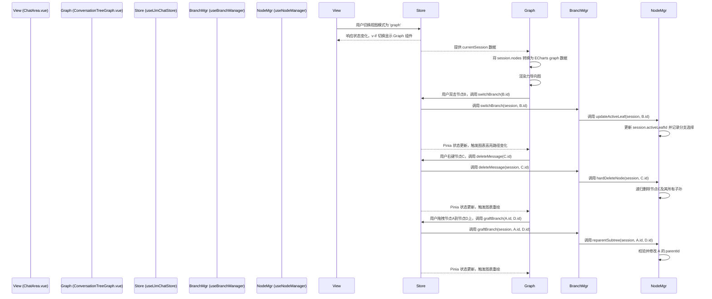

# 会话树图 (Conversation Tree Graph) - 设计文档

本文档详细阐述了“会话树图”功能的设计方案，旨在为后续的开发和迭代提供清晰的指引。

## 1. 核心目标

“会话树图”旨在提供一个可视化的、可交互的界面，用于探索和管理 `llm-chat` 模块的树状对话历史。它将现有的、基于线性列表的交互模式，升级为一种更直观、更强大的图形化管理模式。

核心能力：

1.  **全局可视化**: 以力导向图的形式，完整展示一个会话中的所有消息节点和分支结构。
2.  **动态探索**: 用户可以拖动节点，观察整个树状结构的动态变化，直观感受分支间的“张力”。
3.  **分支管理**:
    *   **剪枝 (Pruning)**: 方便地删除某个对话分支。
    *   **嫁接 (Grafting)**: 将一个分支（子树）从一个父节点移动到另一个父节点下。
4.  **路径切换**: 快速地将当前对话视图切换到图中的任意分支。

## 2. 技术选型

- **渲染引擎**: **ECharts** (`graph` 系列, `layout: 'force'`)
  - **原因**: 项目已集成 ECharts，技术栈统一，可复用主题和打包配置。其内置的力导向布局算法能直接满足“力场”、“拖拽晃动”和“张力结构”的核心视觉要求。
- **组件封装**:
  - `ConversationTreeGraph.vue`: 核心的图表渲染和交互逻辑组件。
  - `useConversationGraph.ts` (Composable): 封装将会话数据 (`ChatSession`) 转换为 ECharts `graph` 数据格式（nodes, links）的逻辑，并处理图表事件与 `llmChat` store 的交互。

## 3. 架构与数据流

本功能严格遵循**关注点分离**原则，图表组件作为纯粹的**视图和交互层**，不直接修改或持久化任何状态。所有操作均通过调用 `llmChat` 的 Pinia store (`useLlmChatStore`) 来完成。

## 4. 核心功能实现

### 4.1. 数据映射

在 `useConversationGraph.ts` 中，`ChatSession` 数据将被转换为 ECharts 需要的 `nodes` 和 `links` 数组。

- **GraphNode**:
  - `id`: `ChatMessageNode.id`
  - `name`: `content` 的摘要
  - `symbol`: 根据 `role` 决定（如 'rect', 'circle'）
  - `category`: `role`（用于着色）
  - `itemStyle`: 根据 `isEnabled`, `onActivePath`, `isActiveLeaf` 等状态动态计算样式（颜色、边框、透明度）。
  - `label`: 节点上显示的简短文本。
- **GraphLink**:
  - `source`: `parentId`
  - `target`: `id`
  - `lineStyle`: 根据 `onActivePath` 状态决定样式（高亮或普通）。

### 4.2. 剪枝 (Pruning)

- **语义**: 删除以此节点为根的整棵子树。
- **实现**:
  - **UI**: 图上节点右键菜单 -> "剪掉这个分支"。
  - **逻辑**: 调用 `useLlmChatStore().deleteMessage(nodeId)`。此 action 已通过 `useNodeManager.hardDeleteNode` 实现了级联删除和 `activeLeafId` 的自动调整。
- **状态**: 复用现有逻辑，无需新增核心 API。

### 4.3. 嫁接 (Grafting)

- **语义**: 将一个节点及其所有后代（子树）从其当前父节点上分离，并附加到另一个新的父节点下。
- **实现**:
  - **UI**: 拖拽节点 A 到目标父节点 B 上方，停留并松手。
  - **逻辑**:
    1.  **新增底层 API**: 在 `useNodeManager` 中增加 `reparentSubtree(session, nodeId, newParentId)` 方法。
        - **职责**:
          - 验证嫁接合法性（不能嫁接到自身或自己的子孙节点）。
          - 从旧父节点的 `childrenIds` 中移除 `nodeId`。
          - 更新 `node.parentId = newParentId`。
          - 将 `nodeId` 添加到新父节点的 `childrenIds` 中。
    2.  **新增业务 API**: 在 `useBranchManager` 中增加 `graftBranch(...)`，封装 `reparentSubtree`。
    3.  **新增 Store Action**: 在 `useLlmChatStore` 中增加 `graftBranch(nodeId, newParentId)` action，作为 UI 的统一入口。
- **角色约束**: V1 版本不强制进行角色交替检查（如 user 后必须是 assistant）。嫁接操作的有效性优先，逻辑合理性交给用户判断。

### 4.4. 分支切换

- **语义**: 将视图切换到图中的任意一条分支。
- **实现**:
  - **UI**: 双击图上的任意节点。
  - **逻辑**: 调用 `useLlmChatStore().switchBranch(nodeId)`。此 action 已能处理 `activeLeafId` 的更新和分支选择记忆 (`lastSelectedChildId`)。
- **状态**: 复用现有逻辑。

## 5. UI 与交互设计

### 5.1. 入口点与视图管理

- **视图模式状态**: 在 `useLlmChatUiState` Composable 中新增一个持久化的状态 `viewMode: Ref<'linear' | 'graph'>`，默认为 `'linear'`。
- **视图切换器**: 在 `ChatArea` 的头部 (`MessageHeader.vue`) 创建一个视图模式切换器 (View Mode Switcher)，它是一个下拉菜单 (`ElDropdown`)，包含：
  - **线性视图** (默认)
  - **树图视图**
  - **分割视图** (未来扩展)
- **动态组件**: `ChatArea.vue` 的主体内容将使用 `<component :is="...">` 动态渲染 `MessageList.vue` 或 `ConversationTreeGraph.vue`，具体取决于 `viewMode` 的值。

### 5.2. 图表交互

- **基础**:
  - **缩放/平移**: 支持鼠标滚轮缩放和拖拽画布平移。
  - **节点拖拽**: 节点可自由拖拽，`d3-force` 引擎会自动重新计算布局。
- **高亮**:
  - **当前路径**: 位于 `activePath` 上的节点和边使用主题色高亮。
  - **当前叶节点**: `activeLeafId` 对应的节点额外使用发光或加粗边框效果。
  - **禁用节点**: `isEnabled: false` 的节点及其下级分支整体置灰，降低透明度。
- **Tooltip**: 鼠标悬停在节点上时，显示该消息的完整内容、时间戳和 Token 等元数据。
- **右键菜单**:
  - "设为当前分支" (同双击)
  - "剪掉这个分支"
  - "切换启用/禁用"
  - "复制内容"
- **嫁接交互**:
  - 拖动节点 A 至节点 B 上方时，节点 B 显示一个“可吸附”的高亮光圈。
  - 如果嫁接非法（如形成循环），则高亮光圈为红色，并禁止松手操作。

## 6. 实施计划 (Roadmap)

1.  **Phase 1: 视图模式切换框架**
    - 在 `useLlmChatUiState` 中添加 `viewMode` 状态。
    - 在 `MessageHeader.vue` 中创建视图模式切换器下拉菜单。
    - 在 `ChatArea.vue` 中实现基于 `viewMode` 的动态组件切换逻辑。
    - 创建 `ConversationTreeGraph.vue` 和 `useConversationGraph.ts` 的组件骨架。
2.  **Phase 2: 只读视图与分支切换**
    - 实现 `useConversationGraph.ts`，完成 `ChatSession` 到 ECharts 数据的转换。
    - 在 `ConversationTreeGraph.vue` 中渲染基础力导向图，并实现当前活动路径的高亮。
    - 实现双击节点切换 `activeLeafId` 的功能。
3.  **Phase 3: 实现剪枝与状态切换**
    - 为图表节点添加右键菜单。
    - 将 "剪枝" 和 "切换启用" 菜单项连接到 `useLlmChatStore` 中已有的 `deleteMessage` 和 `toggleNodeEnabled` action。
4.  **Phase 4: 实现嫁接功能**
    - 按照设计，在 `NodeManager` -> `BranchManager` -> `Store` 中逐层添加 `graftBranch` 相关 API。
    - 在 ECharts 中实现拖拽释放事件，调用 `graftBranch` action，并处理合法性校验的视觉反馈。
5.  **Phase 5: 优化与细节**
    - 调整力导向图参数，优化布局美感和性能。
    - 完善 Tooltip 内容。
    - 适配应用的主题系统（明/暗色模式）。
