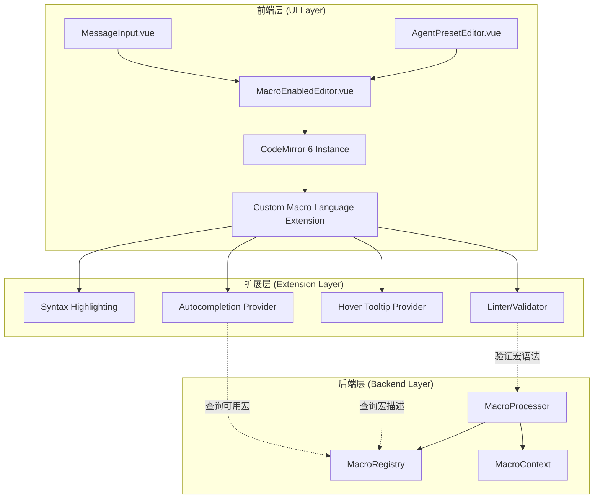

# LLM Chat 宏处理引擎与 CodeMirror 增强输入功能设计文档和施工步骤

## 1. 概述

本文档为 `llm-chat` 工具设计一个功能完备、可扩展的**宏处理系统**。该系统包含两个核心组件：

- **后端宏处理引擎 (Macro Engine)**：负责解析和执行宏逻辑，支持分阶段处理管道
- **前端 CodeMirror 扩展 (CM Extension)**：基于项目已有的 CodeMirror 6 基础设施，提供语法高亮、自动补全、悬停提示等专业级编辑体验

## 2. 架构设计

### 2.1 系统整体架构



### 2.2 技术栈选择理由

- **复用现有基础设施**：项目已有成熟的 `RichCodeEditor.vue` 组件封装了 CodeMirror 6
- **专业级编辑体验**：CodeMirror 6 提供了 VSCode 级别的文本编辑能力
- **高度可扩展**：通过 Language Support API 可以深度定制宏语言的行为
- **性能优秀**：CodeMirror 6 的增量解析和虚拟滚动确保大文本下的流畅体验

## 3. 后端：宏处理引擎（保持原设计）

### 3.1 分阶段执行管道

宏处理仍采用三阶段管道设计，确保执行顺序的正确性：

1. **阶段一：预处理** - 处理状态变更宏 (`setvar`, `incvar` 等)
2. **阶段二：内容替换** - 替换静态值 (`{{user}}`, `{{char}}` 等)
3. **阶段三：后处理** - 执行动态函数 (`{{time}}`, `{{random}}` 等)

### 3.2 文件结构

```
src/tools/llm-chat/macro-engine/
├── index.ts                 # 主入口
├── MacroProcessor.ts        # 核心处理器
├── MacroContext.ts          # 上下文定义
├── MacroRegistry.ts         # 宏注册中心
├── pipeline/
│   ├── PreProcessor.ts      # 阶段一处理器
│   ├── Substitutor.ts       # 阶段二处理器
│   └── PostProcessor.ts     # 阶段三处理器
└── macros/
    ├── core.ts              # 核心宏
    ├── variables.ts         # 变量操作宏
    ├── datetime.ts          # 时间日期宏
    └── functions.ts         # 功能性宏
```

## 4. 前端：CodeMirror 6 扩展开发

### 4.1 宏语言定义 (Lezer Grammar)

```javascript
// src/tools/llm-chat/editor/macro-lang/macro.grammar
@top Program { expression* }

expression {
  Text |
  Macro
}

Macro {
  SimpleMacro |
  FunctionMacro
}

SimpleMacro {
  "{{" MacroName "}}"
}

FunctionMacro {
  "{{" MacroName "::" MacroArgs "}}"
}

MacroName { identifier }
MacroArgs { (argument (":" ":" argument)*)? }
argument { ~[}:]+ }

@tokens {
  identifier { $[a-zA-Z_]+ }
  Text { ![{]+ | "{" ![{] }
}
```

### 4.2 扩展模块结构

```
src/tools/llm-chat/editor/
├── MacroEnabledEditor.vue   # 增强编辑器组件
├── macro-lang/
│   ├── index.ts             # Language Support 入口
│   ├── macro.grammar        # Lezer 语法定义
│   ├── highlight.ts         # 语法高亮规则
│   ├── autocomplete.ts      # 自动补全提供器
│   ├── hover.ts            # 悬停提示提供器
│   └── lint.ts             # 语法检查器
└── composables/
    └── useMacroEditor.ts    # 编辑器逻辑封装
```

### 4.3 核心功能实现

#### 4.3.1 语法高亮

```typescript
// highlight.ts
import { styleTags, tags as t } from "@lezer/highlight";

export const macroHighlighting = styleTags({
  MacroName: t.function(t.variableName),
  "{{ }}": t.brace,
  "::": t.operator,
  MacroArgs: t.string,
});
```

#### 4.3.2 自动补全

```typescript
// autocomplete.ts
import { CompletionContext, CompletionResult } from "@codemirror/autocomplete";
import { MacroRegistry } from "@/tools/llm-chat/macro-engine";

export function macroCompletions(context: CompletionContext): CompletionResult | null {
  const before = context.matchBefore(/\{\{[\w:]*/);
  if (!before) return null;

  const isFunction = before.text.includes("::");
  const searchTerm = before.text.slice(2); // 去掉 {{

  // 从 MacroRegistry 获取所有可用宏
  const macros = MacroRegistry.getInstance().getAllMacros();

  const options = macros
    .filter((macro) => macro.name.startsWith(searchTerm))
    .map((macro) => ({
      label: macro.name,
      type: macro.type,
      detail: macro.description,
      apply: isFunction ? `{{${macro.name}::}}` : `{{${macro.name}}}`,
      boost: macro.priority || 0,
    }));

  return {
    from: before.from,
    options,
    validFor: /^[\w:]*$/,
  };
}
```

#### 4.3.3 悬停提示

```typescript
// hover.ts
import { hoverTooltip } from "@codemirror/view";
import { MacroRegistry } from "@/tools/llm-chat/macro-engine";

export const macroHover = hoverTooltip((view, pos, side) => {
  // 解析当前位置的宏
  const { from, to, text } = getMacroAt(view.state, pos);
  if (!text) return null;

  const macroName = extractMacroName(text);
  const macro = MacroRegistry.getInstance().getMacro(macroName);

  if (!macro) return null;

  return {
    pos: from,
    end: to,
    create: () => {
      const dom = document.createElement("div");
      dom.className = "cm-tooltip-macro";
      dom.innerHTML = `
        <div class="macro-name">${macro.name}</div>
        <div class="macro-desc">${macro.description}</div>
        <div class="macro-example">示例: ${macro.example || "N/A"}</div>
      `;
      return { dom };
    },
  };
});
```

#### 4.3.4 语法检查

```typescript
// lint.ts
import { Diagnostic } from "@codemirror/lint";
import { MacroProcessor } from "@/tools/llm-chat/macro-engine";

export function macroLinter(view: EditorView): Diagnostic[] {
  const diagnostics: Diagnostic[] = [];
  const doc = view.state.doc;

  // 使用正则查找所有宏
  const macroPattern = /\{\{([^}]+)\}\}/g;
  let match;

  while ((match = macroPattern.exec(doc.toString())) !== null) {
    const [fullMatch, macroContent] = match;
    const from = match.index;
    const to = from + fullMatch.length;

    // 验证宏语法
    const validation = MacroProcessor.validateMacro(macroContent);
    if (!validation.valid) {
      diagnostics.push({
        from,
        to,
        severity: "error",
        message: validation.error,
        actions: validation.suggestions?.map((suggestion) => ({
          name: suggestion.label,
          apply: (view, from, to) => {
            view.dispatch({
              changes: { from, to, insert: `{{${suggestion.value}}}` },
            });
          },
        })),
      });
    }
  }

  return diagnostics;
}
```

### 4.4 组件封装

```vue
<!-- MacroEnabledEditor.vue -->
<template>
  <div class="macro-editor-wrapper" :class="{ focused: isFocused }">
    <div ref="editorRef" class="macro-editor"></div>

    <!-- 可选：宏变量面板 -->
    <div v-if="showVariablePanel" class="variable-panel">
      <h4>可用变量</h4>
      <div v-for="variable in availableVariables" :key="variable.name">
        <span class="var-name">{{ variable.name }}</span>
        <span class="var-value">{{ variable.value }}</span>
      </div>
    </div>
  </div>
</template>

<script setup lang="ts">
import { ref, onMounted, onUnmounted, watch } from "vue";
import { EditorView } from "@codemirror/view";
import { EditorState } from "@codemirror/state";
import { macroLanguage } from "./macro-lang";
import { useMacroContext } from "@/composables/useMacroContext";

const props = defineProps<{
  modelValue: string;
  placeholder?: string;
  showVariablePanel?: boolean;
}>();

const emit = defineEmits<{
  "update:modelValue": [value: string];
}>();

const editorRef = ref<HTMLDivElement>();
const isFocused = ref(false);
let view: EditorView | null = null;

// 获取宏上下文（变量、可用宏等）
const { availableVariables, availableMacros } = useMacroContext();

onMounted(() => {
  if (!editorRef.value) return;

  const startState = EditorState.create({
    doc: props.modelValue,
    extensions: [
      macroLanguage({
        variables: availableVariables.value,
        macros: availableMacros.value,
      }),
      EditorView.updateListener.of((update) => {
        if (update.docChanged) {
          emit("update:modelValue", update.state.doc.toString());
        }
      }),
      EditorView.domEventHandlers({
        focus: () => {
          isFocused.value = true;
        },
        blur: () => {
          isFocused.value = false;
        },
      }),
    ],
  });

  view = new EditorView({
    state: startState,
    parent: editorRef.value,
  });
});

onUnmounted(() => {
  view?.destroy();
});
</script>
```

## 5. 施工计划（更新版）

### 阶段零：技术预研与原型验证（新增）

**目标**：验证 CodeMirror 6 扩展方案的可行性，降低技术风险

- [ ] 创建最小化 POC (Proof of Concept)，实现 `{{user}}` 的高亮。
- [ ] 测试 Lezer 解析器对 `{{macro::arg1::arg2}}` 语法的支持。
- [ ] 验证自动补全在 `{{` 触发时的可行性。
- [ ] 评估性能：在包含大量文本和宏的文档中，编辑响应是否流畅。

### 阶段一：宏引擎核心实现

**目标**：构建完整的后端处理逻辑，为前端提供数据和服务支持

- [ ] 实现 `MacroProcessor` 的三阶段执行管道。
- [ ] 实现 `MacroRegistry`，用于注册和查询所有可用宏。
- [ ] 实现基础宏集合（`core`, `datetime`, `variables`）。
- [ ] 创建全面的单元测试套件，覆盖所有宏和处理阶段。
- [ ] 在 `ContextAnalyzerDialog` 中添加宏处理的调试面板，显示各阶段输入输出。

### 阶段二：CodeMirror 扩展开发

**目标**：实现专业级的宏编辑体验，替换现有输入框

#### 步骤 2.1：基础语言支持

- [ ] 编写 `macro.grammar` Lezer 语法文件，定义宏的结构。
- [ ] 实现语法高亮规则，区分宏名称、分隔符和参数。
- [ ] 创建 `macroLanguage` 主扩展，并集成到新的 `MacroEnabledEditor.vue` 组件中。

#### 步骤 2.2：交互功能

- [ ] 实现**自动补全** (`autocompletion`)：当用户输入 `{{` 时，从 `MacroRegistry` 获取宏列表并动态展示。
- [ ] 实现**悬停提示** (`hoverTooltip`)：当鼠标悬停在宏上时，从 `MacroRegistry` 查询并显示该宏的详细描述和用法示例。

#### 步骤 2.3：高级编辑器功能

- [ ] 实现**语法检查** (`linter`)：实时验证宏的拼写和参数数量是否正确，并给出错误提示。
- [ ] （可选）实现**代码片段** (`snippet`)：对于带参数的宏，补全后自动将光标定位到第一个参数位置。

#### 步骤 2.4：组件集成

- [ ] 完善 `MacroEnabledEditor.vue` 的 props 和 emits，使其可以完全替代原生 `<textarea>`。
- [ ] 在 `MessageInput.vue` 中集成 `MacroEnabledEditor.vue`。
- [ ] 在 `AgentPresetEditor.vue` 的对话框中集成 `MacroEnabledEditor.vue`。
- [ ] 添加配置选项，允许用户在原生输入框和增强编辑器之间切换。

### 阶段三：高级宏与兼容性

**目标**：扩展宏的功能集，并对齐社区标准

- [ ] 实现功能性宏（`random`, `roll`, `trim`, `newline`）。
- [ ] 实现与角色卡数据相关的宏（`description`, `personality`, `mesExamples`），可能需要扩展现有数据模型。
- [ ] （可选）集成 Handlebars.js 或类似库，支持 `{{#if}}` 等条件逻辑。
- [ ] 对照 TavernAI 等社区工具的宏列表进行兼容性测试和功能对齐。

### 阶段四：测试、优化与文档

**目标**：确保功能的稳定性、性能和易用性

- [ ] **集成测试**：编写端到端的测试用例，模拟用户输入、宏执行和消息发送的完整流程。
- [ ] **性能测试**：测试在长对话历史（>200条消息）和复杂预设下的宏处理性能。
- [ ] **UI/UX 优化**：根据内部测试反馈，调整高亮颜色、补全菜单样式、提示信息等。
- [ ] **编写文档**：
  - **用户文档**：在应用的帮助中心或 Wiki 中，详细介绍所有可用宏及其用法。
  - **开发者文档**：说明如何注册一个新的宏，以及 `MacroEnabledEditor` 组件的 API。
