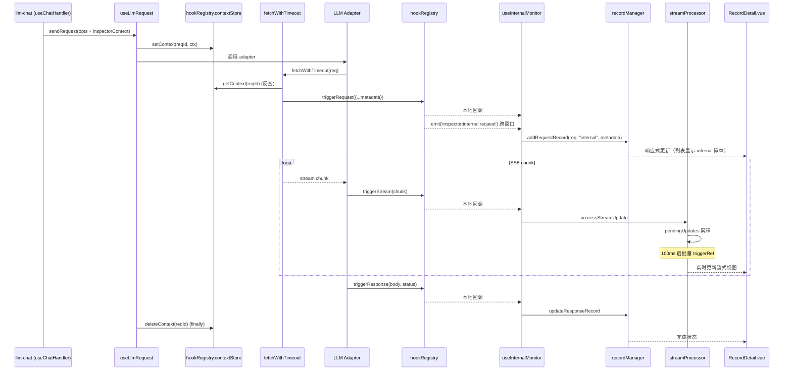

# LLM Inspector: 架构与开发者指南

本文档反映 **LLM Inspector 2.0** 架构（含 detail-panel-rework）。它深入解析工具的内部结构、设计理念和数据流，为后续开发与维护提供清晰指引。

> **版本里程碑**:
>
> - **v2.0-α**: 双层监控链路打通（Rust 外部代理 + 前端钩子内部监控）。
> - **v2.0-β**: 新 UI Layout 重构（Header + Split + Drawer）。
> - **v2.0 GA**: Token 估算、来源链路、4-Tab 详情面板全部就绪。

## 1. 核心概念

`llm-inspector` 是一站式 LLM 流量观察工具，**双层监控架构**让它既能拦截"宿主未知的外部应用"流量，也能透视"宿主应用内部"自身的 LLM 调用。

### 1.1. 双层监控架构

#### 1.1.1. 外部代理（External Proxy）

Rust 原生 HTTP 代理，运行在指定端口（默认 8999）。

- **目标场景**: 外部 LLM 客户端（如 IDE 插件、CLI 工具）将请求指向 `http://localhost:8999`，由 Rust 代理转发到真实上游（如 `https://api.openai.com`）。
- **技术栈**: `axum` + `hyper` + `tokio`，原生线程运行。
- **能力**: 自定义 Header 覆盖、流式响应直透。
- **数据通道**: 通过 Tauri `emit` 发送 `inspector-request` / `inspector-response` / `inspector-stream-update` 事件给前端。

#### 1.1.2. 内部钩子（Internal Hook）

前端 JS 层的钩子注册器，零成本观察宿主应用内自身的 LLM 调用。

- **目标场景**: 宿主应用内的 llm-chat、translator、media-generator 等工具，通过 [`useLlmRequest`](src/composables/useLlmRequest.ts:1) 发起的 LLM 请求。
- **技术核心**: [`hookRegistry.ts`](src/tools/llm-inspector/core/hookRegistry.ts:1) 单例，在 [`fetchWithTimeout`](src/llm-apis/common.ts:697) 的三个分支（FormData 代理 / 普通代理 / 直连）埋点。
- **零运行时开销**: 通过 `shouldCaptureInternal()` 总开关守护，OFF 时所有埋点都是 no-op。
- **跨窗口广播**: 通过 Tauri `emit('inspector:internal:*')` 让分离窗口的请求也能被主窗口看到，配合 LRU 去重（`${type}:${requestId}:${timestamp}`）避免主窗口收到双倍记录。
- **上下文关联**: [`useLlmRequest`](src/composables/useLlmRequest.ts:1) 在调用 adapter 前 `setContext(requestId, inspectorContext)`，[`fetchWithTimeout`](src/llm-apis/common.ts:697) 通过 `X-Request-ID` 反查 `getContext()`，从而获得工具名/会话 ID/用途等元数据，**不修改任何 adapter**。

### 1.2. 总开关三层架构

状态在 [`useProxyManager.ts`](src/tools/llm-inspector/composables/useProxyManager.ts:1) 的 `state: InspectorState` 中维护：

```
isGlobalEnabled  ─ 总开关（关闭即全停）
    ├── monitorInternal  ─ 内部钩子（驱动 hookRegistry.enable/disable）
    └── monitorExternal  ─ 外部代理（驱动 startInspector/stopInspector）
         └── externalProxyStatus ─ 状态机（stopped/starting/running/stopping/error）
```

- 总开关 OFF → 内部钩子被 watch 强制 disable + 外部代理自动 stopInspector。
- 总开关 ON → 子开关保持原值（不自动恢复），用户显式控制。

### 1.3. 请求/响应生命周期 (`CombinedRecord`)

工具的核心数据单元是 [`CombinedRecord`](src/tools/llm-inspector/types.ts:64)，完整记录一次 HTTP 交互的生命周期。

- **创建**: 拦截到新请求时填充 `request` 字段，`response` 为空。
- **更新**: 响应到达后填充 `response` 字段。
- **来源标识**（2.0 新增）:
  - `source: "external"` — 来自 Rust 外部代理（默认）。
  - `source: "internal"` — 来自前端钩子（含 [`inspectorMetadata`](src/tools/llm-inspector/types.ts:56)：toolName/purpose/profileId/modelId/sessionId）。

### 1.4. 实时流式处理 (`StreamProcessor`)

针对 SSE 流式响应的优化处理（detail-panel-rework 强化）：

- **shallowRef + 节流批量刷新**: [`streamBuffer`](src/tools/llm-inspector/core/streamProcessor.ts:15) 改为 `shallowRef`，chunk 累积到非响应式 `pendingUpdates` Map，每 100ms `triggerRef` 一次。SSE 高频流式（>20fps）下显著降低 UI 重绘开销。
- **完成时立即 flush**: `is_complete` 时强制清空 pending 并触发更新，确保数据完整。
- **多格式智能提取**:
  - **格式检测**: 通过 URL 自动识别 5 大格式（OpenAI Chat/Responses/Completions、Anthropic、Gemini、Cohere、Ollama）。
  - **深度解析**: 识别 `reasoning_content` (o1/o3)、`thinking` (Claude)、tool_calls、refusal 等高级块。
  - **正文模式 / 原始模式切换**: 同一份响应可看「打字机风格的累积文本」或「原始 SSE 缓冲」。

### 1.5. Token 估算与服务端 usage 对比（2.0 新增）

[`useTokenEstimate.ts`](src/tools/llm-inspector/composables/useTokenEstimate.ts:1) composable 提供：

- **客户端估算**: 复用 [`tokenCalculatorEngine`](src/tools/token-calculator/core/tokenCalculatorEngine.ts:1) 单例（transformers.js + huggingface profile），按 record 异步估算请求/响应 Token。
- **服务端 usage 提取**: [`extractServerUsage`](src/tools/llm-inspector/core/tokenEstimator.ts:193) 归一化 OpenAI/Anthropic/Gemini/Cohere/Ollama 的 usage 字段为统一结构。
- **偏差对比**: `promptDeviation` / `completionDeviation` computed 自动算出（估算 - 实际）/ 实际 \* 100%。三档高亮：< 5% ok / 5-15% warn / >= 15% danger。
- **签名缓存**: `${reqLen}|${resLen}|${modelHint}` 作为缓存 key，切换记录秒出（命中缓存）。
- **重算入口**: `recompute()` 清除当前 record 缓存重算，由 [`RecordOverviewTab.vue`](src/tools/llm-inspector/components/detail/RecordOverviewTab.vue:1) 标题栏的 RefreshCw 按钮触发。

### 1.6. 消息结构化解析

[`messageParser.ts`](src/tools/llm-inspector/core/messageParser.ts:1) 把 5 大 LLM 格式的请求/响应消息归一化为 [`ParsedMessage[]`](src/tools/llm-inspector/types.ts:187)：

- **块类型**: `text` / `thinking` / `tool_call` / `tool_result` / `image` / `refusal` / `unknown`。
- **覆盖范围**:
  - OpenAI: Chat/Responses/Completions，含 `reasoning_content` / `tool_calls` / `refusal`。
  - Anthropic: 含 `thinking` / `tool_use` / `tool_result`。
  - Gemini: 含 `parts.thought` / `functionCall` / multi-candidate。
  - Cohere v1/v2 + Ollama 兜底。
- **被消费方**: [`StructuredMessagesView.vue`](src/tools/llm-inspector/components/detail/StructuredMessagesView.vue:1)（请求/响应共用渲染）+ [`useTokenEstimate.ts`](src/tools/llm-inspector/composables/useTokenEstimate.ts:1)（Token 估算输入）。

## 2. 架构概览

```mermaid
graph TD
    subgraph 外部应用
        EXT[外部 LLM 客户端<br/>IDE/CLI 等]
    end

    subgraph 宿主应用（Vue 3 前端）
        TOOLS[llm-chat / translator / OCR<br/>media-gen 等内部工具]
        UR[useLlmRequest<br/>contextStore]
        FW[fetchWithTimeout<br/>三处埋点]
        HR[hookRegistry<br/>单例]

        subgraph Inspector 工具页
            UI[LlmInspector.vue<br/>Header + Split + Drawer]
            IM[useInspectorManager<br/>state 状态机]
            IMon[useInternalMonitor<br/>本地+Tauri 双通道]
            RM[recordManager<br/>source 标识]
            SP[streamProcessor<br/>shallowRef + 100ms 节流]
            TE[useTokenEstimate<br/>缓存 + 偏差对比]
            CM[configManager<br/>持久化]
            PS[proxyService.ts]
        end
    end

    subgraph 后端 (Rust)
        RP[Rust Inspector Proxy<br/>axum + hyper]
    end

    EXT -- HTTP --> RP
    RP -- emit('inspector-*') --> PS

    TOOLS -- 透传 inspectorContext --> UR
    UR -- setContext + invoke --> FW
    FW -- 反查 getContext --> HR
    HR -- 本地回调 + emit --> IMon

    PS --> IM
    IMon --> RM
    IM --> RM
    IM --> SP
    RM -- 响应式 --> UI
    SP -- 响应式 --> UI
    TE -- 响应式 --> UI
    CM <--> IM
```

## 3. UI Layout 2.0

### 3.1. 主布局（Header + Split + Drawer）

[`LlmInspector.vue`](src/tools/llm-inspector/LlmInspector.vue:1) 顶层结构：

```
┌─ HeaderToolbar (48px) ──────────────────────────────────────────────┐
│  [● INSPECTOR] 总开关 │ [内置监控] [外部代理] │ [搜索] [清空] [⚙️]  │
├─────────────────────────────────────────────────────────────────────┤
│  [全宽错误 banner，仅在错误时出现]                                  │
├───────────────────┬─────────────────────────────────────────────────┤
│                   │                                                 │
│   RecordsList     │            RecordDetail                         │
│   (左栏，可拖)    │  ┌─ 总览 / 请求 / 响应（3 顶层 Tab）─┐         │
│                   │                                                 │
│   含来源徽章      │  请求 / 响应 Tab 内含 segment：                 │
│   internal:工具名 │    [结构化] [原始]                              │
│   external:代理   │                                                 │
│                   │  响应 Tab 的原始视图内置流式状态条 + viewMode  │
│                   │                                                 │
└───────────────────┴─────────────────────────────────────────────────┘
                    ↑ 中间 6px 拖拽分割条 + 比例持久化
```

### 3.2. 详情面板 4-Tab → 3-Tab Rework

**初版** (E1-E4) 为 4 个 Tab：总览 / 结构化 / 原始 / 流式。

**Rework** (detail-panel-rework) 重构为请求/响应分离的 3 Tab，解决"一次请求往返需在多个 Tab 间反复跳转"的问题：

| 顶层 Tab    | 子结构                 | 包含                                                                |
| ----------- | ---------------------- | ------------------------------------------------------------------- |
| **📊 总览** | 单页滚动               | 请求摘要 + 响应摘要 + **Token 估算** + Inspector 元数据             |
| **📤 请求** | Segment: 结构化 / 原始 | 结构化：解析后的 messages；原始：JSON 美化 (RichCodeEditor)         |
| **📥 响应** | Segment: 结构化 / 原始 | 结构化：assistant 回复 + stopReason；原始：响应体（**含流式模式**） |

#### 3.2.1. 总览卡片层次

- **请求摘要**: 方法 / 大小 / URL / 时间（ISO 8601 + 相对时间）+ 请求头（折叠）。
- **响应摘要**: 状态码 / 耗时 / 大小 / **Stream 状态**（区分声明 vs 实际）+ 响应头（折叠）。
- **Token 估算卡**（F1/F2/F4）:
  - 客户端估算（请求 + 响应分列）+ 服务端 usage 对照 + 总计。
  - 偏差 chip：< 5% 绿色 / 5-15% 黄色 / >= 15% 红色，tooltip 解释。
  - 标题栏 RefreshCw 按钮可重算。
- **Inspector 元数据卡**（F3）: 仅 internal 来源显示工具/用途/profileId/modelId/sessionId。

#### 3.2.2. 性能改造（detail-panel-rework）

- **RichCodeEditor 替换裸 `<pre>`**: CodeMirror 内置虚拟滚动，10MB+ JSON 不卡。
- **格式化缓存**: [`useFormattedBody.ts`](src/tools/llm-inspector/composables/useFormattedBody.ts:1) 按 recordId+rawLen 缓存 formatJson 结果。
- **流式节流**: [`streamProcessor.ts`](src/tools/llm-inspector/core/streamProcessor.ts:1) `shallowRef` + 100ms 批量刷新。

## 4. 数据流：内部钩子捕获一次流式请求



## 5. 核心模块

### 5.1. 基础设施层

| 模块                                                                      | 职责                                                          |
| ------------------------------------------------------------------------- | ------------------------------------------------------------- |
| [`hookRegistry.ts`](src/tools/llm-inspector/core/hookRegistry.ts:1)       | 钩子注册器单例 + contextStore + 本地回调 + Tauri 跨窗口广播   |
| [`messageParser.ts`](src/tools/llm-inspector/core/messageParser.ts:1)     | 5 大 LLM 格式 → 统一 ParsedMessage[] 解析                     |
| [`tokenEstimator.ts`](src/tools/llm-inspector/core/tokenEstimator.ts:1)   | 客户端 Token 估算（复用 token-calculator）+ 服务端 usage 提取 |
| [`streamProcessor.ts`](src/tools/llm-inspector/core/streamProcessor.ts:1) | shallowRef 流式缓冲 + 100ms 节流 + 多格式智能提取             |
| [`recordManager.ts`](src/tools/llm-inspector/core/recordManager.ts:1)     | CombinedRecord 数据仓库（含 source/inspectorMetadata）        |
| [`configManager.ts`](src/tools/llm-inspector/core/configManager.ts:1)     | 配置持久化（含 layout.splitRatio）                            |
| [`proxyService.ts`](src/tools/llm-inspector/core/proxyService.ts:1)       | Tauri invoke/listen 封装                                      |

### 5.2. 钩子注入层（接入但默认 OFF）

| 模块                                                         | 关键变更                                                                        |
| ------------------------------------------------------------ | ------------------------------------------------------------------------------- |
| [`common.ts: LlmRequestOptions`](src/llm-apis/common.ts:132) | 追加 `inspectorContext` 字段，被 `request-builder.ts` 过滤防止污染上游          |
| [`common.ts: fetchWithTimeout`](src/llm-apis/common.ts:697)  | 三个 fetch 分支埋点 triggerRequest / triggerResponse / triggerError             |
| [`useLlmRequest.ts`](src/composables/useLlmRequest.ts:1)     | setContext 在调用前 + finally 清理，X-Request-ID 关联机制（不侵入任何 adapter） |
| 各工具入口                                                   | 在 `sendRequest` 调用处加 `inspectorContext: { toolName, purpose, sessionId }`  |

### 5.3. Composables 层

| 模块                                                                                                | 职责                                                 |
| --------------------------------------------------------------------------------------------------- | ---------------------------------------------------- |
| [`useInspectorManager / useProxyManager`](src/tools/llm-inspector/composables/useProxyManager.ts:1) | 状态机 + 总开关联动 watch + isRunning 兼容 computed  |
| [`useInternalMonitor`](src/tools/llm-inspector/composables/useInternalMonitor.ts:1)                 | 双通道接入（本地钩子 + Tauri event）+ LRU 去重       |
| [`useRecordDetail`](src/tools/llm-inspector/composables/useRecordDetail.ts:1)                       | 详情面板共享数据（流式状态、复制、提取）             |
| [`useTokenEstimate`](src/tools/llm-inspector/composables/useTokenEstimate.ts:1)                     | Token 估算 + 服务端 usage + 偏差对比 + 缓存          |
| [`useSplitPane`](src/tools/llm-inspector/composables/useSplitPane.ts:1)                             | 分割条拖拽（@vueuse/core useEventListener 自动清理） |
| [`useFormattedBody`](src/tools/llm-inspector/composables/useFormattedBody.ts:1)                     | formatJson 缓存（防止大 body 重复格式化）            |

### 5.4. 视图层（detail-panel-rework 后）

```
LlmInspector.vue
├── HeaderToolbar.vue
├── SettingsDrawer.vue
│   └── HeaderOverrideDialog.vue (独立弹窗，由 Drawer 按钮触发)
├── RecordsList.vue (含来源徽章 + purpose 标签 + ISO tooltip)
└── RecordDetail.vue (3-Tab)
    ├── detail/RecordOverviewTab.vue (含 Token 卡 + 元数据卡)
    ├── detail/RequestPanel.vue
    │   ├── detail/views/RequestStructuredView.vue
    │   └── detail/views/RequestRawView.vue (RichCodeEditor)
    └── detail/ResponsePanel.vue
        ├── detail/views/ResponseStructuredView.vue
        └── detail/views/ResponseRawView.vue (RichCodeEditor + 流式状态)
        └── detail/StructuredMessagesView.vue (请求/响应共用)
```

## 6. 数据持久化

- **配置文件**: `appConfigDir/llm-inspector/settings.json`
- **存储内容**:
  - `config.port` / `config.target_url` / `config.header_override_rules`
  - UI 状态: `searchQuery` / `filterStatus` / `maskApiKeys` / `targetUrlHistory`
  - 布局: `layout.splitRatio`（D4 新增）
- **保存机制**: 通用 `createConfigManager` 防抖（500ms）合并写入。

## 7. 关键类型定义

详见 [`types.ts`](src/tools/llm-inspector/types.ts:1):

- `CombinedRecord` — 含 `source` + `inspectorMetadata`（向后兼容可选）
- `RecordSource` — `"internal" | "external"`
- `RecordInspectorMetadata` — 工具/会话/Profile/Model 元数据
- `InspectorLayoutSettings` — `splitRatio`
- `ParsedMessage` / `ParsedMessageBlock` — 结构化消息解析
- `RequestParseResult` / `ResponseParseResult` — 解析结果（含 format / model / stopReason / errors）

钩子事件契约见 [`types/hooks.ts`](src/tools/llm-inspector/types/hooks.ts:1):

- `InspectorRequestEvent` / `InspectorResponseEvent` / `InspectorStreamEvent` / `InspectorErrorEvent`
- `InspectorContextMetadata` — toolName/purpose/profileId/modelId/sessionId
- `InspectorHooks` 接口与 `INSPECTOR_INTERNAL_EVENT` 常量

## 8. 未来扩展点（P2，本期未实施）

- **TTFB / 首 token 延迟统计**: 需 Rust `StreamUpdate` 加 `chunk_timestamp` 字段。
- **Token 趋势 mini-chart**: echarts 折线图展示最近 N 条 token 消耗。
- **请求重放 / 对比**: 选中记录后重发或与另一条对比。
- **多模态附件 Token 估算**: 当前 [`tokenEstimator.ts`](src/tools/llm-inspector/core/tokenEstimator.ts:104) 的 `estimateAttachmentTokens` 是 stub，待接入真实 VisionTokenCost 配置。

