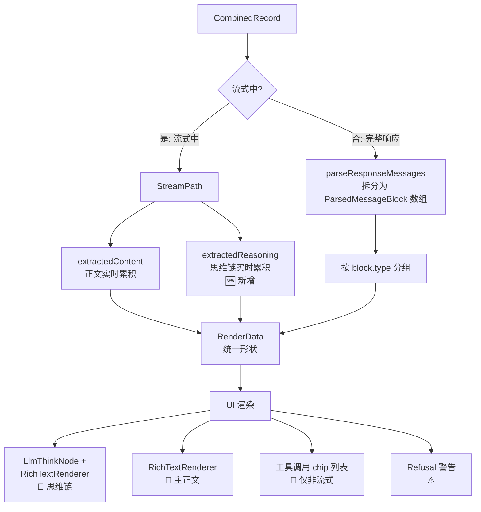

# 响应详情视图重构计划 (2026-06)

> **状态**: ✅ 阶段 1 + 阶段 2 已实施完成（v3 修订）
> **作者**: kilo咕咕 (Architect)
> **目标范围**: [`ResponseStructuredView.vue`](src/tools/llm-inspector/components/detail/views/ResponseStructuredView.vue:1) 与 [`ResponseRawView.vue`](src/tools/llm-inspector/components/detail/views/ResponseRawView.vue:1)
> **核心策略**: 📐 **照抄项目已有优雅实现**，不重复造轮子

---

## 0. 修订说明

### v1 → v2

姐姐一句话点醒了咕咕：「项目中已有解析流式并渲染的地方可以照抄」。

**v1 的问题**：

- 想自己写一个庞大的 `streamMerger.ts` 去合并 SSE 为非流式 JSON
- 忽略了 [`llm-chat/MessageContent.vue`](src/tools/llm-chat/components/message/MessageContent.vue:1) 已有完美范本
- 忽略了 [`streamProcessor.ts`](src/tools/llm-inspector/core/streamProcessor.ts:1) 和 [`@utils/sse-parser`](src/utils/sse-parser.ts:1) 已有的实时提取能力

**v2 的核心变化**：

- ❌ 阶段 1：不再实现复杂的 `streamMerger.ts`
- ✅ 直接复用并扩展 [`extractStreamContent`](src/tools/llm-inspector/core/utils.ts:265) 的模式
- ✅ 在 UI 层完全照抄 [`MessageContent.vue`](src/tools/llm-chat/components/message/MessageContent.vue:793) 的 `LlmThinkNode + RichTextRenderer` 双组件结构

### v2 → v3（阶段 2 实施 + 归属修订）

> 姐姐的关键判断：「重组后的标准化 JSON 更适合放在**结构化页面**里，虽然出现代码块看起来反直觉，但逻辑上是对的」。

**v3 的核心修订**：

- ✅ 阶段 2 已实施，但**实施位置变更**：
  - ❌ 原计划：在 [`ResponseRawView.vue`](src/tools/llm-inspector/components/detail/views/ResponseRawView.vue:1) 加 segment control 切换「原始 SSE / 合并 JSON」
  - ✅ 实际实施：在 [`ResponseStructuredView.vue`](src/tools/llm-inspector/components/detail/views/ResponseStructuredView.vue:1) 顶部新增子视图切换「可视化 / 标准化 JSON」
- **决策依据**：
  1. 「合并后的标准化 JSON」**本质是结构化解读的产物**（从 SSE 还原成厂商原生完整响应），而不是「原始数据」
  2. 「原始」一词的语义应当严格属于「未经任何处理的传输层文本」，即 SSE 流本身
  3. 把两种"结构化呈现方式"（可视化 / JSON）聚合在一起，让结构化视图成为**唯一的「解读层」入口**，原始视图保持纯粹
- ✅ 阶段 1（[`extractStreamReasoning`](src/tools/llm-inspector/core/utils.ts:295) + LlmThinkNode 重构）保持不变，已稳定运行

---

## 1. 背景与动机

### 1.1 现状问题：流式中丢失结构化信息

**致命缺陷**：当前 [`ResponseStructuredView.vue`](src/tools/llm-inspector/components/detail/views/ResponseStructuredView.vue:99-109) 在流式传输时，把累积正文**粗暴包装**为单个 `text` 块塞给共用的 [`StructuredMessagesView`](src/tools/llm-inspector/components/detail/StructuredMessagesView.vue:1)：

```typescript
// 当前实现的致命缺陷
const streamingMessages = computed<ParsedMessage[]>(() => {
  const text = extractedContent.value;
  if (!text) return [];
  return [
    {
      role: "assistant",
      blocks: [{ type: "text", text }], // ⚠️ 思维链和工具调用全部丢失！
      raw: text,
    },
  ];
});
```

**导致的问题**：

- DeepSeek-R1 / o1 / Claude thinking 的**思维链在流式中完全不可见**
- OpenAI / Anthropic 的**工具调用在流式中完全不可见**
- 用户只能等流式结束后切回"原始"视图看 SSE 排查

### 1.2 请求与响应的语义差异（v1 已分析）

| 维度        | 请求 (Request)                             | 响应 (Response)                                   |
| ----------- | ------------------------------------------ | ------------------------------------------------- |
| **角色**    | 多角色（system / user / assistant / tool） | 单角色（assistant / model）                       |
| **侧重点**  | 多轮对话流，需要清晰区分"谁说了什么"       | 单条 AI 输出，需要精致渲染主要内容                |
| **内容**    | 纯文本/多模态输入为主                      | 大量 Markdown，可能有思维链、工具调用             |
| **UI 需求** | 角色卡片头 + 锚点导航 + 搜索               | 沉浸式 Markdown 渲染 + 思维链卡片 + 工具调用 chip |

因此 Response 应该**完全解耦** `StructuredMessagesView`，走自己的精致渲染路径。

---

## 2. 深度勘察：项目已有资产清单

### 2.1 [`llm-chat/MessageContent.vue`](src/tools/llm-chat/components/message/MessageContent.vue:1) — 完美的范本

这才是**真正的金矿**。在 [`MessageContent.vue:792-827`](src/tools/llm-chat/components/message/MessageContent.vue:792) 中：

```vue
<!-- 推理内容（DeepSeek reasoning）- 始终显示在顶部 -->
<LlmThinkNode
  v-if="message.metadata?.reasoningContent"
  raw-tag-name="reasoning"
  display-name="深度思考"
  :is-thinking="isReasoning"
  :collapsed-by-default="true"
  :raw-content="message.metadata.reasoningContent"
>
  <RichTextRenderer
    :content="message.metadata.reasoningContent"
    :is-streaming="isReasoning"
    ...
  />
</LlmThinkNode>

<!-- 主正文 -->
<RichTextRenderer
  :content="displayedContent"
  :is-streaming="isGenerating"
  :smoothing-enabled="settings.uiPreferences.smoothingEnabled"
  ...
/>
```

**关键洞察**：

- ✅ 思维链与正文是**两个独立的 `RichTextRenderer`**
- ✅ 思维链用 [`LlmThinkNode`](src/tools/rich-text-renderer/components/nodes/LlmThinkNode.vue:1) 包裹，自带折叠动画和"思考中"状态
- ✅ 两者都支持 `is-streaming` 实时流式
- ✅ 这套结构已经经过 `llm-chat` 长期实战检验

### 2.2 [`streamProcessor.ts`](src/tools/llm-inspector/core/streamProcessor.ts:1) — 已有的流式管理

| 能力               | 实现位置                                                                    | 说明                        |
| ------------------ | --------------------------------------------------------------------------- | --------------------------- |
| 流式缓冲区（节流） | [`processStreamUpdate`](src/tools/llm-inspector/core/streamProcessor.ts:62) | 100ms 节流，shallowRef 优化 |
| 实时提取**正文**   | [`extractContent`](src/tools/llm-inspector/core/streamProcessor.ts:176)     | ✅ 已实现                   |
| 实时提取**思维链** | ❌ **缺失**                                                                 | 需要新增                    |
| 流式状态判断       | [`isStreamingRecord`](src/tools/llm-inspector/core/streamProcessor.ts:142)  | ✅ 已实现                   |

### 2.3 [`utils.ts`](src/tools/llm-inspector/core/utils.ts:1) — 已有的格式适配

[`extractDeltaByFormat`](src/tools/llm-inspector/core/utils.ts:292) 是**关键基础设施**，已支持所有主流厂商：

| 格式               | 正文提取路径                                 | 思维链提取路径（待补）                             |
| ------------------ | -------------------------------------------- | -------------------------------------------------- |
| `openai-chat`      | `choices[0].delta.content`                   | `choices[0].delta.reasoning_content` (DeepSeek-R1) |
| `openai-responses` | `delta` (output_text.delta 事件)             | `summary[].text` (reasoning items)                 |
| `anthropic`        | `delta.text` (content_block_delta)           | `delta.thinking` (thinking_delta 类型)             |
| `gemini`           | `candidates[0].content.parts[0].text`        | `parts[].text where parts[].thought === true`      |
| `cohere`           | `delta.message.content.text` (content-delta) | `delta.message.content.thinking` (thinking 类型)   |
| `ollama`           | `message.content`                            | （Ollama 暂未支持 thinking）                       |

### 2.4 [`@utils/sse-parser`](src/utils/sse-parser.ts:1) — 通用 SSE 工具

提供 [`extractReasoningFromSSE`](src/utils/sse-parser.ts:171)，但 provider 命名（`openai`, `claude`, `gemini`）与 `llm-inspector` 的 [`ApiFormat`](src/tools/llm-inspector/core/utils.ts:214) 不一致，**直接复用需要映射层**。

**结论**：与其映射，不如**直接在 `utils.ts` 内部新增 `extractReasoningByFormat`**，与现有 `extractDeltaByFormat` 完全同构，零外部依赖、零映射成本。

### 2.5 [`messageParser.ts`](src/tools/llm-inspector/core/messageParser.ts:1) — 非流式完整解析

[`parseResponseMessages`](src/tools/llm-inspector/core/messageParser.ts:90) 已能产出完整的 [`ParsedMessage`](src/tools/llm-inspector/types.ts) 结构，包含 `thinking`、`text`、`tool_call`、`refusal`、`image` 等所有块类型。**非流式场景直接复用，零改动**。

### 2.6 关于"原生 Function Calling 渲染"

> ⚠️ **明确不在本次范围内**
>
> [`RichTextRenderer`](src/tools/rich-text-renderer/RichTextRenderer.vue:1) 的 [`VcpToolNode`](src/tools/rich-text-renderer/components/nodes/VcpToolNode.vue:1) **只识别 VCP 协议文本**（如 `[[VCP调用工具:tool_name:...]]`），并不渲染厂商原生 `tool_calls` 字段。
>
> 本次重构**只把原生 `tool_calls` 渲染为简洁的工具调用 chip**（非流式场景），不尝试翻译为 VCP 协议，不实现专属精美卡片。

---

## 3. 核心策略：统一数据源 + 双 Renderer 渲染

### 3.1 设计精髓

**让流式与非流式产出同样形状的 `RenderData`，UI 层完全统一**。



### 3.2 RenderData 形状

```typescript
interface RenderData {
  /** 主正文（拼接所有 text 块） */
  mainText: string;
  /** 思维链（拼接所有 thinking 块） */
  reasoningText: string;
  /** 工具调用列表（流式中为空，非流式从 ParsedMessage 提取） */
  toolCalls: ParsedMessageBlock[];
  /** Refusal 警告（流式中为空，非流式从 ParsedMessage 提取） */
  refusals: ParsedMessageBlock[];
  /** 多候选场景（Gemini 等） */
  candidates?: ParsedMessage[];
  /** 当前候选索引 */
  activeCandidate?: number;
}
```

**关键收益**：

- ✅ UI 模板**只看 `RenderData`**，不关心数据来源
- ✅ 流式中可以**实时显示思维链 + 正文**（不再只有正文）
- ✅ 非流式 / 流式渲染逻辑**100% 统一**

---

## 4. 实施细节

### 4.1 步骤 1：扩展 `utils.ts` 提供 `extractStreamReasoning`

完全照抄 [`extractStreamContent`](src/tools/llm-inspector/core/utils.ts:265) 的模式，新增一个孪生函数：

```typescript
// src/tools/llm-inspector/core/utils.ts

/**
 * 从流式响应中实时提取思维链内容
 * 与 extractStreamContent 完全同构
 */
export function extractStreamReasoning(
  body: string,
  requestUrl?: string
): string {
  const format = requestUrl ? detectApiFormat(requestUrl) : "unknown";
  const contents: string[] = [];
  const lines = body.split("\n");

  for (const line of lines) {
    if (line.startsWith("data: ")) {
      const data = line.substring(6).trim();
      if (data && data !== "[DONE]") {
        try {
          const parsed = JSON.parse(data);
          const text = extractReasoningDeltaByFormat(parsed, format);
          if (text) contents.push(text);
        } catch {
          // 忽略
        }
      }
    }
  }

  return contents.join("");
}

/** 根据格式从流式 delta 中提取思维链文本 */
function extractReasoningDeltaByFormat(parsed: any, format: ApiFormat): string {
  switch (format) {
    case "openai-chat":
    case "openai-completions":
    case "ollama":
      // DeepSeek-R1: reasoning_content；其他模型可能用 reasoning / thinking
      return (
        parsed.choices?.[0]?.delta?.reasoning_content ??
        parsed.choices?.[0]?.delta?.reasoning ??
        parsed.choices?.[0]?.delta?.thinking ??
        ""
      );

    case "openai-responses":
      // Responses API: reasoning.summary.delta 事件
      if (parsed.type === "response.reasoning_summary_text.delta")
        return parsed.delta ?? "";
      return "";

    case "anthropic":
      // Claude: content_block_delta + delta.type === "thinking_delta"
      if (
        parsed.type === "content_block_delta" &&
        parsed.delta?.type === "thinking_delta"
      )
        return parsed.delta?.thinking ?? "";
      return "";

    case "gemini":
      // Gemini: parts[].thought === true 时 parts[].text 是思维链
      const parts = parsed.candidates?.[0]?.content?.parts ?? [];
      return parts
        .filter((p: any) => p?.thought === true)
        .map((p: any) => p?.text ?? "")
        .join("");

    case "cohere":
      // Cohere v2: delta.message.content.thinking
      if (
        parsed.type === "content-delta" &&
        parsed.delta?.message?.content?.type === "thinking"
      )
        return parsed.delta.message.content.thinking ?? "";
      return "";

    default:
      return "";
  }
}
```

### 4.2 步骤 2：扩展 `streamProcessor.ts` 暴露 `extractReasoning`

```typescript
// src/tools/llm-inspector/core/streamProcessor.ts

export function extractReasoning(
  recordId: string,
  originalBody?: string,
  isStreamingResponse?: boolean,
  requestUrl?: string
): string {
  const body = streamBuffer.value[recordId] || originalBody || "";
  if (!body) return "";

  if (isStreamingResponse || isStreamingRecord(recordId)) {
    return extractStreamReasoning(body, requestUrl);
  }

  // 非流式：从完整 JSON 中提取（其实非流式场景一般不会调用这里，
  // 因为 ResponseStructuredView 走 parseResponseMessages 路径，
  // 但提供作为兜底）
  return "";
}
```

并在 [`useStreamProcessor`](src/tools/llm-inspector/core/streamProcessor.ts:241) 的 return 对象中暴露。

### 4.3 步骤 3：扩展 `useRecordDetail.ts` 暴露 `extractedReasoning`

```typescript
// src/tools/llm-inspector/composables/useRecordDetail.ts

const extractedReasoning = computed(() => {
  if (!record.value) return "";
  return streamProcessor.extractReasoning(
    record.value.id,
    record.value.response?.body,
    isStreamingResponse.value,
    record.value.request.url
  );
});

return {
  // ... 现有的
  extractedReasoning, // 🆕 新增
};
```

### 4.4 步骤 4：重构 `ResponseStructuredView.vue`

#### 4.4.1 统一的 `renderData` computed

```typescript
import { computed } from "vue";
import { parseResponseMessages } from "../../../core/messageParser";
import { detectApiFormat } from "../../../core/utils";
import { useRecordDetail } from "../../../composables/useRecordDetail";
import type { ParsedMessage, ParsedMessageBlock } from "../../../types";

interface RenderData {
  mainText: string;
  reasoningText: string;
  toolCalls: ParsedMessageBlock[];
  refusals: ParsedMessageBlock[];
  candidates: ParsedMessage[];
}

const {
  isStreamingActive,
  isStreamingResponse,
  extractedContent,
  extractedReasoning, // 🆕
} = useRecordDetail(props);

const apiFormat = computed(() => detectApiFormat(props.record.request.url));

// 非流式解析（仅当不在流式中时才有意义）
const responseParseResult = computed(() => {
  if (!props.record.response?.body) return null;
  return parseResponseMessages(props.record.response.body, apiFormat.value);
});

// 多 candidate 当前激活索引
const activeCandidate = ref(0);

const renderData = computed<RenderData | null>(() => {
  // 流式分支
  if (isStreamingActive.value || isStreamingResponse.value) {
    if (!extractedContent.value && !extractedReasoning.value) return null;
    return {
      mainText: extractedContent.value,
      reasoningText: extractedReasoning.value,
      toolCalls: [],
      refusals: [],
      candidates: [],
    };
  }

  // 非流式分支
  const parseResult = responseParseResult.value;
  if (!parseResult || parseResult.messages.length === 0) return null;

  const candidates = parseResult.messages;
  const current = candidates[activeCandidate.value] ?? candidates[0];

  const textBlocks = current.blocks.filter((b) => b.type === "text");
  const thinkingBlocks = current.blocks.filter((b) => b.type === "thinking");
  const toolCalls = current.blocks.filter((b) => b.type === "tool_call");
  const refusals = current.blocks.filter((b) => b.type === "refusal");

  return {
    mainText: textBlocks.map((b) => b.text || "").join("\n\n"),
    reasoningText: thinkingBlocks.map((b) => b.text || "").join("\n\n"),
    toolCalls,
    refusals,
    candidates,
  };
});
```

#### 4.4.2 渲染模板（完全照抄 `MessageContent.vue` 模式）

```vue
<template>
  <div class="response-structured-view">
    <!-- 顶部信息条（保留） -->
    <div class="info-bar">
      <span class="info-chip">
        <Code2 :size="12" />
        <span class="info-label">格式：</span>
        <span class="info-value">{{ apiFormat }}</span>
      </span>
      <span v-if="responseParseResult?.model" class="info-chip">
        <Cpu :size="12" />
        <span class="info-label">模型：</span>
        <span class="info-value">{{ responseParseResult.model }}</span>
      </span>
      <span v-if="responseParseResult?.stopReason" class="info-chip">
        <Flag :size="12" />
        <span class="info-label">停止原因：</span>
        <span class="info-value">{{ responseParseResult.stopReason }}</span>
      </span>
    </div>

    <!-- 流式实时接收提示 -->
    <div v-if="isStreamingActive" class="streaming-banner">
      <Circle :size="8" fill="currentColor" class="live-dot" />
      <span>
        正在实时接收 · 正文 {{ renderData?.mainText.length || 0 }} 字符
        <template v-if="renderData?.reasoningText.length">
          · 思维链 {{ renderData.reasoningText.length }} 字符
        </template>
      </span>
    </div>

    <!-- 占位 -->
    <div v-if="!renderData" class="response-placeholder">
      <Hourglass :size="14" />
      <span>{{
        isStreamingActive ? "等待流式数据到达…" : "响应体尚未到达"
      }}</span>
    </div>

    <!-- 多 Candidate Tab（仅非流式且 >1 时显示） -->
    <div
      v-if="renderData?.candidates && renderData.candidates.length > 1"
      class="candidate-tabs"
    >
      <button
        v-for="(_, i) in renderData.candidates"
        :key="i"
        :class="{ active: activeCandidate === i }"
        @click="activeCandidate = i"
      >
        候选 {{ i + 1 }}
      </button>
    </div>

    <!-- 🧠 思维链卡片（照抄 MessageContent.vue 的 LlmThinkNode） -->
    <LlmThinkNode
      v-if="renderData?.reasoningText"
      raw-tag-name="reasoning"
      rule-id="inspector-reasoning"
      display-name="深度思考"
      :is-thinking="isStreamingActive"
      :collapsed-by-default="false"
      :raw-content="renderData.reasoningText"
    >
      <RichTextRenderer
        :content="renderData.reasoningText"
        :version="RendererVersion.V2_CUSTOM_PARSER"
        :is-streaming="isStreamingActive"
        :smoothing-enabled="true"
      />
    </LlmThinkNode>

    <!-- 📝 主正文 -->
    <div v-if="renderData?.mainText" class="main-content">
      <RichTextRenderer
        :content="renderData.mainText"
        :version="RendererVersion.V2_CUSTOM_PARSER"
        :is-streaming="isStreamingActive"
        :smoothing-enabled="true"
      />
    </div>

    <!-- 🔧 工具调用 chip（仅非流式） -->
    <div v-if="renderData?.toolCalls.length" class="tool-calls-section">
      <div class="section-title">
        <Wrench :size="14" />
        <span>工具调用 ({{ renderData.toolCalls.length }})</span>
      </div>
      <div
        v-for="(block, i) in renderData.toolCalls"
        :key="i"
        class="tool-call-chip"
      >
        <div class="chip-header" @click="toggleExpand(i)">
          <code class="tool-name">{{ block.toolName }}</code>
          <code v-if="block.toolCallId" class="tool-id">
            {{ shortId(block.toolCallId) }}
          </code>
          <ChevronDown :size="12" :class="{ rotated: expanded[i] }" />
        </div>
        <pre v-show="expanded[i]" class="chip-body">{{
          formatArgsForDisplay(block.toolArguments)
        }}</pre>
      </div>
    </div>

    <!-- ⚠️ Refusal 警告 -->
    <el-alert
      v-for="(block, i) in renderData?.refusals || []"
      :key="`refusal-${i}`"
      type="warning"
      :title="`模型拒绝响应: ${block.text}`"
      :closable="false"
      show-icon
    />
  </div>
</template>
```

### 4.5 步骤 5（阶段 2 实施版）：在结构化视图中加「标准化 JSON」子 tab

> ⚠️ **架构决策修订**：把合并 JSON 视图归属到结构化视图（而非原始视图）作为子 tab。

#### 4.5.1 [`streamMerger.ts`](src/tools/llm-inspector/core/streamMerger.ts:1) 实现要点

不再复用 `extractStreamContent` 拼凑（那样会丢失 `tool_calls`、`usage`、`finish_reason` 等结构信息），改为**为每个 provider 实现完整的 SSE 合并算法**：

- 解析 SSE 事件序列（按 `\n\n` 切分 + `data:` / `event:` 提取）
- 按厂商协议累积各字段：
  - **OpenAI Chat**: 按 `choices[].index` 分桶，累积 `delta.content` / `delta.reasoning_content` / `delta.tool_calls[].function.arguments` 等
  - **Anthropic**: 解析 `message_start` / `content_block_start` / `content_block_delta` / `message_delta` 事件序列，累积 text / thinking / tool_use
  - **Gemini**: 按 candidate 累积 parts，相邻同 `thought` 状态的文本 part 自动合并
  - **OpenAI Responses**: 优先用 `response.completed` 事件中的完整对象；fallback 到 deltas 重建
  - **Cohere v2**: 解析 `content-start` / `content-delta` / `message-end` 事件
  - **Ollama**: 累积 `message.content` + 最后一个 chunk 的性能统计
- 失败兜底：返回 chunks 数组 + 警告，不抛错

#### 4.5.2 [`ResponseStructuredView.vue`](src/tools/llm-inspector/components/detail/views/ResponseStructuredView.vue:1) UI 集成

顶部 segment control：

```vue
<div class="sub-view-toggle">
  <button :class="{ active: subView === 'visual' }" @click="subView = 'visual'">
    <Sparkles /> 可视化
  </button>
  <button :class="{ active: subView === 'json' }" @click="subView = 'json'">
    <Braces /> 标准化 JSON
  </button>
</div>
```

- **可视化子视图**：保留阶段 1 的 LlmThinkNode + RichTextRenderer + 工具调用 chip
- **标准化 JSON 子视图**：
  - 流式中：实时合并 SSE，用 `RichCodeEditor` 展示，配合「已合并 N 个事件 · 实时刷新中」提示条
  - 非流式：直接美化原始 JSON
  - 顶部带复制按钮 + 大小提示 + 警告条（若有）

#### 4.5.3 数据源

直接读取 [`streamProcessor.streamBuffer.value[recordId]`](src/tools/llm-inspector/core/streamProcessor.ts:16)（原始未美化的 SSE 字节流），不走 `displayResponseBody`（那个会做 SSE 格式化美化，结构虽未变但会影响合并算法的字符匹配）。

---

## 5. 文件改动清单

### 5.1 新增

| 文件                                                              | 用途                                                | 阶段           |
| ----------------------------------------------------------------- | --------------------------------------------------- | -------------- |
| [`streamMerger.ts`](src/tools/llm-inspector/core/streamMerger.ts) | SSE → 厂商原生非流式 JSON 合并算法（6 个 provider） | ✅ 阶段 2 完成 |

### 5.2 修改

| 文件                                                                                                       | 改动                                                                                              | 阶段             |
| ---------------------------------------------------------------------------------------------------------- | ------------------------------------------------------------------------------------------------- | ---------------- |
| [`utils.ts`](src/tools/llm-inspector/core/utils.ts)                                                        | 新增 `extractStreamReasoning` + `extractReasoningDeltaByFormat`                                   | ✅ 阶段 1 完成   |
| [`streamProcessor.ts`](src/tools/llm-inspector/core/streamProcessor.ts)                                    | 新增 `extractReasoning` 方法 + 暴露给 composable                                                  | ✅ 阶段 1 完成   |
| [`useRecordDetail.ts`](src/tools/llm-inspector/composables/useRecordDetail.ts)                             | 新增 `extractedReasoning` computed                                                                | ✅ 阶段 1 完成   |
| [`ResponseStructuredView.vue`](src/tools/llm-inspector/components/detail/views/ResponseStructuredView.vue) | 阶段 1：重构为 `LlmThinkNode + RichTextRenderer` 模式；阶段 2：新增「可视化 / 标准化 JSON」子 tab | ✅ 阶段 1+2 完成 |
| [`ResponseRawView.vue`](src/tools/llm-inspector/components/detail/views/ResponseRawView.vue)               | 不再改动（保持纯粹的 SSE / JSON 文本展示）                                                        | 🚫 决策修订      |

### 5.3 保留（不动）

| 文件                                                                                                                                      | 说明                                                                                                             |
| ----------------------------------------------------------------------------------------------------------------------------------------- | ---------------------------------------------------------------------------------------------------------------- |
| [`StructuredMessagesView.vue`](src/tools/llm-inspector/components/detail/StructuredMessagesView.vue)                                      | 继续供 [`RequestStructuredView`](src/tools/llm-inspector/components/detail/views/RequestStructuredView.vue) 使用 |
| [`messageParser.ts`](src/tools/llm-inspector/core/messageParser.ts)                                                                       | 非流式解析，零改动                                                                                               |
| [`extractStreamContent`](src/tools/llm-inspector/core/utils.ts:265) / [`extractDeltaByFormat`](src/tools/llm-inspector/core/utils.ts:292) | 现有正文提取，零改动                                                                                             |

---

## 6. 验证与回归

### 6.1 测试场景

| 场景                          | 必查项                                                |
| ----------------------------- | ----------------------------------------------------- |
| 非流式 OpenAI Chat            | 主文本 Markdown 渲染、`tool_calls` chip 列表          |
| 非流式 Anthropic              | thinking 块走 `LlmThinkNode`、`tool_use` 走 chip 列表 |
| 非流式 Gemini（多 candidate） | Tab 切换正常                                          |
| 流式 OpenAI 普通响应          | 实时正文渲染 + 平滑动画                               |
| 流式 DeepSeek-R1              | **思维链实时折叠卡片渲染 + 正文实时渲染**             |
| 流式 Claude thinking          | **`thinking_delta` 事件正确累积到思维链**             |
| 流式 Gemini thought           | **`parts[].thought === true` 的部分正确累积到思维链** |
| 错误响应（400 / 500）         | 不闪退，能看到原始错误 JSON                           |
| 空响应                        | 显示占位提示                                          |

### 6.2 预设命令

```powershell
bun run check:frontend  # TS 类型检查
bun run test:run        # 单元测试（如果新增）
```

---

## 7. 风险与权衡

| 风险                                         | 应对                                                                     |
| -------------------------------------------- | ------------------------------------------------------------------------ |
| 思维链提取覆盖不全（如某些厂商新增推理格式） | 走"宁缺毋滥"原则，提取不到就显示空，不报错                               |
| RichTextRenderer 性能（巨型响应）            | 已有节流和静态优化（详见 `MessageContent.vue` 的实战经验）               |
| `LlmThinkNode` 在非聊天场景的样式适配        | 它本身是通用组件，可通过 props 控制；如有样式问题可在 inspector 局部覆盖 |
| 流式中提取的 reasoning 与 content 顺序错乱   | 不是问题，两者完全独立渲染在两个 `RichTextRenderer` 中                   |

---

## 8. 明确不在本次范围内

- ❌ **不**实现"原生 Function Calling → VCP 协议"翻译适配器
- ❌ **不**为原生 FC 实现专属精美卡片（保留给后续单独立项）
- ❌ **不**调整 [`RequestStructuredView.vue`](src/tools/llm-inspector/components/detail/views/RequestStructuredView.vue:1)（请求视图保留现状）
- ❌ **不**修改 [`StructuredMessagesView.vue`](src/tools/llm-inspector/components/detail/StructuredMessagesView.vue:1)
- ❌ **不**修改 [`messageParser.ts`](src/tools/llm-inspector/core/messageParser.ts:1)（解析能力已足够）
- ⏸️ **阶段 2** 才做 [`ResponseRawView.vue`](src/tools/llm-inspector/components/detail/views/ResponseRawView.vue:1) 的"合并 JSON"切换

---

## 9. 实施步骤（阶段 1 核心）

### 阶段 1A：基础设施扩展（30 分钟）

1. 在 [`utils.ts`](src/tools/llm-inspector/core/utils.ts:1) 中新增 `extractStreamReasoning` + `extractReasoningDeltaByFormat`
2. 在 [`streamProcessor.ts`](src/tools/llm-inspector/core/streamProcessor.ts:1) 中新增 `extractReasoning` 方法
3. 在 [`useRecordDetail.ts`](src/tools/llm-inspector/composables/useRecordDetail.ts:1) 中新增 `extractedReasoning` computed

### 阶段 1B：重构 ResponseStructuredView（60 分钟）

4. 移除 `StructuredMessagesView` 依赖
5. 引入 `LlmThinkNode` + `RichTextRenderer`
6. 实现 `RenderData` computed 统一数据源
7. 实现 UI 模板（思维链 / 正文 / 工具调用 / refusal）

### 阶段 1C：测试与微调（30 分钟）

8. 在真实流式响应下测试 DeepSeek-R1 / Claude thinking 场景
9. 调整工具调用 chip 样式
10. 运行 `bun run check:frontend`

### 阶段 2（可选，单独立项）：

- 实现 `streamMerger.ts` 和 `ResponseRawView.vue` 的 Segment Control

---

## 10. 待姐姐确认

| 问题                                       | 咕咕建议                                                                               |
| ------------------------------------------ | -------------------------------------------------------------------------------------- |
| 思维链卡片默认状态：展开 vs 折叠？         | **默认展开** —— 检查器场景，用户来就是查细节的                                         |
| 工具调用 chip 默认状态：折叠 vs 展开？     | **默认折叠** —— 避免大段 JSON 占用空间，点击展开                                       |
| 阶段 2（合并 JSON 查看）是否要本次一起做？ | **建议拆分** —— 先把核心结构化视图重构搞定，验证用户体验，再决定合并 JSON 是否值得投入 |
| 多 Candidate Tab 默认显示哪个？            | **默认第一个** —— 与 Gemini 官方行为一致                                               |
