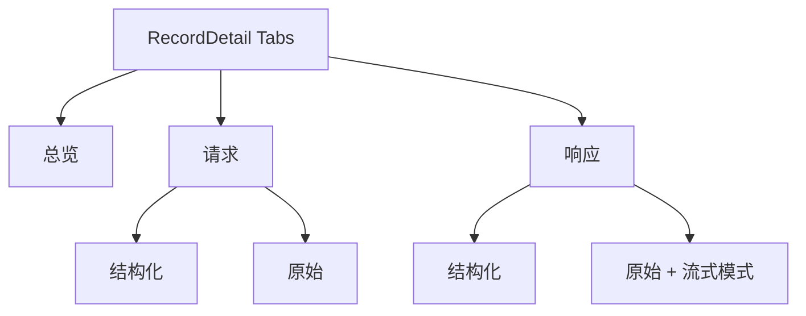

# LLM Inspector 详情面板 UI 重构计划

> 状态：Implementing
> 日期：2026-06-02
> 范围：[`src/tools/llm-inspector/components/RecordDetail.vue`](src/tools/llm-inspector/components/RecordDetail.vue) 及其下属 detail/\* 组件、[`streamProcessor.ts`](src/tools/llm-inspector/core/streamProcessor.ts)

## 1. 目标

修复当前详情面板的三个核心问题：

1. **分类混乱**：当前 Tab 按"内容形态"切分（总览 / 结构化 / 原始 / 流式），但请求与响应混在每一个 Tab 内部，用户在多个 Tab 间反复跳转才能看完一次请求的全貌。
2. **流式 Tab 分类错位**：[`RecordStreamTab.vue`](src/tools/llm-inspector/components/detail/RecordStreamTab.vue) 实际上只服务响应，做成顶层 Tab 让分类维度不正交，且与「原始 Tab 的响应体」职责高度重叠。
3. **原始 Tab 性能差**：[`RecordRawTab.vue:19-23`](src/tools/llm-inspector/components/detail/RecordRawTab.vue:19) 直接用 `<pre>{{ formatJson(...) }}</pre>` 渲染大文本；[`streamProcessor.ts:54-56`](src/tools/llm-inspector/core/streamProcessor.ts:54) 每个 chunk 都触发响应式抖动，SSE 高频时卡顿明显。

## 2. 新 Tab 结构

顶层固定 3 个 Tab：

| Tab         | 子结构               | 包含内容                                                                     | 不包含             |
| ----------- | -------------------- | ---------------------------------------------------------------------------- | ------------------ |
| **📊 总览** | 单页滚动             | 请求元信息 + 请求头 + 响应元信息 + 响应头 + Inspector 元数据卡片             | ❌ 请求体 / 响应体 |
| **📤 请求** | Segment：结构化/原始 | 结构化：解析后的 messages；原始：请求 body（JSON 美化/原文，RichCodeEditor） | ❌ 任何响应内容    |
| **📥 响应** | Segment：结构化/原始 | 结构化：assistant 回复 + stopReason；原始：响应 body（**内置流式实时模式**） | ❌ 任何请求内容    |

### 2.1 总览 Tab 设计

- 拆成「请求摘要 / 响应摘要 / Inspector 元数据」三块。
- 请求头、响应头默认折叠（显示数量徽章），点击展开 + 复制按钮。
- 新增 Inspector 元数据卡片，利用现有 [`types.ts:56-62`](src/tools/llm-inspector/types.ts:56) 的 `RecordInspectorMetadata`（旧 UI 未暴露）。
- 删除现有 [`RecordOverviewTab.vue:112-118`](src/tools/llm-inspector/components/detail/RecordOverviewTab.vue:112) 的「请到原始 Tab 查看」引导文字。

### 2.2 流式模式融合

`ResponseRawView` 内部根据 `isStreamingResponse` 自动展示：

- 状态徽章：`● 实时接收中` / `⚡ 流式响应已结束` / 无（普通响应）
- 控制条：自动滚动 / 正文-原始 viewMode 切换 / 复制
- 删除 [`RecordStreamTab.vue`](src/tools/llm-inspector/components/detail/RecordStreamTab.vue)

## 3. 性能改造

### 3.1 编辑器替换

用 [`RichCodeEditor`](src/components/common/) 的 CodeMirror 引擎替换裸 `<pre>`：

- 内置虚拟滚动，10MB JSON 不卡
- 自带主题适配
- readonly 模式 + 语言自动检测（json / text / eventstream）

### 3.2 格式化缓存

新建 `composables/useFormattedBody.ts`：

- 用 `Map<recordId, { raw, formatted, ver }>` 缓存
- 流式时按 `raw.length` 当版本号，未变化直接复用
- 把模板里的 `formatJson(record.request.body)` 改成 computed 缓存

### 3.3 流式节流

改造 [`streamProcessor.ts`](src/tools/llm-inspector/core/streamProcessor.ts)：

- `streamBuffer` 改为 `shallowRef` + 内部纯 JS Map
- chunk 累积到非响应式 buffer，用 `setTimeout 100ms` 节流后统一 `triggerRef`
- 单帧批量刷新而不是每 chunk 触发

## 4. 文件改动清单

| 操作     | 文件                                                                                                                                                                              | 说明                                                                                                                      |
| -------- | --------------------------------------------------------------------------------------------------------------------------------------------------------------------------------- | ------------------------------------------------------------------------------------------------------------------------- |
| **重写** | [`RecordDetail.vue`](src/tools/llm-inspector/components/RecordDetail.vue)                                                                                                         | 顶层 3 Tab：总览 / 请求 / 响应                                                                                            |
| **改造** | [`RecordOverviewTab.vue`](src/tools/llm-inspector/components/detail/RecordOverviewTab.vue)                                                                                        | 删 body 引导提示、加 metadata 卡片、头部默认折叠                                                                          |
| **新建** | `components/detail/RequestPanel.vue`                                                                                                                                              | 请求面板，内部 segment 切结构化/原始                                                                                      |
| **新建** | `components/detail/ResponsePanel.vue`                                                                                                                                             | 响应面板，原始视图内置流式状态条                                                                                          |
| **新建** | `components/detail/views/RequestStructuredView.vue`                                                                                                                               | 从 [`RecordStructuredTab.vue`](src/tools/llm-inspector/components/detail/RecordStructuredTab.vue) 拆出请求部分            |
| **新建** | `components/detail/views/ResponseStructuredView.vue`                                                                                                                              | 同上，拆出响应部分（含 model / stopReason 信息条）                                                                        |
| **新建** | `components/detail/views/RequestRawView.vue`                                                                                                                                      | 从 [`RecordRawTab.vue`](src/tools/llm-inspector/components/detail/RecordRawTab.vue) 拆出 + RichCodeEditor                 |
| **新建** | `components/detail/views/ResponseRawView.vue`                                                                                                                                     | 同上 + 整合 [`RecordStreamTab.vue`](src/tools/llm-inspector/components/detail/RecordStreamTab.vue) 的流式状态条与自动滚动 |
| **删除** | [`RecordStreamTab.vue`](src/tools/llm-inspector/components/detail/RecordStreamTab.vue)                                                                                            | 功能并入 ResponseRawView                                                                                                  |
| **删除** | [`RecordStructuredTab.vue`](src/tools/llm-inspector/components/detail/RecordStructuredTab.vue) / [`RecordRawTab.vue`](src/tools/llm-inspector/components/detail/RecordRawTab.vue) | 拆分后清理                                                                                                                |
| **改造** | [`streamProcessor.ts`](src/tools/llm-inspector/core/streamProcessor.ts)                                                                                                           | shallowRef + 100ms 节流 + 版本号                                                                                          |
| **新建** | `composables/useFormattedBody.ts`                                                                                                                                                 | 格式化结果缓存                                                                                                            |
| **保留** | [`useRecordDetail.ts`](src/tools/llm-inspector/composables/useRecordDetail.ts)                                                                                                    | 作为共享门面（copyAll 等），不强行拆分                                                                                    |
| **保留** | [`StructuredMessagesView.vue`](src/tools/llm-inspector/components/detail/StructuredMessagesView.vue)                                                                              | 已经很完善，请求/响应共用                                                                                                 |

## 5. 兼容性

- 数据结构 [`types.ts`](src/tools/llm-inspector/types.ts) 不变
- [`messageParser.ts`](src/tools/llm-inspector/core/messageParser.ts) / [`recordManager.ts`](src/tools/llm-inspector/core/recordManager.ts) 不变
- 用户已有的 `splitRatio` 设置兼容
- 新增可选字段 `LlmInspectorSettings.layout.overviewHeadersExpanded`（默认 `false`），用于持久化总览头部折叠状态

## 6. 验收点

- [x] 顶层 Tab 数量从动态 3-4 变为固定 3
- [x] 一次请求往返的所有元信息能在「总览」一屏速览
- [x] 请求 body 与响应 body 物理隔离，互不滚动干扰
- [x] 流式响应在「响应 → 原始」内通过徽章和 viewMode 表现，无独立 Tab
- [x] 大响应体（>1MB）滚动流畅，非块级重排
- [x] SSE 高频流式（>20fps）下 CPU 占用显著降低（节流到 ~10fps 刷新）
- [x] `bun run check` 通过
