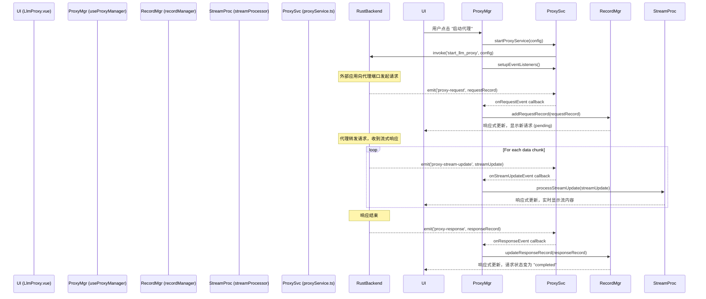

# LLM Proxy: 架构与开发者指南

本文档旨在深入解析 `llm-proxy` 工具的内部架构、设计理念和数据流，为后续的开发和维护提供清晰的指引。

## 1. 核心概念

`llm-proxy` 工具的核心是构建一个本地中间人代理服务器，用于拦截、检查、记录和分析发往远程 LLM API 的 HTTP 请求。其设计围绕以下几个关键概念展开。

### 1.1. Rust 原生代理核心

与纯浏览器或 Node.js 实现不同，本工具的代理服务器是使用 Rust 语言编写的，并借助 Tauri 框架在原生线程中运行。

- **高性能**: 基于 Rust 的 `axum` 和 `hyper` 库，提供高性能、低开销的网络处理能力。
- **系统级网络**: 可以在系统级别监听指定端口，不受浏览器同源策略等限制。
- **生命周期管理**: 代理服务的启动、停止和状态查询完全由 Rust 后端控制，并通过 Tauri 的 `invoke` 机制暴露给前端。

### 1.2. 前后端事件驱动通信

前端 UI 与后端 Rust 代理之间的通信是**双向且事件驱动**的。

- **前端到后端 (命令)**: 前端通过 Tauri 的 `invoke` 函数向 Rust 发送命令，例如 `start_llm_proxy`, `stop_llm_proxy`, `update_proxy_target`。
- **后端到前端 (事件)**: Rust 代理在运行过程中，会将关键事件（如收到新请求、响应完成、流式数据块到达）通过 Tauri 的 `emit` 机制广播给前端。前端通过 `listen` 函数订阅这些事件来实时更新 UI。

这种模式将重量级的网络任务放在后端，而前端则专注于状态管理和数据可视化，实现了清晰的关注点分离。

### 1.3. 请求/响应生命周期 (`CombinedRecord`)

工具的核心数据单元是 `CombinedRecord`，它完整地记录了一次 HTTP 交互的生命周期。

- **创建**: 当 Rust 代理拦截到一个新的 HTTP 请求时，会立即创建一个 `RequestRecord` 并通过 `proxy-request` 事件发送给前端。此时，前端会创建一个 `CombinedRecord`，其中 `request` 字段已填充，但 `response` 字段为空。
- **更新**: 当该请求的响应从目标服务器返回后，Rust 代理会创建一个 `ResponseRecord`，并通过 `proxy-response` 事件发送给前端。前端根据 `id` 找到对应的 `CombinedRecord`，并填充其 `response` 字段。
- **状态**: 通过检查 `response` 字段是否存在，UI 可以清晰地展示请求的状态（进行中或已完成）。

### 1.4. 实时流式处理 (`StreamProcessor`)

现代 LLM API 广泛使用 Server-Sent Events (SSE) 进行流式响应。本工具内置了强大的流式处理能力。

- **事件驱动**: Rust 后端在收到流式数据块 (`chunk`) 时，会通过 `proxy-stream-update` 事件将其发送给前端，而不是等待整个响应结束后再发送。
- **前端缓冲**: `streamProcessor.ts` 模块负责接收这些数据块，并将它们追加到一个以 `recordId` 为键的缓冲区 (`StreamBuffer`) 中。
- **实时解析与渲染**: UI 组件可以响应式地监听这个缓冲区。`streamProcessor` 提供了工具函数，能够从原始的 SSE 格式数据中提取出有意义的文本内容，或将原始数据格式化后进行显示，从而实现打字机般的实时渲染效果。

### 1.5. 模块化管理器 (Managers)

为了保持代码的组织性和可维护性，核心的前端逻辑被拆分到多个独立的、功能专一的管理器中。

- **`useProxyManager`**: **中央协调器**。负责管理代理的生命周期，协调其他管理器，并向 UI 组件暴露统一的状态和方法。
- **`recordManager`**: **数据存储与查询**。负责存储所有的 `CombinedRecord`，并提供添加、更新、筛选和检索记录的功能。
- **`streamProcessor`**: **流式数据专家**。专门处理实时 SSE 数据的缓冲、解析和格式化。
- **`configManager`**: **持久化层**。负责将用户的配置（如端口、目标地址）和 UI 状态（如过滤条件）加载和保存到本地文件。

## 2. 架构概览

本模块遵循关注点分离的原则，将状态、逻辑、视图和后端通信清晰地分开。

```mermaid
graph TD
    subgraph Frontend (Vue 3)
        A[UI Components<br/>LlmProxy.vue, RecordsList.vue]
        B[useProxyManager<br/>(中央协调器)]
        C[recordManager<br/>(记录存储)]
        D[streamProcessor<br/>(流式处理)]
        E[configManager<br/>(配置持久化)]
        F[proxyService.ts<br/>(后端通信 API)]
    end

    subgraph Backend (Rust / Tauri)
        G[Tauri Core]
        H[Rust Proxy Server<br/>(axum/hyper)]
    end

    A -- Interacts with --> B
    B -- Uses --> C
    B -- Uses --> D
    B -- Uses --> E
    B -- Calls --> F

    F -- invoke() --> G
    G -- Forwards Commands --> H

    H -- emit() --> G
    G -- Forwards Events --> F

    F -- Event Callbacks --> B
```

- **State & Logic (Composables & Managers)**:
    - `useProxyManager`: 整个工具的核心，是连接 UI 和底层服务的桥梁。
    - `recordManager`, `streamProcessor`, `configManager`: 作为单例模块，分别管理记录、流式数据和配置。
- **Backend Communication (Service)**:
    - `proxyService.ts`: 封装了所有与 Rust 后端的 `invoke` 调用和事件监听，为上层逻辑提供了一个清晰、类型安全的 API。
- **View (Vue Components)**:
    - 位于 `components/` 目录下，负责 UI 渲染和用户交互。`LlmProxy.vue` 是主入口。
- **Backend (Rust)**:
    - 在 `src-tauri/` 中实现，负责实际的网络代理功能。

## 3. 数据流：拦截一次流式请求



## 4. 核心逻辑 (Managers & Services)

### 4.1. `proxyService.ts`
**职责**: 后端通信的桥梁。
- 封装了所有 `invoke` 调用，将底层的 Tauri API 转换为类型安全的异步函数。
- 封装了所有 `listen` 调用，提供 `on...Event` 风格的接口，并管理事件监听器的注册与清理。
- 确保所有与 Rust 核心的交互都通过这个统一的入口，便于调试和维护。

### 4.2. `useProxyManager.ts`
**职责**: 中央协调器和状态中心。
- 管理代理的核心状态，如 `isRunning`, `config` 等。
- 调用 `proxyService` 来控制代理的生命周期（启动/停止）。
- 在代理启动时，通过 `proxyService` 注册事件监听器，并将收到的事件分发给相应的管理器（`recordManager` 或 `streamProcessor`）。
- 整合来自其他管理器的状态和功能，向 UI 组件提供一个统一的、包含所有所需数据和方法的接口。

### 4.3. `recordManager.ts`
**职责**: 请求/响应记录的数据仓库。
- 维护一个响应式的 `CombinedRecord` 数组。
- 提供原子操作：`addRequestRecord`, `updateResponseRecord`。
- 内置过滤和搜索逻辑 (`getFilteredRecords`)，将原始数据列表转换为 UI 需要展示的数据。
- 管理当前选中的记录 (`selectedRecord`)。

### 4.4. `streamProcessor.ts`
**职责**: 实时流式数据处理器。
- 维护一个流式数据缓冲区 `streamBuffer`，以 `recordId` 关联。
- `processStreamUpdate` 方法是其核心入口，用于接收和累积数据块。
- 提供一系列工具函数 (`getDisplayResponseBody`, `extractContent`)，用于将原始 SSE 数据转换为用户友好的显示格式。
- 跟踪哪些记录当前正处于流式传输状态 (`activeStreamIds`)。

### 4.5. `configManager.ts`
**职责**: 配置的持久化层。
- 使用通用的 `createConfigManager` 工具，负责将 `LlmProxySettings` 对象序列化为 JSON 文件并保存到磁盘。
- 在应用启动时加载配置，在配置变更时（通过 `watch` 监听）自动防抖保存，确保用户设置不丢失。
- 包含配置验证逻辑 (`validateProxyConfig`)，确保代理启动前配置的有效性。

## 5. 数据持久化

- **配置文件**: `settings.json`
- **存储位置**: 应用的配置目录 (`appConfigDir/llm-proxy/settings.json`)。
- **管理模块**: `configManager.ts`
- **存储内容**:
  - **`config`**: 代理服务器的核心配置，包括 `port` 和 `target_url`。
  - **UI 状态**: 如 `searchQuery`, `filterStatus`, `maskApiKeys` 等，用于在重启应用后恢复用户的界面设置。
- **保存机制**: 配置的保存操作是**防抖**的，这意味着在用户快速修改设置时，不会频繁写入文件，而是在停止操作后的一小段时间（500ms）内合并为一次写入，以提升性能。

## 6. 关键类型定义 (`types.ts`)

- **`ProxyConfig`**: 定义了启动代理所需的核心参数：`port` 和 `target_url`。

- **`RequestRecord`**: 捕获的 HTTP 请求的完整信息，包括 `id`, `timestamp`, `method`, `url`, `headers`, `body` 等。

- **`ResponseRecord`**: 捕获的 HTTP 响应的完整信息，包括 `id`, `status`, `headers`, `body`, `duration_ms` 等。

- **`CombinedRecord`**: 将 `RequestRecord` 和 `ResponseRecord` 关联在一起的核心数据结构，是列表中每一行的基础。

- **`StreamUpdate`**: 从 Rust 后端发来的流式数据块的结构，包含 `id`, `chunk` (数据块内容) 和 `is_complete` (流是否结束) 标志。

- **`LlmProxySettings`**: 持久化到 `settings.json` 的顶层对象，包含了代理配置和所有 UI 状态。
