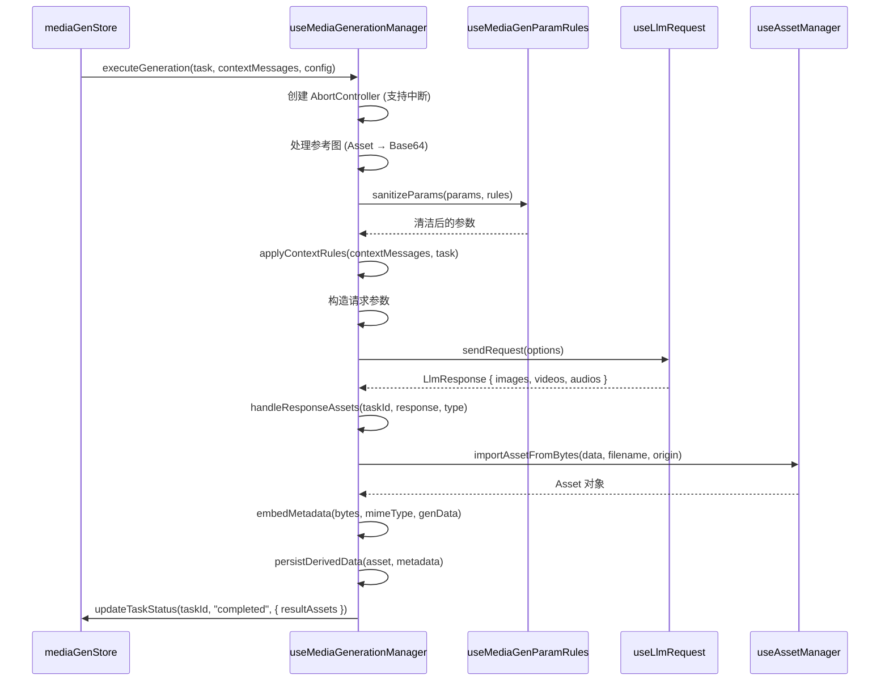
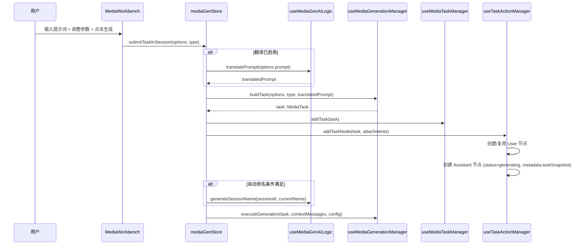
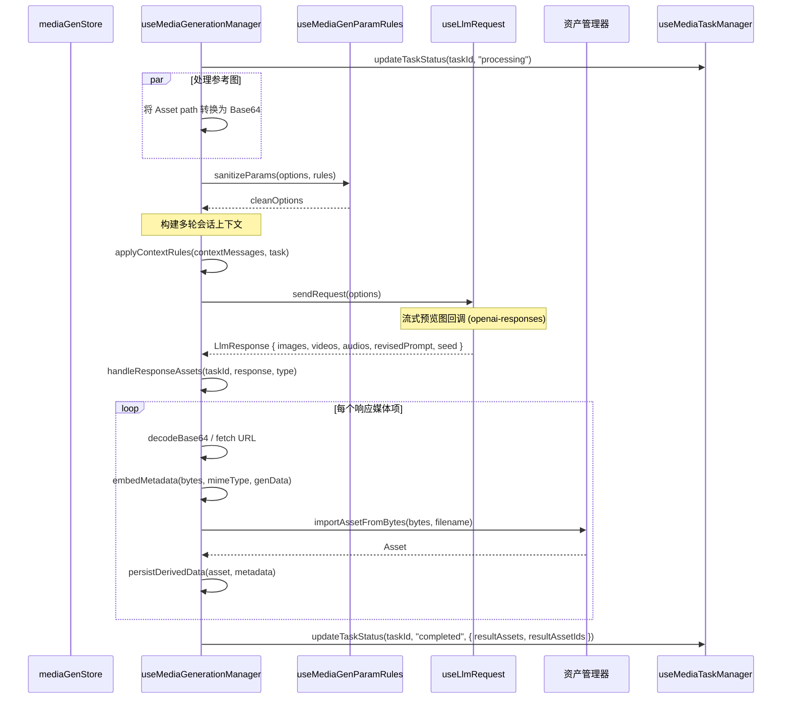
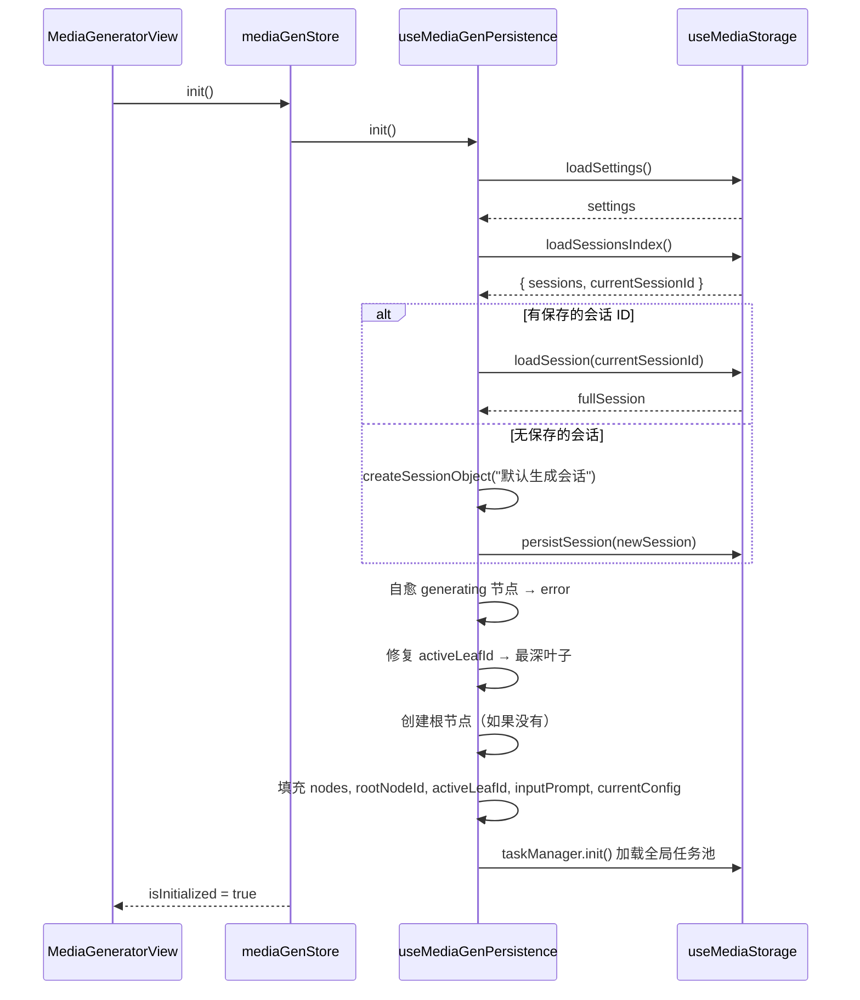
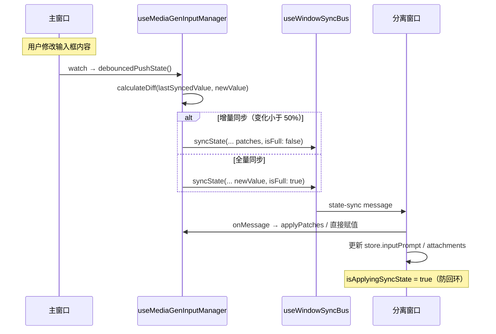

# Media Generator: 架构与开发者指南 (v1)

本文档旨在深入解析 `media-generator` 工具的内部架构、设计理念和数据流，为后续的开发和维护提供清晰的指引。

## 1. 核心概念 (Core Concepts)

`media-generator`（媒体生成中心）是一个基于**会话-任务双轨制**架构的一站式媒体生成工作站。它将"多轮会话交互"与"异步任务执行"两条逻辑线解耦，同时通过树形分支结构管理复杂的生成实验。

### 1.1. 会话与任务双轨架构

系统采用**双轨架构**：一条轨道是**会话树 (Session Tree)**，管理用户与 AI 之间的交互历史，支持分支、重试和上下文选择；另一条轨道是**全局任务池 (Global Task Pool)**，管理所有生成任务的执行状态、进度和结果。

```
用户操作
    │
    ├─→ 会话树 (Session Tree)
    │   ├── 节点 (MediaMessage) — 消息内容、元数据
    │   ├── 分支 (Branch) — 多版本探索
    │   └── 活跃路径 — 当前上下文线
    │
    └─→ 任务池 (Task Pool)
        ├── 任务 (MediaTask) — 生成参数、状态、结果
        ├── 进度追踪 — progress / statusText
        └── 结果资产 — resultAssetIds / resultAssets
```

- **为什么解耦？** 一个任务可能对应会话中的一个 Assistant 节点，但任务的状态管理（进度、中止、重试）需要独立于 UI 状态进行。
- **关联方式**: 通过 `taskSnapshot` 元数据桥接。每次创建任务时，在对应的 Assistant 节点上保存 `metadata.taskSnapshot`（任务参数快照），用于重试时恢复参数。

### 1.2. 树形分支结构 (Branch Tree)

与 `llm-chat` 一致，会话历史采用树形结构而非线性列表：

```
Root (system)
  └─ User: "画一只猫"           ← 分支 A
      ├─ Assistant: [结果 A1]   ← 活跃叶节点
      └─ Assistant: [结果 A2]   ← 分支 B（重新生成）
          └─ User: "加个帽子"   ← 在分支 B 上继续
              └─ Assistant: [结果 B1]
```

- **节点 (Node)**: `MediaMessage`，包含 `id`、`parentId`、`childrenIds`、`lastSelectedChildId`。
- **活跃叶节点**: `activeLeafId` 指向当前正在查看/编辑的路径最深端的节点。
- **分支切换**: 通过 `lastSelectedChildId` 记忆用户在每个父节点下最后一次选择的子节点。
- **重试语义**: `regenerateFromNode` → `createRegenerateBranch` 创建兄弟节点 → 生成新结果。

### 1.3. 全局任务池 (Global Task Pool)

任务池是一个**跨会话的全局单例**，所有任务的创建、更新和移除统一由 `useMediaTaskManager` 管理。

- **持久化**: 任务列表自动保存到 `{appDataDir}/media-generator/tasks.json`，通过 `watch` 监听变化自动防抖保存。
- **状态转换**: `pending → processing → completed | error | cancelled`
- **生命周期**: 从提交生成开始，到生成完成/失败/取消结束。任务完成后保留在池中供 UI 展示，可通过 `autoCleanCompleted` 配置自动清理。

### 1.4. 持久化策略 (Persistence Strategy)

采用**分离式存储**方案，参考 `llm-chat`：

- **索引文件**: `sessions-index.json` — 轻量级列表，快速加载会话概览
- **会话详情文件**: `sessions/{id}.json` — 完整的树形节点数据
- **任务文件**: `tasks.json` — 全局任务池
- **设置文件**: `settings.json` — 用户偏好设置

```
{appDataDir}/media-generator/
├── sessions-index.json          # 会话索引（版本 + 列表 + 当前 ID）
├── tasks.json                   # 全局任务池
├── settings.json                # 用户设置
└── sessions/
    ├── {uuid-1}.json            # 单个会话完整数据
    ├── {uuid-2}.json
    └── ...
```

**索引同步**: 启动时通过 `syncIndex()` 扫描物理文件与索引进行比对，自动补全新增会话、移除已删除会话的索引项。

## 2. 核心业务逻辑 (Core Business Logic)

### 2.1. 生成提交流程

当用户在工作台点击"生成"时：

```
1. 翻译 (可选)
   └─ useMediaGenAILogic.translatePrompt — 将中文提示词翻译为目标语言

2. 构建任务
   └─ useMediaGenerationManager.buildTask — 创建 MediaTask 对象
       ├─ 生成 UUID 作为 taskId
       ├─ 打包所有参数（提示词、模型、尺寸、seed 等）
       └─ 确定是否包含上下文（根据模型能力自动判断）

3. 注册任务
   └─ useMediaTaskManager.addTask — 加入全局任务池

4. 创建节点
   └─ useTaskActionManager.addTaskNode — 在会话树中创建节点
       ├─ 创建/复用 User 节点
       └─ 创建 Assistant 节点（设置 metadata.taskSnapshot）

5. 自动命名 (条件触发)
   └─ useMediaGenAILogic.generateSessionName — 达到阈值后自动生成标题

6. 执行生成
   └─ useMediaGenerationManager.executeGeneration
```

### 2.2. 生成执行流程

`executeGeneration` 是核心方法：



**关键子流程**:

#### 2.2.1. 参数清洁 (Param Sanitization)

`useMediaGenParamRules.sanitizeParams` 根据模型信息中的 `mediaGenParams` 规则：

- 剔除模型不支持的参数（如 `negative_prompt`、`quality`、`style`）
- 校验参数值是否在有效范围内（如 `n` 在 1~10 之间）
- 对 xAI/Gemini 等特殊模型进行参数适配（如 `aspect_ratio` + `resolution` 替代 `size`）

#### 2.2.2. 上下文规则 (Context Rules)

`applyContextRules` 决定哪些历史消息作为多轮上下文的输入：

- **无上下文模式**: 只保留最后一条 User 消息
- **自动上下文模式**: 决定是否包含上一轮的生成结果作为参考图（仅当模型能力支持视觉输入或迭代微调时）
- **手动选择模式**: 使用 `contextMessageIds` 精确指定上下文消息

#### 2.2.3. 资产处理 (Asset Handling)

`handleResponseAssets` 处理 LLM 返回的媒体数据：

1. 提取 `response.images` / `response.videos` / `response.audios`
2. 对每个项目：
   - 解码 `b64_json` 或通过 `url` 获取二进制数据
   - 使用 `embedMetadata` 将生成参数内嵌到文件元数据中
   - 调用 `importAssetFromBytes` 导入资产管理系统
   - 持久化衍生数据到 `derived/media-generator/{date}/{assetId}.json`
3. 更新任务状态，关联结果资产

### 2.3. 重试/分支流

当用户在某个 Assistant 节点上点击"重新生成"：

```
regenerateFromNode(messageId, temporaryModel?)
  ├─ nodeManager.createRegenerateBranch(session, targetNodeId)
  │   ├─ 找到目标节点
  │   ├─ 如果目标是 Assistant → 找到其父 User 节点
  │   ├─ 如果目标是 User → 直接使用该节点
  │   └─ 在用户节点下创建新的 Assistant 节点 (status: "generating")
  │
  ├─ taskActionManager.getRetryParams(messageId)
  │   └─ 从 taskSnapshot 恢复参数
  │
  ├─ mediaGenerationManager.buildTask(options, type)
  │   └─ 复用参数，但 taskId = assistantNode.id
  │
  └─ mediaGenerationManager.startGenerationWithTask(task)
      └─ 直接调用 executeGeneration(task)
```

### 2.4. 会话切换流程

```
switchSession(sessionId)
  ├─ 检查 sessionDetailMap，如果详情未加载
  │   └─ storage.loadSessionDetail(sessionId) — 按需加载
  ├─ 填充：nodes / rootNodeId / activeLeafId / inputPrompt / currentConfig
  ├─ 不自动持久化（仅更新索引中的当前会话 ID）
  └─ 触发 UI 重渲染
```

### 2.5. 初始化与自愈 (Self-Healing)

初始化时，`useMediaGenPersistence.init()` 执行以下自愈逻辑：

1. **Stale Generating 节点修复**: 加载时如果检测到 `status === "generating"` 的节点（上次应用崩溃/重启遗留），自动将其标记为 `error`。
2. **ActiveLeaf 修复**: 如果 `activeLeafId` 指向中间节点（有子节点的节点），自动修复为最深叶子节点。
3. **根节点自愈**: 如果没有根节点，自动创建一个。
4. **索引同步**: 扫描物理目录与索引文件比对，修复不一致。

运行时，Store 通过 `watch` 持续监控 `generatingNodes` 与 `nodes` 的对应关系，一旦检测到任务已完成但节点仍处于 "generating" 状态的"僵死节点"，自动修复其状态。

## 3. 架构概览

### 3.1. 分层架构

```mermaid
graph TD
    subgraph UI Layer[UI 层 - Vue Components]
        MediaGeneratorView
        MediaWorkbench
        MediaGenerationInput
        MediaGenerationInputToolbar
        ParameterPanel
        MediaTaskList
        MediaGallery
        MediaSettings
        SessionManager
        QuickTaskView
        AssetGallery
        GenerationStream
        GenerationInfoDialog
        subgraph Message[消息组件组]
            MessageList
            ChatMessage
            MessageContent
            MessageHeader
            MessageMenubar
            BranchSelector
            ExportBranchDialog
            MessageDataEditor
        end
    end

    subgraph State Layer[状态层 - Pinia Store]
        mediaGenStore
    end

    subgraph Logic Layer[逻辑层 - Composables]
        useNodeManager
        useBranchManager
        useSessionManager
        useTaskActionManager
        useMediaGenerationManager
        useMediaTaskManager
        useMediaGenInputManager
        useAttachmentManager
        useMediaGenParamRules
        useMediaExportManager
        useInputResize
        useGenerationInfoViewer

        subgraph Logic[逻辑子模块]
            useMediaGenAILogic
            useMediaGenBatchMode
            useMediaGenPersistence
        end
    end

    subgraph Service Layer[服务层 - Services]
        useMediaStorage
    end

    subgraph Resource Layer[资源层 - Tauri API & 物理文件]
        PhysicalFiles[物理文件系统]
        LlmApis[LLM API 请求]
        AssetManager[资产管理器]
    end

    UI Layer --> State Layer
    UI Layer --> Logic Layer
    State Layer --> Logic Layer
    State Layer --> Service Layer
    Service Layer --> Resource Layer
    Logic Layer --> Resource Layer
```

### 3.2. 核心角色与职责

#### 3.2.1. Pinia Store: `mediaGenStore`

**核心业务状态的中心管理者**。负责编排所有会话管理、任务管理、节点操作和持久化。

- **状态**:
  - `sessionIndexMap` / `sessionDetailMap`: 会话索引和详情 Map
  - `nodes`: 当前会话的节点池
  - `rootNodeId`: 根节点 ID
  - `activeLeafId`: 当前活跃叶节点 ID
  - `tasks`: 全局任务列表
  - `settings`: 用户配置
  - `currentConfig`: 当前生成配置（类型、参数等）
  - `inputPrompt`: 输入框内容
  - `attachments`: 输入框附件（通过 `useAttachmentManager` 委托暴露，Store 自身不持独立的附件 ref）

- **职责**:
  - 协调 `useMediaPersistence`、`useSessionManager`、`useNodeManager`、`useTaskActionManager` 等模块
  - 提供高级操作 API（`submitTaskInSession`、`regenerateFromNode`、`switchSession`、`saveToBranch` 等）
  - 维护状态自愈 (watch 僵死节点修复)

#### 3.2.2. `useNodeManager` (节点管理器)

**纯树形节点操作逻辑的封装**。不包含任何业务逻辑，只负责节点的增删改查和路径计算。

- **能力**: 创建节点、添加到会话树、硬删除（级联删除子节点）、获取路径、寻找最深叶子、创建重试分支
- **关键方法**:
  - `createNode(config)`: 创建节点对象
  - `addNodeToSession(session, node)`: 添加节点到会话树（更新父子关系）
  - `hardDeleteNode(session, nodeId)`: 硬删除节点及所有子节点
  - `getNodePath(session, nodeId)`: 获取根节点到指定节点的路径
  - `findDeepestLeaf(session, nodeId)`: 寻找最深叶子节点（遵循 `lastSelectedChildId`）
  - `createRegenerateBranch(session, targetNodeId)`: 创建重新生成分支

#### 3.2.3. `useBranchManager` (分支管理器)

**用户交互层面的树结构操作**。负责编辑、删除、切换分支等业务语义的操作。

- **能力**: 删除消息、切换分支、编辑消息、复制分支、获取兄弟节点
- **注意**: `createBranch` 仅执行"复制语义"——创建源节点的副本，不再自动触发重试

#### 3.2.4. `useMediaGenerationManager` (核心生成引擎)

**媒体生成的核心业务引擎**。负责任务构建、参数处理、请求发送和结果处理。

- **能力**:
  - `buildTask(options, type, translatedPrompt?)`: 构建任务对象（纯函数）
  - `executeGeneration(task, contextMessages?, config?)`: 执行生成（核心方法）
  - `startGenerationWithTask(task)`: 直接从现有 Task 启动（用于重试）
  - `abortTask(taskId)` / `abortAll()`: 中止生成
  - `handleResponseAssets(taskId, response, type)`: 处理响应资产

#### 3.2.5. `useMediaTaskManager` (任务池管理器)

**全局任务池的单例管理器**。所有任务的生命周期统一在此管理。

- **全局单例**: `globalTasks` 是一个模块级 `ref`，确保跨组件共享
- **自动持久化**: 通过 `watch(globalTasks, ...)` 自动触发防抖保存
- **能力**: 添加/更新/移除/获取任务、统计信息

#### 3.2.6. `useMediaGenInputManager` (输入管理器)

**输入框状态管理及跨窗口同步**。采用单例模式（`getOrCreateInstance`），管理输入内容、附件和跨窗口状态同步。

- **跨窗口同步**: 通过 `useStateSyncEngine` 和 `useWindowSyncBus` 实现增量/全量同步
  - 使用 `calculateDiff`/`applyPatches` 做增量同步
  - 使用 `VersionGenerator` 防止旧版本覆盖新版本
  - 支持防抖推送（100ms）

#### 3.2.7. `useMediaStorage` (持久化存储)

**文件系统存储层**。所有文件读写操作集中于此。

- **配置管理器**: 使用 `createConfigManager`（带版本支持的 JSON 配置管理器）管理索引、任务、设置
- **会话管理**: 独立的 `loadSession`/`saveSession`/`deleteSession`
- **索引同步**: `syncIndex()` 保证物理文件与索引的一致性

#### 3.2.8. `useSessionManager` (会话管理器)

**会话 CRUD 业务的封装**。负责创建会话对象、加载会话列表、持久化会话。

- **能力**:
  - `createSessionObject(name?)`: 创建全新的会话对象（包括根节点）
  - `createDefaultTypeConfig()`: 创建默认的媒体类型配置模板
  - `loadSessionsIndex()`: 加载轻量级索引
  - `persistSession(session)`: 持久化单个会话

#### 3.2.9. `useTaskActionManager` (任务-节点关联器)

**任务与节点的桥接层**。负责创建任务节点（同时操作任务池和会话树），以及提取重试参数。

- **能力**:
  - `addTaskNode(task, attachments)`: 在会话树中创建 User 和 Assistant 节点，同时注册任务
  - `getRetryParams(messageId)`: 从现有节点的 `taskSnapshot` 恢复重试参数

#### 3.2.10. AI 辅助逻辑 (`useMediaGenAILogic`)

**AI 辅助功能的封装**。包括会话自动命名和提示词翻译。

- `generateSessionName(sessionId, currentName)`: 提取活跃路径的上下文，调用 LLM 生成标题
- `translatePrompt(text, targetLang?)`: 调用 LLM 翻译提示词（失败回退到原文）

#### 3.2.11. 持久化编排 (`useMediaGenPersistence`)

**持久化逻辑的编排者**。负责初始化加载、手动触发持久化、以及通过 `watch` 自动监听保存。

- **初始化自愈**: `init()` 方法中包含完整的自愈逻辑
- **防抖保存**: 输入和配置变化通过 `watch` 自动触发 `debouncedPersist`（Store 层 1 秒防抖）。注意 `useMediaStorage` 内部还有一层独立的 2 秒防抖（`debouncedPersist`），形成双层防抖设计。
- **设置自动保存**: 设置变化通过独立的 `watch` 自动保存

### 3.3. Agent 集成

`media-generator.registry.ts` 通过 `ToolRegistry` 接口向 AI Agent 暴露能力。

**已实现的方法：**

| 方法名              | 功能                   | 参数                  |
| ------------------- | ---------------------- | --------------------- |
| `addContentToInput` | 向输入框添加内容       | `content`, `options?` |
| `setInputContent`   | 设置输入框内容（覆盖） | `content`             |
| `addAssets`         | 批量添加附件           | `assets`              |

**注意**: `generateMedia(prompt, type)` 方法在 `getMetadata()` 中有声明但**尚未实现**——它是前一个服务系统（已废弃）留下的占位。在迁移到新的 Agent 工具系统之前，Agent 无法通过此方法直接触发生成，需通过 Store 暴露的其他入口间接完成。

此外，通过 `getAssetSidecarActions` 在资产管理器中注册了"查看生成参数"的右键操作：

1. 从 `asset.metadata.derived["generation"]` 获取生成数据（优先）
2. 如果无衍生数据，尝试从文件内嵌元数据中提取（通过 `extractMetadata`）
3. 弹出 `GenerationInfoDialog` 展示

## 4. 存储架构 (Storage Architecture)

### 4.1. 物理存储布局

```
{appDataDir}/media-generator/
├── sessions-index.json        # 会话索引（轻量级）
│   {
│     "version": "1.0.0",
│     "currentSessionId": "uuid-xxxx",
│     "sessions": [
│       { "id": "uuid-1", "name": "猫咪生成", "taskCount": 3, ... },
│       ...
│     ]
│   }
│
├── tasks.json                 # 全局任务池
│   {
│     "version": "1.0.0",
│     "tasks": [ ... MediaTask[] ... ]
│   }
│
├── settings.json              # 用户设置
│   {
│     "version": "1.0.0",
│     "data": { ... MediaGeneratorSettings ... }
│   }
│
└── sessions/
    ├── {session-uuid-1}.json  # 完整会话数据
    ├── {session-uuid-2}.json
    └── ...
```

### 4.2. 会话文件结构

```typescript
interface GenerationSession {
  // 索引部分 (MediaSessionIndexItem)
  id: string;
  name: string;
  createdAt: string;
  updatedAt: string;
  taskCount: number;

  // 详情部分 (GenerationSessionDetail)
  type: "media-gen";
  generationConfig: {
    activeType: "image" | "video" | "audio";
    includeContext: boolean;
    types: Record<MediaTaskType, MediaTypeConfig>;
  };
  nodes: Record<string, MediaMessage>; // 节点池
  rootNodeId: string; // 根节点 ID
  activeLeafId: string; // 活跃叶节点 ID
  inputPrompt?: string; // 输入框草稿
  history?: any[]; // 历史记录栈（不持久化）
  historyIndex?: number;
}
```

### 4.3. 索引同步机制

`useMediaStorage.syncIndex()` 负责保证索引与物理文件的一致性（通过 `loadSessionsIndex()` 间接触发）：

1. 扫描 `sessions/` 目录获取所有物理文件 ID
2. 与索引中的 ID 列表比对
3. 新增文件 → 加载并创建索引项
4. 已删除文件 → 从索引中移除
5. 重新保存索引

> 调用路径: `useSessionManager.loadSessionsIndex()` → `storage.loadSessionsIndex()` → 内部调用 `syncIndex(index)`

## 5. 配置体系 (Configuration System)

### 5.1. 配置分区

| 分区       | 说明                                                 |
| ---------- | ---------------------------------------------------- |
| 界面与交互 | 自动打开资产、左侧/右侧面板折叠                      |
| 话题命名   | 自动命名模型、提示词、温度、触发阈值                 |
| 提示词优化 | 优化模型、按媒体类型区分的提示词、温度、输出上限     |
| 任务与并发 | 最大并发数、自动清理、超时、重试、自动关联上一轮结果 |
| 发送前翻译 | 翻译开关、目标语言、翻译提示词                       |
| 通知设置   | 任务完成通知                                         |

### 5.2. 配置持久化

- 用户配置保存到 `{appDataDir}/media-generator/settings.json`（通过 `createConfigManager` 管理）
- 每个会话的 `generationConfig` 保存到会话文件中
- 设置变化通过 `watch` 自动触发防抖保存

## 6. 关键类型定义 (Key Types)

### 6.1. 会话相关

- **`MediaSessionIndexItem`**: 会话索引项
  - `id`, `name`, `createdAt`, `updatedAt`: 基础信息
  - `taskCount`: 关联的媒体任务数

- **`GenerationSessionDetail`**: 会话详情（重型）
  - `type`: `"media-gen"`（标记类型）
  - `generationConfig`: 媒体生成专属配置
  - `nodes`: 节点池
  - `rootNodeId`: 根节点 ID
  - `activeLeafId`: 当前活跃叶节点 ID
  - `inputPrompt`: 输入框草稿

- **`GenerationSession`**: 完整会话（= `MediaSessionIndexItem` + `GenerationSessionDetail`）

### 6.2. 节点相关

- **`MediaMessage`**: 消息节点（继承自 `ChatMessageNode`）
  - `id`, `parentId`, `childrenIds`, `lastSelectedChildId`: 树形结构
  - `role`: `"user" | "assistant" | "system"`
  - `content`: 消息内容
  - `status`: `"complete" | "generating" | "error"`
  - `isSelected`: 批量模式选中状态
  - `metadata.taskId?`: 关联的任务 ID
  - `metadata.isMediaTask?`: 是否为媒体生成任务节点
  - `metadata.taskSnapshot?`: 任务快照（用于重试）
  - `metadata.translatedContent?`: 翻译后的提示词

### 6.3. 任务相关

- **`MediaTask`**: 媒体生成任务
  - `id`, `sessionId?`: 标识
  - `type`: `"image" | "video" | "speech" | "music"`: 媒体类型
  - `status`: `"pending" | "processing" | "completed" | "error" | "cancelled"`
  - `input`: 输入参数（prompt, negativePrompt, modelId, profileId, params, referenceAssetIds, inputAttachments, contextMessageIds, includeContext 等）
  - `progress`, `statusText`, `error`: 进度追踪
  - `resultAssetIds`, `resultAssets`, `previewUrls`: 结果关联

### 6.4. 配置相关

- **`MediaGenerationConfig`**: 媒体生成配置
  - `activeType`: 当前选中的媒体类型
  - `includeContext`: 是否包含上下文
  - `types`: 各类型独立的配置（`MediaTypeConfig`）

- **`MediaTypeConfig`**: 特定媒体类型的配置
  - `modelCombo`: 模型组合（`profileId:modelId`）
  - `params`: 模型参数（size, quality, style, seed, steps 等）

- **`LlmTaskConfig`**: LLM 辅助任务基础配置（命名/翻译/优化）
  - `modelCombo`, `prompt`, `temperature`, `maxTokens`

- **`PromptOptimizationConfig`**: 提示词优化配置
  - 继承 `LlmTaskConfig`
  - `promptsByType`: 按 `image` / `video` / `speech` / `music` 区分的优化模板

### 6.5. 生成信息

- **`AssetGenerationInfo`**: 存储在资产衍生数据中的生成信息
  - `taskId`, `prompt`, `negativePrompt`, `modelId`, `params`
  - `seed?`, `sourceModule`, `timestamp`

## 7. 数据流 (Data Flow)

### 7.1. 生成提交流



### 7.2. 生成执行流



### 7.3. 会话切换与初始化流



### 7.4. 跨窗口同步流



## 8. Diff 引擎 (N/A)

`media-generator` 不包含类似 `canvas` 的 Search/Replace Diff 引擎。其核心数据操作方式为：

- **树形节点操作**: 通过 `useNodeManager` / `useBranchManager` 操作节点树
- **任务参数**: 通过 `MediaTask.input.params` 传递完整参数快照
- **状态管理**: 通过 Pinia Store 统一管理状态，不同于 `canvas` 的 Physical-First 架构

## 9. 数据持久化 (Data Persistence)

| 数据类型 | 存储位置                                      | 格式 | 读写时机                            |
| -------- | --------------------------------------------- | ---- | ----------------------------------- |
| 会话索引 | `AppData/media-generator/sessions-index.json` | JSON | 启动时加载，增删改时更新            |
| 会话详情 | `AppData/media-generator/sessions/{id}.json`  | JSON | 按需加载（切换会话时），保存时写入  |
| 全局任务 | `AppData/media-generator/tasks.json`          | JSON | 启动时加载，通过 watch 自动防抖保存 |
| 用户配置 | `AppData/media-generator/settings.json`       | JSON | 启动时加载，通过 watch 自动防抖保存 |
| 输入状态 | 内存 (localStorage 无直接持久化)              | -    | 通过跨窗口同步引擎同步              |
| 附件     | 内存                                          | -    | 与输入状态一致，跨窗口同步          |
