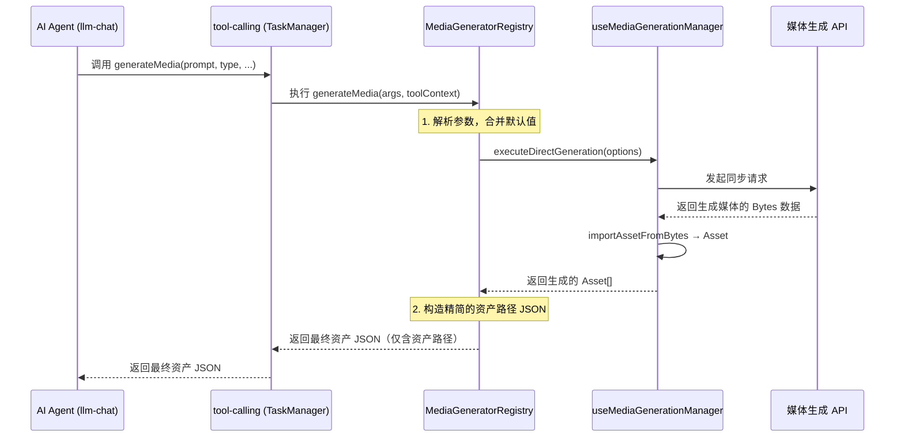
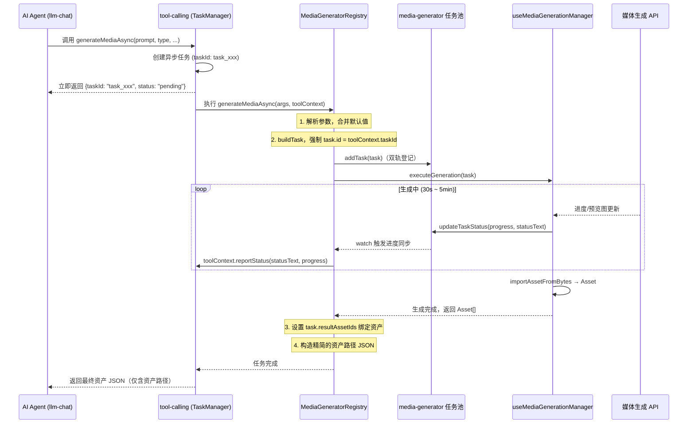

# 媒体生成中心 Agent 调用与双轨任务设计方案

> 状态: Draft | 2026-06-06（修订 2026-06-06：新增 Agent 集成配置设计）

## 1. 设计目标与原则

1. **双轨任务同步（异步模式）**：媒体生成通常是长耗时任务（尤其是视频和音频，或高质量图像），必须设计为**异步任务模式 (`executionMode: 'async'`)**。任务启动后，既要登记在 `tool-calling` 的全局异步任务池中，也要登记在 `media-generator` 自身的任务池中，确保用户在媒体生成中心 UI 界面和聊天界面都能实时看到进度。
2. **快速同步响应（同步模式）**：对于支持快速出图的模型（如 `z-image-turbo`、`sdxl-turbo` 等几秒内即可完成的快速模型），提供**同步任务模式 (`executionMode: 'sync'`)**。Agent 调用后直接等待其生成完毕并返回资产路径，无需创建后台异步任务，极大提升交互流畅度。
3. **参数自适应与发现**：Agent 必须能够动态查询当前系统中有哪些可用的媒体生成模型（如 DALL-E 3, Midjourney, Kling, Suno, z-image-turbo 等）以及它们支持的参数（尺寸、质量、步数等），避免瞎猜参数。
4. **资产闭环展示**：生成完成后，系统将媒体文件导入资产管理器，返回带有 `appdata://` 协议的资产路径。Agent 将基于全局视觉指南（`visualGuidelinePresets`）自主决定包装与展示方式，从而在聊天气泡中直接渲染出生成的图片、视频或音频。

---

## 2. Agent 方法设计 (API Specification)

在 [`media-generator.registry.ts`](../../media-generator.registry.ts) 中实现 `getMetadata()`，向 Agent 暴露以下三个核心方法：

### 方法一：`getAvailableModels`

| 字段              | 内容                                                            |
| ----------------- | --------------------------------------------------------------- |
| **用途**          | 让 Agent 查询当前系统启用的、支持媒体生成的模型列表及其参数规则 |
| **执行模式**      | `sync`                                                          |
| **agentCallable** | `true`                                                          |

**参数：**

| 参数名 | 类型   | 必填 | 说明                                                                 |
| ------ | ------ | ---- | -------------------------------------------------------------------- |
| `type` | string | 否   | 媒体类型过滤，可选值 `"image" \| "video" \| "audio"`。不传则返回全部 |

**返回值：** JSON 字符串，包含可用模型列表及每个模型支持的参数 Schema 和/或文字说明。

- `params`：从模型元数据 `mediaGenParams` 自动生成的结构化参数约束（有则包含，用于参数合法性过滤）。
- `paramNotes`：用户在 Agent 集成设置中手写的 Markdown 参数说明文本（有则包含，供 Agent 直接阅读理解）。

两者独立，可以并存：前者管机器校验，后者管 Agent 理解。

```json
{
  "models": [
    {
      "profileId": "profile-openai-01",
      "profileName": "OpenAI",
      "modelId": "dall-e-3",
      "modelName": "DALL-E 3",
      "type": "image",
      "params": {
        "size": {
          "mode": "preset",
          "default": "1024x1024",
          "presets": [
            { "label": "正方形 1024×1024", "value": "1024x1024" },
            { "label": "横版 1792×1024", "value": "1792x1024" },
            { "label": "竖版 1024×1792", "value": "1024x1792" }
          ]
        }
      },
      "paramNotes": "- **quality**: 图像质量，可选 `standard`（默认）或 `hd`\n- **style**: 风格，可选 `vivid` 或 `natural`"
    },
    {
      "profileId": "profile-siliconflow-01",
      "profileName": "SiliconFlow",
      "modelId": "z-image-turbo",
      "modelName": "Z-Image Turbo",
      "type": "image",
      "isFast": true,
      "params": {
        "size": {
          "mode": "preset",
          "default": "1024x1024",
          "presets": [{ "label": "正方形 1024×1024", "value": "1024x1024" }]
        }
      }
    }
  ]
}
```

---

### 方法二：`generateMedia` (同步快速生成)

| 字段              | 内容                                                                |
| ----------------- | ------------------------------------------------------------------- |
| **用途**          | 触发图片、视频或音频的快速同步生成（适用于几秒内出图的 Turbo 模型） |
| **执行模式**      | `sync`（直接等待接口返回，适合快速响应）                            |
| **agentCallable** | `true`                                                              |

**参数：**

| 参数名      | 类型   | 必填 | 说明                                                |
| ----------- | ------ | ---- | --------------------------------------------------- |
| `prompt`    | string | 是   | 提示词。支持中文，系统会按设置决定是否在发送前翻译  |
| `type`      | string | 是   | 媒体类型，可选值 `"image" \| "video" \| "audio"`    |
| `modelId`   | string | 否   | 目标模型 ID。不传则使用当前会话或系统默认配置的模型 |
| `profileId` | string | 否   | 渠道配置 ID。不传则使用当前会话或系统默认配置的渠道 |
| `params`    | string | 否   | JSON 格式的额外参数，如 `{"size":"1024x1024"}`      |

**返回值：** 生成完成后的资产 JSON 字符串（包含 `appdata://` 路径）。

---

### 方法三：`generateMediaAsync` (异步长耗时生成)

| 字段              | 内容                                                              |
| ----------------- | ----------------------------------------------------------------- |
| **用途**          | 触发图片、视频或音频的长耗时异步生成                              |
| **执行模式**      | `async`（长耗时，支持进度上报、取消、重启自愈）                   |
| **agentCallable** | `true`                                                            |
| **asyncConfig**   | `{ hasProgress: true, cancellable: true, estimatedDuration: 60 }` |

**参数：**

| 参数名      | 类型   | 必填 | 说明                                                          |
| ----------- | ------ | ---- | ------------------------------------------------------------- |
| `prompt`    | string | 是   | 提示词。支持中文，系统会按设置决定是否在发送前翻译            |
| `type`      | string | 是   | 媒体类型，可选值 `"image" \| "video" \| "audio"`              |
| `modelId`   | string | 否   | 目标模型 ID。不传则使用当前会话或系统默认配置的模型           |
| `profileId` | string | 否   | 渠道配置 ID。不传则使用当前会话或系统默认配置的渠道           |
| `params`    | string | 否   | JSON 格式的额外参数，如 `{"size":"1024x1024","quality":"hd"}` |

**返回值：** 立即返回任务 ID 信息的 JSON 字符串。

---

## 3. 核心数据流与双轨同步机制

### 3.1 同步快速生成数据流 (`generateMedia`)



### 3.2 异步长耗时生成数据流 (`generateMediaAsync`)



### 双轨同步关键点：

1. **ID 绑定**：`generateMediaAsync` 内部，新构建的 `MediaTask.id` 强制设为 `toolContext.taskId`，使两端任务池 ID 完全一致。
2. **进度桥接**：通过 `watch` 监听 `useMediaTaskManager` 中该任务的 `progress` 和 `statusText` 变化，实时调用 `toolContext.reportStatus`。
3. **资产绑定**：异步任务完成时，必须将生成的资产 ID 写入 `task.resultAssetIds`，以便 `async-task-processor` 自动通过 `sharedData` 传递给 `asset-resolver` 进行会话附件绑定。
4. **生命周期一致**：任务完成（completed/error）时，停止监听，向 `tool-calling` 返回最终结果；任务取消时，将 `AbortError` 向上抛出，由 `tool-calling` 框架处理。

---

## 4. 资产展示与回调提示设计

### 任务完成时的返回格式：

```json
{
  "success": true,
  "taskId": "task_1717643600_abc123", // 同步版本可不含 taskId 或为空
  "type": "image",
  "prompt": "一个在霓虹灯下的赛博朋克城市",
  "assets": ["appdata://assets/generated-task_xxx-0.png"]
}
```

### 设计依据：

- **职责分离**：Tool 只负责返回最核心的资产路径（`appdata://` 协议路径）。
- **Agent 自主渲染**：Agent 已经拥有全局视觉指南（`visualGuidelinePresets`）的知识，知道如何使用 Markdown 渲染图片、使用 `<audio>` 组件渲染音频，或使用 HTML/CSS 包装视频。Agent 会根据返回的资产路径自主发挥，包装成最优雅的卡片或原生组件。
- **资产解析闭环**：通过在任务完成时设置 `task.resultAssetIds`（异步）或直接在同步返回中由 Agent 识别，`async-task-processor` 或 `tool-calling` 框架会自动将资产注入会话上下文，确保资产管理器和聊天附件系统完美联动。

---

## 5. 实施计划

### 步骤零：Agent 集成配置扩展

**背景**：`getAvailableModels` 的数据源不能依赖"元数据是否有 `mediaGenParams`"来隐式决定——元数据的填充质量参差不齐，用户无法感知哪些模型对 Agent 可见，也无法阻止 Agent 调用不希望暴露的模型。需要在媒体生成中心设置里提供显式的可见性配置。

**文件**：`media-generator/types/` 或 `media-generator/composables/useMediaGenSettings.ts`（扩展现有设置类型）

```typescript
// 新增配置结构（合并进 MediaGeneratorSettings）
interface AgentIntegrationConfig {
  /** 可见性模式：blacklist（默认，自动发现 + 排除指定项）或 whitelist（仅显示指定项） */
  visibilityMode: "blacklist" | "whitelist";
  /** 黑名单模型列表（modelCombo 格式：profileId:modelId） */
  blacklistModelList: string[];
  /** 白名单模型列表（modelCombo 格式：profileId:modelId） */
  whitelistModelList: string[];
  /** 参数说明覆盖，key=modelCombo，value=Markdown 文本（叠加到 params Schema 上层）*/
  modelParamNotes: Record<string, string>;
}
```

**UI 位置**：媒体生成中心设置页（`MediaSettings.vue`）新增"Agent 集成"折叠分区。

**UI 内容**：

| 控件           | 功能                                                                                                     |
| -------------- | -------------------------------------------------------------------------------------------------------- |
| Radio/Toggle   | 切换黑名单/白名单模式（仅切换模式状态，两个名单数据各自独立保留，确保内容完好、随意切换）                |
| 模型多选列表   | 根据当前模式，从已配置渠道中选择要排除/包含的模型（编辑对应的 blacklistModelList 或 whitelistModelList） |
| 参数说明编辑区 | 选择一个模型后，展示 Markdown textarea 供用户填写参数覆盖说明                                            |

**黑名单模式语义（默认推荐）**：自动发现所有具有图像/视频/音频生成能力（`capabilities.imageGeneration/videoGeneration/audioGeneration` 为 true，或有 `mediaGenParams`）的模型，排除 `blacklistModelList` 中指定的项。新增模型自动对 Agent 可见，零维护。

**白名单模式语义**：仅向 Agent 暴露 `whitelistModelList` 中的模型。适合需要严格控制调用权限（如防止 Agent 意外使用高成本模型）的场景。

---

### 步骤一：`getAvailableModels` 实现

**文件**：[`media-generator.registry.ts`](../../media-generator.registry.ts)

```
1. 读取 useMediaGenStore().settings.agentConfig（visibilityMode / blacklistModelList / whitelistModelList / modelParamNotes）
2. 根据模式构建候选模型列表：
   - blacklist 模式：遍历 useLlmProfiles().profiles 的所有模型
       过滤条件：capabilities.imageGeneration/videoGeneration/audioGeneration 为 true，或有 mediaGenParams
       排除 blacklistModelList 中的 modelCombo
   - whitelist 模式：
       直接以 whitelistModelList 的 modelCombo 作为候选
       从 useLlmProfiles 补充 profileName 等信息
3. 若传入 type 参数，根据模型能力类型进行二次过滤
4. 对每个候选模型：
   - 从 useModelMetadata().getMatchedProperties(modelId) 读取 mediaGenParams → params（有则包含）
   - 从 modelParamNotes[modelCombo] 读取覆盖文本 → paramNotes（有则包含）
5. 格式化并返回 JSON
```

### 步骤二：`generateMedia` (同步快速生成) 实现

**文件**：[`media-generator.registry.ts`](../../media-generator.registry.ts)

```
1. 解析 params JSON 字符串（容错：解析失败则使用空对象）
2. 读取 modelId / profileId：
   - 若未传入，从 useMediaGenStore().currentConfig.types[type].modelCombo 解析
3. 调用 genManager.executeDirectGeneration(options) 发起同步生成请求
4. 生成完成后，将生成的媒体文件导入资产管理器，获取 Asset[]
5. 构造仅包含 `appdata://` 路径的精简结果 JSON
6. 返回结果字符串
7. 异常处理：捕获错误并返回失败 JSON
```

### 步骤三：`generateMediaAsync` (异步长耗时生成) 实现

**文件**：[`media-generator.registry.ts`](../../media-generator.registry.ts)

```
1. 检查 toolContext.isAsync，非异步模式下提前返回错误
2. 解析 params JSON 字符串（容错：解析失败则使用空对象）
3. 读取 modelId / profileId：
   - 若未传入，从 useMediaGenStore().currentConfig.types[type].modelCombo 解析
4. 调用 genManager.buildTask(options, type) 构建 MediaTask
5. 强制 task.id = toolContext.taskId（双轨 ID 绑定）
6. 调用 useMediaTaskManager().addTask(task) 在媒体生成中心任务池登记
7. 启动 watchEffect，监听任务进度变化：
   - 进度变化 → toolContext.reportStatus(statusText, progress)
   - 完成/失败 → 停止监听
8. 调用 genManager.executeGeneration(task)（await 等待完成）
9. 生成完成后：
   - 从任务池读取 resultAssets
   - 将生成的资产 ID 写入 `task.resultAssetIds`，实现会话附件绑定
   - 构造仅包含 `appdata://` 路径的精简结果 JSON
   - 返回结果字符串
10. 异常处理：AbortError（取消）直接 rethrow；其他错误返回失败 JSON
```

### 步骤四：`getMetadata()` 注册

```typescript
getMetadata(): ServiceMetadata {
  return {
    methods: [
      {
        name: "getAvailableModels",
        displayName: "获取可用媒体生成模型",
        description: "查询当前系统中启用的媒体生成模型列表及其支持的参数规则（尺寸、质量、风格等）。调用生成方法前建议先调用此方法以确认可用参数。",
        parameters: [
          {
            name: "type",
            type: "string",
            description: "媒体类型过滤，可选值: 'image' | 'video' | 'audio'。不传则返回全部",
            required: false,
          },
        ],
        returnType: "string",
        agentCallable: true,
      },
      {
        name: "generateMedia",
        displayName: "快速生成媒体",
        description: "触发图片、视频或音频的快速同步生成。此方法适用于几秒内即可出图的快速模型（如 z-image-turbo 等）。调用后会直接等待生成完毕并返回结果资产路径。",
        parameters: [
          { name: "prompt",    type: "string", description: "提示词。",required: true  },
          { name: "type",      type: "string", description: "媒体类型: 'image' | 'video' | 'audio'",                  required: true  },
          { name: "modelId",   type: "string", description: "模型 ID，不传则使用当前默认配置",                         required: false },
          { name: "profileId", type: "string", description: "渠道配置 ID，不传则使用当前默认配置",                     required: false },
          { name: "params",    type: "string", description: "JSON 格式的额外参数，如 {\"size\":\"1024x1024\"}",        required: false },
        ],
        returnType: "Promise<string>",
        agentCallable: true,
      },
      {
        name: "generateMediaAsync",
        displayName: "异步生成媒体",
        description: "触发图片、视频或音频的长耗时异步生成。这是一个后台异步任务，提交后立即返回任务 ID，生成可能需要 30 秒到数分钟不等。生成完成后的结果将包含资产路径。",
        parameters: [
          { name: "prompt",    type: "string", description: "提示词。",required: true  },
          { name: "type",      type: "string", description: "媒体类型: 'image' | 'video' | 'audio'",                  required: true  },
          { name: "modelId",   type: "string", description: "模型 ID，不传则使用当前默认配置",                         required: false },
          { name: "profileId", type: "string", description: "渠道配置 ID，不传则使用当前默认配置",                     required: false },
          { name: "params",    type: "string", description: "JSON 格式的额外参数，如 {\"size\":\"1024x1024\"}",        required: false },
        ],
        returnType: "Promise<string>",
        agentCallable: true,
        executionMode: "async",
        asyncConfig: {
          hasProgress: true,
          cancellable: true,
          estimatedDuration: 60,
        },
      },
    ],
  };
}
```

---

## 6. 已知约束与注意事项

1. **Composable 调用位置**：`MediaGeneratorRegistry` 是一个普通 Class，不在 Vue 组件上下文中。需要确保在方法执行时（而非在 constructor 中）调用 Composable，避免响应式系统报错。已有代码（`addContentToInput` 等）使用了惰性初始化模式，`generateMedia` 和 `generateMediaAsync` 应遵循相同模式。
2. **tool-calling 默认超时**：`ToolCallConfig.timeout` 默认为 30000ms。由于 `generateMediaAsync` 为异步任务模式（`executionMode: 'async'`），任务提交后立即返回，不受此超时限制。而同步版本 `generateMedia` 需注意如果模型生成时间过长（如超过 30 秒），可能会触发 tool-calling 的超时限制，因此仅推荐用于 Turbo 等快速模型。
3. **媒体生成中心 UI 可能未初始化**：如果用户未打开媒体生成中心，`useMediaGenStore` 的 `init()` 可能未被调用。`generateMediaAsync` 应检查 `useMediaTaskManager` 是否已初始化，必要时调用 `init()`。
4. **结果资产路径**：`importAssetFromBytes` 返回的 Asset 的 `path` 字段格式为相对路径（如 `assets/xxx.png`）。需要通过 `getAssetBasePath()` 或按照项目约定拼接成 `appdata://` 协议的完整路径。
5. **多图场景**：`executeGeneration` 或 `executeDirectGeneration` 可能返回多个资产（如批量生成 4 张图）。`instructions` 应为每个资产生成一行 Markdown，并在最后以 Agent 友好的方式汇总展示。
