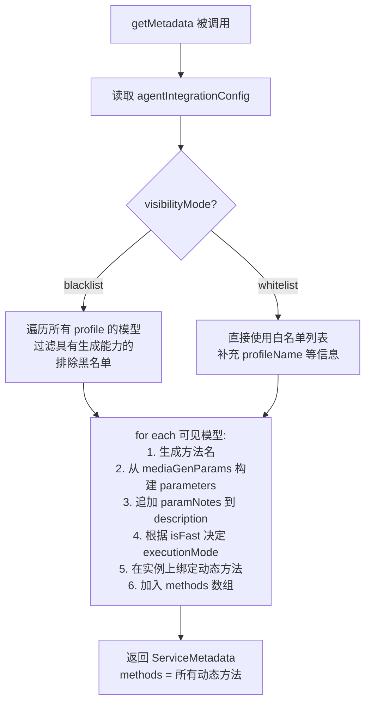
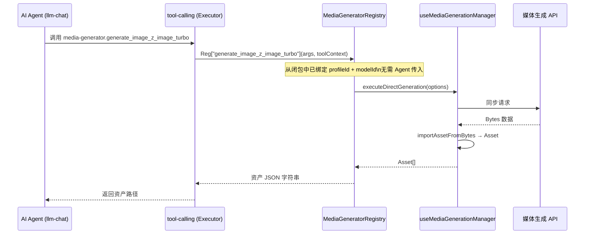
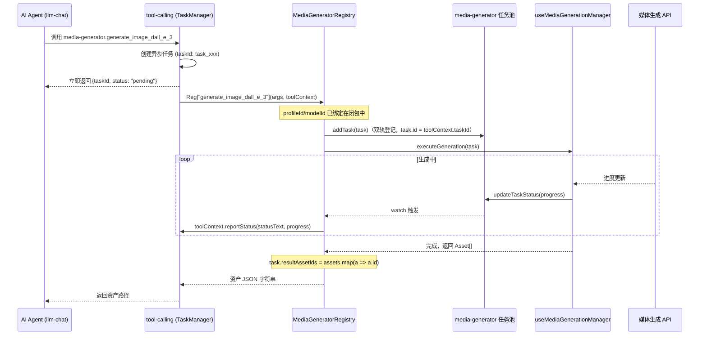

# 媒体生成中心 Agent 调用与双轨任务设计方案

> 状态: Draft（修订版） | 原稿 2026-06-06 | 修订 2026-06-06：采用"动态独立方法"新架构取代原三方法方案

---

## 0. 架构决策：为什么改用"动态独立方法"

### 原方案的问题

原计划暴露三个固定方法：`getAvailableModels` + `generateMedia` + `generateMediaAsync`。

这要求 Agent 必须：

1. **先调用 `getAvailableModels`** 查询当前可用的模型列表
2. **解析返回结果**，从中找到合适的 `modelId` 和 `profileId`
3. **再调用 `generateMedia` 或 `generateMediaAsync`**，将 `modelId`/`profileId` 作为 string 参数传入

问题在于：

- **两步调用**：增加 token 消耗和推理延迟
- **参数易出错**：`modelId` 是 string，Agent 很容易将其记错或瞎猜，特别是同名模型存在于多个 profile 时
- **上下文割裂**：模型的参数 Schema（如 `size` 预设值）在第一步查到，但到第二步调用时可能已脱离上下文

### 新方案：动态独立方法

**核心思想**：把每个启用的模型直接映射为 `registry` 上的一个独立可调用方法。

`getMetadata()` 不再返回固定的三个方法，而是根据当前 Agent 集成设置，**动态生成**对应的方法列表：

```
启用了 dall-e-3  → 方法 generate_image_dall_e_3(prompt, size?, quality?, style?)
启用了 z-image-turbo → 方法 generate_image_z_image_turbo(prompt, size?)
启用了 kling-v1.6 → 方法 generate_video_kling_v1_6(prompt, duration?, aspect_ratio?)
```

Agent 获取工具定义时直接看到这些方法，**一步即可调用，无需查列表**。每个方法的参数已经是该模型真正支持的参数，无需 `modelId`/`profileId`。

### 技术可行性验证

查阅 [`src/services/types.ts`](../../../../../services/types.ts)：

- `ToolRegistry` 有 `[key: string]: any` 索引签名 → 允许在实例上动态挂载方法
- `getMetadata()` 是运行时调用（非静态）→ 每次均可返回不同的方法列表
- 执行器双重校验：`toolInstance[methodName]` 存在 **且** `getMetadata()` 中 `agentCallable: true` → 完全支持动态方法

---

## 1. 设计目标与原则（修订）

1. **Agent 零查询直调**：Agent 获取工具定义时已知所有可用模型及其参数，调用一次即可生成媒体。
2. **参数精准无歧义**：每个方法的参数直接来自对应模型的 `mediaGenParams`，不存在"传错 modelId"的可能。
3. **同步/异步自适应**：快速模型（`isFast`）映射为 `executionMode: 'sync'`，慢速模型映射为 `executionMode: 'async'`，无需 Agent 手动区分两个不同的方法。
4. **双轨任务同步**：异步方法在内部同时向 `media-generator` 任务池和 `tool-calling` 任务池登记，UI 和聊天界面均可实时查看进度。
5. **资产闭环展示**：生成完成后导入资产管理器，返回 `appdata://` 协议路径，Agent 自主决定展示方式。

---

## 2. 动态方法设计规范

### 2.1 方法命名规则

```
generate_{type}_{sanitizedModelId}
```

- `type`：`image` | `video` | `audio`
- `sanitizedModelId`：将 modelId 中的 `-`、`.`、空格等非字母数字字符全部替换为 `_`，并转为小写

若同一 `modelId` 存在于多个 profile，追加 profile 标识以避免冲突：

```
generate_image_dall_e_3           // 只有一个 openai profile 使用 dall-e-3 时
generate_image_dall_e_3_openai2   // 有多个 profile 都配置了 dall-e-3 时
```

### 2.2 动态参数生成

每个方法的 `parameters` 包含：

| 参数         | 来源                                   | 说明                                                   |
| ------------ | -------------------------------------- | ------------------------------------------------------ |
| `prompt`     | 固定                                   | 必填，提示词                                           |
| 模型特有参数 | `mediaGenParams` → `MethodParameter[]` | 自动转换（如 `size` 的 preset 列表写入 `description`） |

`paramNotes`（用户手写的 Markdown 说明）合并写入方法的 `description` 尾部，供 Agent 阅读。

### 2.3 示例：生成的方法元数据

```json
{
  "name": "generate_image_dall_e_3",
  "displayName": "生成图片 (DALL-E 3 · OpenAI)",
  "description": "使用 DALL-E 3 生成图片。\n\n**参数说明**\n- quality: 图像质量，可选 `standard`（默认）或 `hd`\n- style: 风格，可选 `vivid` 或 `natural`",
  "parameters": [
    {
      "name": "prompt",
      "type": "string",
      "required": true,
      "description": "提示词"
    },
    {
      "name": "size",
      "type": "string",
      "required": false,
      "description": "尺寸。可选值: 1024x1024（默认, 正方形）| 1792x1024（横版）| 1024x1792（竖版）",
      "defaultValue": "1024x1024"
    },
    {
      "name": "quality",
      "type": "string",
      "required": false,
      "description": "质量: standard | hd",
      "defaultValue": "standard"
    },
    {
      "name": "style",
      "type": "string",
      "required": false,
      "description": "风格: vivid | natural",
      "defaultValue": "vivid"
    }
  ],
  "returnType": "Promise<string>",
  "agentCallable": true,
  "executionMode": "async",
  "asyncConfig": {
    "hasProgress": true,
    "cancellable": true,
    "estimatedDuration": 30
  }
}
```

快速模型（`isFast: true`）：

```json
{
  "name": "generate_image_z_image_turbo",
  "displayName": "生成图片 (Z-Image Turbo · SiliconFlow)",
  "description": "使用 Z-Image Turbo 快速生成图片（通常 5 秒内完成）。",
  "parameters": [
    {
      "name": "prompt",
      "type": "string",
      "required": true,
      "description": "提示词"
    },
    {
      "name": "size",
      "type": "string",
      "required": false,
      "description": "尺寸。可选值: 1024x1024",
      "defaultValue": "1024x1024"
    }
  ],
  "returnType": "string",
  "agentCallable": true,
  "executionMode": "sync"
}
```

---

## 3. 核心数据流

### 3.1 getMetadata() 动态构建流程



### 3.2 同步快速生成数据流（以 `generate_image_z_image_turbo` 为例）



### 3.3 异步长耗时生成数据流（以 `generate_image_dall_e_3` 为例）



---

## 4. Agent 集成配置设计

**文件**：`media-generator/types/` 或 `media-generator/composables/useMediaGenSettings.ts`（扩展现有设置类型）

```typescript
interface AgentIntegrationConfig {
  /** 可见性模式：blacklist（默认，自动发现 + 排除指定项）或 whitelist（仅显示指定项） */
  visibilityMode: "blacklist" | "whitelist";
  /** 黑名单（modelCombo 格式：profileId:modelId） */
  blacklistModelList: string[];
  /** 白名单（modelCombo 格式：profileId:modelId） */
  whitelistModelList: string[];
  /** 参数说明覆盖，key=modelCombo，value=Markdown 文本（追加到方法 description 末尾）*/
  modelParamNotes: Record<string, string>; /**
   * 快速模型列表（modelCombo 格式：profileId:modelId）
   * 标记为快速的模型将生成 executionMode: 'sync' 的方法（几秒内完成，直接等待结果）。
   * 注意：系统无法自动判断模型速度，需用户手动标注。
   */
  fastModelList: string[];
}
```

**modelCombo 格式**：`profileId:modelId`，与其他配置保持一致。例如 `llm-profile-1717643600-abc123:dall-e-3`。

此配置控制哪些模型会在 `getMetadata()` 中生成对应的独立方法。

**UI 位置**：媒体生成中心设置页（`MediaSettings.vue`）新增"Agent 集成"折叠分区，包含：

- 可见性模式切换（blacklist / whitelist）
- 模型多选列表（编辑黑/白名单）
- 快速模型标注列表（编辑 fastModelList）
- 参数说明编辑区（选模型后写 Markdown）

---

## 5. 任务完成时的返回格式

与原计划一致：

```json
{
  "success": true,
  "taskId": "task_1717643600_abc123",
  "type": "image",
  "prompt": "一个在霓虹灯下的赛博朋克城市",
  "assets": ["appdata://assets/generated-task_xxx-0.png"]
}
```

同步版本 `taskId` 可省略或为空。

---

## 6. 实施计划

### 步骤零：Agent 集成配置扩展

- 在 `MediaGeneratorSettings`（或对应 Store 类型）中合并 `AgentIntegrationConfig`
- 在 `MediaSettings.vue` 新增"Agent 集成"折叠分区（可见性模式切换 + 模型多选列表 + 参数说明编辑区）

### 步骤一：核心工具函数——构建动态方法

**文件**：新建 `media-generator/services/buildAgentMethods.ts`

```
输入: 可见模型列表（经 agentIntegrationConfig 过滤后的 VisibleModel[]）
输出: { methods: MethodMetadata[], handlers: Record<string, Function> }

VisibleModel 结构（内部中间类型）：
  profile: LlmProfile        // 来自 useLlmProfiles().profiles
  model: LlmModelInfo        // profile.models[i]
  mediaType: 'image' | 'video' | 'audio'  // 由 capabilities 决定（见步骤二）
  isFast: boolean            // 来自 agentConfig.fastModelList
  paramNotes?: string        // 来自 agentConfig.modelParamNotes[modelCombo]

1. sanitizeId(id): string
   - 将非字母数字字符替换为 _，转小写，合并连续 _

2. buildMethodName(type, modelId, profileSuffix?): string
   - generate_{type}_{sanitizeId(modelId)}[_{sanitizeId(profileSuffix)}]
   - 冲突检测：同 modelId 跨多 profile 时追加 profile 标识

3. buildParameters(model, mediaGenParams): MethodParameter[]
   - 固定 prompt（必填）
   - 从 getMatchedProperties(model.id, profile.type)?.mediaGenParams 获取规则
     （profile.type 为 ProviderType，如 'openai'、'siliconflow' 等）
   - size.mode='preset' → description 列举 presets；size.mode='free' → description 描述约束
   - aspectRatioMode → 参数名 aspect_ratio，description 列举 ratios
   - quality/style/negativePrompt/seed/steps/guidanceScale/background 等：
     supported: true → 生成对应 MethodParameter；supported: false → 跳过

4. buildDescription(profile, model, mediaType, isFast, paramNotes?): string
   - 基础描述：`使用 {model.name} 生成{mediaType中文}（来自 {profile.name}）{isFast ? '，快速模式，通常几秒完成' : ''}`
   - 若有 paramNotes：追加 `\n\n**额外说明**\n{paramNotes}`

5. buildHandler(profile, model, isFast): Function
   - 闭包捕获 profile.id 和 model.id
   - isFast → 返回同步 handler（调用 executeDirectGeneration）
   - 否则 → 返回异步 handler（调用双轨异步生成流程，见 §3.3）
```

### 步骤二：`getMetadata()` 动态实现

**文件**：[`media-generator.registry.ts`](../../media-generator.registry.ts)

```
1. 读取 agentConfig = useMediaGenStore().settings.agentConfig
2. 构建候选模型列表：
   a. blacklist 模式：遍历 useLlmProfiles().enabledProfiles.value
        遍历 profile.models
        过滤条件（满足其一）：
          - model.capabilities?.imageGeneration === true → mediaType = 'image'
          - model.capabilities?.videoGeneration === true → mediaType = 'video'
          - model.capabilities?.audioGeneration === true或 model.capabilities?.musicGeneration === true → mediaType = 'audio'
        排除 modelCombo（`${profile.id}:${model.id}`）在 blacklistModelList 中的项
   b. whitelist 模式：
      遍历 agentConfig.whitelistModelList（modelCombo 格式）
      通过 getProfileById(profileId) 补充 profile 信息
      通过 profile.models.find(m => m.id === modelId) 获取 model 信息
      根据 model.capabilities 确定 mediaType
3. 对每个候选，查 agentConfig.fastModelList 确定 isFast
4. 调用 buildAgentMethods(candidates) 获取 { methods, handlers }
5. 将 handlers 绑定到 this（覆盖旧绑定）
6. 返回 { methods }
```

**注意**：`getMetadata()` 被调用时需同步更新实例上的动态方法绑定，确保执行器能找到对应的处理函数。

### 步骤三：缓存失效联动

**文件**：[`media-generator.registry.ts`](../../media-generator.registry.ts)

- 监听 `agentIntegrationConfig` 的变更（在 registry 初始化时 watch）
- 配置变更时调用 `useToolCalling().invalidateDiscoveryCache()`，触发 `tool-calling` 重新拉取工具定义 Prompt

### 步骤四：异步生成内核实现

**文件**：[`media-generator.registry.ts`](../../media-generator.registry.ts) 或 `buildAgentMethods.ts`

```
异步 handler 内部流程（同原计划 步骤三，逻辑不变）：
1. 检查 toolContext.isAsync
2. 解析 params JSON 字符串（容错）
3. 读取闭包中的 profileId / modelId（无需从 args 解析）
4. buildTask → task.id = toolContext.taskId（双轨绑定）
5. useMediaTaskManager().addTask(task)
6. watchEffect 监听进度 → toolContext.reportStatus
7. await executeGeneration(task)
8. task.resultAssetIds = assets.map(a => a.id)
9. 返回资产 JSON
10. AbortError → rethrow；其他错误 → 返回失败 JSON
```

---

## 7. 方案对比总结

| 维度             | 原方案（三方法）                 | 新方案（动态独立方法）         |
| ---------------- | -------------------------------- | ------------------------------ |
| Agent 调用步骤   | 先查询列表 → 再调用（至少 2 步） | 直接调用（1 步）               |
| 参数错误风险     | 高（modelId 为任意 string）      | 极低（参数已硬编在方法定义中） |
| Token 消耗       | 高（需先查询）                   | 低                             |
| 新增模型自动感知 | 需先调用 `getAvailableModels`    | 自动出现新方法                 |
| 同步/异步区分    | 需 Agent 手动选择两个方法        | 自动（由 `isFast` 决定）       |
| 实现复杂度       | 低（3 个固定方法）               | 中（动态方法生成与绑定）       |

---

## 8. 已知约束与注意事项

1. **Composable 惰性初始化**：动态 handler 中调用 Composable 时，须在函数执行时（非 `getMetadata` 调用时）访问，避免 Vue 响应式上下文问题。与现有 `inputManager` 的惰性初始化模式一致。
2. **方法命名冲突**：命名冲突仅发生于同 modelId 跨多个 profile，通过追加 profile 标识解决。`sanitizeModelId` 需保证唯一性并做冲突检测。
3. **tool-calling 默认超时（30s）**：异步方法（`executionMode: 'async'`）提交即返回，不受此限制。同步方法仅用于 `isFast` 模型，正常几秒内完成，风险极低。
4. **媒体生成中心 UI 未初始化**：异步 handler 执行前应检查 `useMediaTaskManager` 是否已 init，必要时主动调用。
5. **结果资产路径**：`importAssetFromBytes` 返回相对路径，需通过约定方式拼接 `appdata://` 协议前缀。
6. **多图场景**：`assets` 数组可能包含多项，返回 JSON 中全部列出；Agent 根据视觉指南自行渲染。
7. **`getMetadata()` 副作用**：此方法在绑定动态方法时有副作用，需确保幂等（重复调用不产生问题）。
