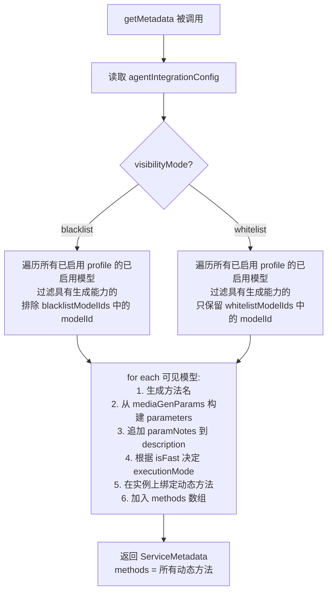
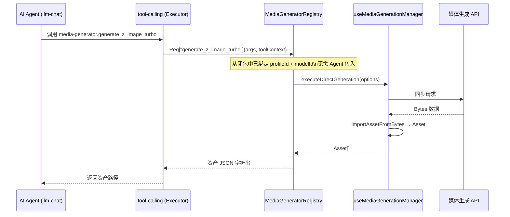
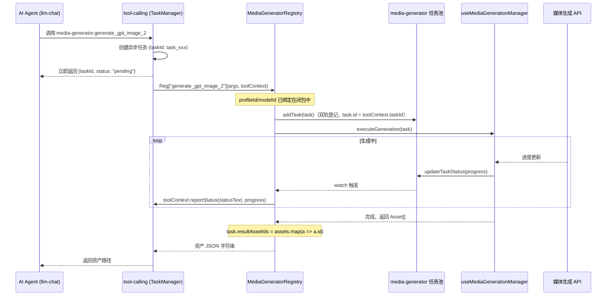

# 媒体生成中心 Agent 调用与双轨任务设计方案

> 状态: Draft（修订版） | 原稿 2026-06-06 | 修订 2026-06-06：采用"动态独立方法"新架构，并支持 Omni 全模态模型（模态参数化）；补充渠道感知策略调研（见 §9）；补充 Agent 集成配置 UI 交互设计（见 §10）；修订 2026-06-06：黑白名单与 fastModelList 改为纯 modelId 格式，渠道控制职责还给渠道配置自身，modelParamNotes key 同步改为 modelId

---

## 0. 架构决策：为什么改用"动态独立方法"与"模态参数化"

### 原方案的问题

原计划暴露三个固定方法：`getAvailableModels` + `generateMedia` + `generateMediaAsync`。
这要求 Agent 必须先查询列表再调用，步骤繁琐且参数极易出错。

### 动态独立方法（第一版）的问题

在第一版动态方法设计中，我们尝试根据模型能力将方法拆分为 `generate_image_xxx`、`generate_video_xxx` 等。
但这在面对 **Qwen2.5-Omni** 等全模态（Omni）模型时会失效：

- 一个全模态模型会被拆分为多个重叠的方法，割裂了模型统一生成的能力。
- 无法优雅地支持在单次调用中由参数控制输出模态。

### 终极方案：动态独立方法 + 模态参数化

**核心思想**：把每个启用的模型直接映射为 `registry` 上的一个独立可调用方法，命名极简为 `generate_{modelId}`。同时，**将生成内容类型（`media_type`）作为参数传入**。

`getMetadata()` 动态生成对应的方法列表：

```
启用了 gpt-image-2 → 方法 generate_gpt_image_2(prompt, media_type?, size?, quality?, background?, output_format?)
启用了 qwen2.5-omni-3b → 方法 generate_qwen2_5_omni_3b(prompt, media_type, size?, duration?)
```

- **极简命名**：直接使用 `generate_{sanitizedModelId}`，省去冗余的中间层。
- **模态参数化**：引入 `media_type` 参数。对于单模态模型，此参数为可选并带默认值；对于 Omni 全模态模型，此参数为必填，可选值（`enum`）根据模型能力动态计算。

Agent 获取工具定义时直接看到这些方法，**一步即可调用，无需查列表**。每个方法的参数已经是该模型真正支持的参数，无需 `modelId`/`profileId`。

### 技术可行性验证

查阅 [`src/services/types.ts`](../../../../../services/types.ts)：

- `ToolRegistry` 有 `[key: string]: any` 索引签名 → 允许在实例上动态挂载方法
- `getMetadata()` 是运行时调用（非静态）→ 每次均可返回不同的方法列表
- 执行器双重校验：`toolInstance[methodName]` 存在 **且** `getMetadata()` 中 `agentCallable: true` → 完全支持动态方法

---

## 1. 设计目标与原则（修订）

1. **Agent 零查询直调**：Agent 获取工具定义时已知所有可用模型及其参数，调用一次即可生成媒体。
2. **参数精准无歧义**：每个方法的参数直接来自对应模型的 `mediaGenParams`，不存在"传错 modelId"的可能。
3. **全模态与 Omni 支持**：通过 `media_type` 参数支持全模态模型（如 Qwen2.5-Omni），避免为同一模型生成多个冗余方法。
4. **同步/异步自适应**：快速模型（`isFast`）映射为 `executionMode: 'sync'`，慢速模型映射为 `executionMode: 'async'`，无需 Agent 手动区分两个不同的方法。
5. **双轨任务同步**：异步方法在内部同时向 `media-generator` 任务池和 `tool-calling` 任务池登记，UI 和聊天界面均可实时查看进度。
6. **资产闭环展示**：生成完成后导入资产管理器，返回 `appdata://` 协议路径，Agent 自主决定展示方式。

---

## 2. 动态方法设计规范

### 2.1 方法命名规则

```
generate_{sanitizedModelId}
```

- `sanitizedModelId`：将 modelId 中的 `-`、`.`、空格等非字母数字字符全部替换为 `_`，并转为小写。

**渠道对 Agent 透明**：无论同一 `modelId` 存在于多少个 profile，始终只生成一个方法。内部路由策略见 §9。

```
generate_gpt_image_2   // 无论有几个 profile 配了 gpt-image-2，Agent 只见到这一个方法
```

> ⚠️ 原方案中"追加 profile 标识"的处理（`generate_gpt_image_2_openai2`）已废弃。
> 渠道名是用户任意填写的基础设施配置，对 Agent 无语义，暴露它只会产生 Agent 无法理解的方法名差异，且用户改渠道名即破坏调用。

### 2.2 动态参数生成

每个方法的 `parameters` 包含：

| 参数         | 来源                                   | 说明                                                                                                  |
| ------------ | -------------------------------------- | ----------------------------------------------------------------------------------------------------- |
| `prompt`     | 固定                                   | 必填，提示词                                                                                          |
| `media_type` | 动态计算                               | 媒体类型。单模态模型为可选（带默认值），多模态/Omni 模型为必填。可选值: `image` \| `video` \| `audio` |
| 模型特有参数 | `mediaGenParams` → `MethodParameter[]` | 自动转换（如 `size` 的 preset 列表写入 `description`，并注明适用的 `media_type`）                     |

`paramNotes`（用户手写的 Markdown 说明）合并写入方法的 `description` 尾部，供 Agent 阅读。

### 2.3 示例：生成的方法元数据

#### 示例 A：单模态模型（GPT Image 2，仅支持生图）

```json
{
  "name": "generate_gpt_image_2",
  "displayName": "生成媒体 (GPT Image 2 · OpenAI)",
  "description": "使用 GPT Image 2 生成图片。支持超高分辨率（最高 4K）、自由尺寸（步长 16）和批量生成（最多 4 张）。\n\n**参数说明**\n- size: 预设或自定义尺寸（最大 3840×3840，像素上限 8.29M），默认 auto\n- quality: `low` / `medium` / `high` / `auto`（默认）\n- background: `opaque`（不透明）/ `auto`（默认，模型自动决定）；注意此模型不支持透明背景\n- output_format: `png`（默认）/ `jpeg` / `webp`\n- moderation: 内容审核强度，`auto`（默认）/ `low`（宽松）",
  "parameters": [
    {
      "name": "prompt",
      "type": "string",
      "required": true,
      "description": "提示词"
    },
    {
      "name": "media_type",
      "type": "string",
      "required": false,
      "description": "生成的媒体类型。此模型仅支持生成图片。",
      "defaultValue": "image",
      "enum": ["image"]
    },
    {
      "name": "size",
      "type": "string",
      "required": false,
      "description": "尺寸。预设值: 1024x1024 | 1344x768 | 768x1344 | 1536x1024 | 1024x1536 | 2048x2048 | 2048x1152 | 3840x2160 | 2160x3840。也可自定义（步长 16，最大像素 8294400）。默认 auto",
      "defaultValue": "auto"
    },
    {
      "name": "quality",
      "type": "string",
      "required": false,
      "description": "质量: low | medium | high | auto",
      "defaultValue": "auto"
    },
    {
      "name": "background",
      "type": "string",
      "required": false,
      "description": "背景模式: opaque（不透明）| auto（模型自动决定）。注意：此模型不支持 transparent",
      "defaultValue": "auto"
    },
    {
      "name": "output_format",
      "type": "string",
      "required": false,
      "description": "输出格式: png | jpeg | webp",
      "defaultValue": "png"
    },
    {
      "name": "moderation",
      "type": "string",
      "required": false,
      "description": "内容审核强度: auto | low",
      "defaultValue": "auto"
    }
  ],
  "returnType": "Promise<string>",
  "agentCallable": true,
  "executionMode": "async",
  "asyncConfig": {
    "hasProgress": true,
    "cancellable": true,
    "estimatedDuration": 20
  }
}
```

#### 示例 B：全模态模型（Qwen2.5-Omni-3B，支持文本、图像、音频、视频生成）

```json
{
  "name": "generate_qwen2_5_omni_3b",
  "displayName": "生成媒体 (Qwen2.5-Omni-3B · PAI)",
  "description": "使用 Qwen2.5-Omni-3B 生成多模态媒体内容（支持图片、视频、音频）。",
  "parameters": [
    {
      "name": "prompt",
      "type": "string",
      "required": true,
      "description": "提示词"
    },
    {
      "name": "media_type",
      "type": "string",
      "required": true,
      "description": "生成的媒体类型。必填。",
      "enum": ["image", "video", "audio"]
    },
    {
      "name": "size",
      "type": "string",
      "required": false,
      "description": "尺寸。仅在 media_type 为 image 时有效。可选值: 1024x1024",
      "defaultValue": "1024x1024"
    },
    {
      "name": "duration",
      "type": "number",
      "required": false,
      "description": "时长（秒）。仅在 media_type 为 video 或 audio 时有效。默认值: 5",
      "defaultValue": 5
    }
  ],
  "returnType": "Promise<string>",
  "agentCallable": true,
  "executionMode": "async",
  "asyncConfig": {
    "hasProgress": true,
    "cancellable": true,
    "estimatedDuration": 15
  }
}
```

---

## 3. 核心数据流

### 3.1 getMetadata() 动态构建流程



### 3.2 同步快速生成数据流（以 `generate_z_image_turbo` 为例）



### 3.3 异步长耗时生成数据流（以 `generate_gpt_image_2` 为例）



---

## 4. Agent 集成配置设计

**文件**：`media-generator/types/` 或 `media-generator/composables/useMediaGenSettings.ts`（扩展现有设置类型）

```typescript
interface AgentIntegrationConfig {
  /** 可见性模式：blacklist（默认，自动发现 + 排除指定项）或 whitelist（仅显示指定项） */
  visibilityMode: "blacklist" | "whitelist";
  /** 黑名单（仅 modelId）：黑名单模式下，列表中的 modelId 对 Agent 不可见 */
  blacklistModelIds: string[];
  /** 白名单（仅 modelId）：白名单模式下，只有列表中的 modelId 对 Agent 可见 */
  whitelistModelIds: string[];
  /**
   * 参数说明覆盖，key=modelId，value=Markdown 文本（追加到方法 description 末尾）
   * 同一 modelId 无论来自哪个渠道，共用同一份参数说明。
   */
  modelParamNotes: Record<string, string>;
  /**
   * 快速模型列表（仅 modelId）
   * 标记为快速的模型将生成 executionMode: 'sync' 的方法（几秒内完成，直接等待结果）。
   * 注意：系统无法自动判断模型速度，需用户手动标注。
   */
  fastModelIds: string[];
  /**
   * 渠道优先级（profileId 有序列表）
   * 当同一个 modelId 存在于多个 profile 时，按此列表顺序选择实际路由的渠道。
   * 未出现在列表中的 profile 排在末尾（按系统顺序）。
   */
  profilePriority: string[];
}
```

> **职责边界**：黑白名单只控制"哪些 modelId 对 Agent 可见"，属于模型语义层。渠道层面的启停（某个 profile 是否启用、某渠道内某模型是否启用）由 LLM 服务配置页面的自有开关管理，不在此处重复。

此配置控制哪些模型会在 `getMetadata()` 中生成对应的独立方法。

**UI 位置**：媒体生成中心设置页（[`MediaSettings.vue`](../../components/MediaSettings.vue)）新增"Agent 集成"折叠分区，包含：

- 可见性模式切换（blacklist / whitelist）
- 模型多选列表（编辑黑/白名单）
- 快速模型标注列表（编辑 fastModelIds）
- 渠道优先级排序列表（编辑 profilePriority，拖拽排序）
- 参数说明编辑区（选模型后写 Markdown）

---

## 5. 任务完成时的返回格式

与原计划一致：

```json
{
  "success": true,
  "taskId": "task_1717643600_abc123",
  "type": "image",
  "prompt": "一个在霓虹灯下的赛博朋克城市",
  "assets": ["appdata://assets/generated-task_xxx-0.png"]
}
```

同步版本 `taskId` 可省略或为空。

---

## 6. 实施计划

### 步骤零：Agent 集成配置扩展

- 在 `MediaGeneratorSettings`（或对应 Store 类型）中合并 `AgentIntegrationConfig`
- 在 `MediaSettings.vue` 新增"Agent 集成"折叠分区（可见性模式切换 + 模型多选列表 + 参数说明编辑区）

### 步骤一：核心工具函数——构建动态方法

**文件**：新建 `media-generator/services/buildAgentMethods.ts`

```
输入: 可见模型列表（经 agentIntegrationConfig 过滤后的 VisibleModel[]）
输出: { methods: MethodMetadata[], handlers: Record<string, Function> }

VisibleModel 结构（内部中间类型）：
  profile: LlmProfile        // 来自 useLlmProfiles().profiles
  model: LlmModelInfo        // profile.models[i]
  supportedMediaTypes: ('image' | 'video' | 'audio')[]  // 模型支持的所有生成模态
  isFast: boolean            // 来自 agentConfig.fastModelIds（比较 model.id）
  paramNotes?: string        // 来自 agentConfig.modelParamNotes[model.id]

1. sanitizeId(id): string
   - 将非字母数字字符替换为 _，转小写，合并连续 _

2. buildMethodName(modelId): string
   - generate_{sanitizeId(modelId)}
   - 无冲突检测：同一 modelId 无论跨多少 profile 始终只生成一个方法（渠道透明路由）

3. buildParameters(model, supportedMediaTypes, mediaGenParams): MethodParameter[]
   - 固定 prompt（必填）
   - 动态 media_type 参数：
     - 若 supportedMediaTypes.length === 1: required = false, defaultValue = supportedMediaTypes[0], enum = supportedMediaTypes
     - 若 supportedMediaTypes.length > 1: required = true, enum = supportedMediaTypes
   - 从 getMatchedProperties(model.id, profile.type)?.mediaGenParams 获取规则
     （profile.type 为 ProviderType，如 'openai'、'siliconflow' 等）
   - size.mode='preset' → description 列举 presets（注明仅在 media_type 为 image 时有效）
   - aspectRatioMode → 参数名 aspect_ratio，description 列举 ratios（注明仅在 media_type 为 video 时有效）
   - quality/style/negativePrompt/seed/steps/guidanceScale/background 等：
     supported: true → 生成对应 MethodParameter（在 description 中注明适用的 media_type）；supported: false → 跳过

4. buildDescription(profile, model, supportedMediaTypes, isFast, paramNotes?): string
   - 基础描述：`使用 {model.name} 生成媒体内容（支持 {supportedMediaTypes中文列表}，来自 {profile.name}）{isFast ? '，快速模式，通常几秒完成' : ''}`
   - 若有 paramNotes：追加 `\n\n**额外说明**\n{paramNotes}`

5. buildHandler(profile, model, isFast): Function
   - 闭包捕获 profile.id 和 model.id
   - isFast → 返回同步 handler（调用 executeDirectGeneration）
   - 否则 → 返回异步 handler（调用双轨异步生成流程，见 §3.3）
```

### 步骤二：`getMetadata()` 动态实现

**文件**：[`media-generator.registry.ts`](../../media-generator.registry.ts)

```
1. 读取 agentConfig = useMediaGenStore().settings.agentConfig
2. 构建候选模型列表：
   a. blacklist 模式：遍历 useLlmProfiles().enabledProfiles.value
        遍历 profile.models
        收集模型支持的所有生成模态：
          - model.capabilities?.imageGeneration === true → 加入 supportedMediaTypes
          - model.capabilities?.videoGeneration === true → 加入 supportedMediaTypes
          - model.capabilities?.audioGeneration === true 或 model.capabilities?.musicGeneration === true → 加入 supportedMediaTypes
        若 supportedMediaTypes.length > 0 且 model.id 不在 agentConfig.blacklistModelIds 中，则作为候选模型
   b. whitelist 模式：遍历 useLlmProfiles().enabledProfiles.value
      遍历 profile.models（跳过被 profile 内部禁用的模型）
      收集 supportedMediaTypes（同上）
      若 supportedMediaTypes.length > 0 且 model.id 在 agentConfig.whitelistModelIds 中，则作为候选模型
3. 对每个候选，查 agentConfig.fastModelIds 确定 isFast（只比较 model.id）
4. 调用 buildAgentMethods(candidates) 获取 { methods, handlers }
5. 将 handlers 绑定到 this（覆盖旧绑定）
6. 返回 { methods }
```

**注意**：`getMetadata()` 被调用时需同步更新实例上的动态方法绑定，确保执行器能找到对应的处理函数。

### 步骤三：缓存失效联动

**文件**：[`media-generator.registry.ts`](../../media-generator.registry.ts)

- 监听 `agentIntegrationConfig` 的变更（在 registry 初始化时 watch）
- 配置变更时调用 `useToolCalling().invalidateDiscoveryCache()`，触发 `tool-calling` 重新拉取工具定义 Prompt

### 步骤四：异步生成内核实现

**文件**：[`media-generator.registry.ts`](../../media-generator.registry.ts) 或 `buildAgentMethods.ts`

```
异步 handler 内部流程（同原计划 步骤三，逻辑不变）：
1. 检查 toolContext.isAsync
2. 解析 params JSON 字符串（容错）
3. 从 args 中提取 media_type，若未传则使用默认值（单模态模型）
4. 读取闭包中的 profileId / modelId（无需从 args 解析）
5. buildTask → task.id = toolContext.taskId，task.type = media_type（双轨绑定与模态对齐）
6. useMediaTaskManager().addTask(task)
7. watchEffect 监听进度 → toolContext.reportStatus
8. await executeGeneration(task)
9. task.resultAssetIds = assets.map(a => a.id)
10. 返回资产 JSON
11. AbortError → rethrow；其他错误 → 返回失败 JSON
```

---

## 7. 方案对比总结

| 维度             | 原方案（三方法）                 | 新方案（动态独立方法）         |
| ---------------- | -------------------------------- | ------------------------------ |
| Agent 调用步骤   | 先查询列表 → 再调用（至少 2 步） | 直接调用（1 步）               |
| 参数错误风险     | 高（modelId 为任意 string）      | 极低（参数已硬编在方法定义中） |
| Token 消耗       | 高（需先查询）                   | 低                             |
| 新增模型自动感知 | 需先调用 `getAvailableModels`    | 自动出现新方法                 |
| 同步/异步区分    | 需 Agent 手动选择两个方法        | 自动（由 `isFast` 决定）       |
| 实现复杂度       | 低（3 个固定方法）               | 中（动态方法生成与绑定）       |

---

---

## 9. 渠道感知策略调研报告

### 9.1 问题背景

执行媒体生成任务时，[`MediaTask.input`](../../types.ts:57) 必须同时携带 `profileId` 和 `modelId`。而系统内的 profile 是用户手动创建的基础设施配置（渠道名称任意填写，如"我的OpenAI"、"便宜代理"），对 Agent 没有任何语义意义。

核心决策问题：**当同一个 `modelId` 存在于多个 profile 时，方法层面该如何处理？暴露给 Agent，还是内部路由？**

### 9.2 方案对比

| 方案                             | 描述                                                    | 问题                                         |
| -------------------------------- | ------------------------------------------------------- | -------------------------------------------- |
| **感知渠道**（原草案）           | 方法名追加 profile 标识：`generate_gpt_image_2_openai2` | 渠道名无语义；用户改名即破坏调用；方法数膨胀 |
| **透明路由**（本方案）           | 方法名只用 modelId，内部按优先级自动路由                | 需要设计路由策略                             |
| **混合（description 备注渠道）** | 方法名透明，但 description 里列出可用渠道               | Agent 仍无法根据渠道名作出有意义的选择       |

### 9.3 决策：渠道对 Agent 透明

**理由：**

1. **渠道是基础设施，不是语义**：Agent 关心"用什么能力生成什么"，不关心"通过哪个 endpoint 发请求"。类比：Agent 调 DB 不需要感知连接池选哪条连接。

2. **方法名稳定性**：`LlmProfile.name` 是用户随意填写的，增删改随时发生。方法名绑定 `modelId` 比绑定 profile 稳定得多。

3. **渠道控制由渠道配置自身承担**：用户不想让 Agent 用某渠道 → 在 LLM 服务配置页关闭该 profile；不想让 Agent 用某渠道内某模型 → 在渠道模型列表中关闭该模型。这些是渠道层的开关，已经能完整地控制可用性，无需在黑白名单这里重复一遍渠道维度。黑白名单仅处理模型语义层（"这个 modelId 要不要给 Agent 暴露"），与渠道无关。

4. **Agent 无法根据渠道名作决策**：即使暴露了 `generate_gpt_image_2_openai2` 和 `generate_gpt_image_2_proxy`，Agent 也不知道该选哪个，只会增加 token 消耗和出错概率。

### 9.4 同 modelId 多 profile 时的路由逻辑

路由目标：从所有含目标 `modelId` 的候选 profile 中，确定性地选出一个执行。

**黑名单模式**：

```
候选 = 所有已启用 profile 中含目标 modelId 的已启用模型（模型未被 blacklistModelIds 排除）
路由 = 按 profilePriority 排序后取第一个；未出现在 priority 列表中的排末尾
```

**白名单模式**：

```
候选 = 所有已启用 profile 中含目标 modelId 的已启用模型（modelId 在 whitelistModelIds 中）
路由 = 按 profilePriority 排序后取第一个（两种模式路由逻辑统一）
```

**参数生成**：方法的参数定义基于**路由到的那个 profile 的 type** 来调用 `getMatchedProperties(modelId, profile.type)?.mediaGenParams`，确保参数定义和实际执行渠道对齐。

### 9.5 对实施步骤的影响

- **步骤一 `buildAgentMethods.ts`**：`buildMethodName` 中删除冲突追加逻辑；新增 `resolveProfile(modelId, candidates, profilePriority)` 路由函数，返回单个 profile
- **步骤零 Settings**：`AgentIntegrationConfig` 新增 `profilePriority: string[]`；黑白名单字段改为 `blacklistModelIds` / `whitelistModelIds`（纯 modelId）；UI 增加渠道优先级拖拽排序控件
- **其他步骤**：不受影响

---

## 8. 已知约束与注意事项

1. **Composable 惰性初始化**：动态 handler 中调用 Composable 时，须在函数执行时（非 `getMetadata` 调用时）访问，避免 Vue 响应式上下文问题。与现有 `inputManager` 的惰性初始化模式一致。
2. **方法命名唯一性**：同一 modelId 无论跨多少 profile 始终只生成一个方法，因此不存在 profile 级冲突。`sanitizeModelId` 对 modelId 做转义（非字母数字 → `_`），不同 modelId 经 sanitize 后可能映射到同一名称（如 `gpt-image-2` 和 `gpt_image_2` 都变成 `gpt_image_2`），需做去重检测，极端情况追加序号 `_1` `_2`。
3. **tool-calling 默认超时（30s）**：异步方法（`executionMode: 'async'`）提交即返回，不受此限制。同步方法仅用于 `isFast` 模型，正常几秒内完成，风险极低。
4. **媒体生成中心 UI 未初始化**：异步 handler 执行前应检查 `useMediaTaskManager` 是否已 init，必要时主动调用。
5. **结果资产路径**：`importAssetFromBytes` 返回相对路径，需通过约定方式拼接 `appdata://` 协议前缀。
6. **多图场景**：`assets` 数组可能包含多项，返回 JSON 中全部列出；Agent 根据视觉指南自行渲染。
7. **`getMetadata()` 副作用**：此方法在绑定动态方法时有副作用，需确保幂等（重复调用不产生问题）。

---

## 10. Agent 集成配置 UI 交互设计调查报告

> 调查时间：2026-06-06 | 范围：`MediaSettings.vue`、`mediaGenStore`、`useLlmProfiles`、`SettingListRenderer` 渲染能力

### 10.1 现有基础设施调查结论

#### `MediaSettings.vue` 当前渲染架构

[`MediaSettings.vue`](../../components/MediaSettings.vue) 是纯声明式驱动的设置页：

- 所有配置 section 由 [`config.ts`](../../config.ts) 中的 `mediaGeneratorSettingsConfig: SettingsSection<T>[]` 数组定义
- 每个 section 渲染为一个 `el-collapse-item`，内容委托给 `SettingListRenderer` 处理
- `SettingListRenderer` 支持：`ElSwitch`、`ElSlider`、`ElSelect`、`PromptEditor`、`SliderWithInput`、`LlmModelSelector` 等预设组件

#### `SettingListRenderer` 能力边界

`SettingListRenderer` 本质是"键值对表单渲染器"，**无法处理**：

- 按渠道分组的嵌套多选列表
- 行内 toggle（快速模型标注）
- 拖拽排序（渠道优先级）
- 按需内联展开的文本编辑区（paramNotes）

**结论：Agent 集成分区无法复用 `SettingListRenderer`，必须作为独立 Vue 组件单独实现，并在 `MediaSettings.vue` 中作为额外的 `el-collapse-item` 硬写嵌入。**

#### `useLlmProfiles` 数据接口

- `enabledProfiles: ComputedRef<LlmProfile[]>` — 已启用渠道列表，实时响应式
- 每个 `LlmProfile` 包含 `models: LlmModelInfo[]`，每个 model 有 `capabilities`
- 生成能力判定字段：`imageGeneration`、`videoGeneration`、`audioGeneration`、`musicGeneration`
- `modelCombo` 格式 `profileId:modelId` 在 `MediaTypeConfig`、`LlmTaskConfig` 等其他配置中仍在使用；但 `AgentIntegrationConfig` 的名单字段已改为纯 `modelId`，不再使用此格式

#### `MediaGeneratorSettings` 当前类型

当前 [`types.ts`](../../types.ts) 中 `MediaGeneratorSettings` **不含** `agentConfig` 字段，需扩展。

---

### 10.2 渲染架构决策

**方案**：新建 `components/AgentIntegrationSettings.vue`，在 `MediaSettings.vue` 模板中作为 `el-collapse-item` 硬编码插入，不走 `mediaGeneratorSettingsConfig` 声明式管道。

`config.ts` 无需改动（保持声明式 section 列表不变），`MediaSettings.vue` 模板中在 `el-collapse` 尾部直接追加：

```vue
<el-collapse-item name="Agent 集成" ...>
  <AgentIntegrationSettings
    :config="store.settings.agentConfig"
    @update="handleAgentConfigUpdate"
  />
</el-collapse-item>
```

---

### 10.3 核心 UX 风险：勾选语义翻转问题

**问题**：黑名单与白名单模式下，"勾选"一个模型的含义语义相反：

- 黑名单模式：被勾选的是"要排除的模型"（反直觉）
- 白名单模式：被勾选的是"要包含的模型"（直觉）

如果 UI 直接呈现"勾选 = 加入对应名单"，黑名单模式下用户会困惑"勾选到底是让 Agent 用还是不让用？"

**解决方案：统一勾选语义 = "Agent 可见"**

| 模式   | 勾选含义       | 内部存储逻辑                                 |
| ------ | -------------- | -------------------------------------------- |
| 黑名单 | Agent 可以使用 | `blacklistModelIds` 存放**未勾选**的 modelId |
| 白名单 | Agent 可以使用 | `whitelistModelIds` 存放**已勾选**的 modelId |

UI 层做一次转换，用户始终看到"打勾 = Agent 可用"，切换模式时视觉体验一致。

**切换模式时**：两套名单数据独立保留，不清空。切换只影响 `visibilityMode` 字段，`getMetadata()` 根据当前模式决定用哪个列表。

---

### 10.4 三个子模块详细设计

#### A. 可见性模式 + 模型名单（主控件）

**布局结构**：

```
┌─────────────────────────────────────────┐
│  模式：[● 黑名单（自动发现）] [○ 白名单]  │
│  黑名单模式：默认所有模型可用，勾掉的不可用  │
└─────────────────────────────────────────┘

▼ 渠道A — "我的 OpenAI"  (2 个可用模型)
  ✓ GPT Image 2         [🖼 图片]  [⚡ 快速]  [📝]
  ✓ DALL·E 3            [🖼 图片][📝]
    └─ [展开的 paramNotes textarea]

▼ 渠道B — "硅基流动"     (1 个可用模型)
  □ FLUX.1-schnell      [🖼 图片]  [⚡ 快速]  [📝]
```

**行结构（每个可用模型一行）**：

```
[checkbox]  [model.name]  [模态 badges]  [⚡ 快速开关]  [📝 备注按钮]
                ↓ 展开时[textarea: 参数说明 Markdown]
```

**模态 badge** 来源：根据 `model.capabilities` 动态计算

- `imageGeneration` → `🖼 图片`
- `videoGeneration` → `🎬 视频`
- `audioGeneration || musicGeneration` → `🎵 音频`

**⚡ 快速开关**：小尺寸 `el-switch`，控制该 modelId 是否在 `fastModelIds` 中。工具提示：`标记后该模型将以同步模式调用（仅适用于几秒内完成的模型，如 Flux Turbo）`

**空状态**：当 `enabledProfiles` 中无任何生成能力模型时，显示：

> 当前没有配置任何生成能力模型。请先在「LLM 服务」中添加支持图片/视频/音频生成的模型。

#### B. 渠道优先级（独立子区）

**目的**：当同一 `modelId` 在多个渠道均可用时，决定路由到哪个渠道。

**两种模式均显示**：无论黑名单还是白名单模式，同 modelId 多渠道时的路由均由 `profilePriority` 决定。

**布局**：

```
渠道优先级  ⓘ  [按此顺序路由同名模型]

≡  我的 OpenAI      [2 个生成模型]
≡  硅基流动          [3 个生成模型]
≡  便宜代理          [1 个生成模型]

提示：未列出的渠道排在末尾，按系统顺序
```

- 每行：拖拽手柄（`≡`）+ 渠道名 + 该渠道生成模型数量 badge
- 渠道列表来源：`enabledProfiles` 中至少有一个生成能力模型的 profile，按当前 `profilePriority` 顺序排列，未出现在 priority 的排末尾
- 拖拽排序后更新 `profilePriority`（存储 profileId 有序数组）

**组件选型**：使用项目已有的拖拽方案（与现有 sortable 用法保持一致，避免引入新依赖）

#### C. 参数说明（内联展开，行级）

每行模型的 📝 按钮点击后，在该行正下方展开一个内联文本区：

```
📝 参数说明（追加到 Agent 看到的方法描述末尾，支持 Markdown）
┌─────────────────────────────────────────────────────┐
│ 注意：此模型的 size 参数格式为 WxH，如 1024x768    │
│                │
└─────────────────────────────────────────────────────┘
[收起]
```

- Key：`modelId`，存储在 `modelParamNotes`（同一 modelId 无论来自哪个渠道，共用同一份参数说明，与方法一一对应）
- 再次点击 📝 收起，内容实时保存
- 无内容时 📝 图标显示为灰色，有内容时高亮

---

### 10.5 类型扩展与默认值

**扩展 `MediaGeneratorSettings`**（[`types.ts`](../../types.ts)）：

```typescript
interface AgentIntegrationConfig {
  visibilityMode: "blacklist" | "whitelist";
  blacklistModelIds: string[]; // 仅 modelId
  whitelistModelIds: string[]; // 仅 modelId
  fastModelIds: string[]; // 仅 modelId
  profilePriority: string[]; // profileId 有序数组（渠道路由优先级）
  modelParamNotes: Record<string, string>; // key=modelId
}

interface MediaGeneratorSettings {
  // ... 现有字段 ...
  agentConfig: AgentIntegrationConfig; // 新增
}
```

**默认值**（[`config.ts`](../../config.ts) 的 `DEFAULT_MEDIA_GENERATOR_SETTINGS`）：

```typescript
agentConfig: {
  visibilityMode: "blacklist",
  blacklistModelIds: [],
  whitelistModelIds: [],
  fastModelIds: [],
  profilePriority: [],
  modelParamNotes: {},
}
```

旧数据迁移：`agentConfig` 字段不存在时，`mediaGenStore` 初始化时合并默认值（与现有设置初始化逻辑一致，`{ ...DEFAULT_MEDIA_GENERATOR_SETTINGS, ...savedSettings }`）。

---

### 10.6 组件文件规划

```
src/tools/media-generator/
├── components/
│   ├── MediaSettings.vue          # 改动：追加 AgentIntegrationSettings collapse item
│   └── AgentIntegrationSettings.vue   # 新建：Agent 集成配置 UI 主组件
├── types.ts                       # 改动：AgentIntegrationConfig + MediaGeneratorSettings 扩展
└── config.ts                      # 改动：DEFAULT_MEDIA_GENERATOR_SETTINGS 增加 agentConfig 默认值
```

`AgentIntegrationSettings.vue` 内部可按三个子模块拆分为局部子组件（`ModelVisibilityList.vue`、`ProfilePrioritySort.vue`），但也可以在单文件内用 `v-if` + 局部 template 组织，实现时按复杂度决定。

---

### 10.7 与 §6 实施计划的衔接

§6 步骤零中"在 `MediaSettings.vue` 新增 Agent 集成折叠分区"的实施顺序建议：

1. **先扩展类型**（`types.ts` + `config.ts`），确保 `store.settings.agentConfig` 有默认值
2. **新建 `AgentIntegrationSettings.vue`** 骨架，先完成模型名单 UI（子模块 A），可通过 `console.log` 验证数据变更
3. **接入 `MediaSettings.vue`**（追加 `el-collapse-item`）
4. **补充渠道优先级**（子模块 B）和参数说明（子模块 C）
5. **联调 `getMetadata()`**（步骤二）时，`agentConfig` 数据已就绪，可直接读取
