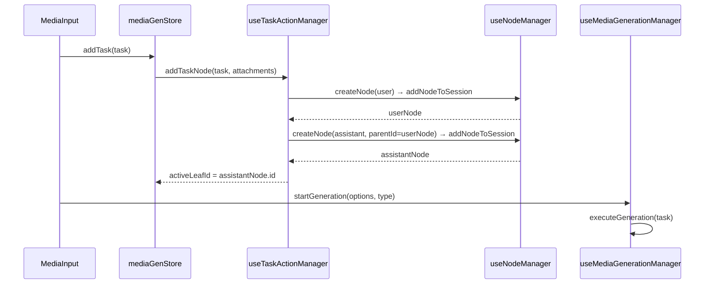
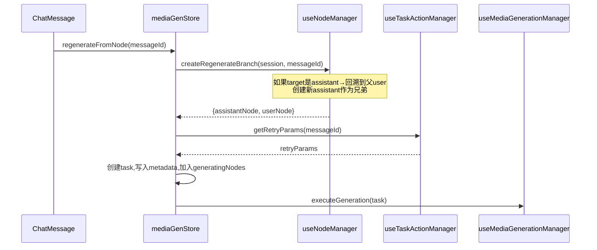

# 重试消息创建错误兄弟节点 — 根因分析与重构方案

**状态**: `已完成` | **日期**: 2026-04-30 | **关联提交**: `c2c36001`

---

## 1. 问题现象

在 media-generator 中，对某条 assistant 消息点击「重试」后：

- **期望**：在同级 user 节点下创建新的 assistant 兄弟节点
- **实际**：复制了一份 user 消息挂在旧 assistant 下面，然后新 assistant 挂在这个副本 user 下

### 实际数据（`03271333-0325-4adf-abfb-2034998f7e1b.json`）

```
Root (system)
  └── User "修仙-X prompt"        ← 原始 prompt
        └── Assistant (28b1c526)   ← 第一次生成 ✅ completed
              └── User 副本        ← ❌ 重试时错误创建的副本！
                    └── Assistant (1da3a75f)  ← stuck generating
```

### 期望

```
Root (system)
  └── User "修仙-X prompt"
        ├── Assistant (28b1c526)   ← 第一次生成
        └── Assistant (新节点)      ← 重试：兄弟节点
```

---

## 2. 架构根因：`addTaskNode` 承载了它不该承担的重试语义

### 2.1 Chat 的正确架构

```
发送新消息:
  store.sendMessage → chatHandler.sendMessage
    → nodeManager.createMessagePair(activeLeafId)   // 创建 user+assistant 对
    → executeRequest(...)                            // 执行 LLM 请求

重试:
  store.regenerateFromNode → chatHandler.regenerateFromNode
    → nodeManager.createRegenerateBranch(nodeId)     // 创建兄弟 assistant
    → executeRequest(...)                            // 执行 LLM 请求
```

**Chat 的重试是独立的一阶操作**，不经过 `sendMessage` / `createMessagePair` 管线。`createRegenerateBranch` 知道如何从 assistant 回溯到父 user、如何创建兄弟节点。

### 2.2 media-generator 的当前架构（错误）

```
发送新消息 (MediaInput):
  store.addTask(task) → taskActionManager.addTaskNode
    → 根据 activeLeafId 判断挂载点 → 创建节点 → activeLeafId 指向新 assistant
    → startGeneration(...)   // 在 addTask 调用后由输入组件触发

重试 (MessageMenubar/MessageList):
  handleRetry(messageId)
    → store.getRetryParams(messageId)        // 纯读取，不修改 activeLeafId
    → mediaGenManager.startGeneration(...)   // 内部调用 addTask → addTaskNode
      → addTaskNode 读到 activeLeafId 仍指向旧 assistant
      → 不匹配情况A（user+同内容）→ 落入情况B：创建新 user 挂在旧 assistant 下 ❌
```

**核心问题**：重试和新消息共用 `addTask → addTaskNode` 管线。`addTaskNode` 的设计前提是"当前 activeLeafId 指向的节点就是挂载点"，但重试时 activeLeafId 指向的是被重试的旧 assistant，它需要的是该 assistant 的父 user。

### 2.3 历史债务

media-generator 的 `useNodeManager.ts` **已经有一个正确的 `createRegenerateBranch`**（L310-344），与 Chat 的 [`createRegenerateBranch`](src/tools/llm-chat/composables/session/useNodeManager.ts:194) 逻辑一致——从 assistant 回溯到父 user、创建兄弟节点。但这个函数**从未被重试流程调用过**。

提交 `c2c36001` 试图在 `addTaskNode` 里用条件分支（情况A/情况B）同时处理"新消息"和"重试"，但缺少关键的第3种情况"当前在 assistant 上发起重试"，导致 bug。

---

## 3. 重构方案：拆分新消息与重试为两个独立入口（照搬 Chat）

### 3.1 架构变更总览

```
重构前（错误）:
  UI重试 → getRetryParams (只读) → startGeneration → addTask → addTaskNode (混用)
                              ↑ 新消息也走这里

重构后（正确）:
  UI重试 → store.regenerateFromNode
            → nodeManager.createRegenerateBranch  ← 复用已有的正确实现
            → 创建 task 并关联到新 assistant 节点
            → startGenerationWithNode(task, assistantNode)  ← 新的执行入口

  新消息 → store.addTask → taskActionManager.addTaskNode  ← 保持现状，只处理新消息
            → UI 调用 startGeneration
```

### 3.2 具体改动文件

#### A. [`useMediaGenerationManager.ts`](src/tools/media-generator/composables/useMediaGenerationManager.ts)

**改动**：将 `startGeneration` 中"创建 task 后执行 LLM 请求"的核心逻辑提取为 `executeGeneration(task)`，让 `startGeneration` 和新的 `regenerateFromNode` 共用。

```
现有 startGeneration(options, type):
  1. 创建 task
  2. mediaStore.addTask(task)   → 内部调用 addTaskNode 创建节点
  3. 执行 LLM 请求 (L104-293)

重构后:
  startGeneration(options, type):
    1. 创建 task
    2. mediaStore.addTask(task)    → addTaskNode 创建 user+assistant（新消息专用）
    3. await executeGeneration(task)  ← 提取出的核心逻辑

  regenerateFromNode(fullSession, messageId):
    1. nodeManager.createRegenerateBranch(fullSession, messageId) → {assistantNode, userNode}
    2. 创建 task (id=assistantNode.id, metadata含taskSnapshot等)
    3. 将 task 加入 tasks 列表，assistant 加入 generatingNodes
    4. await executeGeneration(task)  ← 复用同一核心逻辑
```

`executeGeneration` 提取自现有 `startGeneration` 的 L104-293，不需要 `addTask` 调用。

#### B. [`useTaskActionManager.ts`](src/tools/media-generator/composables/useTaskActionManager.ts)

**改动**：从 `addTaskNode` 中移除"重试语义"。它应该只处理一个新消息的节点创建。情况A（同user合并）保留，情况B（创建新user）保留。**不需要增加新的分支**，因为重试不再走这条路。

当前 L62-83 的挂载点判断逻辑保持现状即可——重试走独立入口后，`activeLeafId` 会在 `regenerateFromNode` 中被正确设置，不会触发混乱。

另外，`getRetryParams` 改为内部使用（被 `regenerateFromNode` 调用），不再由 UI 直接暴露。

#### C. [`mediaGenStore.ts`](src/tools/media-generator/stores/mediaGenStore.ts)

**改动**：

1. 新增 `regenerateFromNode(messageId: string)` action：
   - 获取 `currentFullSession`
   - 调用 `nodeManager.createRegenerateBranch(fullSession, messageId)`
   - 从 `getRetryParams(messageId)` 获取重试参数
   - 创建新 `MediaTask`（id = 新 assistant 的 id）
   - 在 assistant 节点上写入 `taskId`、`taskSnapshot` 等 metadata
   - 将 task 加入 tasks 列表、assistant 加入 `generatingNodes`
   - 调用 `mediaGenManager.startGenerationWithTask(task)`（新的执行入口）
2. 移除 `getRetryParams` 对外的暴露（改为内部使用或保留但不再由 UI 调用）

#### D. [`ChatMessage.vue`](src/tools/media-generator/components/message/ChatMessage.vue) `handleRetry` (L63-93)

**改动**：将当前流程替换为：

```typescript
const handleRetry = async (useNewModel = false) => {
  let temporaryModel: { profileId: string; modelId: string } | undefined;
  if (useNewModel) {
    const result = await modelSelectDialog.open();
    if (!result) return;
    temporaryModel = { profileId: result.profile.id, modelId: result.model.id };
  }
  store.regenerateFromNode(props.message.id, temporaryModel);
};
```

#### E. [`GenerationStream.vue`](src/tools/media-generator/components/GenerationStream.vue) `handleRetry` (L97-108)

**改动**：同上，改为调用 `store.regenerateFromNode(messageId)`。

---

## 4. 关于第二点：单轮上下文裁切

提交中 [`useMediaGenerationManager.ts:171-214`](src/tools/media-generator/composables/useMediaGenerationManager.ts:171) 的上下文裁切逻辑在请求侧（`contextMessages` 过滤），不在树节点层面。这个设计是正确的，无需修改。

---

## 5. 数据流图

### 5.1 新消息流（不变）



### 5.2 重试流（重构后）



---

## 修订历史

| 版本 | 日期       | 描述                                    |
| ---- | ---------- | --------------------------------------- |
| 1.0  | 2026-04-30 | 初步调查，错误提出绕过方案              |
| 2.0  | 2026-04-30 | 重写：确认需要拆分新消息/重试为独立入口 |
