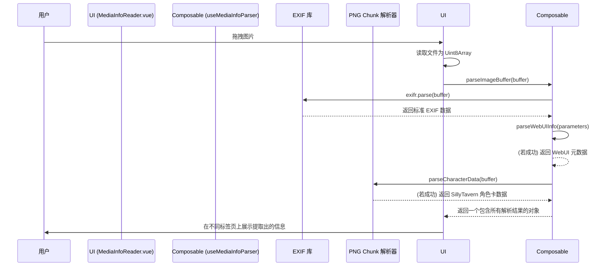

# Media Info Reader: 架构与开发者指南

本文档旨在解析 Media Info Reader 工具的内部架构、设计理念和数据流，为后续开发提供清晰的指引。

## 1. 核心概念

Media Info Reader 是一个专为 AI 生成图片设计的元数据提取器，旨在从多种主流工具生成的图片中精确提取 Prompt、生成参数和工作流信息。

### 1.1. 三层解析策略 (Three-layer Parsing Strategy)

为了最大化兼容性，工具采用了一套分层、递进的解析策略，以适应不同工具的元数据存储方式。

- **第一层：EXIF 解析 (通用)**: 使用 `exifr` 库解析标准的 EXIF 数据。这是最通用的元数据访问方式，适用于大多数图片。
- **第二层：WebUI 参数解析 (字符串分割)**: 针对 A1111/Forge WebUI 将参数存储在单一字符串中的情况，通过字符串分割和正则表达式进行结构化提取。
- **第三层：PNG Chunk 手动解析 (底层)**: 针对 SillyTavern 等工具将元数据（如Base64编码的JSON）存储在非标准的 PNG `tEXt` chunk 中的情况，通过手动解析 PNG 文件结构来提取。标准库通常会忽略这些 chunk。

### 1.2. 关注点分离

将不同来源的元数据清晰地分离，并在 UI 上以独立的标签页展示。

- **WebUI Info**: 展示从 WebUI `parameters` 字段解析出的正/负向 Prompt 和生成参数。
- **ComfyUI Workflow**: 展示从 ComfyUI 图片中提取的完整 JSON 工作流。
- **ST Character Card**: 展示从 SillyTavern 角色卡中提取的角色信息。
- **Full EXIF Info**: 提供一个原始 EXIF 数据浏览器，用于调试和查看所有未经处理的元数据。

## 2. 架构概览

- **View (`MediaInfoReader.vue`)**: 负责 UI 渲染，包括图片上传、结果展示的标签页布局。
- **Service (`MediaInfoReaderService`)**: 提供高级 API（`readImageMetadata`, `parseImageBuffer`），封装了文件读取和错误处理逻辑。
- **Logic (`useMediaInfoParser`)**: 一个独立的 Composable，封装了三层解析策略的核心实现。
- **Engine (`exifr` & Custom Parsers)**: 底层的解析引擎，包括 `exifr` 库和自定义的 WebUI 及 PNG Chunk 解析器。

## 3. 数据流：解析一张图片

## 4. 未来展望

- **新增工具支持**: 持续跟进社区，为更多新兴的 AI 绘图工具添加专门的解析器。
- **支持更多格式**: 扩展解析能力以支持 WebP 等其他图片格式的元数据提取。
- **格式健壮性**: 增强 WebUI 参数解析器的健壮性，以应对未来可能出现的格式变化。
