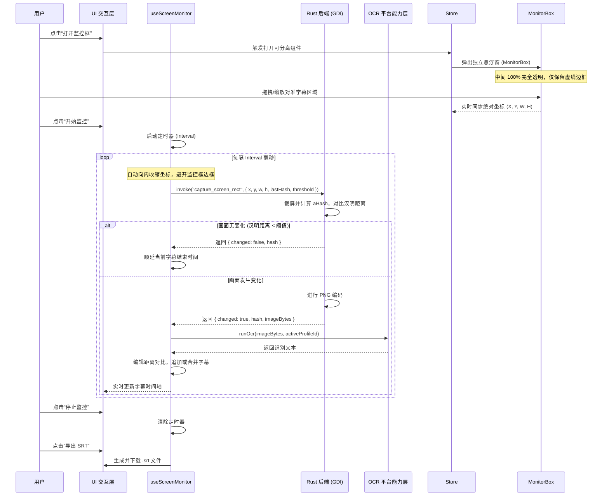

# 实时字幕OCR (Realtime Subtitle OCR): 架构与设计说明书

本文档详细记录了“实时字幕OCR”工具的内部架构、设计理念、数据流以及核心算法，为后续的开发、维护和迭代提供清晰的指引。

> 创建时间：2026-07-05

---

## 1. 核心概念与定位

**实时字幕OCR** 是一个专为 Windows 平台优化的、独立的屏幕动态监控与文字识别工具。它旨在解决用户在观看无字幕视频、外语直播、线上会议或网课时，无法实时获取字幕或无法导出字幕文本的痛点。

### 1.1. 核心功能

- **屏幕选区监控**：用户可在屏幕上自由框选任意区域（如视频播放器的字幕区），进行高频、低开销的定时采样。
- **像素级图像去重**：在 Rust 后端利用高效的图像哈希算法（aHash）对采样帧进行对比，过滤掉无变化或微弱变化的帧，避免高频大图片通过 IPC 传输，极大节省算力和大模型 API 消耗。
- **多引擎 OCR 识别**：直接复用 `Smart OCR` 的底层平台能力，支持 Windows Native OCR、VLM（多模态大模型）、Tesseract.js 等引擎。
- **流式字幕时间轴**：将识别出的文字与相对时间戳结合，流式追加到时间轴上，支持实时编辑、合并与一键复制。
- **标准字幕导出**：支持一键导出为标准的 `.srt` 字幕文件。

---

## 2. 架构设计

工具采用“前端极简交互 + 共享 OCR 平台能力 + Rust 原生区域截屏”的混合架构。

```
┌──────────────────────────────────────────────────────────────────┐
│                UI 交互层 (Vue Components)                        │
│  [RealtimeSubtitleOcr.vue] [SubtitleTimeline.vue] [MonitorConfig]│
└─────────────────────────────────┬────────────────────────────────┘
                                  │ 驱动 / 监听状态
┌─────────────────────────────────▼────────────────────────────────┐
│               业务逻辑层 (useScreenMonitor Composable)           │
│  (管理定时器、编辑距离文本合并、SRT格式化)                       │
└─────────────────────────────────┬────────────────────────────────┘
                                  │ 调用
┌─────────────────────────────────▼────────────────────────────────┐
│               OCR 平台能力层 (Shared Platform)                   │
│  [src/tools/smart-ocr/platform/runner.ts]                        │
│  (复用已有的多引擎调度器与全局统一 of OCR Profile 配置)          │
└─────────────────────────────────┬────────────────────────────────┘
                                  │ 跨进程 IPC (Tauri Command)
                                  ▼
┌──────────────────────────────────────────────────────────────────┐
│               Rust 后端原生能力层 (Windows GDI + aHash 去重)     │
│  [capture_screen_rect] (抓取屏幕像素，在内存中直接计算 aHash     │
│   并进行去重对比，无变化时仅返回状态，有变化时才返回 PNG 字节流) │
└──────────────────────────────────────────────────────────────────┘
```

### 2.1. 模块职责说明

#### 1. UI 交互层 (UI Layer)

- `RealtimeSubtitleOcr.vue`: 工具主入口，采用左右分栏布局。左侧为流式字幕时间轴，右侧为监控配置面板。
- `components/MonitorConfig.vue`: 监控参数配置面板，包含采样频率、去重灵敏度、OCR 引擎选择、开始/停止控制。
- `components/SubtitleTimeline.vue`: 字幕时间轴展示，支持单条字幕的编辑、删除、合并、一键复制和导出 SRT。
- `components/MonitorBox.vue`: 屏幕监控框悬浮窗。点击“打开监控框”时，通过 `useDetachable` 弹出一个独立的、无边框、中间 100% 完全透明的悬浮窗口。用户可以像拖动普通窗口一样，把它拖到屏幕上的任何地方（如视频播放器的字幕区域），并拉伸调整它的大小。

#### 2. 业务逻辑层 (Business Logic Layer)

- `composables/useScreenMonitor.ts`: 核心业务控制器。负责：
  - 管理定时采样器（`setInterval`）。
  - 调度 Rust 后端进行区域截屏与去重。
  - 实现基于编辑距离（Levenshtein Distance）的文本合并与断句算法。
  - 生成并导出 SRT 格式字幕。

#### 3. OCR 平台能力层 (Shared Platform Layer)

- 直接导入并复用 `src/tools/smart-ocr/platform/runner.ts` 中的 `useOcrRunner`。
- 共享全局统一的 OCR Profile 配置，用户在 `Smart OCR` 中配置好的 API Key 和引擎参数在此处直接生效，无需重复配置。

#### 4. Rust 后端原生能力层 (Rust Backend Layer)

- 在 `src-tauri/src/commands/window_automator.rs` 或新增的 commands 中，提供 Windows 专属的 `capture_screen_rect` 命令。
- 利用 Windows GDI API 直接抓取指定绝对坐标区域的屏幕像素，避免全屏截图和高频 IPC 传输开销。

---

## 3. 核心算法设计

### 3.1. 图像去重算法：后端 aHash (平均哈希)

为了防止视频背景微弱变化导致重复调用 OCR，我们在 Rust 后端对“字幕监控框”进行预处理和去重，避免无变化的大图片高频通过 IPC 传输：

1. **置灰与缩放**：将截取的原始像素缩放到 $8 \times 8$ 像素，并转换为灰度图。
2. **计算平均值**：计算这 64 个像素的灰度平均值。
3. **生成指纹**：将每个像素的灰度值与平均值进行对比，$\ge$ 平均值记为 `1`，否则记为 `0`。得到一个 64 位的二进制指纹字符串。
4. **汉明距离对比**：对比当前帧与前端传入的 `lastHash`。若汉明距离小于设定阈值，则判定为“画面无变化”，直接返回 `changed: false`，不进行 PNG 编码，极大节省 CPU 与 IPC 带宽。

### 3.2. 文本合并与断句算法：编辑距离 (Levenshtein Distance)

视频字幕在播放过程中，相邻两帧识别出的文本可能会有重叠或微小差异（如 OCR 噪点）。我们通过编辑距离算法进行智能合并：

- 计算当前帧文本 $W_{new}$ 与上一条字幕文本 $W_{last}$ 的相似度：
  $$\text{Similarity} = 1 - \frac{\text{LevenshteinDistance}(W_{new}, W_{last})}{\max(\text{Length}(W_{new}), \text{Length}(W_{last}))}$$
- **相似度 $\ge 90\%$**：判定为同一条字幕。不追加新条目，仅将上一条字幕的结束时间戳更新为当前时间。
- **相似度 $< 90\%$**：判定为新字幕。结束上一条字幕，并以当前时间戳开启新的一条字幕追加到时间轴。

---

## 4. 数据流与生命周期


