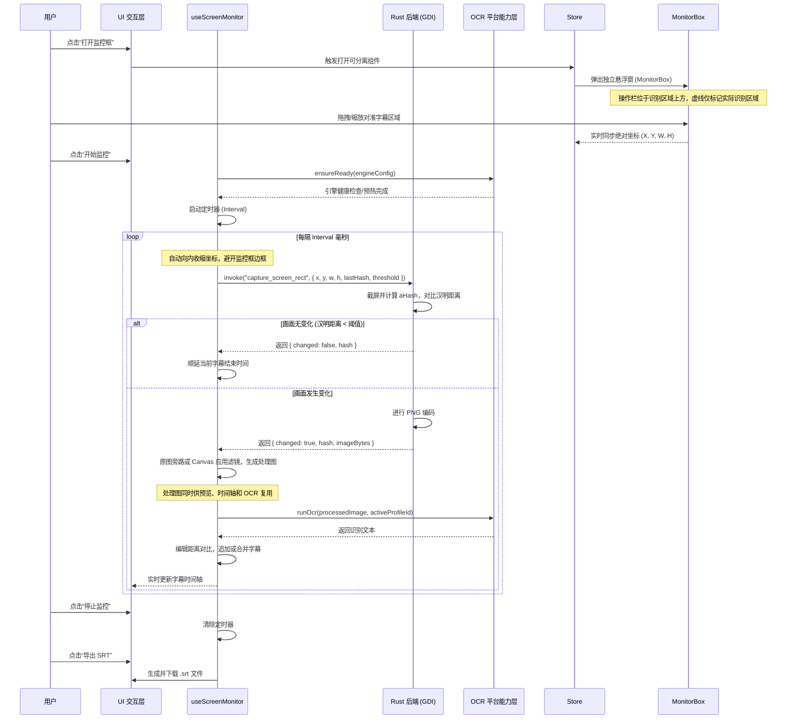

# 实时字幕OCR (Realtime Subtitle OCR) 架构说明

本文档详细记录了“实时字幕OCR”工具的内部架构、设计理念、数据流以及核心算法，为后续的开发、维护和迭代提供清晰的指引。

> 更新时间：2026-09-11

---

## 1. 核心概念与定位

**实时字幕OCR** 是一个专为 Windows 平台优化的、独立的屏幕动态监控与文字识别工具。它旨在解决用户在观看无字幕视频、外语直播、线上会议或网课时，无法实时获取字幕或无法导出字幕文本的痛点。

### 1.1. 核心功能

- **屏幕选区监控**：用户可在屏幕上自由框选任意区域（如视频播放器的字幕区），进行高频、低开销的定时采样。
- **像素级图像去重**：在 Rust 后端利用高效的平均哈希算法（aHash）对采样帧进行对比，过滤掉无变化或微弱变化的帧，避免高频大图片通过 IPC 传输，极大节省算力和大模型 API 消耗。
- **可调图像滤镜**：在截图进入 OCR 前提供原图、灰度增强、高对比黑白和反色黑白预设，以及亮度、对比度、饱和度、色相、反色和二值化高级参数；预览与 OCR 始终使用同一处理图。
- **多引擎 OCR 识别**：直接复用 `Smart OCR` 的底层平台能力，支持 Windows Native OCR、VLM（多模态大模型）、Tesseract.js、云端 OCR 以及动态插件 OCR 引擎。
- **流式字幕时间轴**：将识别出的文字与相对时间戳结合，流式追加到时间轴上，支持实时编辑、合并与一键复制。
- **大字实时编辑**：提供独立的大字编辑面板，支持对当前最新识别的字幕进行快速微调，支持 `Ctrl+Enter` 快捷键提交保存。
- **标准字幕导出与发送**：支持一键导出为标准的 `.srt` 字幕文件，或一键发送纯文本/带时间戳文本到全局 Chat 聊天输入框。

---

## 2. 架构设计

工具采用“前端极简交互 + 共享 OCR 平台能力 + Rust 原生区域截屏”的混合架构。

```
┌────────────────────────────────────────────────────────────────────────────────────────┐
│                               UI 交互层 (Vue Components)                               │
│  [RealtimeSubtitleOcr.vue] (上下分栏主容器)                                            │
│  ├── [components/LivePreview.vue] (实时预览与控制)                                     │
│  ├── [components/ActiveSubtitleEditor.vue] (当前字幕大字编辑)                          │
│  ├── [components/SubtitleTimeline.vue] (字幕时间轴列表)                                │
│  └── [components/MonitorConfig.vue] (监控参数配置)                                     │
└───────────────────────────────────────────┬────────────────────────────────────────────┘
                                            │ 驱动 / 监听状态
┌───────────────────────────────────────────▼────────────────────────────────────────────┐
│                        业务逻辑层 (useScreenMonitor Composable)                        │
│  (管理定时器、ConfigManager配置持久化、编辑距离文本合并、引用计数防内存泄漏、SRT格式化)│
└───────────────────────────────────────────┬────────────────────────────────────────────┘
                                            │ 调用
┌───────────────────────────────────────────▼────────────────────────────────────────────┐
│                        OCR 平台能力层 (Shared Platform Layer)                          │
│  [src/tools/smart-ocr/platform/runner.ts]                                              │
│  (复用已有的多引擎调度器与全局统一 of OCR Profile 配置)                                │
└───────────────────────────────────────────┬────────────────────────────────────────────┘
                                            │ 跨进程 IPC (Tauri Command)
                                            ▼
┌────────────────────────────────────────────────────────────────────────────────────────┐
│                        Rust 后端原生能力层 (Windows GDI + aHash 去重)                  │
│  [capture_screen_rect] (抓取屏幕像素，在内存中直接计算 aHash                           │
│   并进行去重对比，无变化时仅返回状态，有变化时才返回 PNG 字节流)                       │
└────────────────────────────────────────────────────────────────────────────────────────┘
```

### 2.1. 模块职责说明

#### 1. UI 交互层 (UI Layer)

- [`RealtimeSubtitleOcr.vue`](src/tools/realtime-subtitle-ocr/RealtimeSubtitleOcr.vue): 工具主入口，采用**上下分栏布局**。上方为左右分栏（7:3 比例），左侧为 `LivePreview` 实时预览与控制区，右侧为 `ActiveSubtitleEditor` 当前字幕大字编辑框；下方为 `SubtitleTimeline` 字幕时间轴列表。中间提供可拖拽的 Y 轴高度调整条。
- [`components/MonitorConfig.vue`](src/tools/realtime-subtitle-ocr/components/MonitorConfig.vue): 监控参数配置面板，包含 OCR 图像滤镜预设和高级参数、采样频率（200ms - 3000ms）、去重灵敏度（高、中、低）、OCR 引擎选择（Native, Tesseract, VLM, Cloud, Plugin）及引擎额外配置气泡。
- [`components/SubtitleTimeline.vue`](src/tools/realtime-subtitle-ocr/components/SubtitleTimeline.vue): 字幕时间轴展示，支持自动滚动、单条字幕的删除、一键复制（纯文本/带时间戳）、发送到 Chat（纯文本/带时间戳）、导出 SRT 和一键清空。
- [`components/ActiveSubtitleEditor.vue`](src/tools/realtime-subtitle-ocr/components/ActiveSubtitleEditor.vue): 当前字幕大字编辑框，支持双击下方时间轴列表中的字幕，或等待最新识别结果在此处编辑，支持 `Ctrl+Enter` 快捷键提交保存。
- [`components/LivePreview.vue`](src/tools/realtime-subtitle-ocr/components/LivePreview.vue): 实时预览组件，展示当前截取的最新帧画面，并提供打开/关闭监控框、聚焦监控框、开始/停止监控的控制按钮，以及 aHash 指纹和延迟（ms）的实时显示。
- [`components/MonitorBox.vue`](src/tools/realtime-subtitle-ocr/components/MonitorBox.vue): 屏幕监控框悬浮窗。通过统一的 `detachableComponents` 体系注册为 `type: "component"` 可分离组件：透明 + 无边框 + 置顶 + 可缩放 + 无阴影，由 `DetachedComponentContainer.vue` 在 `/detached-component/:componentId` 路由下加载，复用 `useDetachable` / `useDetachedManager` / `useWindowSyncBus` 全套悬浮窗基础设施，无需自造独立窗口。

#### 2. 业务逻辑层 (Business Logic Layer)

- [`composables/useScreenMonitor.ts`](src/tools/realtime-subtitle-ocr/composables/useScreenMonitor.ts): 核心业务控制器。负责：
  - 管理定时采样器（`setInterval`）。
  - 使用 `createConfigManager` 统一管理并防抖持久化监控配置（采样频率、去重灵敏度、图像滤镜、引擎配置）。
  - 调度 Rust 后端进行区域截屏与去重；仅当原图发生变化时，才在前端应用图像滤镜。
  - 缓存 `scaleFactor`（屏幕缩放因子），避免高频采样时频繁通过 IPC 获取，提升性能。
  - 引入 `activeInstances` 引用计数机制，在 Composable 挂载时启动几何信息监听，销毁时按需注销，防止内存泄漏。
  - 监听 `MonitorBox` 悬浮窗通过窗口同步总线上报的几何信息（`realtime-subtitle-ocr:monitor-box-geometry`）。
  - 实现基于编辑距离（Levenshtein Distance）的文本合并与断句算法。
  - 生成并导出 SRT 格式字幕。
  - 基于异步 OCR 队列执行识别，高频采样与时间轴更新解耦；采样/识别链路发生取消或重启时清理对应队列状态，不让旧任务继续向当前时间轴写入结果。

#### 3. OCR 平台能力层 (Shared Platform Layer)

- 直接导入并复用 [`src/tools/smart-ocr/platform/runner.ts`](src/tools/smart-ocr/platform/runner.ts) 中的 `useOcrRunner`。
- 共享全局统一的 OCR Profile 配置，用户在 `Smart OCR` 中配置好的 API Key 和引擎参数在此处直接生效，无需重复配置。
- Smart OCR 作业协议与稳定 contribution point 配置接入监控配置和工具注册；插件能力由统一引擎层承载，实时工具只负责采样、队列和结果展示。
- 工具挂载后会后台预热当前引擎，正式启动屏幕或视频识别前再次等待 `ensureReady`：Native OCR 通过 Tauri 可用性命令提前初始化 WinRT 引擎，Tesseract 复用已初始化的 Worker 池，云端 OCR 等待 Profile 配置加载，插件 OCR 执行 manifest 声明的 `startupMethod`（如 `healthCheck`）完成协议握手和所选模型检查。检查失败时不会启动采样或抽帧队列。

#### 4. Rust 后端原生能力层 (Rust Backend Layer)

- 在 [`src-tauri/src/commands/window_automator.rs`](src-tauri/src/commands/window_automator.rs) 中，提供 Windows 专属的 `capture_screen_rect` 命令。
- 利用 Windows GDI API 直接抓取指定绝对坐标区域的屏幕像素，避免全屏截图和高频 IPC 传输开销。

---

## 3. 核心算法设计

### 3.1. 图像去重算法：后端 aHash (平均哈希)

为了防止视频背景微弱变化导致重复调用 OCR，我们在 Rust 后端对“字幕监控框”进行预处理和去重，避免无变化的大图片高频通过 IPC 传输：

1. **抓取像素**：利用 Windows GDI API 抓取指定绝对坐标区域的屏幕像素（BGRA 格式），并转换为 RGBA 格式。
2. **缩放到 8x8**：将截取的原始像素缩放到 $8 \times 8$ 像素。
3. **计算灰度并生成 64 位二进制指纹**：使用 ITU-R BT.601 加权灰度公式 $Gray = (R \times 299 + G \times 587 + B \times 114) / 1000$ 计算灰度值，计算这 64 个像素的灰度平均值。将每个像素的灰度值与平均值进行对比，$\ge$ 平均值记为 `1`，否则记为 `0`。得到一个 64 位的二进制指纹字符串。
4. **汉明距离对比**：对比当前帧与前端传入的 `lastHash`。若汉明距离小于设定阈值（高灵敏度：2，中灵敏度：4，低灵敏度：8），则判定为“画面无变化”，直接返回 `changed: false`，不进行 PNG 编码，极大节省 CPU 与 IPC 带宽。

### 3.2. 前端 OCR 图像滤镜

Rust 后端始终对**原始截图**计算 aHash。只有返回变化帧后，前端才将图片绘制到复用 Canvas，并按固定顺序执行：**色相/饱和度 → 亮度/对比度 → 灰度 → 反色 → 二值化**。这样既确保滤镜影响实际 OCR 输入，也避免无变化帧产生 Canvas 像素循环、PNG 编码或额外内存分配。

- `原图` 预设完全旁路像素处理，保持原有性能路径。
- 已启用滤镜时，处理后的 PNG Blob 只编码一次，并派生为预览 Object URL、历史缩略图 Object URL 和 OCR data URL。
- 预览 URL 与历史字幕 URL 独立管理；刷新预览不会使时间轴缩略图失效。修改滤镜参数会清空 `lastHash`，下一帧会用新参数重新识别。
- `filterLatency` 单独记录 Canvas 处理与编码耗时；它不包含 OCR 引擎耗时。

### 3.3. 文本合并与断句算法：编辑距离 (Levenshtein Distance)

视频字幕在播放过程中，相邻两帧识别出的文本可能会有重叠或微小差异（如 OCR 噪点）。我们通过编辑距离算法进行智能合并：

- 计算当前帧文本 $W_{new}$ 与上一条字幕文本 $W_{last}$ 的相似度：
  $$\text{Similarity} = 1 - \frac{\text{LevenshteinDistance}(W_{new}, W_{last})}{\max(\text{Length}(W_{new}), \text{Length}(W_{last}))}$$
- **相似度 $\ge 90\%$**：判定为同一条字幕。不追加新条目，仅将上一条字幕的结束时间戳更新为当前时间。若新文本更长，采用新文本以修正 OCR 增量识别。
- **相似度 $< 90\%$**：判定为新字幕。结束上一条字幕，并以当前时间戳开启新的一条字幕追加到时间轴。

---

## 4. 数据流与生命周期


```mermaid
sequenceDiagram
    participant User as 用户
    participant UI as UI 交互层
    participant Composable as useScreenMonitor
    participant Rust as Rust 后端 (GDI)
    participant Platform as OCR 平台能力层

    User->>UI: 点击“打开监控框”
    UI->>Store: 触发打开可分离组件
    Store->>MonitorBox: 弹出独立悬浮窗 (MonitorBox)
    Note over MonitorBox: 操作栏位于识别区域上方，虚线仅标记实际识别区域
    User->>MonitorBox: 拖拽/缩放对准字幕区域
    MonitorBox-->>Store: 实时同步绝对坐标 (X, Y, W, H)

    User->>UI: 点击“开始监控”
    Composable->>Platform: ensureReady(engineConfig)
    Platform-->>Composable: 引擎健康检查/预热完成
    Composable->>Composable: 启动定时器 (Interval)

    loop 每隔 Interval 毫秒
        Note over Composable: 自动向内收缩坐标，避开监控框边框
        Composable->>Rust: invoke("capture_screen_rect", { x, y, w, h, lastHash, threshold })
        Rust->>Rust: 截屏并计算 aHash，对比汉明距离
        alt 画面无变化 (汉明距离 < 阈值)
            Rust-->>Composable: 返回 { changed: false, hash }
            Composable->>Composable: 顺延当前字幕结束时间
        else 画面发生变化
            Rust->>Rust: 进行 PNG 编码
            Rust-->>Composable: 返回 { changed: true, hash, imageBytes }
            Composable->>Composable: 原图旁路或 Canvas 应用滤镜，生成处理图
            Note over Composable: 处理图同时供预览、时间轴和 OCR 复用
            Composable->>Platform: runOcr(processedImage, activeProfileId)
            Platform-->>Composable: 返回识别文本
            Composable->>Composable: 编辑距离对比，追加或合并字幕
            Composable-->>UI: 实时更新字幕时间轴
        end
    end

    User->>UI: 点击“停止监控”
    Composable->>Composable: 清除定时器
    User->>UI: 点击“导出 SRT”
    Composable->>UI: 生成并下载 .srt 文件
```

## 5. 本地视频离线识别

本地视频模式由 `useVideoSubtitleOcr` 驱动，使用应用环境设置中的 FFmpeg。用户在视频预览上选择归一化 ROI，前端将视频路径、时间范围、间隔和 ROI 传给 `extract_video_frames`。Rust 端在任务专属临时目录中使用 FFmpeg 抽取 JPEG 字幕帧，并发送 `video-ocr-frame` 与 `video-ocr-progress` 事件。

前端按事件顺序读取帧、应用图像滤镜并调用共享 OCR Runner。字幕条目的 `startMs/endMs` 使用视频原始时间；相似文本合并规则与屏幕模式一致。完成或取消时清理临时帧，已经展示在时间轴中的 Object URL 继续保留到当前工具会话结束。

视频任务取消会先 abort 当前 OCR，再调用现有 `kill_ffmpeg_process` 终止 FFmpeg。屏幕监控和视频 OCR 使用独立任务状态，切换模式不会复用或误取消另一种任务。

## 6. 本地视频编辑器式工作台（2026-09 重构）

本地视频模式不再复用屏幕模式的上下分栏外壳，而是切换为独立的全幅工作台 `components/video/VideoWorkbench.vue`，屏幕模式布局保持不变。两者共享同一份 OCR 管线与配置（`useVideoSubtitleOcr` / `useScreenMonitor` / `useSubtitleTimeline`）。

### 6.1. 工作台结构

- 顶部工具栏：文件名 / 时长 / 分辨率 / FFmpeg 状态、抽帧进度、开始·取消·导出、字幕列表抽屉入口。
- 中部左侧 `VideoMonitor`：达芬奇 / PR 式监视器，支持播放/暂停/停止、逐帧、±5s、**音量 / 静音 · 倍速 / 缩放比例菜单 · 适配 / 缩放 ± / 1:1 / 滚轮缩放 / 拖拽平移 / 双击 Fit↔100% / 全屏**。
- 中部右侧 Inspector：`MonitorConfig`（引擎 / 滤镜 / 采样 / 去重）、`RoiNumberPanel`（ROI 精确 px/% 设置与预设）、`ActiveSubtitleEditor`（字幕编辑）。
- 底部 `TimelineEditor`（Konva）：时间标尺 + 字幕轨道块 + 识别区间 + 播放头，横向滚轮滚动、`Ctrl+滚轮` 缩放、块拖拽平移/修剪、点击标尺 seek。
- 次级列表：`SubtitleTimeline` 表格放入右侧抽屉，与轨道通过 `selectedId` / `seek` 联动。

### 6.2. 视口与交互模型

- `composables/useViewportTransform.ts`：维护 `scale / offsetX / offsetY`，内容以 `transform-origin: 0 0` 渲染；`fit()` 计算适配比例，`setScale(scale, anchorX, anchorY)` 以光标为锚点缩放，`panBy(dx, dy)` 平移。
- `components/video/RoiOverlay.vue`：位于同一被变换的内容层内，因此 DOM 百分比坐标天然等于视频归一化坐标；8 向手柄与边框尺寸按 `1/scale` 补偿，保证任意缩放下保持恒定屏幕尺寸。
- `composables/useTimelineViewport.ts`：时间轴 `pxPerSecond / scrollX` 视口；`timeToX / xToTime` 换算，`ensureVisible` 让播放头跟随。Konva 只绘制可见区（windowing），避免长视频下的大量图元。
- `utils/video.ts` 的 `resizeVideoRoi`：8 向手柄拖拽的纯函数实现；角点手柄在给定 `aspectRatio`（归一化 width / height）时保持比例并锚定对角点，边手柄保持单轴缩放，最小尺寸优先于比例。
- `utils/subtitleOps.ts`：`splitSubtitleEntry` / `mergeSubtitleEntries` 纯函数，由 `useSubtitleTimeline().splitSubtitle / mergeSubtitles` 调用；拆分保留首段 frameUrl，合并回收被合并条目的 Object URL。
- 工作台快捷键（`VideoMonitor` 聚焦时）：空格播放/暂停、`←/→` 逐帧、`Shift+←/→` ±1s、`Home/End` 首尾、`I/O` 设置识别区间起止、`F` 适配、`H` 手型、`+/-` 缩放。单击视口 / ROI / 空白会把键盘焦点主动交给监视器，控制条交互后焦点也归还监视器；焦点位于输入控件时不拦截按键。
- 双击 `Fit ↔ 100%` 在 `mousedown` 中按时间自行识别：`RoiOverlay` 的 `pointerdown` 会 `preventDefault()`，浏览器不再派发 `dblclick`，用原生双击事件会失效。
- 视频截图链路：`RegionFilterPreview` 用递增令牌丢弃过期刷新与识别结果，刷新时取消在途识别；`VideoWorkbench` 从 `<video>` 取帧前调用 `VideoMonitor.waitForFrame()`，等待 `seeked` + `requestVideoFrameCallback`（无回调能力时 200ms 兜底）确保抓到 seek 后的目标帧。
- 时间轴右键菜单：编辑 / 在播放头拆分 / 与下一条合并 / 删除，空轨右键不弹出。

### 6.3. 区域截图 · 滤镜预览（屏幕 / 视频共用）

- `utils/frameCapture.ts`：与来源解耦的纯像素工具。`captureRegionToCanvas` 支持 `HTMLVideoElement / HTMLImageElement / HTMLCanvasElement / ImageBitmap`；`renderFilteredRegion` 复用 `applyImageFilterToPixels` 生成原图与处理图；`recognizeCanvas` 用同一处理图调用共享 OCR Runner 做单帧试识别。
- `components/common/FrameFilterPreview.vue`：展示原图 / 处理图对照与试识别结果。
- `components/common/RegionFilterPreview.vue`：状态封装 + 滤镜参数变化 debounce 自动重截。视频模式从 `<video>` 当前帧按 ROI 裁剪；屏幕模式调用 `useScreenMonitor().captureOnce()` 一次性抓取监控框（不参与监控去重、不写 `lastHash`）。

> Canvas 截图依赖 `assetProtocol` 与 `crossOrigin="anonymous"`；若个别视频导致画布污染，可降级为新增 Rust `extract_single_frame` 命令。
