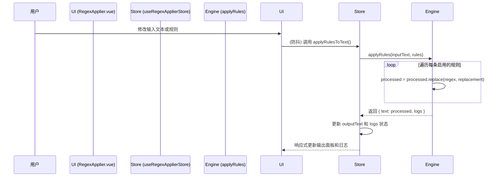

# Regex Applier: 架构与开发者指南

本文档旨在解析 Regex Applier 工具的内部架构、设计理念和数据流，为后续开发提供清晰的指引。

## 1. 核心概念

Regex Applier 是一个批量正则表达式处理工具，旨在通过规则链和预设系统，为用户提供一个强大、可复用的文本处理流程。

### 1.1. 规则链引擎 (Rule Chain Engine)

这是本工具的核心。它允许用户定义一系列正则表达式规则，并按顺序依次应用。

- **执行流程**: 采用纯函数式引擎，前一个规则的输出将作为下一个规则的输入，依次通过整个规则链。
- **原子操作**: 每个规则包含一个正则表达式和替换字符串。规则可以被单独启用或禁用。
- **日志记录**: 引擎会记录每条规则的应用情况（是否产生变更、是否出错），为用户提供清晰的执行反馈。

### 1.2. 预设管理系统 (Preset Management)

为了方便用户保存和复用复杂的规则组合，工具内置了强大的预设系统。

- **预设结构**: 每个预设是一个包含名称、描述、分类和规则数组的完整配置。
- **内置预设**: 提供了一系列开箱即用的预设，覆盖文本处理（如移除空行）、代码格式化（如移除行尾空格）和数据清洗等常见场景。
- **自定义与分享**: 用户可以创建自己的预设，这些预设保存在 `localStorage` 中。同时，支持将任意预设导入/导出为 JSON 文件，便于团队间的分享和协作。

## 2. 架构概览

采用基于 Pinia 的集中式状态管理模式。

- **State (`useRegexApplierStore`)**: 作为所有状态的唯一真实来源，管理输入/输出文本、当前规则链、预设列表和执行日志。
- **View (`RegexApplier.vue`)**: 负责 UI 渲染和用户交互，包括规则编辑器、预设选择器和输入/输出面板。
- **Logic (Store Actions & Engine)**:
  - **Actions**: 封装了 `applyRulesToText`, `loadPreset` 等核心业务逻辑。
  - **Engine**: `applyRules` 纯函数，负责执行规则链。

## 3. 数据流：应用一次规则链

## 4. 核心逻辑

- **实时预览**: 通过 `watch` 和 `debounce` (300ms) 实现。当用户的输入文本或规则链发生变化时，会自动重新应用规则，提供流畅的实时预览。
- **正则表达式解析**: 支持 `/pattern/flags` 和纯 `pattern` 两种格式。解析器会自动确保 `g` (全局) 标志总是存在，同时保留用户指定的其他标志（如 `i`, `m`）。

## 5. 未来展望

- **高级功能**: 增加对捕获组引用（如 `$1`）的支持，以及条件规则的应用。
- **性能优化**: 针对超大文本（>10MB）的实时处理，探索性能优化方案，如增量处理或 Web Worker。
