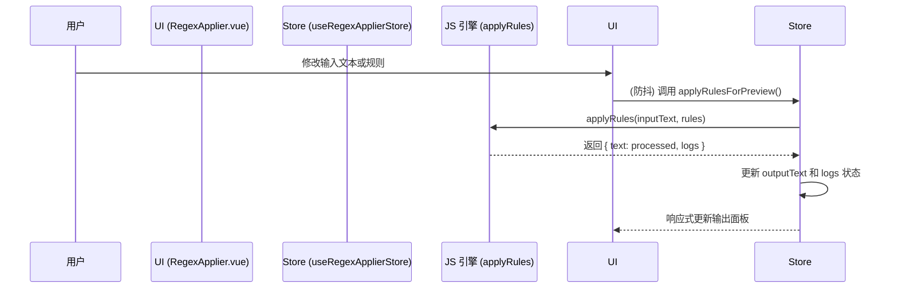
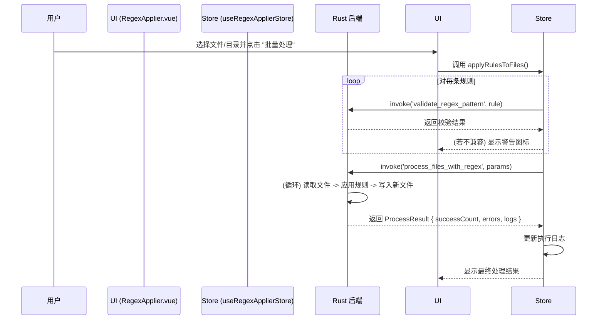

# Regex Applier: 架构与开发者指南

本文档旨在解析 Regex Applier 工具的内部架构、设计理念和数据流，为后续开发提供清晰的指引。

## 1. 核心概念

Regex Applier 是一个批量正则表达式处理工具，其核心是 **双引擎架构**，兼顾了实时交互预览和高性能的批量文件处理能力。

### 1.1. 双引擎架构 (Dual-Engine Architecture)

- **前端引擎 (JavaScript)**:
  - **目的**: 提供流畅的 **实时预览**。当用户在 UI 中修改输入文本或规则时，该引擎会在浏览器端立即执行正则替换。
  - **实现**: 通过 `watch` 和 `debounce` (300ms) 机制，调用 JS 的 `String.prototype.replace()`。
  - **限制**: 受浏览器性能限制，不适合处理超大文本或大量文件。

- **后端引擎 (Rust)**:
  - **目的**: 提供高性能的 **批量文件处理**。用户可以将规则应用于整个目录，由后端完成读写操作。
  - **实现**: 通过 Tauri `invoke` 调用 `process_files_with_regex` 命令。Rust 后端会遍历文件、读取内容、应用规则并写入新文件。
  - **优势**: 性能远超前端，能够高效处理大量文件和大型文本，且不阻塞 UI。

### 1.2. 规则链与预设 (Rule Chain & Presets)

与纯前端版本类似，工具的核心是规则链和预设系统。用户可以创建、保存、导入/导出包含多条正则表达式的预设，便于复用和分享。

### 1.3. 正则兼容性检查 (Regex Compatibility Check)

由于 JavaScript 和 Rust 的正则表达式引擎存在语法差异（如 Rust 不支持前瞻/后瞻断言），工具内置了一套兼容性检查机制。

- **核心命令**: 前端在将任务派发到后端前，会调用 `validate_regex_pattern` 命令。
- **校验逻辑**: Rust 后端会尝试编译规则，并返回一个包含 `isValid`、`errorMessage` 和 `warning` 的结果。
- **UI 反馈**: UI 会根据校验结果，在规则旁边显示警告或错误图标，提前告知用户哪些规则无法在后端批量处理时使用。

## 2. 架构概览

- **View (`RegexApplier.vue`)**: 负责 UI 渲染和用户交互。
- **State (`useRegexApplierStore`)**: 管理输入/输出文本、规则链、预设和执行日志。
- **Engine (JS & Rust)**:
  - **JS Engine**: `applyRules` 纯函数，用于实时预览。
  - **Rust Engine**: `process_files_with_regex` 命令，用于批量文件处理。
- **Service (Store Actions)**: 封装了调用前端引擎进行预览，以及调用后端引擎进行批量处理的逻辑。

## 3. 数据流

### 3.1. 场景一：实时预览

### 3.2. 场景二：批量处理文件

## 4. 未来展望

- **统一引擎**: 探索使用 WebAssembly (WASM) 编译 Rust 的 `regex` crate，以统一前后端的正则引擎，消除兼容性问题。
- **性能优化**: 针对超大文本（>10MB）的实时处理，探索性能优化方案，如增量处理或 Web Worker。
