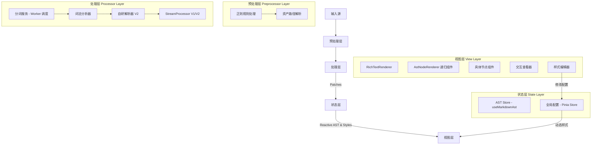

# 富文本渲染引擎架构文档

## 1. 项目概述

**Rich Text Renderer** 是一个专为 LLM（大语言模型）流式输出场景设计的高性能、高可扩展性的富文本渲染引擎。它旨在解决传统 Markdown 渲染器在处理流式数据时常见的闪烁、性能瓶颈，以及对复杂结构（如嵌套 HTML、自定义思考标签）和动态样式支持不足的问题。

### 核心目标

- **流式友好**: 采用增量解析和更新策略，实现打字机般的流畅体验。
- **零闪烁**: 通过精细的 Diff 算法和 Patch 系统，仅更新变化的部分，避免全量重绘。
- **复杂结构支持**: 深度支持 HTML 与 Markdown 混合排版、代码块、数学公式、Mermaid 图表以及 LLM 特有的思考过程标签。
- **动态样式**: 支持用户通过图形化界面实时自定义 Markdown 元素的渲染样式，并支持全局样式与 Agent/User 个性化样式的分层合并。
- **高可扩展性**: 基于统一的 AST 和模块化解析器设计，易于扩展新的节点类型和渲染规则。

## 2. 系统架构

系统采用分层架构设计，数据单向流动，从文本输入到视图渲染。



### 2.1 核心模块

1.  **预处理层 (Preprocessor Layer)**
    - **职责**: 在文本进入解析器之前，对原始内容进行预处理。
    - **核心功能**:
      - **正则规则处理**: 支持通过 `regexRules` prop 传入聊天正则规则，在解析前对内容进行替换和转换，流式和静态模式均支持。
      - **资产路径解析 (Eager Resolution)**: 在 AST 解析前处理那些必须立即转换的路径。对于 `file://` 协议，由于其包含特殊字符且如果不转换则无法加载，引擎会在预处理阶段强制调用 `resolveAsset` 进行转换。

2.  **处理层 (Processor Layer)**
    - **职责**: 接收预处理后的文本流，将其解析为 AST，计算变更并生成 Patch 指令。
    - **核心组件**:
      - `StreamProcessor` (V1): 基于 `markdown-it`，利用边界检测实现块级增量更新。位于 `core/StreamProcessor.ts`。
      - `StreamProcessorV2` (V2): 结合自研的 `CustomParser`，支持更复杂的 HTML 嵌套和自定义标签，是当前的核心。位于 `core/StreamProcessorV2.ts`。
      - `CustomParser`: V2 解析器核心，负责将完整文本块转换为 AST。位于 `core/CustomParser.ts`。
      - `Tokenizer`: V2 解析器的词法分析器，采用 **Sticky RegExp** 优化匹配性能，并支持 **Raw Mode** 以处理特殊 HTML 标签。位于 `parser/Tokenizer.ts`。
      - `TokenizerService`: 封装了 Web Worker 调度逻辑，通过 `parser/tokenizer.worker.ts` 在后台线程进行异步分词，确保超长文本流下的 UI 响应性。位于 `parser/tokenizerService.ts`。

3.  **状态层 (State Layer)**
    - **职责**: 维护当前的 AST 结构、全局配置和动态样式，并应用 Patch 指令更新状态。
    - **核心组件**:
      - `useMarkdownAst`: Vue Composable，提供 AST 的响应式状态（基于 `shallowRef`）和 Patch 应用逻辑（如 `text-append`, `replace-node`），支持可配置的 `throttleMs` 节流参数。位于 `composables/useMarkdownAst.ts`。
      - `Pinia Store` (`stores/store.ts`): 集中管理测试工具的配置、LLM 思考标签规则、正则配置，以及最重要的 **动态 Markdown 样式 (`richTextStyleOptions`)**。通过 `configManager` 实现配置的持久化和自动保存。

4.  **视图层 (View Layer)**
    - **职责**: 将 AST 渲染为 Vue 组件树，并应用动态样式。
    - **核心组件**:
      - `RichTextRenderer`: 统一入口组件，接收文本流和配置，支持 4 种渲染器版本切换。
      - `AstNodeRenderer`: 基于 JSX 的递归渲染组件，根据节点类型分发到具体的 Vue 组件，并注入动态样式。支持节点进入动画控制和 `content-visibility: auto` 块级渲染优化。
      - **节点组件**: 位于 `components/nodes/`，负责各自节点的渲染。详见第 4 节。
      - **交互查看器**:
        - `HtmlInteractiveViewer`: 完整的 HTML 沙箱查看器，支持工具栏、CSP 安全策略、主题注入、自适应高度、CDN 本地化、iframe 消息代理和日志捕获。
        - `MermaidInteractiveViewer`: Mermaid 交互查看器，支持缩放/平移/拖拽、SVG/PNG 下载、图片复制到剪贴板、源码/图表/分屏三种视图模式、键盘快捷键和 Mermaid 代码自动修复。
      - `MarkdownStyleEditor`: 一个完整的图形化界面，允许用户实时编辑、预览和重置 Markdown 元素的 CSS 样式。

### 2.2 渲染器版本体系

引擎支持 4 种渲染器版本，通过 `RendererVersion` 枚举控制：

| 版本               | 标识               | 描述                                                 | 状态         |
| ------------------ | ------------------ | ---------------------------------------------------- | ------------ |
| V1 - Markdown-it   | `v1-markdown-it`   | 基于 markdown-it 的增量解析器，支持稳定区/待定区分离 | 可用         |
| V2 - Custom Parser | `v2-custom-parser` | 自研 AST 解析器，支持复杂 HTML 嵌套和 LLM 思考块     | 可用（推荐） |
| Pure Markdown-it   | `pure-markdown-it` | 纯 markdown-it 渲染，无增量优化                      | 可用         |
| Hybrid V3          | `hybrid-v3`        | 混合策略 V3 版本                                     | 规划中       |

## 3. 核心机制

### 3.1 稳定区与待定区 (Stable vs Pending)

为了解决流式渲染中的语法不完整问题（如未闭合的代码块），引擎引入了**双区域策略**：

- **稳定区 (Stable Region)**:
  - 内容已确认为语法完整，不会再发生语义变化。
  - 策略：**增量 Diff**。只对新增部分进行解析和比对，生成 Patch。
  - 优势：性能极高，随着文本增长，解析开销不随之线性增长。

- **待定区 (Pending Region)**:
  - 位于文本流末尾，可能包含未闭合的标签或标记。
  - 策略：**全量重解析**。每次有新 Chunk 到达时，重新解析整个待定区。
  - 优势：确保未完成的语法能被临时正确处理，一旦闭合立即转为稳定状态。

- **安全切分点检测**: `MarkdownBoundaryDetector` 负责检测内容是否处于完整状态，包括代码块闭合、表格完整性、KaTeX 块级公式闭合、HTML 标签闭合（含属性值中间检测）、内联链接/图片闭合等。当检测到末尾存在不完整的 HTML 标签或链接时，会自动回退切分点以隐藏残缺部分，防止渲染闪烁。

### 3.2 自研解析器 (CustomParser - V2)

V2 版本引入了自研的模块化解析器，以克服 `markdown-it` 的局限性。

- **多线程词法分析 (Off-main-thread Lexing)**:
  - `Tokenizer` 被封装在 Web Worker (`parser/tokenizer.worker.ts`) 中运行。通过 `TokenizerService` (`parser/tokenizerService.ts`) 进行单例 Worker 复用和调度，避免了大规模文本解析对主线程 UI 渲染的干扰。
  - **性能优化**: 词法分析器广泛使用 `sticky (y)` 标志的正则表达式，直接在原始字符串上进行位置偏移匹配，彻底消除了频繁创建字符串切片（substring/slice）带来的内存和 CPU 开销。

- **原始模式 (Raw Mode)**:
  - 为了完美兼容 HTML 行为，`Tokenizer` 支持原始模式。当遇到 `<code>`, `<pre>`, `<script>`, `<style>` 等标签时，解析器会进入贪婪匹配状态，直到遇到对应的闭合标签。这确保了这些标签内部的特殊字符不会被错误地识别为 Markdown 标记。

- **HTML 深度支持**: 将 HTML 标签视为一等公民，支持任意深度的 HTML 与 Markdown 混合嵌套，包括 `<details>`, `<article>` 等复杂的语义化标签。通过 `GenericHtmlNode` 实现结构化 HTML 标签的 AST 表示。
- **LLM 思考块**: 原生支持 `<think>`、`<guguthink>` 等自定义标签，将其解析为结构化的 `LlmThinkNode`。
- **GitHub Alert 块**: 支持 `> [!NOTE]`、`> [!TIP]`、`> [!IMPORTANT]`、`> [!WARNING]`、`> [!CAUTION]` 语法，解析为 `AlertNode`。

### 3.3 动态样式系统

这是一个核心特性，允许对渲染结果进行深度定制。

- **配置中心**: `stores/store.ts` 中的 `richTextStyleOptions` 对象存储了所有 Markdown 元素（如 `paragraph`, `h1`, `strong`, `quote`, `alert`）的自定义样式。
- **CSS 变量注入**: `RichTextRenderer` 组件将样式配置转换为 CSS 自定义属性（如 `--md-strong-color`），通过根元素的 `:style` 绑定注入。支持全局总开关 (`globalEnabled`) 和子项开关 (`enabled`)。
- **动态应用**: 各节点组件通过 CSS 变量引用这些样式，实现无需重渲染的实时样式切换。
- **样式合并**: `utils/styleUtils.ts` 提供 `mergeStyleOptions()` 函数，支持全局样式与 Agent/User 个性化样式的分层合并，覆盖配置中已启用的分类会替换全局设置。
- **实时编辑**: `MarkdownStyleEditor` 组件提供了一个 UI 界面，用于修改 `richTextStyleOptions`，更改会通过 Pinia 立即响应到视图层，实现所见即所得的样式编辑。

### 3.4 Patch 系统与更新节流

视图更新完全由 Patch 指令驱动，确保了最小化的 DOM 操作。

| 操作 (Op)                | 描述                   | 场景              |
| :----------------------- | :--------------------- | :---------------- |
| `text-append`            | 向文本节点追加内容     | 打字机效果        |
| `replace-node`           | 替换整个节点           | 节点状态/类型变更 |
| `insert-after`           | 在指定节点后插入新节点 | 新段落/块生成     |
| `insert-before`          | 在指定节点前插入新节点 | 节点前置插入      |
| `remove-node`            | 删除节点               | 待定区重组        |
| `set-prop`               | 更新节点属性           | 属性变化          |
| `replace-children-range` | 替换子节点范围         | 批量子节点更新    |
| `replace-root`           | 替换根节点             | 初始化或全量重置  |

- **更新节流 (Throttling)**: `useMarkdownAst` 引入了混合的 `setTimeout` + `requestAnimationFrame` 批处理策略。它会将短时间内密集的 Patch 指令合并，并与浏览器的渲染周期同步，在单次渲染帧中批量应用。节流时间 `throttleMs` 是可配置的（默认 80ms），允许在不同场景下进行性能微调。
- **批量处理**: Patch 队列会合并连续的、针对同一节点的 `text-append` 操作，将多次小更新合并为一次大更新，进一步提升效率。
- **队列溢出保护**: 当队列长度超过 `MAX_QUEUE_SIZE`（200）时，立即执行刷新以避免单帧过载。

### 3.5 智能体资产解析 (Agent Asset Resolution)

为了支持智能体生成的动态资源（如图片、图表、临时文件），引擎引入了资产解析钩子：

- **解析钩子**: `RichTextRenderer` 接受一个可选的 `resolveAsset` 函数。
- **协议转换**: 该钩子负责将内容中的自定义协议（如 `agent-asset://`）或相对路径转换为当前环境可用的真实 URL。
- **分层处理 (Lazy Resolution)**:
  - **预处理阶段**: 仅处理 `file://` 等可能干扰解析或必须全局替换的协议。
  - **节点渲染阶段**: `agent-asset://` 等协议留给具体节点组件（如 `ImageNode`、`GenericHtmlNode`）处理。这些组件通过注入的 `resolveAsset` 钩子或 `currentAgent` 上下文，在运行时动态解析真实 URL。
  - **优势**: 避免了 Markdown 解析器对转换后的长本地路径（包含 `%` 等字符）进行二次编码，导致 Tauri 无法识别。
- **HTML 预览**: 在 `HtmlInteractiveViewer` 的沙箱中，内容在注入前会经过资产解析，确保预览中的所有外部资源引用都能正确加载。

### 3.6 CDN 资源本地化

为了支持离线环境和提升 HTML 预览的加载速度，引擎提供了 CDN 资源本地化功能：

- **实现**: `utils/cdnLocalizer.ts` 自动检测 HTML 内容中的 CDN 链接（支持 jsdelivr、cdnjs、unpkg、bootcdn 等主流 CDN），并替换为本地 `public/libs/` 下的对应资源。
- **支持的库**: d3、mermaid、jquery、lodash、echarts、three.js、chart.js、anime.js、gsap、p5.js。
- **控制**: 通过 `enableCdnLocalizer` prop 控制是否启用，默认开启。

### 3.7 渲染性能优化

- **`content-visibility: auto`**: 块级节点（`BLOCK_NODE_TYPES` 集合，包括段落、标题、代码块、表格、Mermaid、思考块等）自动应用 `content-visibility: auto`，让浏览器跳过不在视口内的节点渲染，显著提升长消息列表的滚动性能。配合 `contain-intrinsic-size` 防止滚动条跳动。
- **节点进入动画**: 新增节点支持淡入（fade-in-up）动画效果。
  - **立即显示策略**: 在 `AstNodeRenderer.tsx` 中定义了 `NO_ANIMATION_NODE_TYPES` 集合。对于思考块、代码块、Mermaid、VCP 工具、HTML 块和图片，动画会被自动禁用。这是因为这些节点通常具有动态填充内容或复杂的初始化逻辑，立即显示能提供更好的实时反馈。
- **图片列表提取节流**: `RichTextRenderer` 会递归提取 AST 中的所有图片链接（`extractImages`），并使用 1000ms 的节流函数更新 `imageList`。该列表通过上下文共享给所有 `ImageNode`，使其能支持全局图片预览（Viewer）的幻灯片切换。
- **HTML 预览冻结**: 通过 `shouldFreeze` prop 控制，当消息深度超过阈值时冻结 HTML 预览以节省资源。

### 3.8 交互式测试与调试工具 (Tester)

引擎内置了一个功能强大的测试工具 `RichTextRendererTester.vue`，用于开发调试和性能验证。

- **流式模拟系统**:
  - **Token 级模拟**: 基于 `Tokenizer` 实现真实的 Token 流式输出模拟。
  - **节奏控制**: 支持自定义输出速度（Tokens/s）、首包延迟（Initial Delay）。
  - **波动模式 (Fluctuation)**: 模拟真实网络环境下的发包抖动，支持延迟波动和单次 Token 数量波动。
- **可视化状态监控**:
  - **稳定区/待定区染色**: 可视化显示 AST 节点的 `stable` 和 `pending` 状态。
  - **实时统计**: 显示已渲染 Token 数、实时速度、总字符数和渲染耗时。
  - **元数据模拟**: 模拟 LLM 响应元数据（如 `firstTokenTime`, `tokensPerSecond`），验证 UI 计时逻辑。
- **对比与回归测试**:
  - **多维度对比**: 支持 Markdown 原文、渲染后的 HTML、规范化后的纯文本之间的对比。
  - **一键复制**: 提供详细的测试报告复制功能，包含测试配置、样式配置、原文与结果对比，便于问题复现。
- **调试辅助**:
  - **实时 AST 查看器**: 集成 `AstViewer`，以树状结构实时展示当前的 AST 状态。
  - **正则实时预览**: 支持实时编辑和应用 `ChatRegexRule`，观察其对渲染结果的影响。

## 4. 目录结构说明

```
src/tools/rich-text-renderer/
├── components/                   # 视图层组件
│   ├── nodes/                    # 具体 AST 节点的 Vue 组件实现
│   │   ├── ActionButtonNode.vue  # 可交互按钮节点
│   │   ├── AlertNode.vue         # GitHub 风格警告块
│   │   ├── BlockquoteNode.vue    # 引用块
│   │   ├── CodeBlockNode.vue     # 代码块（Monaco Editor + HTML 沙箱）
│   │   ├── EmNode.vue            # 斜体
│   │   ├── GenericHtmlNode.vue   # 通用 HTML 标签（SVG/音频/安全过滤）
│   │   ├── HardBreakNode.vue     # 硬换行
│   │   ├── HeadingNode.vue       # 标题
│   │   ├── HrNode.vue            # 水平线
│   │   ├── HtmlBlockNode.vue     # HTML 块级节点
│   │   ├── HtmlInlineNode.vue    # HTML 内联节点
│   │   ├── ImageNode.vue         # 图片
│   │   ├── InlineCodeNode.vue    # 行内代码
│   │   ├── LinkNode.vue          # 链接
│   │   ├── ListItemNode.vue      # 列表项
│   │   ├── ListNode.vue          # 列表
│   │   ├── LlmThinkNode.vue     # LLM 思考块
│   │   ├── MermaidNode.vue       # Mermaid 图表
│   │   ├── ParagraphNode.vue     # 段落
│   │   ├── PreCodeNode.vue       # Pre/Code 块
│   │   ├── QuoteNode.vue         # 内联引号
│   │   ├── StrikethroughNode.vue # 删除线
│   │   ├── StrongNode.vue        # 粗体
│   │   ├── TableCellNode.vue     # 表格单元格
│   │   ├── TableNode.vue         # 表格
│   │   ├── TableRowNode.vue      # 表格行
│   │   ├── TextNode.vue          # 纯文本
│   │   └── VcpToolNode.vue       # VCP 工具调用
│   ├── style-editor/             # 样式编辑器 UI
│   │   ├── MarkdownStyleEditor.vue
│   │   └── StyleItemEditor.vue
│   ├── tester/                   # 测试工具拆分组件
│   │   ├── TesterConfigSidebar.vue
│   │   └── TesterToolbar.vue
│   ├── ast-viewer/               # AST 可视化调试器
│   │   ├── AstViewer.vue
│   │   └── JsonTreeNode.vue
│   ├── AstNodeRenderer.tsx       # 核心递归渲染器
│   ├── HtmlInteractiveViewer.vue # HTML 沙箱交互查看器
│   ├── KatexRenderer.vue         # KaTeX 公式渲染组件
│   ├── LlmThinkRulesEditor.vue   # LLM 思考规则编辑器
│   ├── MermaidInteractiveViewer.vue # Mermaid 交互查看器
│   └── RichTextRendererTester.vue   # 交互式测试工具
├── composables/                  # 组合式函数
│   └── useMarkdownAst.ts         # AST 状态管理与 Patch 逻辑
├── config/                       # 配置
│   └── presets.ts                # 测试预设注册表
├── core/                         # 核心处理器
│   ├── CustomParser.ts           # V2 自研解析器入口
│   ├── StreamProcessor.ts        # V1 处理器（基于 markdown-it）
│   └── StreamProcessorV2.ts      # V2 处理器（基于 CustomParser）
├── parser/                       # V2 解析器模块
│   ├── block/                    # 块级元素解析逻辑
│   ├── inline/                   # 内联元素解析逻辑
│   ├── utils/                    # 解析器工具函数
│   ├── Tokenizer.ts              # 词法分析器
│   ├── tokenizer.worker.ts       # 词法分析 Web Worker
│   ├── tokenizerService.ts       # Worker 调度服务
│   └── types.ts                  # 解析器内部类型
├── presets/                      # 测试预设内容文件
│   ├── basic.ts, code.ts, ...    # 20+ 个预设
│   └── ...
├── stores/                       # 状态管理
│   └── store.ts                  # 全局配置与样式状态（Pinia）
├── utils/                        # 工具函数
│   ├── cdnLocalizer.ts           # CDN 资源本地化
│   └── styleUtils.ts             # 样式合并工具
├── docs/                         # 设计文档
├── richTextRenderer.registry.ts  # 工具注册文件
├── RichTextRenderer.vue          # 统一入口组件
└── types.ts                      # 核心类型定义（AST, Patch, Config）
```

## 5. 功能特性清单

本渲染器支持标准 Markdown 语法、GFM 扩展以及一系列专为 LLM 场景设计的增强功能。

### 5.1 标准与 GFM 语法

- **基础格式**: 段落、粗体、斜体、删除线、行内代码、链接、图片、水平线、硬换行。
- **块级元素**: 标题 (H1-H6)、无序列表、有序列表、引用块、代码块。
- **GFM 扩展**: 表格、GitHub 风格 Alert 警告块（`> [!NOTE]`、`> [!TIP]`、`> [!IMPORTANT]`、`> [!WARNING]`、`> [!CAUTION]`）。
- **内联引号**: 支持将被引号括起来的内容（如 `"Hello"` 或 `"你好"`）解析为结构化的 `QuoteNode`。

### 5.2 扩展功能

- **数学公式**: 支持 KaTeX 语法的块级 (`$$...$$`) 和内联 (`$...$`) 公式渲染，以及 MathJax 语法的块级 (`\[...\]`) 和内联 (`\(...\)`) 公式渲染。通过专用的 `KatexRenderer` 组件和 `katex_inline`/`katex_block` AST 节点实现。
- **图表绘制**: 支持 Mermaid 语法。其渲染组件 `MermaidNode` 提供了丰富的交互功能，包括**缩放、下载为 SVG/PNG、复制图片到剪贴板、在独立窗口中进行高级交互（含分屏源码视图）、复制源码、Mermaid 代码自动修复**以及优雅的加载和错误状态处理。
- **HTML 原生支持**:
  - 支持块级、内联及 `<details>`, `<article>` 等语义化 HTML 标签与 Markdown 的深度混合排版。
  - 通过 `GenericHtmlNode` 实现结构化 HTML 标签的 AST 表示，支持任意深度嵌套。
  - **SVG 原生渲染**: SVG 相关标签（`<svg>`, `<circle>`, `<path>` 等）直接渲染为原生 SVG 元素，保持结构合法性。
  - **音频增强控制**:
    - **隐形音频兜底**: 对于“隐形”音频元素（无 `controls` 属性或 `display: none`），自动生成一套精美的可视化播放控制器。支持播放/暂停、停止、进度条拖拽、实时时长显示。
    - **音量联动**: 音频音量会自动根据全局设置（`globalMediaVolume`）和智能体私有设置（`defaultMediaVolume`）进行加权计算，确保多媒体体验的一致性。
  - **危险标签黑名单**: `script`, `iframe`, `object` 等危险标签默认被拦截并降级为 `<span>`，可通过 `allowDangerousHtml` 配置绕过。
  - 安全地处理未闭合的 HTML 标签。
  - **嵌入式单页应用 (SPA) 渲染**: `html` 代码块不再仅仅是静态预览，而是作为一个功能完备的沙箱环境（`HtmlInteractiveViewer`），可以直接渲染和运行包含 JavaScript 的复杂单页应用，并支持在独立窗口中进行完整交互。
  - **性能冻结 (Freeze) 策略**: 当 HTML 预览节点过多或处于非活动状态时，引擎会自动冻结其渲染以节省资源，用户可点击手动恢复。
- **CDN 资源本地化**: 自动将 HTML 预览中的 CDN 链接替换为本地资源，支持 d3、mermaid、jquery、echarts 等 10 种常见库。
- **外部工具调用 (VCP Support)**:
  - 兼容支持外部 VCP 工具调用格式 `<<<[TOOL_REQUEST]>>> ... <<<[END_TOOL_REQUEST]>>>`。
  - 支持 `maid:「始」...「末」` 等结构化参数定界符的精准解析。
  - 提供专用的 `VcpToolNode` 渲染，支持折叠交互、实时状态反馈和原始报文查看。
- **LLM 思考过程**:
  - 原生支持可配置的 XML 风格标签（如 `<think>`, `<guguthink>`）。
  - 渲染为可折叠、可交互的思考块，并支持流式动画效果。
  - 通过 `LlmThinkRulesEditor` 组件提供规则的图形化编辑。
  - **可交互按钮**: 支持 LLM 输出 `<button>` 标签来创建可交互的按钮（`ActionButtonNode`）。这些按钮可以执行前端预定义的安全操作（如 `发送消息`、`插入内容到输入框`、`复制`），并支持通过 `style` 属性自定义外观（经过安全过滤），为用户提供便捷的快捷操作，同时通过严格的白名单机制保证安全性。
- **正则规则预处理**: 支持在渲染前对内容应用聊天正则规则（`regexRules`），实现内容的自动替换和转换，流式和静态模式均支持。

### 5.3 核心交互与渲染特性

- **流式渲染与更新节流**: 文本以打字机效果流畅输出，无整体刷新和闪烁。引入了可配置的 AST 更新节流机制（默认 80ms），采用混合的 `setTimeout` + `requestAnimationFrame` 批处理策略，在保证低延迟的同时，大幅降低了高速流式输出下的性能开销。
- **渲染动画**: 新增了节点淡入（fade-in-up）动画效果，使内容加载过程更自然。对于需要立即显示以填充内容的动态节点（如思考块、代码块、图表、VCP 工具、HTML 块、图片等），动画会被自动禁用，以确保最佳用户体验。
- **代码高亮与应用沙箱**: 使用 **Monaco Editor** 提供专业级语法高亮。支持流式输出下的**增量追加 (Incremental Append)**，显著提升长代码块的打字机体验。对于 `html` 代码块，支持 **Seamless (无边框)** 渲染，使其与页面内容无缝融合。
- **块级渲染优化**: 块级节点自动应用 `content-visibility: auto`，让浏览器跳过不在视口内的节点渲染，显著提升长消息列表的滚动性能。
- **动态样式系统**: 提供图形化界面，允许用户实时自定义所有 Markdown 元素的 CSS 样式，支持全局/Agent/User 三级样式合并。
- **稳定区/待定区策略**: 智能分离已完成和未完成的语法，确保流式输出的稳定性和正确性。

### 5.4 AST 节点类型一览

**内联节点：**

| 类型            | 说明                  |
| --------------- | --------------------- |
| `text`          | 纯文本                |
| `strong`        | 粗体                  |
| `em`            | 斜体                  |
| `strikethrough` | 删除线                |
| `quote`         | 内联引号              |
| `inline_code`   | 行内代码              |
| `katex_inline`  | KaTeX 行内公式        |
| `link`          | 链接                  |
| `image`         | 图片                  |
| `hard_break`    | 硬换行                |
| `html_inline`   | HTML 内联标签（原始） |
| `generic_html`  | 结构化 HTML 标签      |
| `action_button` | 可交互按钮            |

**块级节点：**

| 类型                                 | 说明                  |
| ------------------------------------ | --------------------- |
| `paragraph`                          | 段落                  |
| `heading`                            | 标题 (H1-H6)          |
| `code_block`                         | 代码块                |
| `mermaid`                            | Mermaid 图表          |
| `llm_think`                          | LLM 思考块            |
| `list`                               | 列表                  |
| `list_item`                          | 列表项                |
| `blockquote`                         | 引用块                |
| `alert`                              | GitHub 风格警告块     |
| `hr`                                 | 水平线                |
| `html_block`                         | HTML 块级标签（原始） |
| `table` / `table_row` / `table_cell` | 表格                  |
| `katex_block`                        | KaTeX 块级公式        |
| `vcp_tool`                           | VCP 工具调用          |

## 6. RichTextRenderer Props 参考

| Prop                       | 类型                           | 默认值           | 说明                       |
| -------------------------- | ------------------------------ | ---------------- | -------------------------- |
| `content`                  | `string`                       | —                | 静态内容                   |
| `streamSource`             | `StreamSource`                 | —                | 流式数据源                 |
| `version`                  | `RendererVersion`              | `V1_MARKDOWN_IT` | 渲染器版本                 |
| `llmThinkRules`            | `LlmThinkRule[]`               | 默认 think 规则  | LLM 思考标签规则           |
| `styleOptions`             | `RichTextRendererStyleOptions` | `{}`             | 动态样式配置               |
| `generationMeta`           | `any`                          | —                | 生成元数据                 |
| `isStreaming`              | `boolean`                      | `false`          | 是否处于流式传输中         |
| `defaultRenderHtml`        | `boolean`                      | `false`          | 是否默认渲染 HTML 代码块   |
| `seamlessMode`             | `boolean`                      | `false`          | HTML 预览无边框模式        |
| `defaultCodeBlockExpanded` | `boolean`                      | `false`          | 代码块默认展开             |
| `defaultToolCallCollapsed` | `boolean`                      | `false`          | 工具调用默认折叠           |
| `enableCdnLocalizer`       | `boolean`                      | `true`           | 是否启用 CDN 本地化        |
| `throttleMs`               | `number`                       | `80`             | AST 更新节流时间           |
| `enableEnterAnimation`     | `boolean`                      | `true`           | 是否启用节点进入动画       |
| `allowExternalScripts`     | `boolean`                      | `false`          | 是否允许加载外部脚本       |
| `allowDangerousHtml`       | `boolean`                      | `false`          | 是否允许渲染危险 HTML 标签 |
| `regexRules`               | `ChatRegexRule[]`              | `[]`             | 正则规则                   |
| `resolveAsset`             | `(content: string) => string`  | —                | 资产路径解析钩子           |
| `shouldFreeze`             | `boolean`                      | `false`          | 是否冻结 HTML 预览         |
| `showTokenCount`           | `boolean`                      | `false`          | 是否显示 Token 计数        |

## 7. 扩展性设计

### 7.1 添加新节点类型

1.  在 `types.ts` 中定义新的节点接口（继承 `BaseAstNode`），并将其加入 `AstNode` 联合类型。
2.  在 `parser/` 目录下创建或修改对应的解析逻辑，并将其集成到 `core/CustomParser.ts` 中。
3.  在 `components/AstNodeRenderer.tsx` 的 `componentMap` 中注册新的节点类型与 Vue 组件的映射。如需控制动画或渲染优化行为，同步更新 `NO_ANIMATION_NODE_TYPES` 和 `BLOCK_NODE_TYPES` 集合。
4.  在 `components/nodes/` 下实现具体的 Vue 组件。

### 7.2 依赖注入与上下文 (Dependency Injection)

引擎广泛使用 Vue 的 `provide/inject` 机制进行跨组件状态共享，核心 Context 定义在 `RICH_TEXT_CONTEXT_KEY` 中：

- **`images`**: 响应式的全局图片 URL 列表，用于 `ImageNode` 唤起全局预览。
- **`resolveAsset`**: 资产解析钩子函数。
- **`currentAgent`**: 当前智能体实例，用于解析 `agent-asset://` 协议。
- **`isStreaming`**: 全局流式状态，影响思考块的闭合行为和动画。
- **`config`**: 包含 `seamlessMode`, `defaultRenderHtml`, `allowDangerousHtml` 等开关。

### 7.3 自定义样式

默认情况下，所有基础 Markdown 节点都已接入动态样式系统。如果新增的节点也需要支持自定义样式，只需：

1.  在 `types.ts` 的 `RichTextRendererStyleOptions` 接口中添加新的样式 key。
2.  在 `RichTextRenderer.vue` 的 `cssVariables` computed 中添加对应的 `addVars` 调用。
3.  在 `components/style-editor/MarkdownStyleEditor.vue` 中添加对应的 `StyleItemEditor` 编辑器实例。
4.  确保新的节点组件通过 CSS 变量引用样式（如 `color: var(--md-xxx-color)`）。

## 8. 附录：集成与调用场景 (Integration & Usage)

渲染器在 `llm-chat` 模块中作为核心显示组件，其调用场景体现了高度的解耦和协作。

### 8.1 消息内容渲染 (MessageContent.vue)

这是渲染器最主要的调用点，具有以下集成特性：

- **宏处理 (Macro Processing)**: 内容在传入渲染器前，会先经过 `MacroProcessor` 处理。这包括替换用户/智能体姓名变量、处理环境相关的动态文本。
- **资产解析集成**:
  - 通过 `provide("currentAgent", currentAgent)` 注入当前智能体上下文。
  - 遵循“分层处理”策略：`MessageContent` 仅负责宏替换，将 `agent-asset://` 协议透传给渲染器，由渲染器内部的 `ImageNode` 等组件在渲染时动态解析。
  - 支持 `【file::assetId】` 占位符解析：`resolveAsset` 钩子会查询消息附件列表，将占位符转换为真实的本地资源 URL。
- **性能冻结策略**: 传入 `messageDepth` 属性。当消息处于较深的历史记录中时，渲染器会自动冻结其 HTML 预览沙箱，以释放内存和 CPU 资源。
- **样式合并**: 渲染器接收来自 `ChatSettings` 的全局样式，并根据当前智能体（Agent）的配置进行合并覆盖。

### 8.2 智能体预设编辑器 (PresetMessageEditor.vue)

用于智能体（Agent）开发阶段的实时预览：

- **实时反馈**: 当开发者修改智能体的“预设消息串”时，渲染器提供即时的 Markdown 预览。
- **上下文模拟**: 即使在编辑阶段，也会通过 `provide` 模拟 `currentAgent` 上下文，确保预设中的资产链接（图片等）能够被正确解析和预览。
