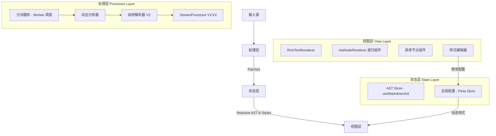

# 富文本渲染引擎架构文档

## 1. 项目概述

**Rich Text Renderer** 是一个专为 LLM（大语言模型）流式输出场景设计的高性能、高可扩展性的富文本渲染引擎。它旨在解决传统 Markdown 渲染器在处理流式数据时常见的闪烁、性能瓶颈，以及对复杂结构（如嵌套 HTML、自定义思考标签）和动态样式支持不足的问题。

### 核心目标

- **流式友好**: 采用增量解析和更新策略，实现打字机般的流畅体验。
- **零闪烁**: 通过精细的 Diff 算法和 Patch 系统，仅更新变化的部分，避免全量重绘。
- **复杂结构支持**: 深度支持 HTML 与 Markdown 混合排版、代码块、数学公式、Mermaid 图表以及 LLM 特有的思考过程标签。
- **动态样式**: 支持用户通过图形化界面实时自定义 Markdown 元素的渲染样式。
- **高可扩展性**: 基于统一的 AST 和模块化解析器设计，易于扩展新的节点类型和渲染规则。

## 2. 系统架构

系统采用分层架构设计，数据单向流动，从文本输入到视图渲染。



### 2.1 核心模块

1.  **处理层 (Processor Layer)**
    - **职责**: 接收文本流，将其解析为 AST，计算变更并生成 Patch 指令。
    - **核心组件**:
      - `StreamProcessor` (V1): 基于 `markdown-it`，利用边界检测实现块级增量更新。
      - `StreamProcessorV2` (V2): 结合自研的 `CustomParser`，支持更复杂的 HTML 嵌套和自定义标签，是当前的核心。
      - `CustomParser`: V2 解析器核心，负责将完整文本块转换为 AST。
      - `Tokenizer`: V2 解析器的词法分析器，采用 **Sticky RegExp** 优化匹配性能，并支持 **Raw Mode** 以处理特殊 HTML 标签。
      - `TokenizerService`: 封装了 Web Worker 调度逻辑，支持在后台线程进行异步分词，确保超长文本流下的 UI 响应性。

2.  **状态层 (State Layer)**
    - **职责**: 维护当前的 AST 结构、全局配置和动态样式，并应用 Patch 指令更新状态。
    - **核心组件**:
      - `useMarkdownAst`: Vue Composable，提供 AST 的响应式状态和 Patch 应用逻辑（如 `text-append`, `replace-node`）。
      - `Pinia Store` (`store.ts`): 集中管理测试工具的配置、LLM 思考标签规则，以及最重要的 **动态 Markdown 样式 (`richTextStyleOptions`)**。

3.  **视图层 (View Layer)**
    - **职责**: 将 AST 渲染为 Vue 组件树，并应用动态样式。
    - **核心组件**:
      - `RichTextRenderer`: 统一入口组件，接收文本流和配置。
      - `AstNodeRenderer`: 基于 JSX 的递归渲染组件，根据节点类型分发到具体的 Vue 组件，并注入动态样式。
      - **节点组件**: `MermaidNode`, `LlmThinkNode`, `VcpToolNode` 等负责各自节点的渲染。特别地：
        - `CodeBlockNode`: 复合功能组件。对于普通代码，基于 **Monaco Editor** 实现高性能渲染，支持流式追加优化、字体缩放和自动换行。对于 HTML，化身为**嵌入式 Web 应用沙箱**，支持 **Seamless (无边框)** 模式和**性能冻结 (Freeze)** 策略。
        - `VcpToolNode`: 专门用于展示外部 VCP 工具调用格式，提供结构化的参数列表、执行状态动画及原始调用详情复制功能。
      - `MarkdownStyleEditor`: 一个完整的图形化界面，允许用户实时编辑、预览和重置 Markdown 元素的 CSS 样式。

## 3. 核心机制

### 3.1 稳定区与待定区 (Stable vs Pending)

为了解决流式渲染中的语法不完整问题（如未闭合的代码块），引擎引入了**双区域策略**：

- **稳定区 (Stable Region)**:
  - 内容已确认为语法完整，不会再发生语义变化。
  - 策略：**增量 Diff**。只对新增部分进行解析和比对，生成 Patch。
  - 优势：性能极高，随着文本增长，解析开销不随之线性增长。

- **待定区 (Pending Region)**:
  - 位于文本流末尾，可能包含未闭合的标签或标记。
  - 策略：**全量重解析**。每次有新 Chunk 到达时，重新解析整个待定区。
  - 优势：确保未完成的语法能被临时正确处理，一旦闭合立即转为稳定状态。

### 3.2 自研解析器 (CustomParser - V2)

V2 版本引入了自研的模块化解析器，以克服 `markdown-it` 的局限性。

- **多线程词法分析 (Off-main-thread Lexing)**:
  - `Tokenizer` 被封装在 Web Worker 中运行。通过 `TokenizerService` 进行调度，避免了大规模文本解析对主线程 UI 渲染的干扰。
  - **性能优化**: 词法分析器广泛使用 `sticky (y)` 标志的正则表达式，直接在原始字符串上进行位置偏移匹配，彻底消除了频繁创建字符串切片（substring/slice）带来的内存和 CPU 开销。

- **原始模式 (Raw Mode)**:
  - 为了完美兼容 HTML 行为，`Tokenizer` 支持原始模式。当遇到 `<code>`, `<pre>`, `<script>`, `<style>` 等标签时，解析器会进入贪婪匹配状态，直到遇到对应的闭合标签。这确保了这些标签内部的特殊字符不会被错误地识别为 Markdown 标记。

- **HTML 深度支持**: 将 HTML 标签视为一等公民，支持任意深度的 HTML 与 Markdown 混合嵌套，包括 `<details>`, `<article>` 等复杂的语义化标签。
- **LLM 思考块**: 原生支持 `<think>`、`<guguthink>` 等自定义标签，将其解析为结构化的 `LlmThinkNode`。

### 3.3 动态样式系统

这是一个核心特性，允许对渲染结果进行深度定制。

- **配置中心**: `store.ts` 中的 `richTextStyleOptions` 对象存储了所有 Markdown 元素（如 `paragraph`, `h1`, `strong`）的自定义样式。
- **注入机制**: `RichTextRenderer` 组件从 Store 中读取样式配置，并通过 `provide/inject` 或 props 将其传递给 `AstNodeRenderer`。
- **动态应用**: `AstNodeRenderer` 在渲染每个节点组件时，会将对应的自定义样式作为 `style` 属性应用到组件的根元素上。
- **实时编辑**: `MarkdownStyleEditor` 组件提供了一个 UI 界面，用于修改 `richTextStyleOptions`，更改会通过 Pinia 立即响应到视图层，实现所见即所得的样式编辑。

### 3.4 Patch 系统与更新节流

视图更新完全由 Patch 指令驱动，确保了最小化的 DOM 操作。

- **更新节流 (Throttling)**: 为了在处理高速文本流时平衡实时性和性能，`useMarkdownAst` 引入了更新节流机制。它会将短时间内密集的 Patch 指令（如 `text-append`）合并，并通过 `requestAnimationFrame` 与浏览器的渲染周期同步，在单次渲染帧中批量应用。这显著降低了 CPU 负载，避免了因过于频繁的重渲染导致的卡顿。节流时间 `throttleMs` 是可配置的，允许在不同场景下进行性能微调。
- **批量处理**: Patch 队列会合并连续的、针对同一节点的 `text-append` 操作，将多次小更新合并为一次大更新，进一步提升效率。

### 3.5 智能体资产解析 (Agent Asset Resolution)

为了支持智能体生成的动态资源（如图片、图表、临时文件），引擎引入了资产解析钩子：

- **解析钩子**: `RichTextRenderer` 接受一个可选的 `resolveAsset` 函数。
- **协议转换**: 该钩子负责将内容中的自定义协议（如 `agent-asset://`）或相对路径转换为当前环境可用的真实 URL。
- **预处理渲染**: 在 `CodeBlockNode` 的 HTML 预览模式下，内容在注入沙箱前会先经过资产解析，确保预览中的所有外部资源引用都能正确加载。

| 操作 (Op)      | 描述                   | 场景              |
| :------------- | :--------------------- | :---------------- |
| `text-append`  | 向文本节点追加内容     | 打字机效果        |
| `replace-node` | 替换整个节点           | 节点状态/类型变更 |
| `insert-after` | 在指定节点后插入新节点 | 新段落/块生成     |
| `remove-node`  | 删除节点               | 待定区重组        |
| `set-prop`     | 更新节点属性           | 属性变化          |
| `replace-root` | 替换根节点             | 初始化或全量重置  |

## 4. 目录结构说明

```
src/tools/rich-text-renderer/
├── components/               # 视图层组件
│   ├── nodes/                # 具体 AST 节点的 Vue 组件实现
│   ├── style-editor/         # 样式编辑器 UI
│   │   ├── MarkdownStyleEditor.vue
│   │   └── StyleItemEditor.vue
│   ├── AstNodeRenderer.tsx   # 核心递归渲染器
│   └── ...
├── composables/              # 组合式函数
│   └── useMarkdownAst.ts     # AST 状态管理与 Patch 逻辑
├── parser/                   # V2 解析器模块
│   ├── block/                # 块级元素解析逻辑
│   ├── inline/               # 内联元素解析逻辑
│   ├── utils/                # 解析器工具函数
│   ├── Tokenizer.ts          # 词法分析器
│   └── types.ts              # 解析器内部类型
├── store.ts                  # 全局配置与样式状态 (Pinia)
├── CustomParser.ts           # V2 自研解析器入口
├── StreamProcessor.ts        # V1 处理器 (基于 markdown-it)
├── StreamProcessorV2.ts      # V2 处理器 (基于 CustomParser)
├── types.ts                  # 核心类型定义 (AST, Patch, Config)
├── RichTextRenderer.vue      # 统一入口组件
└── RichTextRendererTester.vue # 交互式测试工具
```

## 5. 功能特性清单

本渲染器支持标准 Markdown 语法、GFM 扩展以及一系列专为 LLM 场景设计的增强功能。

### 5.1 标准与 GFM 语法

- **基础格式**: 段落、粗体、斜体、删除线、行内代码、链接、图片、水平线。
- **块级元素**: 标题 (H1-H6)、无序列表、有序列表、引用块、代码块。
- **GFM 扩展**: 表格。

### 5.2 扩展功能

- **数学公式**: 支持 KaTeX 语法的块级 (`$$...$$`) 和内联 (`$...$`) 公式渲染，以及 MathJax 语法的块级 (`\\[...\\]`) 和内联 (`\\(...\\)`) 公式渲染。
- **图表绘制**: 支持 Mermaid 语法。其渲染组件 `MermaidNode` 提供了丰富的交互功能，包括**缩放、下载为 SVG、在独立窗口中进行高级交互、复制源码**以及优雅的加载和错误状态处理。
- **HTML 原生支持**:
  - 支持块级、内联及 `<details>`, `<article>` 等语义化 HTML 标签与 Markdown 的深度混合排版。
  - 安全地处理未闭合的 HTML 标签。
  - **嵌入式单页应用 (SPA) 渲染**: `html` 代码块不再仅仅是静态预览，而是作为一个功能完备的沙箱环境，可以直接渲染和运行包含 JavaScript 的复杂单页应用，并支持在独立窗口中进行完整交互。
  - **性能冻结 (Freeze) 策略**: 当 HTML 预览节点过多或处于非活动状态时，引擎会自动冻结其渲染以节省资源，用户可点击手动恢复。
- **外部工具调用 (VCP Support)**:
  - 兼容支持外部 VCP 工具调用格式 `<<<[TOOL_REQUEST]>>> ... <<<[END_TOOL_REQUEST]>>>`。
  - 支持 `maid:「始」...「末」` 等结构化参数定界符的精准解析。
  - 提供专用的 `VcpToolNode` 渲染，支持折叠交互、实时状态反馈和原始报文查看。
- **LLM 思考过程**:
  - 原生支持可配置的 XML 风格标签（如 `<think>`, `<guguthink>`）。
  - 渲染为可折叠、可交互的思考块，并支持流式动画效果。
  - **可交互按钮**: 支持 LLM 输出 `<button>` 标签来创建可交互的按钮。这些按钮可以执行前端预定义的安全操作（如 `发送消息`、`插入内容到输入框`、`复制`），并支持通过 `style` 属性自定义外观，为用户提供便捷的快捷操作，同时通过严格的白名单机制保证安全性。

### 5.3 核心交互与渲染特性

- **流式渲染与更新节流**: 文本以打字机效果流畅输出，无整体刷新和闪烁。引入了可配置的 AST 更新节流机制，在保证低延迟的同时，大幅降低了高速流式输出下的性能开销。
- **渲染动画**: 新增了节点淡入（fade-in）动画效果，使内容加载过程更自然。对于需要立即显示以填充内容的动态节点（如思考块、代码块、图表等），动画会被自动禁用，以确保最佳用户体验。
- **代码高亮与应用沙箱**: 使用 **Monaco Editor** 提供专业级语法高亮。支持流式输出下的**增量追加 (Incremental Append)**，显著提升长代码块的打字机体验。对于 `html` 代码块，支持 **Seamless (无边框)** 渲染，使其与页面内容无缝融合。
- **动态样式系统**: 提供图形化界面，允许用户实时自定义所有 Markdown 元素的 CSS 样式。
- **稳定区/待定区策略**: 智能分离已完成和未完成的语法，确保流式输出的稳定性和正确性。

## 6. 扩展性设计

### 6.1 添加新节点类型

1.  在 `types.ts` 中定义新的节点接口（继承 `BaseAstNode`）。
2.  在 `parser/` 目录下创建或修改对应的解析逻辑，并将其集成到 `CustomParser.ts` 中。
3.  在 `AstNodeRenderer.tsx` 中注册新的节点类型与 Vue 组件的映射。
4.  在 `components/nodes/` 下实现具体的 Vue 组件。

### 6.2 自定义样式

默认情况下，所有基础 Markdown 节点都已接入动态样式系统。如果新增的节点也需要支持自定义样式，只需：

1.  在 `types.ts` 的 `RichTextRendererStyleOptions` 接口中添加新的样式 key。
2.  在 `MarkdownStyleEditor.vue` 中添加对应的 `StyleItemEditor` 编辑器实例。
3.  确保新的节点组件能正确接收并应用 `style` prop。
