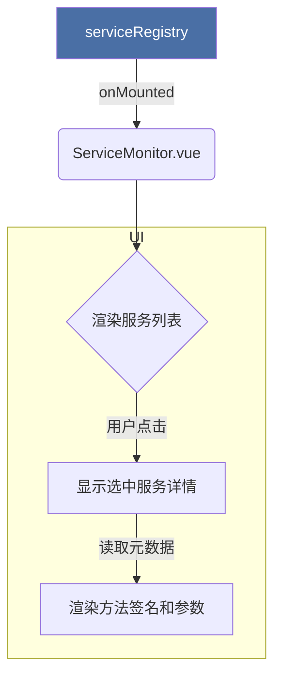

# Service Monitor: 架构与开发者指南

本文档旨在解析 Service Monitor 工具的内部架构与设计理念，为开发调试提供指引。

## 1. 核心概念

Service Monitor 是一个服务注册中心的可视化监控工具，旨在为开发者提供一个清晰的应用内部服务API视图。

- **核心目的**:
  - **服务发现**: 自动从全局 `serviceRegistry` 读取并列出所有已注册的 `ToolService`。
  - **API 文档**: 可视化展示每个服务的元数据，包括其 ID、名称、描述以及所有公开方法的详细签名（参数、返回类型、示例等）。
  - **开发辅助**: 帮助开发者快速了解系统中可用的服务及其能力，降低模块间协作的门槛。

## 2. 架构概览

工具采用一个简单的、**只读**的架构，直接与服务注册中心交互。

- **View (`ServiceMonitor.vue`)**: 负责 UI 渲染。组件在挂载时 (`onMounted`) 从 `serviceRegistry` 获取所有服务实例，并将其渲染为两栏布局（左侧为服务列表，右侧为选中服务的详情）。
- **Data Source (`serviceRegistry`)**: 全局单例的服务注册中心，是此工具的唯一数据来源。
- **Data Contract (`ToolService` interface)**: 所有被监控的服务都必须实现 `ToolService` 接口，特别是 `getMetadata()` 方法，该方法定义了需要向监控器展示的元数据结构。

## 3. 数据流

## 4. 未来展望

- **实时监控**: 扩展 `serviceRegistry` 以支持事件广播，使监控器能够实时响应服务的注册与注销。
- **方法调用**: 增加一个交互式表单，允许开发者直接在监控器中输入参数并调用服务方法，查看返回结果，将其转变为一个动态的 API 测试工具。
