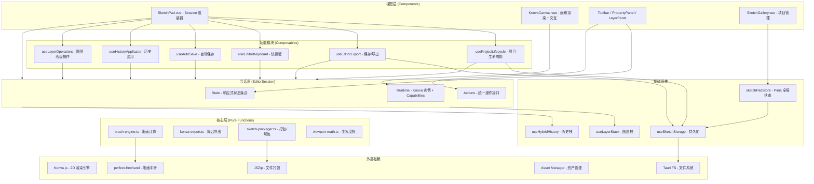
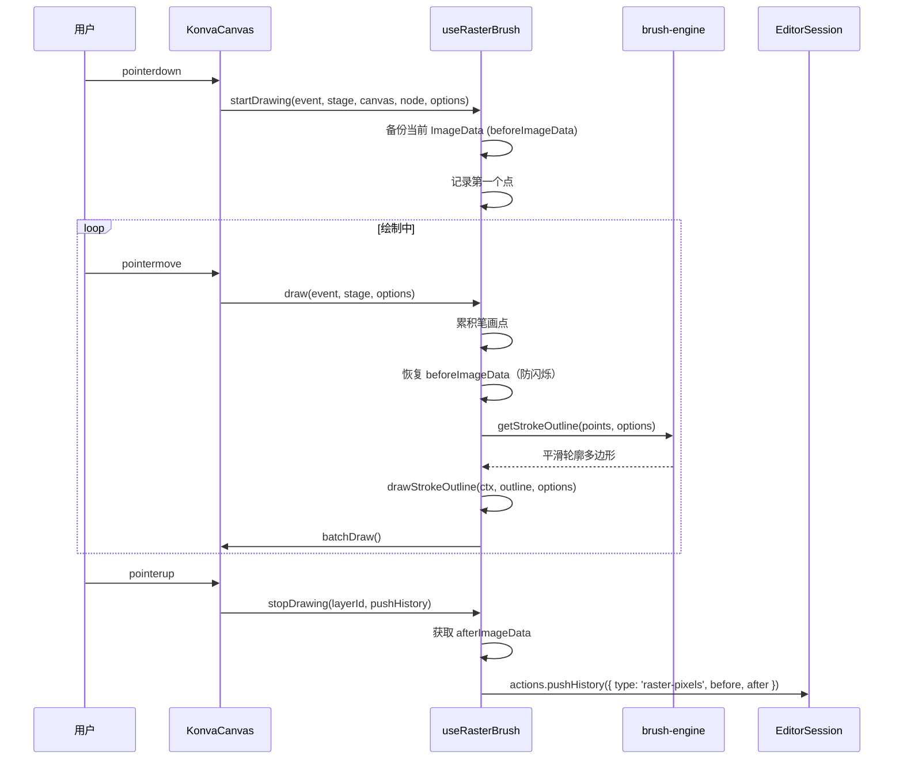
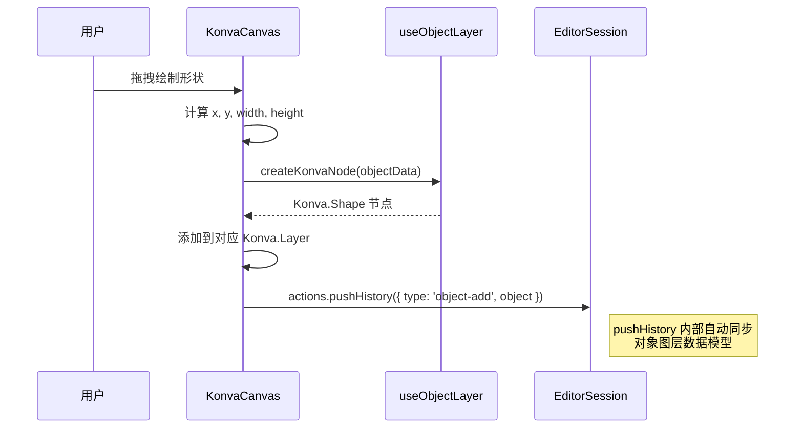
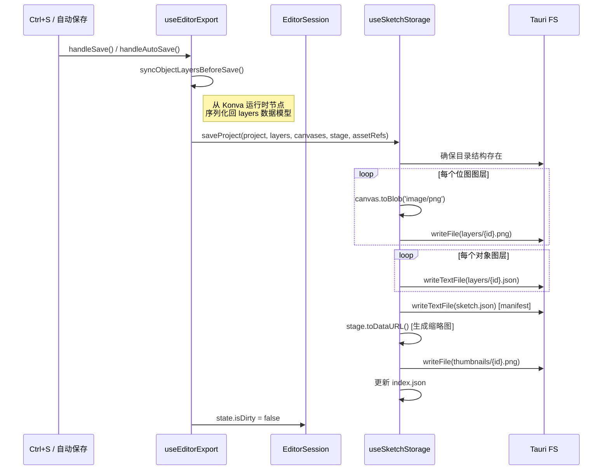
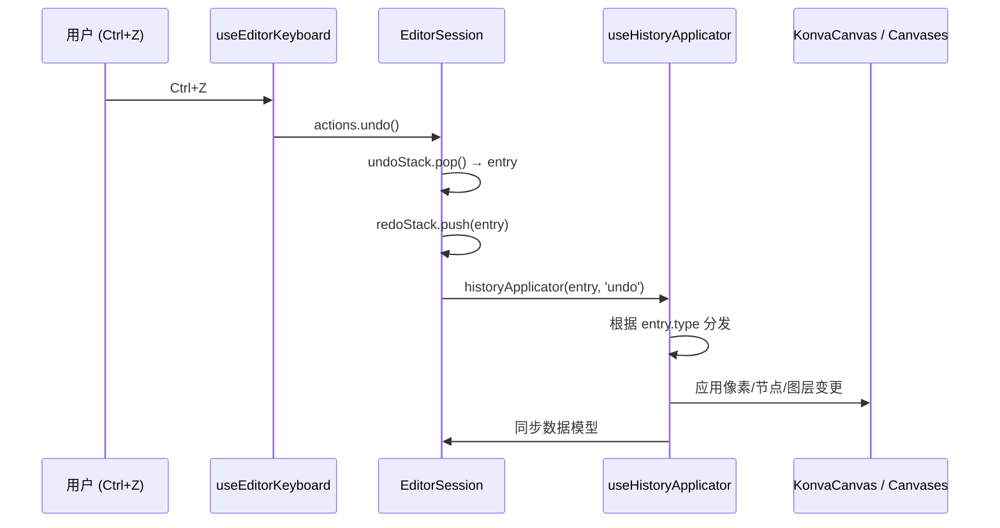

# Sketch Pad: 架构与开发者指南

本文档是 `sketch-pad` 工具的内部架构参考，面向后续开发和维护。
> 最后更新：2026-5-27

## 1. 核心概念 (Core Concepts)

`sketch-pad` 是一个轻量画板工具，支持位图手绘和矢量形状编辑，三种图层可自由混合叠加。

### 1.1. 图层架构 (Layer Architecture)

- **填充图层 (BackgroundLayer)**: 纯色或透明的背景填充层，不承载绘制内容，仅提供底色。
- **位图图层 (RasterLayer)**: 基于 HTML Canvas 2D API，用于自由手绘（铅笔、马克笔、橡皮擦）。像素数据以 PNG 格式持久化。
- **对象图层 (ObjectLayer)**: 基于 Konva.js 的矢量节点系统，用于放置可独立变换的形状（矩形、椭圆、线段、箭头、文本、图片）。对象数据以 JSON 格式持久化。
- **图层栈 (Layer Stack)**: 三种图层可以自由混合排列，通过 z-index 顺序控制叠加关系。

### 1.2. 工具与图层的自动匹配

工具分为画笔类（需要位图图层）和形状类（需要对象图层）。当用户选择的工具与当前活跃图层类型不匹配时，系统会自动切换到合适的图层，或在没有合适图层时自动创建一个。

| 类别 | 工具                                    | 快捷键                | 目标图层 |
| ---- | --------------------------------------- | --------------------- | -------- |
| 通用 | 选择 / 抓手                             | V / H                 | 任意     |
| 画笔 | 铅笔 / 马克笔 / 橡皮擦                  | B / M / E             | 位图图层 |
| 形状 | 矩形 / 椭圆 / 线段 / 箭头 / 文字 / 图片 | R / O / L / A / T / I | 对象图层 |

### 1.3. 项目与存储 (Project & Storage)

每个草图是一个独立的 `SketchProject`，采用**目录式存储**：

```
appDataDir/sketch-pad/
├── index.json              # 项目索引（元数据列表）
├── settings.json           # 全局画板设置
├── thumbnails/
│   └── {projectId}.png     # 项目缩略图
└── sketches/
    └── {projectId}/
        ├── sketch.json     # 项目 manifest（图层结构 + 资产引用）
        └── layers/
            ├── {layerId}.png   # 位图图层像素数据
            └── {layerId}.json  # 对象图层序列化数据
```

- **索引同步机制**: 系统启动时会执行 `syncIndex()`，校验索引与实际目录的一致性——移除孤儿记录、恢复未索引的项目。
- **自动保存**: 支持可配置间隔的自动保存（默认 30 秒），仅在检测到脏状态时触发。

### 1.4. 撤销/重做系统 (Hybrid History)

由于混合架构的特殊性，撤销系统需要同时处理像素级变更和对象级变更：

| 历史条目类型      | 描述           | 存储内容                              |
| ----------------- | -------------- | ------------------------------------- |
| `raster-pixels`   | 位图绘制操作   | 操作前后的完整 ImageData              |
| `object-add`      | 添加对象       | 对象序列化数据                        |
| `object-remove`   | 删除对象       | 对象序列化数据                        |
| `object-modify`   | 修改对象属性   | 变更前后的属性差异                    |
| `object-reorder`  | 对象层级调整   | 前后的 ID 顺序列表                    |
| `layer-add`       | 添加图层       | 图层完整数据 + 插入位置               |
| `layer-remove`    | 删除图层       | 图层完整数据 + 位置 + ImageData       |
| `layer-reorder`   | 图层排序       | 前后的 ID 顺序列表                    |
| `layer-modify`    | 修改图层属性   | 变更前后的属性差异                    |
| `layer-rasterize` | 栅格化对象图层 | 原始对象图层 + 新位图图层 + ImageData |

- **最大深度**: 默认保留 80 步历史记录。
- **内存策略**: 位图操作存储完整 ImageData（较大），因此历史深度需要权衡内存占用。

### 1.5. 图片资产系统 (Image Asset System)

画板中的图片对象不直接嵌入像素数据，而是通过**资产管理器**进行统一管理：

- **导入流程**: 文件选择/拖拽/粘贴 → 注册到全局 Asset Manager → 获取 `assetId` → 创建 `ImageObject` 引用。
- **资产引用表 (AssetRefs)**: manifest 中维护一张引用表，记录工程依赖了哪些资产及其使用者。
- **断链处理**: 当资产被删除或移动时，系统会显示占位图（灰色棋盘格 + 红色 X 标记），并支持通过文件哈希尝试重新关联。
- **去重**: 导入时启用 `enableDeduplication`，相同文件不会重复存储。

### 1.6. 导入/导出 (Import/Export)

- **项目文件格式 (.aiosk)**: 基于 ZIP 的自包含格式，内含 manifest.json、缩略图和所有图层文件。
- **图片导出**: 支持 PNG / JPG / WebP 三种格式，导出时以 2x 分辨率渲染。
- **增量保存**: 创建当前项目的副本，保留原项目不变。
- **发送到对话**: 将当前画布导出为 2x 分辨率的 PNG，注册为 Asset 后自动添加到 LLM Chat 的附件列表。

## 2. 架构概览

### 2.1. 目录结构

```
src/tools/sketch-pad/
├── SketchPad.vue                        # 主入口组件（Session 组装器）
├── sketch-pad.registry.ts               # 工具注册配置
├── constants.ts                         # 常量定义（颜色预设、工具类型、字体预设）
├── types/
│   └── index.ts                         # 完整类型定义
├── stores/
│   └── sketchPadStore.ts                # Pinia Store（项目索引 + 全局设置）
├── core/                                # 纯函数核心逻辑
│   ├── brush-engine.ts                  # 画笔引擎（perfect-freehand 封装）
│   ├── konva-export.ts                  # Konva 舞台导出工具
│   ├── sketch-packager.ts               # .aiosk 打包/解包
│   └── viewport-math.ts                 # 视口坐标变换
├── composables/                         # Vue Composables（状态 + 逻辑）
│   ├── useEditorSession.ts              # ★ 核心：编辑器会话（State/Runtime/Actions）
│   ├── useProjectLifecycle.ts           # 项目生命周期（打开/创建/导入/返回）
│   ├── useEditorExport.ts               # 保存/导出/发送到 Chat
│   ├── useEditorKeyboard.ts             # 快捷键系统
│   ├── useAutoSave.ts                   # 自动保存 + 智能图层切换
│   ├── useHistoryApplicator.ts          # 历史记录应用器
│   ├── useHybridHistory.ts              # 混合撤销/重做栈
│   ├── useLayerStack.ts                 # 图层栈 CRUD
│   ├── useLayerOperations.ts            # 高级图层操作（栅格化/合并）
│   ├── useImageAsset.ts                 # 图片资产管理
│   ├── useKonvaStage.ts                 # Konva 舞台管理
│   ├── useObjectLayer.ts                # 对象图层节点工厂
│   ├── useRasterBrush.ts                # 位图画笔绘制逻辑
│   ├── useSendSketchToChat.ts           # 发送到 Chat 功能
│   ├── useSketchSettings.ts             # 画板全局设置
│   ├── useSketchStorage.ts              # 项目持久化存储
│   ├── useSystemFonts.ts                # 系统字体查询
│   ├── useTextEditing.ts                # 文本就地编辑
│   └── useTransformer.ts                # 选择与变换控制
└── components/                          # UI 组件
    ├── KonvaCanvas.vue                  # 核心画布组件
    ├── Toolbar.vue                      # 悬浮工具栏
    ├── PropertyPanel.vue                # 属性面板（路由到子组件）
    ├── LayerPanel.vue                   # 图层面板
    ├── SketchGallery.vue                # 项目列表/画廊
    ├── SketchSettingsDialog.vue         # 设置对话框
    ├── TextEditor.vue                   # 文本编辑覆盖层
    └── properties/                      # 属性面板子组件
        ├── BackgroundProps.vue          # 填充图层属性
        ├── BrushProps.vue               # 画笔属性
        ├── ShapeProps.vue               # 形状属性
        ├── TextProps.vue                # 文字属性
        ├── SelectionProps.vue           # 选中对象属性（路由器）
        ├── SelectionCommonProps.vue     # 选中对象通用属性
        ├── SelectionMultiProps.vue      # 多选属性
        ├── SelectionRectProps.vue       # 矩形属性
        ├── SelectionEllipseProps.vue    # 椭圆属性
        ├── SelectionLineProps.vue       # 线段属性
        ├── SelectionArrowProps.vue      # 箭头属性
        ├── SelectionTextProps.vue       # 文本属性
        ├── SelectionImageProps.vue      # 图片属性
        ├── PropertyColorPicker.vue      # 颜色选择器
        └── PropertySlider.vue           # 滑块控件
```

### 2.2. 分层架构



### 2.3. EditorSession 架构（核心设计）

架构核心是 **EditorSession** 模式。每个编辑器实例对应一个 Session 对象，通过 Vue 的 `provide/inject` 传递给所有子组件。

```typescript
interface EditorSession {
  id: string;
  state: EditorSessionState; // 响应式状态集合
  runtime: EditorSessionRuntime; // Konva 实例 + 能力注册
  actions: EditorSessionActions; // 统一操作接口
}
```

**三层职责划分**：

| 层级    | 职责                                      | 特点                                |
| ------- | ----------------------------------------- | ----------------------------------- |
| State   | 所有响应式状态（项目、图层、工具属性等）  | 纯数据，可被任何组件读取            |
| Runtime | Konva Stage 引用、Canvas 池、Capabilities | 运行时实例，由 KonvaCanvas 注册能力 |
| Actions | 工具切换、图层操作、历史记录、选择操作    | 统一入口，确保状态变更可追踪        |

**Capabilities 模式**：KonvaCanvas 组件在挂载时通过 `runtime.registerCapabilities()` 注册自己的能力（如 `deleteSelected`、`selectAll`、`collectObjectLayerData` 等），其他模块通过 `runtime.capabilities.xxx()` 调用，实现了视图层与逻辑层的解耦。

### 2.4. 组装流程

`SketchPad.vue` 作为组装器，负责：

1. 创建 `EditorSession` 并 `provide` 给子组件树
2. 组合各功能模块（lifecycle、export、keyboard、autoSave、layerOps、historyApplicator）
3. 注册 historyApplicator 到 runtime
4. 通过额外的 `provide("sketchPadContext", ...)` 暴露模块方法给子组件
5. 在 `onMounted` 中执行初始化（加载设置、同步索引、启动自动保存）

## 3. 数据流

### 3.1. 位图绘制流程



**关键设计决策**:

- 每帧绘制时先恢复 `beforeImageData` 再重绘整条线，这是因为 `perfect-freehand` 需要全量点才能计算正确的平滑轮廓。
- 脏矩形 (Dirty Rect) 追踪用于优化历史记录的存储范围。

### 3.2. 对象创建流程



### 3.3. 项目保存流程



### 3.4. 撤销/重做流程



## 4. 功能模块详解

### 4.1. Store: sketchPadStore

**Pinia 全局状态管理器**，管理跨组件共享的持久化数据。

- **项目索引**: `projects` 列表，供画廊展示。
- **全局设置**: 委托 `useSketchSettings` 管理，包含画布默认值、工具默认值、行为设置。
- **存储引擎**: 内部持有 `useSketchStorage` 实例，供 session 内部使用。
- **项目级操作**: `syncIndex()`、`deleteProject()`、`renameProject()`。

### 4.2. useEditorSession（核心）

**编辑器会话的工厂与容器**。

- `createEditorSession()`: 工厂函数，组合 `useLayerStack` 和 `useHybridHistory`，构建完整的 State/Runtime/Actions。
- `provideEditorSession()` / `useEditorSession()`: provide/inject 对，子组件通过 `useEditorSession()` 获取当前会话。
- **State**: 项目元数据、图层栈、工具属性（画笔/形状/文字）、选择信息、脏状态、历史栈、资产引用。
- **Runtime**: Konva Stage 引用、Canvas 元素池、Capabilities 注册表、HistoryApplicator 注册。
- **Actions**: 工具切换、属性更新、图层 CRUD、历史操作、选择操作、编辑器状态管理。

### 4.3. useProjectLifecycle

**项目生命周期编排器**。

- `openProject(id)`: 加载 manifest → 设置状态 → 切换到编辑视图 → 异步加载位图像素数据。
- `createProject(data)`: 创建元数据 → 根据设置创建默认图层（填充 + 位图 + 可选对象）→ 切换到编辑视图。
- `importProject(bytes)`: 解包 .aiosk → 生成新 ID → 设置状态 → 写入位图数据。
- `goBack(saveCallback)`: 带未保存提示的返回画廊逻辑。

### 4.4. useEditorExport

**保存与导出功能集合**。

- `handleSave()`: 同步矢量数据 → 调用 storage.saveProject → 更新索引。
- `handleIncrementalSave()`: 先保存当前 → 创建副本项目。
- `handleExport(format)`: 支持 aiosk / png / jpg / webp 四种格式。
- `handleSendToChat()`: 导出 2x PNG → 注册资产 → 添加到 Chat 附件。
- `handleImportImage()`: 从文件对话框导入图片到当前对象图层。
- `handleAutoSave()`: 静默保存（不显示提示）。
- `syncObjectLayersBeforeSave()`: 从 Konva 运行时序列化矢量数据回数据模型。

### 4.5. useEditorKeyboard

**全局快捷键系统**。

- 区分**修饰键快捷键**（始终生效）和**单字母快捷键**（文本编辑时不生效）。
- 修饰键: Ctrl+S（保存）、Ctrl+Shift+S（增量保存）、Ctrl+Z/Y（撤销/重做）、Ctrl+A（全选）、Ctrl+0（重置视图）、Ctrl+±（缩放）、Ctrl+[/]（对象层级调整）。
- 单字母: V/H/B/M/E/R/O/L/A/T（工具切换）、Delete/Backspace（删除选中）。

### 4.6. useAutoSave

**自动保存系统 + 智能图层切换**。

- **定时器管理**: 根据设置间隔定时检查脏状态，触发静默保存。
- **脏状态 watcher**: 监听 `layers` 深层变化，自动标记 `isDirty`（初始化期间跳过）。
- **智能图层切换**: 监听 `activeTool` 变化，当工具与当前图层类型不匹配时自动切换/创建合适的图层。

### 4.7. useHistoryApplicator

**历史记录的实际应用逻辑**。

将 undo/redo 操作分发到具体的 Konva 画布和图层数据模型上：

- `raster-pixels`: 恢复/应用 ImageData 到对应 Canvas。
- `object-add/remove`: 创建/销毁 Konva 节点。
- `object-modify`: 逐属性设置 Konva 节点属性（含特殊映射如 Text.content → text()）。
- `object-reorder`: 调整节点 zIndex。
- `layer-add/remove/reorder/modify`: 操作图层栈数据模型。
- `layer-rasterize`: 图层类型替换 + 像素数据恢复。

### 4.8. useLayerOperations

**高级图层操作**（需要操作 Konva 运行时）。

- `rasterizeLayer(id)`: 对象图层 → 导出 DataURL → 创建位图图层 → 替换 → 绘制像素 → 记录历史。
- `mergeDown(id)`: 向下合并，支持三种组合：
  - Raster + Raster: 直接 drawImage 合并。
  - Object + Raster: 导出对象层为图片后合并到位图。
  - Object + Object: 移动 Konva 节点 + 合并 objects 数组。
  - Raster + Object: 不支持（提示用户先栅格化）。

### 4.9. useLayerStack

**图层栈的 CRUD 管理器**。

- 维护有序的图层数组和当前活跃图层 ID。
- 创建三种图层类型（自动生成 ID 和默认属性）。
- 新图层插入到当前活跃图层上方。
- 图层操作：添加、删除（至少保留一个）、可见性切换、锁定、透明度、重排序。
- 提供 `replaceLayer()` 用于栅格化等图层类型转换场景。
- 提供 `updateLayerObjects()` 用于同步 Konva 运行时数据到数据模型。

### 4.10. useHybridHistory

**混合撤销/重做栈**（纯数据结构）。

- 维护 undo/redo 两个栈，支持 10 种不同类型的历史条目。
- `pushEntry()`: 新操作入栈，自动清空 redo 栈，超过最大深度时丢弃最早记录。
- `clearHistory()`: 清空两个栈（项目切换时调用）。
- 实际的 undo/redo 弹栈逻辑在 `EditorSession.actions.undo/redo()` 中，应用逻辑委托给 `useHistoryApplicator`。

### 4.11. useSketchStorage

**项目持久化引擎**。

- 基于 Tauri FS API 实现完整的文件系统操作。
- `syncIndex()`: 启动时校验索引与目录一致性。
- `saveProject()`: 完整的保存流程（图层文件 + manifest + 缩略图 + 索引更新）。
- `loadProject()` + `loadRasterLayers()`: 分步加载（先 manifest 后像素数据）。
- `deleteProject()`: 调用 Rust 后端安全删除。

### 4.12. useKonvaStage

**Konva 舞台的生命周期管理器**。

- 初始化 Konva.Stage 实例并绑定到 DOM 容器。
- 管理视口状态（zoom, panX, panY）。
- 实现滚轮缩放（10% ~ 3000% 范围，以鼠标位置为中心）。
- 提供 `resetView()` 自适应居中显示画布。

### 4.13. useRasterBrush

**位图画笔的绘制状态机**。

- 三阶段生命周期：`startDrawing` → `draw` → `stopDrawing`。
- 内部维护笔画点数组、绘制前快照和脏矩形。
- 与 `brush-engine.ts` 协作完成平滑笔画渲染。
- 结束时自动生成历史条目。

### 4.14. useObjectLayer

**Konva 节点的工厂与序列化器**。

- `createKonvaNode(obj)`: 根据 `SketchObject` 类型分发创建对应的 Konva 节点。
- `serializeKonvaNode(node)`: 将运行时 Konva 节点反序列化为可持久化的 `SketchObject`。
- 支持图片占位节点（异步加载前的虚线矩形）。

### 4.15. useTransformer

**选择与变换控制器**。

- 管理 Konva.Transformer 实例（旋转、缩放锚点）。
- 处理点击选择逻辑（单选、Shift 多选、空白区域取消选择）。
- **框选 (Marquee Selection)**：在选择工具下拖拽空白区域画出选择矩形，松开后自动选中框内所有对象。支持 Shift+框选追加选择。框选逻辑实现在 `KonvaCanvas.vue` 中，通过包围盒相交检测判定命中对象。
- 仅对 `name="object-node"` 的节点响应选择。

### 4.16. useImageAsset

**图片资产的完整生命周期管理**。

- 多入口导入：文件对话框、字节数据、剪贴板粘贴。
- 资产注册：通过全局 `assetManagerEngine` 导入并获取 `assetId`。
- Konva 节点加载：异步获取资产 URL → 创建 `Konva.Image` 节点。
- 断链恢复：检测无效资产引用，显示占位图，预留哈希重关联接口。
- AssetRefs 维护：添加/移除引用计数，清理无使用者的引用记录。

### 4.17. useSketchSettings

**画板全局首选项管理**。

- 单例模式：多处引用共享同一份设置数据。
- 持久化到 `appDataDir/sketch-pad/settings.json`。
- 合并策略：加载时与默认值合并，确保新增字段有回退。
- 涵盖：画布尺寸、图层配置、画笔/形状/文字默认值、自动保存行为。

### 4.18. useTextEditing

**文本对象的就地编辑控制器**。

- 隐藏 Konva.Text 节点，在相同位置覆盖一个 HTML textarea。
- 动态计算 textarea 的位置、尺寸和样式（考虑舞台缩放）。
- 编辑完成后同步文本内容回 Konva 节点。

### 4.19. useSendSketchToChat

**跨工具协作桥梁**。

- 将当前画布导出为 2x PNG。
- 通过 `useAssetManager` 注册为系统资产。
- 调用 `llmChatRegistry.addAssets()` 添加到 Chat 附件。
- 自动路由跳转到 `/llm-chat`。

## 5. 核心纯函数 (Core)

### 5.1. brush-engine.ts

基于 `perfect-freehand` 库的画笔引擎封装。

- `getStrokeOutline(points, options)`: 将原始笔画点转换为平滑的轮廓多边形。根据笔刷类型（铅笔/马克笔/橡皮擦）调整 thinning、smoothing、streamline 参数。
- `drawStrokeOutline(ctx, outline, options)`: 将轮廓多边形绘制到 Canvas 2D 上下文。橡皮擦使用 `destination-out` 混合模式。

### 5.2. konva-export.ts

Konva 舞台导出工具函数。

- `exportStageToCanvas(stage, options)`: 临时重置舞台变换（平移/缩放），以文档坐标导出指定区域为 Canvas 元素。导出后自动恢复原始变换。
- `canvasToBlob(canvas, mimeType, quality)`: Canvas → Blob 的 Promise 封装。

### 5.3. sketch-packager.ts

`.aiosk` 文件格式的打包/解包器。

- `packageSketch()`: 项目 → ZIP (Uint8Array)。包含 manifest.json + thumbnail.png + layers/。
- `unpackageSketch()`: ZIP (Uint8Array) → PackagedSketch。返回 manifest、缩略图 DataURL 和位图图层数据 Map。

### 5.4. viewport-math.ts

视口坐标变换工具函数。

- `screenToDoc()`: 屏幕坐标 → 文档坐标（考虑平移和缩放）。
- `docToScreen()`: 文档坐标 → 屏幕坐标。

## 6. UI 组件

### 6.1. SketchPad.vue (Session 组装器)

主入口组件极为轻量，职责单一：

- **创建 EditorSession** 并 provide 给子组件树。
- **组合功能模块**: 实例化 lifecycle、export、keyboard、autoSave、layerOps、historyApplicator。
- **注册 historyApplicator** 到 session.runtime。
- **暴露 SketchPadContext**: 通过额外的 provide 将模块方法暴露给子组件。
- **初始化**: onMounted 中加载设置、同步索引、启动自动保存。
- **双视图切换**: `gallery`（项目列表）和 `editor`（编辑界面）。

### 6.2. KonvaCanvas.vue

核心画布渲染组件，承载所有绑定到 Konva 的交互逻辑：

- 管理 Konva.Stage 和多个 Konva.Layer 的同步。
- 处理 pointer 事件分发（根据当前工具类型路由到不同处理器）。
- 维护位图图层的 Canvas 元素池。
- 通过 `runtime.registerCapabilities()` 注册自身能力供其他模块调用。
- 暴露方法：`getStage()`、`getCanvases()`、`resetView()`、`collectObjectLayerData()` 等。

### 6.3. Toolbar.vue

悬浮工具栏，分为三个区域：

- **左侧**: 返回按钮。
- **中间**: 工具选择按钮组（通用 | 画笔 | 形状 | 撤销重做 | 视图）。
- **右侧**: 操作按钮（保存、导出、发送到 Chat）。

### 6.4. PropertyPanel.vue

悬浮属性面板（左下角），根据当前状态路由到不同的子组件：

- **无选中时**: 根据 activeTool 显示 BrushProps / ShapeProps / TextProps / BackgroundProps。
- **有选中时**: 显示 SelectionProps（内部再根据对象类型路由到具体属性组件）。

### 6.5. properties/ 子组件

属性面板的细粒度拆分：

- `BrushProps`: 画笔大小、颜色、透明度。
- `ShapeProps`: 描边宽度、描边颜色、填充颜色、圆角、虚线样式。
- `TextProps`: 字号、字体、颜色、粗体/斜体、对齐方式。
- `BackgroundProps`: 填充图层的颜色选择。
- `SelectionProps`: 选中对象的属性路由器。
- `SelectionCommonProps`: 通用属性（透明度、描边宽度、虚线）。
- `SelectionMultiProps`: 多选时的共有属性 + 对齐/分布操作。
- `Selection{Rect|Ellipse|Line|Arrow|Text|Image}Props`: 各类型对象的专属属性。
- `PropertyColorPicker` / `PropertySlider`: 可复用的属性编辑控件。

### 6.6. LayerPanel.vue

悬浮图层面板（右下角）：

- 图层列表（支持拖拽排序）。
- 图层操作：新建、删除、可见性、锁定。
- 高级操作：向下合并、栅格化。
- 对象图层展开时显示对象列表（可点击选中）。

### 6.7. SketchGallery.vue

项目画廊/列表界面：

- 网格布局展示项目缩略图。
- 新建项目对话框（预设尺寸、自定义尺寸、背景色）。
- 项目操作：打开、重命名、删除、导入 .aiosk 文件。

### 6.8. SketchSettingsDialog.vue

全局画板设置对话框：

- 新建项目默认值（画布尺寸预设）。
- 默认图层配置（是否创建填充图层/对象图层）。
- 画笔/形状/文字默认属性。
- 行为设置（自动保存开关和间隔、工具切换提示）。

## 7. 关键类型定义 (types/index.ts)

### 7.1. 项目与文件

- **`SketchProject`**: 项目元数据（ID、名称、尺寸、时间戳、缩略图路径）。
- **`HybridSketchFile`**: 项目 manifest，包含版本号、项目信息、视口状态、图层列表和资产引用表。
- **`SketchIndex`**: 项目索引（项目列表 + 上次打开的 ID）。

### 7.2. 图层

- **`HybridLayer`**: `BackgroundLayer | RasterLayer | ObjectLayer` 联合类型。
- **`LayerBase`**: 图层公共属性（ID、名称、可见性、锁定、透明度、混合模式）。
- **`BackgroundLayer`**: 填充图层，包含 `fillColor`（null = 透明）。
- **`RasterLayer`**: 位图图层，额外包含 `imagePath` 和 `imageFormat`。
- **`ObjectLayer`**: 对象图层，额外包含 `objects: SketchObject[]`。

### 7.3. 对象

- **`SketchObject`**: 六种对象类型的联合（Rect、Ellipse、Line、Arrow、Text、Image）。
- **`ObjectBase`**: 对象公共属性（ID、类型、位置、尺寸、旋转、透明度、锁定、缩放）。
- **`ImageObject`**: 特殊对象，通过 `assetId` 引用资产管理器中的图片。

### 7.4. 选择与资产

- **`SelectionInfo`**: 选中对象信息（数量、单选对象、类型列表、共有属性交集）。
- **`AssetRef`**: 资产引用记录（assetId、原始文件名、哈希、使用者列表）。
- **`ViewportState`**: 视口状态（缩放、平移 X/Y）。

### 7.5. 设置

- **`SketchPadSettings`**: 完整的画板首选项（画布默认值、图层配置、工具默认值、画布外观、行为设置）。

## 8. 外部依赖

| 依赖                        | 用途                                        | 版本要求 |
| --------------------------- | ------------------------------------------- | -------- |
| `konva`                     | 2D 画布渲染引擎（舞台、图层、节点、变换器） | -        |
| `perfect-freehand`          | 手绘笔画平滑算法                            | -        |
| `jszip`                     | .aiosk 文件打包/解包                        | -        |
| `nanoid`                    | 唯一 ID 生成                                | -        |
| `date-fns`                  | 日期格式化（项目命名）                      | -        |
| `@tauri-apps/plugin-fs`     | 文件系统读写                                | -        |
| `@tauri-apps/plugin-dialog` | 文件选择/保存对话框                         | -        |
| Asset Manager               | 全局资产管理（图片去重、URL 解析）          | 项目内置 |
| LLM Chat Registry           | 跨工具协作（发送附件到对话）                | 项目内置 |
