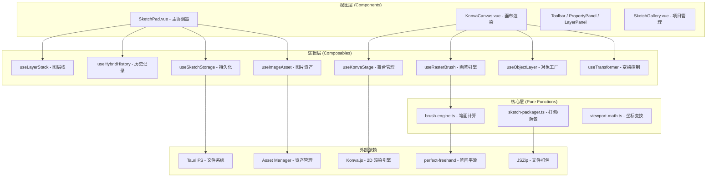
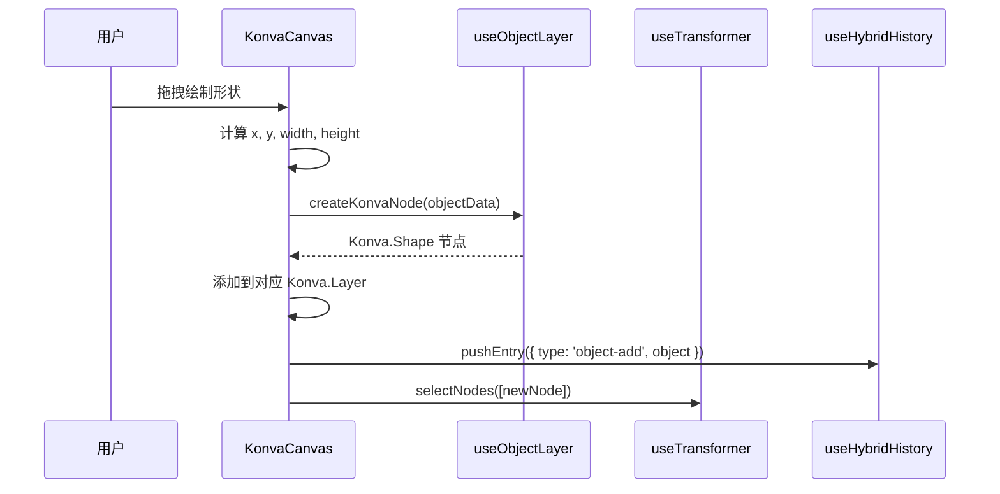
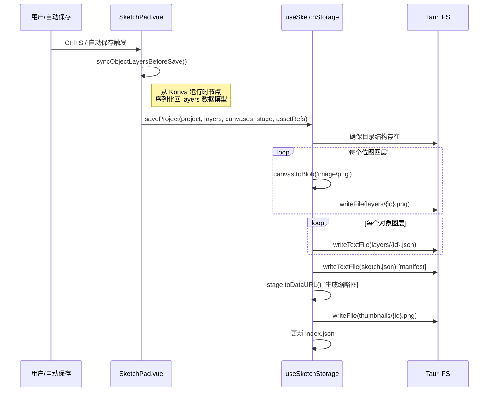

# Sketch Pad: 架构与开发者指南

本文档是 `sketch-pad` 工具的内部架构参考，面向后续开发和维护。

## 1. 核心概念 (Core Concepts)

`sketch-pad` 是一个轻量画板工具，支持位图手绘和矢量形状编辑，两种图层可自由混合叠加。

### 1.1. 图层架构 (Layer Architecture)

- **位图图层 (RasterLayer)**: 基于 HTML Canvas 2D API，用于自由手绘（铅笔、马克笔、橡皮擦）。像素数据以 PNG 格式持久化。
- **对象图层 (ObjectLayer)**: 基于 Konva.js 的矢量节点系统，用于放置可独立变换的形状（矩形、椭圆、线段、箭头、文本、图片）。对象数据以 JSON 格式持久化。
- **图层栈 (Layer Stack)**: 两种图层可以自由混合排列，通过 z-index 顺序控制叠加关系。

### 1.2. 工具与图层的自动匹配

工具分为画笔类（需要位图图层）和形状类（需要对象图层）。当用户选择的工具与当前活跃图层类型不匹配时，系统会自动切换到合适的图层，或在没有合适图层时自动创建一个。

| 类别 | 工具                                    | 快捷键                | 目标图层 |
| ---- | --------------------------------------- | --------------------- | -------- |
| 通用 | 选择 / 抓手                             | V / H                 | 任意     |
| 画笔 | 铅笔 / 马克笔 / 橡皮擦                  | B / M / E             | 位图图层 |
| 形状 | 矩形 / 椭圆 / 线段 / 箭头 / 文字 / 图片 | R / O / L / A / T / I | 对象图层 |

### 1.3. 项目与存储 (Project & Storage)

每个草图是一个独立的 `SketchProject`，采用**目录式存储**：

```

appDataDir/sketch-pad/
├── index.json # 项目索引（元数据列表）
├── settings.json # 全局画板设置
├── thumbnails/
│ └── {projectId}.png # 项目缩略图
└── sketches/
└── {projectId}/
├── sketch.json # 项目 manifest（图层结构 + 资产引用）
└── layers/
├── {layerId}.png # 位图图层像素数据
└── {layerId}.json # 对象图层序列化数据

```

- **索引同步机制**: 系统启动时会执行 `syncIndex()`，校验索引与实际目录的一致性——移除孤儿记录、恢复未索引的项目。
- **自动保存**: 支持可配置间隔的自动保存（默认 30 秒），仅在检测到脏状态时触发。

### 1.4. 撤销/重做系统 (Hybrid History)

由于混合架构的特殊性，撤销系统需要同时处理像素级变更和对象级变更：

| 历史条目类型      | 描述           | 存储内容                              |
| ----------------- | -------------- | ------------------------------------- |
| `raster-pixels`   | 位图绘制操作   | 操作前后的完整 ImageData              |
| `object-add`      | 添加对象       | 对象序列化数据                        |
| `object-remove`   | 删除对象       | 对象序列化数据                        |
| `object-modify`   | 修改对象属性   | 变更前后的属性差异                    |
| `object-reorder`  | 对象层级调整   | 前后的 ID 顺序列表                    |
| `layer-add`       | 添加图层       | 图层完整数据 + 插入位置               |
| `layer-remove`    | 删除图层       | 图层完整数据 + 位置 + ImageData       |
| `layer-reorder`   | 图层排序       | 前后的 ID 顺序列表                    |
| `layer-modify`    | 修改图层属性   | 变更前后的属性差异                    |
| `layer-rasterize` | 栅格化对象图层 | 原始对象图层 + 新位图图层 + ImageData |

- **最大深度**: 默认保留 80 步历史记录。
- **内存策略**: 位图操作存储完整 ImageData（较大），因此历史深度需要权衡内存占用。

### 1.5. 图片资产系统 (Image Asset System)

画板中的图片对象不直接嵌入像素数据，而是通过**资产管理器**进行统一管理：

- **导入流程**: 文件选择/拖拽/粘贴 → 注册到全局 Asset Manager → 获取 `assetId` → 创建 `ImageObject` 引用。
- **资产引用表 (AssetRefs)**: manifest 中维护一张引用表，记录工程依赖了哪些资产及其使用者。
- **断链处理**: 当资产被删除或移动时，系统会显示占位图（灰色棋盘格 + 红色 X 标记），并支持通过文件哈希尝试重新关联。
- **去重**: 导入时启用 `enableDeduplication`，相同文件不会重复存储。

### 1.6. 导入/导出 (Import/Export)

- **项目文件格式 (.aiosk)**: 基于 ZIP 的自包含格式，内含 manifest.json、缩略图和所有图层文件。
- **发送到对话**: 将当前画布导出为 2x 分辨率的 PNG，注册为 Asset 后自动添加到 LLM Chat 的附件列表。

## 2. 架构概览

### 2.1. 目录结构

```
src/tools/sketch-pad/
├── SketchPad.vue # 主入口组件（状态协调中心）
├── sketch-pad.registry.ts # 工具注册配置
├── constants.ts # 常量定义（颜色预设、工具类型）
├── types/
│ └── index.ts # 完整类型定义
├── core/ # 纯函数核心逻辑
│ ├── brush-engine.ts # 画笔引擎（perfect-freehand 封装）
│ ├── sketch-packager.ts # .aiosk 打包/解包
│ └── viewport-math.ts # 视口坐标变换
├── composables/ # Vue Composables（状态 + 逻辑）
│ ├── useHybridHistory.ts # 混合撤销/重做系统
│ ├── useImageAsset.ts # 图片资产管理
│ ├── useKonvaStage.ts # Konva 舞台管理
│ ├── useLayerStack.ts # 图层栈管理
│ ├── useObjectLayer.ts # 对象图层节点工厂
│ ├── useRasterBrush.ts # 位图画笔绘制逻辑
│ ├── useSendSketchToChat.ts # 发送到 Chat 功能
│ ├── useSketchSettings.ts # 画板全局设置
│ ├── useSketchStorage.ts # 项目持久化存储
│ ├── useTextEditing.ts # 文本就地编辑
│ └── useTransformer.ts # 选择与变换控制
└── components/ # UI 组件
├── KonvaCanvas.vue # 核心画布组件
├── Toolbar.vue # 悬浮工具栏
├── PropertyPanel.vue # 属性面板
├── LayerPanel.vue # 图层面板
├── SketchGallery.vue # 项目列表/画廊
├── SketchSettingsDialog.vue # 设置对话框
└── TextEditor.vue # 文本编辑覆盖层

```

### 2.2. 分层架构



## 3. 数据流

### 3.1. 位图绘制流程


**关键设计决策**:

- 每帧绘制时先恢复 `beforeImageData` 再重绘整条线，这是因为 `perfect-freehand` 需要全量点才能计算正确的平滑轮廓。
- 脏矩形 (Dirty Rect) 追踪用于优化历史记录的存储范围。

### 3.2. 对象创建流程



### 3.3. 项目保存流程



## 4. 核心逻辑 (Composables)

### 4.1. useKonvaStage

**Konva 舞台的生命周期管理器**。

- 初始化 Konva.Stage 实例并绑定到 DOM 容器。
- 管理视口状态（zoom, panX, panY）。
- 实现滚轮缩放（10% ~ 3000% 范围，以鼠标位置为中心）。
- 提供 `resetView()` 自适应居中显示画布。

### 4.2. useLayerStack

**图层栈的 CRUD 管理器**。

- 维护有序的图层数组和当前活跃图层 ID。
- 创建位图/对象图层（自动生成 ID 和默认属性）。
- 图层操作：添加、删除（至少保留一个）、可见性切换、锁定、透明度、重排序。
- 提供 `replaceLayer()` 用于栅格化等图层类型转换场景。

### 4.3. useRasterBrush

**位图画笔的绘制状态机**。

- 三阶段生命周期：`startDrawing` → `draw` → `stopDrawing`。
- 内部维护笔画点数组、绘制前快照和脏矩形。
- 与 `brush-engine.ts` 协作完成平滑笔画渲染。
- 结束时自动生成历史条目。

### 4.4. useObjectLayer

**Konva 节点的工厂与序列化器**。

- `createKonvaNode(obj)`: 根据 `SketchObject` 类型分发创建对应的 Konva 节点。
- `serializeKonvaNode(node)`: 将运行时 Konva 节点反序列化为可持久化的 `SketchObject`。
- 支持图片占位节点（异步加载前的虚线矩形）。

### 4.5. useTransformer

**选择与变换控制器**。

- 管理 Konva.Transformer 实例（旋转、缩放锚点）。
- 处理点击选择逻辑（单选、Shift 多选、空白区域取消选择）。
- 仅对 `name="object-node"` 的节点响应选择。

### 4.6. useHybridHistory

**混合撤销/重做栈**。

- 维护 undo/redo 两个栈，支持 10 种不同类型的历史条目。
- 新操作自动清空 redo 栈。
- 超过最大深度时丢弃最早的记录。
- 实际的 undo/redo 应用逻辑在 `SketchPad.vue` 的 `applyHistoryEntry()` 中实现。

### 4.7. useSketchStorage

**项目持久化引擎**。

- 基于 Tauri FS API 实现完整的文件系统操作。
- `syncIndex()`: 启动时校验索引与目录一致性。
- `saveProject()`: 完整的保存流程（图层文件 + manifest + 缩略图 + 索引更新）。
- `loadProject()` + `loadRasterLayers()`: 分步加载（先 manifest 后像素数据）。
- `deleteProject()`: 调用 Rust 后端安全删除。

### 4.8. useImageAsset

**图片资产的完整生命周期管理**。

- 多入口导入：文件对话框、字节数据、剪贴板粘贴。
- 资产注册：通过全局 `assetManagerEngine` 导入并获取 `assetId`。
- Konva 节点加载：异步获取资产 URL → 创建 `Konva.Image` 节点。
- 断链恢复：检测无效资产引用，显示占位图，预留哈希重关联接口。
- AssetRefs 维护：添加/移除引用计数，清理无使用者的引用记录。

### 4.9. useSketchSettings

**画板全局首选项管理**。

- 单例模式：多处引用共享同一份设置数据。
- 持久化到 `appDataDir/sketch-pad/settings.json`。
- 合并策略：加载时与默认值合并，确保新增字段有回退。
- 涵盖：画布尺寸、图层配置、画笔/形状/文字默认值、自动保存行为。

### 4.10. useSendSketchToChat

**跨工具协作桥梁**。

- 将当前画布导出为 2x PNG。
- 通过 `useAssetManager` 注册为系统资产。
- 调用 `llmChatRegistry.addAssets()` 添加到 Chat 附件。
- 自动路由跳转到 `/llm-chat`。

### 4.11. useTextEditing

**文本对象的就地编辑控制器**。

- 隐藏 Konva.Text 节点，在相同位置覆盖一个 HTML textarea。
- 动态计算 textarea 的位置、尺寸和样式（考虑舞台缩放）。
- 编辑完成后同步文本内容回 Konva 节点。

## 5. 核心纯函数 (Core)

### 5.1. brush-engine.ts

基于 `perfect-freehand` 库的画笔引擎封装。

- `getStrokeOutline(points, options)`: 将原始笔画点转换为平滑的轮廓多边形。根据笔刷类型（铅笔/马克笔/橡皮擦）调整 thinning、smoothing、streamline 参数。
- `drawStrokeOutline(ctx, outline, options)`: 将轮廓多边形绘制到 Canvas 2D 上下文。橡皮擦使用 `destination-out` 混合模式。

### 5.2. sketch-packager.ts

`.aiosk` 文件格式的打包/解包器。

- `packageSketch()`: 项目 → ZIP (Uint8Array)。包含 manifest.json + thumbnail.png + layers/。
- `unpackageSketch()`: ZIP (Uint8Array) → PackagedSketch。返回 manifest、缩略图 DataURL 和位图图层数据 Map。

### 5.3. viewport-math.ts

视口坐标变换工具函数。

- `screenToDoc()`: 屏幕坐标 → 文档坐标（考虑平移和缩放）。
- `docToScreen()`: 文档坐标 → 屏幕坐标。

## 6. UI 组件

### 6.1. SketchPad.vue (主协调器)

作为整个工具的状态中心和事件总线：

- **双视图切换**: `gallery`（项目列表）和 `editor`（编辑界面）。
- **状态聚合**: 组合所有 Composables，管理工具属性（颜色、大小、透明度等）。
- **智能图层切换**: 监听 `activeTool` 变化，自动匹配或创建合适的图层。
- **快捷键系统**: 全局键盘事件处理（工具切换、撤销/重做、保存、缩放）。
- **自动保存**: 基于定时器 + 脏状态检测。
- **图层高级操作**: 栅格化（对象→位图）、向下合并（支持 4 种组合）。

### 6.2. KonvaCanvas.vue

核心画布渲染组件，承载所有绑定到 Konva 的交互逻辑：

- 管理 Konva.Stage 和多个 Konva.Layer 的同步。
- 处理 pointer 事件分发（根据当前工具类型路由到不同处理器）。
- 维护位图图层的 Canvas 元素池。
- 暴露方法供父组件调用（`getStage()`, `getCanvases()`, `resetView()`, `collectObjectLayerData()` 等）。

### 6.3. Toolbar.vue

悬浮工具栏，分为三个区域：

- **左侧**: 返回按钮。
- **中间**: 工具选择按钮组（通用 | 画笔 | 形状 | 撤销重做 | 视图）。
- **右侧**: 操作按钮（保存、导出、发送到 Chat）。

### 6.4. PropertyPanel.vue

悬浮属性面板（左下角），根据当前工具类型动态显示：

- 画笔属性：大小、颜色、透明度。
- 形状属性：描边宽度、描边颜色、填充颜色、圆角。
- 文字属性：字号、颜色。
- 选择状态：选中对象的颜色和描边宽度修改。

### 6.5. LayerPanel.vue

悬浮图层面板（右下角）：

- 图层列表（支持拖拽排序）。
- 图层操作：新建、删除、可见性、锁定。
- 高级操作：向下合并、栅格化。

### 6.6. SketchGallery.vue

项目画廊/列表界面：

- 网格布局展示项目缩略图。
- 新建项目对话框（预设尺寸、自定义尺寸、背景色）。
- 项目操作：打开、重命名、删除、导入 .aiosk 文件。

### 6.7. SketchSettingsDialog.vue

全局画板设置对话框：

- 新建项目默认值（画布尺寸预设）。
- 默认图层配置。
- 画笔/形状/文字默认属性。
- 行为设置（自动保存开关和间隔）。

## 7. 关键类型定义 (types/index.ts)

### 7.1. 项目与文件

- **`SketchProject`**: 项目元数据（ID、名称、尺寸、时间戳、缩略图路径）。
- **`HybridSketchFile`**: 项目 manifest，包含版本号、项目信息、图层列表和资产引用表。
- **`SketchIndex`**: 项目索引（项目列表 + 上次打开的 ID）。

### 7.2. 图层

- **`HybridLayer`**: `RasterLayer | ObjectLayer` 联合类型。
- **`LayerBase`**: 图层公共属性（ID、名称、可见性、锁定、透明度、混合模式）。
- **`RasterLayer`**: 位图图层，额外包含 `imagePath` 和 `imageFormat`。
- **`ObjectLayer`**: 对象图层，额外包含 `objects: SketchObject[]`。

### 7.3. 对象

- **`SketchObject`**: 六种对象类型的联合（Rect、Ellipse、Line、Arrow、Text、Image）。
- **`ObjectBase`**: 对象公共属性（ID、类型、位置、尺寸、旋转、透明度、锁定）。
- **`ImageObject`**: 特殊对象，通过 `assetId` 引用资产管理器中的图片。

### 7.4. 资产与视口

- **`AssetRef`**: 资产引用记录（assetId、原始文件名、哈希、使用者列表）。
- **`ViewportState`**: 视口状态（缩放、平移 X/Y）。

### 7.5. 设置

- **`SketchPadSettings`**: 完整的画板首选项（画布默认值、图层配置、工具默认值、行为设置）。

## 8. 外部依赖

| 依赖                        | 用途                                        | 版本要求 |
| --------------------------- | ------------------------------------------- | -------- |
| `konva`                     | 2D 画布渲染引擎（舞台、图层、节点、变换器） | -        |
| `perfect-freehand`          | 手绘笔画平滑算法                            | -        |
| `jszip`                     | .aiosk 文件打包/解包                        | -        |
| `nanoid`                    | 唯一 ID 生成                                | -        |
| `date-fns`                  | 日期格式化（项目命名）                      | -        |
| `@tauri-apps/plugin-fs`     | 文件系统读写                                | -        |
| `@tauri-apps/plugin-dialog` | 文件选择/保存对话框                         | -        |
| Asset Manager               | 全局资产管理（图片去重、URL 解析）          | 项目内置 |
| LLM Chat Registry           | 跨工具协作（发送附件到对话）                | 项目内置 |
