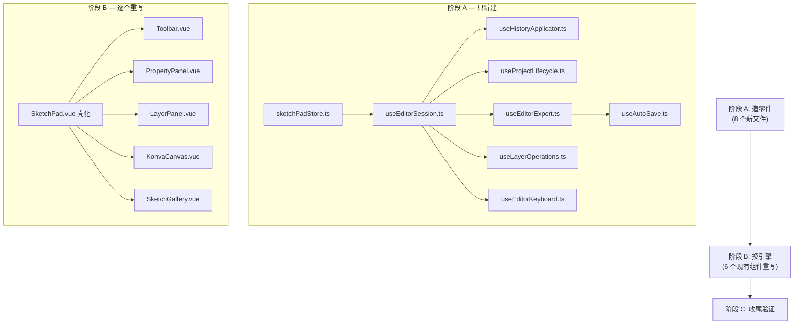

# SketchPad 编辑器架构重构计划

> 状态: Implementing (阶段 A+B+C1 完成)
> 目标: 将 SketchPad.vue (1328行) 拆分为自治子组件架构，同时为多实例（多标签页/多窗口）预留扩展能力。

## 1. 现状问题

### 1.1 SketchPad.vue 是"上帝组件"

模板 ~106 行（组合子组件做得不错），但 `<script setup>` 有 ~1220 行，承担 8+ 个职责域：

| 职责域       | 行数 | 问题                              |
| ------------ | ---- | --------------------------------- |
| 状态声明     | ~60  | 工具属性散落为独立 ref            |
| 快捷键系统   | ~120 | 巨型 switch，与组件耦合           |
| 项目管理     | ~200 | 创建/打开/删除/重命名/导入        |
| 保存/导出    | ~150 | 保存、增量保存、图片导出          |
| 属性更新     | ~60  | 简单 setter 转发                  |
| 历史应用     | ~170 | `applyHistoryEntry()` 巨型 switch |
| 图层高级操作 | ~150 | 栅格化、向下合并                  |
| 自动保存     | ~60  | 定时器 + watcher                  |

### 1.2 Props/Events 传递链过重

- **KonvaCanvas**: 18 props + 4 events + `defineExpose` 暴露 15 个方法
- **PropertyPanel**: 12 props + 8 events
- **LayerPanel**: 5 props + 9 events
- **Toolbar**: 4 props + 8 events

SketchPad.vue 是所有状态的"中转站"，任何新功能都要在主组件加 props/events。

## 2. 架构设计

### 2.1 分层总览

```
┌──────────────────────────────────────────────────────┐
│  sketchPadStore (Pinia, 全局单例)                     │
│  - projects[] (项目索引/画廊数据)                     │
│  - settings (全局画板设置)                            │
│  - activeSessionId (当前活跃编辑器实例)               │
│  - 项目级 CRUD actions (syncIndex, deleteProject...) │
└──────────────────────────────────────────────────────┘
                        │
                        ▼ 每个编辑器实例
┌──────────────────────────────────────────────────────┐
│  EditorSession (provide/inject, 按实例隔离)           │
│  ┌─ state ─────────────────────────────────────────┐ │
│  │ project, layers, activeLayerId, activeTool,     │ │
│  │ isDirty, selectionInfo, assetRefs,              │ │
│  │ brushSize/Color/Opacity, strokeWidth/Color,     │ │
│  │ fillColor, cornerRadius, fontSize, textColor... │ │
│  │ undoStack, redoStack                            │ │
│  └─────────────────────────────────────────────────┘ │
│  ┌─ runtime ───────────────────────────────────────┐ │
│  │ stage: ShallowRef<Konva.Stage>                  │ │
│  │ canvases: Map<layerId, HTMLCanvasElement>        │ │
│  │ capabilities (由 KonvaCanvas 注册)              │ │
│  └─────────────────────────────────────────────────┘ │
│  ┌─ actions ───────────────────────────────────────┐ │
│  │ selectTool, updateBrush, updateShape, updateText│ │
│  │ addLayer, deleteLayer, toggleVisible, reorder   │ │
│  │ pushHistory, undo, redo                         │ │
│  │ save, export, sendToChat                        │ │
│  │ openProject, markDirty, applySettingsDefaults   │ │
│  └─────────────────────────────────────────────────┘ │
└──────────────────────────────────────────────────────┘
                        │
                        ▼ 子组件直接 inject
┌──────────────────────────────────────────────────────┐
│  KonvaCanvas / Toolbar / PropertyPanel / LayerPanel   │
│  (零 props 或极少 props，自治读写)                    │
└──────────────────────────────────────────────────────┘
```

### 2.2 多实例预留机制

```typescript
// 当前：单实例
const session = createEditorSession();
provideEditorSession(session);

// 未来：多标签页
const sessions = new Map<string, EditorSession>();
function openInNewTab(projectId: string) {
  const session = createEditorSession();
  sessions.set(session.id, session);
  // 每个标签页组件 provide 自己的 session
}
```

关键设计：

- `createEditorSession()` 是工厂函数，每次调用返回完全独立的状态实例
- 子组件通过 `useEditorSession()` inject，天然绑定到最近的 provider
- 全局 store 只管"哪些实例存在"和"项目索引"，不管编辑器内部状态

### 2.3 文件结构规划

```
src/tools/sketch-pad/
├── SketchPad.vue                    # 入口 (~80行)：provide session + 挂载子组件
├── stores/
│   └── sketchPadStore.ts            # Pinia 全局 Store：项目索引 + 设置 + 实例管理
├── composables/
│   ├── useEditorSession.ts          # 🆕 EditorSession 工厂 + provide/inject
│   ├── useEditorKeyboard.ts         # 🆕 快捷键系统（从 session 读状态）
│   ├── useAutoSave.ts               # 🆕 自动保存定时器
│   ├── useHistoryApplicator.ts      # 🆕 applyHistoryEntry 逻辑
│   ├── useProjectLifecycle.ts       # 🆕 项目打开/创建/导入的编排逻辑
│   ├── useEditorExport.ts           # 🆕 保存/导出/发送到 Chat
│   ├── useLayerOperations.ts        # 🆕 栅格化/合并等高级图层操作
│   ├── useHybridHistory.ts          # (保留，纯栈管理)
│   ├── useLayerStack.ts             # (保留，纯图层 CRUD，被 session 内部使用)
│   ├── useSketchStorage.ts          # (保留，持久化引擎)
│   ├── useSketchSettings.ts         # (保留，设置管理)
│   ├── useImageAsset.ts             # (保留)
│   ├── useSendSketchToChat.ts       # (保留)
│   ├── useKonvaStage.ts             # (保留，被 KonvaCanvas 内部使用)
│   ├── useRasterBrush.ts            # (保留)
│   ├── useObjectLayer.ts            # (保留)
│   ├── useTransformer.ts            # (保留)
│   ├── useTextEditing.ts            # (保留)
│   └── useSystemFonts.ts            # (保留)
├── components/                       # 子组件改为自治模式
│   ├── KonvaCanvas.vue              # 去掉 18 props，从 session 读取
│   ├── Toolbar.vue                  # 去掉 props/events，直接操作 session
│   ├── PropertyPanel.vue            # 去掉 props/events，直接读写 session
│   ├── LayerPanel.vue               # 去掉 props/events，直接读写 session
│   ├── SketchGallery.vue            # 从全局 store 读项目列表
│   └── ...
└── ...
```

## 3. 核心接口设计

### 3.1 EditorSession 接口

```typescript
// composables/useEditorSession.ts

export interface EditorSessionState {
  // 项目
  project: Ref<SketchProject | null>;

  // 图层
  layers: Ref<HybridLayer[]>;
  activeLayerId: Ref<string>;
  activeLayer: ComputedRef<HybridLayer | null>;

  // 工具
  activeTool: Ref<ToolType>;

  // 画笔属性
  brushSize: Ref<number>;
  brushColor: Ref<string>;
  brushOpacity: Ref<number>;

  // 形状属性
  strokeWidth: Ref<number>;
  strokeColor: Ref<string>;
  fillColor: Ref<string | null>;
  cornerRadius: Ref<number>;

  // 文字属性
  fontSize: Ref<number>;
  textColor: Ref<string>;
  fontFamily: Ref<string>;
  fontWeight: Ref<"normal" | "bold">;
  fontStyle: Ref<"normal" | "italic">;
  textAlign: Ref<"left" | "center" | "right">;

  // 选择
  selectionInfo: Ref<SelectionInfo>;

  // 编辑器状态
  isDirty: Ref<boolean>;
  isInitializing: Ref<boolean>;

  // 历史
  canUndo: ComputedRef<boolean>;
  canRedo: ComputedRef<boolean>;

  // 资产
  assetRefs: Ref<AssetRef[]>;
}

export interface EditorSessionRuntime {
  stage: ShallowRef<Konva.Stage | null>;
  canvases: Map<string, HTMLCanvasElement>;

  // KonvaCanvas 注册的能力
  registerCapabilities(caps: Partial<CanvasCapabilities>): void;
  capabilities: CanvasCapabilities;
}

export interface CanvasCapabilities {
  deleteSelected(): void;
  selectAll(): void;
  resetView(): void;
  collectObjectLayerData(): Map<string, SketchObject[]>;
  getSelectionInfo(): SelectionInfo;
  updateSelectionProp(key: string, value: any): void;
  updateSelectionProps(data: Record<string, any>): void;
  alignSelection(dir: string): void;
  distributeSelection(dir: string): void;
  selectObjectById(id: string): void;
  reorderObjectsInLayer(layerId: string, order: string[]): void;
  reorderSelectedObject(action: string): void;
  addImageToActiveLayer(img: ImageObject): Promise<void>;
  createKonvaNode(obj: SketchObject): any;
  getZoom(): number;
}

export interface EditorSessionActions {
  // 工具
  selectTool(tool: ToolType): void;
  updateBrush(data: { size?: number; color?: string; opacity?: number }): void;
  updateShape(data: {
    strokeWidth?: number;
    strokeColor?: string;
    fillColor?: string | null;
    cornerRadius?: number;
  }): void;
  updateText(data: {
    fontSize?: number;
    color?: string;
    fontFamily?: string;
    fontWeight?: string;
    fontStyle?: string;
    textAlign?: string;
  }): void;

  // 图层
  addLayer(type: "raster" | "object", name?: string): HybridLayer;
  deleteLayer(id: string): boolean;
  toggleVisible(id: string): void;
  toggleLocked(id: string): void;
  reorderLayers(newOrder: string[]): void;

  // 历史
  pushHistory(entry: HistoryEntry): void;
  undo(): void;
  redo(): void;

  // 选择
  updateSelectionProp(key: string, value: any): void;
  updateSelectionProps(data: Record<string, any>): void;
  alignSelection(dir: string): void;
  distributeSelection(dir: string): void;
  deleteSelected(): void;

  // 编辑器
  markDirty(): void;
  resetSelection(): void;
  applySettingsDefaults(): void;

  // 保存/导出
  save(): Promise<void>;
  incrementalSave(): Promise<void>;
  exportAs(format: "aiosk" | "png" | "jpg" | "webp"): Promise<void>;
  sendToChat(): Promise<void>;
  importImage(): Promise<void>;

  // 图层高级操作
  rasterizeLayer(id: string): Promise<void>;
  mergeDown(id: string): Promise<void>;
}

export interface EditorSession {
  id: string; // 实例唯一 ID（多实例预留）
  state: EditorSessionState;
  runtime: EditorSessionRuntime;
  actions: EditorSessionActions;
}
```

### 3.2 工厂函数

```typescript
export function createEditorSession(): EditorSession {
  const id = nanoid();

  // 内部组合已有 composables
  const layerStack = useLayerStack();
  const history = useHybridHistory();
  // ... 其他状态初始化

  const state: EditorSessionState = {
    project: ref(null),
    layers: layerStack.layers,
    activeLayerId: layerStack.activeLayerId,
    activeLayer: layerStack.activeLayer,
    activeTool: ref<ToolType>("select"),
    // ... 所有属性
  };

  const runtime: EditorSessionRuntime = {
    stage: shallowRef(null),
    canvases: new Map(),
    capabilities: {
      /* noop defaults */
    },
    registerCapabilities(caps) {
      Object.assign(this.capabilities, caps);
    },
  };

  const actions: EditorSessionActions = {
    selectTool(tool) {
      state.activeTool.value = tool;
    },
    // ... 所有 actions
  };

  return { id, state, runtime, actions };
}
```

### 3.3 provide/inject

```typescript
const EDITOR_SESSION_KEY: InjectionKey<EditorSession> = Symbol("EditorSession");

export function provideEditorSession(session: EditorSession) {
  provide(EDITOR_SESSION_KEY, session);
  return session;
}

export function useEditorSession(): EditorSession {
  const session = inject(EDITOR_SESSION_KEY);
  if (!session) {
    throw new Error("useEditorSession must be used within a SketchPad editor");
  }
  return session;
}
```

### 3.4 全局 Store

```typescript
// stores/sketchPadStore.ts
export const useSketchPadStore = defineStore("sketchPad", () => {
  // 项目索引（画廊用）
  const projects = ref<SketchProject[]>([]);

  // 全局设置
  const { settings, loadSettings } = useSketchSettings();

  // 多实例管理预留
  const activeSessionId = ref<string | null>(null);

  // 项目级操作
  const storage = useSketchStorage();

  async function syncIndex() { ... }
  async function deleteProject(id: string) { ... }
  async function renameProject(id: string, name: string) { ... }

  return {
    projects,
    settings,
    activeSessionId,
    syncIndex,
    deleteProject,
    renameProject,
    loadSettings,
  };
});
```

## 4. 子组件改造示例

### 4.1 Toolbar.vue (改造后)

```vue
<template>
  <!-- 模板不变 -->
</template>

<script setup lang="ts">
import { useEditorSession } from "../composables/useEditorSession";

const { state, actions } = useEditorSession();

// 直接读状态
const activeTool = state.activeTool;
const canUndo = state.canUndo;
const canRedo = state.canRedo;
const isDirty = state.isDirty;

// 直接调 actions
function selectTool(tool: ToolType) {
  actions.selectTool(tool);
}
function handleUndo() {
  actions.undo();
}
function handleRedo() {
  actions.redo();
}
function handleSave() {
  actions.save();
}
function handleExport(format: string) {
  actions.exportAs(format);
}
function handleSendToChat() {
  actions.sendToChat();
}
function handleImportImage() {
  actions.importImage();
}
function handleResetView() {
  /* runtime.capabilities.resetView() */
}
</script>
```

### 4.2 PropertyPanel.vue (改造后)

```vue
<script setup lang="ts">
import { useEditorSession } from "../composables/useEditorSession";

const { state, actions } = useEditorSession();

// 直接读
const activeTool = state.activeTool;
const brushSize = state.brushSize;
const brushColor = state.brushColor;
// ...

// 直接写
function onBrushUpdate(data) {
  actions.updateBrush(data);
}
function onShapeUpdate(data) {
  actions.updateShape(data);
}
</script>
```

### 4.3 KonvaCanvas.vue (改造后)

```vue
<script setup lang="ts">
import { useEditorSession } from "../composables/useEditorSession";

// 仅保留画布尺寸 props（来自 project，或可从 session 读）
const { state, runtime, actions } = useEditorSession();

onMounted(() => {
  // 初始化 Konva Stage
  const newStage = initStage(...);
  runtime.stage.value = newStage;

  // 注册能力
  runtime.registerCapabilities({
    deleteSelected: () => { ... },
    resetView: () => { ... },
    collectObjectLayerData: () => { ... },
    // ...
  });
});

// 直接 watch session state
watch(() => state.layers.value, () => syncLayers());
watch(() => state.activeLayerId.value, () => updateLayerInteractivity());
watch(() => state.activeTool.value, (tool) => { ... });

// 绘制时直接读 state.brushSize.value 等
// 历史记录直接调 actions.pushHistory(entry)
</script>
```

## 5. 施工执行计划

> **施工策略: Big Bang 式重构**
>
> 拒绝渐进式迁移。渐进式会产生大量中间态类型错误，导致 AI 被报错牵着鼻子走、施工停滞。
>
> 核心原则：
>
> 1. **阶段 A（造零件）**：一次性写完所有新文件，不动任何旧文件
> 2. **阶段 B（换引擎）**：逐个重写现有组件，中途不管报错，不做兼容性桥接
> 3. **阶段 C（收尾）**：全部切完后统一跑 `check:frontend` 修类型

---

### 阶段 A：造零件（只新建，不动旧文件）

本阶段产出的所有文件互相引用、引用现有 composables，但**不修改任何现有文件**。


**施工清单（按依赖顺序）：**

| #   | 文件                                  | 职责                                           | 依赖                                                 |
| --- | ------------------------------------- | ---------------------------------------------- | ---------------------------------------------------- |
| A1  | `stores/sketchPadStore.ts`            | 全局 Pinia Store：项目索引 + 设置 + 实例管理   | useSketchSettings, useSketchStorage                  |
| A2  | `composables/useEditorSession.ts`     | EditorSession 工厂 + provide/inject + 接口定义 | useLayerStack, useHybridHistory, types               |
| A3  | `composables/useHistoryApplicator.ts` | applyHistoryEntry 巨型 switch 逻辑             | EditorSession                                        |
| A4  | `composables/useProjectLifecycle.ts`  | 项目打开/创建/导入的编排                       | EditorSession, sketchPadStore, useSketchStorage      |
| A5  | `composables/useEditorExport.ts`      | 保存/导出/发送到 Chat                          | EditorSession, useSketchStorage, useSendSketchToChat |
| A6  | `composables/useLayerOperations.ts`   | 栅格化/向下合并等高级图层操作                  | EditorSession                                        |
| A7  | `composables/useAutoSave.ts`          | 自动保存定时器 + watcher                       | EditorSession, useEditorExport                       |
| A8  | `composables/useEditorKeyboard.ts`    | 快捷键系统（从 session 读状态调 actions）      | EditorSession                                        |

**施工节奏：**

- A1-A2 是地基，必须先写
- A3-A8 互相独立，可以任意顺序写，也可以并行
- 每个文件写完即完整可用（对外接口稳定），不存在"半成品"

---

### 阶段 B：换引擎（逐个重写现有组件）

本阶段逐个修改现有 `.vue` 文件，让它们切换到新架构。

**核心纪律：**

- ❌ 不做兼容性桥接（不保留旧 props 的同时加新 inject）
- ❌ 不中途跑 check 修报错（等全部切完再统一修）
- ✅ 每个文件一步到位改成最终形态

**施工顺序（从根到叶）：**

| #   | 文件                | 改动要点                                                                                                          |
| --- | ------------------- | ----------------------------------------------------------------------------------------------------------------- |
| B1  | `SketchPad.vue`     | 壳化：createEditorSession() + provide + 挂载子组件 + 调用 useEditorKeyboard/useAutoSave。从 ~1328 行瘦身到 ~80 行 |
| B2  | `Toolbar.vue`       | 去掉所有 props/emits，inject session，直接读 state 调 actions                                                     |
| B3  | `PropertyPanel.vue` | 去掉所有 props/emits，inject session                                                                              |
| B4  | `LayerPanel.vue`    | 去掉所有 props/emits，inject session                                                                              |
| B5  | `KonvaCanvas.vue`   | 去掉 18 props + defineExpose，inject session，注册 capabilities 到 runtime                                        |
| B6  | `SketchGallery.vue` | 从全局 sketchPadStore 读项目列表，通过 session.actions 打开项目                                                   |

**为什么从根（SketchPad.vue）开始：**

- SketchPad.vue 是 provide 的源头，先改它才能让子组件 inject 到 session
- 中途子组件还在用旧 props 会报错——但我们不管，继续往下改
- 等 B1-B6 全部完成，整个组件树就是新架构了

---

### 阶段 C：收尾验证

| #   | 任务                                                               |
| --- | ------------------------------------------------------------------ |
| C1  | 运行 `check:frontend`，统一修复所有类型错误                        |
| C2  | 手动冒烟测试核心流程：创建项目 → 画笔绘制 → 图层操作 → 保存 → 导出 |
| C3  | 删除旧的无用代码（如果有残留）                                     |
| C4  | 更新 `ARCHITECTURE.md`                                             |

---

### 施工流程图



---

### 给 AI 施工者的指令

1. **阶段 A 的每个文件必须写完整** — 包含完整的类型定义、所有 actions 实现、错误处理。不留 `// TODO` 或 `// ...`。
2. **阶段 A 写完后不要急着改旧文件** — 先确认 8 个新文件全部就位。
3. **阶段 B 改每个组件时，直接写最终形态** — 不要"先加 inject 再删 props"这种两步走。一步到位。
4. **阶段 B 中途出现的类型错误全部忽略** — 这些错误会在所有组件切完后自然消失。
5. **如果某个 action 的实现需要参考旧代码** — 先 read_file 看旧实现，然后在新文件中重写，不要复制粘贴后微调。

## 6. 多实例扩展路径（未来）

当需要支持多标签页时：

```typescript
// SketchPad.vue 变为标签页容器
const sessions = reactive(new Map<string, EditorSession>());
const activeSessionId = ref<string>("");

function openProject(projectId: string) {
  const session = createEditorSession();
  sessions.set(session.id, session);
  activeSessionId.value = session.id;
  session.actions.loadProject(projectId);
}

// 每个标签页渲染一个 EditorView，各自 provide 自己的 session
// <EditorView v-for="[id, session] in sessions" :key="id" :session="session" />
```

由于子组件全部通过 `useEditorSession()` inject，切换标签页时只需切换 provide 的 session 实例，子组件自动响应。

## 7. 风险与注意事项

| 风险                              | 缓解                                                 |
| --------------------------------- | ---------------------------------------------------- |
| provide/inject 在 v-if 切换时丢失 | Gallery 和 Editor 共享同一个 provide 层级            |
| KonvaCanvas capabilities 注册时序 | 用 noop 默认值，调用前检查 stage 是否就绪            |
| 多实例时内存泄漏                  | session 销毁时清理 canvases、stage、定时器           |
| Big Bang 切换期间项目不可运行     | 阶段 B 期间不尝试启动应用，全部切完后阶段 C 统一验证 |
| 阶段 A 新文件与旧代码接口不匹配   | 写新文件时 read_file 旧实现确认接口签名，而非凭记忆  |
| runtime 中的 Map 不是响应式的     | canvases 不需要响应式（只有 KonvaCanvas 内部使用）   |


## SketchPad 编辑器架构重构 — 施工质量检查报告

### 总体评价：✅ 合格，架构目标达成

`check:frontend` (vue-tsc --noEmit) 通过，零类型错误。阶段 A+B+C1 的施工清单全部完成。

---

### 阶段 A（造零件）— ✅ 8/8 完成

| # | 文件 | 状态 | 质量评价 |
|---|------|------|----------|
| A1 | `stores/sketchPadStore.ts` | ✅ | 100行，职责清晰：项目索引 + 设置 + 存储引擎暴露。遵循 `createModuleErrorHandler` 规范。 |
| A2 | `composables/useEditorSession.ts` | ✅ | 465行，核心地基。接口定义完整，工厂函数实现干净，provide/inject 正确。 |
| A3 | `composables/useHistoryApplicator.ts` | ✅ | 273行，巨型 switch 拆解到位，每种 entry type 独立函数。 |
| A4 | `composables/useProjectLifecycle.ts` | ✅ | 277行，打开/创建/导入/返回画廊逻辑完整，`lockScroll: false` 已遵守。 |
| A5 | `composables/useEditorExport.ts` | ✅ | 260行，保存/增量保存/导出/发送到Chat/导入图片。CSP 规范（不用 fetch data URL）已遵守。 |
| A6 | `composables/useLayerOperations.ts` | ✅ | 211行，栅格化/向下合并四种组合（R+R, O+R, R+O, O+O）覆盖完整。 |
| A7 | `composables/useAutoSave.ts` | ✅ | 105行，定时器 + 脏状态 watcher + 智能图层切换提示。`onUnmounted` 清理到位。 |
| A8 | `composables/useEditorKeyboard.ts` | ✅ | 185行，修饰键/单字母快捷键分离，文本编辑状态正确屏蔽。 |

---

### 阶段 B（换引擎）— ✅ 6/6 完成

| # | 文件 | 改造结果 |
|---|------|----------|
| B1 | `SketchPad.vue` | **~1328行 → 120行**。壳化成功：createEditorSession + provide + 组合模块 + 额外 context provide。 |
| B2 | `Toolbar.vue` | 零 props/emits，通过 `useEditorSession()` + `inject("sketchPadContext")` 自治。 |
| B3 | `PropertyPanel.vue` | 零 props/emits，直接从 session 读状态调 actions。子属性组件仍保留 props（合理，它们是纯展示组件）。 |
| B4 | `LayerPanel.vue` | 零 props/emits，inject session + context。对象列表展开/排序逻辑完整。 |
| B5 | `KonvaCanvas.vue` | **去掉了 18 props + defineExpose**，改为 inject session + 注册 capabilities。1923行（画布逻辑本身复杂，合理）。 |
| B6 | `SketchGallery.vue` | 从全局 store 读项目列表，通过 context.lifecycle 操作项目。 |

---

### 阶段 C1（类型检查）— ✅ 通过

`bun run check:frontend` → exit code 0，零错误。

---

### 发现的设计偏差（非阻塞，记录备查）

1. **KonvaCanvas 的"兼容层"模式**：计划中说"去掉 18 props"，实际实现用了一个 getter-based `props` 对象 + `emit` 函数做桥接（第82-116行），而非直接在所有位置使用 `state.xxx.value`。这是务实的选择——避免了 1900 行代码的全量改写，但留下了一层间接性。未来如果要进一步清理，可以逐步替换。

2. **额外的 provide("sketchPadContext")**：计划中设想子组件"零 props，自治读写 session"，实际实现中 Toolbar/LayerPanel/SketchGallery 还需要 inject 一个 `sketchPadContext` 来访问 lifecycle/exportActions/layerOps 等模块方法。这是因为这些模块不属于 EditorSession 本身（它们依赖 session 但不是 session 的一部分）。设计上合理，只是比计划多了一层 inject。

3. **undo/redo 逻辑分散**：`useEditorKeyboard` 中的 `handleUndo/handleRedo` 直接操作 stack 并调用 `historyApplicator.applyHistoryEntry`，而 `session.actions.undo/redo` 只做 stack 操作不调用 applicator。Toolbar 的撤销/重做按钮调用的是 `ctx.keyboard.handleUndo()`。这意味着 `session.actions.undo()` 实际上是个"半成品"——它移动了栈但没有应用变更。建议后续统一入口。

4. **`useAutoSave` 中的动态 import**：第68/81行用了 `import("@/utils/customMessage").then(...)` 而非顶层 import。文件顶部并没有 import `customMessage`，但这个模块在同目录其他文件中都是静态 import 的。可能是为了避免循环依赖，但看起来更像是遗漏。

---

### 结论

重构目标**已达成**：
- SketchPad.vue 从 1328 行瘦身到 120 行 ✅
- Props/Events 传递链消除，子组件自治 ✅  
- EditorSession 工厂 + provide/inject 架构就位 ✅
- 多实例预留机制（createEditorSession 工厂模式）✅
- 类型安全通过 ✅

剩余 C2-C4（手动冒烟测试、清理残留、更新架构文档）待后续执行。

手动操作测试完成