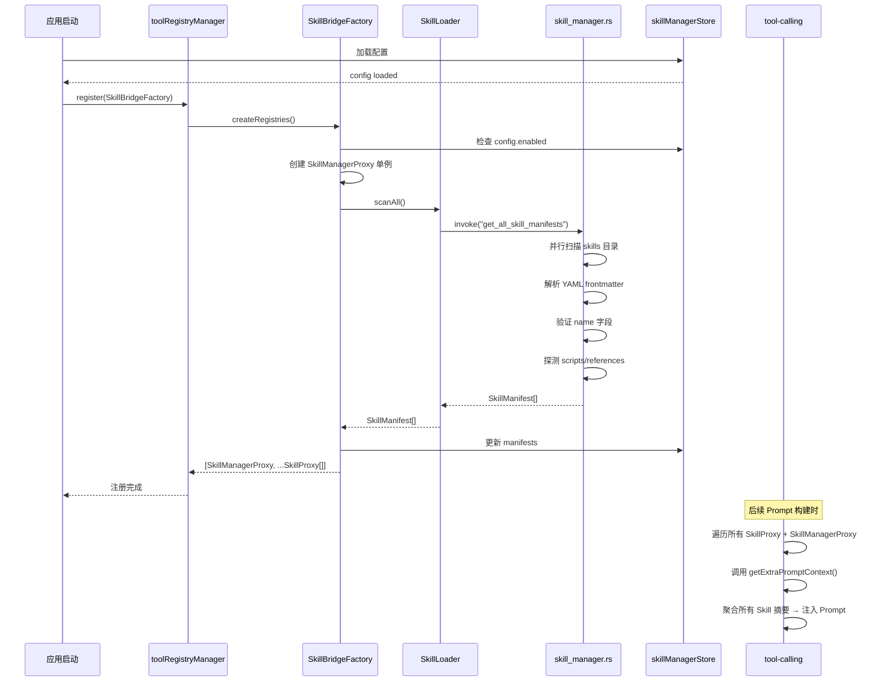
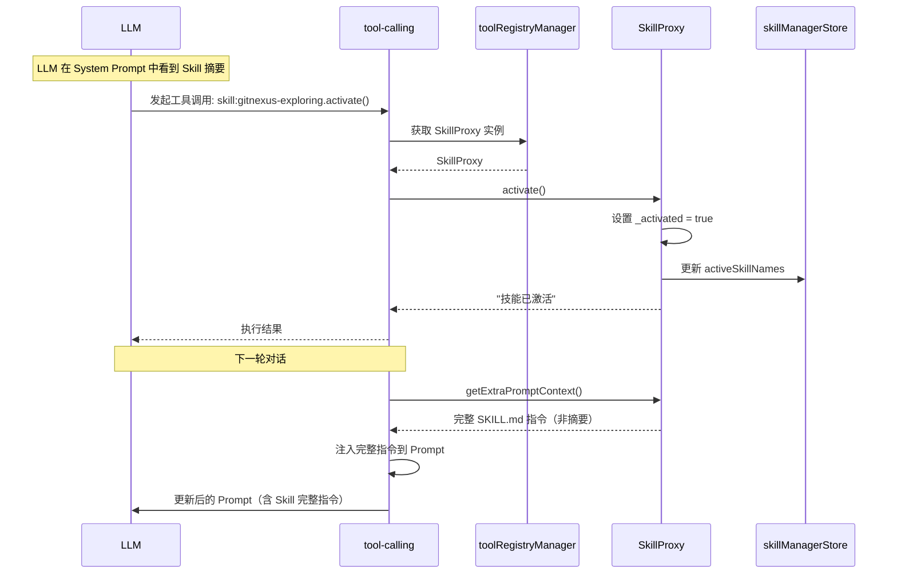
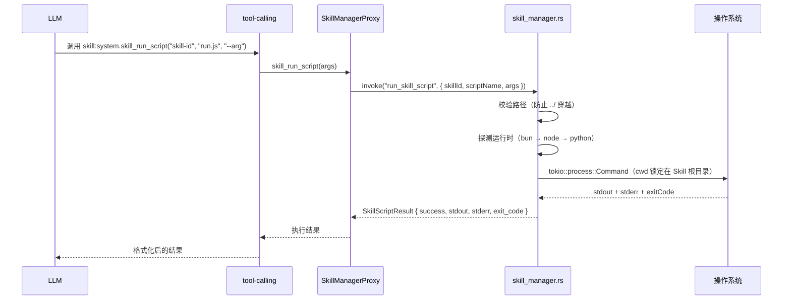

# Skill 管理模块：架构设计报告

> **状态**: Final Draft（Rust 驱动架构，待批准实施）
> **日期**: 2026-05-03
> **作者**: 咕咕 (Kilo)
> **参考**: [VcpBridgeFactory](../../src/tools/vcp-connector/services/VcpBridgeFactory.ts), [ToolRegistryFactory](../../src/services/types.ts:217), [Agent Skills Spec](https://agentskills.io/llms.txt), [Sidecar 插件执行模块](../../src-tauri/src/commands/sidecar_plugin.rs), [file_operations Rust 命令](../../src-tauri/src/commands/file_operations.rs)

---

## 1. 背景与动机

### 1.1. 什么是 Skill？

Skill（技能）是 **Agent Skills 规范**定义的一种可复用能力包。每个 Skill 是一个包含 `SKILL.md` 文件的目录，以 YAML 前置元数据 + Markdown 指令的形式，为 AI Agent 提供特定领域的知识、操作指南和可选的可执行脚本。

### 1.2. 当前状态

项目中有两套 Skill 存在形式：

| 位置              | 用途                          | 归属                           |
| ----------------- | ----------------------------- | ------------------------------ |
| `.claude/skills/` | 开发车间用的 Claude Code 技能 | **不属于 AIO**（开发辅助工具） |
| 待建设            | AIO 内供用户/LLM 使用的 Skill | **本次建设目标**               |

### 1.3. 目标

在 AIO 中构建 **Skill 管理模块**（`skill-manager`），使其能够：

1. **加载 Skill**：从用户 appData 目录和 AIO 内置目录扫描、解析、验证 SKILL.md
2. **桥接 Skill**：参考 `VcpBridgeFactory` 的工厂模式，将每个 Skill 包装为 `ToolRegistry` 实例，注册到 `toolRegistryManager`；同时注册系统级的 SkillManagerProxy 提供通用 CLI 和文件读取能力
3. **注入指令**：通过 `getExtraPromptContext()` 将 Skill 指令按需注入 LLM Prompt
4. **管理 UI**：提供可视化界面，支持浏览、启用/禁用、安装 Skill

### 1.4. 核心设计原则

- **与现有工具系统无缝对齐**：复用 `ToolRegistry` + `ToolRegistryFactory` + `toolRegistryManager` 体系，不引入新的抽象层
- **参考成熟实现**：以 `VcpBridgeFactory` 为蓝本，适配本地文件系统扫描场景
- **渐进式加载**：遵循 Agent Skills 规范的"渐进式披露"理念，最小化 Prompt 占用
- **Backend-First 架构**：Skill 的扫描、YAML 解析、脚本执行和安全审计下沉到 Rust 后端（`src-tauri/src/commands/skill_manager.rs`），前端 TS 层仅负责协议适配与 UI 呈现。该决策基于以下调研结论：
  - **安全性**：Rust 侧可强制执行路径沙箱，防止 Skill 脚本通过 `../` 越权访问系统文件
  - **性能**：利用 `ignore` crate 并行扫描大量 Skill 目录，减少 IPC 往返开销
  - **基础设施复用**：Rust 侧已有 `SidecarExecuteRequest`（进程管理）、`PluginManifest`（清单解析）、`read_text_file_force`（文件读取）等成熟组件

---

## 2. Skill 规范要点

基于 [Agent Skills 规范](https://agentskills.io/llms.txt)，Skill 的核心结构：

```
skill-name/
├── SKILL.md          # 必需：YAML frontmatter + Markdown 指令
├── scripts/          # 可选：可执行脚本（Python/Bash/JS）
├── references/       # 可选：补充文档
├── assets/           # 可选：模板、资源文件
└── ...
```

### 2.1. SKILL.md Frontmatter

| 字段            | 必需 | 约束                                   |
| --------------- | ---- | -------------------------------------- |
| `name`          | ✅   | 1-64 字符，小写字母+连字符，匹配目录名 |
| `description`   | ✅   | 1-1024 字符，描述功能和使用时机        |
| `license`       | ❌   | 许可证名称                             |
| `compatibility` | ❌   | 环境要求说明                           |
| `metadata`      | ❌   | 任意键值对（如 author, version）       |
| `allowed-tools` | ❌   | 预批准的工具列表（实验性）             |

### 2.2. 渐进式披露

规范定义了三级加载策略：

1. **Metadata**（~100 tokens）：启动时加载所有 Skill 的 name + description
2. **Instructions**（< 5000 tokens 推荐）：Skill 激活时加载 SKILL.md 全文
3. **Resources**（按需）：scripts/references/assets 仅在 LLM 请求时加载

---

## 3. 模块架构总览

### 3.1. 文件结构

```
├── src/tools/skill-manager/            # 前端 TS 层（协议适配 + UI）
│   ├── types/
│   │   └── index.ts                    # Skill 相关类型定义（与 Rust 侧结构体对齐）
│   ├── services/
│   │   ├── SkillLoader.ts              # 薄封装层：调用 Rust 命令获取清单 + 缓存
│   │   ├── SkillBridgeFactory.ts       # 桥接工厂（实现 ToolRegistryFactory）
│   │   ├── SkillProxy.ts               # 技能代理（实现 ToolRegistry）
│   │   └── SkillManagerProxy.ts        # 系统级代理（实现 ToolRegistry，调用 Rust 命令执行脚本）
│   ├── stores/
│   │   └── skillManagerStore.ts        # 技能管理 Store
│   ├── composables/
│   │   └── useSkillManager.ts          # 技能管理 Composable
│   ├── components/
│   │   ├── SkillManagerPage.vue        # 管理主页面
│   │   ├── SkillListPanel.vue          # 技能列表面板
│   │   ├── SkillDetailPanel.vue        # 技能详情面板
│   │   └── SkillInstallDialog.vue      # 技能安装对话框
│   ├── skill-manager.registry.ts       # 工具 UI 注册
│   └── SkillManager.vue                # 主容器组件
│
├── src-tauri/src/commands/            # Rust 后端层（核心逻辑）
│   └── skill_manager.rs               # Skill 引擎：扫描、解析、安全执行
│
└── src-tauri/Cargo.toml               # 新增依赖：serde_yaml
```

### 3.2. 分层架构图

```mermaid
graph TB
    subgraph UI ["视图层 (View) — 前端 TS"]
        SM[SkillManager.vue]
        SP[SkillManagerPage]
        SL[SkillListPanel]
        SD[SkillDetailPanel]
        SI[SkillInstallDialog]
    end

    subgraph Composable ["组合层 (Composable) — 前端 TS"]
        USM[useSkillManager]
    end

    subgraph Store ["状态层 (Store) — 前端 TS"]
        SMS[skillManagerStore<br/>配置 + 激活状态 + 清单缓存]
    end

    subgraph Service ["服务层 (Service) — 前端 TS"]
        SLDR[SkillLoader<br/>薄封装：调用 Rust 命令]
        SBF[SkillBridgeFactory<br/>工厂：ToolRegistryFactory]
        SPX[SkillProxy<br/>代理：ToolRegistry]
        SMPX[SkillManagerProxy<br/>系统代理：调用 Rust 命令执行脚本]
    end

    subgraph RustBackend ["Rust 后端层 (Backend)"]
        SMGR[skill_manager.rs<br/>扫描 + YAML 解析 + 安全执行]
        SECURITY[安全沙箱<br/>路径锁定 + 脚本白名单校验]
    end

    subgraph External ["外部依赖"]
        TRM[toolRegistryManager<br/>工具注册中心]
        TC[tool-calling/discovery<br/>工具发现服务]
    end

    SM --> SP
    SP --> SL & SD & SI
    SL --> USM
    SD --> USM
    SI --> USM

    USM --> SMS
    SMS --> SLDR & SBF

    SBF --> SLDR
    SBF --> SPX
    SBF --> SMPX
    SBF --> TRM

    SLDR -->|invoke| SMGR
    SMPX -->|invoke| SMGR
    SPX --> TRM
    SMPX --> TRM

    SMGR --> SECURITY

    style UI fill:rgba(100,150,255,0.15),stroke:#6496ff
    style Composable fill:rgba(100,200,150,0.15),stroke:#64c896
    style Store fill:rgba(255,200,100,0.15),stroke:#ffc864
    style Service fill:rgba(255,130,100,0.15),stroke:#ff8264
    style RustBackend fill:rgba(255,100,50,0.15),stroke:#ff6432
    style External fill:rgba(150,150,150,0.15),stroke:#999
```

---

## 4. 核心服务层设计

### 4.0. Rust Skill 引擎 — `skill_manager.rs`

Skill 的核心逻辑（目录扫描、YAML 解析、脚本执行）全部下沉到 Rust 后端，前端 TS 层仅通过 `invoke` 调用 Tauri 命令。

#### 新增依赖

在 `src-tauri/Cargo.toml` 中新增：

```toml
serde_yaml = "0.9"    # YAML frontmatter 解析
```

> `ignore` 和 `walkdir` 已是现有依赖，无需额外添加。

#### Rust 侧数据结构

```rust
// src-tauri/src/commands/skill_manager.rs

use serde::{Deserialize, Serialize};
use std::collections::HashMap;

#[derive(Debug, Clone, Serialize, Deserialize)]
#[serde(rename_all = "camelCase")]
pub struct SkillManifest {
    pub name: String,
    pub description: String,
    pub license: Option<String>,
    pub compatibility: Option<String>,
    pub metadata: Option<HashMap<String, String>>,
    pub allowed_tools: Option<Vec<String>>,
    pub instructions: String,
    pub base_path: String,
    pub scripts: Vec<SkillScript>,
    pub references: Vec<SkillFile>,
    pub assets: Vec<SkillFile>,
    pub source: String, // "user" | "builtin"
}

#[derive(Debug, Clone, Serialize, Deserialize)]
#[serde(rename_all = "camelCase")]
pub struct SkillScript {
    pub name: String,
    pub relative_path: String,
    pub language: String,
    pub description: Option<String>,
}

#[derive(Debug, Clone, Serialize, Deserialize)]
#[serde(rename_all = "camelCase")]
pub struct SkillFile {
    pub name: String,
    pub relative_path: String,
    pub size: u64,
}

/// 脚本执行结果
#[derive(Debug, Clone, Serialize, Deserialize)]
#[serde(rename_all = "camelCase")]
pub struct SkillScriptResult {
    pub success: bool,
    pub stdout: String,
    pub stderr: String,
    pub exit_code: Option<i32>,
    pub duration_ms: u128,
}
```

#### Tauri 命令

```rust
/// 扫描所有搜索路径，返回 Skill 清单列表
#[tauri::command]
async fn get_all_skill_manifests(
    app: AppHandle,
) -> Result<Vec<SkillManifest>, String>;

/// 安全执行指定 Skill 的脚本（工作目录锁定 + 路径白名单校验）
#[tauri::command]
async fn run_skill_script(
    app: AppHandle,
    skill_id: String,
    script_name: String,
    args: Option<String>,
) -> Result<SkillScriptResult, String>;

/// 安全读取 Skill 目录内的文本文件（防路径穿越）
#[tauri::command]
async fn read_skill_resource(
    app: AppHandle,
    skill_id: String,
    relative_path: String,
) -> Result<String, String>;

/// 列出 Skill 目录下的文件和子目录
#[tauri::command]
async fn list_skill_directory(
    app: AppHandle,
    skill_id: String,
    sub_dir: Option<String>,
) -> Result<Vec<String>, String>;

/// 安装 Skill（从目录复制到 appData/skills/）
#[tauri::command]
async fn install_skill_from_dir(
    app: AppHandle,
    source_dir: String,
    skill_name: Option<String>,
) -> Result<SkillManifest, String>;
```

#### YAML frontmatter 解析逻辑

沿用项目已有的 `file_operations.rs` 中 `PluginManifest` 的解析模式，使用 `serde_yaml` 替代手写解析器。解析时：

1. 读取完整文件内容
2. 用正则提取 frontmatter 块（`---` 分隔）
3. `serde_yaml::from_str` 解析为强类型结构体
4. 截取 `---` 之后的 Markdown 正文作为 `instructions`

#### 安全执行引擎

参考 `sidecar_plugin.rs` 的 `execute_sidecar` 实现：

1. **路径校验**：确认 `script_name` 在 `scripts/` 目录下且不包含 `..`
2. **引擎探测**：按优先级探测可用运行时（`bun` → `node` → `python`），缺失时返回明确错误
3. **进程启动**：通过 `tokio::process::Command` 启动，`current_dir` 锁定在 Skill 根目录
4. **超时控制**：默认 60 秒超时，可配置
5. **输出捕获**：同时捕获 stdout 和 stderr，通过事件通道实时推送进度

> **注意**：Rust 命令在 `src-tauri/src/lib.rs` 的 `invoke_handler!` 宏中注册，遵循项目现有模式。

---

### 4.1. SkillLoader — 前端薄封装层

`SkillLoader` 不再负责文件扫描和 YAML 解析，转为调用 Rust 命令的薄封装层。

#### 职责

- 调用 Rust 命令 `get_all_skill_manifests` 获取清单
- 本地缓存清单数据（减少频繁 IPC）
- 暴露 `getManifest(name)` 做内存查找
- 提供 `refreshManifests()` 触发重新扫描

#### 搜索路径（由 Rust 侧管理）

| 优先级 | 路径                    | 说明             |
| ------ | ----------------------- | ---------------- |
| 1      | `{appDataDir}/skills/`  | 用户安装的 Skill |
| 2      | `{AIO资源目录}/skills/` | AIO 内置 Skill   |

> **注意**：`.claude/skills/` 不在搜索范围内。那是开发车间的工具，不属于 AIO 运行时。

#### 类型定义（与 Rust 侧结构体对齐）

```typescript
// 解析后的 Skill 清单（与 Rust SkillManifest 结构一致）
interface SkillManifest {
  /** 技能名称 */
  name: string;
  /** 技能描述 */
  description: string;
  /** 许可证 */
  license?: string;
  /** 环境兼容性说明 */
  compatibility?: string;
  /** 扩展元数据 */
  metadata?: Record<string, string>;
  /** 预批准工具列表 */
  allowedTools?: string[];
  /** SKILL.md 的 Markdown 主体内容（指令文本） */
  instructions: string;
  /** 技能目录的绝对路径 */
  basePath: string;
  /** 可执行脚本列表 */
  scripts: SkillScript[];
  /** 引用文件列表 */
  references: SkillFile[];
  /** 资源文件列表 */
  assets: SkillFile[];
  /** 来源类型 */
  source: "user" | "builtin";
}

// 可执行脚本
interface SkillScript {
  name: string;
  relativePath: string;
  language: "python" | "bash" | "javascript" | "unknown";
  description?: string;
}

// 引用/资源文件
interface SkillFile {
  name: string;
  relativePath: string;
  size: number;
}
```

#### 关键方法

```typescript
class SkillLoader {
  /**
   * 调用 Rust 命令扫描所有搜索路径，返回 Skill 清单列表
   * 底层：invoke("get_all_skill_manifests")
   */
  async scanAll(): Promise<SkillManifest[]>;

  /**
   * 从内存缓存中获取指定 Skill 的清单
   */
  getManifest(name: string): SkillManifest | undefined;

  /**
   * 刷新清单（重新调用 Rust 命令扫描）
   */
  async refreshManifests(): Promise<SkillManifest[]>;
}
```

### 4.2. SkillBridgeFactory — 桥接工厂

`SkillBridgeFactory` 是核心桥接层，实现 `ToolRegistryFactory` 接口。它从 `SkillLoader` 获取清单，为每个已启用的 Skill 创建 `SkillProxy` 实例。

#### 参考设计

| VcpBridgeFactory                 | SkillBridgeFactory            |
| -------------------------------- | ----------------------------- |
| 通过网络 WebSocket 拉取清单      | 通过本地文件系统扫描 SKILL.md |
| 依赖 `sendJson` 回调执行远程工具 | 调用本地脚本/指令注入         |
| 工具 ID 前缀 `vcp:xxx`           | 工具 ID 前缀 `skill:xxx`      |
| 动态注册/注销                    | 动态注册/注销（热加载）       |

#### 核心实现

```typescript
class SkillBridgeFactory implements ToolRegistryFactory {
  readonly factoryId = "skill-bridge";

  private loader: SkillLoader;
  private skillManifests: SkillManifest[] = [];
  private isInitializing = false;

  /**
   * 实现 ToolRegistryFactory 接口
   * 返回每个已启用 Skill 的 SkillProxy 实例
   */
  async createRegistries(): Promise<ToolRegistry[]> {
    const store = useSkillManagerStore();

    // 如果 Skill 功能未启用，返回空数组
    if (!store.config.enabled) return [];

    // 首次调用时扫描清单
    if (this.skillManifests.length === 0) {
      await this.refreshManifests();
    }

    const registries = this.skillManifests
      .filter((m) => !store.config.disabledSkillIds.includes(m.name))
      .map((manifest) => new SkillProxy(manifest));

    return registries;
  }

  /**
   * 刷新技能清单（重新扫描文件系统）
   */
  async refreshManifests(): Promise<void> {
    this.skillManifests = await this.loader.scanAll();
    // 刷新时重新注册到 toolRegistryManager
    await this.refreshRegistries();
  }

  /**
   * 重新注册所有工具（先注销工厂，再注册）
   */
  async refreshRegistries(): Promise<void> {
    if (toolRegistryManager.hasFactory(this.factoryId)) {
      await toolRegistryManager.unregisterFactory(this.factoryId);
    }
    await toolRegistryManager.register(this);
  }
}
```

### 4.3. SkillProxy — 技能代理

`SkillProxy` 实现 `ToolRegistry` 接口，代表一个已安装 Skill 在 AIO 工具系统中的**入口**。

#### 设计原则

- **Skill 本身不注册脚本方法**。脚本执行和文件读取由系统级的 `SkillManagerProxy`（4.4 节）提供。
- SkillProxy 只负责 `activate()`（激活技能注入指令）和 `getExtraPromptContext()`（渐进式披露）。
- 每个 Skill 注册为一个独立 `ToolRegistry`，可复用 `tool-calling` 配置中的工具开关（toolToggles/autoApproveTools）。

#### 核心设计

```typescript
class SkillProxy implements ToolRegistry {
  readonly id: string; // "skill:{skill-name}"
  readonly name: string; // 技能显示名称
  readonly description: string; // 技能描述
  readonly runMode = "main-only";

  private manifest: SkillManifest;
  private _activated = false;

  constructor(manifest: SkillManifest) {
    this.id = `skill:${manifest.name}`;
    this.name = manifest.name;
    this.description = manifest.description;
    this.manifest = manifest;
  }

  /**
   * 提供技能元数据
   * 只暴露 activate 方法。脚本/文件操作由 SkillManagerProxy 提供。
   */
  getMetadata(): ServiceMetadata {
    const methods: MethodMetadata[] = [];

    // 核心方法：激活技能
    methods.push({
      name: "activate",
      displayName: `激活: ${this.name}`,
      description: `激活技能 "${this.name}"，将完整指令加载到上下文。激活后可通过 skill_run_script 和 skill_read_file 操作此技能的资源。`,
      parameters: [],
      returnType: "Promise<string>",
      agentCallable: true,
    });

    return { methods };
  }

  /**
   * 提供 Prompt 上下文 — 渐进式披露
   * - 未激活：摘要（~100 tokens）
   * - 已激活：完整 SKILL.md + 资源索引 + 通用工具调用指引
   */
  getExtraPromptContext(): string {
    if (!this._activated) {
      return this.buildSummaryContext();
    }
    return this.buildFullContext();
  }

  private buildSummaryContext(): string {
    const parts = [
      `<skill_summary id="${this.id}">`,
      `  name: ${this.manifest.name}`,
      `  description: ${this.manifest.description}`,
    ];
    if (this.manifest.scripts.length > 0) {
      parts.push(`  scripts: ${this.manifest.scripts.map((s) => s.name).join(", ")}`);
    }
    if (this.manifest.references.length > 0) {
      parts.push(`  references: ${this.manifest.references.length} 个文档（激活后查看完整索引）`);
    }
    parts.push(`  activation: 调用 activate() 方法以加载完整指令`);
    parts.push(`</skill_summary>`);
    return parts.join("\n");
  }

  private buildFullContext(): string {
    const skillId = this.manifest.name;
    const parts: string[] = [];

    parts.push(`<skill_context id="${this.id}">`);
    parts.push(`## ${this.manifest.name}`);
    parts.push(this.manifest.instructions);

    // 引用文件索引
    if (this.manifest.references.length > 0) {
      parts.push(`\n### 可用引用文件`);
      parts.push(`> 读取文件请调用 \`skill:system.skill_read_file\`（skill_id="${skillId}"，path="引用文件相对路径"）`);
      for (const ref of this.manifest.references) {
        parts.push(`- \`${ref.relativePath}\` (${(ref.size / 1024).toFixed(1)} KB)`);
      }
      if (this.manifest.references.length > 5) {
        parts.push(`> 可使用 \`skill:system.skill_list_dir\` 浏览子目录（skill_id="${skillId}"）`);
      }
    }

    // 脚本列表
    if (this.manifest.scripts.length > 0) {
      parts.push(`\n### 可用脚本`);
      parts.push(
        `> 执行脚本请调用 \`skill:system.skill_run_script\`（skill_id="${skillId}"，script_name="脚本名"，args="命令行参数"）`,
      );
      for (const script of this.manifest.scripts) {
        parts.push(`- \`${script.name}\`: ${script.description || "执行脚本"}`);
      }
    }

    parts.push("</skill_context>");
    return parts.join("\n");
  }

  /** 激活技能 */
  async activate(): Promise<string> {
    this._activated = true;
    const store = useSkillManagerStore();
    store.setSkillActive(this.manifest.name, true);
    return `技能 "${this.manifest.name}" 已激活，完整指令已加载到上下文。`;
  }
}
```

---

### 4.4. SkillManagerProxy — 系统级通用工具

`SkillManagerProxy` 是一个**单例** `ToolRegistry`（`id: "skill:system"`），向 Agent 暴露操作任意 Skill 资源的通用工具。它不依赖 Skill 本身有额外配置，适配所有遵循 Agent Skills 规范的外部 Skill。

#### 设计动机

Agent Skills 规范期望宿主环境提供 `read_file`、`execute_command` 等基础工具。在 AIO 中，`SkillManagerProxy` 就是这个宿主环境的等价物——在沙箱内提供**受限的文件读取和脚本执行能力**，且操作范围严格限制在 Skill 目录内。所有安全校验和路径锁定由 Rust 侧 `skill_manager.rs` 强制执行。

#### 注册方式

```typescript
// SkillBridgeFactory.createRegistries() 返回:
return [
  skillManagerProxy, // 单例，先注册（id: "skill:system"）
  ...skillProxies, // 每个 Skill 一个（id: "skill:{name}"）
];
```

> **注意**：`SkillManagerProxy` 作为内置工具，默认 `toolToggles` 中标记为启用，不支持用户禁用。

#### 核心设计

```typescript
class SkillManagerProxy implements ToolRegistry {
  readonly id = "skill:system";
  readonly name = "Skill 系统工具";
  readonly description = "提供对已安装 Skill 私有资源的受限访问能力（仅限 scripts/ 和 references/）";
  readonly runMode = "main-only";

  private loader: SkillLoader;

  constructor(loader: SkillLoader) {
    this.loader = loader;
  }

  getMetadata(): ServiceMetadata {
    return {
      methods: [
        {
          name: "skill_run_script",
          displayName: "执行 Skill 私有脚本",
          description:
            "执行指定 Skill 内部 scripts/ 目录下的预定义脚本。严禁执行系统命令或外部程序。安全校验在 Rust 侧完成。",
          parameters: [
            {
              name: "skill_id",
              type: "string",
              description: "Skill 名称（如 gpt-image-2）",
              required: true,
            },
            {
              name: "script_name",
              type: "string",
              description: "脚本相对路径（如 sync.js），必须位于该 Skill 的 scripts/ 目录下",
              required: true,
            },
            {
              name: "args",
              type: "string",
              description: "传递给脚本的命令行参数",
              required: false,
            },
          ],
          returnType: "Promise<string>",
          agentCallable: true,
        },
        {
          name: "skill_read_file",
          displayName: "读取 Skill 文件",
          description:
            "读取 Skill 目录内的文本文件（SKILL.md、references/、assets/ 等），路径限定在对应 Skill 目录内以防越权访问。",
          parameters: [
            { name: "skill_id", type: "string", description: "Skill 名称", required: true },
            {
              name: "path",
              type: "string",
              description: "相对于 Skill 根目录的文件路径（如 references/prompt-writing.md）",
              required: true,
            },
          ],
          returnType: "Promise<string>",
          agentCallable: true,
        },
        {
          name: "skill_list_dir",
          displayName: "列出 Skill 目录",
          description: "列出 Skill 目录下的文件和子目录结构，用于静态知识库型 Skill 的文件发现。",
          parameters: [
            { name: "skill_id", type: "string", description: "Skill 名称", required: true },
            { name: "sub_dir", type: "string", description: "子目录路径（可选，默认为根目录）", required: false },
          ],
          returnType: "Promise<string>",
          agentCallable: true,
        },
      ],
    };
  }

  getExtraPromptContext(): string {
    // 通过各 SkillProxy 的 context 间接引用，避免重复
    return "";
  }

  // ---- 方法实现（全部委托给 Rust 命令） ----

  async skill_run_script(args: Record<string, string>): Promise<string> {
    const { skill_id, script_name, args: scriptArgs } = args;
    // 直接调用 Rust 命令 run_skill_script，安全校验在 Rust 侧完成
    const result = await invoke<SkillScriptResult>("run_skill_script", {
      skillId: skill_id,
      scriptName: script_name,
      args: scriptArgs ?? "",
    });
    if (!result.success) {
      return `脚本执行失败（exit code: ${result.exit_code}）\nstderr: ${result.stderr}`;
    }
    return result.stdout || "脚本执行完成（无输出）";
  }

  async skill_read_file(args: Record<string, string>): Promise<string> {
    const { skill_id, path } = args;
    // 直接调用 Rust 命令 read_skill_resource，路径安全校验在 Rust 侧完成
    return await invoke<string>("read_skill_resource", {
      skillId: skill_id,
      relativePath: path,
    });
  }

  async skill_list_dir(args: Record<string, string>): Promise<string> {
    const { skill_id, sub_dir = "" } = args;
    // 直接调用 Rust 命令 list_skill_directory
    const entries = await invoke<string[]>("list_skill_directory", {
      skillId: skill_id,
      subDir: sub_dir || null,
    });
    return entries.length > 0 ? entries.map((e) => `- ${e}`).join("\n") : "目录为空";
  }
}
```

#### 工具调用流程

```
1. Agent 读取 SKILL.md（通过 activate 注入的完整指令）
2. Agent 发现问题需要脚本/文件操作
3. Agent 调用 skill:system.skill_run_script(skill_id, script_name, args)
  或 skill:system.skill_read_file(skill_id, path)
4. SkillManagerProxy 调用 Rust 命令（invoke "run_skill_script" / "read_skill_resource"）
5. Rust 侧校验权限 + 路径沙箱 → 执行 → 返回结果
```

---

### 4.5. AIO 扩展配置 `skill.aio.yaml`（Phase 2+）

对于需要**精细化自动批准**或**与内置工具对接标准化调用方式**的 Skill，可在 Skill 目录下放置 `skill.aio.yaml`。

> **重要**：此文件是可选增强，Phase 1 不实现。外部安装的 Skill 不会有它。AIO 必须在没有此文件时也能正常工作（统一 CLI 方式已覆盖 90% 场景）。

#### 文件格式

```yaml
# skill.aio.yaml — AIO 扩展配置（可选，Phase 2+）

# 为该 Skill 注册具名方法（复用 toolToggles 开关 + autoApproveTools 自动批准）
methods:
  - name: generate_image # 方法名（将注册为 agentCallable 方法）
    script: scripts/generate.js # 底层脚本路径
    description: "生成图像"
    autoApprove: true # 是否建议默认自动批准
    parameters: # 结构化参数（增强 Prompt 中的参数描述）
      - name: prompt
        type: string
        description: "图像生成提示词"
        required: true
      - name: style
        type: string
        description: "风格参考，可选值: anime, realistic, sketch"
        required: false

  - name: edit_image
    script: scripts/edit.js
    description: "编辑已有图像"
    autoApprove: false
    parameters:
      - name: input_file
        type: string
        description: "输入图像路径"
        required: true
      - name: edits
        type: string
        description: "编辑指令描述"
        required: true
```

#### 注册逻辑

`SkillBridgeFactory` 在创建 `SkillProxy` 时：

1. 检查 Skill 目录下是否存在 `skill.aio.yaml`
2. 如果存在，解析 `methods` 字段，为每个 method 注册 `agentCallable` 方法
3. 方法内部封装了对底层脚本的调用（通过 `SkillManagerProxy` 的执行引擎，即间接调用 Rust 命令 `run_skill_script`）
4. 每个方法独立出现在 `tool-calling` 的开关/自动批准列表中

```typescript
// 简化示例
class SkillProxy {
  getMetadata(): ServiceMetadata {
    const methods = [this.createActivateMethod()];

    if (this.manifest.aioExtension) {
      for (const m of this.manifest.aioExtension.methods) {
        methods.push({
          name: m.name,
          displayName: m.description,
          description: m.description,
          parameters: m.parameters ?? [],
          returnType: "Promise<string>",
          agentCallable: true,
        });
      }
    }

    return { methods };
  }
}
```

#### 与 Phase 1 的关系

| 阶段         | 方式                                     | 优点                                | 场景覆盖                            |
| ------------ | ---------------------------------------- | ----------------------------------- | ----------------------------------- |
| **Phase 1**  | 统一 CLI（`skill_run_script`）+ 文档驱动 | 通用、零配置、支持所有外部 Skill    | ~90%                                |
| **Phase 2+** | `skill.aio.yaml` → 具名方法              | 精细化自动批准、标准化调用、UI 友好 | ~10%（内置 Skill / 高频使用 Skill） |

---

## 5. 状态层设计

### 5.1. skillManagerStore

`skillManagerStore` 管理 Skill 的配置和运行时状态。

```typescript
// 配置（持久化到 config.json）
interface SkillManagerConfig {
  /** 总开关 */
  enabled: boolean;
  /** 禁用的 Skill ID 列表（skillName） */
  disabledSkillIds: string[];
  /** 用户安装的 Skill 目录列表 */
  customSkillDirs: string[];
  /** 是否自动激活匹配的 Skill */
  autoActivate: boolean;
}

// Store 状态
interface SkillManagerState {
  config: SkillManagerConfig;
  /** 已扫描到的 Skill 清单 */
  manifests: SkillManifest[];
  /** 扫描状态 */
  scanStatus: "idle" | "scanning" | "ready" | "error";
  /** 当前已激活的 Skill 名称集合 */
  activeSkillNames: Set<string>;
}
```

---

## 6. Skill 数据流

### 6.1. 启动流程



### 6.2. Skill 激活流



### 6.3. 脚本执行流



---

## 7. 视图层设计

### 7.1. SkillManager.vue（主容器）

采用左右分栏布局：

- **左侧**：Skill 列表面板（SkillListPanel）
- **右侧**：Skill 详情面板（SkillDetailPanel）
- 支持搜索过滤、分类（用户/内置）切换

### 7.2. SkillListPanel.vue（技能列表）

- 展示所有已发现的 Skill，带状态标签（✅已启用 / ⬜未启用 / 🔄已激活）
- 支持按名称/描述搜索
- 支持按来源过滤（全部 / 用户安装 / 内置）
- 支持按启用状态过滤
- 每个 Skill 卡片显示：名称、描述摘要、脚本数量、来源标签

### 7.3. SkillDetailPanel.vue（技能详情）

- 渲染 SKILL.md 的完整内容（Markdown 渲染）
- 显示 frontmatter 元数据
- 启用/禁用切换开关
- 显示关联脚本列表和引用文件列表
- 如果 Skill 已激活，显示"已激活"标签

### 7.4. SkillInstallDialog.vue（技能安装）

- 支持三种安装方式：
  1. **从本地目录**：使用 Tauri 文件对话框选择 Skill 目录，安装由 Rust 命令 `install_skill_from_dir` 处理
  2. **从 Git 仓库**：输入 Git URL，自动克隆到用户 skills 目录
  3. **从 URL**：下载 ZIP 包并解压
- 安装前自动验证 SKILL.md 合法性
- 安装后提示刷新

---

## 8. 与现有系统的集成点

### 8.1. toolRegistryManager

```typescript
// SkillBridgeFactory.createRegistries() 返回：
//   [skillManagerProxy, ...skillProxies]
// 其中：
//   - skillManagerProxy (id: "skill:system")：系统级通用工具，单例
//   - skillProxy (id: "skill:{name}")：每个 Skill 一个，负责 activate + 指令注入

// toolRegistryManager 对所有返回的 ToolRegistry 统一管理
// 每个 SkillProxy 支持独立的 toolToggles / autoApproveTools 配置
```

### 8.2. tool-calling / discovery

- Skill Proxy 的 `getMetadata()` 返回的 methods 由 discovery 服务自动收集
- 所有 `agentCallable: true` 的方法会出现在 LLM 可用工具列表中
- `getExtraPromptContext()` 由 `getToolContexts()` 自动聚合注入 Prompt

### 8.3. Tauri Backend

所有 Skill 相关的核心逻辑均由新增的 `skill_manager.rs` 模块提供，通过 Tauri 命令暴露给前端：

| 命令                      | 用途                                                           | 现状     |
| ------------------------- | -------------------------------------------------------------- | -------- |
| `get_all_skill_manifests` | 扫描并返回所有 Skill 清单（含 YAML 解析和脚本检测）            | **新增** |
| `run_skill_script`        | 安全执行 scripts/ 中的脚本（路径锁定 + 运行时探测 + 超时控制） | **新增** |
| `read_skill_resource`     | 安全读取 Skill 目录内的文本文件（防路径穿越）                  | **新增** |
| `list_skill_directory`    | 列出 Skill 目录下的文件和子目录                                | **新增** |
| `install_skill_from_dir`  | 安装 Skill（从目录复制到 appData/skills/）                     | **新增** |
| `read_text_file_force`    | 底层文件读取（已存在，被 `read_skill_resource` 内部复用）      | ✅ 已有  |

### 8.4. 启动流程集成

在应用初始化流程中注册 Skill 桥接工厂：

```typescript
// src/main.ts 或类似初始化入口
import { skillBridgeFactory } from "@/tools/skill-manager/services/SkillBridgeFactory";

// 与 VcpBridgeFactory 同级注册
await toolRegistryManager.register(skillBridgeFactory);
```

---

## 9. 关键设计决策

### 9.1. 渐进式披露 vs 全量注入

**决策**：采用渐进式披露。

- **激活前**：仅注入 name + description 摘要（~100 tokens / Skill）
- **激活后**：注入完整 SKILL.md 指令
- **理由**：符合 Agent Skills 规范理念，避免所有 Skill 指令堆满 Prompt context

### 9.2. 工厂模式 vs 直接注册

**决策**：使用工厂模式（`ToolRegistryFactory`）。

- **理由**：与 VcpBridgeFactory 一致，支持热加载（刷新时注销再重新注册），支持按配置动态生成工具列表

### 9.3. ID 前缀

**决策**：使用 `skill:` 前缀。

- **格式**：`skill:{skill-name}`
- **理由**：防止与现有工具 ID 冲突（VCP 使用 `vcp:` 前缀），便于在系统中识别和过滤

### 9.4. 脚本执行安全与边界

**决策**：封闭式脚本执行环境，安全校验由 Rust 侧强制执行。

- **禁止通用 CLI**：Skill 不允许直接运行系统级命令（如 `npx`, `git`, `rm`）。如果 Skill 需要这些功能，必须在其内部脚本中封装，且脚本必须物理存在于 `scripts/` 目录下。
- **路径锁定**：Rust 侧在执行前校验脚本路径是否在 `SkillPath/scripts/` 下，防止 `../` 访问外部文件。
- **引擎分发与探测**：Rust 侧通过探测可用运行时（`bun` → `node` → `python`）来选择执行引擎。优先级：Bun > Node.js (对于 JS)。若环境缺失，返回明确的错误信息供前端展示"环境缺失"面板。
- **超时控制**：默认 60 秒超时，防止脚本无限挂起。
- **通用工具剥离**：通用的 CLI 工具（如 `gitnexus`）应由独立的 `all-in-one-cli` 工具提供，并具备独立的审计和自动批准名单，不属于 Skill 范畴。

### 9.5. 配置持久化

**决策**：使用 `configManager` 持久化配置。

- `config.json`：Skill 管理配置（总开关、禁用列表、自定义目录）
- 激活状态仅保存在内存中（对话轮次结束后自动重置）

---

## 10. 实施计划

### Phase 0 — Rust 基础建设（优先）

| 任务                 | 说明                                                | 预估工作量 |
| -------------------- | --------------------------------------------------- | ---------- |
| 0.1 新增依赖         | `Cargo.toml` 加入 `serde_yaml`                      | 小         |
| 0.2 skill_manager.rs | 数据结构定义 + YAML 解析 + 目录扫描                 | 中         |
| 0.3 安全执行引擎     | 脚本执行（路径锁定 + 运行时探测 + 超时 + 输出捕获） | 中         |
| 0.4 命令注册         | 在 `lib.rs` 的 `invoke_handler!` 中注册 5 个新命令  | 小         |

### Phase 1 — 前端桥接 + MVP UI（依赖 Phase 0）

| 任务                   | 说明                                                       | 预估工作量 |
| ---------------------- | ---------------------------------------------------------- | ---------- |
| 1.1 类型定义           | 创建 `types/index.ts`，定义与 Rust 对齐的 SkillManifest 等 | 小         |
| 1.2 SkillLoader        | 薄封装层：调用 Rust 命令 `get_all_skill_manifests`         | 小         |
| 1.3 SkillBridgeFactory | 实现 ToolRegistryFactory 接口，创建 SkillProxy             | 中         |
| 1.4 SkillProxy         | 实现 ToolRegistry 接口（activate + getExtraPromptContext） | 中         |
| 1.5 SkillManagerProxy  | 实现 ToolRegistry，方法全部委托给 Rust 命令                | 中         |
| 1.6 skillManagerStore  | 状态管理（配置、清单、激活状态）                           | 小         |
| 1.7 注册文件           | 创建 registry.ts，导出 toolConfig + 默认导出               | 小         |
| 1.8 基础 UI            | SkillManager.vue + SkillListPanel + SkillDetailPanel       | 中         |

### Phase 2 — 增强（脚本执行 + 管理）

| 任务           | 说明                                    | 预估工作量 |
| -------------- | --------------------------------------- | ---------- |
| 2.1 安装对话框 | SkillInstallDialog（本地/Git/URL 安装） | 中         |
| 2.2 配置面板   | 总开关、禁用列表、自定义目录管理        | 小         |
| 2.3 热加载     | 利用 `notify` crate 监听目录变动        | 中         |

### Phase 3 — 进阶（可选）

| 任务           | 说明                                               | 预估工作量 |
| -------------- | -------------------------------------------------- | ---------- |
| 3.1 远程仓库   | 对接 Skill 市场/仓库（如 agentskills.io registry） | 大         |
| 3.2 自动激活   | 基于关键词/语义匹配自动激活 Skill                  | 中         |
| 3.3 版本管理   | Skill 版本更新检测 + 升级                          | 中         |
| 3.4 Skill 打包 | 将 AIO 工具导出为 Skill 格式（反向桥接）           | 大         |

---

## 11. 待确认问题

在进入实施阶段前，需要与姐姐确认以下设计决策：

1. **Phase 0 启动时机**：是否可以先开始 Rust 侧 `skill_manager.rs` 的编写？这是整个 Skill 系统的基础。
2. **内置 Skill**：AIO 是否需要预装一些内置 Skill？如果需要，放在哪个 Rust 资源路径下？
3. **UI 入口**：Skill 管理界面是否需要作为主导航工具（侧边栏可见），还是作为设置页的子页面？
4. **脚本执行引擎优先级**：JS 脚本优先使用 Bun 还是 Node？目前设计为 Bun > Node，符合项目整体偏好。

---

## 12. 风险与注意事项

| 风险                       | 级别  | 缓解措施                                                            |
| -------------------------- | ----- | ------------------------------------------------------------------- |
| 脚本执行安全               | 🔴 高 | Rust 侧路径锁定 + 白名单校验 + 超时控制 + 用户可禁用                |
| Prompt 膨胀                | 🟡 中 | 渐进式披露机制 + Skill 数量限制 + 指令长度警告                      |
| YAML 解析失败              | 🟢 低 | Rust 侧 `serde_yaml` 解析，失败时跳过该 Skill 并记录日志            |
| 与 tool-calling 的缓存冲突 | 🟡 中 | Skill 激活/禁用时调用 `invalidateDiscoveryCache()` 刷新 Prompt 缓存 |
| 运行时环境缺失             | 🟡 中 | Rust 侧返回明确错误，前端展示"环境缺失"指引面板                     |

---

> 📅 创建时间: 2026-05-03
> 📁 位置: `docs/Plan/skill-manager-design.md`
> 📌 状态: **Final Draft** — 等待姐姐审批后进入 Phase 0 实施阶段
