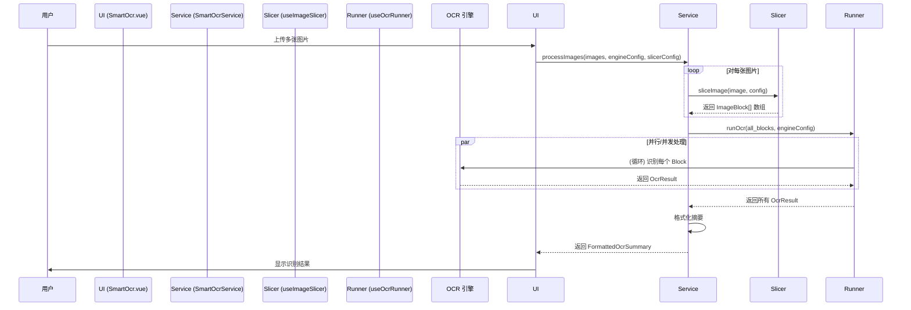

# Smart OCR: 架构与开发者指南

本文档旨在解析 Smart OCR 工具的内部架构、设计理念和数据流，为后续开发提供清晰的指引。

## 1. 核心概念

Smart OCR 是一个多引擎、智能化的图片文字识别工具，旨在为用户提供在不同场景下最优的 OCR 解决方案。

### 1.1. 多引擎架构 (Multi-engine Architecture)

为了平衡成本、性能和准确率，工具集成了四种能力互补的 OCR 引擎。

- **Tesseract.js**: 开源、纯前端运行的引擎，适合离线和低成本场景，但准确率一般。
- **Windows Native OCR**: 调用 Windows 系统原生 API，速度快、准确率高，但仅限 Windows 平台。
- **VLM (视觉语言模型)**: 调用 GPT-4o 等多模态大模型，准确率极高，尤其擅长处理复杂布局和手写体，但成本最高。
- **云端 OCR**: 对接专业的云服务（如阿里云、腾讯云），提供高准确率和稳定性的商业级服务。

### 1.2. 智能切图算法 (Intelligent Slicing Algorithm)

针对移动端长截图，内置了一套智能切图算法，能在 OCR 前自动将长图分割为多个逻辑块。

- **触发条件**: 当图片的长宽比超过预设阈值时自动触发。
- **算法逻辑**:
  1. 将图片绘制到 Canvas 上。
  2. 逐行扫描像素，计算灰度方差，以识别连续的低方差行（即 **空白横带**）。
  3. 在识别出的空白横带中间进行切割。
- **核心优势**: 显著提高了长截图和非标准布局图片的 OCR 识别准确率。

### 1.3. 批量处理与并发控制 (Batch Processing & Concurrency Control)

支持多图片批量处理，并为不同的引擎设计了相应的并发策略。

- **本地引擎**: `Tesseract` 和 `Native OCR` 利用 `Promise.all` 进行并行处理。
- **VLM 引擎**: 实现了专门的**并发控制器**，允许用户配置并发请求数（`concurrency`）和请求间隔（`delay`），以避免超出 API 的速率限制。

## 2. 架构概览

- **View (`SmartOcr.vue`)**: 负责 UI 渲染、用户交互（图片上传、引擎选择）和结果展示。
- **Service (`SmartOcrService`)**: 提供高级、无状态的 API（`processImages`, `processImagesFromPaths`），供 UI 或其他工具（如 Agent）调用。
- **Logic (Composables)**:
  - **`useImageSlicer`**: 封装了智能切图算法。
  - **`useOcrRunner`**: 封装了调用四种不同 OCR 引擎的核心逻辑。
- **Engine (External & Native)**: 具体的 OCR 执行引擎，如 Tesseract.js 库、Windows API、LLM API 等。

## 3. 数据流：处理一批图片

## 4. 未来展望

- **新增 OCR 引擎**: 集成更多优秀的开源或商业 OCR 引擎。
- **版面分析与优化**: 增加表格识别和版面还原能力，而不仅仅是提取纯文本。
- **倾斜校正**: 在 OCR 预处理阶段增加自动倾斜校正功能，提高识别准确率。
- **原生引擎多语言支持**: 当前 Rust 后端的原生 OCR 实现（`windows_ocr`）将识别语言硬编码为 `"zh-Hans"`。后续需要将其参数化，允许前端根据用户选择传递语言代码，以支持多语言识别。
