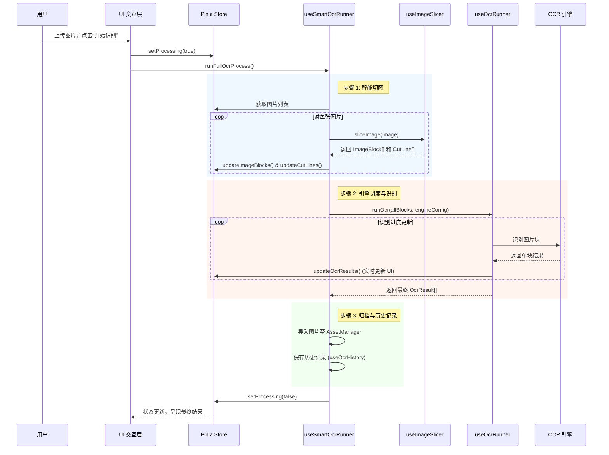
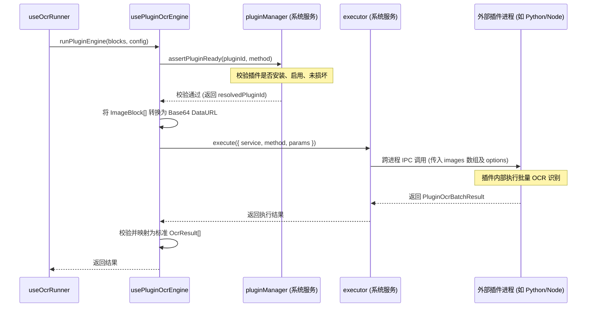

# Smart OCR: 架构与开发者指南

本文档旨在解析 Smart OCR 工具的内部架构、设计理念、数据流以及插件扩展机制，为后续开发和维护提供清晰的指引。

> 最后更新：2026-6-12

---

## 1. 核心概念

Smart OCR 是一个多引擎、智能化的图片文字识别工具，旨在为用户提供在不同场景下最优的 OCR 解决方案。

### 1.1. 多引擎架构 (Multi-engine Architecture)

为了平衡成本、性能、隐私和准确率，工具集成了五种能力互补的 OCR 引擎：

- **Tesseract.js**: 开源、纯前端运行的引擎，适合完全离线和零成本场景，但对复杂排版和手写体准确率一般。
- **Windows Native OCR**: 调用 Windows 系统原生 API，速度极快、准确率高、完全本地运行且零成本，但仅限 Windows 平台。
- **VLM (视觉语言模型)**: 调用多模态大模型（如 GPT-4o、Claude 3.5 Sonnet 等），准确率极高，尤其擅长处理复杂布局、手写体、表格和公式，但存在网络开销和 API 成本。
- **云端 OCR**: 对接专业的云服务（如阿里云、腾讯云、百度云等），提供高准确率和稳定性的商业级服务。
- **Plugin (插件引擎)**: **[新增]** 接入 AIO Hub 插件系统，允许第三方插件（如本地 PaddleOCR、EasyOCR、或自定义 OCR 服务）作为引擎动态注册并无缝接入。

### 1.2. 智能切图算法 (Intelligent Slicing Algorithm)

针对长截图（如手机聊天记录、网页长图），内置了一套智能切图算法，能在 OCR 前自动将长图分割为多个逻辑块，避免因单张图片过大导致引擎识别模糊或超出大模型 Token 限制。

- **触发条件**: 当图片的长宽比超过预设阈值（如 `aspectRatioThreshold: 2`）时自动触发。
- **算法逻辑**:
  1. 将图片绘制到 Canvas 上。
  2. 逐行扫描像素，计算灰度方差，以识别连续的低方差行（即 **空白横带**）。
  3. 在识别出的空白横带中间进行切割，生成 `ImageBlock` 数组。
- **核心优势**: 显著提高了长截图和非标准布局图片的 OCR 识别准确率，同时支持用户在界面上微调或手动添加/删除切割线。

### 1.3. 批量处理与并发控制 (Batch Processing & Concurrency Control)

支持多图片批量处理，并为不同的引擎设计了相应的并发与调度策略：

- **本地引擎 (Tesseract)**: 利用 `Promise.all` 配合多 Web Worker 进行并行处理，充分利用多核 CPU。
- **原生引擎 (Native OCR)**: 采用串行队列处理，避免高频并发调用 Windows 原生 API 导致系统过载或冲突。
- **VLM 引擎**: 实现了专门的**并发控制器**，允许用户配置并发请求数（`concurrency`）和请求间隔（`delay`），以避免超出大模型 API 的速率限制（Rate Limit）。
- **插件引擎 (Plugin)**: 采用**批量传递机制**，将所有图片块一次性打包发送给插件进程，由插件内部进行高效的批处理（Batch Inference），最大化 GPU/CPU 利用率。

---

## 2. 架构设计

Smart OCR 采用清晰的分层架构设计，实现了状态、业务逻辑、引擎调度和 UI 的解耦。

```
┌─────────────────────────────────────────────────────────────────┐
│                       UI 交互层 (Vue Components)                 │
│  [SmartOcr.vue] [ControlPanel.vue] [PreviewPanel.vue] ...       │
└────────────────────────────────┬────────────────────────────────┘
                                 │ 触发 Action / 监听状态
┌────────────────────────────────▼────────────────────────────────┐
│                       状态管理层 (Pinia Store)                   │
│  [useSmartOcrStore] (管理图片、切图线、OCR结果、全局配置)          │
└────────────────────────────────┬────────────────────────────────┘
                                 │ 调用 / 驱动
┌────────────────────────────────▼────────────────────────────────┐
│                     业务编排层 (Runner Composable)               │
│  [useSmartOcrRunner] (编排初始化、切图、OCR分发、重试、历史记录)   │
└────────────────────────────────┬────────────────────────────────┘
                                 │ 调度
┌────────────────────────────────▼────────────────────────────────┐
│                     引擎调度层 (Dispatcher Composable)           │
│  [useOcrRunner] (根据配置分发任务到具体引擎)                      │
└────────────────────────────────┬────────────────────────────────┘
                                 │
         ┌───────────────────────┼───────────────────────┐
         ▼                       ▼                       ▼
┌─────────────────┐     ┌─────────────────┐     ┌─────────────────┐
│ Tesseract 引擎  │     │   Native 引擎   │     │   插件引擎适配  │
│ [useTesseract]  │     │  [useNative]    │     │  [usePluginOcr] │
└─────────────────┘     └─────────────────┘     └────────┬────────┘
                                                         │ 跨进程调用
                                                         ▼
                                                ┌─────────────────┐
                                                │  AIO Hub 插件   │
                                                │ (如 PaddleOCR)  │
                                                └─────────────────┘
```

### 2.1. 各层职责说明

#### 1. UI 交互层 (UI Layer)

- [`SmartOcr.vue`](src/tools/smart-ocr/SmartOcr.vue): 工具主入口，负责整体布局和生命周期管理。
- [`ControlPanel.vue`](src/tools/smart-ocr/components/ControlPanel.vue): 引擎选择、参数配置（切图阈值、并发数、提示词等）。
- [`PreviewPanel.vue`](src/tools/smart-ocr/components/PreviewPanel.vue): 图片预览、切图线可视化交互（支持手动拖拽、添加、删除切图线）。
- [`ResultPanel.vue`](src/tools/smart-ocr/components/ResultPanel.vue): 识别结果展示，支持单块编辑、忽略、一键复制、重新识别。

#### 2. 状态管理层 (State Management)

- [`useSmartOcrStore`](src/tools/smart-ocr/stores/smartOcr.store.ts): 基于 Pinia。统一管理所有响应式状态，包括上传的原始图片、计算出的切图线、切图后的图片块、OCR 识别结果、当前引擎配置以及处理状态。

#### 3. 业务编排层 (Business Orchestration)

- [`useSmartOcrRunner`](src/tools/smart-ocr/composables/useSmartOcrRunner.ts): 核心业务流控制器。负责：
  - 载入与持久化本地配置。
  - 调度 [`useImageSlicer`](src/tools/smart-ocr/composables/useImageSlicer.ts) 进行图片切割。
  - 驱动 [`useOcrRunner`](src/tools/smart-ocr/composables/useOcrRunner.ts) 执行识别。
  - 实现单块重试、失败块批量重试机制。
  - 结合 [`useAssetManager`](src/composables/useAssetManager.ts) 将图片导入为系统资产，并通过 [`useOcrHistory`](src/tools/smart-ocr/composables/useOcrHistory.ts) 保存识别历史。

#### 4. 引擎调度层 (Engine Dispatcher)

- [`useOcrRunner`](src/tools/smart-ocr/composables/useOcrRunner.ts): 无状态的调度器。根据传入的 `OcrEngineConfig` 类型，将图片块分发给对应的具体引擎实现，并统一输出标准化的 `OcrResult` 格式。

#### 5. 具体引擎实现层 (Engine Implementations)

- [`useTesseractEngine`](src/tools/smart-ocr/composables/useTesseractEngine.ts): 封装 Tesseract.js 的 Worker 创建、语言包加载和识别逻辑。
- [`useNativeEngine`](src/tools/smart-ocr/composables/useNativeEngine.ts): 通过 Tauri IPC 调用 Rust 后端的 Windows 原生 OCR 能力。
- [`useVlmEngine`](src/tools/smart-ocr/composables/useVlmEngine.ts): 封装多模态大模型请求，支持自定义 Prompt 和并发控制。
- [`useCloudOcrRunner`](src/tools/smart-ocr/composables/useCloudOcrRunner.ts): 对接系统全局的云端 OCR 服务配置。
- [`usePluginOcrEngine`](src/tools/smart-ocr/composables/usePluginOcrEngine.ts): **[新增]** 插件引擎适配器。负责校验插件状态（是否安装、启用、损坏），并将图片块组装为标准契约格式，通过 `execute` 跨进程发送给插件。

#### 6. 插件扩展层 (Plugin Extension Layer)

- [`usePluginOcrExtensions`](src/tools/smart-ocr/composables/usePluginOcrExtensions.ts): **[新增]** 动态扫描并解析已安装插件的 `ocr-engine` 贡献点（contributions），提取支持的模型、语言等元数据，供 UI 渲染选择。

---

## 3. 数据流

### 3.1. 标准 OCR 任务生命周期


```mermaid
sequenceDiagram
    participant User as 用户
    participant UI as UI 交互层
    participant Store as Pinia Store
    participant Runner as useSmartOcrRunner
    participant Slicer as useImageSlicer
    participant Dispatcher as useOcrRunner
    participant Engine as OCR 引擎

    User->>UI: 上传图片并点击“开始识别”
    UI->>Store: setProcessing(true)
    UI->>Runner: runFullOcrProcess()

    rect rgb(240, 248, 255)
        note right of Runner: 步骤 1: 智能切图
        Runner->>Store: 获取图片列表
        loop 对每张图片
            Runner->>Slicer: sliceImage(image)
            Slicer-->>Runner: 返回 ImageBlock[] 和 CutLine[]
            Runner->>Store: updateImageBlocks() & updateCutLines()
        end
    end

    rect rgb(255, 245, 238)
        note right of Runner: 步骤 2: 引擎调度与识别
        Runner->>Dispatcher: runOcr(allBlocks, engineConfig)
        loop 识别进度更新
            Dispatcher->>Engine: 识别图片块
            Engine-->>Dispatcher: 返回单块结果
            Dispatcher->>Store: updateOcrResults() (实时更新 UI)
        end
        Dispatcher-->>Runner: 返回最终 OcrResult[]
    end

    rect rgb(240, 255, 240)
        note right of Runner: 步骤 3: 归档与历史记录
        Runner->>Runner: 导入图片至 AssetManager
        Runner->>Runner: 保存历史记录 (useOcrHistory)
    end

    Runner->>Store: setProcessing(false)
    Store-->>UI: 状态更新，呈现最终结果
```

### 3.2. 插件引擎调用机制


```mermaid
sequenceDiagram
    participant Dispatcher as useOcrRunner
    participant Adapter as usePluginOcrEngine
    participant PM as pluginManager (系统服务)
    participant Executor as executor (系统服务)
    participant Plugin as 外部插件进程 (如 Python/Node)

    Dispatcher->>Adapter: runPluginEngine(blocks, config)
    Adapter->>PM: assertPluginReady(pluginId, method)
    note over PM: 校验插件是否安装、启用、未损坏
    PM-->>Adapter: 校验通过 (返回 resolvedPluginId)

    Adapter->>Adapter: 将 ImageBlock[] 转换为 Base64 DataURL
    Adapter->>Executor: execute({ service, method, params })

    Executor->>Plugin: 跨进程 IPC 调用 (传入 images 数组及 options)
    note over Plugin: 插件内部执行批量 OCR 识别
    Plugin-->>Executor: 返回 PluginOcrBatchResult

    Executor-->>Adapter: 返回执行结果
    Adapter->>Adapter: 校验并映射为标准 OcrResult[]
    Adapter-->>Dispatcher: 返回结果
```

---

## 4. 插件引擎接入规范 (Plugin Integration Specification)

任何第三方插件只要在 `manifest.json` 中声明 `ocr-engine` 贡献点，并实现对应的 RPC 方法，即可无缝接入 Smart OCR 工具。

### 4.1. 插件清单声明 (`manifest.json`)

插件需要在 `contributions` 中声明其提供的 OCR 引擎能力：

```json
{
  "name": "paddle-ocr-plugin",
  "contributions": [
    {
      "type": "ocr-engine",
      "id": "paddle-ocr-default",
      "name": "PaddleOCR 本地引擎",
      "description": "基于 PaddleOCR 的本地超轻量级 OCR 引擎",
      "method": "recognize",
      "modelProfiles": [
        { "label": "服务器版 (准确率高)", "value": "server" },
        { "label": "移动版 (速度快)", "value": "mobile" }
      ],
      "defaultModelProfile": "mobile",
      "languages": [
        { "label": "中英文", "value": "ch" },
        { "label": "英文", "value": "en" }
      ],
      "defaultLanguage": "ch"
    }
  ]
}
```

### 4.2. 接口契约 (Interface Contract)

#### 1. 输入参数 (`params`)

Smart OCR 会将图片块打包，通过以下结构传递给插件的 `method`（如 `recognize`）：

```typescript
interface PluginOcrParams {
  images: Array<{
    blockId: string; // 图片块唯一 ID
    imageId: string; // 所属原始图片 ID
    dataUrl: string; // 图片的 Base64 DataURL (image/png)
    width: number; // 宽度 (px)
    height: number; // 高度 (px)
  }>;
  options: {
    modelProfile?: string; // 对应 manifest 中的 modelProfiles.value
    language?: string; // 对应 manifest 中的 languages.value
  };
}
```

#### 2. 输出结果 (`PluginOcrBatchResult`)

插件执行完成后，必须返回以下格式的数据：

```typescript
interface PluginOcrBatchResult {
  results: Array<{
    blockId: string;
    imageId: string;
    text: string; // 识别出的文本内容
    confidence?: number; // 置信度 (0 - 1)
    status: "success" | "error";
    error?: string; // 若 status 为 error，需提供错误信息
  }>;
}
```

---

## 5. 未来展望（AI写的）

- **原生引擎多语言支持**: 当前 Rust 后端的原生 OCR 实现（`windows_ocr`）将识别语言硬编码为 `"zh-Hans"`。后续需要将其参数化，允许前端根据用户选择传递语言代码，以支持多语言识别。
- **版面分析与表格还原**: 引入更先进的版面分析（Layout Analysis）算法，支持将识别出的表格直接导出为 Excel，或保留段落排版导出为 Word。
- **自动倾斜校正**: 在 OCR 预处理阶段增加自动倾斜校正（Deskew）功能，提高拍摄角度偏斜时的识别准确率。

