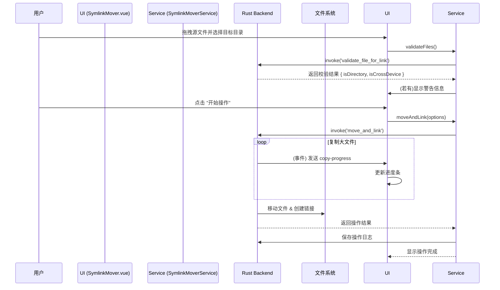

# Symlink Mover: 架构与开发者指南

本文档旨在解析 Symlink Mover 工具的内部架构、设计理念和数据流，为后续开发提供清晰的指引。

## 1. 核心概念

Symlink Mover 是一个文件“搬家”工具，旨在通过移动文件并在原位置创建链接的方式，帮助用户在不破坏程序路径依赖的前提下，重新组织磁盘空间。

### 1.1. 双操作模式 (Dual Operation Modes)

工具提供了两种核心操作模式，以适应不同的使用场景。

- **搬家模式 (`move-and-link`)**:
  1. 将源文件/目录移动到新的目标位置。
  2. 在源文件/目录的原始位置创建一个指向新位置的链接。
  - **用途**: 解决 C 盘空间不足等问题，将大文件（如模型、游戏）迁移到其他磁盘，同时保持软件的正常访问。

- **仅创建链接模式 (`link-only`)**:
  1. 源文件/目录位置保持不变。
  2. 在指定的目标目录中创建一个指向源文件/目录的链接。
  - **用途**: 创建一个集中的快捷访问点，将散落在各处的文件/目录聚合到一个地方。

### 1.2. 双链接类型 (Dual Link Types)

支持两种不同类型的链接，各有优劣。

- **符号链接 (Symlink)**:
  - **优势**: 支持文件和目录，支持跨分区/跨盘符。
  - **类比**: 一个记录了目标路径的“快捷方式”。删除源文件后，链接会失效。

- **硬链接 (Hard Link)**:
  - **优势**: 多个文件入口指向同一份物理数据。删除任意一个入口，只要还存在其他入口，文件数据就不会丢失。
  - **限制**: **仅支持文件**，且**不能跨分区/跨盘符**。

### 1.3. Rust 后端驱动与安全校验

所有文件系统操作均由 Rust 后端执行，并在操作前进行严格的校验。

- **文件系统操作**: 通过 Tauri `invoke` 调用 `move_and_link` / `create_links_only` 等 Rust 命令。
- **前置校验**: 在执行操作前，会调用 `validate_file_for_link` 检查操作的合法性（如硬链接不能用于目录、不能跨盘等），并在 UI 上向用户发出明确警告。
- **进度监听**: 对于大文件移动，Rust 后端会通过 Tauri Event 实时向前端发送 `copy-progress` 事件，用于更新进度条。

## 2. 架构概览

- **View (`SymlinkMover.vue`)**: 负责 UI 渲染和用户交互，包括文件拖拽、参数选择和结果展示。
- **Service (`SymlinkMoverService`)**: 提供高级、无状态的 API，封装了与 Rust 后端的交互逻辑和校验流程。
- **Engine (Rust Backend)**: 负责执行实际的文件移动、链接创建、校验和进度上报。

## 3. 数据流：执行一次“搬家”操作

## 4. 核心逻辑

- **操作日志**: 每次操作都会在 Rust 后端自动保存一条详细的日志（包含操作类型、文件数量、耗时、错误等），并提供 API (`getOperationHistory`) 供前端查询。

## 5. 未来展望

- **Windows Junction 支持**: 增加对 Windows Directory Junction 的支持，作为目录符号链接的一种替代方案。
- **批量操作优化**: 将当前逐文件调用 Rust command 的模式优化为单次调用、批量处理，以提升处理大量小文件时的性能。
- **取消操作**: 实现一个可中断的操作流程，并支持对已处理文件的回滚。
