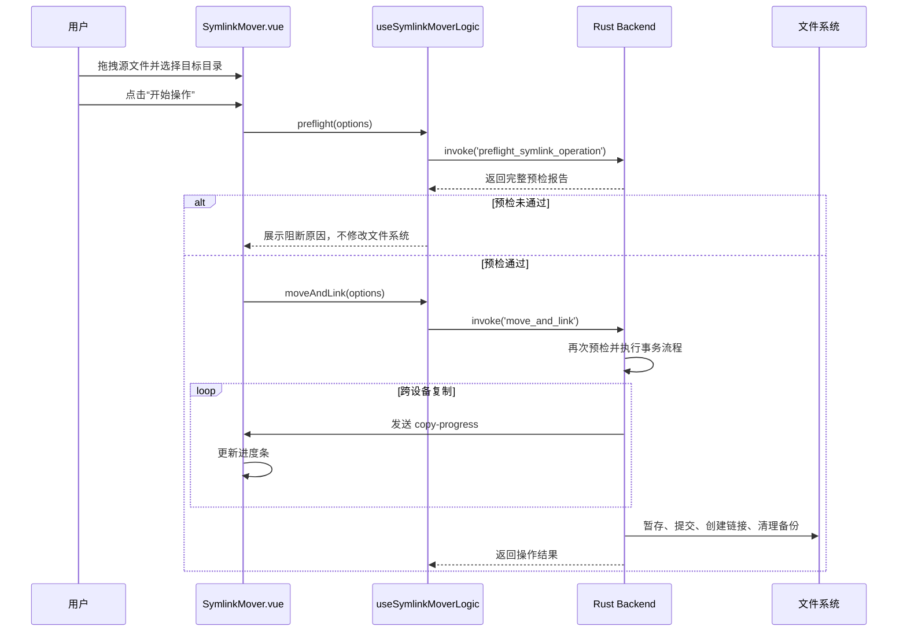

# Symlink Mover: 架构与开发者指南

本文档旨在解析 Symlink Mover 工具的内部架构、设计理念和数据流，为后续开发提供清晰的指引。

## 1. 核心概念

Symlink Mover 是一个文件“搬家”工具，旨在通过移动文件并在原位置创建链接的方式，帮助用户在不破坏程序路径依赖的前提下，重新组织磁盘空间。

### 1.1. 双操作模式 (Dual Operation Modes)

工具提供了两种核心操作模式，以适应不同的使用场景。

- **搬家模式 (`move-and-link`)**:
  1. 将源文件/目录移动到新的目标位置。
  2. 在源文件/目录的原始位置创建一个指向新位置的链接。
  - **用途**: 解决 C 盘空间不足等问题，将大文件（如模型、游戏）迁移到其他磁盘，同时保持软件的正常访问。

- **仅创建链接模式 (`link-only`)**:
  1. 源文件/目录位置保持不变。
  2. 在指定的目标目录中创建一个指向源文件/目录的链接。
  - **用途**: 创建一个集中的快捷访问点，将散落在各处的文件/目录聚合到一个地方。

### 1.2. 双链接类型 (Dual Link Types)

支持两种不同类型的链接，各有优劣。

- **符号链接 (Symlink)**:
  - **优势**: 支持文件和目录，支持跨分区/跨盘符。
  - **类比**: 一个记录了目标路径的“快捷方式”。删除源文件后，链接会失效。

- **硬链接 (Hard Link)**:
  - **优势**: 多个文件入口指向同一份物理数据。删除任意一个入口，只要还存在其他入口，文件数据就不会丢失。
  - **限制**: **仅支持文件**，且**不能跨分区/跨盘符**。

### 1.3. Rust 后端驱动与安全校验

所有文件系统操作均由 Rust 后端执行。前端的字段校验只用于即时提示，不能代替后端预检；执行命令会在真正写入前再次生成计划。

- **完整预检**: `preflight_symlink_operation` 一次检查源路径、镜像映射、目标冲突、目录写入能力、源目录中的嵌套链接、源路径重叠、目标路径逃逸、链接类型限制、跨设备情况和目标磁盘空间。
- **执行前删除门禁**: `move_and_link` 在跨设备复制前额外用临时同目录改名往返探测源路径是否可移出，尽量在复制前发现“文件正在使用/权限不足”。这不是对 Windows 文件锁的绝对保证，因此提交阶段仍保留回滚。
- **两阶段搬家**: 同盘使用 `rename -> 创建链接`；跨盘使用 `临时目录复制 -> 类型/大小校验 -> 源路径备份改名 -> 提交目标 -> 创建链接`。任何提交失败都会尝试恢复源路径。
- **清理失败不丢数据**: 搬家完成后备份移入回收站失败时，不删除源数据，保留备份并在日志中写入 warning。
- **进度监听**: 对于跨设备文件复制，Rust 后端通过 Tauri Event 发送 `copy-progress` 事件。

## 2. 架构概览

- **View (`SymlinkMover.vue`)**: 负责 UI 渲染和用户交互，包括文件拖拽、参数选择和结果展示。
- **Service (`useSymlinkMoverLogic`)**: 提供高级、无状态的 API，封装了与 Rust 后端的交互逻辑和校验流程。
- **Engine (Rust Backend)**: 负责执行实际的文件移动、链接创建、校验和进度上报。

## 3. 数据流：执行一次“搬家”操作

```mermaid
sequenceDiagram
    participant User as 用户
    participant UI as SymlinkMover.vue
    participant Service as useSymlinkMoverLogic
    participant Rust as Rust Backend
    participant FS as 文件系统

    User->>UI: 拖拽源文件并选择目标目录
    User->>UI: 点击“开始操作”
    UI->>Service: preflight(options)
    Service->>Rust: invoke('preflight_symlink_operation')
    Rust-->>Service: 返回完整预检报告
    alt 预检未通过
        Service-->>UI: 展示阻断原因，不修改文件系统
    else 预检通过
        UI->>Service: moveAndLink(options)
        Service->>Rust: invoke('move_and_link')
        Rust->>Rust: 再次预检并执行事务流程
        loop 跨设备复制
            Rust->>UI: 发送 copy-progress
            UI->>UI: 更新进度条
        end
        Rust->>FS: 暂存、提交、创建链接、清理备份
        Rust-->>Service: 返回操作结果
    end
```

## 4. 核心逻辑

- **操作日志**: 每次操作都会在 Rust 后端自动保存一条详细的日志（包含操作类型、文件数量、耗时、错误等），并提供 API (`getOperationHistory`) 供前端查询。

## 5. 当前边界

- 预检是尽力而为的能力检查，无法保证操作开始后不会有其他进程抢占文件或改变 ACL；因此后端仍把所有提交步骤当作可能失败处理。
- 取消操作不会打断底层系统调用，但会在复制阶段结束后停止继续处理；当前条目会清理暂存并保持源路径可恢复，已经提交成功的条目不会自动跨条目回滚。
- Windows Junction / reparse point 仍按链接边界拒绝，后续如支持需要单独设计其识别、复制和回滚策略。
