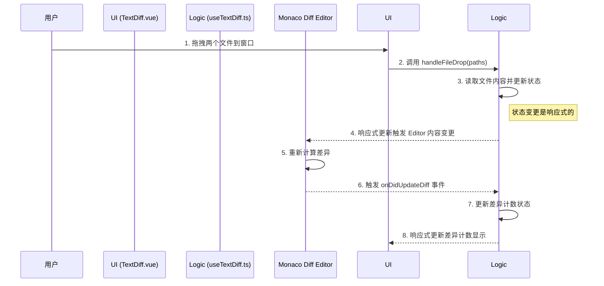

# Text Diff: 架构与开发者指南

本文档旨在解析 Text Diff 工具的内部架构、设计理念和数据流，为后续开发和维护提供清晰的指引。

## 1. 核心概念

Text Diff 的设计旨在通过深度集成 Monaco Editor 和智能化的交互，提供一个专业、高效且符合直觉的文本对比体验。

### 1.1. 智能文件分配 (Intelligent File Drop)

这是提升用户体验的关键特性，旨在通过上下文感知的行为，最大限度地减少用户准备对比文件时的操作步骤。

- **核心算法**:
  - **拖入两个文件**: 无论拖到何处，系统都会自动将两个文件分配到左右两侧。
  - **拖入单个文件**:
    - 若有一侧为空，则自动填充到空侧。
    - 若两侧都有内容，则覆盖鼠标指针所在的那一侧。
- **设计理念**: 针对最常见的“对比两个文件”场景进行优化，同时保留用户精确控制的灵活性。

### 1.2. Monaco Diff Editor 集成

为了提供企业级的对比体验，工具深度集成了 Monaco Editor 的 Diff 模式。

- **核心引擎**: 使用 `RichCodeEditor` 组件的 Diff 模式作为底层渲染引擎。
- **关键配置**:
  - `originalEditable: true`: 允许用户直接在左侧（原始）编辑器中修改，便于快速修正和比较。
  - `ignoreTrimWhitespace: true`: 默认忽略行尾的空白差异，聚焦于核心代码逻辑的变更。
  - `diffAlgorithm: 'advanced'`: 采用高级差异算法，提供更精确、可读性更高的对比结果。
- **差异导航**: 利用 Monaco 的内置 API (`goToDiff`) 实现差异点之间的快速跳转。

### 1.3. 统一 Diff 补丁 (Unified Diff Patch)

除了可视化对比，工具还支持生成行业标准的 **统一 Diff 格式 (Unified Diff Format)** 补丁，使其能够与 Git 等版本控制工具无缝集成。

- **生成引擎**: 使用 `diff` 库的 `createTwoFilesPatch` 方法来确保生成的补丁格式规范。
- **核心功能**: 支持配置上下文行数 (`context`) 和空白处理选项，并能便捷地将补丁复制到剪贴板或导出为 `.patch` 文件。

## 2. 架构概览

采用逻辑与 UI 分离的设计，通过 Vue Composable 组织业务逻辑，使组件代码更专注于视图渲染。

- **View (`TextDiff.vue`)**: 负责 UI 布局和用户交互，包括工具栏、文件拖放区域和文件名显示。
- **Logic (`useTextDiff.ts`)**: 一个独立的 Composable，封装了所有核心逻辑，包括状态管理、文件加载、差异导航和补丁生成。
- **Engine (`RichCodeEditor.vue` & `diff` lib)**: 底层的差异计算和渲染引擎。

## 3. 数据流：拖拽两个文件进行对比

## 4. 核心逻辑

- **语言自动检测**: 根据文件名后缀，从一个内部映射表 (`LANGUAGE_MAP`) 推断语言模式，以提供准确的语法高亮。
- **性能优化**: Monaco 编辑器实例使用 `shallowRef` 存储，避免不必要的深度响应式代理开销。同时，对加载超过 10MB 的大文件进行性能警告。
- **错误处理**: 内置二进制文件检测（通过查找 `\0` 字符），并对文件读取失败、补丁生成异常等情况提供友好的用户提示。

## 5. 未来展望

- **三向合并**: 将当前架构扩展为支持三向对比（base, ours, theirs），以支持更复杂的合并场景。
- **补丁应用**: 增加将 `.patch` 文件应用到源文件的功能。
