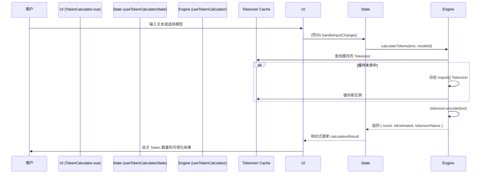

# Token Calculator: 架构与开发者指南

本文档旨在解析 Token Calculator 工具的内部架构、设计理念和数据流，为后续开发提供清晰的指引。

## 1. 核心概念

Token Calculator 是一个专为 LLM 应用场景设计的精确 Token 计数工具，旨在提供精确、高效、多模态的 Token 计算能力。

### 1.1. 动态 Tokenizer 加载策略 (Dynamic Tokenizer Loading)

为了平衡功能全面性与初始加载性能，工具采用 **懒加载 + 缓存** 的策略来管理不同模型家族的 Tokenizer。

- **加载器映射**: 内部维护一个从 Tokenizer ID 到动态 `import()` 语句的映射表。
- **加载流程**:
  1. 检查缓存中是否存在已实例化的 Tokenizer。
  2. 若无，则根据模型 ID 查找对应的加载器。
  3. 动态导入 Tokenizer 库，实例化后存入缓存。
- **核心优势**:
  - **性能**: 显著减少应用的初始加载体积，只在需要时加载特定的 Tokenizer 库。
  - **可扩展性**: 新增 Tokenizer 支持只需在映射表中添加一行代码，无需修改核心逻辑。

### 1.2. 多模态 Token 计算 (Multimodal Token Calculation)

除了文本，工具还内置了对多种主流视觉模型图片 Token 计算逻辑的支持。

- **OpenAI 瓦片法 (Tile-based)**: 模拟 OpenAI 的官方算法，通过缩放和切片计算出等效的 Token 消耗。
- **固定成本法 (Fixed Cost)**: 对于一些模型，每张图片有固定的 Token 成本。
- **预估法 (Estimation)**: 对于 Claude 3 等模型，由于实际 Token 数由 API 返回，工具提供一个基于官方文档的预估值。

### 1.3. Token 可视化 (Token Visualization)

为了帮助用户直观理解文本是如何被切分的，工具提供了 Token 可视化功能。

- **实现方式**:
  1. 使用对应的 Tokenizer 对文本进行编码 (`encode`)。
  2. 将返回的 `tokenId` 数组逐个解码 (`decode`) 回字符串。
  3. 为每个 Token 片段应用不同的背景色并渲染。

## 2. 架构概览

- **View (`TokenCalculator.vue`)**: 负责 UI 渲染和用户交互，包括文本/图片输入、模型选择和结果展示。
- **State (`useTokenCalculatorState`)**: 全局 Composable，作为 Source of Truth 管理所有状态，如输入内容、计算模式、计算结果等。
- **Engine (`useTokenCalculator.ts`)**: 封装了所有核心计算逻辑，包括 Tokenizer 加载与管理、文本/图片 Token 计算等。
- **Config (`config.ts`)**: 负责用户偏好（如默认计算模式、面板宽度）的持久化存储。

## 3. 数据流：计算一段文本的 Token

## 4. 核心逻辑

- **回退估算**: 当无法找到精确的 Tokenizer 时，启用一个基于字符类型（中文、英文、特殊符号）的经验公式进行估算。
- **性能优化**: 对 Token 可视化功能设置了最大显示数量限制（默认 5000），避免超大文本输入导致浏览器渲染卡顿。

## 5. 未来展望

- **Tokenizer 更新**: 保持对 `@lenml/tokenizer-*` 等上游依赖的关注，及时更新以支持最新的模型。
- **特殊 Token 处理**: 增加对不同模型特殊 Token（如 `bos`, `eos`, `tool_code`）的识别和计数。
