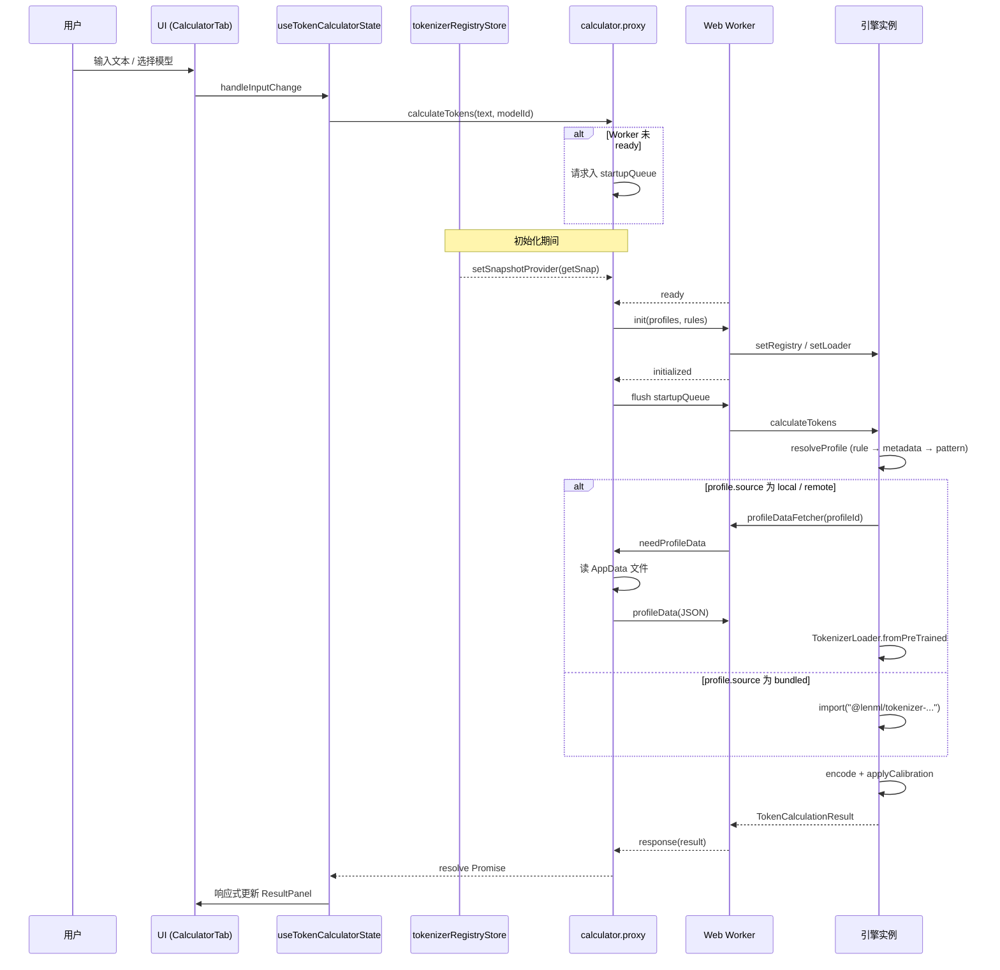

# Token Calculator: 架构与开发者指南

本文档解析 Token Calculator 工具的内部架构、设计理念和数据流。

## 1. 核心概念

Token Calculator 既是一个**面向用户**的 Token 计数器，也是 AIO Hub 内部**面向其他模块**（如 LLM Chat、Web Distillery）的统一 token 计算服务。它围绕「**Tokenizer 资产注册表**」组织所有分词器。

### 1.1. 资产注册表 (Tokenizer Asset Registry)

每个分词器抽象为一个 **Profile**，包含：

- 来源：`bundled`（应用打包）、`local`（用户导入）、`remote`（远端下载）
- 置信度：`exact` / `close` / `estimated`
- 匹配模式：用于把 `modelId` 自动映射到该 Profile 的正则数组
- 校准参数：`multiplier`、`fixedOverhead`、`perMessageOverhead` 等

Profile 由 [`tokenizerRegistryStore`](./stores/tokenizerRegistryStore.ts) 集中管理，分为：

- **内置 Profile**：由 [`builtin-tokenizer-index.ts`](./data/builtin-tokenizer-index.ts) 提供，对应 7 个 `@lenml/tokenizer-*` 包，每次启动从源码重建。
- **用户 Profile**：本地导入或远端下载，持久化在 AppData `tokenizer-registry/profiles.json`。
- **匹配规则**：用户在「匹配规则」Tab 添加的显式覆盖，存于 `tokenizer-registry/rules.json`。

### 1.2. 主线程权威态 + Worker 无状态镜像

`tokenizerRegistryStore` 是注册表的唯一**权威态**（Single Source of Truth）。Worker 内部只持有一份由主线程通过 `init` 消息推送的**镜像**：

```
主线程 Store (权威)        Web Worker (镜像)
─────────────────         ──────────────────
profiles, rules    ─init→  engine.setRegistry(...)
                  ←ready─
                  →init←─
                  ←initialized─
```

任何注册表变更（安装 / 卸载 / 改规则 / 启用禁用）都通过 `calculatorProxy.restartWorker()` 重建 Worker，避免双向同步的复杂度。

### 1.3. tokenizer.json 按需推送

local / remote 来源的 Profile 包含可达 MB 级的 `tokenizer.json` 文件。这些**不参与 init 阶段的批量传输**，而是由 Worker 在首次调用时按需请求：

```
Worker → 主线程: { type: "needProfileData", profileId }
主线程: 读文件 + (可选) sha256 校验
主线程 → Worker: { type: "profileData", profileId, tokenizerJSON, ... }
Worker: TokenizerLoader.fromPreTrained({ tokenizerJSON, tokenizerConfig })
```

Worker 内部对已实例化的 tokenizer 做 LRU 缓存。

### 1.4. Worker 离线计算

为避免长文本计算阻塞主线程，所有分词、编码、解码均在 Web Worker 中执行。

- **代理**：[`calculator.proxy.ts`](./worker/calculator.proxy.ts) 封装 `postMessage` 协议，对外暴露 Promise 接口。
- **启动队列**：Worker 启动 / 重启期间的所有请求会被压入 `startupQueue`，待 `initialized` 后 flush，对调用方无感。
- **错误恢复**：Worker 异常 → terminate → 1s 后重启 → 重新走 ready/init 流程。

### 1.5. 计算结果扩展（向后兼容）

`TokenCalculationResult` 在 v1 基础上新增字段，全部为 optional：

- `rawCount`：未经 calibration 的原始 token 数
- `tokenizerProfileId` / `tokenizerConfidence`：命中的 Profile 信息
- `appliedCalibration`：实际应用的校准参数

`count` 字段的语义保持不变（始终是最终值），LLM Chat 等下游模块**零改动**继续工作。

### 1.6. 多模态 Token 计算

图片 / 视频 / 音频的 token 估算由 [`tokenCalculatorEngine`](./core/tokenCalculatorEngine.ts) 主线程实例同步执行，不走 Worker（计算量小，无需异步化）：

- **OpenAI 瓦片法**（GPT-4o vision 等）
- **Gemini 2.0 瓦片法**
- **固定成本法**（Claude 3）
- **时长 × 单价**（视频 / 音频）

## 2. 架构概览

| 层级        | 模块                                                                     | 职责                                      |
| ----------- | ------------------------------------------------------------------------ | ----------------------------------------- |
| **View**    | [`TokenCalculator.vue`](./TokenCalculator.vue)                           | Workspace 容器（4 个 Tab）                |
| **Tabs**    | [`workspace/*Tab.vue`](./components/workspace/)                          | 计算 / 分词器库 / 匹配规则 / 校准         |
| **State**   | [`useTokenCalculatorState.ts`](./composables/useTokenCalculatorState.ts) | UI 响应式状态（输入、模型选择、计算结果） |
| **Store**   | [`tokenizerRegistryStore.ts`](./stores/tokenizerRegistryStore.ts)        | Profile / Rule 的主线程权威态             |
| **Proxy**   | [`calculator.proxy.ts`](./worker/calculator.proxy.ts)                    | Worker 通信代理 + 启动握手 + 重启         |
| **Worker**  | [`calculator.worker.ts`](./worker/calculator.worker.ts)                  | 后台计算节点                              |
| **Engine**  | [`tokenCalculatorEngine.ts`](./core/tokenCalculatorEngine.ts)            | 纯逻辑计算引擎（无 UI 依赖）              |
| **Service** | [`token-calculator.registry.ts`](./token-calculator.registry.ts)         | 跨模块服务外壳                            |

## 3. 数据流：计算一段文本


```mermaid
sequenceDiagram
    participant User as 用户
    participant UI as UI (CalculatorTab)
    participant State as useTokenCalculatorState
    participant Store as tokenizerRegistryStore
    participant Proxy as calculator.proxy
    participant Worker as Web Worker
    participant Engine as 引擎实例

    User->>UI: 输入文本 / 选择模型
    UI->>State: handleInputChange
    State->>Proxy: calculateTokens(text, modelId)

    alt Worker 未 ready
        Proxy->>Proxy: 请求入 startupQueue
    end

    Note over Store,Proxy: 初始化期间
    Store-->>Proxy: setSnapshotProvider(getSnap)
    Worker-->>Proxy: ready
    Proxy->>Worker: init(profiles, rules)
    Worker->>Engine: setRegistry / setLoader
    Worker-->>Proxy: initialized
    Proxy->>Worker: flush startupQueue

    Worker->>Engine: calculateTokens
    Engine->>Engine: resolveProfile (rule → metadata → pattern)

    alt profile.source 为 local / remote
        Engine->>Worker: profileDataFetcher(profileId)
        Worker->>Proxy: needProfileData
        Proxy->>Proxy: 读 AppData 文件
        Proxy->>Worker: profileData(JSON)
        Engine->>Engine: TokenizerLoader.fromPreTrained
    else profile.source 为 bundled
        Engine->>Engine: import("@lenml/tokenizer-...")
    end

    Engine->>Engine: encode + applyCalibration
    Engine-->>Worker: TokenCalculationResult
    Worker-->>Proxy: response(result)
    Proxy-->>State: resolve Promise
    State->>UI: 响应式更新 ResultPanel
```

## 4. 解析优先级

引擎为 `modelId` 寻找 Profile 的顺序：

1. **用户匹配规则**（store.rules，按优先级排序）
2. **`metadata.tokenizer`**（来自 [model-metadata 系统](../../config/model-metadata-presets.ts) 的字符串字段，直接作为 profileId 查表）
3. **Profile.modelPatterns**（注册表里所有 enabled profile 的正则匹配）
4. **字符级估算**（[`estimateTokens`](./core/tokenCalculatorEngine.ts) 的中英文混合启发式）

匹配命中后，叠加该 Profile 的 `calibration`：

```
count = round(rawCount * multiplier + fixedOverhead)
```

## 5. 跨模块调用

LLM Chat 等模块通过 [`tokenCalculatorService`](./token-calculator.registry.ts) 调用：

```ts
import { tokenCalculatorService } from "@/tools/token-calculator/token-calculator.registry";

const result = await tokenCalculatorService.calculateMessageTokens(
  text,
  modelId,
  attachments
);
// result.count: 已应用 calibration 的最终值
// result.tokenizerConfidence: "exact" | "close" | "estimated"
```

调用方**只关心 `count`**，新增字段是 optional。

## 6. 未来展望

- **Phase 3**：本地导入 UI（文件 / 目录 / URL）
- **Phase 4**：匹配规则可视化编辑 + 测试 UI
- **Phase 5**：远端下载（GitHub Release Asset Index）
- **Phase 6**：校准参数可视化
- **Phase 7**：移动端 profile 展示（按需）

