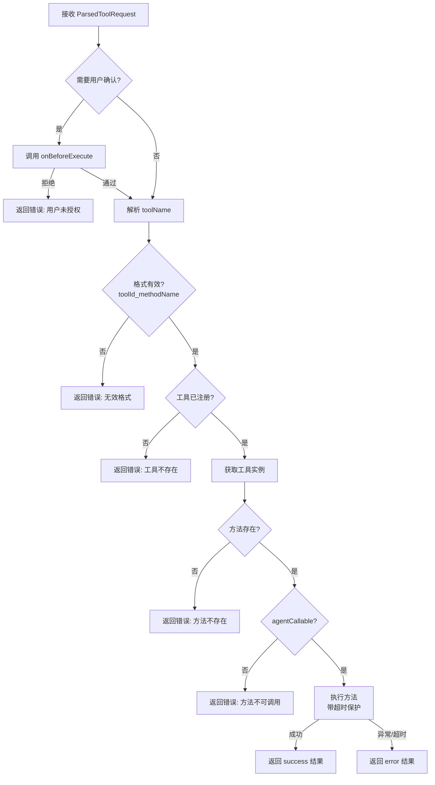
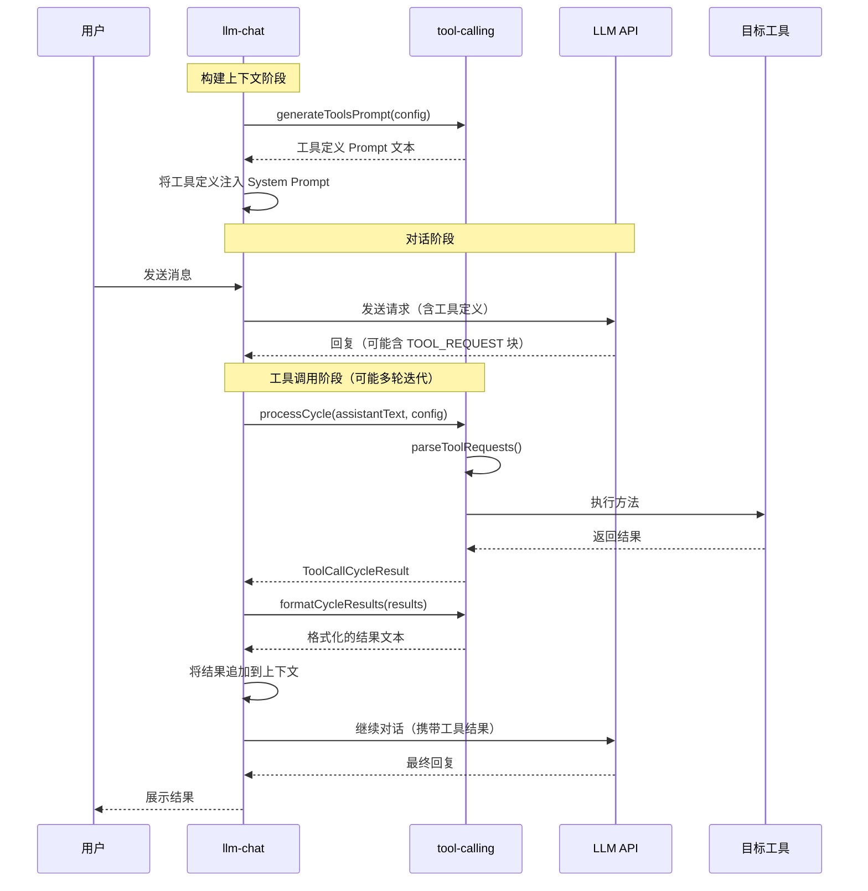

# Tool Calling: 架构与开发者指南

本文档描述 `tool-calling` 模块的内部架构、设计理念与数据流，为后续开发和维护提供清晰指引。

## 1. 模块定位

`tool-calling` 是 AIO Hub 的**工具调用基础设施**。它为 LLM 智能体提供了一套完整的"感知工具 → 生成调用 → 解析执行 → 回注结果"闭环能力，使 LLM 能够在对话过程中主动调用系统中已注册的工具方法。

该模块同时提供了一个内置的**调试测试界面 (ToolCallingTester)**，用于在开发阶段验证工具发现、协议解析和方法执行的正确性。

## 2. 核心概念

### 2.1. 工具调用周期 (Tool Call Cycle)

一个完整的工具调用周期由三个阶段组成：

```
LLM 回复文本 ──→ [解析] ──→ ParsedToolRequest[] ──→ [执行] ──→ ToolExecutionResult[] ──→ [格式化] ──→ 注入上下文
```

1. **解析 (Parse)**: 从 LLM 的回复文本中提取结构化的工具调用请求块。
2. **执行 (Execute)**: 将解析出的请求路由到对应的工具方法并执行。
3. **格式化 (Format)**: 将执行结果格式化为协议规定的文本，回注到对话上下文中供 LLM 继续推理。

### 2.2. 协议 (Protocol)

协议定义了 LLM 与工具调用系统之间的**通信格式**。它决定了：

- 工具定义如何呈现给 LLM（Prompt 格式）
- LLM 如何表达调用意图（请求格式）
- 执行结果如何反馈给 LLM（结果格式）

当前实现了 **VCP (Variable & Command Protocol)** 协议，架构预留了多协议扩展能力。

### 2.3. 工具发现 (Tool Discovery)

工具发现是自动化的。系统通过 [`toolRegistryManager`](../../services/registry.ts) 扫描所有已注册的工具，筛选出实现了 [`getMetadata()`](../../services/types.ts:86) 并标记了 `agentCallable: true` 的方法，自动生成工具定义 Prompt。

### 2.4. 配置 (ToolCallConfig)

工具调用的行为由 [`ToolCallConfig`](../llm-chat/types/agent.ts:78) 控制，该配置挂载在智能体 (ChatAgent) 上，支持以下维度：

| 字段                  | 类型                      | 说明                                    |
| --------------------- | ------------------------- | --------------------------------------- |
| `enabled`             | `boolean`                 | 总开关                                  |
| `mode`                | `"auto" \| "manual"`      | 自动/手动模式                           |
| `toolToggles`         | `Record<string, boolean>` | 按工具 ID 的独立开关                    |
| `defaultToolEnabled`  | `boolean`                 | 未在 toolToggles 中指定的工具的默认状态 |
| `maxIterations`       | `number`                  | 最大迭代轮次（防止无限循环）            |
| `timeout`             | `number`                  | 单次方法执行超时（ms）                  |
| `requireConfirmation` | `boolean`                 | 执行前是否需要用户确认                  |
| `parallelExecution`   | `boolean`                 | 同一轮次多个请求是否并行执行            |
| `protocol`            | `"vcp"`                   | 使用的通信协议                          |

## 3. 架构总览

```
tool-calling/
├── types/
│   └── index.ts                    # 核心类型定义
├── core/
│   ├── protocols/
│   │   ├── base.ts                 # 协议抽象接口
│   │   └── vcp-protocol.ts         # VCP 协议实现
│   ├── discovery.ts                # 工具发现服务
│   ├── parser.ts                   # 解析器（协议委托 + 错误处理）
│   ├── executor.ts                 # 执行器（路由 + 调用 + 超时）
│   └── engine.ts                   # 引擎（编排完整周期）
├── composables/
│   └── useToolCalling.ts           # Vue Composable 封装
├── components/
│   ├── DiscoveryPane.vue           # 工具库浏览面板
│   ├── ExecutorPane.vue            # 执行沙盒面板
│   └── ParserPane.vue              # 解析器验证面板
├── tool-calling.registry.ts        # 工具 UI 注册
└── ToolCallingTester.vue           # 测试界面主组件
```

### 3.1. 分层架构

```mermaid
graph TB
    subgraph UI ["视图层 (View)"]
        TT[ToolCallingTester]
        DP[DiscoveryPane]
        EP[ExecutorPane]
        PP[ParserPane]
    end

    subgraph Composable ["组合层 (Composable)"]
        UTC[useToolCalling]
    end

    subgraph Core ["核心层 (Core)"]
        ENG[engine.ts<br/>周期编排]
        DIS[discovery.ts<br/>工具发现]
        PAR[parser.ts<br/>请求解析]
        EXE[executor.ts<br/>方法执行]
    end

    subgraph Protocol ["协议层 (Protocol)"]
        BASE[ToolCallingProtocol<br/>抽象接口]
        VCP[VcpToolCallingProtocol<br/>VCP 实现]
    end

    subgraph External ["外部依赖"]
        TRM[toolRegistryManager<br/>工具注册中心]
        TOOLS[各工具的 ToolRegistry<br/>实例]
    end

    TT --> DP & EP & PP
    TT --> DIS
    TT --> VCP

    UTC --> ENG & DIS

    ENG --> PAR & EXE
    PAR --> BASE
    EXE --> TRM --> TOOLS
    DIS --> TRM
    DIS --> BASE

    BASE -.-> VCP

    style UI fill:rgba(100,150,255,0.15),stroke:#6496ff
    style Composable fill:rgba(100,200,150,0.15),stroke:#64c896
    style Core fill:rgba(255,180,100,0.15),stroke:#ffb464
    style Protocol fill:rgba(200,100,255,0.15),stroke:#c864ff
    style External fill:rgba(150,150,150,0.15),stroke:#999
```

## 4. 核心层详解

### 4.1. 协议抽象 (`core/protocols/base.ts`)

[`ToolCallingProtocol`](core/protocols/base.ts:10) 接口定义了协议必须实现的三个能力：

```typescript
interface ToolCallingProtocol {
  readonly id: string;
  generateToolDefinitions(input: ToolDefinitionInput[]): string; // 生成工具定义 Prompt
  parseToolRequests(finalText: string): ParsedToolRequest[]; // 从文本解析请求
  formatToolResults(results: ToolExecutionResult[]): string; // 格式化执行结果
}
```

[`ToolDefinitionInput`](core/protocols/base.ts:4) 携带工具 ID、显示名称和方法元数据列表，由发现服务提供。

### 4.2. VCP 协议 (`core/protocols/vcp-protocol.ts`)

VCP (Variable & Command Protocol) 是当前唯一实现的协议，采用**文本标记**方式通信，对 LLM 友好。

#### 4.2.1. 标记语法

VCP 使用三组标记对：

| 标记                                                      | 用途                             |
| --------------------------------------------------------- | -------------------------------- |
| `<<<[TOOL_DEFINITION]>>>` / `<<<[END_TOOL_DEFINITION]>>>` | 工具定义块（注入 System Prompt） |
| `<<<[TOOL_REQUEST]>>>` / `<<<[END_TOOL_REQUEST]>>>`       | 工具调用请求块（LLM 输出）       |
| `<<<[TOOL_RESULT]>>>` / `<<<[END_TOOL_RESULT]>>>`         | 执行结果块（回注上下文）         |

#### 4.2.2. 参数编码

VCP 使用**中文书名号分隔符**编码键值对：

```
key:「始」value「末」
```

这种设计的优势：

- 避免与 JSON/XML 等常见格式冲突
- 支持多行值（值内可包含换行符）
- LLM 容易学习和生成

#### 4.2.3. 请求示例

```
<<<[TOOL_REQUEST]>>>
tool_name:「始」directory-tree_listFiles「末」
path:「始」src/tools「末」
recursive:「始」false「末」
<<<[END_TOOL_REQUEST]>>>
```

#### 4.2.4. 解析机制

解析器 ([`parseSingleToolRequest()`](core/protocols/vcp-protocol.ts:58)) 的工作流程：

1. 定位 `<<<[TOOL_REQUEST]>>>` ... `<<<[END_TOOL_REQUEST]>>>` 块
2. 使用正则 `([a-zA-Z0-9_-]+):「始」([\s\S]*?)「末」` 提取所有完整的键值对
3. 对剩余文本检测未闭合的 `「始」` 标记（容错处理）
4. 提取 `tool_name` 作为路由标识，`request_id` 作为请求 ID（缺省则自动生成）
5. 其余键值对作为方法参数

#### 4.2.5. 工具定义生成

[`generateToolDefinitions()`](core/protocols/vcp-protocol.ts:112) 为每个 `agentCallable` 方法生成一个定义块，包含：

- `tool_name`: 工具显示名称
- `command`: 方法命令名（优先使用 `protocolConfig.vcpCommand`，回退到 `method.name`）
- `description`: 方法描述
- `parameters`: JSON 格式的参数列表（含类型、必填、默认值等）
- `example`: 调用示例

### 4.3. 工具发现服务 (`core/discovery.ts`)

[`createToolDiscoveryService()`](core/discovery.ts:64) 创建一个带缓存的发现服务实例，提供三个方法：

#### `getDiscoveredMethods(filter?)`

扫描 [`toolRegistryManager.getAllTools()`](../../services/registry.ts:78) 中所有工具：

1. 筛选实现了 [`getMetadata()`](../../services/types.ts:86) 的工具
2. 提取其中 `agentCallable === true` 的方法（或应用自定义 filter）
3. 返回 `{ toolId, toolName, methods }[]` 结构

#### `generatePrompt(options)`

基于发现的方法和配置，生成注入 LLM 的工具定义 Prompt：

1. 检查 `config.enabled` 总开关
2. 按 [`resolveToolEnabled()`](core/discovery.ts:32) 过滤工具（`toolToggles` > `defaultToolEnabled`）
3. 委托协议实现生成定义文本
4. 结果缓存（key = `protocol|agentId|stableConfigHash`）

#### `invalidateCache()`

清空 Prompt 缓存。当工具注册表变化或配置更新时应调用。

### 4.4. 解析器 (`core/parser.ts`)

[`parseToolRequests()`](core/parser.ts:12) 是一个薄封装层：

- 委托给协议的 `parseToolRequests()` 实现
- 添加统一的错误处理（解析失败时回退为空数组，不中断流程）
- 记录调试日志

### 4.5. 执行器 (`core/executor.ts`)

[`executeToolRequests()`](core/executor.ts:156) 是执行的入口，支持串行/并行两种模式。

单个请求的执行流程 ([`executeSingleRequest()`](core/executor.ts:60))：



**关键设计**：

- **toolName 路由规则**: 格式为 `{toolId}_{methodName}`，通过 [`lastIndexOf('_')`](core/executor.ts:13) 分割。这意味着 toolId 中可以包含下划线，但 methodName 中不能。
- **双重安全校验**: 即使方法存在于工具实例上，也必须在 [`getMetadata()`](core/executor.ts:107) 中标记 `agentCallable: true` 才允许执行，防止 LLM 调用非授权方法。
- **超时保护**: 通过 [`withTimeout()`](core/executor.ts:38) 包装 Promise，超时后自动 reject。
- **结果序列化**: 返回值如果不是字符串，自动 `JSON.stringify`。

### 4.6. 引擎 (`core/engine.ts`)

[`processToolCallCycle()`](core/engine.ts:30) 编排完整的工具调用周期：

```typescript
async function processToolCallCycle(assistantText, options): Promise<ToolCallCycleResult> {
  // 1. 解析
  const parsedRequests = parseToolRequests(assistantText, options.protocol);
  if (parsedRequests.length === 0) return { hasToolRequests: false, ... };

  // 2. 执行
  const executionResults = await executeToolRequests(parsedRequests, { ... });

  // 3. 返回周期结果
  return { hasToolRequests: true, parsedRequests, executionResults };
}
```

[`formatResultsForContext()`](core/engine.ts:20) 将执行结果格式化为可注入上下文的文本（委托给协议实现）。

## 5. 组合层 (Composable)

### 5.1. `useToolCalling()`

[`useToolCalling()`](composables/useToolCalling.ts:11) 是面向消费者（如 `llm-chat`）的统一入口，封装了所有核心能力：

| 方法                                           | 说明                       |
| ---------------------------------------------- | -------------------------- |
| `processCycle(text, config, onBeforeExecute?)` | 执行完整的工具调用周期     |
| `formatCycleResults(results, protocolId?)`     | 格式化结果为上下文文本     |
| `generateToolsPrompt(config, agentId?)`        | 生成工具定义 Prompt        |
| `getDiscoveredMethods(filter?)`                | 获取已发现的可调用方法列表 |
| `invalidateDiscoveryCache()`                   | 清空发现缓存               |
| `hasToolCallingEnabled(config)`                | 检查工具调用是否启用       |

内部维护了单例的 [`toolDiscovery`](composables/useToolCalling.ts:8) 服务和 [`defaultProtocol`](composables/useToolCalling.ts:9) 实例。

## 6. 与 LLM Chat 的集成

工具调用模块与 `llm-chat` 的集成点：



**关键集成点**：

1. **Prompt 注入**: `llm-chat` 在构建上下文时调用 `generateToolsPrompt()` 获取工具定义，注入到 System Prompt 中。
2. **响应处理**: `llm-chat` 在收到 LLM 完整回复后，调用 `processCycle()` 检测并执行工具调用。
3. **迭代循环**: 如果存在工具调用，将结果格式化后追加到上下文，再次请求 LLM，直到无工具调用或达到 `maxIterations`。
4. **元数据记录**: 工具调用的请求和结果会记录在消息节点的 `metadata.toolCallsRequested` 和 `metadata.toolCall` 中。

## 7. 测试界面 (ToolCallingTester)

[`ToolCallingTester.vue`](ToolCallingTester.vue) 提供三个调试面板：

### 7.1. 工具库浏览 (DiscoveryPane)

- 调用 `discoveryService.getDiscoveredMethods()` 展示所有可被 Agent 调用的工具和方法
- 支持搜索过滤和排序（按名称/方法数量）
- 左侧网格 + 右侧详情侧栏的 Master-Detail 布局
- 可将选中的方法**加载至执行沙盒**

### 7.2. 执行沙盒 (ExecutorPane)

- 支持手动指定 `toolId_methodName` 或从工具库加载
- 双模式参数编辑：**表单模式**（根据参数元数据自动生成控件）和 **JSON 模式**（代码编辑器）
- 直接调用 [`executeToolRequests()`](core/executor.ts:156) 执行方法
- 展示执行结果（状态、耗时、返回值），保留最近 10 条历史

### 7.3. 解析器验证 (ParserPane)

- 提供文本输入区域，可粘贴包含 VCP 请求块的 LLM 回复
- 调用 [`parseToolRequests()`](core/parser.ts:12) 进行解析
- 可视化展示解析出的请求列表（工具名、参数）

## 8. 类型定义

### 8.1. 核心类型 (`types/index.ts`)

```typescript
// 解析后的工具调用请求
interface ParsedToolRequest {
  requestId: string; // 请求唯一 ID
  toolName: string; // 目标工具方法（格式: toolId_methodName）
  rawBlock: string; // 原始请求块文本
  args: Record<string, string>; // 参数键值对
}

// 工具执行结果
interface ToolExecutionResult {
  requestId: string; // 对应的请求 ID
  toolName: string; // 执行的工具方法
  status: "success" | "error"; // 执行状态
  result: string; // 结果文本（成功时为返回值，失败时为错误信息）
  durationMs: number; // 执行耗时（ms）
}

// 完整周期结果
interface ToolCallCycleResult {
  parsedRequests: ParsedToolRequest[]; // 解析出的请求列表
  executionResults: ToolExecutionResult[]; // 执行结果列表
  hasToolRequests: boolean; // 是否存在工具调用请求
}
```

### 8.2. 协议类型 (`core/protocols/base.ts`)

```typescript
// 工具定义输入（由发现服务提供给协议）
interface ToolDefinitionInput {
  toolId: string;
  toolName: string;
  methods: MethodMetadata[]; // 来自 services/types.ts
}

// 协议抽象接口
interface ToolCallingProtocol {
  readonly id: string;
  generateToolDefinitions(input: ToolDefinitionInput[]): string;
  parseToolRequests(finalText: string): ParsedToolRequest[];
  formatToolResults(results: ToolExecutionResult[]): string;
}
```

### 8.3. 上游类型依赖

- [`MethodMetadata`](../../services/types.ts:18): 方法元数据（名称、描述、参数、agentCallable 标记等）
- [`MethodParameter`](../../services/types.ts:7): 方法参数定义（名称、类型、必填、默认值等）
- [`ToolRegistry`](../../services/types.ts:53): 工具注册接口（id、getMetadata 等）
- [`ToolCallConfig`](../llm-chat/types/agent.ts:78): 工具调用配置（从 llm-chat 重导出）

## 9. 扩展指南

### 9.1. 添加新协议

1. 在 `core/protocols/` 下创建新文件，实现 [`ToolCallingProtocol`](core/protocols/base.ts:10) 接口
2. 在 [`discovery.ts`](core/discovery.ts:22) 的 `SUPPORTED_PROTOCOLS` 中注册
3. 在 [`useToolCalling.ts`](composables/useToolCalling.ts:12) 的 `resolveProtocol()` 中添加路由
4. 扩展 `ToolCallConfig.protocol` 类型定义

### 9.2. 让工具方法可被 Agent 调用

1. 确保工具实现了 [`ToolRegistry`](../../services/types.ts:53) 接口并注册到 [`toolRegistryManager`](../../services/registry.ts:147)
2. 在 [`getMetadata()`](../../services/types.ts:86) 返回的方法列表中，将目标方法标记为 `agentCallable: true`
3. 可选：通过 `protocolConfig.vcpCommand` 自定义 VCP 协议中的命令名称
4. 方法签名应为 `(args: Record<string, string>) => Promise<string> | string`

### 9.3. 注意事项

- **toolName 格式约束**: 由于使用 `lastIndexOf('_')` 分割，methodName 中**不能包含下划线**，但 toolId 中可以
- **参数类型**: 所有参数以 `Record<string, string>` 传入，方法内部需自行进行类型转换
- **超时处理**: 长耗时操作应注意 `config.timeout` 的默认值为 30000ms
- **缓存失效**: 修改工具的 `getMetadata()` 返回值后，需调用 `invalidateDiscoveryCache()` 刷新 Prompt 缓存
