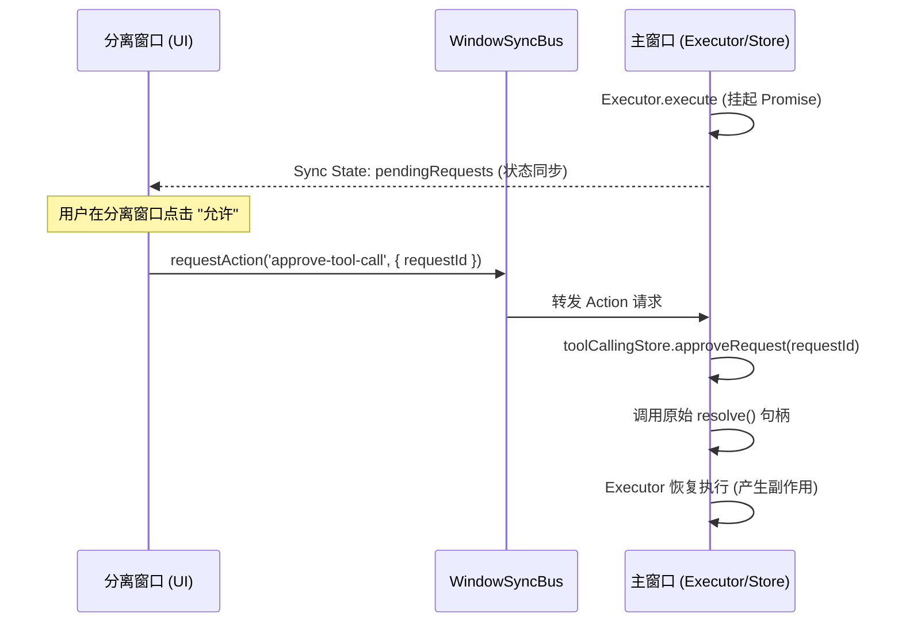

# 工具调用：跨窗口闭环技术方案 (Cross-Window Loop Fix)

## 1. 问题背景 (The Challenge)

在 AIO Hub 的“窗口同步与分离”架构下，`ChatArea`（包含工具调用确认条 `ToolCallingApprovalBar`）可以被分离到独立窗口运行。目前工具调用引擎在分离场景下存在**交互失效**的重大隐患：

### 1.1 Promise 句柄的“进程隔离”

工具调用执行器 (`executor.ts`) 在主窗口运行，它通过 `toolCallingStore.requestApproval` 挂起执行并等待一个 `Promise`。

- **主窗口**：持有原始的 `resolve` 函数句柄。
- **分离窗口**：通过 `useStateSyncEngine` 同步到了 `pendingRequests` 列表，但 **`resolve` 函数无法跨进程序列化**。在分离窗口中，该字段为 `undefined`。

### 1.2 交互断裂

当用户在分离窗口点击“允许”或“拒绝”时，尝试调用本地 Store 的方法。由于本地没有有效的 `resolve` 句柄，点击动作无法触达主窗口的执行器，导致生成过程永久卡死。

## 2. 核心设计：动作代理 (Action Proxy)

为了实现跨窗口闭环，必须建立“远程触发 -> 动作回传 -> 本地执行”的反馈链路。

### 2.1 链路示意图

## 3. 实施细节 (Implementation)

### 3.1 同步层加固 (`useLlmChatSync.ts`)

在主窗口的 `handleActionRequest` 中注册以下新动作：

- `approve-tool-call`: 调用 `toolCallingStore.approveRequest(params.requestId)`
- `reject-tool-call`: 调用 `toolCallingStore.rejectRequest(params.requestId)`
- `approve-all-tool-calls`: 调用 `toolCallingStore.approveAll(params.sessionId)`
- `reject-all-tool-calls`: 调用 `toolCallingStore.rejectAll(params.sessionId)`
- `silent-approve-tool-call`: 调用 `toolCallingStore.silentApproveRequest(params.requestId)`
- `silent-cancel-tool-call`: 调用 `toolCallingStore.silentCancelRequest(params.requestId)`

### 3.2 UI 组件适配 (`ToolCallingApprovalBar.vue`)

重构组件逻辑，使其具备“环境感知”能力：

- **主窗口模式**：直接调用 `toolCallingStore` 的方法（本地执行）。
- **分离窗口模式**：通过 `bus.requestAction` 发送指令（远程代理）。

### 3.3 与交互式预览 (Canvas) 的协同

该方案是 `interactive-confirmation-support.md` 的前置基础。

- 只有解决了跨窗口确认问题，用户才能在分离的聊天窗口中，针对 Canvas 窗口显示的预览效果进行“确认/提交”操作。

## 4. 验收标准

1. 在 `ChatArea` 分离到独立窗口后，点击工具确认条的“允许”按钮，主窗口的 LLM 生成能正常继续。
2. 点击“全部允许”能同时批量处理所有挂起的工具请求。
3. 任何窗口的操作状态（如请求从列表中消失）应实时同步到所有其他窗口。
