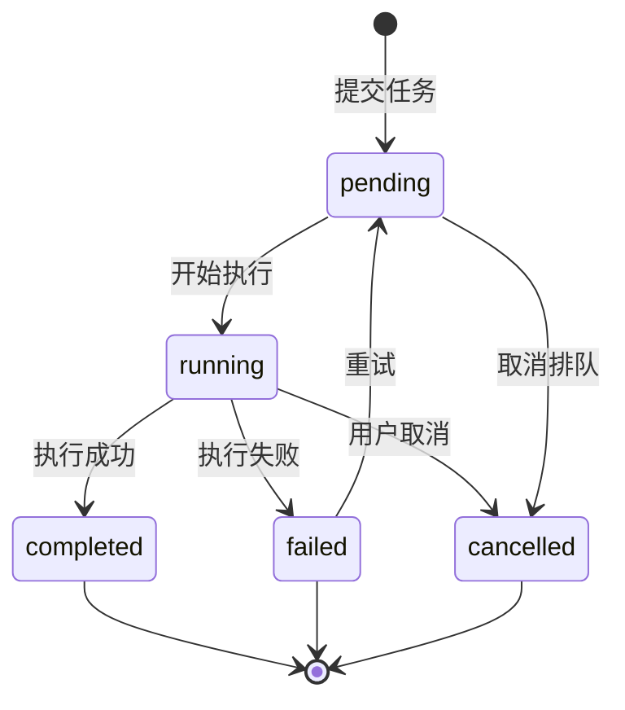
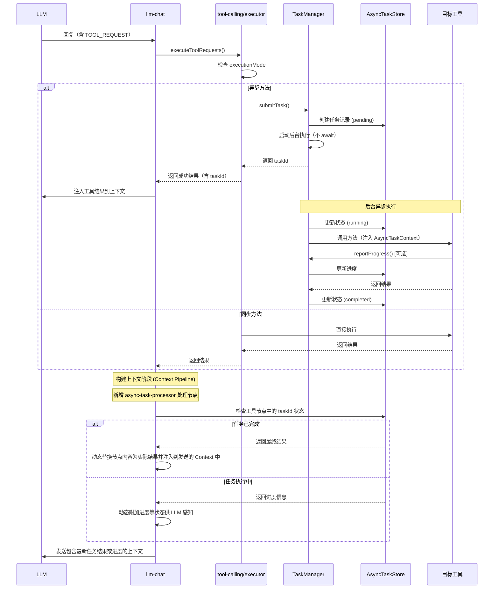
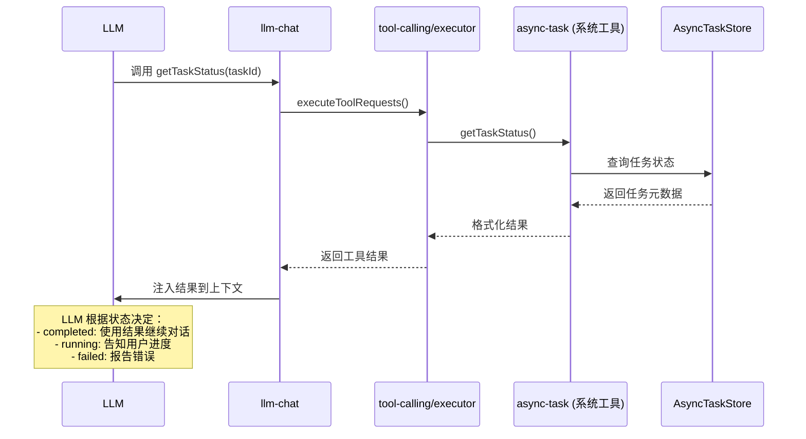

# Tool Calling 异步任务系统 - 改进版设计方案

> **状态**: RFC - 待实施
> **最后更新**: 2026-03-06
> **作者**: Kilo 咕咕

## 0. 核心改进点 (vs 初版方案)

1.  **协议对齐**: 放弃自定义的 `<<<[TOOL_RESULT]>>>` 围栏，完全复用现有的 `[[AIO工具调用结果信息汇总]]` 格式。
2.  **上下文注入规范化**: 定义标准的 `AsyncTaskContext` 接口，通过参数合并安全传递。
3.  **任务状态响应式化**: 任务管理器与 Pinia Store 集成，确保 UI 实时响应。
4.  **提示词增强**: 在 Discovery 阶段明确标注异步方法，引导 LLM 正确处理 `task_id`。
5.  **UI 集成**: 在 `tool-calling` 工具界面添加独立的"异步任务"Tab，支持查看、重试、取消。
6.  **动态上下文注入**: 在构建对话上下文时，自动根据节点中的 `taskId` 拉取最新任务结果，实现 LLM 的“隐式感知”。

---

## 1. 背景与动机

### 1.1. 当前问题

现有的 `tool-calling` 模块采用**同步执行模型**：

```
LLM 发起请求 → 立即执行 → 等待完成 → 返回结果 → 继续对话
```

这种模型存在以下局限：

1. **阻塞式等待**：长耗时任务（如批量文件处理、数据分析、网络爬取）会阻塞整个对话流程
2. **超时风险**：当前默认超时 30 秒，超时后任务被强制中断，无法完成
3. **用户体验差**：长时间无反馈，用户不知道任务进度
4. **资源浪费**：HTTP 连接长时间占用，LLM API 计费时间增加
5. **无法取消**：任务启动后无法中途取消
6. **无法重试**：失败后需要重新发起完整对话

### 1.2. 典型场景

以下场景需要异步任务支持：

- **批量文件处理**：转换 100 个文档格式（可能需要 5-10 分钟）
- **数据分析**：对大型数据集进行统计分析（可能需要 2-5 分钟）
- **网络爬取**：抓取多个网站内容（可能需要 3-8 分钟）
- **模型推理**：本地运行大模型推理（可能需要 1-3 分钟）
- **视频处理**：转码、压缩视频文件（可能需要 10-30 分钟）

### 1.3. 设计目标

1. **非阻塞执行**：任务提交后立即返回，不阻塞对话流程
2. **状态可查**：支持查询任务状态（pending/running/completed/failed/cancelled/interrupted）
3. **进度反馈**：支持任务进度报告（可选）
4. **结果获取**：支持异步获取任务结果
5. **生命周期管理**：支持取消、重试、清理过期任务
6. **持久化**：任务状态持久化，应用重启后保留历史记录（不自动恢复）
7. **向后兼容**：不破坏现有同步工具的调用方式
8. **UI 可视化**：提供独立的任务管理界面，支持手动操作

---

## 2. 架构设计

### 2.1. 核心概念

#### 2.1.1. 任务类型 (Task Type)

工具方法分为两类：

- **同步方法 (Sync Method)**：立即返回结果，执行时间 < 5 秒
- **异步方法 (Async Method)**：返回任务 ID，后台执行，执行时间 ≥ 5 秒

#### 2.1.2. 任务生命周期



#### 2.1.3. 任务状态

```typescript
type TaskStatus =
  | "pending" // 等待执行
  | "running" // 执行中
  | "completed" // 已完成
  | "failed" // 失败
  | "cancelled" // 已取消
  | "interrupted"; // 中断（应用重启导致）
```

### 2.2. 模块结构

```
tool-calling/
├── core/
│   ├── async-task/
│   │   ├── types.ts              # 异步任务类型定义
│   │   ├── task-manager.ts       # 任务管理器（核心）
│   │   ├── task-executor.ts      # 任务执行器
│   │   ├── task-store.ts         # 任务持久化存储
│   │   └── task-queue.ts         # 任务队列（可选，用于并发控制）
│   ├── executor.ts               # 现有执行器（需扩展）
│   └── ...
├── stores/
│   └── asyncTaskStore.ts         # 任务状态管理 (Pinia)
├── components/
│   ├── AsyncTaskMonitor.vue      # 任务监控主组件
│   ├── TaskTable.vue             # 任务表格
│   ├── TaskDetailDialog.vue      # 任务详情对话框
│   └── TaskToolbar.vue           # 工具栏
├── composables/
│   ├── useAsyncTask.ts           # 异步任务 Composable
│   └── useToolCalling.ts         # 现有 Composable（需扩展）
└── ToolCallingTester.vue         # 主界面（需添加新 Tab）
```

### 2.3. 数据流改进 (与 llm-chat 集成)

#### 2.3.1. 异步任务提交流程（改进版）



#### 2.3.2. 任务状态查询流程（改进版）



---

## 3. 核心类型与接口设计

### 3.1. 类型定义 (`core/async-task/types.ts`)

```typescript
/**
 * 异步任务元数据
 */
export interface AsyncTaskMetadata {
  /** 任务唯一 ID */
  taskId: string;
  /** 请求 ID（关联原始 ParsedToolRequest） */
  requestId: string;
  /** 工具 ID */
  toolId: string;
  /** 方法名称 */
  methodName: string;
  /** 完整工具名称（toolId_methodName） */
  toolName: string;
  /** 任务参数 */
  args: Record<string, unknown>;
  /** 创建时间 */
  createdAt: number;
  /** 开始执行时间 */
  startedAt?: number;
  /** 完成时间 */
  completedAt?: number;
  /** 任务状态 */
  status: TaskStatus;
  /** 进度（0-100） */
  progress?: number;
  /** 进度描述 */
  progressMessage?: string;
  /** 执行结果（仅 completed 状态） */
  result?: string;
  /** 错误信息（仅 failed/interrupted 状态） */
  error?: string;
  /** 是否可取消 */
  cancellable: boolean;
  /** 重试来源（如果是重试任务） */
  retriedFrom?: string;
  /** 进度日志 */
  progressLogs?: Array<{ timestamp: number; message: string; percent: number }>;
  /** 关联资产 ID 列表（用于多模态产物，如生成的图片、处理后的视频） */
  resultAssetIds?: string[];
}

/**
 * 任务状态
 */
export type TaskStatus = "pending" | "running" | "completed" | "failed" | "cancelled" | "interrupted";

/**
 * 任务进度回调
 */
export interface TaskProgressCallback {
  (progress: number, message?: string): void;
}

/**
 * 异步任务执行上下文
 * 注入到工具方法的 args 中，工具可以通过 args.__asyncContext 访问
 */
export interface AsyncTaskContext {
  /** 任务 ID */
  taskId: string;
  /** 取消信号 */
  signal: AbortSignal;
  /** 进度报告函数 */
  reportProgress: TaskProgressCallback;
  /** 日志记录函数 */
  log: (message: string, data?: any) => void;
}

/**
 * 异步任务执行结果
 */
export interface AsyncTaskResult {
  /** 任务 ID */
  taskId: string;
  /** 执行状态 */
  status: "submitted" | "immediate_result";
  /** 立即结果（仅 immediate_result 状态） */
  result?: string;
}
```

### 3.2. 元数据扩展 (`src/services/types.ts`)

在现有的 `MethodMetadata` 接口中添加异步任务相关字段：

```typescript
export interface MethodMetadata {
  // ... 现有字段

  /**
   * 方法执行模式
   * - 'sync': 同步执行（默认）
   * - 'async': 异步执行（返回任务 ID）
   */
  executionMode?: "sync" | "async";

  /**
   * 异步任务配置（仅当 executionMode === 'async' 时有效）
   */
  asyncConfig?: {
    /** 是否支持进度汇报 */
    hasProgress?: boolean;
    /** 是否支持中途取消 */
    cancellable?: boolean;
    /** 预估执行时间（秒） */
    estimatedDuration?: number;
  };
}
```

### 3.3. 任务管理器 (`core/async-task/task-manager.ts`)

```typescript
import { createModuleLogger } from "@/utils/logger";
import type { AsyncTaskMetadata, TaskStatus, AsyncTaskContext } from "./types";
import { TaskStore } from "./task-store";
import { TaskExecutor } from "./task-executor";

const logger = createModuleLogger("tool-calling/task-manager");

export class TaskManager {
  private store: TaskStore;
  private executor: TaskExecutor;
  private abortControllers = new Map<string, AbortController>();

  constructor() {
    this.store = new TaskStore();
    this.executor = new TaskExecutor();
  }

  /**
   * 提交异步任务
   */
  async submitTask(toolName: string, args: Record<string, unknown>, requestId: string): Promise<string> {
    const taskId = this.generateTaskId();
    const metadata: AsyncTaskMetadata = {
      taskId,
      requestId,
      toolName,
      args,
      createdAt: Date.now(),
      status: "pending",
      cancellable: true,
    };

    await this.store.saveTask(metadata);
    logger.info("任务已提交", { taskId, toolName });

    // 异步执行（不等待）
    this.executeTask(taskId).catch((error) => {
      logger.error("任务执行失败", error, { taskId });
    });

    return taskId;
  }

  /**
   * 执行任务
   */
  private async executeTask(taskId: string): Promise<void> {
    const task = await this.store.getTask(taskId);
    if (!task) {
      logger.warn("任务不存在", { taskId });
      return;
    }

    // 更新状态为 running
    await this.store.updateTask(taskId, {
      status: "running",
      startedAt: Date.now(),
    });

    // 创建取消控制器
    const abortController = new AbortController();
    this.abortControllers.set(taskId, abortController);

    try {
      // 创建执行上下文
      const context: AsyncTaskContext = {
        taskId,
        signal: abortController.signal,
        reportProgress: (progress, message) => {
          this.updateProgress(taskId, progress, message);
        },
      };

      // 执行任务
      const result = await this.executor.execute(task.toolName, task.args, context);

      // 更新状态为 completed
      await this.store.updateTask(taskId, {
        status: "completed",
        completedAt: Date.now(),
        result,
        progress: 100,
      });

      logger.info("任务执行成功", { taskId });
    } catch (error) {
      const errorMessage = error instanceof Error ? error.message : String(error);

      // 检查是否为取消操作
      if (error instanceof Error && error.name === "AbortError") {
        await this.store.updateTask(taskId, {
          status: "cancelled",
          completedAt: Date.now(),
        });
        logger.info("任务已取消", { taskId });
      } else {
        await this.store.updateTask(taskId, {
          status: "failed",
          completedAt: Date.now(),
          error: errorMessage,
        });
        logger.error("任务执行失败", error, { taskId });
      }
    } finally {
      this.abortControllers.delete(taskId);
    }
  }

  /**
   * 获取任务状态
   */
  async getTask(taskId: string): Promise<AsyncTaskMetadata | null> {
    return await this.store.getTask(taskId);
  }

  /**
   * 取消任务
   */
  async cancelTask(taskId: string): Promise<boolean> {
    const task = await this.store.getTask(taskId);
    if (!task) {
      return false;
    }

    if (task.status === "completed" || task.status === "failed" || task.status === "cancelled") {
      return false; // 已完成的任务无法取消
    }

    // 如果任务正在执行，发送取消信号
    const controller = this.abortControllers.get(taskId);
    if (controller) {
      controller.abort();
    }

    // 如果任务还在 pending 状态，直接标记为 cancelled
    if (task.status === "pending") {
      await this.store.updateTask(taskId, {
        status: "cancelled",
        completedAt: Date.now(),
      });
    }

    logger.info("任务取消请求已发送", { taskId });
    return true;
  }

  /**
   * 重试失败的任务
   */
  async retryTask(taskId: string): Promise<string> {
    const task = await this.store.getTask(taskId);
    if (!task) {
      throw new Error(`任务不存在: ${taskId}`);
    }

    if (task.status !== "failed") {
      throw new Error(`只能重试失败的任务，当前状态: ${task.status}`);
    }

    // 创建新任务
    return await this.submitTask(task.toolName, task.args, task.requestId);
  }

  /**
   * 更新任务进度
   */
  private async updateProgress(taskId: string, progress: number, message?: string): Promise<void> {
    await this.store.updateTask(taskId, {
      progress: Math.min(100, Math.max(0, progress)),
      progressMessage: message,
    });
  }

  /**
   * 清理过期任务
   */
  async cleanupExpiredTasks(maxAgeMs: number = 7 * 24 * 60 * 60 * 1000): Promise<number> {
    return await this.store.cleanupExpiredTasks(maxAgeMs);
  }

  /**
   * 生成任务 ID
   */
  private generateTaskId(): string {
    return `task_${Date.now()}_${Math.random().toString(36).slice(2, 11)}`;
  }
}

// 单例实例
export const taskManager = new TaskManager();
```

### 3.3. 任务执行器 (`core/async-task/task-executor.ts`)

```typescript
import { toolRegistryManager } from "@/services/registry";
import type { AsyncTaskContext } from "./types";
import { createModuleLogger } from "@/utils/logger";

const logger = createModuleLogger("tool-calling/task-executor");

export class TaskExecutor {
  /**
   * 执行异步任务
   */
  async execute(toolName: string, args: Record<string, unknown>, context: AsyncTaskContext): Promise<string> {
    const target = this.parseToolTarget(toolName);
    if (!target) {
      throw new Error(`无效的工具名称格式: ${toolName}`);
    }

    if (!toolRegistryManager.hasTool(target.toolId)) {
      throw new Error(`工具不存在: ${target.toolId}`);
    }

    const toolInstance = toolRegistryManager.getRegistry(target.toolId) as Record<string, unknown>;
    const method = toolInstance[target.methodName];

    if (typeof method !== "function") {
      throw new Error(`方法不存在: ${target.toolId}.${target.methodName}`);
    }

    // 验证方法是否支持异步调用
    const metadata = this.getMethodMetadata(toolInstance, target.methodName);
    if (!metadata?.agentCallable) {
      throw new Error(`方法不可调用: ${target.toolId}.${target.methodName}`);
    }

    // 注入 AsyncTaskContext 到参数中
    const argsWithContext = {
      ...args,
      __asyncContext: context,
    };

    try {
      const result = await (method as Function).call(toolInstance, argsWithContext);
      return typeof result === "string" ? result : JSON.stringify(result ?? null);
    } catch (error) {
      if (context.signal.aborted) {
        const abortError = new Error("任务已取消");
        abortError.name = "AbortError";
        throw abortError;
      }
      throw error;
    }
  }

  private parseToolTarget(toolName: string): { toolId: string; methodName: string } | null {
    const separatorIndex = toolName.indexOf("_");
    if (separatorIndex <= 0 || separatorIndex >= toolName.length - 1) {
      return null;
    }
    return {
      toolId: toolName.slice(0, separatorIndex),
      methodName: toolName.slice(separatorIndex + 1),
    };
  }

  private getMethodMetadata(toolInstance: Record<string, unknown>, methodName: string) {
    const getMetadata = toolInstance.getMetadata as
      | (() => { methods?: Array<{ name: string; agentCallable?: boolean }> })
      | undefined;
    if (typeof getMetadata !== "function") {
      return null;
    }
    const metadata = getMetadata();
    return metadata?.methods?.find((m) => m.name === methodName);
  }
}
```

### 3.4. 任务存储 (`core/async-task/task-store.ts`)

```typescript
import { Store } from "@tauri-apps/plugin-store";
import type { AsyncTaskMetadata } from "./types";
import { createModuleLogger } from "@/utils/logger";

const logger = createModuleLogger("tool-calling/task-store");

export class TaskStore {
  private store: Store;
  private readonly STORE_KEY = "async_tasks";

  constructor() {
    this.store = new Store("tool-calling-tasks.json");
  }

  /**
   * 保存任务
   */
  async saveTask(task: AsyncTaskMetadata): Promise<void> {
    const tasks = await this.getAllTasks();
    tasks[task.taskId] = task;
    await this.store.set(this.STORE_KEY, tasks);
    await this.store.save();
  }

  /**
   * 获取任务
   */
  async getTask(taskId: string): Promise<AsyncTaskMetadata | null> {
    const tasks = await this.getAllTasks();
    return tasks[taskId] || null;
  }

  /**
   * 更新任务
   */
  async updateTask(taskId: string, updates: Partial<AsyncTaskMetadata>): Promise<void> {
    const tasks = await this.getAllTasks();
    const task = tasks[taskId];
    if (!task) {
      logger.warn("尝试更新不存在的任务", { taskId });
      return;
    }
    tasks[taskId] = { ...task, ...updates };
    await this.store.set(this.STORE_KEY, tasks);
    await this.store.save();
  }

  /**
   * 获取所有任务
   */
  async getAllTasks(): Promise<Record<string, AsyncTaskMetadata>> {
    const tasks = await this.store.get<Record<string, AsyncTaskMetadata>>(this.STORE_KEY);
    return tasks || {};
  }

  /**
   * 清理过期任务
   */
  async cleanupExpiredTasks(maxAgeMs: number): Promise<number> {
    const tasks = await this.getAllTasks();
    const now = Date.now();
    let cleanedCount = 0;

    const filteredTasks: Record<string, AsyncTaskMetadata> = {};
    for (const [taskId, task] of Object.entries(tasks)) {
      const age = now - task.createdAt;
      const isCompleted = task.status === "completed" || task.status === "failed" || task.status === "cancelled";

      if (isCompleted && age > maxAgeMs) {
        cleanedCount++;
      } else {
        filteredTasks[taskId] = task;
      }
    }

    if (cleanedCount > 0) {
      await this.store.set(this.STORE_KEY, filteredTasks);
      await this.store.save();
      logger.info("已清理过期任务", { count: cleanedCount });
    }

    return cleanedCount;
  }
}
```

### 3.5. 协议对齐 (无特殊扩展)

放弃初版中自定义的 `<<<[TOOL_RESULT]>>>` 格式。异步任务的提交与查询结果，直接由 Executor 的执行流程返回 JSON 对象字面量的字符串（包含 `taskId`、`status` 等必要字段）。

这些结果天然适用于现有的体系，会经过现有的协议层包装为标准的 `[[AIO工具调用结果信息汇总]]` 大模型所熟悉的标准格式呈现给 AI，确保使用体验的一致性，且避免产生新增正则截取逻辑或维护新的标记格式。

### 3.6. 工具方法标记

在 `services/types.ts` 中扩展 `MethodMetadata`：

```typescript
export interface MethodMetadata {
  // ... 现有字段

  /**
   * 方法执行模式
   * - 'sync': 同步执行（默认）
   * - 'async': 异步执行（返回任务 ID）
   */
  executionMode?: "sync" | "async";

  /**
   * 预估执行时间（秒）
   * 用于 UI 提示和自动选择执行模式
   */
  estimatedDuration?: number;
}
```

### 3.7. 内置任务管理方法

系统自动注册以下内置方法供 LLM 调用：

```typescript
// 在 tool-calling 自身注册为工具
export class ToolCallingRegistry implements ToolRegistry {
  readonly id = "tool-calling";
  readonly name = "工具调用管理";

  getMetadata(): ServiceMetadata {
    return {
      methods: [
        {
          name: "getTaskStatus",
          displayName: "查询任务状态",
          description: "查询异步任务的执行状态和结果",
          parameters: [
            {
              name: "taskId",
              type: "string",
              description: "任务 ID",
              required: true,
            },
          ],
          returnType: "Promise<string>",
          agentCallable: true,
          protocolConfig: {
            vcpCommand: "getTaskStatus",
          },
        },
        {
          name: "cancelTask",
          displayName: "取消任务",
          description: "取消正在执行或等待中的异步任务",
          parameters: [
            {
              name: "taskId",
              type: "string",
              description: "任务 ID",
              required: true,
            },
          ],
          returnType: "Promise<string>",
          agentCallable: true,
          protocolConfig: {
            vcpCommand: "cancelTask",
          },
        },
        {
          name: "retryTask",
          displayName: "重试任务",
          description: "重新执行失败的异步任务",
          parameters: [
            {
              name: "taskId",
              type: "string",
              description: "任务 ID",
              required: true,
            },
          ],
          returnType: "Promise<string>",
          agentCallable: true,
          protocolConfig: {
            vcpCommand: "retryTask",
          },
        },
      ],
    };
  }

  async getTaskStatus(args: { taskId: string }): Promise<string> {
    const task = await taskManager.getTask(args.taskId);
    if (!task) {
      return JSON.stringify({ error: "任务不存在" });
    }
    return JSON.stringify(task);
  }

  async cancelTask(args: { taskId: string }): Promise<string> {
    const success = await taskManager.cancelTask(args.taskId);
    return JSON.stringify({ success, message: success ? "取消成功" : "取消失败" });
  }

  async retryTask(args: { taskId: string }): Promise<string> {
    try {
      const newTaskId = await taskManager.retryTask(args.taskId);
      return JSON.stringify({ success: true, newTaskId });
    } catch (error) {
      return JSON.stringify({ success: false, error: String(error) });
    }
  }
}
```

---

## 4. 执行器集成

### 4.1. 修改 `core/executor.ts`

在 `executeSingleRequest` 中添加异步任务检测：

```typescript
async function executeSingleRequest(
  request: ParsedToolRequest,
  options: ExecutorOptions
): Promise<ToolExecutionResult> {
  // ... 现有验证逻辑

  // 检查方法是否为异步执行模式
  const methodMeta = metadata?.methods?.find((m) => m.name === target.methodName);
  const isAsyncMethod = methodMeta?.executionMode === "async";

  if (isAsyncMethod) {
    // 提交异步任务
    const taskId = await taskManager.submitTask(request.toolName, mergedArgs, request.requestId);

    return {
      requestId: request.requestId,
      toolName: request.toolName,
      status: "success",
      result: JSON.stringify({
        type: "async_task",
        taskId,
        message: "任务已提交，请使用 getTaskStatus 查询进度",
      }),
      durationMs: Date.now() - startedAt,
    };
  }

  // ... 现有同步执行逻辑
}
```

### 4.2. 上下文拦截器（Context Processor）集成

目前 llm-chat 在生成发送给 LLM 的 `messages` 时，通过 Context Pipeline 处理格式化。为了实现“隐式感知动态任务结果”，需要在 `src/tools/llm-chat/core/context-processors/` 中新增 `async-task-processor.ts`:

- **职责**：在最后阶段（优先级建议在 `messageFormatter` 附近）遍历所有即将发送到 API 的节点上下文，查找内容包含异步任务返回数据（即解析出带有 `taskId` 的 JSON 结构内容）的数据。
- **动作**：从 `taskManager` 获取最新任务状态。
  - **如果状态是 `completed`**：
    - **文本注入**：将发送给大模型的 `content` 临时渲染替换为任务的真实 `result`。
    - **资产注入 (Multi-modal)**：如果元数据中包含 `resultAssetIds`，则将对应的资产对象加载并注入到该消息节点的 `attachments` 中，使大模型能直接看到生成/处理后的多模态结果。
  - **如果状态是 `running`**：注入目前的 `progress` 进度和 `progressMessage`，让大模型能在会话中回复用户当前的进展。
- **优点**：无需污染或重写 LLM 历史会话界面的原始节点数据（保持节点内显示着“异步提交中”的原始字样），仅在此次调用构建时动态拦截并替换，从而完美解决大模型即时知悉后台最新状态的需求。

---

## 5. UI 集成方案

### 5.1. 任务管理页面 (新增 Tab)

在 `ToolCallingTester.vue` 中添加"异步任务"Tab，展示所有异步任务的状态。

**功能需求**:

- 任务列表展示（表格形式）
- 实时状态更新（通过 Pinia Store 响应式）
- 操作按钮：取消（running/pending）、重试（failed）、查看结果（completed）、删除（任意状态）
- 批量操作：清理已完成、清理失败、全部清理
- 筛选器：按状态筛选（全部/pending/running/completed/failed/cancelled）
- 搜索：按任务 ID 或工具名称搜索

**数据持久化**:

- 使用 Tauri Plugin Store 存储任务记录
- 应用重启后保留历史记录
- 不自动恢复 `running` 状态的任务（标记为 `interrupted`）
- 支持手动重试中断的任务

### 5.2. 组件结构

```
tool-calling/
├── components/
│   ├── AsyncTaskMonitor.vue       # 任务监控主组件
│   ├── TaskTable.vue              # 任务表格
│   ├── TaskDetailDialog.vue       # 任务详情对话框
│   └── TaskToolbar.vue            # 工具栏（筛选、搜索、批量操作）
├── stores/
│   └── asyncTaskStore.ts          # 任务状态管理 (Pinia)
└── core/
    └── async-task/
        ├── task-manager.ts        # 任务管理器
        ├── task-store.ts          # 持久化存储
        └── types.ts               # 类型定义
```

### 5.3. 任务表格字段

| 字段     | 说明                                                               | 宽度  |
| -------- | ------------------------------------------------------------------ | ----- |
| 任务 ID  | 短 ID（前 8 位） + Tooltip 完整 ID                                 | 120px |
| 工具方法 | `toolId_methodName`                                                | 180px |
| 状态     | Tag 显示（pending/running/completed/failed/cancelled/interrupted） | 100px |
| 进度     | 进度条（仅 running 状态）                                          | 150px |
| 创建时间 | 相对时间（如"2 分钟前"）                                           | 120px |
| 耗时     | 已完成任务显示总耗时                                               | 80px  |
| 操作     | 动态按钮组                                                         | 200px |

### 5.4. 状态图标与颜色

- `pending`: 🕐 灰色
- `running`: ⚙️ 蓝色（动画旋转）
- `completed`: ✅ 绿色
- `failed`: ❌ 红色
- `cancelled`: 🚫 橙色
- `interrupted`: ⚠️ 黄色（应用重启导致）

### 5.5. 任务详情对话框

点击"查看结果"或任务行时弹出，显示：

- 完整任务 ID
- 工具方法名称
- 请求参数（JSON 格式化）
- 执行结果（支持代码高亮）
- 错误信息（如果失败）
- 时间线：创建时间、开始时间、完成时间
- 进度日志（如果工具支持）

### 5.6. 重试机制

**重试策略**:

1. 点击"重试"按钮时，创建一个**新任务**（新 taskId）
2. 复用原任务的 `toolName` 和 `args`
3. 在新任务的 `metadata` 中记录 `retriedFrom: originalTaskId`
4. 原任务保持 `failed` 状态不变（作为历史记录）

**中断任务恢复**:

- 应用重启后，`running` 状态的任务自动标记为 `interrupted`
- 用户可以手动点击"恢复"按钮，创建新任务重新执行

### 5.7. 对话气泡（Message Node）状态响应式绑定与主动轮询

除了"异步任务监控 Tab"页面外，传统的 `llm-chat` 信息流界面内的工具调用气泡（Message Node）也需进行状态联动支持。与“上下文管道”面向 LLM 的逻辑不同，此处的重点是**面向用户的实时展示与交互**：

- **主动监听与绑定**：
  - **感知任务 ID**：如果在渲染 `tool` 类型节点或助手引用组件时，检测到了工具返回值中包含的 `taskId`，组件需在 `onMounted` 阶段自动从 `asyncTaskStore` 中订阅该任务的响应式对象。
  - **状态实时联动**：利用 Pinia 的响应式特性，当后台任务状态（`status`）、进度（`progress`）或日志（`progressMessage`）发生变化时，UI 气泡自动更新，无需用户刷新或等待对话。
- **轮询与同步策略**：
  - **跨会话同步**：如果组件挂载时发现 Store 中没有该任务记录（例如应用重启后），应主动调用 `getTaskStatus` 接口尝试从持久化存储（`TaskStore`）中拉取并同步到 Store。
  - **主动轮询兜底**：对于正在运行的任务，如果响应式连接异常，组件可开启轻量级的定时轮询（如每 2-5 秒一次），直到任务进入终态。
- **展示进度 UI**：在传统聊天气泡中附加一个小型的“任务进度状态块”。
  - **任务运行中**：显示动态的 Spinner 过渡、进度条以及实时的 `progressMessage` 日志。
  - **任务完成**：**多模态预览支持**。如果任务产出了资产（如图片），直接在进度块下方渲染缩略图预览，点击可调用 `ImageViewer` 或 `VideoViewer`。
  - **任务失败**：显示错误信息，并内嵌一个“立即重试”按钮，点击后直接发起新任务。
- **快捷交互操作**：
  - 在气泡内直接提供“取消任务”按钮，方便用户在对话流中直接干预长耗时任务。
  - 任务完成后，提供“复制结果”或“在资产管理器中查看”的快捷入口。

通过这一机制，普通用户即使不特意切换去后台“任务监控中心”，也能在其流式对话内清晰一览任务进度并进行实时交互。

---

## 6. 数据持久化方案

### 6.1. 存储结构

使用 Tauri Plugin Store，文件路径：`{appDataDir}/tool-calling-tasks.json`

```json
{
  "tasks": {
    "task_123": {
      "taskId": "task_123",
      "toolName": "directory-tree_generate",
      "args": { "path": "/home/user" },
      "status": "completed",
      "result": "...",
      "createdAt": 1234567890,
      "startedAt": 1234567891,
      "completedAt": 1234567900,
      "progress": 100
    }
  },
  "metadata": {
    "lastCleanup": 1234567890,
    "version": "1.0"
  }
}
```

### 6.2. 清理策略

- **自动清理**: 每次应用启动时，删除 7 天前的已完成/失败任务
- **手动清理**: 用户可以在 UI 中批量清理
- **保留策略**: `running` 状态的任务在重启后标记为 `interrupted`，不删除

---

## 7. 实施计划

### Phase 1: 核心基础设施 (优先级: 高)

1. 扩展 `MethodMetadata` 类型定义
2. 实现 `TaskManager` 和 `TaskStore`
3. 实现 `AsyncTaskStore` (Pinia)
4. 修改 `executor.ts` 支持异步模式检测

### Phase 2: 协议、发现与上下文注入 (优先级: 高)

1. 扩展 VCP 协议的结果格式化
2. 修改 `discovery.ts` 在提示词中标注异步方法
3. 实现内置的 `getTaskStatus`、`cancelTask` 等系统方法
4. 在 `llm-chat/core/context-processors` 中实现 `async-task-processor.ts` 构建动态结果替换能力

### Phase 3: UI 组件 (优先级: 中)

1. 创建 `AsyncTaskMonitor.vue` 主组件
2. 创建 `TaskTable.vue` 和 `TaskToolbar.vue`
3. 创建 `TaskDetailDialog.vue`
4. 在 `ToolCallingTester.vue` 中集成新 Tab

### Phase 4: 测试与优化 (优先级: 中)

1. 创建测试用的异步工具方法
2. 测试取消、重试、进度汇报
3. 测试应用重启后的状态恢复
4. 性能优化（大量任务时的渲染）

---

## 8. 待确认问题

- ✅ **持久化**: 短期持久化，重启后标记 `interrupted`，支持手动恢复
- ⏳ **VCP 分布式**: 异步任务在远程节点的支持（需要 VCP 协议扩展）
- ⏳ **并发控制**: 是否需要限制同时运行的异步任务数量？
- ⏳ **优先级队列**: 是否需要支持任务优先级？

---

## 9. 附录：初版方案的主要问题

1. **协议冗余**: 发明了 `<<<[TOOL_RESULT]>>>`，与现有格式冲突
2. **执行器断层**: 没有说明异步结果如何被 `llm-chat` 消费
3. **忽略现有 Store**: 应该集成到 Pinia 而非独立状态管理
4. **缺乏轮询引导**: 提示词中没有告诉 LLM 如何查询任务状态
5. **UI 设计不完整**: 缺少具体的交互流程和状态处理

---

## 10. 附录：现有异步工具对接调查 (以 media-generator 为例)

### 10.1. 现状分析：伪 Chat 范式下的任务系统

通过对 `media-generator` 源码的深入调查（参考 `MediaGeneratorRegistry`, `useMediaGenerationManager.ts`），可以确认其内部的“对话”功能并非通用的 LLM Chat，而是一个**高度定制的、基于对话范式的媒体生成工作流**：

1.  **任务即消息 (Task-as-Message)**：
    - 虽然它复用了 `ChatSession` 的树形结构，但其节点 `MediaMessage` 强制绑定了 `MediaTask`。
    - 每一个助手节点本质上是一个“生成任务的 UI 占位符”，其生命周期（Pending -> Processing -> Completed）与媒体生成的后台进程强绑定。
2.  **多模态上下文注入**：
    - 其上下文构造逻辑（`startGeneration`）远比普通 Chat 复杂。它不仅发送文本，还会自动将上一轮生成的“资产（Asset）”作为下一轮的视觉参考附件（VLM 模式），实现迭代微调。
3.  **重度业务逻辑耦合**：
    - 生成过程包含：提示词翻译拦截 -> 多模态上下文映射 -> 媒体二进制流拉取 -> **元数据嵌入 (Steganography)** -> 资产入库 (AssetManager) -> 衍生数据持久化。
    - 这些步骤目前深度耦合在 Vue Composables 中，无法直接作为无状态的工具函数被 LLM 调用。

### 10.2. 与新异步任务系统的本质冲突

1.  **交互模型差异**：
    - **新系统**：目标是“让 LLM 在对话中使用长耗时工具”，产物支持**文本结果与多模态资产**。
    - **Media Generator**：目标是“通过对话生成媒体资产”，最终产物是**二进制资产**，对话只是为了符合多模态模型的交互习惯。
2.  **状态模型不匹配**：
    - 新系统的 `AsyncTaskMetadata` 是泛型的，难以承载媒体生成所需的 `resultAssetIds`、`previewUrls`、`params` 快照等丰富元数据。
3.  **执行阻塞模型不同**：
    - 新系统要求执行器 `await` 任务完成；而 `media-generator` 的现有逻辑是“触发即返回”，通过响应式 Store 驱动 UI 变化。

### 10.3. 结论与接入策略

`media-generator` 不应被视为一个简单的“异步工具”，而是一个“拥有异步能力的独立子系统”。

**建议的接入方案（桥接模式）**：

1.  **轻量化代理**：在 `MediaGeneratorRegistry` 中实现一个标准的 `generateMedia` 方法，作为新系统的“异步工具”入口。
2.  **解耦核心引擎**：将 `useMediaGenerationManager` 中的核心生成逻辑抽离为 `mediaGenCore.ts`，使其不依赖 Vue 生命周期，支持由新系统的 `Executor` 直接驱动。
3.  **结果回传协议**：当任务完成时，回传一个包含 `assetIds` 和 `summary` 的 JSON 字符串。新系统通过 `async-task-processor` 将其注入上下文，使 LLM 能在主聊天中感知到“媒体已生成并在画布展示”。
4.  **UI 保持自治**：主聊天气泡仅显示任务状态和缩略图，深度的参数调整和画廊交互依然保留在 `media-generator` 专用页面中。
