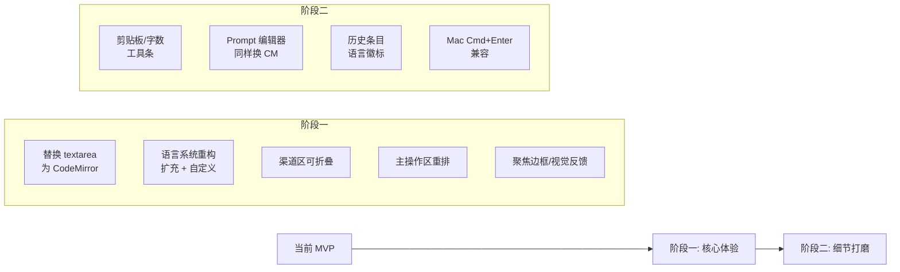

# Translator UI/交互 大整改方案

> 状态：**Approved / Ready to implement**
> 创建：2026-06-01 · 确认：2026-06-01
> 范围：[`src/tools/translator/`](src/tools/translator/) 全量
> 不涉及：[`useTranslatorEngine`](src/tools/translator/composables/useTranslatorEngine.ts:37) / [`useTranslatorCore`](src/tools/translator/composables/useTranslatorCore.ts:1) 的执行逻辑（那部分目前是稳的）

---

## 0. 诊断：当前哪里"MVP 气质太重"

按姐姐原话逐条对应，并补足我额外发现的几处：

### 0.1 输入区是个素面 textarea

[`InputPanel.vue:42-51`](src/tools/translator/components/InputPanel.vue:42) 用的是 `el-input type="textarea"`，能力极其受限：

- ❌ **没有内容搜索** —— 翻译长稿子时找一个段落只能靠肉眼。
- ❌ **聚焦无主题色边框** —— [`InputPanel.vue:200-210`](src/tools/translator/components/InputPanel.vue:200) 显式 `box-shadow: none`，把 Element Plus 自带的聚焦光圈直接禁掉了，结果是 hover/focus 完全没视觉反馈，"死沉"。
- ❌ **没字符数/词数指示**。
- ❌ **没"从剪贴板粘贴"快捷按钮**（Tauri WebView 下 readText 是受限/抖动的，靠系统 Ctrl+V 不一定每次都顺手，尤其在桌面分离窗里）。
- ❌ **没换行/Markdown 高亮** —— 翻译稿件经常带 Markdown 结构，纯 textarea 视觉是糊的。

参考样板：[`src/tools/llm-chat/components/message-input/ChatCodeMirrorEditor.vue`](src/tools/llm-chat/components/message-input/ChatCodeMirrorEditor.vue:1) 已经把 CodeMirror 6 + 搜索面板汉化 + 主题适配 + Ctrl+Enter 全部踩通。我们就抄它。

### 0.2 「开始翻译」按钮位置错了

[`InputPanel.vue:91-115`](src/tools/translator/components/InputPanel.vue:91) 把翻译/停止/清空全部塞在 `.actions` 底栏：

```
┌────────────────┐
│  语言行         │
├────────────────┤
│  输入框         │ ← 高度 200~∞
├────────────────┤
│  渠道列表       │ ← 4 项时占 ~200px
├────────────────┤
│  [翻译] [清空]  │ ← 被挤到看不见
└────────────────┘
```

用户的视线流是「输入文字 → 看着渠道 → 点翻译」，结果翻译按钮在渠道之后再之后。**主操作不该和"清空"这种次要操作混在同一行**。Ctrl+Enter 虽然能发，但 UI 上的视觉锚点必须显眼。

### 0.3 目标语言枚举太少 + 不能自定义

[`constants.ts:1-13`](src/tools/translator/constants.ts:1) 只有 8 种语言（中、英、日、韩、法、德、西、俄）。

- ❌ **缺常用语言**：繁体中文、粤语、葡萄牙语、意大利语、阿拉伯语、越南语、泰语、印尼语、土耳其语、波兰语、荷兰语、乌克兰语、希伯来语、印地语等。
- ❌ **没法填自定义** —— 想翻文言文/克林贡语/Toki Pona 之类，门都没有。
- ❌ [`types.ts:1-10`](src/tools/translator/types.ts:1) 的 `TranslatorLanguageCode` 是硬编码联合类型，扩展成本高，且阻止用户自由输入。
- ❌ **下拉不支持搜索过滤** —— el-select 没开 `filterable`。

### 0.4 渠道区不可折叠

[`InputPanel.vue:53-89`](src/tools/translator/components/InputPanel.vue:53)：渠道列表始终摊开。

- 4 个渠道、每个 32px + 间隔 ≈ 150px，把输入框挤到只剩 ~200px 高度。
- 用户翻译时往往**先配好渠道、然后只关注输入**，渠道区应该可折叠，折叠后给输入框让出空间。

### 0.5 我额外发现的几个偷懒位

| 位置                                                                                             | 问题                                                                                                                                                                                                            |
| ------------------------------------------------------------------------------------------------ | --------------------------------------------------------------------------------------------------------------------------------------------------------------------------------------------------------------- |
| [`InputPanel.vue:200-210`](src/tools/translator/components/InputPanel.vue:200)                   | 输入框 `box-shadow: none` —— 直接抹掉了 Element Plus 的聚焦效果，全程灰色。                                                                                                                                     |
| [`ResultsPanel.vue:394`](src/tools/translator/components/ResultsPanel.vue:394)                   | 用了一个不存在的 CSS 变量 `--card-bg-rgb` 写 `rgba(var(--card-bg-rgb, 255, 255, 255), 0.04)`，FF 这种值大概率被浏览器丢回 fallback `rgba(255,255,255,0.04)`，在亮色主题下没效果。要么去掉，要么用 `color-mix`。 |
| [`InputPanel.vue:50`](src/tools/translator/components/InputPanel.vue:50)                         | `@keydown.ctrl.enter.prevent="store.translate"` —— 已经按了规范用 Ctrl+Enter（✅），但**没有 metaKey 兜底**，Mac 用户用 Cmd+Enter 会失败。                                                                      |
| [`Translator.vue:48-68`](src/tools/translator/Translator.vue:48)                                 | 历史条只显示截短的原文，没显示语言方向徽标，扫描时不直观。                                                                                                                                                      |
| [`Translator.vue:30-40`](src/tools/translator/Translator.vue:30)                                 | "{N} 渠道" 计数后面紧贴一个齿轮按钮，视觉上像同一组件。应该有分隔或者改成"⚙ 设置 · 3 渠道"这种组合。                                                                                                            |
| [`PresetManagerDialog.vue:163-191`](src/tools/translator/components/PresetManagerDialog.vue:163) | Prompt 模板就是个 `el-input type="textarea"`，跟翻译输入框一样的素面问题。同样应该换 CodeMirror（占位符高亮、搜索、聚焦边框）。**P1 优先级**，主输入框搞定后顺势改。                                            |

---

## 1. 整改总览



---

## 2. 阶段一：核心体验整改

### 2.1 用 CodeMirror 替换输入框

**新文件**：[`src/tools/translator/components/TranslatorEditor.vue`](src/tools/translator/components/TranslatorEditor.vue)

不直接复用 [`ChatCodeMirrorEditor`](src/tools/llm-chat/components/message-input/ChatCodeMirrorEditor.vue:1)，因为：

- 它绑死了 `MacroRegistry` / `useChatInputManager`（属于 llm-chat 的内部状态）
- 翻译场景**不需要宏补全**，但**需要语言提示色** / 字符计数事件

抽出共用骨架（也可以将来再做共享 composable），首版直接做翻译专用版本：

```ts
// TranslatorEditor.vue 核心扩展
- markdown() 语法高亮（翻译稿子经常带 MD）
- search({ top: true }) 顶部搜索面板（Ctrl+F 自动唤起）
- 汉化 phrases（搜索 / 替换 / 下一个 / 全部……）
- baseTheme 复用 ChatCodeMirrorEditor 那一套主题变量绑定
- 聚焦边框：外层 wrapper + :focus-within（见 §2.5）
- 字符变化事件 @update:value 同步给 store.inputText
- Ctrl+Enter / Cmd+Enter 双键映射触发 store.translate
```

**Mac 兼容**：CodeMirror 的 `Mod-Enter` 已经是跨平台的（Mod = Ctrl on Win/Linux, Cmd on Mac），抄过来即可，**比当前 `@keydown.ctrl.enter` 更正确**。

### 2.2 主操作区重排

新的 [`InputPanel.vue`](src/tools/translator/components/InputPanel.vue) 网格布局：

```
┌──────────────────────────────────────┐
│ [源语言 ▾]  ⇄  [目标语言 ▾]   ⊕ 自定义 │  ← row1: 语言（带搜索、含自定义入口）
├──────────────────────────────────────┤
│ 📋粘贴  📂从文件  · · ·  0 字 · 0 词 │  ← row2: 工具条 + 字数
├──────────────────────────────────────┤
│                                      │
│      ┌─────────────────────┐         │
│      │  CodeMirror 编辑器   │         │  ← row3: 编辑器（flex: 1）
│      │  Ctrl+F 唤起搜索      │         │
│      └─────────────────────┘         │
│                                      │
├──────────────────────────────────────┤
│ ┌─ ▼ 渠道 (3)              ＋ ─┐    │  ← row4: 渠道折叠头
│ │  1. GPT-4o                  ✕ │    │
│ │  2. Claude Sonnet           ✕ │    │
│ │  3. Gemini 2.0 Pro          ✕ │    │
│ └─────────────────────────────┘    │
├──────────────────────────────────────┤
│  ╔════════════════════════════════╗ │
│  ║  🌐  开 始 翻 译     Ctrl+Enter ║ │  ← row5: 主操作（大按钮、贴近内容）
│  ╚════════════════════════════════╝ │
│  ↑ 翻译中变成 [⏹ 停止全部]            │
└──────────────────────────────────────┘
```

- 主翻译按钮**满宽、48px 高度、type=primary**，旁标 `Ctrl+Enter` 快捷键 hint。
- 翻译中按钮**原地变形**为"停止全部"（红色 danger），保留快捷键 hint。
- 清空、设置、字数走顶部工具栏，不和主操作抢视线。

### 2.3 语言系统重构

#### 2.3.1 类型放宽

[`types.ts`](src/tools/translator/types.ts:1):

```diff
- export type TranslatorLanguageCode =
-   | "auto" | "Chinese" | "English" | ...

+ /**
+  * 翻译目标语言代码。
+  * - "auto": 自动检测（仅源语言可选）
+  * - 内置代码: 见 BUILTIN_TRANSLATOR_LANGUAGES
+  * - 自定义: 任意 string，直接作为 prompt 占位符替换
+  */
+ export type TranslatorLanguageCode = "auto" | (string & {});
```

`(string & {})` 的小技巧能保留 IDE 对内置代码的自动补全，又允许任意 string。

#### 2.3.2 扩充内置库

[`constants.ts`](src/tools/translator/constants.ts:1) 扩到 ~30 种 + 分组：

```ts
export const BUILTIN_TRANSLATOR_LANGUAGES: TranslatorLanguageOption[] = [
  // 元
  { label: "自动检测", value: "auto", group: "meta" },
  // 中文区
  { label: "简体中文", value: "Chinese (Simplified)", group: "cjk" },
  { label: "繁体中文", value: "Chinese (Traditional)", group: "cjk" },
  { label: "粤语", value: "Cantonese", group: "cjk" },
  { label: "文言文", value: "Classical Chinese", group: "cjk" },
  // CJK
  { label: "日文", value: "Japanese", group: "cjk" },
  { label: "韩文", value: "Korean", group: "cjk" },
  // 欧洲
  { label: "英文", value: "English", group: "europe" },
  { label: "法文", value: "French", group: "europe" },
  { label: "德文", value: "German", group: "europe" },
  { label: "西班牙文", value: "Spanish", group: "europe" },
  { label: "葡萄牙文", value: "Portuguese", group: "europe" },
  { label: "意大利文", value: "Italian", group: "europe" },
  { label: "俄文", value: "Russian", group: "europe" },
  { label: "乌克兰文", value: "Ukrainian", group: "europe" },
  { label: "波兰文", value: "Polish", group: "europe" },
  { label: "荷兰文", value: "Dutch", group: "europe" },
  { label: "瑞典文", value: "Swedish", group: "europe" },
  { label: "土耳其文", value: "Turkish", group: "europe" },
  { label: "希腊文", value: "Greek", group: "europe" },
  // 中东
  { label: "阿拉伯文", value: "Arabic", group: "mideast" },
  { label: "希伯来文", value: "Hebrew", group: "mideast" },
  { label: "波斯文", value: "Persian", group: "mideast" },
  // 南/东南亚
  { label: "印地文", value: "Hindi", group: "south-asia" },
  { label: "越南文", value: "Vietnamese", group: "south-asia" },
  { label: "泰文", value: "Thai", group: "south-asia" },
  { label: "印尼文", value: "Indonesian", group: "south-asia" },
  { label: "马来文", value: "Malay", group: "south-asia" },
];
```

下拉用 `el-option-group` 分组渲染。

#### 2.3.3 自定义语言（**确认：持久化**）

settings 增加字段：

```ts
TranslatorSettings {
  // ...原有字段
  /** 用户自定义的语言名（直接作为 prompt 占位符） */
  customLanguages: string[];
}
```

**两个入口**：

1. **快速添加（语言下拉内）**
   - 下拉末尾固定一个「＋ 添加自定义语言…」选项
   - 点击后弹出 `ElMessageBox.prompt`（**必须 `lockScroll: false`**，符合 [`development-standards.md`](.kilocode/rules/development-standards.md) §3.2）
   - 提示用户填入 LLM 友好的英文/原名（如 `"Klingon"`、`"Toki Pona"`、`"Old English"`）
   - 写入 `settings.customLanguages` 自动持久化
   - 自动选中刚添加的语言

2. **集中管理（设置弹窗内）**
   - [`TranslatorSettingsDialog.vue`](src/tools/translator/components/TranslatorSettingsDialog.vue:1) 新增一个「自定义语言」区块
   - 用 `el-tag closable` 的 tag 网格展示所有自定义语言
   - 点 ✕ 删除（删除前如果该语言正在被某个预设当 default 语言用，弹确认；只是 inputText 当前选了它的话直接回退到第一个内置语言）
   - 区块底部一个「＋ 添加」按钮，复用快速添加的 prompt
   - 区块上方有提示文案：「这些语言会出现在所有翻译下拉中。可直接编辑预设默认语言。」

**UI 示意**（设置弹窗新增区块）：

```
┌── 自定义语言 ────────────────────────┐
│ 这些语言会出现在所有翻译下拉中         │
│                                      │
│ [ Klingon  ✕ ] [ Toki Pona  ✕ ]      │
│ [ 文言文  ✕ ] [ Old English  ✕ ]    │
│                                      │
│ [ ＋ 添加 ]                          │
└──────────────────────────────────────┘
```

下拉里的自定义语言**单独成组**：

```
─ 自动 ─
  自动检测
─ 中文 ─
  简体中文 / 繁体中文 / 粤语 / 文言文
─ CJK ─
  ...
─ 我的语言 ─    ← 自定义组，仅在 customLanguages 非空时显示
  Klingon
  Toki Pona
  Old English
─────────────
  ＋ 添加自定义语言…
```

#### 2.3.4 搜索过滤

`el-select` 开 `filterable` + `default-first-option`，超过 30 项时用户能 1 秒定位。

### 2.4 渠道区可折叠（**确认：默认展开 + 持久化**）

settings 增加：

```ts
/**
 * 输入面板渠道区是否折叠。
 * 默认 false（展开）；用户主动折叠后写回，刷新/重启保留。
 */
channelSectionCollapsed: boolean;
```

[`DEFAULT_TRANSLATOR_SETTINGS`](src/tools/translator/composables/useTranslatorSettings.ts:11) 中 `channelSectionCollapsed: false`。

UI：

```vue
<section class="channel-section">
  <button class="section-header" @click="toggleCollapsed">
    <ChevronDown :class="{ rotated: collapsed }" />
    <span>渠道</span>
    <span class="badge">{{ activeChannels.length }}</span>
    <span class="spacer" />
    <el-button :icon="Plus" @click.stop="store.addChannel" />
  </button>

  <Transition name="collapse">
    <div v-show="!collapsed" class="channel-list">
      <!-- 渠道项 -->
    </div>
  </Transition>

  <!-- 折叠状态下显示的紧凑徽章行 -->
  <div v-if="collapsed" class="channel-pills">
    <span v-for="ch in activeChannels" :key="ch.id" class="pill">
      {{ ch.displayName }}
    </span>
  </div>
</section>
```

折叠态高度从 ~200px 压到 ~40px，全部交还给输入框。

### 2.5 聚焦/Hover 视觉反馈

把当前 [`InputPanel.vue:200-210`](src/tools/translator/components/InputPanel.vue:200) 那段 `box-shadow: none` 删掉，编辑器外层用统一 wrapper：

```css
.editor-wrapper {
  border: var(--border-width) solid var(--border-color);
  border-radius: 8px;
  background: var(--input-bg);
  transition:
    border-color 0.2s ease,
    box-shadow 0.2s ease;
}

.editor-wrapper:hover {
  border-color: color-mix(
    in srgb,
    var(--primary-color) 40%,
    var(--border-color)
  );
}

.editor-wrapper:focus-within {
  border-color: var(--primary-color);
  box-shadow: 0 0 0 1px var(--primary-color);
}
```

跟 Element Plus 输入框默认表现对齐，但走主题外观系统的变量（符合 [`theme-appearance.md`](.kilocode/rules/theme-appearance.md)）。

---

## 3. 阶段二：细节打磨

### 3.1 工具条三件套

输入框顶部新工具条 `<div class="editor-toolbar">`：

1. **粘贴按钮** [📋]
   - 用 `@tauri-apps/plugin-clipboard-manager` 的 `readText()` 读剪贴板
   - 读到内容后**追加**而不是覆盖（如果当前输入框已有内容，弹一个二次确认 / 或者直接 append + Toast 提示）
   - 失败 / 空内容时 `customMessage.warning('剪贴板为空或无文本')`

2. **从文件读取按钮** [📂]
   - 用 Tauri 文件对话框 [`open()`](src-tauri/Cargo.toml:1)（`@tauri-apps/plugin-dialog`）选 `.txt / .md / .json / .srt / .vtt` 等文本文件
   - 读取后写入 `store.inputText`
   - 已有内容时弹 `ElMessageBox.confirm('已有内容，是否覆盖？', { lockScroll: false })`
   - 大文件（>200K 字符）二次确认提醒
   - 失败 toast，文件编码默认 UTF-8（读不出来时 fallback 提示用户）

3. **字数指示** [`{n} 字 · {m} 词`]
   - 用 `Array.from(text).length` 拿字符数（处理 emoji）
   - 词数用 `text.trim().split(/\s+/).length`，对 CJK 直接等于字符数

### 3.2 Prompt 模板编辑器同步升级

[`PresetManagerDialog.vue:173-179`](src/tools/translator/components/PresetManagerDialog.vue:173) 的 prompt textarea 一并换成 `TranslatorEditor`（mini 模式：无搜索面板、保留占位符 chip + 自动补全）。点击 chip 时调用 editor 暴露的 `insertText` 而不是字符串拼接，体验更顺。

### 3.3 历史条目语言徽标

[`Translator.vue:48-68`](src/tools/translator/Translator.vue:48) 的 `.history-item` 改成：

```
[icon] [中→英] 这是一段原文…  [3]
```

加上语言方向的小色块，扫描效率高 10 倍。

### 3.4 Mac Cmd+Enter

只要换成 CodeMirror，`keymap.of([{ key: "Mod-Enter", run: trigger }])` 自动覆盖。当前的 `@keydown.ctrl.enter` 删掉。

### 3.5 文件拖放（**阶段二**，1 分钟集成）

直接套现有的 [`DropZone`](src/components/common/DropZone.vue:1)（基于 [`useFileDrop`](src/composables/useFileDrop.ts:1)）包在编辑器外层：

```vue
<DropZone :accept="['.txt', '.md', '.json']" @file="handleDroppedFile">
  <TranslatorEditor ... />
</DropZone>
```

`handleDroppedFile`：

- 读文件文本 → 写入 `store.inputText`
- 已有内容时弹 `ElMessageBox.confirm('已有内容，是否覆盖？', { lockScroll: false })`
- 大文件（>200K 字符）二次确认
- 失败 toast

这条**不会占用阶段一时间**（实际就是包一层 + 一个回调函数），但单独列在阶段二，避免阶段一 PR 体积失控。

---

## 4. 数据/类型变更摘要

### 4.1 [`types.ts`](src/tools/translator/types.ts:1)

```diff
- export type TranslatorLanguageCode = "auto" | "Chinese" | ... | "Russian";

+ export type TranslatorLanguageCode = "auto" | (string & {});
+
+ export interface TranslatorLanguageOption {
+   label: string;
+   value: TranslatorLanguageCode;
+   group?: "meta" | "cjk" | "europe" | "mideast" | "south-asia" | "custom";
+ }
```

### 4.2 [`TranslatorSettings`](src/tools/translator/types.ts:92)

```diff
  TranslatorSettings {
    // ...
+   /** 用户自定义语言名（LLM 友好的英文/原名） */
+   customLanguages: string[];
+
+   /** 输入面板渠道区折叠状态 */
+   channelSectionCollapsed: boolean;
  }
```

[`DEFAULT_TRANSLATOR_SETTINGS`](src/tools/translator/composables/useTranslatorSettings.ts:11) + [`sanitizeSettings`](src/tools/translator/composables/useTranslatorSettings.ts:45) 同步更新（按 [`rules.md`](.kilocode/rules/development-standards.md) §9.1 同步要求）。

### 4.3 [`constants.ts`](src/tools/translator/constants.ts:1)

- 重命名：`TRANSLATOR_LANGUAGES` → `BUILTIN_TRANSLATOR_LANGUAGES`
- 内容扩到 ~30 项 + 分组
- 新增 helper `getLanguageLabel(code, customLanguages)` 用于在 UI 上 resolve label（找不到就回退到 code 本身）

### 4.4 默认预设的 `defaultSourceLang / defaultTargetLang`

`"Chinese"` 历史值需要兼容：在 [`useTranslatorPresets.ts:147-161`](src/tools/translator/composables/useTranslatorPresets.ts:147) 加载阶段做一次迁移：

```ts
"Chinese" → "Chinese (Simplified)"
```

迁移完成后 bump [`TRANSLATOR_CONFIG_VERSION`](src/tools/translator/composables/useTranslatorSettings.ts:123) 到 `1.1.0`。

---

## 5. 文件改动清单

| 文件                                                                                                          | 改动                                                                                                                   |
| ------------------------------------------------------------------------------------------------------------- | ---------------------------------------------------------------------------------------------------------------------- |
| **新增** [`components/TranslatorEditor.vue`](src/tools/translator/components/TranslatorEditor.vue)            | CodeMirror 封装，参考 [`ChatCodeMirrorEditor`](src/tools/llm-chat/components/message-input/ChatCodeMirrorEditor.vue:1) |
| **新增** [`components/LanguageSelect.vue`](src/tools/translator/components/LanguageSelect.vue)                | 带分组 + 搜索 + 自定义入口的语言选择器                                                                                 |
| **改** [`components/InputPanel.vue`](src/tools/translator/components/InputPanel.vue:1)                        | 整体重排版（语言行 / 工具条 / 编辑器 / 渠道折叠 / 主翻译按钮）                                                         |
| **改** [`components/PresetManagerDialog.vue`](src/tools/translator/components/PresetManagerDialog.vue:1)      | Prompt textarea 换 TranslatorEditor、语言下拉接入新组件                                                                |
| **改** [`components/ResultsPanel.vue`](src/tools/translator/components/ResultsPanel.vue:394)                  | 删掉 `--card-bg-rgb` 那行垃圾，改用 `color-mix`                                                                        |
| **改** [`Translator.vue`](src/tools/translator/Translator.vue:48)                                             | 历史条加语言徽标 + "设置" 按钮独立                                                                                     |
| **改** [`types.ts`](src/tools/translator/types.ts:1)                                                          | Language code 放宽 + settings 加字段                                                                                   |
| **改** [`constants.ts`](src/tools/translator/constants.ts:1)                                                  | 扩充语言库 + 分组                                                                                                      |
| **改** [`composables/useTranslatorSettings.ts`](src/tools/translator/composables/useTranslatorSettings.ts:11) | 默认值 + sanitize 加 customLanguages / channelSectionCollapsed                                                         |
| **改** [`composables/useTranslatorPresets.ts`](src/tools/translator/composables/useTranslatorPresets.ts:147)  | 加载阶段迁移 "Chinese" → "Chinese (Simplified)"                                                                        |
| **改** [`ARCHITECTURE.md`](src/tools/translator/ARCHITECTURE.md:1)                                            | 同步更新到 v2 版                                                                                                       |

---

## 6. 风险与约束

1. **CodeMirror 包体积**：[`@codemirror/lang-markdown`](node_modules/@codemirror/lang-markdown) + 主题包整体 ~120KB gzipped，但项目已经在 llm-chat 用了，是 0 边际成本。
2. **历史数据兼容**：用户历史里存的 `sourceLang: "Chinese"` 在新版仍能展示（fallback 到 code 本身），但"重新翻译"会跑出新版 `"Chinese (Simplified)"` 的 prompt，可能与历史结果有微小差异。可以接受。
3. **自定义语言无校验**：用户填 `"emoji"` / `"火星文"` LLM 也会试图翻译，**这是 feature 不是 bug**。
4. **现有截图/录屏**：UI 大改后 [`README.md`](README.md:1) 或文档里如果有 translator 截图需要更新，但目前文档没截图，**无影响**。

---

## 7. 实施顺序

### 阶段一（一次 PR，核心体验）

1. **类型 + settings 字段先落**
   - [`types.ts`](src/tools/translator/types.ts:1): `TranslatorLanguageCode` 放宽为 `"auto" | (string & {})`
   - [`TranslatorSettings`](src/tools/translator/types.ts:92): 增加 `customLanguages: string[]` / `channelSectionCollapsed: boolean`
   - [`useTranslatorSettings.ts`](src/tools/translator/composables/useTranslatorSettings.ts:11): 默认值 + `sanitizeSettings`
   - Bump [`TRANSLATOR_CONFIG_VERSION`](src/tools/translator/composables/useTranslatorSettings.ts:123) → `1.1.0`
2. **constants 扩充** ~30 种语言 + 分组
3. **`TranslatorEditor.vue`** 新文件（CodeMirror 6 + markdown + 搜索 + 主题）
4. **`LanguageSelect.vue`** 新文件（分组 + 搜索 + 快速添加自定义入口）
5. **改 `InputPanel.vue`**：替换 textarea / 工具条（📋粘贴 + 📂读文件 + 字数）/ 布局重排 / 渠道折叠 / 主翻译按钮重做
6. **改 `TranslatorSettingsDialog.vue`**：新增"自定义语言"管理区块（tag 网格 + 增删）
7. **改 `ResultsPanel.vue`**：清理 `--card-bg-rgb` 那段无效 CSS
8. **改 `Translator.vue`**：历史条目语言徽标
9. **改 `useTranslatorPresets.ts`**：加载阶段做一次 `"Chinese"` → `"Chinese (Simplified)"` 迁移
10. **改 `ARCHITECTURE.md`** 同步到 v2

### 阶段二（独立 PR）

11. **`PresetManagerDialog.vue`** 的 prompt textarea 换 `TranslatorEditor`
12. **文件拖放**：[`DropZone`](src/components/common/DropZone.vue:1) 包编辑器 + 回调

---

## 8. 已确认决策

| #   | 问题                   | 决策                                                                                                                                                                     |
| --- | ---------------------- | ------------------------------------------------------------------------------------------------------------------------------------------------------------------------ |
| 1   | 自定义语言是否持久化   | ✅ **持久化**，存 `settings.customLanguages`；下拉里有快速添加入口，[`设置弹窗`](src/tools/translator/components/TranslatorSettingsDialog.vue:1) 里有 tag 管理区集中增删 |
| 2   | 渠道折叠默认状态       | ✅ **默认展开**；用户主动折叠后写入 `settings.channelSectionCollapsed`，跨重启保留                                                                                       |
| 3   | 输入框"从文件读取"按钮 | ✅ **做**，阶段一就接入（轻量调用 Tauri 文件对话框，工具条上一个 📂 按钮）                                                                                               |
| 4   | 文件拖放支持           | ✅ **阶段二**做，复用现成 [`DropZone`](src/components/common/DropZone.vue:1) + [`useFileDrop`](src/composables/useFileDrop.ts:1)，~1 分钟集成                            |
| 5   | 主翻译按钮翻译中带进度 | ❌ **不带**（单输入场景没必要）。结果卡片状态点已能呈现各渠道进度，主按钮保持纯粹（翻译/停止）                                                                           |

---

## 9. 验收清单（实施完后自检）

**阶段一**：

- [ ] 输入框聚焦后边框变主题色（亮起）
- [ ] Ctrl+F / Cmd+F 在输入框中能唤起搜索面板（汉化）
- [ ] 工具条有 📋 粘贴按钮，点击后剪贴板内容被合理处理
- [ ] 工具条有 📂 读文件按钮，可选 `.txt / .md / .json / .srt / .vtt`，已有内容时弹覆盖确认，>200K 字符二次确认
- [ ] 输入框工具条显示实时字符数（CJK 直接计字符 / 拉丁文同时显示词数）
- [ ] 主翻译按钮**显眼、贴近输入框、满宽 48px**
- [ ] 翻译中主按钮变成"停止全部"
- [ ] 渠道区可折叠，**默认展开**，折叠状态持久化
- [ ] 语言下拉有 ≥25 项内置语言 + 分组 + 可搜索过滤
- [ ] 下拉末尾有「＋ 添加自定义语言…」入口
- [ ] 设置弹窗有自定义语言 tag 管理区（增/删）
- [ ] 自定义语言跨重启保留
- [ ] 历史条目能看到语言方向徽标
- [ ] Mac 上 Cmd+Enter 同样触发翻译
- [ ] `--card-bg-rgb` 那段垃圾代码被清理
- [ ] 历史里的 `"Chinese"` 自动迁移到 `"Chinese (Simplified)"`，未报错
- [ ] `TRANSLATOR_CONFIG_VERSION` 升级到 `1.1.0`

**阶段二**：

- [ ] PresetManagerDialog 的 prompt 编辑器换 CodeMirror（占位符 chip 调 `insertText`）
- [ ] 编辑器支持拖放 `.txt / .md / .json` 文件，已有内容时二次确认
