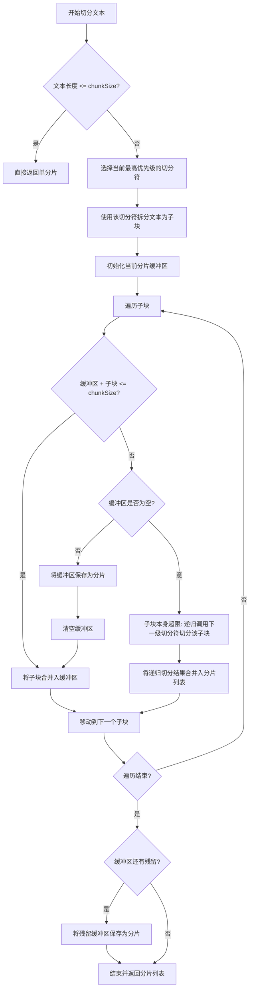

# 翻译工作台（Translator）长文本切分与分片翻译架构设计方案

## 1. 背景与挑战

翻译工作台（Translator）目前是一个优秀的单文本多渠道对比翻译工具。然而，当面对长文本（如数万字的书籍、学术论文、长篇报告）时，直接翻译会面临以下局限性：

1. **模型输出上限（`max_tokens`）**：即使模型的上下文窗口（`context_length`）足够大，其单次输出的 token 数量通常也受到严格限制（通常为 4k 或 8k tokens），直接翻译会导致译文被严重截断。
2. **上下文窗口限制**：超长文本会直接超过模型的上下文承载能力，导致请求被拒绝。

为了解决这些痛点，我们需要设计并实现一套**语义感知的文本切分算法**以及一套**高可靠、支持上下文关联与流式追加的长文本分片翻译调度器**。该模块作为翻译工作台的底层核心能力，既能服务于主界面的单文本超长输入，也能作为批量文件翻译的底层执行单元。

---

## 2. 核心设计目标

1. **语义感知切分**：切分算法必须能够识别段落、句子边界，避免在单词或句子中间硬切，最大程度保留上下文语义。
2. **灵活的执行策略**：
   - **质量优先（串行关联模式）**：单文件内的 Chunks 严格串行翻译，并在 Prompt 中**动态传递上文的原文与译文作为上下文**，确保术语一致性与语气连贯性。
   - **速度优先（并发模式）**：多 Chunks 并发翻译，适合对连贯性要求不高、追求效率的场景。
3. **完善的并发与限流控制**：支持限制最大并发分片数，防止触发 LLM API 的 Rate Limit（RPM/TPM 限制），具备失败重试与断点续传能力。
4. **流式追加与实时反馈**：在分片翻译过程中，支持流式输出，且翻译好一片就实时追加一片，让用户无需干等。
5. **无缝集成与复用**：
   - 主界面单文本输入超长时，自动提示并可一键启用切分翻译。
   - 批量文件翻译中，每个文件的翻译任务直接委托给本模块执行。

---

## 3. 详细设计方案

### 3.1. 语义感知长文本切分算法 (Text Splitter)

切分算法采用**递归字符切分（Recursive Character Splitter）**策略。通过一组预设的、按语义层级从高到低排序的切分符（Separators），递归地将大文本拆分为满足目标大小（`chunkSize`）的分片。

#### 3.1.1. 切分符层级定义

1. **段落级**：`\n\n`（双换行，最理想的切分点）
2. **换行级**：`\n`（单换行）
3. **句子级（中文）**：`。`、`！`、`？`、`；`
4. **句子级（英文）**：`. `、`! `、`? `、`; `（注意带空格，避免切断缩写如 `e.g.`）
5. **词级（英文）**：` `（空格）
6. **字符级**：`""`（空字符串，兜底硬切）

#### 3.1.2. 算法流程图



#### 3.1.3. 翻译场景下的重叠度（Overlap）考量

在 RAG（检索增强生成）场景中，分片通常需要设置重叠度（如 200 字符）以防信息丢失。但在**翻译场景**中：

- **严禁直接物理重叠**：如果分片 A 的末尾与分片 B 的开头重叠，会导致译文中出现重复翻译的段落，破坏译文结构。
- **上下文关联替代重叠**：在串行模式下，我们通过在 Prompt 中以非翻译内容的形式传入“上文参考”，而不是直接在待翻译文本中进行物理重叠。

---

### 3.2. 长文本翻译调度器 (Long Text Translator)

长文本翻译调度器位于 `src/tools/translator/composables/useLongTextTranslator.ts`，它是一个独立的逻辑模块，负责编排单个长文本的切分与翻译。

#### 3.2.1. 核心数据结构定义

```typescript
export interface LongTextChunk {
  index: number;
  sourceText: string;
  translatedText?: string;
  status: "waiting" | "translating" | "completed" | "failed";
  error?: string;
  duration?: number;
  tokenUsage?: {
    promptTokens: number;
    completionTokens: number;
  };
}

export interface LongTextTask {
  id: string; // 对应 channelId，每个渠道一个长文本任务
  channelName: string;
  status:
    | "idle"
    | "splitting"
    | "translating"
    | "completed"
    | "failed"
    | "aborted";
  progress: number; // 0 ~ 100
  chunks: LongTextChunk[];
  error?: string;
  startedAt?: number;
  duration?: number;
}

export interface LongTextConfig {
  sourceLang: string;
  targetLang: string;
  profileId: string;
  modelId: string;
  chunkSize: number; // 默认 3000 字符
  mode: "concurrent" | "sequential"; // concurrent: 速度优先; sequential: 质量优先（带上下文）
  maxConcurrentChunks: number; // 仅在 concurrent 模式下生效，默认 2
  temperature?: number;
  promptTemplate?: string; // 允许自定义 Prompt 模板
  streaming: boolean; // 是否启用流式输出
}
```

#### 3.2.2. 串行关联模式下的上下文传递 (Context Propagation)

在 `sequential` 模式下，单文件的 chunks 严格串行翻译。翻译第 $i$ 个 chunk 时，构建的 Prompt 结构如下：

```
# 角色与任务
你是一位专业的翻译官。请将以下 [待翻译文本] 从 {sourceLang} 翻译为 {targetLang}。

# 翻译准则
1. 保持译文自然、流畅，符合目标语言的表达习惯。
2. 严格保持与 [上文参考] 中已翻译术语、人称代词、语气和风格的高度一致。
3. 仅输出翻译结果，不要包含任何解释、说明或 Markdown 标记。

# 上文参考
<source_context>
${chunk[i-1].sourceText}
</source_context>
<translation_context>
${chunk[i-1].translatedText}
</translation_context>

# 待翻译文本
<text_to_translate>
${chunk[i].sourceText}
</text_to_translate>
```

_注：为了防止上下文累积导致 token 爆炸，我们仅传递**紧邻的上一个分片（1 个 Chunk）**作为上下文，这在绝大多数场景下已足够保持术语和语气的连贯性。_

#### 3.2.3. 并发控制与限流算法

为了在不触发 Rate Limit 的前提下最大化吞吐量，我们使用基于 **Promise 队列** 的并发控制器：

```typescript
class ConcurrencyLimiter {
  private activeCount = 0;
  private queue: (() => void)[] = [];

  constructor(private limit: number) {}

  async run<T>(fn: () => Promise<T>): Promise<T> {
    if (this.activeCount >= this.limit) {
      await new Promise<void>((resolve) => this.queue.push(resolve));
    }
    this.activeCount++;
    try {
      return await fn();
    } finally {
      this.activeCount--;
      const next = this.queue.shift();
      if (next) next();
    }
  }
}
```

#### 3.2.4. 断点续传与重试机制

长文本翻译可能耗时较长，若因网络波动或 API 限制导致部分分片翻译失败，调度器应支持**断点续传**：

1. 当任务状态变为 `failed` 时，已成功的分片（`status: "completed"`）其译文会被妥善保留。
2. 用户点击“重试”时，调度器会扫描分片列表，**智能跳过已成功的分片**，仅对 `waiting` 或 `failed` 的分片重新发起翻译请求。
3. 翻译完成后，重新按顺序拼接所有分片的译文，更新最终结果。

---

### 3.3. 设置与 UI 交互设计

为了让长文本分片翻译功能拥有极致的用户体验，我们需要在设置和 UI 上进行深度定制。

#### 3.3.1. 全局设置扩展 (`TranslatorSettings`)

在 `src/tools/translator/types.ts` 的 `TranslatorSettings` 接口中新增以下字段：

```typescript
export interface TranslatorSettings {
  // ... 现有字段 ...

  /** 是否启用长文本分片翻译功能 */
  splitTranslationEnabled: boolean; // 默认 true
  /** 触发分片翻译的字符数阈值 */
  splitThreshold: number; // 默认 4000 字符
  /** 默认分片大小 */
  splitChunkSize: number; // 默认 3000 字符
  /** 默认分片翻译模式 */
  splitMode: "sequential" | "concurrent"; // 默认 "sequential"
  /** 并发模式下的最大并发分片数 */
  splitMaxConcurrent: number; // 默认 2，范围 1-4
}
```

#### 3.3.2. 设置弹窗专区 (`TranslatorSettingsDialog.vue`)

在设置弹窗中新增“长文本分片翻译”配置专区，允许用户微调以下参数：

- **启用分片翻译**：全局开关。
- **触发字数阈值**：输入框，默认 `4000` 字符。超过此字数时，系统会自动提示启用分片。
- **单分片目标大小**：输入框，默认 `3000` 字符。控制切分后的每个分片大小。
- **默认翻译模式**：单选框，可选“质量优先（串行带上下文）”或“速度优先（并发独立翻译）”。
- **最大并发分片数**：输入框，默认 `2`。仅在速度优先模式下生效，防止触发 429 限流。

#### 3.3.3. 输入面板动态提示 Banner (`InputPanel.vue`)

1. **智能检测**：当用户输入的文本字数超过 `splitThreshold` 时，输入框下方自动弹出一个精致的提示 Banner：
   > 💡 **检测到长文本（共 X 字）**：直接翻译可能会因模型输出上限而被截断。建议启用分片翻译。[立即启用]
2. **一键启用**：点击“立即启用”后，主界面将切换到**分片翻译模式**，翻译按钮变为“分片翻译”，并展开分片微调面板。
3. **分片微调面板**：在渠道区上方，展示当前分片翻译的简要配置（如：`分片大小: 3000 | 模式: 质量优先`），并允许用户快速切换。

#### 3.3.4. 结果面板进度与流式追加 (`ResultsPanel.vue`)

1. **流式追加（Real-time Append）**：在分片翻译过程中，译文采用**实时流式追加**策略。翻译好一片，就立即将该分片的流式输出追加到结果框中，让用户无需干等数分钟。
2. **整体进度条**：结果卡片头部展示一个精致的进度条（如 `已完成 3/10 分片`），并伴有打字机动画。
3. **分片详情抽屉**：点击进度条可展开“分片详情”抽屉，展示每个分片的原文、译文、状态、耗时及 token 消耗，方便用户调试。
4. **断点重试按钮**：若部分分片失败，卡片右上方显示“重试”按钮，点击后仅重试失败的分片。

---

## 4. 实施步骤与代码模块划分

### 4.1. 模块划分

```
src/tools/translator/
  ├── core/
  │   └── textSplitter.ts          # 纯文本切分算法（无状态，高可测性）
  ├── composables/
  │   └── useLongTextTranslator.ts # 长文本切分翻译调度器
  ├── components/
  │   └── SplitDetailDrawer.vue    # 新增：分片详情抽屉组件
  ├── types.ts                     # 扩展长文本翻译相关的类型定义
```

### 4.2. 详细开发步骤

#### 第一步：实现文本切分算法 (`core/textSplitter.ts`)

- 编写 `recursiveSplitText` 函数，实现基于多级分隔符的递归切分。
- 编写单元测试或验证脚本，确保在各种边界条件（如超长无空格文本、纯换行文本、中英文混合文本）下切分正确，且分片大小严格控制在 `chunkSize` 以下。

#### 第二步：扩展类型定义与设置管理 (`types.ts` & `useTranslatorSettings.ts`)

- 在 `types.ts` 中写入 `LongTextTask`、`LongTextChunk`、`TranslatorSettings` 扩展字段。
- 在 `useTranslatorSettings.ts` 中加入新增字段的默认值与范围限制（sanitize 逻辑）。

#### 第三步：实现长文本调度器 (`composables/useLongTextTranslator.ts`)

- 实现 `useLongTextTranslator` 状态管理与调度逻辑。
- 实现 `ConcurrencyLimiter` 并发控制器。
- 实现 `translateLongText` 主函数，支持串行上下文组装、并发控制、流式追加回调以及断点续传。

#### 第四步：重构 Store 编排与 UI 集成

- 在 `useTranslatorStore.ts` 中集成长文本调度器，重构 `translate()` 主函数，使其在超长文本时自动走分片翻译流程。
- 在 `TranslatorSettingsDialog.vue` 中新增分片配置专区。
- 在 `InputPanel.vue` 中实现长文本检测 Banner 与微调面板。
- 在 `ResultsPanel.vue` 中实现分片进度条、流式追加、分片详情抽屉和重试交互。

---

## 5. 风险评估与应对策略

1. **Rate Limit (限流风险)**：
   - _风险_：并发翻译大量 chunks 极易触发 API 的 RPM/TPM 限制，导致大面积请求失败。
   - _应对_：默认将最大并发分片数设为 2。在代码中加入指数退避重试机制（Exponential Backoff），当遇到 429 错误时自动等待并重试。
2. **内存占用过大**：
   - _风险_：超长文本的分片状态保存在 Vue 响应式内存中，可能导致界面卡顿。
   - _应对_：限制单次长文本翻译的最大字符数为 100 万字。对于已完成的分片，及时释放其分片文本内存，仅保留最终译文和统计数据。
3. **上下文漂移（Context Drift）**：
   - _风险_：在串行模式下，如果上一个分片的翻译质量较差，错误可能会在后续分片中累积放大。
   - _应对_：在 Prompt 中明确强调“仅参考上文的术语和风格，严格基于当前文本进行翻译”，并在 UI 上允许用户手动修改已完成分片的译文，修改后的译文将作为后续分片的新上下文。

---

## 6. 施工进度记录

### 2026-06-05

已完成：

- `core/textSplitter.ts`：实现保留分隔符的递归字符切分，覆盖段落、换行、中英文句子、英文空格和字符级兜底。
- `core/__tests__/textSplitter.test.ts`：补充切分单测，验证中英文混合、无分隔符硬切、英文缩写附近不误切等边界。
- `types.ts` / `useTranslatorSettings.ts`：新增长文本分片任务、分片状态、配置字段及默认值、sanitize 范围限制。
- `composables/useLongTextTranslator.ts`：实现长文本调度器，支持串行上下文、并发限流、流式追加、429/临时错误指数退避重试、100 万字符上限和失败分片断点重试。
- `useTranslatorEngine.ts` / `useTranslatorStore.ts`：接入分片翻译编排。渠道之间仍保持并发；单渠道内部按设置选择串行或并发。重试长文本渠道时会复用当前任务，跳过已完成分片。
- `TranslatorSettingsDialog.vue`：新增“长文本分片翻译”设置专区。
- `InputPanel.vue` / `Translator.vue`：新增长文本提示 Banner、一键启用、分片微调条和“分片翻译”按钮文案。
- `ResultsPanel.vue` / `SplitDetailDrawer.vue`：新增结果卡分片进度入口和分片详情抽屉，展示原文、译文、状态、耗时及 token 用量。
- `useTranslatorHistory.ts`：历史记录写入时剔除 `longTextTask`，避免超长分片明细撑大本地历史文件。

与原计划的灵活调整：

- 原计划倾向把 `useLongTextTranslator` 做成完整独立状态模块；实际施工中保留其为调度器，由现有 `useTranslatorEngine` 负责结果态、AbortController、token 估算和渠道编排，以复用当前成熟链路。
- 原计划提到“主界面单文本输入超长时自动走分片翻译流程”；实际实现为“超过阈值自动提示，用户一键启用后走分片流程”。这样保留用户对费用、耗时和上下文模式的明确控制。
- 原计划要求已完成分片及时释放原文以降低内存；当前版本为了分片详情抽屉调试能力，当前会话中保留原文，但历史持久化时剔除分片任务。若后续发现超长文本运行态内存压力明显，再加“完成后压缩/按需展开原文”的二阶段优化。
- 原计划提到可手动修改已完成分片译文并影响后续上下文；本次先完成详情查看与断点重试，尚未提供分片译文编辑入口。

验证记录：

- `bun run vitest --run src/tools/translator/core/__tests__/textSplitter.test.ts`：通过。
- `bun run build:tsc`：通过。
- `bun run lint`：通过。
