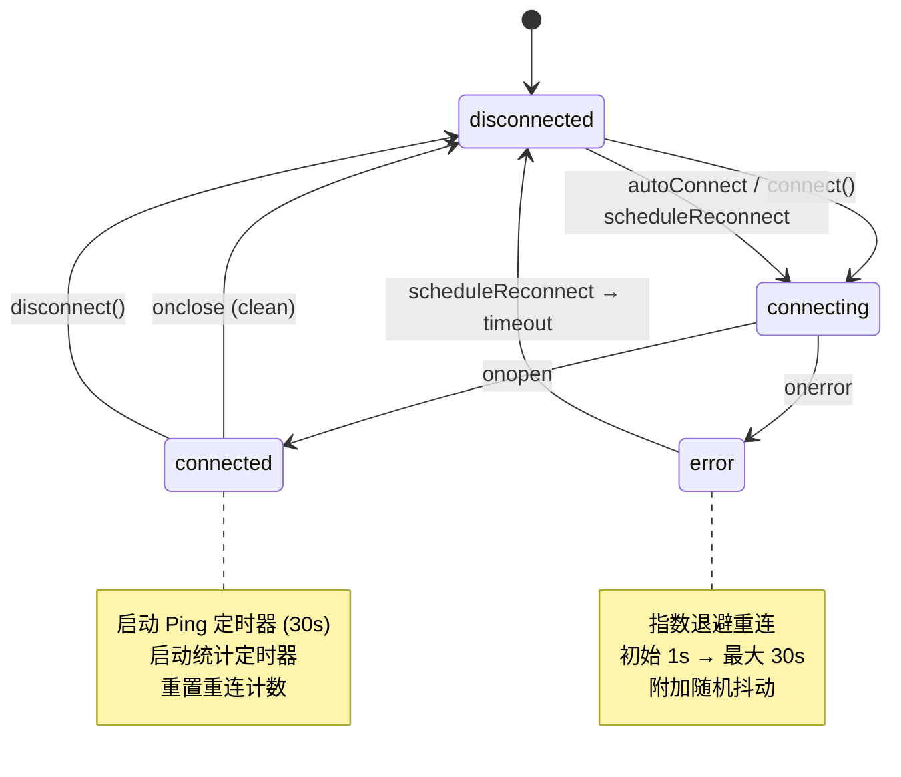
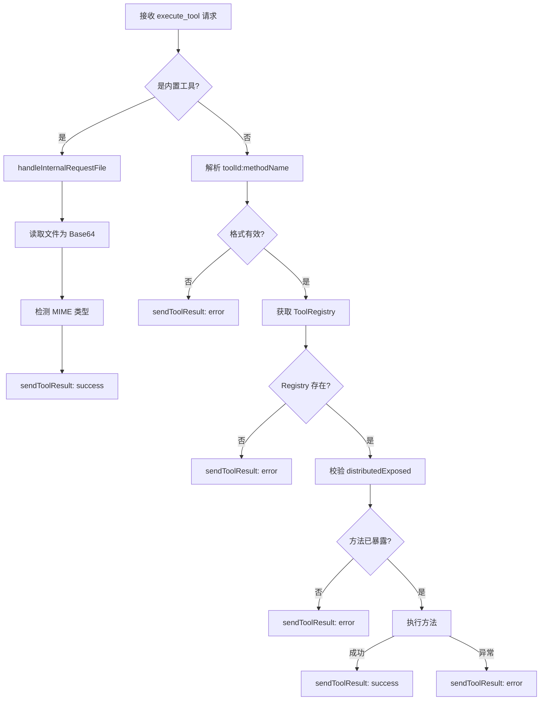
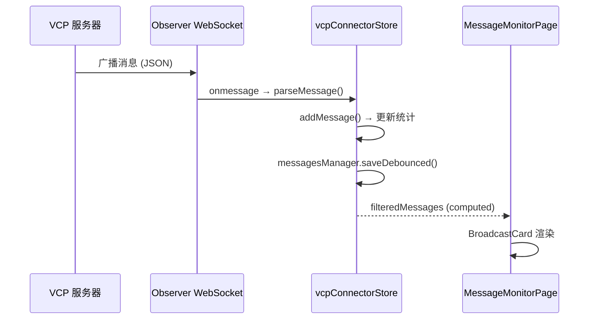
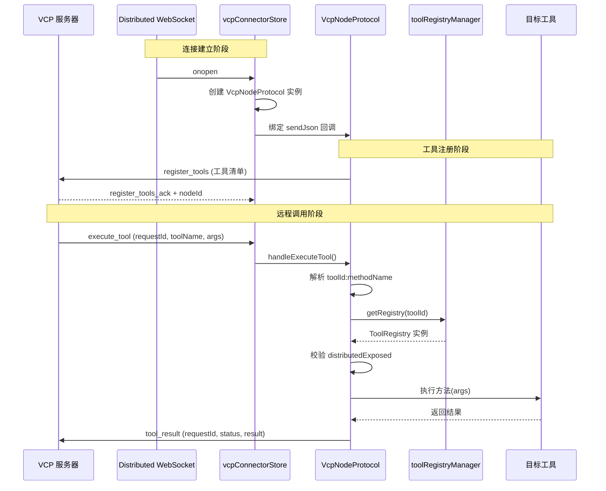
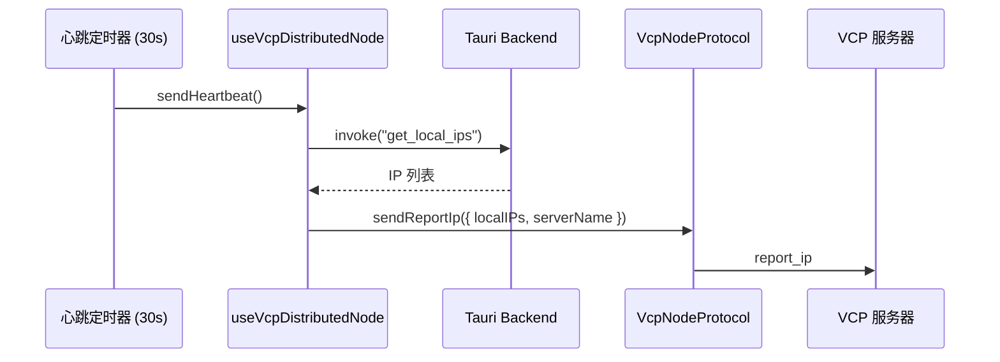

# VCP Connector: 架构与开发者指南

本文档描述 `vcp-connector` 模块的内部架构、设计理念与数据流，为后续开发和维护提供清晰指引。

## 1. 模块定位

### 1.1. 什么是 VCP？

**VCP (Variable & Command Protocol)** 是一个开源的 AI 能力增强与进化中间层（[GitHub: VCPToolBox](https://github.com/lioensky/VCPToolBox)）。它不是一个简单的聊天框架，而是一套完整的 **AI Agent 运行时生态系统**，其核心目标是在 API 层面深度整合三大要素：

- 🧠 **AI 推理引擎** — 对接各类大语言模型，提供统一的对话与工具调用管道
- 🛠️ **外部工具执行** — 通过 300+ 官方插件（涵盖文生图/视频、联网搜索、浏览器控制、文件操作、物联网等）赋予 Agent 丰富的执行能力
- 💾 **持久化记忆系统** — 基于 TagMemo "浪潮"算法的语义动力学 RAG、元思考链、AgentDream 梦系统等，实现 Agent 的长期记忆与认知进化

VCP 的整体架构是一个 **星型分布式网络**：一台 VCP 主服务器作为核心调度中心，多台分布式节点通过 WebSocket 连接到主服务器，将各自的本地插件注册为"云端插件"。主服务器在 AI 需要调用工具时，会智能路由到本地插件或远程节点执行，并将结果透明地回传给 AI。

VCP 主服务器在运行时会通过 WebSocket 广播多种运行时事件（如 RAG 检索详情、元思考链推理过程、Agent 间私聊预览等），供外部客户端监控和调试。

### 1.2. vcp-connector 的定位

`vcp-connector` 是 AIO Hub 中用于 **连接和对接 VCP 生态** 的桌面端工具模块。它通过 WebSocket 与 VCP 主服务器建立连接，提供两大核心能力：

1. **消息监控 (Observer)**: 实时接收并展示 VCP 服务器广播的各类运行时消息，包括 RAG 检索详情、元思考链、Agent 私聊预览、AI 记忆回溯和插件步骤状态。作为 VCP 系统的可视化调试窗口。
2. **分布式节点 (Distributed)**: 将 AIO Hub 注册为 VCP 分布式网络中的一个节点，向 VCP 主服务器暴露本地工具方法，使 VCP 网络中的 AI Agent 可以远程调用 AIO 的能力。

两种模式可独立启用，也可同时运行（`both` 模式）。

## 2. 核心概念

### 2.1. 连接模式 (VcpConnectionMode)

| 模式          | 说明                                              | WebSocket 端点                          |
| ------------- | ------------------------------------------------- | --------------------------------------- |
| `observer`    | 仅监听广播消息，不参与分布式调用                  | `/vcpinfo/VCP_Key=<key>`                |
| `distributed` | 仅注册为分布式节点，不接收广播消息                | `/vcp-distributed-server/VCP_Key=<key>` |
| `both`        | 同时建立两条 WebSocket 连接，兼具监控与分布式能力 | 上述两个端点同时连接                    |

### 2.2. 消息类型 (VcpMessageType)

VCP 服务器广播的消息分为六种类型，每种对应不同的 AI 运行时事件：

| 类型                         | 标签   | 颜色 | 说明                                                         |
| ---------------------------- | ------ | ---- | ------------------------------------------------------------ |
| `RAG_RETRIEVAL_DETAILS`      | RAG    | 蓝色 | RAG 向量检索详情（数据库、查询、评分、标签匹配）             |
| `META_THINKING_CHAIN`        | Chain  | 紫色 | 元思考链的多阶段推理过程                                     |
| `AGENT_PRIVATE_CHAT_PREVIEW` | Agent  | 黄色 | Agent 间私聊的查询与响应预览                                 |
| `AI_MEMO_RETRIEVAL`          | Memo   | 绿色 | AI 记忆/日记回溯的提取结果                                   |
| `PLUGIN_STEP_STATUS`         | Plugin | 灰色 | 插件执行步骤的状态变更                                       |
| `vcp_log`                    | Log    | 灰色 | VCP 运行时日志（工具执行状态、任务通知、错误报告、成功提示） |

### 2.3. 分布式工具注册

分布式节点通过以下机制将 AIO 的工具暴露给 VCP 网络：

1. **自动发现**: 扫描所有标记为 `agentCallable` 或 `distributedExposed` 的工具方法
2. **手动指定**: 通过 `exposedToolIds` 列表额外添加
3. **黑名单排除**: 通过 `disabledToolIds` 列表禁用特定工具
4. **内置工具**: `internal_request_file` 等协议级工具强制暴露

工具名称格式为 `{toolId}:{methodName}`，例如 `knowledge-base:searchKnowledge`。

### 2.4. 配置持久化

模块使用两个 `configManager` 实例分别管理：

| 配置文件                  | 内容                                               |
| ------------------------- | -------------------------------------------------- |
| `config.json`             | 连接配置（WS 地址、VCP Key、自动连接、消息上限等） |
| `distributed-config.json` | 分布式配置（节点名称、暴露工具列表、自动注册开关） |
| `messages.json`           | 历史消息持久化（带防抖保存）                       |

## 3. 架构总览

```
vcp-connector/
├── types/
│   ├── protocol.ts              # 消息协议类型（6 种消息、连接/过滤/统计状态）
│   └── distributed.ts           # 分布式节点类型（配置、清单、请求/响应）
├── services/
│   └── vcpNodeProtocol.ts       # 分布式协议处理器（工具注册、执行路由、结果回传）
├── stores/
│   ├── vcpConnectorStore.ts     # 主 Store（连接管理、消息收发、过滤统计）
│   └── vcpDistributedStore.ts   # 分布式 Store（节点状态、工具清单、配置管理）
├── composables/
│   ├── useVcpWebSocket.ts       # WebSocket 操作的薄封装
│   └── useVcpDistributedNode.ts # 分布式节点生命周期管理
├── components/
│   ├── monitor/                 # 消息监控相关组件
│   │   ├── ConnectionPanel.vue  # 连接配置面板
│   │   ├── FilterPanel.vue      # 消息类型过滤与统计
│   │   ├── MessageMonitorPage.vue # 消息监控主页面（虚拟滚动）
│   │   ├── BroadcastCard.vue    # 消息卡片容器（路由到具体内容组件）
│   │   ├── RagCardContent.vue   # RAG 检索详情卡片
│   │   ├── ChainCardContent.vue # 思考链卡片
│   │   ├── AgentCardContent.vue # Agent 私聊卡片
│   │   ├── MemoCardContent.vue  # 记忆回溯卡片
│   │   ├── PluginCardContent.vue # 插件步骤卡片
│   │   └── LogCardContent.vue   # VCP 日志卡片
│   ├── distributed/             # 分布式节点相关组件
│   │   ├── DistributedNodePage.vue # 分布式节点主页面
│   │   ├── NodeStatusPanel.vue  # 节点状态与配置面板
│   │   └── ExposedToolsList.vue # 暴露工具列表管理
│   └── shared/
│       └── JsonViewer.vue       # JSON 原始数据查看器
├── vcpConnector.registry.ts     # 工具 UI 注册
└── VcpConnector.vue             # 主组件（布局 + Tab 切换）
```

### 3.1. 分层架构

```mermaid
graph TB
    subgraph UI ["视图层 (View)"]
        VC[VcpConnector.vue]
        subgraph Monitor ["消息监控"]
            CP[ConnectionPanel]
            FP[FilterPanel]
            MMP[MessageMonitorPage]
            BC[BroadcastCard]
            RC[RagCardContent]
            CC[ChainCardContent]
            AC[AgentCardContent]
            MC[MemoCardContent]
            PC[PluginCardContent]
            LC[LogCardContent]
        end
        subgraph Distributed ["分布式节点"]
            DNP[DistributedNodePage]
            NSP[NodeStatusPanel]
            ETL[ExposedToolsList]
        end
        JV[JsonViewer]
    end

    subgraph Composable ["组合层 (Composable)"]
        UWS[useVcpWebSocket]
        UDN[useVcpDistributedNode]
    end

    subgraph Store ["状态层 (Store)"]
        VCS[vcpConnectorStore<br/>连接 + 消息 + 过滤]
        VDS[vcpDistributedStore<br/>节点 + 工具清单]
    end

    subgraph Service ["服务层 (Service)"]
        VNP[VcpNodeProtocol<br/>协议处理器]
    end

    subgraph External ["外部依赖"]
        TRM[toolRegistryManager<br/>工具注册中心]
        TDS[tool-calling/discovery<br/>工具发现服务]
        TAURI[Tauri API<br/>文件读取 / IP 获取]
    end

    VC --> MMP & DNP
    MMP --> BC --> RC & CC & AC & MC & PC & LC
    CP --> UWS
    NSP --> UWS & UDN
    ETL --> VDS & TRM

    UWS --> VCS
    UDN --> VCS & VDS & TDS

    VCS --> VNP
    VNP --> TRM
    UDN --> TAURI

    style UI fill:rgba(100,150,255,0.15),stroke:#6496ff
    style Composable fill:rgba(100,200,150,0.15),stroke:#64c896
    style Store fill:rgba(255,200,100,0.15),stroke:#ffc864
    style Service fill:rgba(255,130,100,0.15),stroke:#ff8264
    style External fill:rgba(150,150,150,0.15),stroke:#999
```

## 4. 状态层详解

### 4.1. vcpConnectorStore（主 Store）

[`vcpConnectorStore`](stores/vcpConnectorStore.ts) 是模块的核心状态中心，负责管理连接、消息和过滤。

#### 核心状态

| 状态            | 类型              | 说明                             |
| --------------- | ----------------- | -------------------------------- |
| `config`        | `VcpConfig`       | 连接配置（URL、Key、模式等）     |
| `connection`    | `ConnectionState` | 连接状态（状态、延迟、重连次数） |
| `messages`      | `VcpMessage[]`    | 接收到的消息列表                 |
| `filter`        | `FilterState`     | 过滤条件（类型、关键词、暂停）   |
| `stats`         | `MessageStats`    | 消息统计（各类型计数、消息速率） |
| `nodeProtocol`  | `VcpNodeProtocol` | 分布式协议处理器实例             |
| `ws`            | `WebSocket`       | Observer WebSocket 实例          |
| `distributedWs` | `WebSocket`       | Distributed WebSocket 实例       |

#### 连接生命周期



#### 双 WebSocket 管理

Store 内部维护两条独立的 WebSocket 连接，各自有独立的连接守卫和状态管理：

- **Observer WS** ([`connectObserver()`](stores/vcpConnectorStore.ts:285)): 接收广播消息，维护 Ping/Pong 心跳
- **Distributed WS** ([`connectDistributed()`](stores/vcpConnectorStore.ts:350)): 处理工具注册确认、执行请求分发、节点 ID 分配

[`attemptConnect()`](stores/vcpConnectorStore.ts:267) 根据 `config.mode` 决定启动哪些连接。

#### 消息处理流水线

```
WebSocket.onmessage
    ↓
JSON.parse()
    ↓
parseMessage() ──→ 类型校验 + 时间戳补全
    ↓
addMessage() ──→ 暂停检查 → 推入列表 → 更新统计 → 防抖持久化 → 历史上限裁剪
    ↓
filteredMessages (computed) ──→ 类型过滤 → 关键词搜索 → UI 渲染
```

#### 关键词搜索

[`filteredMessages`](stores/vcpConnectorStore.ts:140) 的关键词搜索针对每种消息类型搜索不同字段：

| 消息类型                     | 搜索字段                                  |
| ---------------------------- | ----------------------------------------- |
| `RAG_RETRIEVAL_DETAILS`      | query, dbName, results[].text             |
| `META_THINKING_CHAIN`        | query, chainName                          |
| `AGENT_PRIVATE_CHAT_PREVIEW` | agentName, query, response                |
| `AI_MEMO_RETRIEVAL`          | extractedMemories                         |
| `PLUGIN_STEP_STATUS`         | pluginName, stepName                      |
| `vcp_log`                    | data.content, data.tool_name, data.source |

#### 日志通知处理

[`handleVcpLogNotification()`](stores/vcpConnectorStore.ts:561) 实现智能路由逻辑，根据日志内容类型推送不同通知：

1. **错误优先**: `status === 'error'` 直接推送错误通知
2. **任务 ID 提取**: 从内容中提取 `task_id` 或 `任务 XXX` 格式，推送任务启动通知
3. **关键字检测**: 包含 "error"/"failed" 推送错误通知
4. **成功提示**: 包含 "归档"/"完成"/"成功" 使用 `customMessage.success` 浮动提示

### 4.2. vcpDistributedStore（分布式 Store）

[`vcpDistributedStore`](stores/vcpDistributedStore.ts) 管理分布式节点的状态和配置。

#### 核心状态

| 状态            | 类型                   | 说明                        |
| --------------- | ---------------------- | --------------------------- |
| `config`        | `VcpDistributedConfig` | 分布式配置                  |
| `nodeId`        | `string \| null`       | VCP 服务器分配的节点 ID     |
| `status`        | 连接状态枚举           | 分布式连接状态              |
| `exposedTools`  | `VcpToolManifest[]`    | 当前已同步到 VCP 的工具清单 |
| `lastHeartbeat` | `number \| null`       | 最近一次心跳时间戳          |

#### 工具管理方法

| 方法                      | 说明                    |
| ------------------------- | ----------------------- |
| `registerToolToVcp()`     | 手动添加工具到暴露列表  |
| `unregisterToolFromVcp()` | 从暴露列表移除工具      |
| `toggleToolDisabled()`    | 切换工具的禁用/启用状态 |

## 5. 服务层详解

### 5.1. VcpNodeProtocol

[`VcpNodeProtocol`](services/vcpNodeProtocol.ts) 是分布式通信的协议处理器，封装了 AIO ↔ VCP 之间的所有协议消息。

#### 出站消息 (AIO → VCP)

| 方法                             | 协议类型                     | 说明             |
| -------------------------------- | ---------------------------- | ---------------- |
| `sendRegisterTools()`            | `register_tools`             | 注册工具清单     |
| `sendReportIp()`                 | `report_ip`                  | 上报节点 IP 信息 |
| `sendUpdateStaticPlaceholders()` | `update_static_placeholders` | 更新静态占位符   |
| `sendToolResult()`               | `tool_result`                | 回传工具执行结果 |

#### 入站消息处理 (VCP → AIO)

[`handleExecuteTool()`](services/vcpNodeProtocol.ts:62) 是核心的入站处理方法，执行流程：



**安全校验**: 即使工具方法存在，也必须在 [`getMetadata()`](services/vcpNodeProtocol.ts:89) 中标记 `distributedExposed: true` 才允许远程执行，防止未授权调用。

## 6. 组合层详解

### 6.1. useVcpWebSocket

[`useVcpWebSocket`](composables/useVcpWebSocket.ts) 是 Store 的薄封装，仅暴露连接操作的 computed 引用。WebSocket 核心逻辑已下沉到 Store 层，确保组件卸载后连接不中断。

### 6.2. useVcpDistributedNode

[`useVcpDistributedNode`](composables/useVcpDistributedNode.ts) 管理分布式节点的完整生命周期：

#### 工具发现流程

[`discoverTools()`](composables/useVcpDistributedNode.ts:52) 的工具收集逻辑：

```mermaid
flowchart TD
    A[开始发现] --> B{autoRegisterTools?}
    B -- 是 --> C[调用 tool-calling/discovery<br/>筛选 agentCallable || distributedExposed]
    C --> D[排除 disabledToolIds 黑名单]
    D --> E[添加到清单]

    B -- 否 --> F[跳过自动发现]

    E --> G[添加内置工具<br/>BUILTIN_VCP_TOOLS]
    F --> G
    G --> H[处理 exposedToolIds<br/>手动指定的工具]
    H --> I[去重合并]
    I --> J[返回 VcpToolManifest 数组]
```

**内置工具**: [`BUILTIN_VCP_TOOLS`](composables/useVcpDistributedNode.ts:22) 定义了所有 VCP 节点强制暴露的协议级工具（如 `internal_request_file`），不可被用户禁用。

#### 生命周期管理

[`startDistributedNode()`](composables/useVcpDistributedNode.ts:182) 启动后会建立两个 watcher：

1. **状态监听**: 当 `distStore.status` 变为 `connected` 时，自动注册工具并启动心跳
2. **配置监听**: 当 `exposedToolIds` 或 `autoRegisterTools` 变化时，自动重新注册工具

#### 心跳机制

每 30 秒通过 [`sendHeartbeat()`](composables/useVcpDistributedNode.ts:146) 向 VCP 服务器上报：

- 本地 IP 地址列表（通过 Tauri `get_local_ips` 命令获取）
- 节点友好名称

## 7. 视图层详解

### 7.1. 主布局 (VcpConnector.vue)

[`VcpConnector.vue`](VcpConnector.vue) 采用左右分栏布局：

- **左侧**: 可折叠的配置侧边栏（连接配置 + 消息过滤）
- **右侧**: Tab 切换的主面板（消息监控 / 分布式节点）
- **抽屉**: JSON 详情查看器（从右侧滑出）

组件初始化时自动调用 `startDistributedNode()` 启动分布式节点逻辑。

### 7.2. 消息监控 Tab

#### ConnectionPanel

[`ConnectionPanel.vue`](components/monitor/ConnectionPanel.vue) 提供连接配置界面：

- **VCP 目录选择**: 通过 Tauri 文件对话框选择 VCP 安装目录
- **自动探测**: 解析目录下的 `config.env` 文件，自动提取 `PORT` 和 `VCP_Key`
- **手动配置**: WebSocket 地址和 VCP Key 的手动输入
- **连接控制**: 连接/断开按钮，自动连接开关
- **状态展示**: 延迟和重连次数

#### FilterPanel

[`FilterPanel.vue`](components/monitor/FilterPanel.vue) 提供消息过滤和统计：

- **类型过滤器**: 6 种消息类型的可视化切换按钮，每种带独立颜色标识
- **统计网格**: 各类型消息计数的实时展示

#### MessageMonitorPage

[`MessageMonitorPage.vue`](components/monitor/MessageMonitorPage.vue) 是消息监控的主页面：

- **顶部工具栏**: 连接状态标签、消息计数、消息速率、搜索框、暂停/清空/导出按钮
- **虚拟滚动**: 使用 `@tanstack/vue-virtual` 实现高性能虚拟滚动，支持：
  - 动态估算消息高度（默认 120px）
  - 仅渲染可见区域 + 5 条预扫描（overscan）
  - 自动滚动到顶部（倒序排列，最新消息在顶）
  - 节流滚动检测，用户接近顶部时自动跟随新消息
- **导出功能**: 将过滤后的消息导出为 JSON 文件

#### BroadcastCard + 内容组件

[`BroadcastCard.vue`](components/monitor/BroadcastCard.vue) 是消息卡片的容器组件，负责：

- 根据消息类型显示对应图标和颜色标识
- 格式化时间戳
- 通过 `defineAsyncComponent` 懒加载具体内容组件

六种内容组件各自负责渲染特定消息类型的详情：

| 组件                                                            | 特性                                                                    |
| --------------------------------------------------------------- | ----------------------------------------------------------------------- |
| [`RagCardContent`](components/monitor/RagCardContent.vue)       | 数据库名、k 值、耗时、查询文本、核心标签、评分着色、标签高亮、展开/折叠 |
| [`ChainCardContent`](components/monitor/ChainCardContent.vue)   | 链名、查询文本、阶段路径可视化（胶囊节点 + 箭头）、阶段详情展开         |
| [`AgentCardContent`](components/monitor/AgentCardContent.vue)   | Agent 名称、Query/Response 气泡对                                       |
| [`MemoCardContent`](components/monitor/MemoCardContent.vue)     | 记忆模式、记录条数、提取内容预览                                        |
| [`PluginCardContent`](components/monitor/PluginCardContent.vue) | 插件名、步骤名、状态标签（等待/运行/完成/失败）                         |
| [`LogCardContent`](components/monitor/LogCardContent.vue)       | 工具名、来源标签、状态标签（success/error）、内容文本（错误红色高亮）   |

### 7.3. 分布式节点 Tab

#### NodeStatusPanel

[`NodeStatusPanel.vue`](components/distributed/NodeStatusPanel.vue) 展示节点配置与运行状态：

- 节点显示名称编辑
- 服务器地址（只读，与 Observer 共享）
- 自动连接 / 自动注册工具开关
- 连接/断连 + 同步工具按钮
- 节点 ID、最近心跳时间、网络延迟、重连次数

#### ExposedToolsList

[`ExposedToolsList.vue`](components/distributed/ExposedToolsList.vue) 管理暴露给 VCP 的工具列表：

- **自动发现开关**: 控制是否自动扫描 `agentCallable` 方法
- **手动添加**: 从所有已注册工具中搜索并添加
- **工具列表**: 展示内置/自动/手动三类工具，支持启用/禁用/移除
- **同步状态**: 显示每个工具是否已同步到 VCP 服务器
- **详情展开**: 查看工具描述和参数定义（JSON Schema，使用 RichCodeEditor 渲染）

工具分类标识：

| 标签 | 含义                                   | 可禁用 | 可移除 |
| ---- | -------------------------------------- | ------ | ------ |
| 内置 | VCP 协议强制要求的工具                 | ❌     | ❌     |
| 自动 | 通过 `agentCallable` 自动发现的工具    | ✅     | ❌     |
| 手动 | 用户手动添加到 `exposedToolIds` 的工具 | ✅     | ✅     |

## 8. 数据流

### 8.1. Observer 消息流



### 8.2. 分布式工具调用流



### 8.3. 心跳与 IP 上报流



## 9. 类型定义

### 9.1. 协议类型 (`types/protocol.ts`)

```typescript
// 消息基类
interface VcpBaseMessage {
  type: VcpMessageType;
  timestamp: number;
  raw?: unknown;
}

// 连接配置
interface VcpConfig {
  wsUrl: string; // WebSocket 地址
  vcpKey: string; // 认证密钥
  vcpPath: string; // VCP 安装目录（用于自动探测）
  autoConnect: boolean; // 自动连接
  maxHistory: number; // 最大历史消息数（默认 500）
  mode?: VcpConnectionMode; // 连接模式
}

// 连接状态
interface ConnectionState {
  status: "disconnected" | "connecting" | "connected" | "error";
  lastPingLatency?: number;
  reconnectAttempts: number;
}

// 过滤状态
interface FilterState {
  types: VcpMessageType[]; // 启用的消息类型
  keyword: string; // 搜索关键词
  paused: boolean; // 是否暂停接收
}
```

### 9.2. 分布式类型 (`types/distributed.ts`)

```typescript
// 分布式节点配置
interface VcpDistributedConfig {
  serverName: string; // 节点友好名称
  exposedToolIds: string[]; // 手动暴露的工具 ID 列表
  disabledToolIds: string[]; // 禁用的工具 ID 列表
  autoRegisterTools: boolean; // 自动发现并注册 AI 工具
}

// 工具清单（注册到 VCP 的工具描述）
interface VcpToolManifest {
  name: string; // toolId:methodName
  displayName?: string; // UI 友好名称
  description: string; // 工具描述
  parameters: any; // JSON Schema 格式的参数定义
  isInternal?: boolean; // 是否为内置协议工具
}

// 远程执行请求
interface ExecuteToolRequest {
  requestId: string;
  toolName: string;
  toolArgs: Record<string, any>;
}

// 执行结果响应
interface ToolResultResponse {
  requestId: string;
  status: "success" | "error";
  result?: any;
  error?: string;
}
```

## 10. 与其他模块的关系

### 10.1. tool-calling 模块

VCP Connector 复用了 `tool-calling` 模块的工具发现服务 ([`createToolDiscoveryService()`](../tool-calling/core/discovery.ts))，用于自动扫描可暴露的工具方法。两个模块共享 `agentCallable` 标记，但 VCP Connector 额外支持 `distributedExposed` 标记。

### 10.2. services/registry

通过 [`toolRegistryManager`](../../services/registry.ts) 访问所有已注册的工具实例，用于：

- 工具发现（扫描 `getMetadata()` 中的方法）
- 工具执行（获取 Registry 实例并调用方法）

### 10.3. Tauri Backend

依赖以下 Tauri 命令：

- `read_text_file_force`: 读取 VCP 配置文件（`config.env`）
- `read_file_as_base64`: 内置文件请求工具的文件读取
- `get_file_mime_type`: 文件 MIME 类型检测
- `get_local_ips`: 获取本地 IP 地址列表

## 11. 关键设计决策

### 11.1. WebSocket 逻辑下沉到 Store

WebSocket 连接管理从 Composable 下沉到 Store 层，确保组件卸载后连接不中断。[`useVcpWebSocket`](composables/useVcpWebSocket.ts) 仅作为 Store 的薄封装存在。

### 11.2. 双 WebSocket 独立管理

Observer 和 Distributed 使用独立的 WebSocket 实例和连接守卫，可以在一条连接已建立的情况下单独触发另一条连接，避免相互干扰。

### 11.3. 消息不存储 raw 副本

[`parseMessage()`](stores/vcpConnectorStore.ts:224) 不将原始数据存储到 `raw` 字段，因为 `...data` 已展开所有字段，`raw` 是完全冗余的副本，会使序列化体积翻倍。[`JsonViewer`](components/shared/JsonViewer.vue) 使用 `msg.raw || msg` 的 fallback 机制，不受影响。

### 11.4. 指数退避 + 随机抖动

重连策略采用指数退避（1s → 2s → 4s → ... → 30s）加随机抖动（0~1s），避免多个连接同时重连造成服务器压力。

### 11.5. 内置工具强制暴露

[`BUILTIN_VCP_TOOLS`](composables/useVcpDistributedNode.ts:22) 中定义的工具（如 `internal_request_file`）始终包含在工具清单中，不受用户配置影响，确保 VCP 协议的基础能力可用。

### 11.6. 虚拟滚动优化

消息列表使用 `@tanstack/vue-virtual` 实现虚拟滚动，而非 `TransitionGroup` 全量渲染。这确保了在数千条消息场景下仍能保持流畅滚动和快速渲染。倒序排列设计（最新消息在顶部）配合自动滚动逻辑，确保用户无需手动滚动即可查看最新事件。

## 12. 扩展指南

### 12.1. 添加新的消息类型

1. 在 [`types/protocol.ts`](types/protocol.ts:1) 中添加新的 `VcpMessageType` 值和对应的消息接口
2. 将新类型加入 [`VcpMessage`](types/protocol.ts:93) 联合类型
3. 在 [`parseMessage()`](stores/vcpConnectorStore.ts:250) 的 `validTypes` 数组中注册
4. 在 [`stats`](stores/vcpConnectorStore.ts:100) 和 [`addMessage()`](stores/vcpConnectorStore.ts:534) 中添加计数逻辑
5. 在 [`filteredMessages`](stores/vcpConnectorStore.ts:140) 的关键词搜索中添加字段匹配
6. 在 [`FilterPanel.vue`](components/monitor/FilterPanel.vue:81) 的 `typeOptions` 中添加过滤选项，在统计网格中添加计数显示
7. 创建新的 `XxxCardContent.vue` 组件
8. 在 [`BroadcastCard.vue`](components/monitor/BroadcastCard.vue:5) 中添加对应的图标（从 `lucide-vue-next` 选择）和内容组件路由

### 12.2. 添加新的内置工具

1. 在 [`BUILTIN_VCP_TOOLS`](composables/useVcpDistributedNode.ts:22) 数组中添加 `VcpToolManifest` 定义
2. 在 [`VcpNodeProtocol.handleExecuteTool()`](services/vcpNodeProtocol.ts:62) 中添加特殊处理分支（参考 `internal_request_file` 的实现）

### 12.3. 添加新的分布式协议消息

1. 在 [`types/distributed.ts`](types/distributed.ts:27) 的 `VcpDistributedMessage.type` 中添加新类型
2. 在 [`VcpNodeProtocol`](services/vcpNodeProtocol.ts) 中添加对应的发送/处理方法
3. 在 [`handleDistributedMessage()`](stores/vcpConnectorStore.ts:415) 中添加消息路由分支

### 12.4. 让工具方法可被 VCP 远程调用

1. 确保工具实现了 `ToolRegistry` 接口并注册到 `toolRegistryManager`
2. 在 `getMetadata()` 返回的方法列表中，将目标方法标记为 `distributedExposed: true`（或 `agentCallable: true`，后者会被自动发现）
3. 方法签名应为 `(args: Record<string, any>) => Promise<any>`
4. 确保方法实现是幂等且安全的，因为远程调用无法进行用户交互确认
