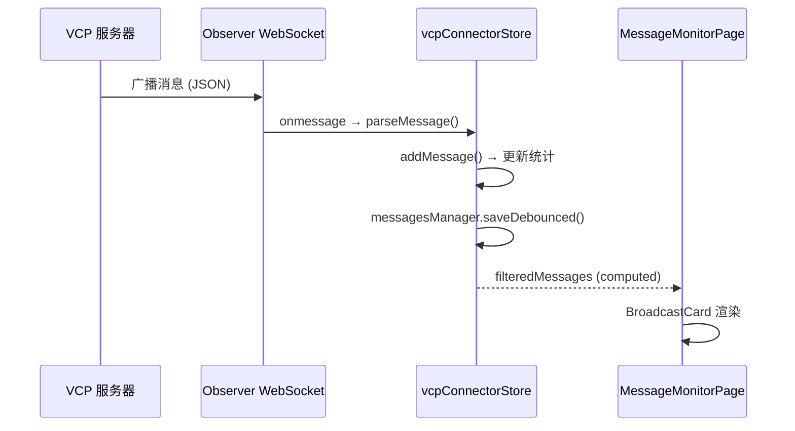
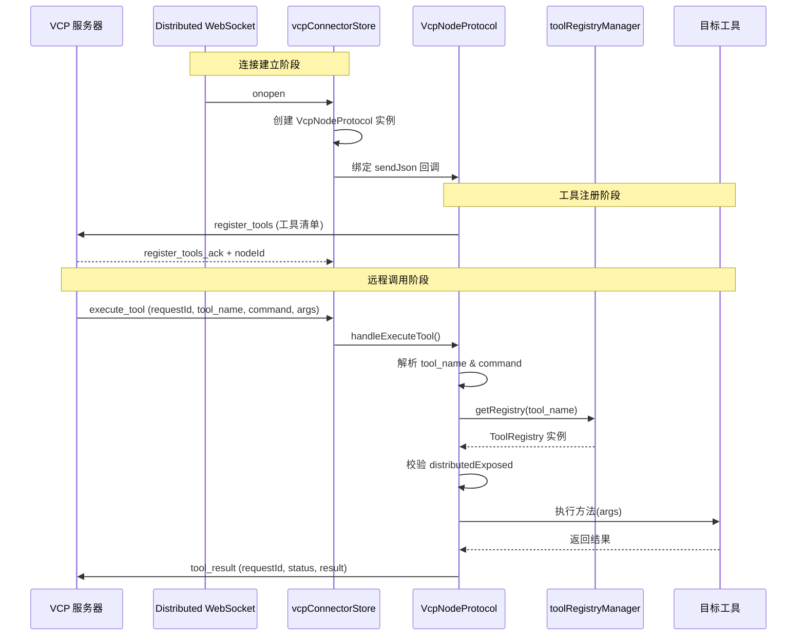
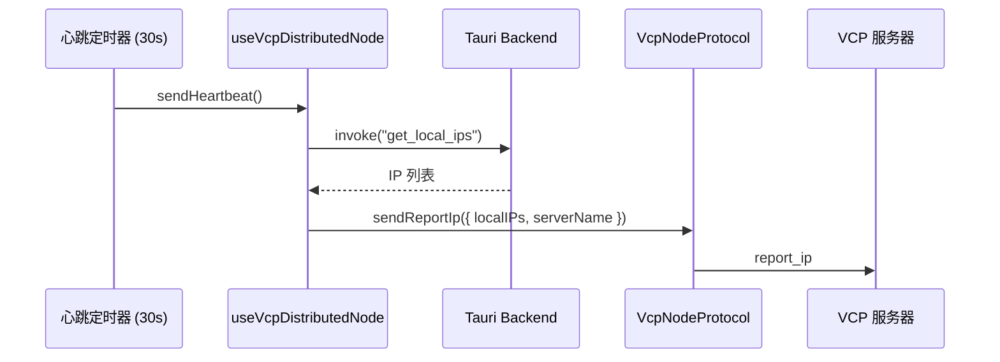

# VCP Connector: 架构与开发者指南

本文档描述 `vcp-connector` 模块的内部架构、设计理念与数据流，为后续开发和维护提供清晰指引。

## 1. 模块定位

### 1.1. 什么是 VCP？

**VCP (Variable & Command Protocol)** 是一个开源的 AI 能力增强与进化中间层（[GitHub: VCPToolBox](https://github.com/lioensky/VCPToolBox)）。它是一套完整的 **AI Agent 运行时生态系统**，其核心目标是在 API 层面深度整合三大要素：

- 🧠 **AI 推理引擎** — 对接各类大语言模型，提供统一的对话与工具调用管道
- 🛠️ **外部工具执行** — 通过 70+ 官方插件（涵盖文生图/视频、联网搜索、浏览器控制、文件操作、物联网等）赋予 Agent 丰富的执行能力
- 💾 **持久化记忆系统** — 基于 TagMemo "浪潮"算法的语义动力学 RAG、元思考链、AgentDream 梦系统等，实现 Agent 的长期记忆与认知进化

VCP 的整体架构是一个 **星型分布式网络**：一台 VCP 主服务器作为核心调度中心，多台分布式节点通过 WebSocket 连接到主服务器，将各自的本地插件注册为"云端插件"。主服务器在 AI 需要调用工具时，会智能路由到本地插件或远程节点执行，并将结果透明地回传给 AI。

VCP 主服务器在运行时会通过 WebSocket 广播多种运行时事件（如 RAG 检索详情、元思考链推理过程、Agent 间私聊预览等），供外部客户端监控和调试。

### 1.2. vcp-connector 的定位

`vcp-connector` 是 AIO Hub 中用于 **连接和对接 VCP 生态** 的桌面端工具模块。它通过 WebSocket 与 VCP 主服务器建立连接，提供三大核心能力：

1. **消息监控 (Observer)**: 实时接收并展示 VCP 服务器广播的各类运行时消息，包括 RAG 检索详情、元思考链、Agent 私聊预览、AI 记忆回溯和插件步骤状态。作为 VCP 系统的可视化调试窗口。
2. **分布式节点 (Distributed)**: 将 AIO Hub 注册为 VCP 分布式 network 中的一个节点，向 VCP 主服务器暴露本地工具方法，使 VCP 网络中的 AI Agent 可以远程调用 AIO 的能力。
3. **工具桥接 (Bridge)**: 动态发现并接入 VCP 服务器上的原生插件，将其映射为 AIO 内部工具。支持双向工具共享，极大扩展了 AIO 本地 Agent 的执行边界。

三种模式可独立启用，也可同时运行（默认 `both` 模式包含分布式与监控，桥接功能在分布式连接基础上按需开启）。

---

## 2. 核心概念

### 2.1. 连接模式 (VcpConnectionMode)

| 模式          | 说明                                              | WebSocket 端点                                      |
| ------------- | ------------------------------------------------- | --------------------------------------------------- |
| `observer`    | 仅监听广播消息，不参与分布式调用                  | `/vcpinfo/VCP_Key=<key>` 与 `/VCPlog/VCP_Key=<key>` |
| `distributed` | 仅注册为分布式节点，不接收广播消息                | `/vcp-distributed-server/VCP_Key=<key>`             |
| `both`        | 同时建立三条 WebSocket 连接，兼具监控与分布式能力 | 上述三个端点同时连接                                |

### 2.2. 消息类型 (VcpMessageType)

VCP 服务器广播的消息分为六种类型，每种对应不同的 AI 运行时事件：

| 类型                         | 标签   | 颜色 | 说明                                                         |
| ---------------------------- | ------ | ---- | ------------------------------------------------------------ |
| `RAG_RETRIEVAL_DETAILS`      | RAG    | 蓝色 | RAG 向量检索详情（数据库、查询、评分、标签匹配）             |
| `META_THINKING_CHAIN`        | Chain  | 紫色 | 元思考链的多阶段推理过程                                     |
| `AGENT_PRIVATE_CHAT_PREVIEW` | Agent  | 黄色 | Agent 间私聊的查询与响应预览                                 |
| `AI_MEMO_RETRIEVAL`          | Memo   | 绿色 | AI 记忆/日记回溯的提取结果                                   |
| `PLUGIN_STEP_STATUS`         | Plugin | 灰色 | 插件执行步骤的状态变更                                       |
| `vcp_log`                    | Log    | 灰色 | VCP 运行时日志（工具执行状态、任务通知、错误报告、成功提示） |

### 2.3. 工具共享机制

#### 2.3.1. 暴露工具 (AIO -> VCP)

分布式节点通过以下机制将 AIO 的工具暴露给 VCP 网络：

1. **自动发现**: 扫描所有标记为 `agentCallable` 或 `distributedExposed` 的工具方法。
2. **手动指定**: 通过 `exposedToolIds` 列表额外添加。
3. **黑名单排除**: 通过 `disabledToolIds` 列表禁用特定工具。
4. **内置工具**: `internal_request_file` 等协议级工具强制暴露。

#### 2.3.2. 桥接工具 (VCP -> AIO)

通过 `VcpBridgeFactory` 实现：

1. **清单拉取**: 连接时自动从 VCP 获取可用插件清单（`get_vcp_manifests`）。
2. **动态代理**: 使用 `VcpToolProxy` 将每个 VCP 插件包装为 AIO 的 `ToolRegistry` 实例。
3. **参数映射**: 支持将 VCP 的启发式描述或 JSON Schema 映射为 AIO 的方法参数定义。
4. **配置同步**: 将 VCP 插件的 `configSchema` 映射为 AIO 工具的设置项，支持在 AIO UI 中直接配置远程插件。

### 2.4. 异步任务集成

对接 AIO 的任务系统（`taskManager`），使 VCP 侧的异步操作透明化：

- **任务映射**: VCP 返回 `taskId` 时，AIO 自动创建 `vcp_{id}` 格式的外部任务。
- **进度回传**: 通过 `vcp_tool_status` 消息实时更新 AIO 任务面板的进度条和日志。
- **结果同步**: 任务完成后，通过 `vcp_tool_result` 将最终结果推送到 AIO 执行器。

### 2.5. 工具调用审批系统

为分布式调用提供人工干预能力：

- **远程请求**: VCP 节点发起敏感操作时，AIO 接收 `tool_approval_request` 并弹出审批界面。
- **状态同步**: 审批结果（允许/拒绝）通过 `tool_approval_response` 实时反馈给 VCP 调度中心。

### 2.6. 配置持久化

模块使用两个 `configManager` 实例分别管理：

- `config.json`: 连接配置（WS 地址、VCP Key、自动连接、消息上限等）
- `distributed-config.json`: 分布式配置（节点名称、暴露工具列表、自动注册开关）
- `messages.json`: 历史消息持久化（带防抖保存）

---

## 3. 架构总览

### 3.1. 目录结构

```
vcp-connector/
├── docs/                        # 🌟 详细设计与开发文档
│   ├── internal-file-request.md # 内置文件请求协议适配
│   ├── implementation-details.md # Store、Service 与 Composable 实现细节
│   └── extension-guide.md       # 模块扩展指南
├── types/
│   ├── protocol.ts              # 消息协议类型（6 种消息、连接/过滤/统计状态）
│   └── distributed.ts           # 分布式节点类型（配置、清单、请求/响应）
├── services/
│   ├── vcpNodeProtocol.ts       # 分布式协议处理器（工具注册、执行路由、结果回传）
│   ├── VcpBridgeFactory.ts      # 工具桥接工厂
│   └── VcpToolProxy.ts          # 远程工具代理
├── stores/
│   ├── vcpConnectorStore.ts     # 主 Store（连接管理、消息收发、过滤统计）
│   └── vcpDistributedStore.ts   # 分布式 Store（节点状态、工具清单、配置管理）
├── composables/
│   ├── useVcpWebSocket.ts       # WebSocket 操作的薄封装
│   └── useVcpDistributedNode.ts # 分布式节点生命周期管理
├── components/                  # 视图层组件
│   ├── monitor/                 # 消息监控相关组件
│   ├── distributed/             # 分布式节点相关组件
│   └── shared/                  # 共享组件
├── vcpConnector.registry.ts     # 工具 UI 注册
└── VcpConnector.vue             # 主组件（布局 + Tab 切换）
```

### 3.2. 分层架构

```mermaid
graph TB
    subgraph UI ["视图层 (View)"]
        VC[VcpConnector.vue]
        subgraph Monitor ["消息监控"]
            CP[ConnectionPanel]
            FP[FilterPanel]
            MMP[MessageMonitorPage]
            BC[BroadcastCard]
            RC[RagCardContent]
            CC[ChainCardContent]
            AC[AgentCardContent]
            MC[MemoCardContent]
            PC[PluginCardContent]
            LC[LogCardContent]
        end
        subgraph Distributed ["分布式节点"]
            DNP[DistributedNodePage]
            NSP[NodeStatusPanel]
            ETL[ExposedToolsList]
        end
        JV[JsonViewer]
    end

    subgraph Composable ["组合层 (Composable)"]
            UWS[useVcpWebSocket]
            UDN[useVcpDistributedNode]
        end

        subgraph Store ["状态层 (Store)"]
            VCS[vcpConnectorStore<br/>连接 + 消息 + 过滤]
            VDS[vcpDistributedStore<br/>节点 + 工具清单 + 桥接清单]
            TCS[toolCallingStore<br/>工具审批管理]
        end

        subgraph Service ["服务层 (Service)"]
            VNP[VcpNodeProtocol<br/>核心协议处理器]
            VBF[VcpBridgeFactory<br/>工具桥接工厂]
            VTP[VcpToolProxy<br/>远程工具代理]
        end

        subgraph External ["外部依赖"]
            TRM[toolRegistryManager<br/>工具注册中心]
            TDS[tool-calling/discovery<br/>工具发现服务]
            TMG[taskManager<br/>异步任务管理]
            TAURI[Tauri API<br/>文件读取 / IP 获取]
        end

        VC --> MMP & DNP
        MMP --> BC --> RC & CC & AC & MC & PC & LC
        DNP --> NSP & ETL & BTL[BridgedToolsList]
        CP --> UWS
        NSP --> UWS & UDN
        ETL --> VDS & TRM
        BTL --> VBF & VDS

        UWS --> VCS
        UDN --> VCS & VDS & TDS

        VCS --> VNP
        VNP --> TRM & TCS & VBF
        VBF --> VTP & TRM & TMG
        UDN --> TAURI

    style UI fill:rgba(100,150,255,0.15),stroke:#6496ff
    style Composable fill:rgba(100,200,150,0.15),stroke:#64c896
    style Store fill:rgba(255,200,100,0.15),stroke:#ffc864
    style Service fill:rgba(255,130,100,0.15),stroke:#ff8264
    style External fill:rgba(150,150,150,0.15),stroke:#999
```

---

## 4. 核心数据流

### 4.1. Observer 消息流


```mermaid
sequenceDiagram
    participant VCP as VCP 服务器
    participant WS as Observer WebSocket
    participant Store as vcpConnectorStore
    participant UI as MessageMonitorPage

    VCP->>WS: 广播消息 (JSON)
    WS->>Store: onmessage → parseMessage()
    Store->>Store: addMessage() → 更新统计
    Store->>Store: messagesManager.saveDebounced()
    Store-->>UI: filteredMessages (computed)
    UI->>UI: BroadcastCard 渲染
```

### 4.2. 分布式工具调用流


```mermaid
sequenceDiagram
    participant VCP as VCP 服务器
    participant DWS as Distributed WebSocket
    participant Store as vcpConnectorStore
    participant Proto as VcpNodeProtocol
    participant Registry as toolRegistryManager
    participant Tool as 目标工具

    Note over DWS,Store: 连接建立阶段
    DWS->>Store: onopen
    Store->>Store: 创建 VcpNodeProtocol 实例
    Store->>Proto: 绑定 sendJson 回调

    Note over Proto,Tool: 工具注册阶段
    Proto->>VCP: register_tools (工具清单)
    VCP-->>Store: register_tools_ack + nodeId

    Note over VCP,Tool: 远程调用阶段
    VCP->>Store: execute_tool (requestId, tool_name, command, args)
    Store->>Proto: handleExecuteTool()
    Proto->>Proto: 解析 tool_name & command
    Proto->>Registry: getRegistry(tool_name)
    Registry-->>Proto: ToolRegistry 实例
    Proto->>Proto: 校验 distributedExposed
    Proto->>Tool: 执行方法(args)
    Tool-->>Proto: 返回结果
    Proto->>VCP: tool_result (requestId, status, result)
```

### 4.3. 心跳与 IP 上报流


```mermaid
sequenceDiagram
    participant Timer as 心跳定时器 (30s)
    participant Node as useVcpDistributedNode
    participant Tauri as Tauri Backend
    participant Proto as VcpNodeProtocol
    participant VCP as VCP 服务器

    Timer->>Node: sendHeartbeat()
    Node->>Tauri: invoke("get_local_ips")
    Tauri-->>Node: IP 列表
    Node->>Proto: sendReportIp({ localIPs, serverName })
    Proto->>VCP: report_ip
```

---

## 5. 开发者详细指南

为了保持主架构文档的简洁，具体的实现细节、协议适配和扩展指南已拆分为独立子文档。请根据开发需求阅读：

1. 📖 **[实现细节：Store、Service 与 Composable](docs/implementation-details.md)**
   - 深入了解 `vcpConnectorStore` 的三 WebSocket 管理、消息处理流水线、日志通知智能路由。
   - 了解 `VcpNodeProtocol` 的入站/出站消息处理。
   - 了解 `useVcpDistributedNode` 的工具自动发现与生命周期管理。

2. 🔒 **[内置文件请求协议 (internal_request_file) 适配](docs/internal-file-request.md)**
   - 了解 VCP 超栈追踪（Hyper-Stack-Trace）机制。
   - 跨平台路径安全转换（`file://` 协议转换）。
   - 安全沙箱校验与 Base64 纯净编码规范。
   - 严格对齐的响应数据结构与 TypeScript/Tauri 标准实现范例。

3. 🛠️ **[VCP Connector 扩展指南](docs/extension-guide.md)**
   - 如何添加并渲染新的 VCP 广播消息类型。
   - 如何添加新的协议级内置工具。
   - 如何添加新的分布式协议消息。
   - 如何将本地 AIO 工具方法标记并暴露给 VCP 远程调用。

